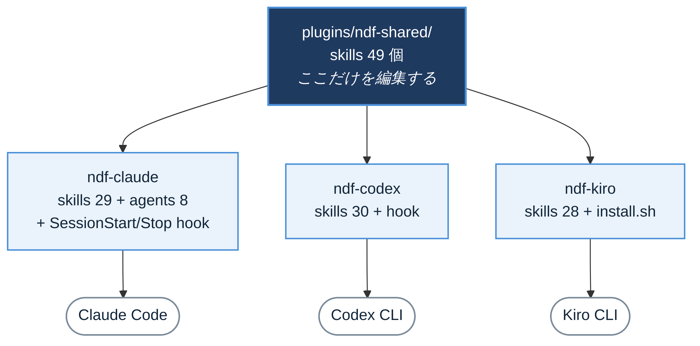
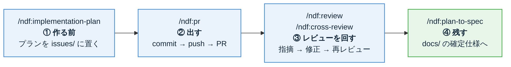
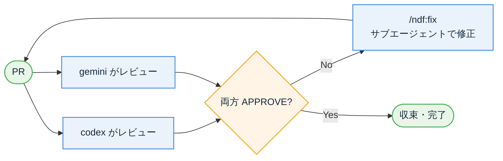

<!-- _class: lead -->
<!-- _paginate: false -->
<!-- _header: '' -->

# ai-plugins

## NDF、実際のところ どう使うのか

社内勉強会 / 2026-08-06
Claude Code・Codex CLI・Kiro CLI 対応

<!--
【0:00-0:35】
NDFが何なのかは前回話したので、今日は「で、結局どのスキルに何が書いてあるのか」をやります。
スキルは手順書じゃなくて、判断基準が書いてあるものだと思ってください。何をやるかより、何を重視するかが本体です。
持ち帰ってほしいのは、PRを1本出す流れがスキルを繋ぐだけで終わる、という感覚ひとつです。
-->

---

# まず全体像を1枚で



<div class="small">

編集するのは `plugins/ndf-shared/` の **1か所だけ**。そこから3ランタイム分の配布物が生成されます。
ほかに MCP プラグインが **10個**（Serena / BigQuery / Playwright / Chrome DevTools / Redash など）。

</div>

<!--
【0:35-1:25】
構成はシンプルです。スキルの本体は ndf-shared の1か所。ここを直すと、Claude用・Codex用・Kiro用の配布物がビルドで生成されます。
なので「Claudeでは直ってるけどCodexでは古い」が起きない。地味ですがこれが一番効いてます。
数が違うのは、ランタイムごとに意味のないスキルを外しているからです。Claudeは29、Codexは30、Kiroは28。
MCPプラグインが10個。今日は時間の都合で名前だけにします。
-->

---

# インストールは2コマンド（Claude Code）

```bash
# 1. マーケットプレイスを登録（初回だけ）
/plugin marketplace add https://github.com/devbasex/ai-plugins

# 2. NDFを入れる
/plugin install ndf@ai-plugins
```

入れると使えるようになるもの:

| | |
|---|---|
| **スキル 29個** | `/ndf:pr`, `/ndf:review` … スラッシュで直接呼べる |
| **エージェント 8個** | director / corder / qa / debugger / devops-engineer など |
| **フック 2種** | SessionStart（transcript保持を90日に維持）/ Stop（AI要約+Slack通知） |

<!--
【1:25-2:10】
インストールはこれだけです。marketplace add は初回だけ、あとは install。
入るものは3種類。スラッシュで呼ぶスキル、裏で働くサブエージェント、それとフック。
Stopフックは作業が終わったらSlackに要約を投げてくれます。長時間タスクを回してる人はこれだけでも入れる価値があります。
では本題、スキルの中身に行きます。
-->

---

# 今日の地図: PRを1本出すまで



この4つに加えて、**全工程に効く「書き方・調べ方」のルール**が3つあります。

| スキル | 何を揃えるか |
|---|---|
| `/ndf:markdown-writing` | 会話も検討過程も知らない第三者に伝わる書き方 |
| `/ndf:investigation-rules` | 「無い」と書くならエビデンスを添える |
| `/ndf:problem-solving` | つじつま合わせをせず、上流で直す |

<!--
【2:10-2:55】
これが今日の地図です。左から、作る前にプランを書き、PRを出し、レビューを回し、最後に仕様書として残す。矢印1本がスキル1個です。
下の3つは順番のどこかに入るものじゃなくて、全工程にかかるルールです。文章を書くとき、調べるとき、バグを直すときに常に効いてくる。
ここからスキルを1個ずつ開けていきます。それぞれ「何が書いてあるか」と「何を重視しているか」の2点で見てください。
-->

---

# ① `/ndf:implementation-plan` — 作る前に書く

<div class="cols">
<div>

### 書いてあること

`issues/` に置くプランの**雛形**。
概要 / 問題・背景 / 修正対象 /
タスク分解 / 影響範囲 / テスト計画。

**作るケース**
複数ファイル・新機能・
既存ロジックの大幅変更・DBマイグレーション

**作らないケース**
typo / 設定値だけ / 1ファイルの軽微な修正

</div>
<div>

### 重視していること

**「なぜ」を残すこと。**
後任か将来の自分が変更意図を追える状態にする。

プランとPR本文の役割を分けています。

| | 役割 |
|---|---|
| プラン | 「なぜ」「どう分解するか」の永続記録 |
| PR本文 | 「何をやったか」のレビュー用サマリ |

</div>
</div>

> 書かずに実装しても、PR作成時に**会話履歴 + `git log` + `git diff` から自動生成**します。

<!--
【2:55-4:00】
1つめ。implementation-plan は issues/ 配下に実装プランを置くスキルです。
左が中身。プランの雛形が決まっていて、概要・背景・修正対象・タスク分解・影響範囲・テスト計画。埋めるだけです。全部の変更に要るわけじゃなくて、判断基準もスライドの通り書いてあります。
右が思想。重視しているのは「なぜ」を残すこと。コードを見れば「何をやったか」は分かるけど「なぜやったか」は消えるので、そこだけ残す。
なのでプランとPR本文で役割を分けていて、同じ内容をコピーするなと明記されています。
下のブロックが実用上ありがたくて、プランを書かずに実装しちゃっても、PRを作る瞬間に会話履歴とgit logとdiffから逆算して生成してくれます。「あとで書く」が実際にあとで書かれる。
-->

---

# ② `/ndf:pr` — commit から PR まで

```bash
/ndf:pr                       # main へ通常PR
/ndf:pr --draft               # ドラフトPR
/ndf:pr "エクスポートAPIを追加"  # コミットメッセージ指定
/ndf:pr qa/staging            # base非main → cherry-pick-pr へ誘導
```

<div class="cols">
<div>

### 書いてあること

引数の解釈ルール（`--draft` / ブランチ名 /
それ以外はコミットメッセージ）、
PR本文の組み立て方、
既存PRがある場合の**本文更新**手順。

</div>
<div>

### 重視していること

**事故を止めること。**
デフォルトブランチへの直接コミットを拒否。
`qa/*` などへの直接PRも止めて
`/ndf:cherry-pick-pr` に誘導します。

</div>
</div>

> 検証ブランチへ直接PRを出すと、そのブランチをマージしたときに環境固有コードが main に混ざる。これを構造的に防いでいます。

<!--
【4:00-5:05】
2つめ、pr。commitしてpushしてPRを作るまで一括です。
引数の解釈が賢くて、--draftならドラフト、ブランチ名っぽい文字列ならベース指定、それ以外はコミットメッセージ。覚えなくても適当に打てば通ります。
既にPRがある状態で叩くと、新しく作らずに本文を今の差分に合わせて書き直します。実装が変わったのに説明文が古いまま、が無くなる。
で、このスキルが一番重視しているのは事故防止です。mainで直接コミットしようとすると止まる。これは何度か救われてます。
もうひとつが下のブロック。qa や staging に feature ブランチから直接PRを出すと、そのブランチをマージしたときに環境固有のコードが main に流れ込む。これを止めて、cherry-pick方式に誘導します。ブランチ運用の事故って気づいたときには手遅れなので、コマンドの側で止めてくれるのはかなり効きます。
-->

---

# ③ `/ndf:review` — 何を優先して見るか

```bash
/ndf:review 123           # Claude 自身がレビュー
/ndf:review 123 codex     # Codex CLI に委譲
/ndf:review 123 gemini    # Gemini CLI に委譲
```

### レビュー観点は順番が決まっています

**言語慣用性 → 可読性 → コード品質 → 保守性 → セキュリティ → テストカバレッジ**

具体的なチェックポイントも明記されています。

- その言語らしい書き方（イディオム・標準ライブラリの活用）
- メモリ効率と演算性能（不要なループ・コピーの排除、キャッシュ）
- 関数50行・ファイル300行が目安。ただしプロジェクトの慣例が優先
- 重複コードは**PRの範囲にこだわらず**まとめるよう指摘する
- 柔軟性を損なう定数化を避け、DBのマスタや json / yaml への外部化を検討する

<!--
【5:05-6:15】
3つめ、review。第二引数でレビュアーをcodexやgeminiに差し替えられます。自分が書いたコードを自分でレビューしても甘くなるので、別のAIに渡すと普通に知らない指摘が出てきます。
中身で面白いのは、観点に優先順位が付いていることです。「いい感じにレビューして」だと指摘が散らかるので、言語慣用性から順に見ろと明示してある。
チェックポイントも具体的で、関数50行・ファイル300行という数字まで書いてあります。ただし「プロジェクトの慣例が優先」と但し書きが付いていて、数字を機械的に当てはめないようになっています。
個人的に効くと思っているのが下の2つ。重複コードはPRの範囲外でもまとめろと書いてある。あとマジックナンバーを見つけたときに、定数にすればいいという話にしないで、DBのマスタやyamlに出せないか考えろと。定数化って一見きれいですが、運用で変わる値を定数にすると次はデプロイが必要になるんですよね。
-->

---

# ③ `/ndf:review` — 指摘の書き方が決まっている

各インラインコメントの先頭に `[重要度 / カテゴリ]` を付けます。

```
[critical / セキュリティ] SQL がエスケープなしで連結されている。プレースホルダ必須。
[major / 可読性] 70 行関数。〇〇 と △△ に分割を推奨。
[minor / 言語慣用性] Python なら内包表記で 1 行化可能。
[nit / スタイル] スペースが揃っていない。
```

| 重要度 | 定義 | 後段の扱い |
|---|---|---|
| `critical` | セキュリティ・データ破損・本番障害につながる | **必ず自動修正** |
| `major` | 保守性・性能・仕様逸脱の重要問題 | **必ず自動修正** |
| `minor` | 改善推奨だがブロッカーではない | 明らかな改善のみ自動修正 |
| `nit` | 好み・スタイル | **修正しない。最後にユーザー判断へ** |

> 総評ではなく**コード行に紐付くインラインコメント**を原則にしています。総評に書けるのは設計レベルの所見だけ。

<!--
【6:15-7:20】
同じくreviewですが、こっちは指摘の書式の話です。
先頭に重要度とカテゴリを付ける。これは見やすさのためだけじゃなくて、この重要度が後段の自動修正の判断に直結しています。criticalとmajorは必ず直す、nitは直さないで最後に人間に見せる。つまりラベルが処理の分岐になっている。
なので「過剰なnit量産は避けろ」とも書いてあります。AIにレビューさせると、どうでもいい指摘を大量に出して仕事した感を出しがちなので、そこを抑えにいっています。
もうひとつ、指摘は必ずコード行に紐付けろというルール。総評に「〇〇が気になります」って書かれても、どこの話か探すところから始まるので。総評に書いていいのは設計レベルの話だけです。
-->

---

# ④ `/ndf:cross-review` — 両AIが納得するまで回す



<div class="small">

最大12ラウンド。8ラウンドで未収束ならPRをローテーション。修正はサブエージェントに投げるのでメインの会話は汚れません。

</div>

<!--
【7:20-8:05】
4つめ、cross-review。codexとgeminiの両方にPRレビューを投げて、両者がAPPROVEを返すまでレビューと修正を自動で回し続けます。
片方がAPPROVEでも、もう片方が指摘を出していれば止まらない。
デフォルトは最大12ラウンド、8ラウンドで収束しなければPRをローテーションします。修正はサブエージェントに投げるので、メインの会話ログは汚れません。
このスキルで一番よくできているのが次のページです。
-->

---

# ④ `/ndf:cross-review` — 観点はPRの中身で切り替わる

変更ファイルを全件取得して分類し、**該当する観点テンプレートだけ**を両AIに渡します。

<div class="cols">
<div>

| 分類 | 渡される観点 |
|---|---|
| `docs_only` | 説明の妥当性、コード・設定との整合 |
| `db_migration` | 型、NULL/default/制約/index、backfill、ロールバック |
| `api_contract` | 互換性、schema、エラー形式、認可 |
| `auth_security` | secret/PII、CSRF/CORS/JWT/OAuth |
| `performance` | N+1、I/O、ロック、cache、冪等性 |

</div>
<div>

ほかに `code` / `test` / `dependency` /
`config_ci` / `frontend` /
`deletion_rename` / `generated` /
`i18n` / `infra` の全**15分類**。

```bash
/ndf:cross-review 123 \
  --focus "ドキュメントとコードの整合性"
```

今回だけの観点は `--focus` で追加。
長いチェックリストはファイルで渡せます
（`--extra-instructions-file`）。
どちらも自動テンプレートの後ろに乗ります。

</div>
</div>

<!--
【8:05-9:15】
cross-reviewの本体はここだと思っています。
PRの変更ファイルを全件取って中身で分類し、その種類に効く観点だけを両方のAIに渡します。ドキュメントだけのPRにN+1の話をされても困るし、マイグレーションを含むPRでロールバック手順を聞かれないのも困る。それを自動で切り替えている。
表に出したのは一部で、全部で15分類あります。マイグレーションならbackfillとロールバック、認証まわりならsecretとPIIとCSRF、という具合です。
これに加えて --focus で今回だけの観点を足せます。長いチェックリストを渡したいときはファイルでも渡せる。
重い処理なので、単発の第二意見が欲しいだけなら前のページの /ndf:review でいいです。そこは使い分けてください。
-->

---

# ⑤ `/ndf:plan-to-spec` — プランを仕様書に変える

<div class="cols">
<div>

### 書いてあること

`docs/` 配下の標準章立て。
概要 / 背景 / 対象範囲 / 仕様 /
データ・設定 / 外部連携 / エラー処理 /
セキュリティ / 運用 / テスト観点 / 関連リンク

**消すもの**
実装タスクのチェックリスト、PR分割計画、
作業担当、破棄された方針、調査メモ、
AIエージェント向けの作業指示

</div>
<div>

### 重視していること

**移動ではなく書き直し。**
プランは作業中の意思決定記録なので、
完了後は「今のコードと一致する記述」だけを残す。

語尾まで変換ルールがあります。

| プラン | 仕様書 |
|---|---|
| 実装する | 提供する / 保持する |
| 修正対象 | 構成 / 関連ファイル |
| テスト計画 | テスト観点 / 検証方法 |

</div>
</div>

> 書いたあとに**実コードと照合**します。書いた設定名やファイルパスが実在するか、実装にある重要な挙動が抜けていないか。

<!--
【9:15-10:25】
5つめ。実装が終わったプランを仕様書に変換します。
ポイントは移動じゃなくて書き直しだということ。プランには「まずAをやってからBをやる」みたいな作業順とか、途中でやめた案とか、AI向けの作業指示が入っていて、それは仕様じゃないので全部落とします。
面白いのが語尾の変換ルールまで書いてあることで、「実装する」は「提供する」に、「修正対象」は「構成」に直す。プランは未来形で書かれていて、仕様書は現在形であるべきなので。細かいですが、これがないと「実装する」が残ったまま仕様書として置かれて、読んだ人が「これまだ実装されてないのか」と誤解します。
最後に実コードと照合する手順まで入っています。書いた設定名やファイルパスが本当に存在するか、逆に実装にある重要な挙動が抜けていないか。仕様書が嘘をつかないようにする工程ですね。
-->

---

# ⑥ `/ndf:markdown-writing` — 第三者に伝わる書き方

読み手は**会話もコードベースも検討過程も知らない第三者**、という前提で書かせるルール。

| # | ルール | ひとこと |
|---|---|---|
| 1 | 説明文に内部識別子・略語を持ち込まない | ❌ `user_subscriptions` の `plan_id` を更新<br>✅ 利用者の契約プランを変更 |
| 2 | 検討過程の痕跡を残さない | 「案A」「壁打ちの結果」「先ほど決めた」 |
| 3 | 変更履歴を本文に残さない | 「以前はXだったが指摘を受けてYに変更した」 |
| 4 | 否定的な結論にはエビデンスを添える | 未確認は「残リスク」として明示。省くと確認済みと読まれる |
| 5 | 個人情報・機密情報を書かない | コミットメッセージは後から消しにくい |
| 6 | 図はインラインで書く | mermaid / math。plantUML・HTML・`<svg>` は使わない |
| 7 | 300行以内。501行以上は分割 | ただし分割で理解が落ちるなら1ファイルのまま |

<div class="small">

書き終えた後の **grep セルフチェック**とチェックリストも用意されています。

</div>

<!--
【10:25-11:40】
6つめ、markdown-writing。v4.20で体裁ルールから可読性ルールに拡張されたやつです。
一番効くのは1番。説明文にテーブル名やカラム名をそのまま書かせない。例を見てください。上は書いた本人には完璧に伝わるけど、読む側には何ひとつ伝わらない。書いた側が説明した気になるのが厄介なところです。
2番3番は、AIに書かせると必ず出るやつです。「案Aを採用しました」とか「指摘を受けて修正しました」とか。それは文書じゃなくてgitとPRに置け、と。文書には「今何が正しいか」だけ書く。
4番は次のページで詳しくやります。
7番は分量ルールですが、単純な行数制限じゃなくて「分割すると理解が落ちるなら分けるな」と例外が書いてあります。
あと、書き終わったあとに走らせるgrepまで用意されています。案Aとか、以前は、みたいな語を機械的に拾う。人力チェックリストで終わらせてないのが良いところです。
-->

---

# ⑦ 「無い」と言う前に — 調査とバグ修正のルール

<div class="cols">
<div>

### `/ndf:investigation-rules`

**否定的な結論にはエビデンス必須。**
「カラムがない」「呼ばれていない」「データがない」は
読み手が最も検証しづらく、外れたときの被害が大きい。

| 主張 | 必須エビデンス |
|---|---|
| カラムが存在しない | `SHOW COLUMNS` の結果 |
| データが存在しない | `COUNT(*)` の結果 |
| 呼び出し箇所がない | 検索コマンドと結果 |

<div class="small">

エビデンスなしで残課題の優先度を「低」にするのは誤判断の典型、と名指しされています。

</div>

</div>
<div>

### `/ndf:problem-solving`

**上流で直す。つじつま合わせをしない。**

```
❌ 異常データ → migrationで論理削除 → 再実行

✅ 異常データ → なぜ入ったか調査
   → 取り込みロジックにバリデーション追加
   → 論理削除 → 再実行
```

修正は**コード → デプロイ → データ修復**の順。
根本原因の修正とデータ修復は別コミットにする（Revertしやすい）。

</div>
</div>

<!--
【11:40-12:50】
7つめ。この2つはセットです。
左のinvestigation-rules。「無い」と書くなら実行結果を貼れというルール。AIはコードを読んだだけで「該当なし」と自信満々に断言するので、それを止めるためのものです。実例として、外部テーブルの一部のカラムだけ見て「該当カラムなし」と結論づけたけど、実は別名のカラムにデータがあった、という失敗がスキルの中に書いてあります。
下の一文が個人的に好きで、エビデンスなしで残課題の優先度を「低」にするのは誤判断の典型、と名指しされている。優先度を下げるのって実質「やらない」なので、そこにこそ根拠が要る。
右のproblem-solving。データがおかしいときに、そのデータだけ直して終わりにするな、と。なぜ入ったかを遡って、入口にバリデーションを足してから直す。あとコードの修正とデータの修復を別コミットにしろと。混ぜるとRevertできなくなるので。
-->

---

# Codex / Kiro でも同じスキルが使えます

<div class="cols">
<div>

### Codex CLI

```bash
codex plugin marketplace add \
  https://github.com/devbasex/ai-plugins
codex plugin add ndf@ai-plugins
```

セッション内では `ndf:` 接頭辞で
**30個**のスキルが使えます。

<div class="small">

Claude版との差: エージェント8個とSessionStart/Stopフックは無し。代わりに Playwright 系スキル5個が入ります。

</div>

</div>
<div>

### Kiro CLI

```bash
git clone \
  https://github.com/devbasex/ai-plugins.git
bash plugins/ndf-kiro/install.sh
kiro-cli chat
```

`.kiro/skills/` に**28個**、
`.kiro/agents/default.json` を生成。

<div class="small">

`--with-slack` でStop時のSlack通知、`--with-codex` でCodex CLI連携を追加。何度実行しても安全（冪等）。

</div>

</div>
</div>

<!--
【12:50-13:40】
CodexとKiroです。ここは「同じものが使える」ということだけ持って帰ってください。
Codexはマーケットプレイス方式で、Claudeとほぼ同じ2コマンド。セッションに入るとndfコロン付きでスキルが並びます。実際に叩いて30個読み込まれているのを確認済みです。
Kiroだけ方式が違って、リポジトリをcloneしてinstall.shを叩きます。.kiro/skills/ 以下にスキルが並んで、エージェント定義も一緒に作られます。何度実行しても壊れないので、更新したら叩き直せばいいです。
-->

---

# まとめ: スキルは「判断基準」が本体

<div class="cols">
<div>

### 流れ

`implementation-plan` → `pr`
→ `review` / `cross-review`
→ `plan-to-spec`

### 全工程に効くルール

`markdown-writing`（伝わる書き方）
`investigation-rules`（エビデンス主義）
`problem-solving`（上流で直す）

</div>
<div>

### 今日から試す3ステップ

1. 入れる
   `/plugin install ndf@ai-plugins`
2. 次のPRで `/ndf:pr` を叩く
3. 出したPRに `/ndf:review` を叩く

</div>
</div>

> どのスキルにも「何をやるか」より先に「何を重視するか」が書いてあります。
> それが人によってブレるところなので、そこだけ揃えるのが狙いです。

<div class="small">

リポジトリ: https://github.com/devbasex/ai-plugins ／ 詳細は `docs/ndf-plugin-reference.md`

</div>

<!--
【13:40-14:30】
まとめです。
今日いろいろ見てきましたが、共通しているのは、どのスキルにも「何をやるか」の前に「何を重視するか」が書いてあることです。レビューなら観点の優先順位、文章なら誰に向けて書くか、調査なら何を根拠とするか。
そこって人によってブレるところで、しかも指摘しづらいところなんですよね。それをスキルに落として揃えているのが、このプラグインの一番の中身だと思っています。
まずは次のPRで pr と review を叩いてみてください。質問あればどうぞ。
-->
