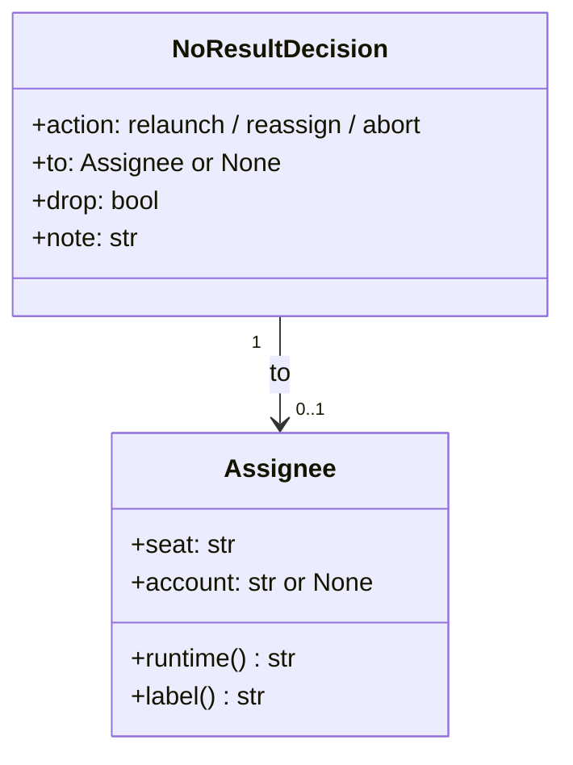

# 結果を残さなかった担当の振り替え: cross-review / cross-refactoring の担当が利用上限か 2 度目の結果なしで止まらず、別の claude のアカウントか残りの参加者へ振り替えて先へ進む

## 目的

- **担当が結果を残さなくても、状態ファイルを手で直さずに実行が先へ進む。** 利用上限と、起動し直した後の 2 度目の
  結果なしでは、同じ実行の中で別の担当へ振り替える。cross-review は `final = error` で止まらず、cross-refactoring は
  実行ごと止まらない。振り替え先が無いときだけ、今までどおり止まる
- **「同じ担当で起動し直すか・誰へ振り替えるか・止めるか」の規則は `plugins/ndf/scripts/lib/assignment.py` の
  `after_no_result` の 1 か所にある。** 2 つの Skill は答えを実行するだけで、自分では決めない（親 #1290）

例: PR #1673 と同じ状況（cross-refactoring の実装の工程で、実装担当の claude が利用上限の 429 で 180 秒で落ちる）を、今の形で通すと次のようになる。

| 時点 | 振る舞い |
| --- | --- |
| 監視 | 理由 `usage_limit` で非ゼロを返す。手順の上限での打ち切り（`timeout` / `stalled`）ではないので、駆動は `refactor.py reassign <ID> implement` を打つ |
| `reassign` | 未コミットの変更を捨て、工程の起点から HEAD までを取り消してから規則に答えを求める。採用済みの項目のコミットは起点より前にあり、触らない |
| 規則 | claude の利用上限なので、登録済みの別のアカウントを先に試す。使えるアカウントが無ければ、残りの参加者から「ホスト → 先頭」で codex を選ぶ |
| 記録と出力 | 結果なしの記録（`no_results`）に 1 件を足し、実装担当を書き換え、`IMPL=codex` と `REASSIGNED='claude=codex:usage_limit'` を出して終了コード 7 |
| 駆動 | 同じ実装の工程を codex で起動する。未確認の項目（`planned` / `tested`）から続け、取り込み → 検証 → 最終ゲートへ進む |
| 結果 | 結果 JSON の `metrics.reassigned` が 1、報告に「振り替え: implement（試行 1）: claude → codex（usage_limit）」の 1 行 |

**手順と出力の読み方は Skill が正である。** ここに書き写さない。

| 何を | 正本 |
| --- | --- |
| cross-review の判定の出口、規則の表、答えごとの出力（`RELAUNCH_*` / `REASSIGNED`）と記録、外した担当を次のラウンドの席から引くこと | [`cross-review` の `docs/01-state-and-review.md`](../../plugins/ndf/skills/cross-review/docs/01-state-and-review.md) の「結果を残さなかったレビュアーの扱い」 |
| cross-review の状態の欄（`no_results` の各欄・`rounds[].reassigned`・`rounds[].seats[].account`） | [`cross-review` の `docs/04-contracts.md`](../../plugins/ndf/skills/cross-review/docs/04-contracts.md) の「重要なフィールド」 |
| `refactor.py reassign` の打ち方・終了コードと駆動がすること・規則の表・工程ごとの取り消しと振り替え先が無いときの扱い | [`cross-refactoring` の `docs/02-plan-and-implement.md`](../../plugins/ndf/skills/cross-refactoring/docs/02-plan-and-implement.md) の「結果を残さなかった担当の振り替え」 |
| 提案担当の全員が結果なしのときの集め直しと `proposer_accounts`、`implementer_account` と `implementer_reason` の `reassigned` | [`cross-refactoring` の `docs/01-state-and-propose.md`](../../plugins/ndf/skills/cross-refactoring/docs/01-state-and-propose.md) |
| 実装担当が替わる条件（振り替えのときだけ）と、再開の当て直しで外した担当を戻さないこと・`metrics.reassigned` | [`cross-refactoring` の SKILL.md](../../plugins/ndf/skills/cross-refactoring/SKILL.md) |
| 最終ゲート修正の振り替えと `no_relaunch` の打ち切り | [`cross-refactoring` の `docs/04-verify-and-report.md`](../../plugins/ndf/skills/cross-refactoring/docs/04-verify-and-report.md) |
| 共有ライブラリの `assignment.py` / `assignee_env.py` / `monitor_outcome.py` の役割の一覧 | [`plugins/ndf/scripts/lib/README.md`](../../plugins/ndf/scripts/lib/README.md) |

この文書が扱うのは、Skill に書かない決定の理由、常に成り立つ条件、規則と環境の部品の契約、`reassign` と judge の内側の
振る舞い、テスト観点である。

## 用語

定義は [用語集](../glossary.md) が正である（`.ndf/glossary.json` の `document`）。この文書で使う語は
「担当」「席」「結果なし」「利用上限」「振り替え」「リトライ可否」「結果なしの記録」「外した担当」「実装担当」「提案担当」
「工程」「未確認」「利用可能な参加者」「固定の組」である。

## 対象範囲

| 扱う | 扱わない |
| --- | --- |
| cross-review のレビューの席が結果を残さなかったときの起動し直し・振り替え・中断 | 担当の輪番と統計による選択（#760） |
| cross-refactoring の実装担当（計画・テスト追加・実装・修正・最終ゲート修正）の振り替えと、未確認の改善項目からの続行 | supervise の worker の担当の選択（`worker_steps.py`） |
| cross-refactoring の提案担当の全員が結果なしのときの集め直し | cross-review の既定の母集合（agy を既定で入れない #542 / #786 の決定 9） |
| claude の利用上限での、登録済みの別のアカウントへの振り替え | 利用上限が解ける時刻を読んで同じ実行の中で担当を戻すこと |
| 外した担当を同じ実行の残りで割り当てない記録（`no_results`） | 監視が理由を決める文言の照合（`usage_limit` の検出） |
| リトライ可否を `monitor_outcome.py` から `assignment.py` へ移すこと | アカウントの登録・使用量の取得（`claude_accounts.py` は使うだけ）、codex / kiro / agy の複数アカウント |

## 背景

担当が結果を残さなかったときの規則は「同じ席・同じランタイムで 1 度だけ起動し直す」だけだった。2 度目の結果なしと、
理由が `usage_limit` のときは、cross-review は `final = error` で止まり、cross-refactoring は監視の非ゼロで実行ごと止まった。
回避は状態ファイルの手編集（`only` を別の担当へ、`final` を `null` へ）か、状態を退避した流し直しだった。

結果なしは特定のランタイムに限らず起きた（#794 の agy 1 件、#819 の codex 2 件の利用上限）。PR #1673 では実装担当の claude が
利用上限で落ち、採用 0・未確認 14・終了コード 4 になった。conductor が worktree を戻して `run --from refactor` で流し直した
2 回目は、15 件中 採用 6 で最終ゲートを通った。振り替え先が同じ未確認の項目を引き継げば、手の作業なしで同じ結果に届く。

リトライ可否は `monitor_outcome.py` の `NO_RELAUNCH_REASONS` / `relaunch_same_agent` が持ち、その先（偽のときに何をするか）は
judge と cross-refactoring の取り込みがそれぞれ決めていた。規則が 3 か所に散り、振り替えを足すと 3 か所に同じ分岐が要った。

## 決定と理由

- **規則は `assignment.after_no_result` の純粋な関数に置き、リトライ可否も `assignment.py` へ移す。** 答えと振り替え先は記録・
  参加者・理由だけで決まるため、副作用の無い関数にすれば全分岐を単体テストで見られる。`LaunchOutcome.relaunch_same_agent` と
  `ClosedAttempt.relaunch_same_agent` も消した。起動結果が可否を持つと、規則を変えるときに触る場所が 2 つになる。
  Skill ごとに振り替えの関数を置く形は、同じ役割の関数を 2 つ持つことになる（#1142）
- **外した担当は欄に持たず、追記だけの結果なしの記録（`no_results`）から導く。** 外した担当・claude の今のアカウント・起動し直し
  済みかは `excluded_runtimes` / `current_account` / 規則の順 1 が記録から導く。導いた値を別の欄に持つと、記録と欄が食い違いうる。
  `participants.available` から消す形は、初期の解決の記録が失われ、再開で参加者を作り直したときに外した者が戻る
- **振り替え先の順は実装担当の決め方と同じ「ホスト → 先頭」（`choose_implementer`）にする。** 選び方の規則が 1 つで済み、
  ホストは認証が通っている見込みが最も高い。cross-review の席の輪番（`review_seats`）は次のラウンドから表のとおりに戻るため、
  「ホスト → 先頭」になるのは 1 ラウンドの中の振り替えだけである
- **claude の利用上限では、別のランタイムより先に別のアカウントを試す。アカウントへの振り替えは利用上限のときだけ。**
  同じランタイムのまま席の役割（レビューの観点・実装担当）を保てる。上限以外の結果なしはアカウントを替えても解ける見込みが無い
- **アカウントの選び方は呼ぶ側が関数（`pick_account`）として渡し、子の環境は起動のたびに名前から組む。** `claude_accounts.choose`
  は使用量を取りに行くため、規則の関数が呼ぶと単体テストで差し替えられない（`resolve_participants` が認証確認を `probe` で受ける
  のと同じ形）。環境は `CLAUDE_CONFIG_DIR` のパスを含み、打ち直しのたびに作り直せば足りるため、状態ファイルにも耐久の記録にも書かない
- **cross-review の振り替えは judge の終了コード 7 の経路に載せ、`REASSIGNED` の 1 行を足す。** 起動し直しと振り替えは駆動の
  動き（席を起動して監視し、もう一度 judge）が同じで、新しい終了コードを足すと駆動と手順の文書の両方に出口が増える。既存の
  `RELAUNCH_*` の 3 行は「同じ席で起動し直す席」の意味のまま残す。駆動の「7 は 1 度だけ」の旗は外し、回数の上限は記録が持つ
- **振り替えた後のラウンドは `reviewers` / `seats` を振り替え先へ書き換え、元の席の結果なしの欄は残す。** judge と反証は
  `reviewers` の席の結果を読むため、書き換えなければ元の席の `NO_RESULT` が次の judge でも数えられる。ラウンドを閉じて次の
  ラウンドで振り替える形は、上限のラウンド数を 1 つ使い、利用上限のたびに収束までのラウンドが減る
- **cross-refactoring の実装担当の振り替えは、工程を流し直さず同じ工程の中で起動を足す。** 起動・監視・`reassign` はどれも既存の
  耐久ステップで、打ち直しは記録した順に再生される。工程を流し直すと `start-phase` の起点と締め切りの扱いを変えることになり、
  PR #1673 の手当て（`run --from refactor`）と同じ費用が残る。`fix` と `final-fix` は同じ工程の中で起動し直さず、今の流れ
  （取り込み → 次の修正）のまま担当だけを替える。`final-fix` の同じラウンドでもう一度起動すると、取り込みの「閉じ済みか」
  （`already_closed`）が 2 回目の結果を読まずに返す
- **cross-refactoring では、監視が手順の上限で止めた起動（`timeout` / `stalled`）を振り替えの対象にしない。** 上限での打ち切りは
  設計どおりの起動結果で（cross-refactoring の決定 23）、取り込みが締め切りとして扱う。振り替えると、上限を使い切った工程を別の
  担当がもう一度上限まで回す。cross-review の `timeout` / `stalled` は規則へ渡す（1 度起動し直し、2 度目は振り替え）
- **起動し直し済みかの照合の鍵は「工程・試行・席・アカウント」にする。** アカウントへの振り替えでは席の名前が変わらないため、
  席だけで照合すると新しいアカウントの担当が「起動し直し済み」と読まれ、1 度目の結果なしで外れる
- **修正の工程（`fix` / `final-fix`）では、1 つ前の試行の起動し直しも同じ件として照合する（`relaunch_next_attempt`）。**
  この 2 つの起動し直しは次の試行として起動され、試行番号が起動ごとに進む。試行番号だけで照合すると一致が毎回外れ、同じ担当を
  締め切りまで起動し直し続ける
- **固定の組（`review_seats`）は、どちらかのランタイムが振り替えか中断の元になった時点で、同じ実行の残りでは渡さない。**
  claude のアカウントへの振り替えも含む。固定の組は「その 2 者で毎ラウンド回る」前提で、片方が 1 度でも結果を残さなかった実行では
  前提が崩れている
- **再開の規則「リファクタリング計画の後は実装担当を替えない」は残し、同じ実行の中の振り替えには当てない。** 再開で止めるのは
  見積りと項目の対応を読む者が食い違うためで、振り替えでは計画・項目・締め切りがそのまま引き継がれ、記録に誰がいつ替わったかが
  残る。再開の当て直しは、記録の外した担当を参加者から引いてから行う。引かなければ外した担当が再開で実装担当に戻る
- **振り替えの後も工程と項目の締め切りは延ばさない。** 締め切りは想定最大時間から算術で出した値で、延ばすと実行の全体が予算を
  超える。間に合わない項目は今のとおり `not_done` で見送られる
- **振り替えは新しい副命令 `reassign` に置き、取り込み（`merge-*`）には入れない。** `plan` / `add-tests` / `implement` の取り込みは
  結果ファイルを読まずに git のコミットだけで判定する。`reassign` は「監視の後、取り込みの前」の 1 か所で、6 つの工程に同じ手順を
  当てる。`final-fix` の範囲の取り消しは今のとおり `merge-final-fix` が持ち、`fix` は範囲を取り消さない（今の `merge-fix` が
  `Item-Id` で受け取り、次の `verify` が範囲テストで見直す。取り消しを足すと見直しの前に修正を捨てる）
- **`fix` で振り替え先が無いときは、最終ゲートの `final_gate.no_relaunch` を流用せず `fix_no_relaunch` を立てる。** 流用すると
  最終ゲートへ来る前に最終ゲート修正まで止まる。`fix_no_relaunch` を読むのは `converge._fix_stop` の 1 か所で、範囲テストの経路も
  全体テストの経路も同じ判定で止まる
- **提案の振り替えで実装担当のランタイムが外れたら、`reassign` が実装担当を選び直して `IMPL` で返す。** 外れたランタイムのまま
  計画へ進むと、計画の起動が同じ利用上限に当たってから振り替わる。claude のアカウントだけが替わったときも、利用上限に当たった
  元のアカウントで次の工程を起動しないよう、実装担当のアカウントを合わせる
- **`worker_steps.py` の担当の選択はこの課題で触らない。** supervise の worker の担当で起動の経路が違い、#760 の輪番・統計と
  同じ層で直す。`after_no_result` は輪番を持たず、`review_seats` と `choose_implementer` の形を変えないため、#760 と食い違わない

## 仕様

### 常に成り立つ条件

| # | 条件 | 破れたときの扱い |
| --- | --- | --- |
| I1 | 結果なしの記録（`no_results`）は追記だけで、既存の件を書き換えない・消さない。打ち直しで同じ件を重ねない | テストが落ちる |
| I2 | 答えが `reassign`（別のランタイムへ）か `abort` の件の元のランタイムは、同じ実行の以後の席・実装担当・振り替え先に選ばれない（`-2` の席を含む） | テストが落ちる |
| I3 | 振り替え先は、その実行の利用可能な参加者（`participants.available`）の中だけから選ばれる。母集合の外の者・`.ndf/runtimes.json` の `allowed` の外の者は返らない | テストが落ちる |
| I4 | 同じ工程・同じ試行で、同じ担当（席とアカウント）の答えが `relaunch` になるのは 1 度だけ。アカウントを替えた担当はもう 1 度起動し直せる | テストが落ちる |
| I5 | 1 回の実行の `reassign` の件数は、参加者の数と登録済みアカウントの数の和を超えず、候補が尽きれば `abort` で終わる | テストが落ちる |
| I6 | 別のランタイムへの振り替えは、同じラウンドのもう一方の席のランタイムを候補から引く（`busy`）。同じ呼び出しで 2 席を振り替えても、2 席のランタイムは重ならない。アカウントだけを替える振り替えは同じ席のまま | テストが落ちる |
| I7 | `plan` / `add-tests` / `implement` で振り替え先を起動する前に、結果を残さなかった起動の範囲（工程の起点から HEAD）と未コミットの変更を捨てる。採用済みの項目のコミットは範囲に入らない | 範囲を確定できなければ振り替えず、終了コード 4 で中断する |
| I8 | `--only`（1 者指定）の実行では答えが `reassign` にならない | テストが落ちる |
| I9 | 子の環境へトークン・スコープの変数を渡さない。アカウントの環境は `claude_accounts.account_env` の作るものだけで、状態ファイル・耐久ステップの引数・出力の行にはアカウントの名前だけを書く | テストが落ちる |
| I10 | 結果なしが起きない実行では、席・実装担当・状態ファイルの既存の欄・出力の行・終了コードが変更前と同じ（`metrics.reassigned` が 0 で増えるだけ） | テストが落ちる |
| I11 | `relaunch_same_agent` と `NO_RELAUNCH_REASONS` を持つのは `assignment.py` だけで、`monitor_outcome.py` と 2 つの Skill の `scripts/` に現れない | 下の検索が 1 件以上になる |

I11 の検索（0 件であること）:

```bash
grep -rn "relaunch_same_agent\|NO_RELAUNCH_REASONS" plugins/ndf/scripts/lib/monitor_outcome.py plugins/ndf/skills/cross-review/scripts plugins/ndf/skills/cross-refactoring/scripts
```

### 規則（`plugins/ndf/scripts/lib/assignment.py`）

規則の表（順 1〜5）は Skill の文書と `after_no_result` の docstring が持つ。ここには関数の契約だけを置く。

| 関数・定数 | 契約 |
| --- | --- |
| `NO_RELAUNCH_REASONS` | 同じ担当で起動し直しても解けない理由の集合（`usage_limit` / `model_unavailable` / `auth_expired`。後の 2 つは[参加の確認](cross-participant-admission-check.md)）。理由を足すときはこの集合だけを見直す |
| `relaunch_same_agent(reason)` | リトライ可否。`reason` が `NO_RELAUNCH_REASONS` に無ければ真 |
| `after_no_result(failed, reason, *, available, log, step, attempt, host, busy=(), only=False, initial_account=None, pick_account=None, relaunch_next_attempt=False)` → `NoResultDecision` | 規則の正本。副作用を持たず、記録は呼ぶ側が書く。例外を出さない（`failed.seat` が `SEAT_PATTERN` に合わないときだけ `AssignmentError`）。`busy` は同じラウンドのほかの席（実装担当では空）。`pick_account` が無ければアカウントへ振り替えない |
| `excluded_runtimes(log)` | 外した担当: `decision` が `abort` の件と、`to` のランタイムが `seat` のランタイムと違う `reassign` の件の、`seat` のランタイム |
| `current_account(log, runtime, initial)` | ランタイムの今のアカウント。記録の最後の、そのランタイムへの `reassign` の `to_account`。無ければ `initial` |
| `seats_pool(available, log)` | 席と実装担当を選ぶ母集合。`available` から外した担当を引く |
| `pinned_in_force(pinned, log)` | 固定の組を今も使うなら組、どちらかのランタイムが `reassign` か `abort` の元になっていれば `None` |
| `no_result_entry(step, attempt, failed, reason, decision, at)` | 記録の 1 件（2 つの Skill で同じ形）。`to` / `to_account` は `reassign` のときだけ埋め、ほかは空文字 |
| `RELAUNCH` / `REASSIGN` / `ABORT` | 答えの値 `relaunch` / `reassign` / `abort` |

**試したアカウント**（順 3 で `pick_account` へ渡す集合）は、結果なしの担当のアカウント（席にアカウントが無ければ、起動した
CLI が環境から継承した `initial_account`）と、記録の claude の件の `account` / `to_account` である。継承したアカウントを含めない
と、同じ上限のアカウントへ振り替わる。



`Assignee.label()` は報告の形で、アカウントがあれば `<席>@<アカウント>`。`NoResultDecision.to` は `relaunch` なら元の担当、
`reassign` なら振り替え先、`abort` なら `None`。`drop` は元の担当を外したか（別のランタイムへの `reassign` と `abort` で真）。

### 担当の環境（`plugins/ndf/scripts/lib/assignee_env.py`）

| 関数 | 契約 |
| --- | --- |
| `initial_account(environ=None)` | 起動したときの claude のアカウント（`NDF_CLAUDE_ACCOUNT`）。無ければ `None`（共有の設定） |
| `seat_env(seat, account, base=None)` | 担当の起動の環境。claude の席にアカウントがあれば `claude_accounts.account_env` の環境、無い・用意できなければ `base` の写し |
| `pick_account(tried, base=None)` | 試したアカウントの外から、環境を用意できるアカウントの名前を返す。登録が無ければ使用量を取りに行かずに `None` |
| `account_picker(base=None)` | `pick_account` を `base` に固定した関数。`after_no_result` の `pick_account` に渡す形 |

`claude_accounts` は使うときだけ import し、認証の情報のファイルはこのモジュールから開かない。環境を組むのは起動の直前だけで、
cross-review の駆動はレビューと反証（`critique-round.sh`）の起動で、cross-refactoring の駆動は耐久ステップ
`refactor_drive.call` の中で、席とアカウントの名前から組む。

### cross-review の judge の内側

- 結果なしの席を並びの順に規則へ渡す。`busy` は今のラウンドの席から自分を除いたもので、先に振り替えた席は振り替え先に
  置き換わっている（I6）
- 答えはすべて記録へ追記してから出口を決める。1 席でも `abort` なら `final = error` で、メッセージにこのラウンドの記録の件
  （`<担当>=<理由>→<答え>`）を並べる
- `rounds[].relaunched` は既存の読み手のために今の形で書き続けるが、規則は記録だけを読む。`rounds[].reassigned` は同じ
  `{from, to, to_account}` を重ねない
- 次のラウンドの `start-round` は、`seats_pool` と `pinned_in_force` を通して席を選ぶ。claude の席には `current_account` の
  アカウントを `seats[].account` に付ける（`participants.round_accounts`）。席を選べなければ（`AssignmentError`）ラウンドを開かず
  `final = error`・終了コード 1 にする

### cross-refactoring の `reassign` の内側（`refactor_lib/commands/reassign.py`）

| 項目 | 契約 |
| --- | --- |
| 結果なしの判定 | `read_result` の結果があるか、理由が `STOPPED_REASONS`（`timeout` / `stalled`）なら `REASSIGN=none`・0 |
| 記録の `attempt` | `fix` は `fix.attempt`、`final-fix` は `final_gate.fix_rounds`、ほかは 1（`step_attempt`） |
| 担当の読み方 | 実装担当は `implementer` と `implementer_account`、`final-fix` は `final_gate.impl` |
| 打ち直し | 同じ工程・試行・席・アカウントの件が、その起動の監視の終わり（`ended_at`）より後に記録済みなら、規則を呼ばずに記録した答えを出し直す。保存は出力の前に行う |
| 範囲の取り消し | `plan` / `add-tests` / `implement` だけ。`worktree.discard_impl_leftovers` で未コミットの変更を捨ててから `intake.close_without_result` |
| 担当の書き換え | `reassign` なら `implementer`・`implementer_account`・`implementer_reason = reassigned`・ランタイムが替われば `implementer_model`。`final-fix` は `final_gate.impl` も |
| `abort` の旗 | `fix` は `fix_no_relaunch`、`final-fix` は `final_gate.no_relaunch`。ほかの工程は旗を立てない |
| `propose` | `--seats` で起動した担当を受ける（省くと `runtimes`）。1 者でも結果があれば 0。監視が上限で止めた提案担当は起動し直さず振り替えない（全員がそうなら 3）。`busy` は同じ呼び出しで起動した者と、先に選んだ振り替え先 |

**取り込みは実際に起動した担当の結果を読む。** `merge-fix` と `merge-final-fix` は `reassign` が担当を書き換えた後に打たれる
ため、`intake.ran_seat(state, step, attempt, current)` が記録のその工程・試行の `reassign` の元の席を返し、その席の結果と観測した
モデルを読む。

### 状態ファイルに足した欄の書き手と読み手

欄の形は正本の表の文書が持つ。既存の欄は消さず、意味も変えない。欄の無い状態ファイルは「結果なしの記録が 0 件」として読む。

| 状態ファイル | 欄 | 書く者 | 読む者 |
| --- | --- | --- | --- |
| 両方 | `no_results` | cross-review の `judge`、cross-refactoring の `reassign` | 規則・`start-round`・`setup._recheck_implementer`・`intake.ran_seat`・報告・`metrics.reassigned` |
| cross-review | `rounds[].seats[].account` | `start-round`・`judge` | 駆動（起動の環境）・`judge`（結果なしの担当） |
| cross-review | `rounds[].reassigned` | `judge` | 報告・`judge`（重ねない判定） |
| cross-refactoring | `implementer_account` | `reassign`（振り替え）、`setup`（再開の当て直しで空にする） | 駆動（起動の環境）・`reassign` |
| cross-refactoring | `proposer_accounts` | `reassign`（`propose`） | 駆動（起動の環境）・`reassign` |
| cross-refactoring | `fix_no_relaunch` | `reassign`（`fix` の `abort`） | `converge._fix_stop` |

## テスト観点

- 規則の 5 つの組（`usage_limit` 以外の 1 度目 → `relaunch`、`usage_limit` → `reassign`、起動し直した後 → `reassign`、外した担当と
  `busy` は振り替え先にならない、候補が尽きた → `abort`）（`plugins/ndf/scripts/tests/test_lib_assignment.py` の
  `test_first_no_result_other_than_usage_limit_relaunches_the_same_agent` ほか）
- 修正の工程で次の試行へ持ち越した起動し直しを同じ件として数えること（`test_a_relaunch_carried_to_the_next_attempt_counts_as_the_same_relaunch`）
- 利用上限で外したランタイムは `-2` の席を含めて外れ、振り替え先は利用可能な参加者の中だけから選ばれること
  （`test_a_runtime_dropped_by_usage_limit_is_out_including_its_second_seat`・`test_the_target_comes_only_from_the_available_participants`）
- claude の利用上限は別のアカウントを先に試し、継承したアカウントを試行済みに数え、使えるアカウントが無ければ別のランタイムへ、
  上限以外の理由ではアカウントを試さないこと（`test_claude_usage_limit_moves_to_another_account_first`・`test_an_inherited_account_counts_as_tried`・
  `test_claude_without_a_spare_account_moves_to_another_runtime`・`test_accounts_are_not_tried_for_reasons_other_than_usage_limit`）
- `--only` で振り替えないこと、アカウントを替えた担当はもう 1 度起動し直せること、`reassign` の件数が参加者とアカウントの和を
  超えないこと（`test_only_never_reassigns`・`test_an_agent_on_a_new_account_may_relaunch_once_more`・`test_reassignments_never_exceed_participants_plus_accounts`）
- `NO_RELAUNCH_REASONS` を差し替えると答えが変わること（規則の正本が 1 か所。`test_the_reassignment_rule_follows_the_relaunch_set`）、
  固定の組が振り替えの後に外れること、記録の 1 件が名前だけを持つこと（`test_pinned_seats_are_dropped_once_either_runtime_was_replaced`・`test_the_entry_holds_only_names`）
- 環境はアカウントの席だけがアカウントの環境になり、`pick_account` は試したアカウントを飛ばして名前だけを返し、登録が無ければ `None`
  （`plugins/ndf/scripts/tests/test_lib_assignee_env.py`）
- cross-review: 利用上限の席が残りの参加者へ振り替わる・1 度目は同じ席で起動し直す・2 度目は振り替わる・候補が無い（2 者・`--only`）
  と試した担当を並べて止まる・2 席のランタイムが重ならない・claude は同じ席で別のアカウントへ・外したランタイムは以後のラウンドに
  出ない・固定の組が外れる・報告に振り替えと外した担当が載ること（`plugins/ndf/skills/cross-review/tests/test_reassign_seat.py`）
- cross-review の駆動が、利用上限と 2 度続いた `stalled` の席を振り替え先で起動して judge し直し、`final = error` にならずに進むこと
  （`test_drive_runs_the_reassigned_seat_and_moves_on`）。振り替え先の起動の席（`claude@<アカウント>` は元の席）（`test_drive_launches_the_seat_of_the_reassignment`）
- cross-refactoring: 実装の工程の利用上限で範囲を取り消して実装担当を替える・1 度目は同じ担当で起動し直す・候補が無ければ止まる・
  結果ありと上限での打ち切りは結果なしとしない・打ち直しは記録した答えを出し直す・claude は別のアカウントで名前だけを残す・
  未コミットの変更を先に捨てる（`plugins/ndf/skills/cross-refactoring/tests/test_reassign.py`）
- `fix` で候補が無ければ `fix_no_relaunch` だけが立って範囲を取り消さず、候補があれば次の修正から替わり、次の試行へ持ち越した
  起動し直しの後の結果なしで振り替わること（`test_a_fix_without_a_candidate_raises_only_the_fix_flag`・`test_a_fix_with_a_candidate_switches_the_next_fix`・
  `test_a_fix_relaunched_on_the_next_attempt_moves_after_a_second_no_result`）
- 提案は一部の結果なしなら続き、全員の結果なしなら提案していない担当（claude の別のアカウントを含む）で集め直し、候補が無いか
  全員が上限で止められたら止まり、実装担当のランタイムが外れたら選び直すこと（`test_reassign.py` の `test_a_partial_no_result_in_propose_goes_on` ほか）
- 最終ゲート修正の利用上限は、候補があれば次の修正ラウンドが振り替え先で起動され、無ければ今の打ち切りになること
  （`plugins/ndf/skills/cross-refactoring/tests/test_final_fix.py` の `test_a_usage_limit_on_the_final_fix_moves_to_another_participant`・`test_a_usage_limit_without_a_candidate_stops_the_fix`）
- PR #1673 と同じ状況（実装の工程で利用上限）で、駆動が `reassign` の返した担当で同じ工程を起動して取り込みへ進み、提案の
  振り替えでも集め直すこと（`plugins/ndf/skills/cross-refactoring/tests/test_refactor_drive_resume.py` の
  `test_a_reassigned_implementer_runs_the_same_phase_and_merges`・`test_propose_gathers_again_from_the_reassigned_proposer`）
- 報告に振り替えの行が並ぶこと（`test_reassign.py` の `test_the_report_lists_each_reassignment`）
- 結果なしの起きない実行の振る舞いは、既存の cross-review と cross-refactoring のテストがそのまま通ることで確かめる
- Skill の文書の読み方は `.md` の文言を照合するテストで縛らない。レビューで読む

## 未確認のまま残ること

| 項目 | 内容 |
| --- | --- |
| 共有の設定と登録済みアカウントが同じログインのとき | 共有の設定（`NDF_CLAUDE_ACCOUNT` が無い）で上限に当たると、同じ人の同じ組織のアカウントが登録されていれば、同じ上限へ振り替わりうる。リリース後テストで、上限の後の 2 件目の記録の理由で確かめる |
| 振り替えた後の締め切り | 振り替えまでに締め切りを使い切った項目は `not_done` になる。PR #1673 では落ちるまで 180 秒で影響は小さいと見込むが、測っていない |
| `pick_account` の所要 | judge と `reassign` の中で使用量の取得が走る。上限の後の 1 回だけで、所要は測っていない |
| agy を `--include agy` で戻したとき | 規則は同じに当たるが、agy の結果なしの理由の分布は #794 の 1 件しか無い |

## 関連リンク

- [`plugins/ndf/scripts/lib/assignment.py`](../../plugins/ndf/scripts/lib/assignment.py)（`after_no_result` の docstring に規則の表）
- [`plugins/ndf/scripts/lib/assignee_env.py`](../../plugins/ndf/scripts/lib/assignee_env.py)
- [`cross-review` の `docs/01-state-and-review.md`](../../plugins/ndf/skills/cross-review/docs/01-state-and-review.md)
- [`cross-refactoring` の `docs/02-plan-and-implement.md`](../../plugins/ndf/skills/cross-refactoring/docs/02-plan-and-implement.md)
- [cross-review-launch-outcome.md](cross-review-launch-outcome.md)（起動 1 回の起動結果と理由の語彙）
- [cross-review-participants-and-seats.md](cross-review-participants-and-seats.md)（参加者と席）
- [cross-refactoring-participants.md](cross-refactoring-participants.md)（参加者と実装担当）
- [cross-refactoring-apply-intake.md](cross-refactoring-apply-intake.md)（結果なしの取り込みと範囲の取り消し）
- 課題: #919（親 #1290。由来 #542・#786。関連 #760・#1389・#1576）・Pull Request #1731
