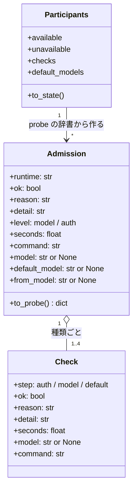
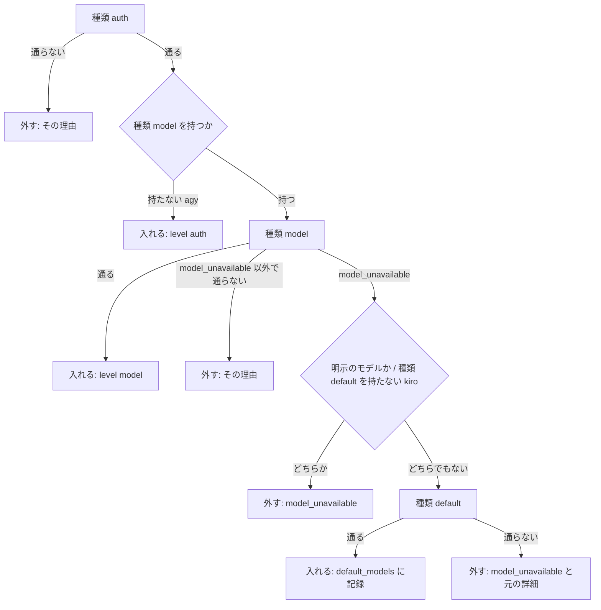

# 参加の確認: 認証だけを確かめた CLI がモデルを引けず・認証が失効していて結果を残さずにラウンドを潰す → 起動の前にモデルを 1 回引いて外すか既定のモデルへ切り替え、途中で起きても起動し直さずに振り替える

## 目的

- **cross-review / cross-refactoring の `init` と `external-ai.py check` が「使える」と判定した CLI は、実際にモデルを 1 回引ける。**
  モデルを引けない CLI と更新トークンが失効した CLI は起動の前に担当から外れ、理由が 1 行で出る
- **設定のモデルを引けないだけなら、CLI の既定のモデルで担当に入る。** 利用者が引数で明示したモデルは黙って上書きしない
- **確認の後で同じ形が起きても、監視が理由を付けて止め、同じ担当で起動し直さずに振り替える**
- 「どの CLI を担当に入れるか」「既定のモデルへ切り替えるか」の判断は `plugins/ndf/scripts/lib/assignment.py` の `admit` の 1 か所にある

例: #461 の観測（PR #460）と同じく、`codex login status` は通るが設定のモデルが廃止されて `codex exec` が
`unexpected status 404 Not Found: The model ... does not exist or you do not have access to it` を返す状況を、今の形で通すと次のようになる。

| 時点 | 振る舞い |
| --- | --- |
| 認証確認 | `codex login status` が通る |
| 最小の呼び出し | 404 の文言で `model_unavailable` |
| 既定のモデルでの引き直し | モデルを引数で明示していないので `--ignore-user-config` で引き直し、標準エラーの見出し `model: <名前>` から既定のモデルを読む。その名前を利用者の設定のまま `--model <名前>` でもう 1 回引いて通る |
| 記録と出力 | `participants.default_models.codex` に既定のモデルの名前、`participants.checks.codex.from_model` に元のモデルの名前が残り、`↪ codex: 設定のモデル … を引けないため、既定のモデル … で担当に入れる（… 秒）` を出す |
| 起動 | 担当の起動側が状態ファイルから `--model <既定のモデル>` を読んで codex を起動する |
| 途中で同じ形が起きたとき | 監視が `err.log` の 404 の行で `EARLY_ERROR`・理由 `model_unavailable` を付けて止め、`after_no_result` が起動し直さずに別のランタイムへ振り替える |

**手順と出力の読み方は Skill が正である。** ここに書き写さない。

| 何を | 正本 |
| --- | --- |
| 参加の確認の 3 種類（認証確認・最小の呼び出し・既定のモデルでの引き直し）、持ち時間、理由の語、`init` の出力の行、再開での使い回し | [`cross-review` の `docs/05-pool-and-convergence.md`](../../plugins/ndf/skills/cross-review/docs/05-pool-and-convergence.md) |
| cross-refactoring の `init` の確認 | [`cross-refactoring` の SKILL.md](../../plugins/ndf/skills/cross-refactoring/SKILL.md) |
| `external-ai.py check` の `metrics.reason` / `metrics.default_model` と、続く `run` に `--model` を渡すこと、失敗の読み方 | [`external-ai` の SKILL.md](../../plugins/ndf/skills/external-ai/SKILL.md) と [`corder`](../../plugins/ndf/agents/corder.md) |
| 結果なしの規則（`after_no_result`）と振り替えの出力 | [結果を残さなかった担当の振り替え](cross-assignee-reassignment-on-no-result.md) |

## 用語

用語（参加の確認・利用可能な参加者・認証確認・モデルを引けない・認証の失効・既定のモデルへの切り替え）の定義は
用語集（[docs/glossary.md](../glossary.md)）にある。

## 対象範囲

| 含む | 含まない |
| --- | --- |
| `lib/auth.py` の確認の実行、`lib/assignment.py` の `admit` と `resolve_participants`、`lib/monitor_patterns.py` の 2 つの致命の表、`lib/monitor_scan.py` の理由つきの照合、`lib/monitor_outcome.py` の理由の語彙、`NO_RELAUNCH_REASONS`、3 つの起動側のモデルの式 | 振り替えの規則の行の順と振り替え先の選び方（#919）、計画の worker の振り替え、母集合の既定、利用者の CLI の設定ファイルの書き換え、ログインのし直しの自動化 |

## 背景

`init` と `external-ai.py check` の確認は認証だけを見ていた。設定のモデルを引けない CLI（#461 の 404、#1589 の 400）と
更新トークンが失効した CLI（#461 の 3 件）も `✅` で担当に入り、結果を残さずに終わった。その文言は監視の致命の語彙に
無く `missing` に畳まれ、同じ担当で起動し直してもう 1 回分を失い、ラウンドが `final = error` で止まった。
原因は `err.log` を開くまで分からなかった。

## 決定と理由

| 決定 | 理由 |
| --- | --- |
| 確認は担当の起動と同じ CLI・同じモデルの指定で、固定の問いに 1 回答えさせる。モデルの一覧（`codex debug models`・`agy models`）に名前があるかでは判定しない | #461 の 404 は一覧にあっても権限で起き、一覧にあることは引けることを示さない |
| claude の最小の呼び出しは道具・MCP・Skill・会話の保存を切り、指示書を読ませない | 応答の有無は変わらず、費用が 0.44 から 0.02 米ドルへ下がる（2026-10-06 の実測） |
| agy はモデルの確認を持たず、認証確認だけで担当に入る | 未認証の環境で形を測れず、書く前に実行して確かめる決まりに従う。agy は既定の母集合の外で、`--include agy` のときだけ参加する |
| 既定のモデルは CLI 自身に選ばせる。codex は `--ignore-user-config` で引いて見出しのモデル名を読み、claude は `--model default` を使う。目録の `priority` から選ぶ形は採らない | 目録の並びは CLI の既定の決め方と一致する保証が無い。どれも利用者の設定ファイルを書き換えない |
| codex は読めた既定のモデルを、利用者の設定のまま `--model <名前>` でもう 1 回引き、通ったときだけ採る（`CONFIRM_DEFAULT`） | `--ignore-user-config` は提供元（`model_provider` など）の設定も外す。担当は利用者の設定のまま起動するため、起動と同じ条件で確かめる |
| kiro は既定のモデルへの切り替えの対象にしない。明示したモデルに `failed to set model` が返れば `model_unavailable` で外す | kiro-cli 2.24.1 は `--model` を受けず警告だけ出して既定のモデルで答える。入れると明示した利用者の計測が別のモデルの値になる |
| 確認の進め方と合否は `assignment.admit`、実行と出力は `auth.probe_auth`、文言は `monitor_patterns` に置く。`admit` は CLI を呼ばず、確認の実行を引数（`check`）で受ける | 判断の置き場を 1 つにし、全分岐を偽の `check` の単体テストで見る。確認と監視が同じ文言の表を読み、片方だけ古くなる形を作らない |
| 致命の文言は行頭（`ERROR:` の前置きを許す）から文言までを 1 つの一致にする | #1589 の 400 は JSON の文字列の中に文言があり、文言だけに一致させると引用の除外（`_match_is_quoted`）が捨てる。差分（`+` の行）と Markdown の表・リストの行は今の除外が働く |
| 確認の最小の呼び出しが利用上限を返したら通す | 確認で外すと、claude のアカウントへの振り替え（#919 の規則）が働く前に担当から消える。上限の扱いは監視と `after_no_result` に任せる |
| 確認の結果は再開で使い回し、参加者に関わる引数を渡した再開だけ確かめ直す | 再開のたびに確かめると 1 者 5 秒前後と claude の費用が足される。確認の後の失敗は監視と振り替えが拾う |
| 参加者ごとに並行に走らせ、120 秒の持ち時間を 1 者の 3 種類の確認で共有する | 種類ごとに 120 秒を与えると、既定のモデルへの切り替えを含む 1 者が最大 360 秒かかる |
| `external-ai.py run` は認証確認だけ、`check` はすべての種類を通す | `run` は確認の直後に同じ CLI を起動するため、最小の呼び出しは起動 1 回分を足すだけになる。`check` は「使えるか」を問う入口なので `init` と同じ確認を通る |
| `check` が既定のモデルへの切り替えで通ったときは `outcome=ok` に `metrics.default_model` を添え、`next` で `run --model` を案内する。切り替えずに落とす形は採らない | `run` は状態ファイルを持たず、`--model` が無ければ設定のモデルのまま起動して同じ形で落ちる。落とすと `init` と `check` の答えが食い違う |
| 切り替えは `models` へ書かず、`participants.default_models` に分ける | `models` は利用者の指定の記録で、計測の分離（`models.separation_reason`）と報告の `implementer_model` が「指定したか」をそこから読む |
| `unavailable` の値は文字列のまま理由を頭に付け、構造化した結果は `checks` に分ける | 報告・再開の比較・`--require-all` の文が文字列として読む |
| `assignment.py` の行数の上限に例外を足す（`scripts/script-structure-allow/plugins__ndf__scripts__lib__assignment.py--lines.json`） | 担当に入れる判断と振り替えの規則を 1 ファイルに置く。結果なしの規則を分けると、cross-refactoring のテストが `assignment.py` を別の名前で読み込む形と循環の読み込みが絡む |

## 仕様

### 常に成り立つ条件

| # | 条件 | 破れたときの扱い |
| --- | --- | --- |
| I1 | `available` と `unavailable` は参加者を過不足なく分ける（重ならず、和が参加者） | テストが落ちる |
| I2 | 確認を飛ばしたときを除き、`available` の者は認証確認を通り、モデルの確認を持つ CLI ならモデルの確認も通っている（`checks[].result` が `ok`） | 通らない者は理由つきで `unavailable` に入る |
| I3 | `default_models` のランタイムは引数でモデルを明示されていない（`models` に無い） | 明示のモデルを引けなければ切り替えずに `model_unavailable` で外す |
| I4 | `default_models` のランタイムは `available` にいる | 既定のモデルでも引けなければ記録しない |
| I5 | 認証確認を通らなかった者には最小の呼び出しを走らせない | テストが落ちる |
| I6 | 確認は利用者の CLI の設定ファイルを書き換えない。設定を変える引数を渡さず、担当のプロジェクトのディレクトリで読み取りだけを行う（codex は `-s read-only`） | テストが落ちる |
| I7 | `NDF_SKIP_AUTH_CHECK` が立てば確認のコマンドを 1 回も走らせない | テストが落ちる |
| I8 | 同じ文言は、確認と監視で同じ理由（`model_unavailable` / `auth_expired`）に分類される | 照合の表を `monitor_patterns.py` の 1 つにする |
| I9 | 理由が `usage_limit` / `model_unavailable` / `auth_expired` の結果なしは `relaunch` にならない | `NO_RELAUNCH_REASONS` の 1 か所で決める |

### 構成要素と責務

| 要素 | 責務 |
| --- | --- |
| `lib/auth.py` | CLI ごとの確認のコマンドの表（`AUTH_PROBES`・最小の呼び出し・`DEFAULT_MODEL_ARGS`・`CONFIRM_DEFAULT`）、1 回の確認の実行と分類（`run_check`）、参加者ごとの並行の実行と 1 行の出力（`probe_auth`） |
| `lib/assignment.py` | 1 者の確認の進め方と合否・切り替え（`admit`）、確認の結果から `available` / `unavailable` / `checks` / `default_models` を作ること（`resolve_participants`）、起動し直さない理由の集合（`NO_RELAUNCH_REASONS`） |
| `lib/monitor_patterns.py` | `AUTH_EXPIRED_FATAL` / `MODEL_UNAVAILABLE_FATAL` / `CLAUDE_STDOUT_MODEL_UNAVAILABLE` と、理由つきの致命の表 `REASONED_FATAL` |
| `lib/monitor_scan.py` | `REASONED_FATAL` を上から照らし、最初に当たった理由を付ける（`_early_error`） |
| `lib/monitor_outcome.py` | `REASONS` と `_MONITOR_DECIDED_REASONS` に `model_unavailable` / `auth_expired` を持つ |
| cross-review の `review_lib/participants.py`、cross-refactoring の `refactor_lib/commands/setup.py`、`external-ai.py` | 確認に引数（`--model` の指定など）を渡すだけで、合否と切り替えの分岐を持たない |
| 3 つの起動側（cross-review の `launch-reviewer.sh` / `critique.sh`、cross-refactoring の `launch-cli.sh`） | 起動のモデルを下の 1 つの式で状態ファイルから読む |

依存の向きは `auth.py` → `assignment.py`（`admit` を呼ぶ）と `auth.py` → `monitor_patterns.py`。`assignment.py` は `auth.py` を読まない。

`Check` は `auth.py`、`Admission` と `Participants` は `assignment.py` にある。

### 1 者の判断（`assignment.admit`）

種類 `default` が通らないときは、種類 `model` の理由と詳細を残す。利用者が直す対象は設定のモデルだからである。
1 者の持ち時間（`AUTH_PROBE_TIMEOUT` = 120 秒）は全種類で共有し、各確認のコマンドへ残りの秒数を渡す。

### 最小の呼び出しのコマンド

問いは標準入力から渡す（`PROBE_PROMPT` = `Reply with the single word OK.`）。応答の中身は見ない。確認は担当と同じ
プロジェクトのディレクトリで走らせ、プロジェクトの設定を継ぐ。指示書は読ませない（claude は環境変数
`CLAUDE_CODE_DISABLE_CLAUDE_MDS=1`、codex は `-c project_doc_max_bytes=0`。kiro は外す引数が無いため読む）。
claude には担当の起動と同じ設定の上書き（`claude_settings.metered_settings`）を渡す。

| ランタイム | 種類 `model`（明示のモデルがあれば `--model <名前>` を足す） | 種類 `default` |
| --- | --- | --- |
| claude | `claude -p --output-format json --tools "" --system-prompt "Answer briefly." --strict-mcp-config --disable-slash-commands --no-session-persistence` | 種類 `model` に `--model default` |
| codex | `codex exec --skip-git-repo-check --ephemeral -s read-only -c project_doc_max_bytes=0 -C <担当のプロジェクトのディレクトリ>` | 種類 `model` に `--ignore-user-config`。標準エラーの見出し `model: <名前>` を読み、利用者の設定のまま `--model <その名前>` で引き直して通ったときだけ採る |
| kiro | `kiro-cli chat --no-interactive` | 持たない |
| agy | 持たない（認証確認 `agy models` だけ） | 持たない |

実測（2026-10-06、claude 2.1.291・codex 0.160.0・kiro-cli 2.24.1）は 1 者 4〜7 秒、claude で約 0.02 米ドルである。

### 分類の順序（`auth.run_check`）

1 回の確認の出力（標準出力と標準エラーを合わせた文字列。kiro は色の符号を除く）を次の順に照らし、最初に当たった語を `reason` にする。

| 順 | 条件 | 結果 |
| ---: | --- | --- |
| 1 | 起動できない・時間切れ | `missing_cli` / `timeout` |
| 2 | `AUTH_EXPIRED_FATAL` に当たる | `auth_expired` |
| 3 | `MODEL_UNAVAILABLE_FATAL`、claude の標準出力の `CLAUDE_STDOUT_MODEL_UNAVAILABLE`、明示のモデルを渡した kiro の `failed to set model` に当たる | `model_unavailable` |
| 4 | `USAGE_LIMIT_FATAL` か claude の標準出力の 429 に当たる | `ok` |
| 5 | `UNAUTHENTICATED_MARKERS` に当たる | `unauthenticated` |
| 6 | 終了コードが 0 でない、kiro で応答が空 | 種類 `auth` は `unauthenticated`、それ以外は `probe_failed` |
| 7 | どれにも当たらない | `ok` |

詳細は先頭 200 文字で、`secret_redact.redact_output` を通す。

### 致命の文言（`monitor_patterns.py`。確認と監視が同じ表を使う）

| 表 | 文言の形（行頭から。`ERROR:` の前置きを許す） | 実物 |
| --- | --- | --- |
| `AUTH_EXPIRED_FATAL` | `Your access token could not be refreshed because your refresh token was (revoked\|invalidated)` | #461（PR #661・#665・#666） |
| `MODEL_UNAVAILABLE_FATAL` | `unexpected status 404 Not Found: The model … does not exist or you do not have access to it` | #461（PR #460） |
| `MODEL_UNAVAILABLE_FATAL` | `{` で始まる JSON で `"status": 400` と `model is not supported` を含む | #1589（PR #1588） |
| `CLAUDE_STDOUT_MODEL_UNAVAILABLE` | `{` で始まる JSON の `"api_error_status": 404`（claude の標準出力だけ） | 2026-10-06 の実測 |

`REASONED_FATAL` は `(理由, err.log の表, claude の標準出力の表)` を `usage_limit` → `auth_expired` → `model_unavailable` の順に
並べる。#461 の `refresh_token_invalidated` の行は二重引用符の内側にあり除外されるが、同じ失敗で必ず続く
`Your access token could not be refreshed ...` の行で拾える。

監視の照合は、生きている間もプロセスが終わった後も、終わりの判定（`_process_exit_outcome`）より先に走る。CLI が
数秒で終わっても、結果なしの `missing` ではなく理由つきの `EARLY_ERROR` になる。理由が `NO_RELAUNCH_REASONS` に入るため、
`after_no_result` は起動し直さずに振り替え先を選び、候補が無ければ中断する。

## データ・設定

### 状態ファイルの `participants`

| 欄 | 型 | 空の扱い | 意味 |
| --- | --- | --- | --- |
| `unavailable` | 名前 → 文字列 | 空の辞書は「外した者がいない」 | `<理由>: <詳細>` の形（例 `model_unavailable: ERROR: unexpected status 404 ...`） |
| `checks` | 名前 → `{result, level, seconds, model, from_model}` | 欄が無いのは 10.17.65 より前の記録。確認を飛ばした実行は空の辞書 | `result` は理由の語（`CHECK_REASONS`: `ok` / `unauthenticated` / `auth_expired` / `model_unavailable` / `timeout` / `missing_cli` / `probe_failed`）、`level` は通った確認の種類（`model` / `auth`）、`seconds` は 1 者の所要、`model` は応答したモデルの名前（読めた場合）、`from_model` は引けなかった元のモデルの名前（読めた場合） |
| `default_models` | ランタイム → モデルの名前 | 空の辞書は「切り替えた者がいない」 | 既定のモデルへの切り替えの起動の引数（codex は見出しの名前、claude は `default`） |

既存の状態ファイルは欄が無いものとして読める。参加者の記録は再開で作り直すたびに上書きし、前の値は `resume_changes` に残る。

### 呼び出しの形

| 名前 | 入力 | 出力 |
| --- | --- | --- |
| `auth.probe_auth(runtimes, *, info, env=None, models=None, level="model", cwd=None)` | `models` はランタイム → 明示のモデル。`level="auth"` は認証確認だけ（`external-ai.py run`） | `(名前 → 辞書, 飛ばしたか)`。辞書は `command` / `ok` / `detail` に `reason` / `level` / `seconds` / `model` / `default_model` / `from_model` を足した形（`Admission.to_probe()`）。例外を上げない |
| `assignment.admit(runtime, *, explicit_model, check)` | `check(step, runtime, model) -> Check` | `Admission` |
| `assignment.resolve_participants(...)` | 参加者と確認の関数 | `Participants`（`available` / `unavailable` / `checks` / `default_models`） |
| 起動のモデルの式（3 つの起動側） | 状態ファイル・ランタイム | `jq -r --arg rt "$RUNTIME" '(.models // {})[$rt] // (.participants.default_models // {})[$rt] // ""'` |

`models` と `participants.default_models` は同じランタイムに同時に入らない（I3）ため、式の順序は答えを変えない。

### `external-ai.py check` の結果

| 場合 | `outcome` | 終了コード | `metrics` |
| --- | --- | ---: | --- |
| 確認を通らない | `auth`（理由に依らない） | `EXIT_PRECONDITION` | `reason` に理由の語、`summary` に詳細 |
| 既定のモデルへの切り替えで通った | `ok` | 0 | `default_model` に既定のモデルの名前、`from_model` に元のモデルの名前（読めた場合）。`next` に `external-ai.py run <名前> --model <既定の名前> ...` |
| そのまま通った | `ok` | 0 | `default_model` は `null` |

監視の理由 `auth_expired` は `run` の `outcome` の `auth` へ写す。

## セキュリティ

- 環境は担当の起動と同じく親から継承し、引数でも環境変数でも認証の情報を渡さない。NDF はトークンを読まない
- 確認の出力と状態ファイルの詳細は `secret_redact.redact_output` を通してから 200 文字に切る

## テスト観点

| 観点 | 置き場所 |
| --- | --- |
| 認証は通りモデルを引けない偽の codex（#461 の 404）と、更新トークンが失効した偽の codex で、2 つの Skill の `init` が `unavailable` に `model_unavailable` / `auth_expired` を入れ、`❌` の行に理由が出ること | `plugins/ndf/scripts/tests/test_auth_probe.py`・`test_lib_participants.py`、`cross-refactoring/tests/test_init.py` |
| `external-ai.py check` が同じ偽の CLI で失敗と理由を返し、切り替えで通れば `metrics.default_model` と `next` の案内を返すこと | `plugins/ndf/scripts/tests/test_external_ai_run.py` |
| 明示なしで設定のモデルを引けない偽の codex が既定のモデルで `available` に入り、`default_models` と `checks.codex.from_model` と `↪` の行が残ること。明示したモデルでは種類 `default` を呼ばずに外れ、kiro の `failed to set model` でも外れること | `plugins/ndf/scripts/tests/` |
| `default_models` のある状態ファイルで、3 つの起動側が `--model <既定の名前>` を CLI へ渡すこと | `plugins/ndf/scripts/tests/test_launch_model_expr.py` |
| 確認の前後で偽の HOME の CLI の設定ファイルが変わらないこと | `plugins/ndf/scripts/tests/` |
| #461 と #1589 の実物の行を入れた `err.log` で監視が `EARLY_ERROR` と理由を残し、確認の分類でも同じ理由になること。差分・表・リストの行は拾わないこと | `plugins/ndf/scripts/tests/`、`cross-review/tests/test_monitor_usage_limit.py` |
| `after_no_result` が 2 つの理由で `relaunch` を返さず、候補があれば `reassign`、無ければ `abort` を返すこと。`missing` などの 1 度目の結果なしは今と同じく 1 度起動し直すこと | `plugins/ndf/scripts/tests/test_lib_assignment.py` |
| cross-review で席の 1 つが 404 で止まると、3 者以上なら同じラウンドで振り替わり `final` が `error` でないこと。cross-refactoring の提案担当と実装担当が 404 で止まると、#919 と同じ経路で続くこと | `cross-review/tests/test_reassign_seat.py`、`cross-refactoring/tests/test_reassign.py` |
| `admit` の全分岐、`available` と `unavailable` が重ならず和が参加者であること、`default_models` のキーが `models` に無く `available` にあること | `plugins/ndf/scripts/tests/test_lib_assignment.py` |
| `NDF_SKIP_AUTH_CHECK` で、認証確認も最小の呼び出しも走らないこと。未認証の偽の CLI に最小の呼び出しを走らせないこと | `plugins/ndf/scripts/tests/` |
| 各 3 秒かかる偽の CLI 2 者で、全体が 6 秒より短く、`checks[].seconds` が残ること | `plugins/ndf/scripts/tests/` |
| トークンの形の文字列を返す偽の CLI で、出力と状態ファイルに伏せ字だけが残ること | `plugins/ndf/scripts/tests/` |

## 未確認のまま残ること

| 項目 | 内容 |
| --- | --- |
| agy の最小の呼び出し | `agy -p` の応答とモデルを引けないときの文言を測れていない。測れるまで agy は認証確認だけで担当に入る |
| claude の認証の失効の文言 | 観測していないため `AUTH_EXPIRED_FATAL` に claude の形は無い。未知の失敗は `probe_failed` で外れる |
| 従量の接続の claude（`NDF_CLAUDE_ACCOUNT=metered`） | 確認にも起動と同じ設定の上書きを渡すが、従量の接続の区間で確認を走らせた実測はまだ無い |
| CLI の版の違い | 文言と見出しの形は claude 2.1.291・codex 0.160.0・kiro-cli 2.24.1 の実測である。版が変わって文言が外れたときは、監視の `missing` に戻る |

## 関連リンク

- [issue #1290](https://github.com/devbasex/ai-plugins/issues/1290)（#461・#1589 を取り込んだ）
- [issue #461](https://github.com/devbasex/ai-plugins/issues/461) / [issue #1589](https://github.com/devbasex/ai-plugins/issues/1589)
- [結果を残さなかった担当の振り替え](cross-assignee-reassignment-on-no-result.md)
- [cross-review の参加者とスロット](cross-review-participants-and-seats.md) / [cross-refactoring の参加者](cross-refactoring-participants.md)
