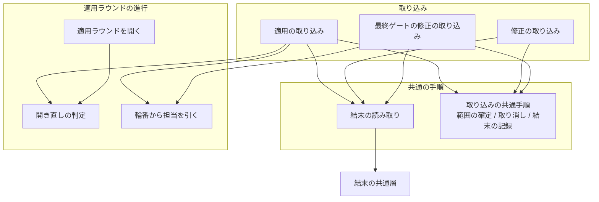
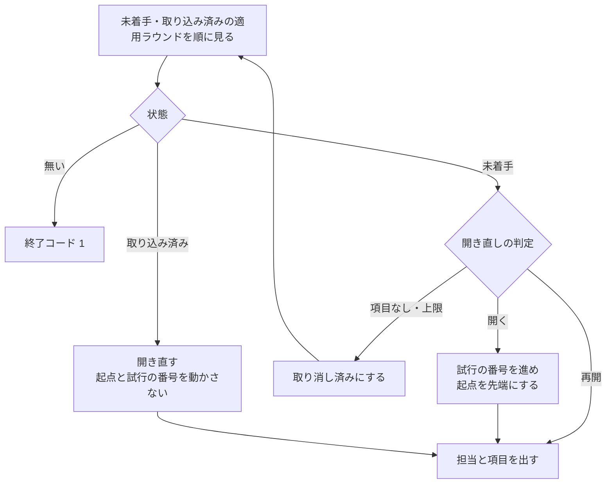

# cross-refactoring: 実装担当が結果を残さないと同じ適用ラウンドが上限なしに開き直され、未検証のコミットが残る → 結果なしを取り込みの 1 か所で受けて取り消し、開いた回数と結末で開き直しを決める

## 目的

**担当の CLI が作業結果を残さずに終わっても、3 つの取り込み（適用・修正・最終ゲートの修正）は
同じ手順で受けて終わる。** 検証を受けていないコミットは取り消され、結末は記録に残り、終了
コードが返る。下位の読み取りが進行を打ち切ることはない。

**同じ適用ラウンドを開き直す回数は 2 回で止まる。** 2 回目は別の担当が試し、2 回とも結果が
残らなければその適用ラウンドを取り消して見送りへ入れる。

**採用が 0 件だった提案ラウンドと、項目が 1 件も無い適用ラウンドでは担当を起動しない。**

**起動し直しても解けない結末（利用上限）では、同じ担当を同じ工程で起動し直さない。**

**実行環境が帰属の段落を後ろへ足したコミットでも、必須の記名が読める。** 進行側はコミットを
書き換えない。

**手順と引数の表は
[`cross-refactoring` の SKILL.md](../../plugins/ndf/skills/cross-refactoring/SKILL.md)と
[`docs/`](../../plugins/ndf/skills/cross-refactoring/docs/02-apply-and-review.md)が正である。**
ここに書き写さない。この文書が扱うのは、そこに書かない決定の理由と、進行の内部の契約である。

## 用語

本文は左の業務用語で書く。識別子は表・コードブロック・業務用語の初出の括弧書きにだけ置く。

| 業務用語 | 識別子 | 何を指すか |
| --- | --- | --- |
| 提案ラウンド | `rounds[]` | 提案 → 採否 → 適用 → 検証 → 修正の 1 周 |
| 適用ラウンド | `rounds[].apply_rounds[]` | 書き換えるファイルが重ならない改善項目の集まり。1 つで 1 コミット |
| 修正ラウンド | `fix_rounds` / `--max-fix-rounds` | 検証が落ちた適用ラウンドを直す 1 周と、その上限 |
| 取り込み | `merge-apply` / `merge-fix` / `merge-final-fix` | 担当が作ったコミットを進行側が検証して受け入れるコマンド。適用・修正・最終ゲートの修正の 3 つ |
| 適用ラウンドを開く | `next-apply-round` | 次に適用する 1 つを選び、担当と項目を出す |
| 最終ゲート | `final-gate` | 全体のテストを実行して合否を判定する |
| 試行 | `attempt` | 1 つの適用ラウンドに担当を起動し、適用の取り込みで受けようとした 1 回 |
| 結末 | `LaunchOutcome` | 担当 1 回の起動の終わり方。使える結果か、結果なしの理由かを持つ |
| 結果なし | `payload` が `None` | 結果ファイルが無い、または JSON オブジェクトとして読めない |
| 起動し直しの可否 | `relaunch_same_agent` | 同じ担当を同じ条件で起動し直せば解ける結末か |
| 結末の読み取り | `gitfacts.read_result` | 状態と工程から結果ファイルの名前の幹を組み、結末を値で返す包み |
| 結末の共通層 | `lib/monitor_outcome.py` の `read_launch_outcome` | 理由の語彙と可否を持つ、2 つの Skill 共通の読み取り |
| 取り込みの共通手順 | `refactor_lib/intake.py` | 範囲の確定・取り消し・結末の記録を 3 つの取り込みで共有する層 |
| 取り込みの範囲の値 | `IntakeScope` | 取り込み 1 つ分の「どこを見て、どこへ書くか」 |
| 範囲 | — | 起点（`apply_base_sha` / `fix_base_sha`）から作業ツリーの先端まで |
| 起点 | `apply_base_sha` / `fix_base_sha` / 適用ラウンドの `base_sha` | 範囲の始まり |
| 結末の記録 | `failed_attempts[]` | 結果を残さなかった起動の記録。適用ラウンドと最終ゲートの控えが持つ |
| 取り消しの理由 | `drop_reason` | 適用ラウンドを取り消した理由（`no_result` / `empty`） |
| 開き直しの判定 | `rounds.group_reopening` | その適用ラウンドを開くか・再開するか・開かないかを返す |
| 輪番から担当を引く関数 | `rounds.impl_for_seq` | 輪番の通し番号から担当と要求モデルを引く 1 か所 |
| 試行の上限 | `vocabulary.MAX_APPLY_ATTEMPTS`（2） | 同じ適用ラウンドを開き直す回数の上限 |
| 無進捗の許容 | `IMPL_STALL_TIMEOUT` / `vocabulary.IMPL_STALL_MARGIN`（900 秒） | 担当が何も出力しないまま待てる秒数と、その余白 |
| 必須の記名 | `Item-Id` / `Round` / `Impl-Runtime` / `Impl-Model` | コミットメッセージのトレーラーとして担当が書く 4 つ |
| 帰属の段落 | `Co-Authored-By:` / `Claude-Session:` | 実行環境がコミットメッセージの末尾へ足す段落 |

## 対象範囲

この文書が扱うのは、cross-refactoring の 3 つの取り込みと、適用ラウンドの進行の側である。

| 扱う | 扱わない |
| --- | --- |
| 結末を値で受け取る読み取りの包み、取り込みの共通手順、開き直しの判定、試行の上限と担当の交代、項目の無い適用ラウンド、修正と最終ゲートの修正の結果なし、必須の記名の読み方、無進捗の許容 | 結末の共通層そのもの（理由の語彙と可否を持つ側） |
| 輪番から担当を引く 1 つの関数へ寄せること | 参加者の決め方（別の課題が持つ） |
| 結末の記録の形（3 つの取り込みで同じ配列） | 記録を集計した実行の要約の新しい欄 |
| 進行側がコミットを書き換えないこと | 利用上限で進行全体を止めること |

**輪番から担当を引く関数は、従来の担当の割り当てを包む形で実装されている。** 呼ぶのは 3 か所
（適用ラウンドの割り当て・結果なしの試行の交代先・最終ゲートの修正担当）で、参加者の決め方が
変わったときに書き換える場所はこの関数の中だけである。

## 背景

**結果ファイルの読み取りが、そのまま進行の終了コードを決めていた。** 結果ファイルが無い・
読めないときは下位の読み取りがプロセスを終わらせるため、その先にある範囲の検査・未検証の
コミットの取り消し・適用ラウンドの状態の記録へ一度も進めなかった。読み取りを呼ぶ取り込みは
適用・修正・最終ゲートの修正の 3 つあり、いずれも同じ形で止まっていた。

**適用ラウンドを開く側が、中断からの再開と失敗した試行のやり直しを区別していなかった。**
未着手と取り込み済みの適用ラウンドを無条件に開き直すため、結果を残さない担当に当たり続けた。
実測では、担当が 15 秒で終わって結果を残さない構成で同じ適用ラウンドを 29 回開き直した時点で手で
止めている（PR #757）。別の実行では空振りの起動し直しが 3729 回に達した（#647）。

**採用が 0 件でも適用ラウンドが 1 つ作られていた。** 適用ラウンドの一覧は、鍵が無い状態と
空の配列を区別せずに 1 つの適用ラウンドを作っていた。テスト整備の採用が 0 件の実行では、項目が
1 件も無い適用ラウンドに担当を 187 回起動している（#592）。

**未検証のコミットが Pull Request に残りうる状態だった。** 最終ゲートの修正の取り込みが結果
なしで止まると、担当の作ったコミットは範囲の検査も取り消しも受けない。次の最終ゲートはその
コミットを含む先端でテストし、落ちれば起点を先端へ置き直すため、そのコミットは以後どの範囲
にも入らなかった（#674）。

**必須の記名が、実行環境の足す帰属の段落のために読めなかった。** git の標準の読み方は
メッセージの最後の段落しか読まない。claude が担当の適用ラウンドでは帰属の段落が後ろに付くため、
4 つの記名が欠落と判定され、適用ラウンドが丸ごと取り消されていた（#553）。

**担当がテストを実行している間の無出力が、無進捗として打ち切られていた。** 適用と修正の担当は
テストを 1 回実行し、その間は何も出力しない（#647）。

## 決定と理由

| 決定 | 理由 |
| --- | --- |
| 結末の読み取りは名前を残した包みとし、結果ファイルの名前の幹をそこで 1 度だけ組んで結末を値で返す | 監視へ渡した名前の雛形と食い違う幹で読むと監視の結果ファイルを引けない。取り込みが共通層を直に呼ぶ形では、幹の組み立てが 3 か所に分かれる |
| 引数を、ファイルのパスと担当から、状態・担当・工程・提案ラウンドへ変える | 古い形の呼び出しが実行時に失敗し、契約の変更を素通りしない |
| 「範囲の確定 → 未検証のコミットの取り消し → 結末の記録」を新しい共通の層へ置き、3 つの取り込みの差は範囲の値で渡す | 取り消しの本体が 2 つあり、違いは起点の鍵と記録先だけだった。取り込みに残るのは、その結果を終了コードと適用ラウンドの状態へ写すことだけになる |
| 共通の層をコマンドの層にも、git の事実の読み取りにも置かない | 3 つのコマンドが読む層である。コマンドどうしの取り込みを作らない。取り消しは事実の読み取りではなく進行の手順である |
| 結果なしの記録は、3 つの取り込みで同じ形の配列にする | 形を 3 通りに分けると、実行の要約と改修計画が 3 通りの読み方を持つ |
| 同じ適用ラウンドの試行の上限は 2 回の固定値とし、引数を足さない | 2 回目は別の担当が試すため、2 回とも残らなければ担当ではなく適用ラウンドの側を疑える。上限を 2 つ置くと、どちらで止まったかを読み解く必要が出る |
| 開き直しの判定を 1 つの関数へ置き、適用ラウンドを開く側と適用の取り込みの両方がそれを読む | 判定が 2 か所にあると、開く側とやり直しの側で違う答えを出す。判定を 1 か所に置けば、骨組みの分岐は変わらない |
| 開いた回数だけを数えず、結末の記録の件数と合わせて判定する | 進行側が落ちて再開しただけで試行が進んでしまう |
| 2 回目の試行は次の輪番の担当が行い、その適用ラウンドで失敗した担当のどれとも違う担当が出た最初の番号を採る | 結果を残さない原因の多くは担当の CLI の側にある。輪番を 1 つ進めるだけでは、1 周して同じ担当へ戻ることがある |
| 替える先が無いときだけ、起動し直しの可否で 2 回目を開くか取り消すかを決める | 参加者が 1 者に絞られた実行では交代先が無い。利用上限で進行全体を止めると、他の担当で進められる適用ラウンドまで止まる |
| 輪番を引く呼び出しを 1 つの関数へ寄せる | 参加者の決め方が変わったときに、変える場所がその関数の中だけで済む |
| 修正の結果は、提案ラウンドの担当ではなく適用ラウンドの担当から読む | 骨組みが起動するのは適用ラウンドの担当である。一致しない適用ラウンドでは結果を一度も取り込めず、検証と修正を往復し続ける |
| 修正の結果なしは修正ラウンドを 1 つ進め、起動し直せない結末では上限の値まで進める | 進めないと見送りの判定が上限に達する条件を満たさない。替えないまま上限まで起動し直すと、利用上限の担当を上限の回数だけ空振りさせる |
| 修正の担当は替えない | 直しかけの文脈を持つ者が続けたほうが速い。最終ゲートの修正が担当を替えない理由と同じである |
| 最終ゲートの修正も同じ共通の手順を通し、結果なしは取り消して判定へ戻す | 取り消せば、次の最終ゲートは修正前の地点でテストする。修正ラウンドの数を進めるのは最終ゲートの側なので、繰り返しは上限で止まる |
| 適用ラウンドの一覧は、鍵が無いときだけ古い版として 1 つ作り、空の配列はそのまま返す | 採用 0 件の提案ラウンドは空の配列を書く。ここで作ると項目の無い適用ラウンドが生まれる |
| 採用 0 件で提案の取り込みが繰り返しを終える合図を返す形は採らない | その合図はテスト整備では構造改善へ進む前に抜けてしまう |
| 必須の記名は、末尾の段落から前へ 1 段落ずつ git の判定に掛け、判定しなかった段落で止める | トレーラーの形で書かれた署名なら、誰が何行足しても同じに読める。全文から記名の形の行を拾う形では、散文の中の行まで拾う |
| 1 段落目（題名）は判定に掛けない | 掛けると、記名の形をした題名を記名として読む |
| 進行側は取り込みでコミットを書き換えない | コミットの識別子が変わり、申告と実体の対応が切れる。適用ラウンドに複数のコミットがあると、先頭の書き換えが以降をすべて書き換える。実際に使ったモデル名は担当しか知らない |
| 雛形のコミットの規約にも、必須の記名を最後の段落に置くことを書く | 人が git の標準の読み方で集計できる。従わなくても進行側の検証は通る |
| 無進捗の許容をテストの制限時間 + 900 秒とし、雛形に進捗の記録の指示を足す | 担当はテストを 1 回実行し、その間は何も出力しない。全体の制限時間は工程ごとの上限が決めるため渡さない |

## 仕様

### 常に成り立つ条件

| 条件 | 破れたときの扱い |
| --- | --- |
| 検証を受けていないコミットを、公開したまま次の工程へ渡さない | 3 つの取り込みが結果なしで範囲を取り消し、取り消した後の先端を次の起点にする |
| 取り消しへ着手する前に、公開の保留の印を立てて保存する | 取り消しは済んだのに公開できずに終わると、未検証の変更が Pull Request に残る |
| 取り消した後の起点は、その場で保存する | 保存せずに落ちると、次の実行が古い起点から範囲を取り直し、取り消しのコミット自体を未申告と判定する |
| 同じ工程・同じ試行番号の結末は、記録に 1 件しか入らない | 記録済みなら結果ファイルを読まずに終了コード 2 を返す。後から現れた結果ファイルを、取り消し済みの範囲の申告として取り込まない |
| 範囲の「1 件もコミットされていない」と「確定できなかった」を区別する | 混同すると、確定できないときに検査が素通りする |
| 結末の記録は追記だけで、上書きしない | 担当を替えると適用ラウンドの担当は書き換わるが、どの担当がどの試行で失敗したかは記録から読める |
| 取り消すコミットが無ければ、取り消しも公開も実行しない | 範囲が空のときは記録だけを足す |
| この変更の前に始めた実行の状態ファイルを、書き換えずに読める | 増えた鍵が無い状態は、試行 0 回・失敗なしとして読む |

### 構成要素と責務

| 要素 | 責務 | 置き場所 |
| --- | --- | --- |
| 結末の読み取り | 状態と工程から結果ファイルの名前の幹を組み、結末の共通層を呼んで値を返す。中断も画面への出力もしない | `refactor_lib/gitfacts.py` の `read_result` |
| 取り込みの共通手順 | 範囲の確定・未検証のコミットの取り消し・叩き直しの判定・結果なしの一連 | `refactor_lib/intake.py` |
| 適用ラウンドの進行 | 適用ラウンドの一覧・進行中の適用ラウンド・開き直しの判定・輪番から担当を引く | `refactor_lib/rounds.py` |
| 適用の取り込みと開く側 | 開き直しの判定で開く。結果なしでは担当の交代か取り消しを決める | `refactor_lib/commands/apply.py` |
| 修正の取り込み | 適用ラウンドの担当の結果を読む。結果なしは修正ラウンドを進める | `refactor_lib/commands/converge.py` |
| 最終ゲートと最終ゲートの修正の取り込み | 共通の手順を通す。修正担当を輪番から引く | `refactor_lib/commands/gate.py` |
| 判断の基準になる値 | 試行の上限と、無進捗の許容の余白 | `refactor_lib/vocabulary.py` |
| 起動の出力 | 無進捗の許容を出す | `refactor_lib/commands/setup.py` |
| 必須の記名の読み取り | 末尾から続くトレーラーの段落を読む | `refactor_lib/gitfacts.py` の `commit_trailers` |
| 結末の共通層 | 理由の語彙と起動し直しの可否を持つ。この変更では読むだけ | `plugins/ndf/scripts/lib/monitor_outcome.py` |

要素の関係（辺は呼び出し）:

### 起動 1 回の結末を読む

**結果ファイルを自前で開かず、結末の共通層を呼ぶ。** 包みが行うのは、状態・担当・工程・提案
ラウンドから結果ファイルの名前の幹を組むことと、共通層の値をそのまま返すことだけである。

| 項目 | 内容 |
| --- | --- |
| 入力 | 状態ファイルの辞書（一時ディレクトリと実行の識別子を読む）、担当、工程（`apply` / `fix` / `final-fix`）、提案ラウンド（最終ゲートの修正では省く） |
| 出力 | 結末。使える結果、または結果なしの理由と起動し直しの可否 |
| 失敗の形 | **失敗しない。** 中断せず、標準出力と標準エラーにも書かない |

**理由の語彙 9 語と起動し直しの可否は、結末の共通層が 1 か所で持つ。** この文書では定義せず、
[起動 1 回の結末の仕様](cross-review-launch-outcome.md)を参照する。取り込みは理由をそのまま
記録へ写し、可否を担当の交代の分岐に使うだけで、利用上限の条件分岐を自分では持たない。

### 取り込み 1 回の共通手順

3 つの取り込みは、結果を読めたときも読めなかったときも同じことを行う。起点から先端までの
範囲を確かめ、通らなければ取り消し、起点を取り消した後の先端へ進める。違うのは起点の鍵と
記録先だけなので、その差だけを取り込みの範囲の値で受け取る。

| 手順 | 契約 |
| --- | --- |
| 範囲の確定 | 起点から先端までのコミットを新しい順で返す。確定できなければ「確定できなかった」を返す |
| 取り消し | 公開の保留の印を立てて保存 → 新しい順に取り消す → 起点（と適用ラウンドの起点）を先端にして保存。取り消した件数を返す |
| 叩き直しの判定 | 同じ工程・同じ試行番号の記録があれば真 |
| 結果なしの一連 | 範囲の確定 → 取り消し → 結末の記録へ 1 件を足して保存。取り消したときだけ公開する。範囲を確定できなければ、取り消しも記録も行わずに「確定できなかった」を返す |

**何で終わるかは取り込みの側が決める。** 範囲を確定できなかったときの扱いは 3 つで異なる。

### 適用ラウンドを開くかどうかの判定

判定に使うのは適用ラウンドが持つ 2 つだけである。開いた回数と、結末の記録のうち工程が適用の
ものの件数である。

| 値 | 条件 | 意味 |
| --- | --- | --- |
| `empty` | 項目が 1 件も無い | 開かない。取り消し済み（理由は項目なし）にして次を探す |
| `exhausted` | 適用の失敗の件数が試行の上限に達した | 開かない。取り消し済み（理由は結果なし）にする |
| `resume` | 開いた回数が失敗の件数より多い | 開いたまま閉じていない試行の再開。起点も試行の番号も動かさない |
| `open` | 上のいずれでもない | 開いて試行の番号を進め、起点をその時点の先端にする |

適用ラウンドを開く側の流れである。取り込み済みの適用ラウンドは判定に掛けず、起点も修正ラウンドの
数も動かさずに開き直す。適用は取り込んだが検証まで進めずに落ちた実行を再開できるようにする
ためである。

### 結果を残さなかった適用の試行の閉じ方

適用の取り込みは、置き土産の後始末と取り込み済みの判定を済ませ、着手前のテストが成功と確認
できていることを確かめてから、叩き直しの判定を見て結果を読む。**着手前のテストの確認は結果を
読むより先に行う。** 成功と確認できていない状態で採ると、壊したのか元から壊れていたのかを
判別する手段が無い。

結果なしのときは次の順で閉じる。

1. 結果なしの一連を通す。範囲を確定できなければ、適用ラウンドの項目を保留にして終了コード 4 で
   中断する。試行の番号が 0 なら 1 として記録し、適用ラウンドの試行の番号を 1 にする
2. 開き直しの判定を読む。「開く」なら担当を替える。輪番の通し番号を 1 ずつ進め、その適用ラウンドで
   失敗した担当と現在の担当のどれとも違う担当が出た最初の番号を採る。参加者の数だけ進めても
   出なければ、替える先が無い
3. 替える先が無いときは、起動し直しの可否で決める。可（結果ファイルが無い・無進捗など）なら
   担当を替えずに 2 回目を開く。否（利用上限）ならその場で取り消す
4. 取り消すときは、適用ラウンドの項目を見送りへ入れて取り消し済み（理由は結果なし）にし、取り込みの
   時刻を立てて、残りの適用ラウンドの有無で次の局面を決める
5. 保存して終了コード 2 で終わる。公開は手順 1 が取り消したときに済んでいる

**見送りの理由には、どの担当がどの理由で結果を残さなかったかを並べる。** 改修計画の見送った
項目の表にそのまま出る。

### 修正と最終ゲートの修正の結果なし

どちらも叩き直しの判定 → 結末の読み取り → 結果なしの一連という同じ流れを通り、終了コード 2 で
終わる。違うのは修正ラウンドの数の進め方である。

| 取り込み | 範囲を確定できないとき | 起動し直しが可のとき | 起動し直しが否のとき |
| --- | --- | --- | --- |
| 修正 | 修正ラウンドを 1 進めて中断 | 修正ラウンドを 1 進める | 修正ラウンドを上限の値にする |
| 最終ゲートの修正 | そのまま中断 | 修正ラウンドを進めない（次の最終ゲートが進める） | 修正ラウンドを上限の値にする |

**修正の担当は適用ラウンドの担当から読む。** 結末の記録も、最終ゲートの修正を除いてその適用ラウンド
が持つ。担当が適用ラウンドごとに決まるためである。

**最終ゲートの修正を取り消すと、次の最終ゲートは修正前の地点でテストする。** 取り消した
コミットは修正のコミットの一覧に入らない。起動し直しが否で修正ラウンドが上限の値になった後の
最終ゲートは、テストが落ちれば取り消さずに報告して終わる。押し出し済みの地点で、上限に達しても
採用した改善項目は取り消さないという既存の規則を変えない。

### 項目の無い適用ラウンドを作らない

3 か所で止める。

| 場所 | 扱い |
| --- | --- |
| 適用ラウンドの一覧 | 鍵が無いときだけ、古い版として提案ラウンド全体を 1 つの適用ラウンドとしてまとめる。空の配列はそのまま返す |
| 適用ラウンドを開く側 | 項目の無い未着手の適用ラウンドは開かずに取り消し済み（理由は項目なし）にし、次を探す。残りが無ければ終了コード 1 |
| 適用の取り込み | 取り込み済みで採用が 0 件だった適用ラウンドは、取り消し済み（理由は項目なし）に直して終了コード 2 |

### 必須の記名の読み方

コミットメッセージを空行で段落に分け、末尾の段落から前へ 1 段落ずつ git の判定に掛ける。
判定がトレーラーの段落と認めなかった段落で止める。同じ鍵が 2 つの段落にあれば、末尾に近い
段落の値を採る。**1 段落目（題名）は判定に掛けない。**

| 読む側 | 読み方 | どこまで読むか |
| --- | --- | --- |
| 進行側の検証 | 末尾から続くトレーラーの段落 | 帰属の段落を越えて必須の記名まで届く |
| 人の集計 | git の標準の読み方 | 最後の段落だけ |

**判定そのものは git に委ねる。** 「何行以上なら記名の段落か」といった規則を進行側に持たない。
段落だけを渡すと git は何も返さないため、題名の行を補って渡す。

雛形のコミットの規約は、必須の記名をメッセージの最後の段落に置き、実行環境が帰属行を足すときは
空行を挟まず同じ段落に続けることを求める。**従わなくても進行側の検証は通る。** 人の集計を
成り立たせるための補助である。

### 無進捗の打ち切り

起動が無進捗の許容を出し、骨組みの適用・修正・最終ゲートの修正の 3 つの監視の呼び出しが、それを
無進捗の引数へ渡す。全体の制限時間の引数は渡さない。工程ごとの上限は別の仕組みが決める。

雛形は、作業段階が進むたびに進捗の記録へ 1 行追記することを担当へ求める。

### 終了コード

| コマンド | 0 | 1 | 2 | 4 |
| --- | --- | --- | --- | --- |
| 適用ラウンドを開く | 開いた | 残りの適用ラウンドが無い | — | — |
| 適用の取り込み | 取り込んだ | — | この適用ラウンドを取り消した、または担当を替えて開き直す | 着手前のテストが成功と確認できていない・範囲を確定できない・適用ラウンドが無い |
| 修正の取り込み | 取り込んだ | — | 範囲を確定できない・結果なし | 適用ラウンドが無い |
| 最終ゲートの修正の取り込み | 取り込んだ | — | 範囲を確定できない・結果なし | 修正担当が未記録 |

**骨組みの分岐は変わらない。** 適用の取り込みの 2 で次の適用ラウンドへ進み、4 で止まる。修正と最終
ゲートの修正の取り込みの終了コードは骨組みが見ない。

## データ・設定

### 状態ファイルに増える項目

**版は上げない。** 鍵が無い状態ファイルは、試行 0 回・失敗なしとして読む。

適用ラウンド 1 件（`rounds[].apply_rounds[]` の要素）に足す鍵である。

| 項目 | 型 | 値 | 鍵が無いときの意味 |
| --- | --- | --- | --- |
| `attempt` | 整数 | いま開いている試行の番号。1 から | 0（まだ開いていない）。適用の取り込みは 0 を 1 回目として記録する |
| `failed_attempts` | 配列 | 結果を残さなかった起動。1 件の形は下の表 | 失敗なし |
| `drop_reason` | 文字列 | `no_result`（試行の上限、または起動し直せない結末で交代先なし）/ `empty`（項目なし） | 既存の経路で取り消した、または取り消していない |

最終ゲートの控え（`final_gate`）にも、同じ形の結末の記録（`failed_attempts`）を足す。

**担当（`impl` / `impl_model`）は交代のときに書き換える。** 前の担当は結末の記録に残る。

### 結末の記録の 1 件

| 列 | 型 | 空を許すか | 意味 |
| --- | --- | --- | --- |
| `phase` | 文字列 | 許さない | `apply` / `fix` / `final-fix`。同じ適用ラウンドの適用と修正の記録を分ける |
| `attempt` | 整数 | 許さない | 適用は適用ラウンドの試行の番号、修正は修正の試行の番号、最終ゲートの修正は修正ラウンドの数。叩き直しの判定の鍵 |
| `impl` | 文字列 | 許さない | 起動した担当 |
| `reason` | 文字列 | 許さない | 結末の理由。語彙は結末の共通層が持つ |
| `detail` | 文字列 | 許す（空文字） | 監視の詳細。監視の結果ファイルが無ければ空文字 |
| `at` | 文字列 | 許さない | 記録した時刻 |
| `reverted` | 整数 | 許さない | その起動の範囲から取り消したコミットの数。0 = コミットなし |

### 取り込みごとの範囲の値

| 取り込み | 起点を持つ控え | 起点の鍵 | 記録先 | 工程 | 起点を揃える先 |
| --- | --- | --- | --- | --- | --- |
| 適用 | 提案ラウンドの控え | `apply_base_sha` | その適用ラウンド | `apply` | その適用ラウンドの `base_sha` |
| 修正 | 提案ラウンドの控え | `fix_base_sha` | その適用ラウンド | `fix` | なし |
| 最終ゲートの修正 | 最終ゲートの控え | `fix_base_sha` | 最終ゲートの控え | `final-fix` | なし |

### 起動の出力と骨組みの引数

| 値 | 決め方 | 既定 |
| --- | --- | --- |
| 無進捗の許容（`IMPL_STALL_TIMEOUT`） | テストの制限時間（`--test-timeout`）+ 余白 900 秒 | 1800 秒 |
| 試行の上限（`MAX_APPLY_ATTEMPTS`） | 固定値。引数を持たない | 2 回 |

## テスト観点

| 観点 | 確かめ方 |
| --- | --- |
| 結末の読み取りが中断も出力もせず、結果なしと理由を値で返すこと | `plugins/ndf/skills/cross-refactoring/tests/test_intake.py` |
| 3 つの取り込みの形で、範囲が 1 件・0 件・確定できない場合の取り消しと記録が同じになること。叩き直しで記録が増えないこと | 同 `tests/test_intake.py` |
| 結果を残さない担当で、担当の交代 → 取り消し → 見送りまで進み、開き直しの回数が有限で終わること | 同 `tests/test_apply_attempts.py` |
| 交代先が無いとき、起動し直しの可否で 2 回目を開くか取り消すかが決まること | 同 `tests/test_apply_attempts.py` |
| 着手前のテストが成功と確認できていないとき、結果ファイルを読まずに終了コード 4 で終わること | 同 `tests/test_apply_attempts.py` |
| 開き直しの判定と輪番から担当を引く関数を差し替えると、開く側と取り込みの両方の分岐が従うこと | 同 `tests/test_apply_attempts.py` / `tests/test_final_fix.py` |
| 採用 0 件と項目の無い適用ラウンドで、適用ラウンドを作らず開かずに取り消すこと | 同 `tests/test_apply_rounds.py` |
| 修正の結果を適用ラウンドの担当から読み、結果なしで修正ラウンドが進んで見送りへ至ること | 同 `tests/test_abandon_items.py` |
| 最終ゲートの修正の結果なしで取り消し、次の最終ゲートが取り消し後の地点でテストすること | 同 `tests/test_final_fix.py` |
| 帰属の段落が後ろに付いたコミットから必須の記名を読み、散文の中の記名の形の行を読まないこと | 同 `tests/test_commit_trailers_git.py`（一時リポジトリで git を実行する） |
| 無進捗の許容が起動の出力に入り、骨組みの 3 つの監視の呼び出しへ渡ること | 同 `tests/test_init.py`（文書の語の照合は #885 で削除） |
| 結果ファイルがあり検証を通る適用ラウンドが、変更の前と同じく 1 回目で取り込まれること | 同 `tests/test_merge_apply.py` |
| 文書の分量が分割の基準を超えないこと | `python3 scripts/check-doc-line-limit.py` |
| 参照のリンクが解決できること | `python3 scripts/check-markdown-links.py` |

## 関連リンク

- [issue #728](https://github.com/devbasex/ai-plugins/issues/728) — 結果なしを取り込みの 1 か所で受ける
- [issue #647](https://github.com/devbasex/ai-plugins/issues/647) — 同じ適用ラウンドが上限なしに再試行される
- [issue #592](https://github.com/devbasex/ai-plugins/issues/592) — 採用 0 件で項目の無い適用ラウンドが開く
- [issue #553](https://github.com/devbasex/ai-plugins/issues/553) — 帰属の段落で必須の記名が読めない
- [issue #674](https://github.com/devbasex/ai-plugins/issues/674) — 最終ゲートの修正で未検証のコミットが残る
- [PR #796](https://github.com/devbasex/ai-plugins/pull/796) — 実装
- [起動 1 回の結末の語彙と起動し直しの可否](cross-review-launch-outcome.md)
- [参加する CLI と席の決め方](cross-review-participants-and-seats.md)
- [`cross-refactoring` の適用と検証の手順](../../plugins/ndf/skills/cross-refactoring/docs/02-apply-and-review.md)
- [`cross-refactoring` の修正と報告の手順](../../plugins/ndf/skills/cross-refactoring/docs/04-fix-and-report.md)
- [`cross-refactoring` の手順](../../plugins/ndf/skills/cross-refactoring/SKILL.md)
