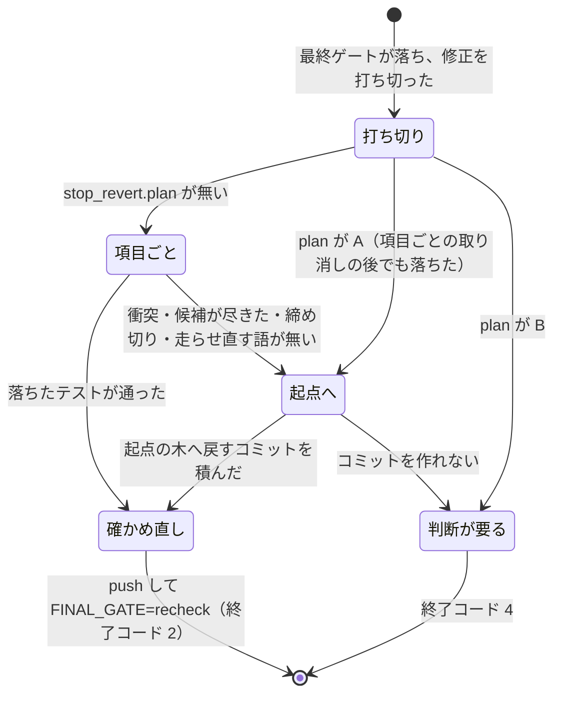

# cross-refactoring: 全体テストが落ちたときの原因の項目の判定・構造チェックの範囲テスト・打ち切りの後の取り消し

[cross-refactoring-verify-and-final-gate.md](cross-refactoring-verify-and-final-gate.md) の検証と最終ゲートのうち、全体テストの失敗を原因の項目へ帰す判定、構造チェックを項目の範囲テストで走らせる宣言、工程として起動したときの打ち切りの後の取り消しを持つ。決定の理由・常に成り立つ条件・状態ファイルのキー・テスト観点はそちらにある。手順は `cross-refactoring` の [docs/04-verify-and-report.md](../../plugins/ndf/skills/cross-refactoring/docs/04-verify-and-report.md) が正。

## 仕様

### 原因の項目の判定

手がかり（`path` / `isolate` / `undetermined`）の決め方と、判定の後の修正・取り消しの流れは
[`docs/04-verify-and-report.md`](../../plugins/ndf/skills/cross-refactoring/docs/04-verify-and-report.md) が正である。
判定は `culprit.judge` が行い、値（`Verdict`）を作って記録の `culprit` と `items` に書くだけで、項目の状態を書き換えない。
呼ぶのは次の 4 か所で、判定はどこも同じである。

| 呼ぶところ | 締め切り | 項目を外した走らせ直し |
| --- | --- | --- |
| 検証の中の全体テスト（`converge._triage_whole`） | 修正の締め切り（`culprit.fix_deadline` = `budget.fix_end`） | 行う |
| JUnit を読めない経路（`wholetest.fallback`） | なし | 行わない |
| 最終ゲートへ寄せた危険フラグの全体テスト（`gate_ci.revert_deferred`。単独の起動） | `limits.stop_revert_end_at` | 行う |
| 打ち切りの後の取り消し（`stop_revert`。工程の 1 つとしての起動） | `limits.stop_revert_end_at` | 行う |

| `Verdict` の値 | 何を持つか |
| --- | --- |
| `culprits` | 原因の項目の ID（新しい順） |
| `basis` | 変更起因の ID がすべてパスで決まれば `path`、1 件でも外した走らせ直しで決まれば `isolate`、1 件でも決まらない ID が残るか原因が 1 件も無ければ `undetermined` |
| `evidence` | 項目ごとの根拠。`{"paths": [...]}`（本文に現れたパス）か `{"tests": [...]}`（外すと通るようになったテストの ID） |
| `order` | 取り消す順。`culprits` の後に、`undetermined` のときだけ残りの候補を新しい順に続ける |
| `seconds` | 判定にかかった秒（走らせ直しを含む） |

- **候補は取り消されていないすべての改善項目である**（危険フラグと状態を問わない）。比べるパスは項目のコミットが変えたファイル
- **本文は今の HEAD の走らせ直しで読んだ JUnit の `failure` / `error` の `message` と本文**（`whole_test.caused_output`）。1 件 8000 文字に縮め、超えたら先頭と末尾を半分ずつ残す（`junit.TEXT_CHARS`）。JUnit を読めない経路は走らせ直しのログの末尾 1,000,000 文字を使う（`wholetest.LOG_CHARS`）
- **パスの一致**（`failure_paths.mentioned`）は、リポジトリからの相対パスが本文に部分文字列として現れ、前後が識別子の文字・パスの区切りの続き・拡張子の続きでないこと（`a/b.py` は絶対パスの末尾には当たり、`xa/b.py` と `a/b.pyc` には当たらない）。本文の `\` は `/` に直して比べる
- **項目を外した走らせ直し**は、候補を新しい順に、項目のコミットを `git revert --no-commit` で外して残った ID のファイルだけを走らせ直す。外せない（衝突）項目は飛ばす。1 回の上限は `limits.test_timeout` を締め切りまでの残りで切り詰める。走らせ直すコマンドを組めないときと、worktree に未コミットの変更があるときは行わない

### 構造チェックを項目の範囲テストで走らせる

静的解析の suite を項目のコミットが変えたファイルにかける仕組み（共通層の `test_strategy.scope_runs`）は
[`docs/02-plan-and-implement.md`](../../plugins/ndf/skills/cross-refactoring/docs/02-plan-and-implement.md) の「範囲テストの組み立て」が正で、
cross-refactoring の側は構造チェックのために何も持たない。このリポジトリは `.ndf/project.json` に次の suite を宣言している。

| 鍵 | 値 |
| --- | --- |
| `name` / `runner` / `kind` | `script-structure` / `check-script-structure` / `lint` |
| `command` | `python3 scripts/check-script-structure.py` |
| `scope_command` | `python3 scripts/check-script-structure.py {paths}` |
| `needs` | `[]` |
| `paths` | `plugins/ndf`・`scripts/script-structure-allow`・`scripts/check-script-structure.py` |

`junit` は持たない（静的解析の合否は終了コードで決まる）。`plugins/ndf/` と例外リストと検査のスクリプトのどれも変えない項目には組まない。
最終ゲートの静的解析の全体テストも、この suite を `command` で走らせる。

`scripts/check-script-structure.py [--root <根>] [--allow <置き場>] [<ファイル>...]` の契約:

| 項目 | 内容 |
| --- | --- |
| 位置引数 | 0 個以上のファイル。根からの相対パスか根の下の絶対パスで、無いファイル（項目が消したファイル）とディレクトリも受ける |
| 検査 | 指定の有無を問わず木全体で 1 回行い、指定は `items` と合否を絞るだけにする |
| 出力 | `items` は指定に関わる違反だけ。`metrics` に `targets`（指定の数）と `outside`（指定の有無を問わず外した違反の数）を足す |
| 終了コード | 0 = 関わる違反なし / 1 = 関わる違反あり / 2 = 例外リストを読めない・形の誤り（指定の有無を問わず 2） |
| 位置引数が無いとき | 木全体の違反で合否を決め、`metrics` に `targets` / `outside` を足さない。継続的統合はこの形で呼ぶ |

違反が指定に「関わる」とき:

| 違反 | 関わるとき |
| --- | --- |
| すべて | 違反の `path` が指定のどれかと同じか、その下にある |
| `same-name` / `same-body` | 同じ名前・同じ本体を持つほかのファイル（違反の `others`）のどれかが指定にある |
| 例外リストの行に当たる違反（行の上限を超えた `lines` と、当たる違反の無い行の `unused-allow`） | 指定に、その行を持つ例外リストのファイルがある |
| すべて | 指定に検査のスクリプト自身か、例外リストの置き場そのものがある |

**範囲テストで拾えない違反がある。** `require-groups`・`hook-deps` は違反の `path`（エントリポイント）と別のモジュールの
変更でも起きうる。そのときは全体テストで落ち、原因の項目の判定が拾う。

### 打ち切りの後の取り消し

工程の 1 つとして起動した実行（`--workflow-step`）が最終ゲート修正を打ち切ると、`gate.cmd_final_gate` が
`stop_revert.revert_after_cutoff` を呼ぶ。単独の起動は呼ばず、寄せた危険フラグの全体テストがあるときだけ
`gate_ci.revert_deferred` で原因の項目を取り消す。2 つの手当ての中身は
[`docs/04-verify-and-report.md`](../../plugins/ndf/skills/cross-refactoring/docs/04-verify-and-report.md) の
「打ち切りの後の取り消し」が正である。ここでは進み方の契約だけを書く。

- **項目ごとの取り消し**は、最終ゲートの見分け（`final_gate.triage`）の変更起因で原因の項目を決め（`final_gate.culprit`）、
  `culprit.revert_in_order` で取り消す。衝突は `DropConflict` で受け、締め切り（`limits.stop_revert_end_at`）を過ぎたら次の取り消しを始めない。
  取り消した項目の `failure_reason` は「最終ゲート修正を打ち切った後に、原因の項目として取り消した」
- **起点への戻し**は、`plan.base_sha` の木へ worktree と index を合わせ（`git read-tree -u --reset`）、
  `Revert: cross-refactoring の改善を着手前の木へ戻す（<理由>）` を 1 本コミットする。台帳にはオーケストレーターのコミットとして記録し
  （`ledger.note_orchestrator_commit`）、残った項目をすべて取り消した記録にする（`failure_reason` は `stop_revert.REASON_B` の文）。
  コミットを作れなければ HEAD を戻して終了コード 4 で止まる
- どちらも、積んだ後の公開と、起点（`final_gate.fix_base_sha`）の置き直しは `gate.cmd_final_gate` が行う
- 確かめ直しの最終ゲートが通れば `final_gate.status` は `passed` になり、駆動は残った項目（`verified`）の数を `adopted` にして完了で終える（`unconfirmed` は出ない）。
  検査のプランは refactor を完了として review へ進む（プランの定義は変えない）
- 変更起因を挙げられない（静的解析だけが落ちた・見分けを全体の走らせ直しへ落とした）ときは、走らせ直す語が無いので項目ごとの取り消しを飛ばして起点への戻しへ進む。
  `final-gate` は打ち直すたびに前回の見分けを消すため、古い変更起因で取り消さない

**最終ゲート修正は項目の修正と別物である。** 直すのは全体テストの失敗で、どの項目にも
属さない。求めるトレーラーは `Impl-Runtime` / `Impl-Model` の 2 つで `Item-Id` を求めない。
起点は落ちた時点の HEAD（`final_gate.fix_base_sha`）で、コミットごとのテストの合否は見ない
（直後の `final-gate` が 1 度だけ見る）。申告から漏れたコミットと範囲の外を触ったコミットは
修正の範囲ごと取り消す。結果を残さなかったときの扱いは
[マージ処理の共通手順](cross-refactoring-apply-intake.md) にある。
