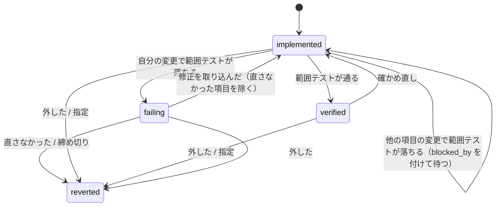

# cross-refactoring: 失敗した改善項目の扱いの規則（取り消し・積み直し・修正の打ち切り・範囲テストの対象）

## 概要

**改善項目を残すかは、その項目を積んだ HEAD の範囲テストだけで決める。** git の衝突は「その項目を
そのまま積めない」ことを示すだけで、外す相手は衝突したコミットを持つ項目に限る。修正担当が何も
コミットしなかったことは git で観測でき、その項目は締め切りを待たずに取り消す。

この文書は、その規則の組を**なぜこの形にしたか**（背景・決定と理由・常に成り立つ条件・既知の限界・
テスト観点）を残す。**手順と状態ファイルの鍵の正は Skill にある。** `verify` の順序・取り消しの積み直し・
`drops[]` の鍵（`mode` / `ejected` / `recheck`）・`unfixed`・`failure_reason` の文言は
[`docs/04-verify-and-report.md`](../../plugins/ndf/skills/cross-refactoring/docs/04-verify-and-report.md)、
収束しない項目の原則は
[`references/design-principles.md`](../../plugins/ndf/skills/cross-refactoring/references/design-principles.md) を読む。
検証と最終ゲートの全体は [cross-refactoring-verify-and-final-gate.md](cross-refactoring-verify-and-final-gate.md) にある。

## 用語

「積み直し」「外した項目」「直さなかった項目」「確かめ直し」「巻き込まれた項目」の定義は用語集
（[docs/glossary.md](../glossary.md)）が正である（コンテキスト `ndf-cross-refactoring`）。

**理由の文に「巻き込まれた」を使わない。** 用語集の「巻き込まれた項目」は、他の項目の変更で範囲テストが
落ちて取り消さずに待つ項目を指す。外した項目の理由は「外した」と書く。

## 背景

規則を決め直す前は、取り消しの積み直しが衝突すると、消す・戻すコミットが触ったファイルを触った生きている
全項目へ 1 段広げ（`widened`）、範囲テストを掛け直さずに取り消していた。広げても衝突すると HEAD を戻して
終了コード 4 で止まった。修正は締め切りまで落ちた項目のすべてへ回り、修正担当の答えの中身は見なかった。

2 つの実行で、テストを通る改善がまとめて捨てられた。

| 実行 | 起きたこと | 後で確かめたこと |
| --- | --- | --- |
| takemi-ohama/novel PR 254（想定最大時間 30 分） | 12 件のうち採用 1・取り消し 11。範囲テストが `unittest cannot select: tests/test_episodes_pipeline.py::Check` でテストを 1 件も走らせずに終了コード 2 で終わり、テストの失敗と数えられた。修正担当は 10 回（約 11 分）「直すものは無い」と答えてコミットせず、締め切りの取り消しが `widened` で同じファイルの 8 件を巻き込んだ | 12 件を積んだ HEAD と 11 の途中の状態がすべて範囲テストと全体テスト（761 件）を通った。衝突する 2 件だけを除けば 6 件を残せた |
| devbasex/ai-plugins PR 1732（#1733） | 18 件のうち 8 件が同じ構造検査で落ち、修正担当は 43 回とも 8 件をコミットしなかった。最後の積み直しが広げても衝突し、採用 0・終了コード 4 | — |

検証は全項目を積んだ HEAD で行い、項目は前の項目の上に書かれる（#933）。後の項目が前の項目の行に依存するのは
普通に起こる（PR #118 で 5 件中 4 件、PR 254 で 12 件中 10 件が同じ 2 ファイル）。したがって「前の項目を
取り消すと後の項目の積み直しが衝突する」は例外ではなく通常の経路であり、ファイル単位で広げる規則はそのたびに
同じファイルの改善を捨てていた。

## 規則の組

| # | 規則 | 現行の形 |
| --- | --- | --- |
| R1 | 取り消しの単位 | 項目の単位。外すときも項目の全体（テスト・実装・修正のコミット） |
| R2 | 積み直しが衝突したとき | 衝突したコミットを持つ項目だけを外し、計画を作り直して起点から積み直す。最終ゲートより前の取り消しで HEAD が変わったら、残った項目を範囲テストで確かめ直す |
| R3 | 修正の打ち切り | 締め切り（時計）は維持する。加えて、修正の起動が結果を残して終わり、その項目のコミットを 1 つも作らなかった項目は、次の検証の最初に取り消す |
| R4 | コミットの形 | 実装は同じ `Item-Id` のコミットを何件でも持てる。計画がテストを足す項目は、それにテストのコミット 1 件が加わる |
| R5 | 範囲テストへ渡す対象 | 雛形の `{paths}` へは `test_targets` の `::` より前のパスだけを渡す（どのランナーでも） |
| R6 | 「直すものは無い」と答えた項目 | R3 で扱う。結果ファイルの申告は読まない |

## 決定と理由

| # | 決定 | 理由 | 採らなかった案 |
| ---: | --- | --- | --- |
| 1 | 積み直しの衝突では、衝突したコミットの持ち主の項目だけを外し、`plan_rebuild` を「指定した項目 + 外した項目」で作り直して起点から積み直す | ファイルの一致は衝突の相手を示さない。作り直すのは、外した項目のコミットのうち衝突より前に積み直し終えたもの（テストのコミットなど）も消すためで、衝突したコミットだけを抜くとテストだけが HEAD に残る | ファイル単位で広げて範囲テストを掛け直す（広げた時点で改善は消えている）。項目ごとに範囲テストを掛けてから次を積む逐次の採用（実装担当の 1 回の起動で順に実装する形を変え、範囲テストが項目の数だけ増える。R5 で偽の失敗を断てば PR 254 では差が無いため、効果を実測してから判断する）。ハンクの行範囲の重なりで絞る（git の衝突と文脈 3 行の差で一致せず、試しに積む方が正確で単純） |
| 2 | 最終ゲートより前の取り消しで HEAD が変わったら、生きている `verified` の項目をすべて `implemented` へ戻して確かめ直す | 取り消しは木を変え、起点より前の項目の範囲テストも取り消した変更の上で通っていた可能性がある。依存から絞るのは決定 1 で退けたファイル単位の推測と同じ形になる。同じ語の並びは 1 回だけ走るため、増えるのは語の並びの数まで | 外した項目があったときだけ確かめ直す（外さずに積み直せても木は変わる）。積み直して SHA が変わった項目だけを確かめ直す（起点より前の項目も同じ条件で、規則が増えるだけ） |
| 3 | 直さなかった項目の判定は「修正の起動が結果を残したか」と「修正の範囲（`fix.base_sha..HEAD`）にその項目の `Item-Id` のコミットがあるか」の 2 つの観測だけで行い、取り消しは次の `verify` の最初に 1 回の `drop` でまとめて行う | オーケストレーターは git だけを見る。取り消しを決めるのを検証に集めると、取り消しの後の確かめ直しが同じ検証の中で続く | 結果ファイルの申告（`not_fixed`）で決める（申告と git が食い違うと判定が割れる）。項目ごとの修正の回数に上限を置く（時間が残っていても止まる。コミットしなかったことは 1 回目で分かる）。`merge-fix` の中で取り消す（確かめ直しが 2 か所に分かれる） |
| 4 | 手順を外れて範囲ごと捨てた修正でも、コミットした項目は直さなかったと扱わない（判定は捨てる前のコミットで行う） | 直そうとしてコミットした項目は、直さなかった項目ではない。違反の扱いは別の規則（範囲ごと捨てて締め切りまで回す）が持つ | — |
| 5 | `::` を落とす場所を共通のライブラリ `test_strategy.suite_groups` にする | 雛形へ語を入れる経路（項目の範囲テスト・`test-run.py scope`・失敗の走らせ直し）はすべてここを通る。`::` を受け付けるかはランナーごとに違い、宣言の `runner` は自由な文字列なので見分けられない（unittest の包みは名前から分からない） | 宣言の `runner` が `unittest` なら計画に `::` を書かせない（見分けられず、プロンプトだけの約束は破れる）。終了コード 2 と出力から「1 件も走らせなかった」を見分ける（`::` 以外の原因も含む一般の検出で、#1630 が扱う）。cross-refactoring の `targets` の側だけで落とす（`test-run.py scope --paths` に同じ不具合が残る） |
| 6 | 計画の `test_targets` は `::` 付きの値も受け取る（項目を見送らない） | 渡す側で落とすため、書いた側を罰する理由が無い。走るのはファイルの全体になる | — |
| 7 | 最終ゲートの中の取り消し（打ち切りの後の取り消し・最終ゲートの原因の判定）では確かめ直しを置かず、`recheck` を空にする | 取り消した後に最終ゲートが HEAD を全体テストか CI で確かめ直す（`FINAL_GATE=recheck`）。範囲テストを重ねても新しい失敗は見つからず、打ち切りの後の取り消しの締め切りを超えるかの規則だけが増える。採用は最終ゲートが `passed` のときだけなので、確かめ直さずに採ることも無い | 最終ゲートの中でも `implemented` へ戻す（最終ゲートが通っても採用が 0 になる） |
| 8 | 外した項目の `failure_reason` は上書きする（`mark_dropped` の `setdefault` に任せない） | 自分の範囲テストで落ちていた項目は前の理由が残り、実際の取り消しの理由（衝突）が読めなくなる（PR 254 の 2 件が「自分の範囲テストで落ちた」と記録された）。落ちた検査は `failed_check` に残る | — |
| 9 | 外した項目と直さなかった項目は取り消し（`reverted`）として数え、見送りの理由を足さない | 見送りは計画と実装の取り込みで外したものに限る区分を保つ。足すと件数の和の不変条件（#1692 の Tally）を見直すことになる | 新しい見送りの理由（`conflict` など）を足す |
| 10 | 取り消しの記録の `mode` に `ejected` を足す | 1 行で外した項目の有無が読める。`mode` を読んで分岐する処理は無く、旧い `widened` の記録はそのまま読める | `mode` を `item` のままにして `ejected[]` だけを足す |
| 11 | 引き金（R5・R6）を規則（R2・R3）と同じ変更で直す | 引き金だけを直すと、別の偽の失敗（揺れ・コマンドの不一致）で同じ巻き込みが起きる。規則だけを直すと、PR 254 では偽の失敗で 4 件が取り消される | 引き金を別の課題に分ける |
| 12 | 修正の取り込みを `refactor_lib/fix_intake.py` に置き、`commands/merge_fix.py` は入口だけにする | `commands/converge.py` が構造検査の上限（1 ファイル 500 行）にあった。取り込みは検証と別の工程で、`verify` も取り込んでいない修正を先に取り込むため同じ関数を呼ぶ | 構造検査の例外リストに足す（行数を固定するラチェットで、次の変更でまた同じ判断が要る） |

## 仕様

### 構成要素と責務

| 要素 | 責務 |
| --- | --- |
| `plugins/ndf/scripts/lib/test_strategy.py`（`suite_groups`） | 対象を `::` より前のパスへ直し、重なりを 1 つにまとめ、最初に現れた順を保って `{paths}` へ入れる（R5） |
| `refactor_lib/ledger.py`（`plan_rebuild`・`live_owner`・`mark_recheck`・`mark_dropped`） | どのコミットを消し・積み直し・戻すかを決める。`live_owner` は、コミットが取り消されていない改善項目のもの（`kind` が `item`）ならその ID を、項目に属さないもの（`orchestrator`・`final_fix`・`stray`）なら空を返す。`reverted` へ落とす遷移は `mark_dropped` だけが持つ |
| `refactor_lib/undo.py`（`drop`） | 衝突したコミットの持ち主を外して計画を作り直す繰り返し、外した記録（`ejected[]`）と確かめ直し（`recheck`）を同じ保存で残す（R2） |
| `refactor_lib/fix_intake.py`（`merge`） | 修正の取り込みと、直さなかった項目への `unfixed` の付与（R3） |
| `refactor_lib/commands/converge.py`（`_drop_unfixed`・`_settle_scope`） | 直さなかった項目を最初に取り消し、判定を待つ項目（`scope_verdict.pending`）を判定する |
| `refactor_lib/scope_verdict.py`（`pending`） | `implemented` で、`blocked_by` の原因の項目がどれも `failing` でない項目を返す。確かめ直しの項目もここに入る |

### 常に成り立つ条件

| 条件 | 破れたときの扱い |
| --- | --- |
| 1 回の取り消しで `reverted` になる項目は、指定した項目と、積み直しで衝突したコミットを持つ項目（外した項目）だけである。ファイルが同じというだけでは外さない | テストが落とす |
| 外した項目は `failure_reason` に「どの項目の取り消しで、どのコミット（12 桁の SHA）の積み直しが衝突したか」を持ち、取り消しの記録の `ejected[]` に 1 行ある。`mode` に `widened` は書かれない | テストが落とす |
| 最終ゲートより前の取り消しで HEAD が変わったら、残った項目は `verified` のまま残らない | テストが落とす |
| 項目に属するコミット（テスト・実装・修正）の積み直しの衝突では HEAD を戻さず、終了コード 4 で止まらない。公開済みのコミットの revert の衝突と、項目に属さないコミットの積み直しの衝突は、HEAD を取り消しの前へ戻して終了コード 4 で止まる（`on_conflict="raise"` なら `DropConflict`） | テストが落とす |
| 結果ファイルを残して終わった修正の起動の後、修正の範囲に `Item-Id` のコミットが 1 つも無い項目は次の `fix.items` に入らず、次の検証の最初に取り消される。結果ファイルを残さずに終わった起動はこれに数えない（振り替えと締め切りの経路） | テストが落とす |
| 雛形の `{paths}` に入る語は `::` を含まない | テストが落とす |
| 取り消しの途中で止まった実行を再開すると（`pending_drop`）、同じ指定の項目から同じ外した項目・残す項目になる。`pending_drop.items` は指定した項目だけを持ち、外した項目は再開で計算し直す | テストが落とす |

衝突のたびに 1 件を外すため、積み直しの繰り返しは生きている項目の数の内で終わる。

### 改善項目の状態遷移

確かめ直しの項目も、自分の変更で落ちれば `failing`、他の項目の変更で落ちれば `blocked_by` を付けて
`implemented` のまま待つ。

## 運用

### 既知の限界

| 項目 | 内容 |
| --- | --- |
| 衝突しないが意味の上で依存する項目 | 積み直せても取り消した項目に依存して範囲テストを落とす項目は、確かめ直しで `failing` になって修正か締め切りの取り消しへ進む。範囲テストが覆わない依存は最終ゲートの全体テストまで見つからない |
| 確かめ直しの所要 | 確かめ直しの範囲テストは配分テーブルの `verify` の見積りに入らない。実測は `verify_stats` に入って次回から反映されるが、取り消しの多い実行の初回は締め切りに近づく。締め切りの後に落ちた確かめ直しの項目は締め切りの取り消しで扱う |
| `::` を落として走るテストの数 | ノード ID でなくファイルの全体を走らせるため、範囲テストの所要が増えうる |
| 版をまたぐ再開 | 計画の時点で置いた項目の `scope_commands` は置き直さないため、この規則より前の版で計画まで進んだ実行を再開すると、`::` 付きのコマンドが残る |

## テスト観点

- 同じファイルを触る項目 A・B（A の行の上）・C（離れた行）と別のファイルの D を実物の git で積み、A を取り消すと B だけが外れ、C と D は残ること（`plugins/ndf/skills/cross-refactoring/tests/test_undo_eject_git.py`）
- 外した項目の `failure_reason` に A の ID と衝突したコミットの 12 桁が入り、`drops[-1].ejected` に行があり、`mode` が `ejected` であること
- テストと実装の 2 コミットの項目の実装のコミットが衝突すると、テストのコミットも HEAD から消えること
- 項目に属さないコミットの衝突と公開済みの revert の衝突では HEAD が戻り終了コード 4 になること。項目のコミットの衝突ではならないこと
- 最終ゲートの中の取り消しでは `verified` の項目が `verified` のまま、`recheck` が空であること
- `pending_drop` を残して止めた実行を再開すると、止めずに通した実行と同じ項目が外れること
- `drops[].mode` が `widened` の旧い状態ファイルを `report` が終了コード 0 で読めること
- 偽の修正担当が結果を書き 1 件だけコミットすると、コミットしなかった項目は次の `fix.items` に入らず次の検証の最初に取り消され、コミットした項目は範囲テストを走らせること（`tests/test_fix_rules_git.py`）
- 結果を残さずに終わった修正の起動と、手順を外れて範囲ごと捨てた修正では `unfixed` が付かないこと
- 18 件のうち 8 件が同じ構造検査で落ち、修正担当が 8 件ともコミットしない形で、8 件が 1 回目の修正の後に取り消され、その `fix_count` が 1 で、残りが通れば採用が 1 以上になり、終了コード 4 で終わらないこと
- 取り消しの後、残った項目が新しい HEAD の範囲テストで判定し直されること
- `tests/test_a.py::Check`・`tests/test_a.py`・`tests/test_b.py::test_x` の対象で、雛形が pytest・jest・vitest・unittest の包みのどれでも `{paths}` が `tests/test_a.py tests/test_b.py` になり `::` を含まないこと（`plugins/ndf/scripts/tests/test_lib_test_strategy.py`・`tests/test_whole_timeout_shared.py`）

## 関連リンク

- [cross-refactoring-verify-and-final-gate.md](cross-refactoring-verify-and-final-gate.md)（検証と最終ゲート）
- [cross-refactoring-culprit-and-stop-revert.md](cross-refactoring-culprit-and-stop-revert.md)（原因の項目と打ち切りの後の取り消し）
- [`cross-refactoring` の `docs/04-verify-and-report.md`](../../plugins/ndf/skills/cross-refactoring/docs/04-verify-and-report.md)（手順の正）
- #1793・#1733（この規則を決め直した課題）、#1630（範囲テストのコマンドの不一致の一般の検出）
