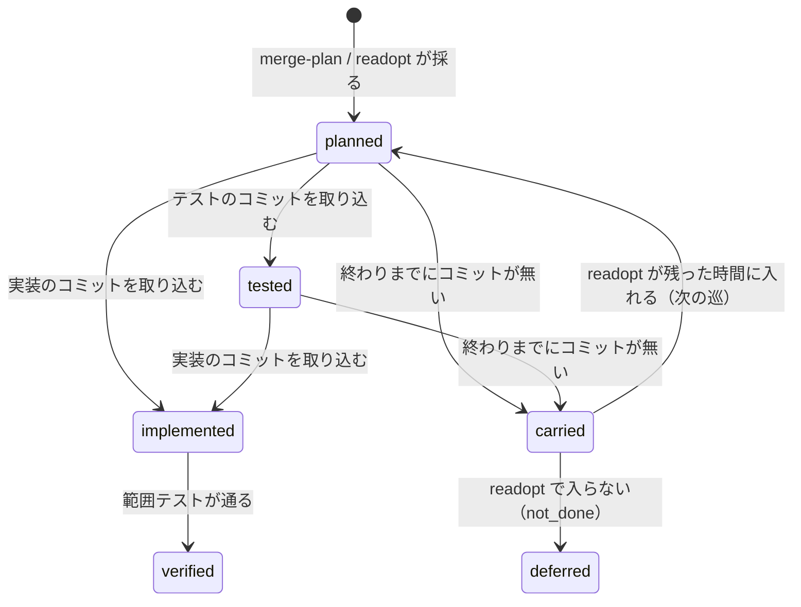

# cross-refactoring: 実装の時間の配分・採り直し・中断の後の締め切りのずらし

## 概要

**想定最大時間は、走る見込みの手順にだけ配る。** バッファは最終ゲートの全体テスト・修正 1 回・最終ゲート修正 1 回で、
危険フラグの全体テストは最終ゲートの全体テストと兼ねて数えない（`--ci-check` を付けた手元の戦略だけ数える）。
**実装を止める時刻は「実装の終わり」の 1 つだけである。** 項目ごとの期限は持たず、コミットの時刻で項目を見送らない。
検証の後に時間が残れば、`budget` で見送った候補と持ち越した項目を計画の時点の値のまま採り直す。
1 件も入らない予算なら提案の前に止まり、要る想定最大時間を出す。**想定最大時間は動いていた時間で数え**、
リファクタリング計画の後に中断して再開すると、まだ来ていない締め切りが止まっていた時間の分だけ後ろへずれる。

この文書は、その規則の組を**なぜこの形にしたか**（背景・決定と理由・常に成り立つ条件・既知の限界・テスト観点）を残す。
**手順と状態ファイルの鍵の正は Skill にある。** 式と上限の表・提案の前に止まる条件は
[`docs/02-plan-and-implement.md` の「締め切り」](../../plugins/ndf/skills/cross-refactoring/docs/02-plan-and-implement.md#締め切り)、
採り直しの手順と `readopt` の終了コードは
[同じ文書の「採り直し」](../../plugins/ndf/skills/cross-refactoring/docs/02-plan-and-implement.md#採り直し)、
再開と止まっていた時間の測り方・`pause` の鍵は
[`docs/01-state-and-propose.md` の「再開」](../../plugins/ndf/skills/cross-refactoring/docs/01-state-and-propose.md#再開)、
報告の行と実行の行の `reserve` / `paused_seconds` は
[`docs/04-verify-and-report.md`](../../plugins/ndf/skills/cross-refactoring/docs/04-verify-and-report.md) を読む。
時間の予算の全体は [cross-refactoring-time-budget.md](cross-refactoring-time-budget.md) にある。

決定の番号は #1743 の設計の番号である。コードのコメントの「#1743 決定 N」はこの番号を指す（7 と 11 は開発の進め方の
取り決めで、仕様に残らないため欠番にしてある）。

## 用語

「バッファ」「使える時間」「実装の終わり」「採り直し」「止まっていた時間」「最後の動きの時刻」「心拍のファイル」の定義は
用語集（[docs/glossary.md](../glossary.md)）が正である。

**「持ち越した項目」は、実装の終わりまでにコミットが無かった改善項目（状態 `carried`）を指す。** 用語集の「持ち越し」
（backlog-refinement の候補の上限の扱い）とは別の語として、この文書と Skill の文書では「持ち越した項目」と書く。

## 背景

決め直す前は、リファクタリング計画の時点で、危険フラグの全体テストと最終ゲートの全体テストを 1 回ずつ、合わせて 2 回分
（`w` × 2）をバッファに数えた。項目ごとに見積りから着手期限と完了期限を出し、完了期限を過ぎたコミットとコミットの無い
項目を `not_done` で見送った。締め切りは計画の時点の固定の時刻で、中断しても動かなかった。

| 実行 | 起きたこと |
| --- | --- |
| devbasex/devbase PR 421（B = 30 分、w 69.6 秒） | 実装に使えたのは約 4 分で、4 項目のうち 2 項目が `not_done`（1 件は完了期限の後にコミット）。直しと最終ゲート修正の後ろの約 17 分は使われずに残った |
| devbasex/ai-plugins PR 1745（B = 30 分、w 336.1 秒） | 計画の時点で使える時間 0.27 分。提案に 5.5 分を使ってから 14 件すべてが見送られた（採用 0）。所要 20.0 分で 10 分を残した |
| devbasex/ai-plugins PR 1801（B = 30 分、w 395.8 秒） | 経過 12.9 分・バッファ 15.8 分で使える時間 1.3 分。25 件のうち採用 1・時間で見送り 23。バッファのうち危険フラグの全体テスト（約 6.6 分）は走らなかった（PR 1780・1799 も同じ） |
| 棚卸しの 9 回（rf1673〜rf1801） | 見送り 121 件のうち 94 件が `budget`。着手期限・完了期限で `not_done` が 13 件。rf1718（B = 60 分）は 10 件を「実装の締め切りまでにコミットが無い」で `not_done` にしたまま 14.5 分を残して終わった。既定の 30 分の 5 回は、どれも約 20 分で終わって 10 分前後を残した |
| #1491 | 計画の後に中断して再開すると、固定の締め切りが過ぎていて全項目が `not_done` になった |

手元で最終ゲートを見る戦略では、検証の中の全体テストが通って HEAD が進んでいなければ、最終ゲートは全体テストを走らせない
（`commands/gate.py` の `_reusable_whole_test`）。危険フラグが立っても立たなくても、通れば全体テストは 1 回で済む。
2 回分を数えると、走らない見込みの 1 回分が実装の時間を食う。

## 規則の組

| # | 規則 | 現行の形 |
| --- | --- | --- |
| R1 | バッファ | 最終ゲートの全体テスト（手元なら w、CI で見るなら c）・修正 1 回（`fix`）・最終ゲート修正 1 回（`final_fix`）。危険フラグの全体テストは、手元の戦略に `--ci-check` を付けたときだけ w、それ以外は 0 |
| R2 | 提案の前の判定 | 着手前のテストの後、リファクタリング計画の枠の終わりに「バッファの見込み + 1 件の長さ（配分テーブルの最短の項目の実装 + 検証）」を足した時刻が `開始 + B` を越えるなら、提案者を起動せずに終了コード 4 で止まり、要る想定最大時間の下限を出す |
| R3 | 実装を止める時刻 | 実装の終わり = `最終ゲート修正の打ち切り − バッファ − Σ（採っていて未検証の項目の verify の見積り）` の 1 つだけ。テストの追加の終わりはそこから同じ項目の implement の見積りを引いた時刻。項目ごとの期限は持たず、担当にも渡さない |
| R4 | コミットの無い項目 | `not_done` にせず持ち越す（`carried`）。採り直しでも入らなかったときだけ `not_done` で見送る |
| R5 | 採り直し | 検証（直しの試行を含む）の後、最終ゲートの前に、残った時間 `最終ゲート修正の打ち切り − 今 − バッファ` に入る候補（`budget` の見送りと持ち越した項目）を計画と同じ順位と選び方で採り、テストの追加・実装・検証をもう 1 巡回す。LLM を呼ばない |
| R6 | 中断の後の再開 | 計画の後・最終ゲートの前に限り、止まっていた時間（再開の時刻 − 最後の動きの時刻）が余裕 `0.05·B` を超えれば、上限の表のうち最後の動きの時刻より後に来る締め切りだけをその分ずらす。計画し直さない |
| R7 | 記録 | バッファの区分ごとの「取った・使った・残った」秒と止まっていた秒を報告と実行の行に残す。所要はずらした秒を引いて想定最大時間と比べる |

## 決定と理由

| # | 決定 | 理由 | 採らなかった案 |
| ---: | --- | --- | --- |
| 1 | 危険フラグの全体テストを最終ゲートの全体テストと兼ね、バッファに数えない（`test_strategy.reserve_seconds` が手元で最終ゲートを見る戦略で `(0, w)` を返す）。`--ci-check` を付けた手元の戦略は `(w, c)`、CI に任せる戦略は `(0, c)` のまま | 通れば全体テストは 1 回で済む。2 回走るのは危険フラグの全体テストが落ちて直した後か、同期のコミットで HEAD が進んだときだけで、その分はバッファの外になり、直しの試行の時間と最終ゲートが想定最大時間を越える分で吸収する。PR 1801 の入力で使える時間は 1.3 分から 7.9 分になる。`--ci-check` は最終ゲートが CI を見て使い回せない | 履歴で危険フラグが走った割合を w に掛ける（新しいキーが溜まるまで効かない）。計画の時点で危険フラグを予測する（D1〜D4 は差分から決まる）。最終ゲートの全体テストを省く |
| 2 | 提案の前の判定を、既存の枠の判定（`timeline.window_problem`）の右辺に「バッファの見込み + 1 件の長さ L」を足す形で 1 つにまとめる。L は配分テーブルの手法のうち最も短い implement と verify の和（テストの追加を除く） | 止める文・止めた印（`window_stopped_at`）・打ち直し・下限の式を 1 つのまま使える。止まる費用は人の打ち直しなので、確かに 1 件も入らないときだけ止める | 別の判定を足す（打ち直しの扱いが 2 つに分かれる）。L を想定最大時間の割合にする（1 件は入る実行も止める） |
| 3 | 止まっていた時間を、作業ディレクトリ（`.cross_refactoring/`）の直下のファイルの最も新しい更新時刻から測る。CLI の監視（`monitor.py --alive-file`）とテストの実行（`process.run_with_timeout` / `run_capture`）が、待つ間 15 秒（`HEARTBEAT_SECONDS`。見回りの間隔に依らない）ごとに心拍のファイルの更新時刻を今にする | 状態ファイルは CLI の起動の前と取り込みの後にしか書かれず、CLI のログも出力の無い間は更新されない。それだけで測ると、CLI やテストが働いていた時間を止まっていた時間に数えて締め切りを延ばしすぎる。中断で止まれば心拍も止まるため、数え違いは 15 秒以内で余裕（B = 30 分で 90 秒）より小さい。待つ側はどのプロジェクトでも NDF のスクリプトである | 状態ファイルの保存のたびに時刻を書く。耐久の記録のステップの時刻を使う（手で `init` を打ち直す経路に記録が無い）。ログの更新時刻だけで測る。テストのコマンドや CLI に心拍を書かせる |
| 4 | 最後の動きの時刻より後に来る締め切りだけをずらす | すべてをずらすと、中断の前に過ぎていた実装の終わりなどが未来に戻り、動いていた間には無かった時間を再開が与える。後の締め切りだけなら、動いていた時間で比べたのと同じ結果になり、比べる場所は保存した時刻を読むままで済む | 比べるたびに時刻を動いていた時間へ直す（比べる場所のすべてを変える） |
| 5 | 直しの試行の打ち切りを開始から計算し直さず、上限の表の `fix_end_at` の 1 か所から読む（`converge._fix_stop`・`culprit.fix_deadline`） | 2 か所が開始から計算し直すと、表だけをずらしても元の値で打ち切る | — |
| 6 | 同じ処理（`pause.resume_after_pause` → `shift_for_pause`）を `init` の再開とサブコマンド `catch-up` から呼ぶ。`catch-up` は駆動の打ち直しで耐久ワークフローを続ける前に 1 度打ち、耐久ステップにしない。`init` の再開では状態を書く前に呼ぶ | 駆動は `init` を耐久ステップとして 1 回だけ打つため、`init` にだけ置くと駆動の打ち直しでずれない。状態ファイルを書くのは `refactor.py` だけのまま保てる。書いた後に呼ぶと、状態ファイルの更新時刻が最後の動きの時刻になり止まっていた時間が 0 に見える。最終ゲートに入った後の cross-review の待ちは意図した停止で、中断ではない | 状態を読むたびにずらす（どのサブコマンドも時計で状態を書き換え、テストで再現しにくい）。駆動の中で関数を直に呼ぶ（状態を書く者が 2 つになる） |
| 8 | バッファを区分ごとに「取った・使った・残った」の 3 つで残し、所要からはずらした秒を引く。実行の行の `elapsed_seconds` は壁時計のまま残し、止まっていた秒は `paused_seconds` に分ける | 残った時間だけでは越えた区分（危険フラグがバッファの外で走った）が読めない。`elapsed_seconds` の意味を変えると既存の行と比べられない。想定最大時間を変える判断（#1522）の材料になる | 残った時間だけを残す |
| 9 | 項目ごとの着手期限・完了期限を外し、実装を止める時刻を実装の終わりの 1 つにする。担当の CLI へ渡す項目（`launch-cli.sh` とプロンプト）にも期限を載せず、旧い状態ファイルに期限の鍵が残っていても渡さない | 見積りは配分テーブルの平均で、担当がそれより遅いと、想定最大時間とバッファが残っていても項目が止まる（rf1718）。担当の CLI は 1 本で順に進むため、後ろの項目が入るかは実装の終わりだけで決まる。止めてよいのは、越えると後ろの手順（検証・最終ゲート・その直し）の時間を食う時刻だけである。検証の見積りを「採っていて未検証」の項目に限るのは、持ち越した項目の検証は走らないためである。担当へ期限を渡すと、担当が自分で着手を止めて同じ制約が残る | 期限を見積りの 1.5 倍などへ緩める（時間が残っていても止める形が残る）。実装の終わりを最終ゲートの全体テストの前まで延ばす（取り込んだ項目の検証がバッファを食う） |
| 10 | 検証の後、最終ゲートの前に、見送った候補を計画の時点の値のまま採り直す（サブコマンド `readopt`）。採り直した巡で実装に渡す項目（`planned` / `tested`）が無ければ、駆動は実装担当を起動せずに検証へ進む | 採る件数は計画の時点の見積りで決まり、実装と検証が早く終われば残りは使われない。見積り・範囲テスト・グレード・`risk` を計画の時点の値で使い、D5 は実装担当の `risk` にすれば、計画の後に LLM を動かすのは作業の CLI だけという取り決めを保てる。巡の記録（手順・全体テスト）を巡ごとに持つのは、取り込みと全体テストが「書き済みなら何もしない」形で、記録を共有すると 2 巡目が取り込まれず全体テストも省かれるためである。公開は最終ゲートの入口の 1 度にまとめ、巡の数だけ CI を起動しない。空の実装の起動は所要と費用だけを使う | 担当に計画し直させる（LLM の起動と計画の時間が余った数分を食う）。予備の候補を初めから担当へ渡して続けさせる（担当が時間を見て項目を選び、時間を算術だけで決める取り決めを破る） |

## 仕様

### 構成要素と責務

| 要素 | 責務 |
| --- | --- |
| `plugins/ndf/scripts/lib/test_strategy.py`（`reserve_seconds`） | バッファに入れる全体テストの秒（危険フラグ, 最終ゲート）を戦略から返す（R1） |
| `refactor_lib/budget.py`（`plan_reserve`・`shortest_item_minutes`・`implement_end`・`add_tests_end`・`readopt_available`） | バッファ・1 件の長さ・実装の終わり・残った時間の純粋な計算。時刻は引数で受ける |
| `refactor_lib/forecast.py`（`after_plan`） | `init` の見込み（R + L）を `merge-plan` と同じ表と式で出す |
| `refactor_lib/timeline.py`（`compute`・`window_problem`・`required_budget_minutes`・`pending_items`・`fix_end_at`） | 上限の表と提案の前の判定（R2・R3） |
| `refactor_lib/pause.py`（`last_activity`・`shift_for_pause`・`resume_after_pause`） | 最後の動きの時刻の読み出し（I/O はここだけ）と、締め切りのずらし（R6） |
| `refactor_lib/process.py`（`ALIVE_FILE`）・`scripts/lib/monitor_types.py`（`heartbeat`・`HEARTBEAT_SECONDS`）・`scripts/lib/monitor.py`（`--alive-file`） | 待つ間の心拍。`refactor.py` の入口が、ID を持つサブコマンドで心拍のファイルのパスを 1 度だけ設定する |
| `refactor_lib/commands/implement.py`（`merge-tests` / `merge-implement`） | コミットの無い項目を持ち越し、残る項目が 0 件なら `phase` を `readopt` にして検証を飛ばす（R4） |
| `refactor_lib/commands/readopt.py`（`readopt`） | 採り直しと、入らないときの `not_done` の見送り（R5） |
| `refactor_lib/rounds.py`（`deferred_union`） | CI へ寄せた危険フラグを巡をまたいで合わせて読む |
| `refactor_lib/allocation.py`（`reserve_usage`）・`refactor_lib/time_report.py` | バッファの区分ごとの使われ方と、報告の行（R7） |
| `scripts/drive.py`（`Drive.catch_up`・`Drive.readopt_rounds`） | 打ち直しで `catch-up` を 1 度打つ。検証の後に `readopt` を打ち、採ったら巡を回し直す |

### 常に成り立つ条件

| 条件 | 破れたときの扱い |
| --- | --- |
| 最終ゲート修正の打ち切り `limits.final_end_at` は `開始 + B + ずらした秒の和` である。ずらしていなければ `開始 + B` | テストが落とす |
| バッファには最終ゲートの全体テスト・`fix`・`final_fix` の 3 区分が必ず入る。危険フラグの全体テストは、手元の戦略に `--ci-check` を付けたときだけ w、ほかは 0 | テストが落とす |
| 項目は着手期限・完了期限を持たず、コミットの時刻で `not_done` にならない。担当へ渡す項目にも期限は載らない | テストが落とす |
| 実装の終わりは `final_end_at − Σ plan.reserve − Σ（状態が planned / tested / implemented / failing の項目の verify の見積り）` である。`merge-plan` と `readopt` が書き、`readopt` は `final_end_at` を動かさない | テストが落とす |
| `not_done` は、実装の終わりまでにコミットが無く、採り直しでも残った時間に入らなかった項目にだけ付く。見送りにする前に `deferred_items` へ足す | テストが落とす |
| 採り直しの候補は `budget` の見送りと持ち越した項目だけで、`rank` / `duplicate` / `vocabulary` / `threshold` / `no_target` / `test_failed` の見送りと取り消した項目は採らない。採り直しは Jev・提案者・判定の CLI を呼ばない | テストが落とす |
| 計画の後に `phase` を `final` にするのは `readopt` の「入らない」（`no_fit`）だけである。取り込みで残る項目が 0 件になっても `readopt` を通る | テストが落とす |
| 2 巡目の取り込みの対象は今の巡（`readopt.round`）で採った未了の項目だけで、前の巡で検証を終えた項目とそのコミットに触れない。取り消し済みの判定は取り込みの名前と巡の組で見る | テストが落とす |
| 危険フラグの全体テストは、その巡で採った項目の危険フラグで判定する。前の巡で走らせた記録は次の巡の全体テストを省かない | テストが落とす |
| 検証の終わりでは push しない。push は最終ゲートの入口の 1 度だけである | テストが落とす |
| 再開でずらすのは計画の後・最終ゲートの前だけで、ずらす値は上限の表の `add_tests_end_at` / `implement_end_at` / `fix_end_at` / `final_end_at` / `stop_revert_end_at` のうち最後の動きの時刻より後のものだけである | テストが落とす |
| 止まっていた時間が余裕（`0.05·B`）以下ならずらさない。`pause` を持たない状態ファイルは以後もずらさず、そのことを 1 度だけ記録する | テストが落とす |
| 再開の処理を続けて 2 度打っても、ずれるのは 1 度だけである（1 度目の保存で最後の動きの時刻が今になる） | テストが落とす |
| 心拍の間隔（15 秒）は監視の見回りの間隔に依らず、待つ間の最後の動きの時刻は今から間隔の 2 倍より前にならない | テストが落とす |
| 実行の行の新しい鍵（`reserve`・`paused_seconds`）を持たない旧い行を読んでも、配分テーブル（`allocation.build_table`）の値は変わらない | テストが落とす |
| 時間の数値は B・w・x・c・s・o・時計・作業ディレクトリのファイルの更新時刻からの算術だけで決まる | レビューで見る |

### 改善項目の状態遷移（実装と採り直し）

検証・修正・取り消しの遷移は [cross-refactoring-failed-item-rules.md](cross-refactoring-failed-item-rules.md) にある。

## 運用

### 既知の限界

| 項目 | 内容 |
| --- | --- |
| 危険フラグが立って全体テストが 2 回走るとき | 危険フラグの全体テストが落ちたとき・同期のコミットで HEAD が進んだときは、最終ゲートの全体テストの終わりが想定最大時間の終わりを約 `w − fix − final_fix`（PR 1801 の入力で約 4 分）越えうる。報告の「バッファを越えた全体テスト」の行と所要の行に出る。範囲テストの対象の無い `remove_dead_code` の項目（`deletion`）は D4 を必ず立てるため、この頻度を上げる |
| 生成物の同期のコミット | `--sync-command` の同期のコミットが危険フラグの全体テストの後に積まれると、最終ゲートは使い回せず全体テストを 2 回走らせる |
| 採り直しの巡の起動の所要 | 巡ごとに担当の CLI を起動し直す。起動の所要は配分テーブルの見積りに入らないため、見積りぎりぎりの候補は実装の終わりに届かず持ち越しになりうる |
| 中断で止まった CLI の起動し直し | 駆動の打ち直しで中断した監視を流し直すとき、止まった CLI の代わりを起動するのは振り替えの既存の経路で、ずれた締め切りから監視の上限を出し直すのは次の `start-phase` である |
| 手で作業ディレクトリのファイルを触ったとき | 中断の間に `.cross_refactoring/` 直下のファイルを保存すると最後の動きの時刻が進み、止まっていた時間が短く数えられる（締め切りは延びすぎない側にずれる） |
| 旧い状態ファイル | 決め直す前の版で計画した状態は、危険フラグの w を含む `plan.reserve` をそのまま使い、計算し直さない。止まっていた時間も測らない |

## テスト観点

- PR 1801 の入力（B = 30 分・`local-full`・w = x = 395.8 秒・c = 504 秒・経過 12.9 分・配分の `fix` 1.3 分）で、使える時間が 7.0 分以上（7.9 分）になり、`final_end_at` が `開始 + 30 分` のままで、最終ゲートの全体テスト・`fix`・`final_fix` がバッファに残ること（`plugins/ndf/skills/cross-refactoring/tests/test_time_allocation.py`）
- `reserve_seconds` が CI に任せる戦略で `(0, c)`、`--ci-check` の手元の戦略で `(w, c)`、手元で最終ゲートを見る戦略で `(0, w)` を返すこと（`plugins/ndf/scripts/tests/test_lib_test_strategy.py`・`test_time_allocation.py`）
- 1 件の長さが入らない入力では `window_problem` が下限の文を返し、下限の B で打ち直すと止まらないこと。PR 1745 と PR 1801 の入力では止まらないこと。見込みが 0 なら下限が以前の式と同じ値になること（`test_time_allocation.py`・`tests/test_timeline.py`）
- 実装の終わりが項目の実装の見積りに依らず、項目のコミットが今の式の完了期限より後（rf1718 の形）でも採られ、`not_done` が 0 件であること（`test_time_allocation.py`・`tests/test_phases_git.py`）
- コミットの無い項目が `carried` になり、全項目が持ち越しでも `phase` が `readopt` になって採り直しに届くこと（`tests/test_readopt_git.py`）
- 残った時間 3.8 分・候補の見積りが順位の順に 2.1 / 2.0 / 1.1 分で、2.1 と 1.1 を採り 2.0 を飛ばし、`budget` 以外の見送りを採らず、Jev を 1 度も呼ばないこと（`test_readopt_git.py`）
- 入る候補が無ければ持ち越した項目が `not_done` で見送られ、終了コード 2 で最終ゲートへ進むこと。続けて 2 度打っても採り直しが重ならないこと（`test_readopt_git.py`）
- 2 巡目の取り込みが新しい起点から働き、前の巡の検証済みの項目とそのコミットを壊さず、取り消し済みの判定が巡ごとに働くこと（`test_readopt_git.py`）
- 採り直した巡で実装に渡す項目が無ければ実装担当を起動せずに検証へ進み、`tested` の項目があれば起動すること（`tests/test_drive_contract.py`）
- 担当へ渡す項目に `start_deadline` / `test_start_deadline` が載らないこと（旧い状態からの再開を含む。`tests/test_propose_prompt.py`）
- その巡で採った項目の危険フラグだけで全体テストを走らせ、CI へ寄せた危険フラグが次の巡の後も最終ゲートの取り消しと報告に残ること（`test_time_allocation.py`）
- 再開で、最後の動きの時刻より後の締め切りだけが止まっていた秒ずれ、過ぎていた実装の終わりは動かないこと。余裕ちょうどではずれないこと。2 回の中断は足した分だけずれること。`pause` の無い状態はずらさず `legacy` を 1 件残すこと。計画の前と最終ゲートの後は何も記録しないこと（`test_time_allocation.py`）
- 最後の動きの時刻が最も新しいファイルの時刻であること。`catch-up` を続けて 2 度打ってもずれが 1 度だけであること。状態ファイルが無ければ何もしないこと（`test_time_allocation.py`）
- ずらした `fix_end_at` で `_fix_stop` と `culprit.fix_deadline` の両方が判定すること（`test_time_allocation.py`）
- 出力の無いテストを走らせる間も心拍のファイルが更新され、見回りの間隔を大きくしても心拍の間隔ごとに更新され、入口が心拍のファイルのパスを設定すること（`test_time_allocation.py`）
- 報告にバッファの区分ごとの残りと、バッファを越えた全体テスト・採り直しの行が出て、実行の行に `reserve` と `paused_seconds` が残り、旧い行で配分テーブルが変わらないこと（`test_time_allocation.py`）

## 関連リンク

- [cross-refactoring-time-budget.md](cross-refactoring-time-budget.md)（想定最大時間に収める 1 回の実行と時間の上限の表）
- [cross-refactoring-init-test-and-phase-windows.md](cross-refactoring-init-test-and-phase-windows.md)（着手前のテストと提案・計画の枠）
- [cross-refactoring-failed-item-rules.md](cross-refactoring-failed-item-rules.md)（失敗した改善項目の扱い）
- [cross-refactoring-verify-and-final-gate.md](cross-refactoring-verify-and-final-gate.md)（検証と最終ゲート）
- [`cross-refactoring` の `docs/02-plan-and-implement.md`](../../plugins/ndf/skills/cross-refactoring/docs/02-plan-and-implement.md)（締め切りと採り直しの手順の正）
- [`cross-refactoring` の `docs/01-state-and-propose.md`](../../plugins/ndf/skills/cross-refactoring/docs/01-state-and-propose.md)（再開の手順の正）
- #1743・#1491（この規則を決めた課題）、#1522（予算を変える基準）
