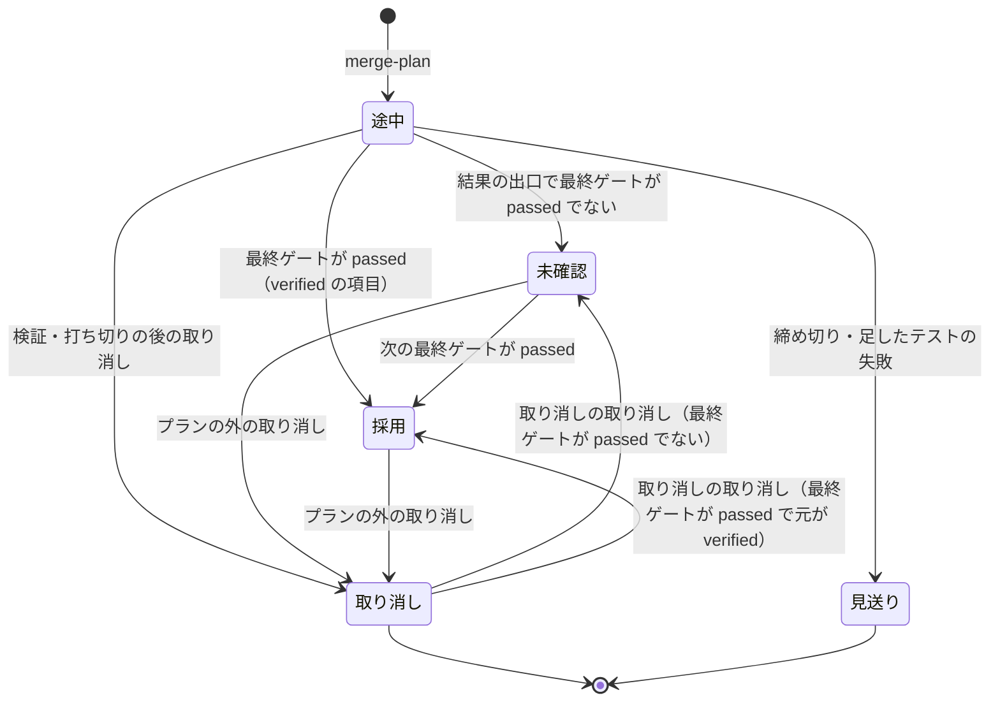

# cross-refactoring: push が落ちた・最終ゲートを通らなかった・取り消した実行のリファクタリング計画のコメントが、作られないか「採用」のまま残っていた → どの結果の出口で終わっても、コメントが結果 JSON と同じ件数と公開の状態を記す

## 目的

- **どの結果の出口で終わっても、リファクタリング計画のコメント・結果 JSON・報告の件数が一致する。** 3 つは同じ状態ファイルを
  同じ規則（`ledger.tally`）で数える。Pull Request を読む人と承認する人は、どの改善項目が採用・未確認・取り消し・見送りかを
  コミットの一覧と突き合わせずに読める
- **ブランチへ公開できたかがコメントに載る。** push が落ちた実行でもコメントができ、落ちた理由と未公開の改善項目があることが載る
- **プランの外の取り消しの後は、1 行でコメントを書き直せる。**
- **検査のプランの件数が `unconfirmed` を写す。** 「採用 0」だけが読み手へ届くことが無い

例: PR #1663 の実行で最終ゲート修正を打ち切り、7 項目を取り消し 16 項目が残った。

| 時点 | 振る舞い |
| --- | --- |
| 駆動の stopped | 結果 JSON を組む前に `plan-comment` を 1 度打つ。コメントの冒頭は `件数: 採用 0・未確認 16・取り消し 7・見送り 3（最終ゲート: failed）`、残った 16 項目の状態は「未確認」 |
| 結果 JSON | `metrics.adopted` 0・`metrics.unconfirmed` 16・`metrics.reverted` 7。コメントの件数と同じ |
| conductor が 8 項目を `git revert` して push | `python3 scripts/refactor.py plan-comment 1663 --scan-reverts` を打つ。8 項目が「取り消し」になり、件数の行も変わる |

**手順と契約は Skill が正である。** ここに書き写さない。

| 何を | 正本 |
| --- | --- |
| 書き直す時点・`plan-comment` の引数と終了コード・`--scan-reverts` の使いどころ・`metrics.unpublished` | [`cross-refactoring` の SKILL.md](../../plugins/ndf/skills/cross-refactoring/SKILL.md) の「リファクタリング計画のコメントを書き直す時点」 |
| 表示の状態の表・公開の結果（`publication`）・コメントの冒頭の 3 行・目印・`gh api` の回数 | [`docs/04-verify-and-report.md`](../../plugins/ndf/skills/cross-refactoring/docs/04-verify-and-report.md) |

この文書が扱うのは、Skill に書かない決定の理由、常に成り立つ条件、部品の契約、テスト観点である。

## 用語

定義は [用語集](../glossary.md) が正である（`.ndf/glossary.json` の `document`）。この文書で使う語は
「リファクタリング計画のコメント」「結果の出口」「未確認」「プランの外の取り消し」「公開の結果」「未公開の改善項目」である。

## 対象範囲

| 扱う | 扱わない |
| --- | --- |
| 駆動の結果の出口（done・stopped・pause）でのコメントの書き直し | push が落ちる原因（整形違反は #464・#1507） |
| 表示の状態と件数の数え方の 1 か所への集約 | 最終ゲートを経ていない項目の扱い（自動で取り消さない・採用と数えない） |
| 公開の結果の記録と、理由の伏せ字 | `--plan-file` と「記録しない」の置き場所（コメントを作らない） |
| プランの外の取り消しの読み取り（`--scan-reverts`） | cross-review の記録 |
| 検査のプランの件数（`check-trigger.py` の `findings_of`）の `unconfirmed` | 検査のプランを `--from review` で流し直したときに refactor のステップの失敗が報告に残らないこと |

## 背景

コメントを push が通った直後だけに書き、項目の状態を最終ゲートの結論と別の規則で書くと、記録が実際と食い違う。
次の 3 つが観測された。

- PR #1663: コメントが 16 件「採用」のまま残り、実際は採用 0・取り消し 7・未確認 16
- PR #1634: push が `ruff format --check` に拒否され、コメントが 1 件も出なかった
- 直近 5 本の検査の記録が `applied` 0 だけを持ち、残った改善項目の数が届かなかった

そこで書く時点を結果の出口へ、数え方を `ledger` の 1 か所へ置く。

## 構成要素

| 要素 | 責務 |
| --- | --- |
| `refactor_lib/ledger.py` の `display_status`・`tally`（`Tally`） | 項目の表示の状態と 4 つの件数を状態ファイルから 1 つの規則で決める。純粋な処理。`Tally.as_metrics()` は確定していなければ `adopted` を 0 のまま `unconfirmed` を足す |
| `refactor_lib/ledger.py` の `mark_outside_revert`・`restore_outside_revert` | プランの外の取り消しの印（`outside_revert`）を書く・戻す唯一の関数 |
| `refactor_lib/ledger.py` の `note_publication` | 公開の結果（`publication`）を残す。次の push の照合の起点（`published_sha`）とは別に持つ |
| `refactor_lib/__init__.py` の `Abort`・`die` | `die` は `❌` の 1 行を出してから、終了コードと理由を持つ `Abort`（`SystemExit` の派生）を投げる |
| `refactor_lib/publish.py` の `push_head` | 同期・ツールのパスの照合・残すコミットの照合・`git push` を 1 つの `try` で囲み、`Abort` なら `refused` と伏せ字の理由を残して投げ直し、通れば `pushed` と SHA を残す。コメントは書かない |
| `plugins/ndf/scripts/lib/secret_redact.py` の `redact_output` | URL の資格情報・GitHub のトークンの形・`x-access-token:` の値・認証ヘッダーの値を `***` にし、空でない末尾の 5 行・500 字に縮める。cross-review も同じ規則を使えるよう共通の層に置く |
| `refactor_lib/commands/plan_comment.py`（子コマンド `plan-comment`） | 状態ファイルを読み、`--scan-reverts` なら取り消しを反映し、未公開かを判定し、コメントを 1 度だけ書き直す。**コメントを書き直すのはここだけ** |
| `refactor_lib/outside_reverts.py` | origin の head ブランチの `plan.base_sha..FETCH_HEAD` から `This reverts commit <SHA>` を古い順に読み、取り消されたままのコミットの集合を返す |
| `refactor_lib/paths.py` の `_find_state`・`default_tmp_dir` | 状態ファイルを環境変数 → 現在地の `.cross_refactoring/` → 既定の worktree の置き場（`<既定の根>/<owner--repo>/rf<ID>/work/.cross_refactoring`）の順に探す。駆動の `known_tmp` も同じ関数を使う |
| `drive.py` の `refresh_plan_comment`・`counts` | done・stopped・pause の前に `plan-comment` を 1 度打ち、終了コードで分岐しない。`counts` は `ledger.tally` に `unpublished` を足す |
| `refactor_lib/plan.py` の本文・`commands/report.py` | 件数の行と項目の状態を `tally` と `display_status` で書く |
| `plugins/ndf/scripts/check-trigger.py` の `findings_of` | refactor のステップの件数に `unconfirmed` があるときだけ写す |

コメントは実行（状態ファイル）の投影で、集約を持たない。本文は状態ファイルだけから決まり、ID と URL を実行の値
（`plan_comment`）として持つ。駆動は状態ファイルを読むだけで書き換えない。

## 決定と理由

- **書き直しを駆動の終わり（done・stopped・pause）と `plan-comment` の子コマンドに寄せる。** 結果の出口は push の失敗・判定・
  打ち切り・取り消し・中断・finalize と多く、子コマンドごとに呼ぶと新しい中断の経路を足すたびに呼び忘れが起きうる。
  どの子コマンドの終わり方も駆動の 3 つの出口へ集まる。駆動の外で起きるプランの外の取り消しだけを、conductor が同じ子コマンドで
  扱う。子コマンドの終わりで毎回書くと、途中の子コマンドでも `gh api` を打ち、最終ゲートの前の状態をコメントへ出す
- **表示の状態と件数を `ledger` の 1 組の関数で決める。** 数え方が 2 か所にあったため片方だけが直っていた。最終ゲートが
  通っていないときは、`verified` に限らず取り消しでも見送りでもない項目（`items.LIVE`）をすべて「未確認」と表す。
  `metrics.unconfirmed`（`ledger.remaining_count`）が `LIVE` すべてを数えるため、件数の行と項目の数が一致する
- **`die` が理由を持つ `Abort` を投げ、公開の結果を `publication` に残す。** push が落ちる 4 つの経路はどれも `die` で止まる。
  `SystemExit` の派生にすれば捕まえない呼び出し元の振る舞いと終了コードは変わらない。`published_sha` に混ぜないのは、
  失敗や観測で次の push の照合の範囲を変えないためである
- **プランの外の取り消しは origin の head ブランチの `This reverts commit <SHA>` の行で判定する。** `git revert` は既定でこの行を
  書く。古い順に読めば取り消しの取り消しも決まり、差分の計算が要らない。差分の打ち消しで比べると、後の項目が同じ行を
  触ったときに判定できない。対象は実装コミット（`commits.implement`）だけで、テストのコミットは取り消しても残す扱いである
- **AC10 のコマンドは `refactor.py plan-comment <PR> --scan-reverts` にし、状態ファイルを既定の置き場からも探す。** 実行の ID は
  対象の PR の番号と同じで、駆動が終わった後の conductor は `CROSS_REFACTORING_TMP_DIR` を持たない。駆動にフラグを足すと、
  終わった実行の耐久の記録を開くことになり、記録の結果を返す既存の振る舞いとぶつかる
- **`metrics.unpublished` は真偽で出し、判定は `plan-comment` に任せる。** 駆動は耐久ワークフローの本体から git を直に打てない。
  件数にしないのは、公開した地点の後のコミットに同期と取り消しのコミットが混ざり、項目へ割り当てられないためである
- **`findings_of` は `unconfirmed` を持つときだけ写す。** キーが無いことを 0 と書くと、最終ゲートを通った実行・変更前の記録・
  未確認が 0 件の実行が区別できない

## 仕様

### 常に成り立つ条件

| # | 条件 | 破れたときの扱い |
| --- | --- | --- |
| I1 | コメントの 4 つの件数と、同じ時点の結果 JSON の `metrics` の 4 つの値は、同じ `ledger.tally` から出る | 集計を通らない数え方を作らない |
| I2 | 「採用」は最終ゲートが `passed` のときの `verified` だけである。`passed` でないとき `LIVE` の項目は「未確認」、`reverted` は常に「取り消し」、`deferred` は常に「見送り」 | 規則は `ledger.display_status` の 1 か所 |
| I3 | リファクタリング計画ができる前（`plan` が無い）と、置き場所がコメントでない実行では、コメントを作らない | `plan-comment` は `gh` を呼ばず `PLAN_COMMENT=skipped` で 0 |
| I4 | 1 つの実行のコメントは 1 件である | 目印 `<!-- cross-refactoring plan rf<ID> -->` で引き当てて編集する |
| I5 | コメントの投稿・編集の失敗は、駆動の結果 JSON と終了コードを変えない | 駆動は `plan-comment` の終了コードで分岐せず、`⚠` の 1 行だけ残す |
| I6 | 公開の結果の理由に認証情報を含めない | `secret_redact.redact_output` を通してから記録する |
| I7 | プランの外の取り消しで「取り消し」にするのは、origin の head ブランチで実装コミットが取り消されたままの項目だけである。後の走査で取り消されたままでなくなった項目は、`outside_revert` の元の状態へ戻す | `outside_revert` を持たない `reverted`（スクリプトが取り消した項目）は戻さない |
| I8 | 1 つの結果の出口でコメントのために打つ `gh api` は、検索 1 回と作成か編集 1 回までである | ID を持っていれば検索しない。`done()` が未確認で stopped へ移るときは 2 度目を打たない（`comment_done`） |
| I9 | refactor のステップの `metrics` に `unconfirmed` があれば、検査の件数に同じ値で写す | 無ければキーを作らない |

### 項目の表示の状態の遷移

見送りから他の状態へは移らない。採用から未確認へは移らない（最終ゲートの `passed` は戻らない）。取り消しから移るのは、
`outside_revert` を持つ項目が後の `--scan-reverts` で取り消しの取り消しを読んだときだけである。

### 取り消されたままの集合（`outside_reverts.still_reverted`）

`git log --format=%H%x00%B plan.base_sha..FETCH_HEAD` を古い順に読み、`This reverts commit <X>` を見たら X を集合に入れる。
X 自身が集合にある取り消しのコミットなら、X が取り消していたコミットを集合から外す（取り消しの取り消し）。
`--scan-reverts` は取り込んだ後に `publication` を `observed`・`sha=FETCH_HEAD` にし、未公開の判定の起点にも `FETCH_HEAD` を使う。
origin を取り込めなければ終了コード 4 で、状態ファイルもコメントも変えない。

### 未公開の判定（`plan_comment.unpublished`）

公開した地点は `--scan-reverts` では `FETCH_HEAD`、それ以外は `ledger.published_point`（push していなければ `plan.base_sha`）である。
`git merge-base --is-ancestor HEAD <公開した地点>` が成り立たなければ未公開とする。地点か work の worktree が無いか、git が
判定できなければ `None`（`UNPUBLISHED` は空、`metrics.unpublished` は `null`）。

## データ・設定

### 状態ファイル

| キー | 形 | 意味 |
| --- | --- | --- |
| `publication.status` | `pushed` / `refused` / `observed` | 最後の公開の試みの結果（`--scan-reverts` で origin を読んだときは `observed`） |
| `publication.sha` | 文字列 | `pushed` と `observed` の地点 |
| `publication.head` | 文字列 | head ブランチ |
| `publication.reason` | 文字列 | `refused` だけが持つ。伏せ字にした理由 |
| `publication.at` | 時刻 | 記録した時刻 |
| `items[].outside_revert` | `{"revert", "prior_status", "prior_failure_reason"}` | プランの外の取り消しの印。取り消しの SHA と取り消す前の状態 |

既存の状態ファイルはそのまま読める（`publication` が無ければ公開の行は `まだ push していない`）。

### 結果 JSON と検査の記録

- 結果 JSON の `metrics` に `unpublished`（真偽か `null`）を足した。既存のキー（`items`・`adopted`・`reverted`・`deferred`・
  `fix_rounds`・`final_gate`・`unconfirmed`・`review_status`）の値と、done / stopped / pause の終了コードは変わらない
- 検査のプランの件数（`findings`）は、refactor のステップが `unconfirmed` を持つときだけ `unconfirmed` を持つ

## テスト観点

テストは `plugins/ndf/skills/cross-refactoring/tests/` の `test_plan_comment.py`・`test_plan_comment_exits.py`・
`test_drive_plan_comment.py` と、`plugins/ndf/scripts/tests/` の `test_secret_redact.py`・`test_check_trigger.py` にある。

- 最終ゲートが `passed` と `failed` の状態から本文を作ると、`verified` の項目がそれぞれ「採用」「未確認」になること
- 同じ状態ファイルから作るコメントの件数の行と `Drive.counts` の 4 つの値が一致すること（`unconfirmed` が無い実行は未確認 0）
- `publication` が `pushed`・`refused`（未公開あり）の状態から、公開の行に SHA、または理由と「未公開の改善項目がある」が出ること
- push が通った後の done で、コメントが書き直され公開の行が push した SHA を持つこと
- `git push` の失敗（`pre-push` が非ゼロ）と、`_require_publishable` / `_require_no_tool_paths` の中断のそれぞれで、コメントが 1 件でき
  「push できなかった」を持つこと
- 最終ゲートが `passed` で finalize まで進んだ実行で残った項目が「採用」、最終ゲート修正を打ち切った単独起動の stopped で「未確認」に
  なること。打ち切りの後の取り消し（項目ごとの取り消し・起点への戻し）の後で取り消した項目が「取り消し」になり、起点へ戻した後に 4 で止まっても書き直すこと
- `plan` の無い状態ファイルで `gh` を呼ばず `skipped` で 0 を返すこと。`plan` のある状態で `launch-cli.sh` の失敗で止めた駆動も書き直すこと
- 項目のコミットを `git revert` して push した後、現在地と環境変数なしで `--scan-reverts` を打つと「取り消し」になり、取り消しの
  取り消しを push してもう一度打つと取り消す前の `status` へ戻ること。`git fetch` が失敗すると 4 で、状態と `gh` の呼び出しが変わらないこと
- push が落ちた実行の結果 JSON が `adopted` 0・`unconfirmed` N・`unpublished` 真を持ち、push の後に HEAD が進んでいなければ偽になること
- `adopted` 0・`unconfirmed` N の state.json から `findings_of` が `applied` 0 と `unconfirmed` N を返し、`unconfirmed` が無ければキーが出ないこと
- 同じ実行で 2 度打つと 2 度目は編集で、`plan_comment.id` を消しても目印で同じコメントを編集すること
- `gh` を失敗させた駆動の終了コードと結果 JSON が成功時と同じで、失敗の 1 行が残ること
- 最終ゲートを通って finalize まで進んだ実行の `metrics` が、変更前と同じキーと値を持つこと（`unpublished` を除く）
- 置き場所が `--plan-file` と「記録しない」の実行で `gh` を呼ばず `skipped` を返すこと
- トークンを URL に埋めた push の失敗の出力から作った理由に、トークンの文字列が残らないこと
- 各出口で `gh api` が 2 回以下、ID があれば 1 回で、done から stopped へ移っても書き直しが 1 度であること
- `refactor.py report` の項目の表が `display_status` の呼び名を持ち、見出しの件数の行がコメントと一致すること

## 関連リンク

- [`cross-refactoring` の SKILL.md](../../plugins/ndf/skills/cross-refactoring/SKILL.md)
- [`docs/04-verify-and-report.md`](../../plugins/ndf/skills/cross-refactoring/docs/04-verify-and-report.md)
- [cross-refactoring-verify-and-final-gate.md](cross-refactoring-verify-and-final-gate.md)（最終ゲートと打ち切りの後の取り消し）
- [cross-refactoring-culprit-and-stop-revert.md](cross-refactoring-culprit-and-stop-revert.md)
- 課題: #1692（子 #1684・#1648、取り込み #1652。関連 #1482・#464・#1507）
