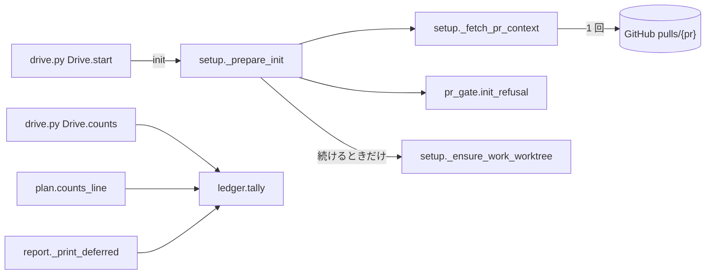

# cross-refactoring: 入口での Pull Request の状態の確認と、見送りの件数の揃え方

## 概要

**`refactor.py init` は作業ディレクトリを用意する前に Pull Request の状態を確かめ、閉じている・マージ済み・
状態を判定できないときは終了コード 4 で止まる。** 開いていれば Draft かどうかを問わず続ける。**「見送り」の
件数は、結果 JSON の `metrics.deferred`・リファクタリング計画のコメントの件数の行・完了報告の件数の行で同じ値に
なる。** 計画に入らなかった提案まで含む数は「見送った提案」として別の行に出す。

この文書は、この 2 つの規則を**なぜこの形にしたか**（背景・決定と理由・常に成り立つ条件・既知の限界・
テスト観点）を残す。**手順と鍵の正は Skill にある。** 前提と終了コードの表（`metrics.exit` 4 の理由）・
`metrics` の各キーの意味は [`SKILL.md`](../../plugins/ndf/skills/cross-refactoring/SKILL.md)、`init` が内部で
行うことは [`docs/01-state-and-propose.md`](../../plugins/ndf/skills/cross-refactoring/docs/01-state-and-propose.md)、
見送りの理由の付き方は [`docs/02-plan-and-implement.md`](../../plugins/ndf/skills/cross-refactoring/docs/02-plan-and-implement.md)、
完了報告の形と最終ステータスの対応は
[`docs/04-verify-and-report.md`](../../plugins/ndf/skills/cross-refactoring/docs/04-verify-and-report.md) を読む。

## 用語

「見送った改善項目」「見送った提案」「採り直し」の定義は用語集（[docs/glossary.md](../glossary.md)）が正である
（コンテキスト `ndf-cross-refactoring`）。

## 背景

2 つの課題を、cross-refactoring の入口の検査と結果の報告の整合の問題として 1 本で扱った。

| 課題 | 起きていたこと | 困る人 |
| --- | --- | --- |
| #1658 | `init` は Pull Request の応答（`repos/{repo}/pulls/{pr}`）を読んでいたが `state` / `merged_at` を見ず、閉じた・マージ済みの Pull Request にも提案・実装・push まで進んだ | 閉じた・マージ済みの Pull Request の head ブランチへ予告なくコミットを積まれる利用者。時間と費用もそのまま消費する |
| #1660 | 同じ実行の「見送り」を、結果 JSON の `metrics.deferred` と計画のコメントは見送った改善項目の数（`ledger.tally`）で、完了報告の件数の行は `deferred_items` の長さ（計画に入らなかった提案を含む）で数えていた | 完了報告と `metrics` を写す supervisor、振り返りで件数を数える人 |

GitHub の応答は判定に要る項目を必ず持つ。`pulls/1805` は `{"state":"closed","draft":false,"merged_at":"2026-10-06T15:44:18Z"}`、
`pulls/1387` は `{"state":"open","draft":false,"merged_at":null}` だった（2026-10-06 に実測）。マージ済みは
`state: closed` と `merged_at` の時刻で表れる。

受け付ける Pull Request は開いているものすべてで、Draft かどうかは問わない（利用者の決定、2026-10-07）。
工程が作る Pull Request は Draft で始まる（`plugins/ndf/scripts/supervise_lib/pr.py` の `_publish`）が、
Draft を外した後に起動しても入口で止まらない。

## 規則

### 入口の判定

判定は上から順に当て、最初に当たった行で止める。止めるときは標準エラーへ 1 行（先頭 `❌ `）を出し、
終了コード 4 で終わる。結果 JSON と標準出力の変数は出さない（他の `init` の中断と同じ）。

| # | 応答 | 標準エラーの 1 行 |
| --- | --- | --- |
| 1 | `state` が `open` / `closed` のどちらでもない（無いを含む） | `Pull Request #<PR> の状態を判定できない（state: <値>）。gh api repos/<repo>/pulls/<PR> の応答を確かめる` |
| 2 | `state: closed`・`merged_at` が空でない | `Pull Request #<PR> はマージ済み（merged_at: <値>）。新しい Pull Request を作って打ち直す` |
| 3 | `state: closed`・`merged_at` が空 | `Pull Request #<PR> は閉じている（state: closed）。開き直すか、新しい Pull Request を作って打ち直す` |
| 4 | `state: open`（`draft` の値を問わない） | （止めない） |

`<repo>` は `_fetch_pr_context` が解決したリポジトリ名である。判定は新しい実行にも、終わっていない状態ファイル
からの再開にも同じく当たる。駆動（`drive.py <PR>`）はこの中断を既存どおり終了コード 1・`metrics.exit` 4 で返し、
`init` の後の手順（`prepare-worktrees.sh` と担当の CLI）を起動しない。

### 見送りの件数

| 出力 | 「見送り」の値 | 出どころ |
| --- | --- | --- |
| 結果 JSON の `metrics.deferred` | 見送った改善項目の数 | `ledger.tally(state).deferred`（`drive.py` の `Drive.counts`） |
| 計画のコメントの件数の行 | 同上 | `ledger.tally`（`plan.counts_line`） |
| 完了報告の件数の行 | 同上 | `ledger.tally`（`commands/report.py` の `_print_deferred`） |
| 完了報告の「見送った提案」の行 | 見送った提案の総数と理由別の件数 | 状態ファイルの `deferred_items` |

見送った改善項目 1 件（`not_done`）と計画に入らなかった提案 2 件（`budget`・`duplicate`）の状態では、完了報告の
節は次の 2 行になる。

```text
- 採用: … / 取り消し: 0 件 / 見送り: 1 件
- 見送った提案: 3 件（理由別: budget 1 / rank 0 / duplicate 1 / vocabulary 0 / threshold 0 / no_target 0 / test_failed 0 / not_done 1）
```

理由の並びと名前は `vocabulary.DEFER_REASONS` のまま（8 つ、件数 0 も出す）。見送った提案の内訳は計画の
コメントだけが持ち、完了報告は件数だけを述べる。

## 決定と理由

| # | 決定 | 理由 | 採らなかった案 |
| ---: | --- | --- | --- |
| 1 | 検査を `refactor.py init` の、作業ディレクトリの用意（`_ensure_work_worktree`）より前に置く | `init` は駆動からも単独起動の手順からも必ず最初に打たれ、Pull Request の応答を既に読んでいる。用意より前なら止まった実行は何も作らず、API の呼び出しも増えない | 駆動（`drive.py`）に置く（`gh` を打ち足すうえ、`init` を直接打つ経路で検査が抜ける）。`assess` に置く（Pull Request の番号を受けない） |
| 2 | 判定を新しいモジュール `refactor_lib/pr_gate.py` の純粋な関数（`PrStatus.of`・`init_refusal`）にする。git も GitHub も呼ばず、終了もしない | 判定は応答の 2 項目だけで決まり、規則を 1 か所に置いて作業ディレクトリなしで縛れる。止めるかどうか（`die`）は呼ぶ側の `setup._prepare_init` が決める | `setup.py` の中に置く（試すたびに git の worktree と `gh` の差し替えを組む）。共通ライブラリ（`plugins/ndf/scripts/lib/`）に置く（使う者が cross-refactoring だけ） |
| 3 | 入口の判定は新しい実行と再開を区別しない。再開の判定は今どおり用意の後で `_resume_if_pending` が状態ファイルを読む | 閉じた・マージ済みはどちらでも止め、開いていればどちらも続けるため、区別は要らない。区別を持つと、用意より前に状態ファイルを読む経路が増える | — |
| 4 | `Draft` かどうかは判定に使わない | 受け付ける Pull Request は開いているものすべてである（利用者の決定） | — |
| 5 | 判定に使う項目が想定の値でなければ止める（「判定できない」と読んだ値を出す） | 欠けている・値が違うのは偽の応答か API の形の変化で、続けると検査が働かないまま push まで進む。`merged_at` は止まる 2 つの語（マージ済み・閉じている）を分けるだけなので、値の形を問わず空かどうかだけを見る | 欠けた `state` を `open` と見なして続ける |
| 6 | 止めるときの終了コードは `init` の既存の中断（4）を使う | 駆動は `init` の 4 を既に中断（終了コード 1・`metrics.exit` 4）として扱う。cross-review と共有する終了コードの表（`plugins/ndf/scripts/lib/drive_pause.py`）に値を足さずに済む | 新しい終了コードを足す |
| 7 | `PrStatus` は応答の値をそのまま持ち（型を直さない）、想定の値かどうかは `init_refusal` だけが決める | 判定の規則が 1 か所に集まる | — |
| 8 | 件数の食い違いは、完了報告の件数の行を `ledger.tally` へ揃えて解く。`metrics` のキーと意味は変えない | `metrics.deferred` と計画のコメントは既に `ledger.tally` から出ており、外れていたのは完了報告だけだった。`metrics.deferred` を `deferred_items` の数へ変えると、写している supervisor の読み方と計画のコメントの件数が変わる | `metrics.deferred` の意味を変える。`metrics` にキーを足す |
| 9 | 計画に入らなかった提案を含む数は、用語集の「見送った提案」で別の行に出す | 「見送り」の 1 語が 2 つを指す状態をなくす | 件数の行の中に並べる |
| 10 | 「見送った提案」の総数と理由別の件数は完了報告（`_print_deferred`）の中で数える | 使うのは完了報告だけである。`ledger.Tally` は表示の状態の件数を持つ型で、提案の記録の数を足すと `as_metrics` に載せないキーを抱える。使う者が 2 つ目に現れた時点で `ledger` へ移す | `ledger.Tally` に足す |

## 常に成り立つ条件

| # | 条件 | 破れたときの扱い |
| --- | --- | --- |
| I1 | 作業ディレクトリを用意するのも再開するのも、応答の `state` が `open` のときだけである | `init` が終了コード 4 で止まる |
| I2 | `draft` の値は判定に使わない。新しい実行と再開は同じ判定を受ける | テストが落とす |
| I3 | `state` が `open` / `closed` 以外、または無いときは続けない | 「判定できない」と読んだ値を出して終了コード 4 |
| I4 | 判定で止まった `init` は、作業ディレクトリ・状態の置き場・状態ファイルのどれも作らず、書き換えない | 判定を `_ensure_work_worktree` より前に置く（テストが落とす） |
| I5 | 判定は `init` が既に読んでいる `repos/{repo}/pulls/{pr}` の応答 1 回から行う。`init` が打つ `gh` の呼び出しの並びは判定の有無で変わらない | テストが落とす |
| I6 | 結果 JSON の `metrics.deferred`・計画のコメントの件数の行の「見送り」・完了報告の件数の行の「見送り」は、どれも `ledger.tally(state).deferred` である。見送りの件数を数える処理は `ledger.tally` の 1 か所だけである | テストが落とす |
| I7 | 状態が見送り（`deferred`）の改善項目の数は、`deferred_items` のうち理由が `not_done` か `test_failed` の記録の数と等しい | 完了報告の理由別の件数と `metrics.deferred` が食い違う（テストが落とす） |
| I8 | 完了報告の「見送った提案」の理由別の件数の和は、総数（`deferred_items` の数）と等しい | テストが落とす |

**I7 が成り立つ根拠**: 改善項目の状態を見送りにする経路は 2 つで、どちらも `defer` を呼んで同じ項目を
`deferred_items` へ足してから状態を変える。実装の取り込み（`commands/implement.py`）は足したテストが今のコードで
落ちた項目を `test_failed` で、採り直し（`commands/readopt.py` の `_close`）は入らなかった持ち越しの項目を
`not_done` で見送る。プランの外の取り消し（`ledger.mark_outside_revert`）は取り消されていない項目だけに当たり、
見送りの項目は触らない。`defer` の重複除けは項目 ID（`I-<順位>`）で見るが、計画に入らなかった提案の ID は
`C-<番号>` で名前の空間が分かれており、改善項目の見送りが既存の記録に吸われることはない。採り直した `budget` の
候補は `deferred_items` から外れるため、完了報告の数はどれも採り直しの後の状態ファイルから数える。

## 構成要素と責務

| 要素 | 責務 |
| --- | --- |
| `refactor_lib/pr_gate.py`（`PrStatus.of`・`init_refusal`） | 応答から `state` / `merged_at` を読み出し、止める理由の 1 行か `None` を返す |
| `refactor_lib/commands/setup.py`（`_fetch_pr_context`） | 既に読んでいる応答から `PrStatus` を作って返す。`gh` の呼び出しは増やさない |
| `refactor_lib/commands/setup.py`（`_prepare_init`） | `init_refusal` を呼び、理由があれば `die` する。その後で初めて `_ensure_work_worktree` を呼ぶ |
| `refactor_lib/ledger.py`（`tally`） | 表示の状態の件数（`deferred` を含む）を数える唯一の場所 |
| `refactor_lib/commands/report.py`（`_print_deferred`） | 件数の行の「見送り」を `ledger.tally` から、「見送った提案」の行を `deferred_items` から出す |



## 運用

### 既知の限界

| 項目 | 内容 |
| --- | --- |
| `init` から push までの間の状態の変化 | 判定は `init` の 1 回だけである。`init` の後に閉じられた・マージされた Pull Request へは、提案・実装・push へ進みうる |
| cross-review の入口 | 同じ検査を持たない（範囲の外） |

## テスト観点

- 新しい実行で `state: closed`・`merged_at: null` の応答なら、`init` が終了コード 4 で止まり、標準エラーに `#<PR>` と
  「閉じている」が出て、作業ディレクトリも状態ファイルも作られないこと。`merged_at` に時刻があれば「マージ済み」が出ること
  （`plugins/ndf/skills/cross-refactoring/tests/test_init.py` の
  `test_init_stops_before_preparing_the_work_dir_for_a_pull_request_it_must_not_touch`）
- `state: open` なら、`draft` が `true`・`false`・無い・文字列のどれでも止まらずに状態ファイルができること
  （`test_a_new_run_continues_on_an_open_pull_request_whatever_its_draft_is`）
- 終わっていない状態ファイルがあるとき、`state: open` なら `draft: false` でも続き、`state: closed` なら終了コード 4 で
  止まって状態ファイルの中身が変わらないこと（`test_a_resumed_run_continues_on_an_open_pull_request_that_is_not_draft`・
  `test_a_resumed_run_stops_on_a_closed_pull_request_without_touching_the_state`）
- `state` が `merged` などの値・`state` が無い応答では、終了コード 4 と「判定できない」が出て続けないこと。
  `init_refusal` を判定の表の 4 行で呼ぶと、止める行は理由の 1 行、止めない行は `None` を返すこと（`tests/test_pr_gate.py`）
- 判定で止まる場合も続く場合も、`init` が打つ `gh` の呼び出しの並びが判定の無い場合と同じであること
  （`test_the_pull_request_check_adds_no_gh_call`）
- 駆動の `init` が終了コード 4 で終わると、駆動は終了コード 1・`metrics.exit` 4 で終わり、`prepare-worktrees.sh` と担当の
  CLI を起動せず push しないこと（`plugins/ndf/scripts/tests/test_drive_refactor.py`）
- `plugins/ndf/scripts/lib/drive_pause.py` の終了コードの表を変えずに、cross-review の駆動のテストが通ること
- 見送った改善項目 1 件（`not_done`）と計画に入らなかった提案 2 件（`budget`・`duplicate`）の状態から、`Drive.counts` の
  `deferred`・`plan.counts_line` の「見送り」・`refactor.py report` の件数の行の「見送り」がどれも 1 であること
  また理由別の `not_done` と `test_failed` の和が `metrics.deferred` と等しいこと
  （`tests/test_outbound_text.py` の `test_the_deferred_count_agrees_across_metrics_plan_and_report`）
- 同じ状態で、完了報告に「見送った提案: 3 件」と理由別の件数（`budget 1`・`duplicate 1`・`not_done 1`、他は 0）が件数の
  行と別の行に出て、理由別の和が総数と等しいこと（`test_the_report_states_the_deferred_proposals_on_their_own_line`）
- `deferred_items` だけを増やした状態（改善項目は変えない）で、完了報告の件数の行の「見送り」が変わらないこと
  （`test_the_report_counts_line_does_not_follow_the_deferred_proposals`）
- 結果 JSON の `metrics` のキーの集合と値の意味が変わらず、既存の駆動のテスト（`plugins/ndf/scripts/tests/test_drive_refactor.py`・
  `tests/test_drive_contract.py`）が変更なしで通ること

## 関連リンク

- [`cross-refactoring` の `SKILL.md`](../../plugins/ndf/skills/cross-refactoring/SKILL.md)（前提・終了コードの表・`metrics` の説明）
- [`cross-refactoring` の `docs/04-verify-and-report.md`](../../plugins/ndf/skills/cross-refactoring/docs/04-verify-and-report.md)（完了報告の形）
- [cross-refactoring-failed-item-rules.md](cross-refactoring-failed-item-rules.md)（取り消しと見送りを分けて数える規則）
- #1658（入口の検査）、#1660（見送りの件数。#1658 に取り込み）、#1743（採り直し）
