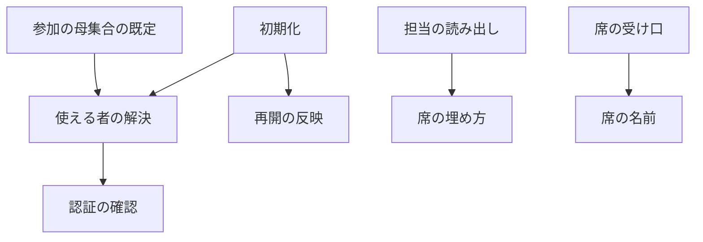
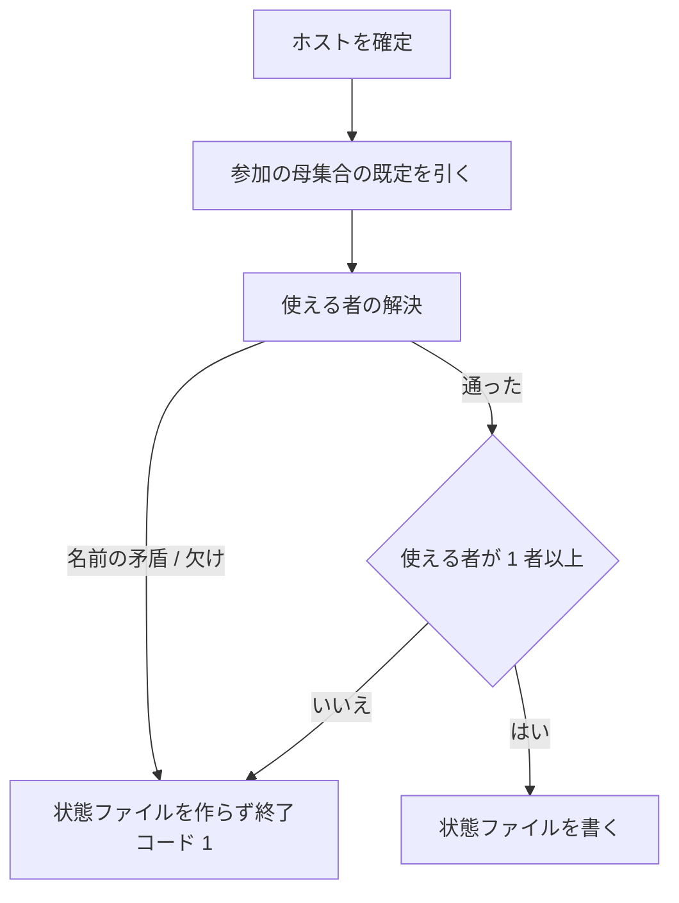
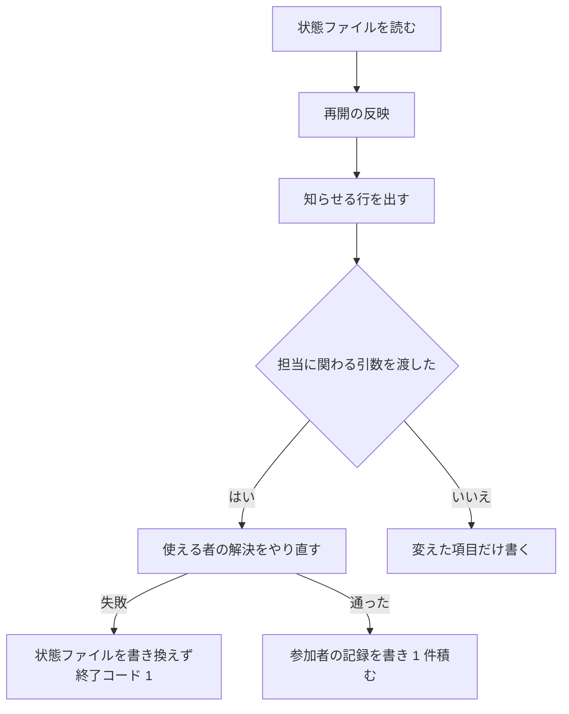

# cross-review: 参加する CLI が 1 者でも使えないと収束ループを開始できず、再開で渡した引数が黙って無視される → 使える者だけで開始し、毎ラウンド 2 席を確保し、再開で渡した引数は反映されるか反映しないと知らされる

cross-refactoring の実装担当は、ライブラリの `choose_implementer` が
名指し → ホスト → 参加者の先頭で決める。使い方は
[想定最大時間の確定仕様](cross-refactoring-time-budget.md#実装担当の決め方) が持つ。

## 目的

**参加する CLI のどれか 1 者が導入・認証されていなくても、収束ループが始まる。** 使えない者と
その理由は、初期化の出力と状態ファイルに残る。

**各ラウンドに 2 つの席が確保される。** 使える者が 1 者のときは、同じランタイムの 2 つ目が
席を埋める（#892）。0 者なら初期化が失敗する。1 席で回るのは、利用者が 1 者指定を渡したときだけである。

**中断した収束ループを引数を変えて再開すると、その引数は反映されるか、反映しないと知らされる。**
黙って捨てられる引数は無い。

**使える者の決定・席の埋め方・再開の反映の 3 つの規則は、収束ループを回す 2 つの Skill が
共有するライブラリが 1 か所ずつ持つ。** Skill の側は結果を状態ファイルと終了コードへ写すだけである。

**手順と引数の表は
[`cross-review` の SKILL.md](../../plugins/ndf/skills/cross-review/SKILL.md)と
[`docs/`](../../plugins/ndf/skills/cross-review/docs/05-pool-and-convergence.md)が正である。**
ここに書き写さない。この文書が扱うのは、そこに書かない決定の理由と、ライブラリの契約である。

## 用語

本文は左の業務用語で書く。識別子は表・コードブロック・業務用語の初出の括弧書きにだけ置く。

| 業務用語 | 識別子 | 何を指すか |
| --- | --- | --- |
| ランタイム | `ALL_RUNTIMES` | `claude` / `codex` / `agy` / `kiro` の 4 つ。並びは固定 |
| ホスト | `host` | 収束ループを起動している CLI |
| 参加の母集合 | `review_pool(host)` / `refactor_pool(host)` | Skill ごとに決まる参加者の出発点。cross-review は claude / codex / kiro とホスト（#786。agy は `--include agy` で戻す。ホストが agy なら 4 者） |
| 参加者 | — | 参加の母集合に足す者を加え、外す者を除いた一覧。認証の確認の対象 |
| 使える者 | `participants.available` | 参加者のうち認証の確認を通った者 |
| 認証の確認 | `probe_auth` | 確認コマンドを走らせ、止めずに結果だけを返すライブラリの関数 |
| 使える者の解決 | `resolve_participants` | 参加の母集合・足す者・外す者・1 者指定・確認の結果から使える者を決めるライブラリの関数 |
| 参加者の記録 | `participants` | 使える者の解決の結果を持つ状態ファイルの項目 |
| 席 | — | 1 ラウンドで 1 つの CLI プロセスが占める場所 |
| 席の名前 | `SEAT_PATTERN` / `seat_runtime` | ランタイム名か、その名前に `-2`〜`-9` を付けた形 |
| 席の埋め方 | `review_seats` | 使える者と埋め合わせから 2 席を返すライブラリの関数 |
| 埋め合わせ | `participants.fallback` | 席が足りないときに使う者。#892 の後に作る状態では空で、#892 の前に作った状態だけがホストを持ちうる |
| 実装担当の決め方 | `choose_implementer` | cross-refactoring の参加者・ホスト・名指しから実装担当 1 者と決め方を返すライブラリの関数 |
| 1 者指定 | `--only` | 担当を 1 者に固定する引数 |
| 全員を要する指定 | `--require-all` | 認証の確認の失敗が 1 者でもあれば初期化を止める引数 |
| 再開 | — | 状態ファイルが残り `final` が `null` のときの初期化 |
| 再開の反映 | `apply_resume_args` / `ResumeField` | 渡した引数を状態へ重ね、反映しない引数を知らせるライブラリの関数と、表の 1 行 |
| 再開で変えた値の記録 | `resume_changes` | 再開で変えた値を積む状態ファイルの項目 |
| 初期化 / ラウンドの開始 / 結果の受け口 / 完了報告 | `init` / `start-round` / `read-result` / `report` | `state.py` の副コマンド |

## 対象範囲

この文書が扱うのは、ライブラリと cross-review の側である。

| 扱う | 扱わない |
| --- | --- |
| ライブラリの使える者の解決・認証の確認・席の埋め方・実装担当の決め方・席の名前・再開の反映 | cross-refactoring の参加の母集合・実装担当の使い方・再開の表（[cross-refactoring の参加者](cross-refactoring-participants.md)と[想定最大時間の確定仕様](cross-refactoring-time-budget.md)が持つ） |
| cross-review の新規と再開の初期化、担当の決まる順、席の名前が流れる経路、完了報告の参加者の節 | 起動した後に分かる使えなさで担当を自動的に外す仕組み |
| — | ライブラリの上限の表（`lib/limits.py`）へ足した cross-refactoring の工程名（`plan` / `add-tests` / `implement`）と、Jev の呼び出し（`lib/jev.py`）（[想定最大時間の確定仕様](cross-refactoring-time-budget.md)が持つ） |

実装担当の決め方はライブラリに入っているためここで扱う。呼び出す側は cross-refactoring だけである。

## 背景

**認証の確認が 1 件の失敗でその場で終了すると、ゲートになる。** 4 つの CLI が
揃っていない環境では収束ループを開始できない。使える CLI が 2 者あっても、3 者目が
入っていなければ初期化ごと止まる。

**使える者が 2 者に満たないラウンドの扱いが無かった。** 担当を決める関数は参加の母集合を
「全ランタイム − ホスト」の定数から作り、使える者を入力に取らない。そのため一部が使えない
構成では、担当が 1 者になるか、担当そのものを決められなかった。

**再開で渡した引数が黙って無視されていた。** 中断した収束ループを 1 者指定やラウンドの上限を
変えて再開しても、状態ファイルの値がそのまま使われる。利用者には、渡した引数が効いたのか
どうかを知る手立てが無かった。

**前のラウンドのチェックが、固定の 2 者で結果を数えていた。** 担当がその 2 者と違うラウンドでは、
担当でない者を結果なしと読み、修正の記録が無いまま次のラウンドへ通していた。

## 決定と理由

| 決定 | 理由 |
| --- | --- |
| 使える者を決める規則をライブラリの 1 つの関数へ置き、Skill は結果を状態ファイルと終了コードへ写すだけにする | 規則を Skill ごとに書くと、参加の母集合の作り方・除外のチェック・確認の扱いが 2 か所にでき、片方だけが古くなる |
| 認証の確認は止めずに結果だけを返す形にし、確認コマンド・未認証の文言・時間切れの秒数は変えない | 確認と中断が 1 つの関数にあると、使える者で回す経路から呼べない。止めるかどうかは全員を要する指定が決める |
| 確認コマンドを起動できないときは、例外の種類を問わず「通らない」として返す | 権限の拒否だけを足す形では、実行形式でないファイルで同じ落ち方が残る。起動できない理由が何であっても、その CLI は使えない |
| 読めない検索のパスで見つからないときも、理由は「実行できない」として出す | 見つからないことと実行権が無いことは同じ例外で返る。見分けるには検索のパスを自分で辿り直すことになり、確認を 1 つ走らせる関数の範囲を超える。理由に権限の拒否が出れば、利用者は検索のパスとファイルの権限を見ればよい |
| 参加者は「既定に足す者を加え、外す者を除く」で決め、既定は Skill ごとの関数が持つ | 使う側を並べる形は、ホストが変わるたびに一覧を書き直すことになる |
| 全員が揃わないなら始めたくない運用のために、全員の確認が通ることを求めるゲートを指定で選べるようにする | 既定を変えるだけでは、揃っていることを要求する運用が選べなくなる |
| 席は 2 つとし、使える者 → 同じランタイムの 2 つ目の順で埋める | 各ラウンドで 2 つの目で見ることを最優先にする。同じ言語モデルの 2 つの文脈より、違う言語モデルの 2 つの文脈のほうが観点が分かれる |
| cross-review の参加の母集合にホストを含め、ホストを別に確かめて埋め合わせに使わない（#892） | レビュー担当は CLI プロセスとして起動するため、ホストと同じランタイムでもホストの会話の作業文脈は持ち込まれない。ホストが使える者に居ないのは確認を通らなかったか外す指定で外したかのどちらかで、前者は確かめ直しても通らず、後者で席へ戻すと利用者の指定に反する |
| 参加の母集合の関数は引数のホストを残す | 呼び出し側の形を変えずに済み、ホストになれない名前を弾くチェックの置き場所が残る |
| 既定の参加の母集合から agy を外し、claude / codex / kiro とホストにする（#786 で前の「外さない」を置き換えた） | agy はテストを背景で起動して結果を残さずに終わることがあり、起動し直しても残らなければ収束が止まる。実運用は既に毎回 `--exclude agy` を渡していた。戻すときは `--include agy`。プロンプトの指示（テストと背景の処理を起動しない）だけで直すことは採らなかった。担当が従うかを確かめる手段が無く、従わなかったときの損失（収束の停止）が大きい |
| 参加の母集合に無い者の外す指定は、止めずに無視して 1 行で知らせる | 既定に agy が無くても、`--exclude agy` を書いた既存の手順が止まらずに通る。無視した名前は外した者と分けて記録する（同じ記録にすると後から母集合を読み違える）。判定はライブラリに置き、cross-refactoring も同じく無視する（同じ引数の意味を Skill で変えない）。綴りの誤りは引数の型が止める |
| 1 者指定で名指しした者は、参加の母集合に無くても参加者にする（#786） | 名指しした時点で利用者の意図は明らかで、同じ意図を足す指定と 2 つの引数で書かせない |
| 状態ファイルに版を持たせず、ホストだけを持つ状態の再開の分岐 1 つにだけ #892 の前の母集合（全ランタイム − ホスト）を式で置く | 参加者の記録を持つ状態は保存された値から席を決めるため、関数を変えても席は変わらない。版を持たせると、分岐が 1 か所で済むところへ書く側と読む側の両方に版の扱いが要る |
| 再開で担当に関わる引数を渡したときの作り直しは、保存された参加の母集合ではなく今の既定から解決する | 担当に関わる引数を渡すのは明示の作り直しであり、席を保つ互換は引数を渡さない再開に限る。保存された母集合を使う形はコードと規約の追記が要る |
| 埋め合わせの候補は、使える者に含まれない者だけを使う | #892 の前に作った状態の埋め合わせ（ホスト）が使える者に入っているとき、ホストを埋め合わせにも使うと同じ席の名前が 2 つ並ぶ |
| 1 者指定のときは埋め合わせをしない | 利用者が 1 席と決めた指定である |
| 担当の単位を席の名前にし、1 つ目の席の名前はランタイム名そのままにする | 同じランタイムの 2 つ目を立てるには、結果ファイルの stem と状態ファイルの鍵を分ける名前が要る。埋め合わせが要らない実行では、従来と同じ名前しか現れない |
| 接尾辞の区切りをハイフンにする | ランタイム名にハイフンを含むものが無いため、シェル側の切り出しとライブラリの解釈が同じ規則になる |
| 監視では、席の形に合わない名前をそのまま返す | 担当名を任意の骨格で受ける cross-refactoring の経路がある。形で弾くとその経路が壊れる |
| 担当はラウンドの記録から先に見る | 再開で 1 者指定を変えても、過去のラウンドの担当が変わらない |
| 前のラウンドのチェックにも、そのラウンドの担当を渡す | 固定の 2 者で数えると、担当が違うラウンドで担当でない者を結果なしと読み、修正の記録が無いまま次へ通す |
| cross-refactoring の実装担当は、名指し → ホスト → 参加者の先頭で 1 者に決め、輪番を持たない（#933。以前は「ラウンド番号を参加者の数で割った余り」の輪番だった） | 1 回の実行の計画から修正までを同じ 1 者が通す。決め方が状態に依らず、再開しても変わらない |
| 再開の反映をライブラリに置き、どの引数を「反映する」「知らせる」にするかは Skill ごとの表が持つ | 片方の Skill の再開の経路だけを直すと、もう片方に引数を捨てる形が残る |
| 状態ファイルに載る引数は表のどちらかに必ず載せ、引数の既定を未指定にする | 黙って捨てる引数を残さない。既定値と同じ値なら渡していないとみなす形では、上限を既定値へ戻す操作を区別できない |
| 担当に関わる引数を渡した再開でだけ、認証の確認をやり直して参加者を作り直す | 途中で担当が入れ替わると、前のラウンドの記録と突き合わせられなくなる |
| 作り直しのとき、渡さなかった引数は状態ファイルの値で補う | 初期値へ戻すと「明示した引数だけを反映する」が破れる |
| 指定を外す値は予約語 `none` にする | 骨組みは値のあるときだけ引数を渡すため、空文字列では指定を外せない |
| 参加者の作り直しは、記録へ 1 件として積む | 項目ごとに積むと 1 回の再開で最大 7 件になり、完了報告で読みにくい |
| 骨組みは 1 者指定のシェル変数で担当を絞り直さず、ラウンドの開始が返す席を使う | 返る一覧は 1 者指定と埋め合わせを反映済みである。もう一度絞ると、状態ファイルとシェル変数がずれたときに起動も監視も誰にも当たらない |
| 起動した後に分かる使えなさで担当を自動的に外す仕組みは作らない。結果を残さなかった担当を別のランタイムへ振り替えることも含めない（#919） | 一時的な打ち切りでも、以後のラウンドから恒久的に外れる。振り替えは利用上限のように同じ実行の中で再び当たり得るため、規則（いつ・誰へ・何回）を別に決める |
| 規則の実装はライブラリ、手順は各 Skill の手順書、理由はこの文書が持つ | 規則が決まっても、置き場所が決まらなければ次に使う人へ届かない |

## 仕様

### 常に成り立つ条件

| 条件 | 破れたときの扱い |
| --- | --- |
| 使える者の並びは、ランタイムの固定の順である | 解決の中で並べ直すため、入力の順序に依らない |
| 使える者が 3 者のときの席は、この変更の前の輪番と同じ値になる | 4 つのホスト × ラウンド 1〜12 の全組で一致することをテストが固定する |
| 1 ラウンドの席は 2 つで、同じ席の名前が 2 つ並ばない | 埋め合わせの候補から使える者を除いて選ぶ |
| 使える者も埋め合わせも無ければ、席を返さず失敗する | 割り当ての失敗（`AssignmentError`）を上げ、初期化は状態ファイルを作らずに終了コード 1 |
| 状態ファイルに載る引数は、再開の表の「反映する」か「知らせる」のどちらかに載る | 表に無い引数は、状態ファイルに載らない 3 つ（worktree ・観点・追加指示のファイル）だけである |
| 再開で渡さなかった引数は、状態ファイルの値のまま残る | 参加者を作り直すときも、渡さなかった引数は記録から補う |
| この変更の前に始めた実行の状態ファイルを、書き換えずに読める | 項目が無いときの読み方を「項目が無いときの読み方」が決める |

### 構成要素と責務

| 要素 | 責務 | 置き場所 |
| --- | --- | --- |
| 参加の母集合の既定 | Skill ごとの出発点を返す | `lib/assignment.py` の `review_pool` / `refactor_pool` |
| 使える者の解決 | 参加の母集合・ホスト・足す者・外す者・1 者指定・確認・全員を要するかから、参加者の記録を返す。名前の矛盾と欠けを例外で返す | 同 `resolve_participants` |
| 認証の確認 | 確認コマンドを走らせ、止めずに担当ごとの結果を返す | `lib/auth.py` の `probe_auth` |
| 席の埋め方 | 使える者と埋め合わせから 2 席を返す。規則の表はこの関数の docstring が正 | `lib/assignment.py` の `review_seats` |
| 実装担当の決め方 | 名指し（参加者に無ければ例外）→ ホスト → 参加者の先頭で 1 者と決め方（`named` / `host` / `first`）を返す | 同 `choose_implementer` |
| 席の名前 | 席の名前からランタイムを引く。形のチェックを持つ | 同 `seat_runtime` / `SEAT_PATTERN` |
| 再開の反映 | 表に従って状態へ書き、記録へ積み、知らせる行を返す | `lib/statefile.py` の `apply_resume_args` / `ResumeField` |
| 使える者の決定（cross-review） | ライブラリを呼び、埋め合わせを空として参加者の記録を返す。使える者が 0 者のときと失敗を終了コード 1 へ写す | `cross-review/scripts/state.py` の `_resolve_reviewers` |
| 担当の読み出し | 決まった順で席を返す。前のラウンドのチェックへその担当を渡す | 同 `_round_reviewers` / `_guard_previous_round` |
| 席の受け口 | 席の名前を受け、起動する CLI を席の名前から引く | `read-result` の引数の型、`launch-reviewer.sh`、`critique.sh`、`lib/monitor.py`、`measure.py` |
| 完了報告の参加者の節 | 参加した者・外した者・確認を通らなかった者・埋め合わせ・再開で変えた値を出す | `cross-review/scripts/state.py` の `_print_participants` |

要素の関係（辺は呼び出し）:



### 使える者の決め方

参加者を決め、認証の確認を通った者を使える者として記録する。順序は次のとおりである。

| 順 | 何をするか |
| ---: | --- |
| 1 | 足す者・外す者・1 者指定の各名前がランタイムの一覧にあり、足す者と外す者が重ならず、1 者指定が外す者に無いことを確かめる。1 者指定が「既定 ∪ 足す者」に無ければ足す者として扱う（記録の足した者には書かない。#786 の決定 12）。外す者のうち「既定 ∪ 足す者 ∪ 1 者指定」に無い名前は、止めずに無視した除外へ残して外す者から除く（決定 2） |
| 2 | 参加者 = 既定 ∪ 足す者 − 外す者（ランタイムの固定の順） |
| 3 | 1 者指定があれば、参加者をその 1 者にする（順 1 で母集合へ足し、外す者との矛盾も弾いてあるため参加者に含まれる） |
| 4 | 参加者へ認証の確認を行う。確認を飛ばす環境変数（`NDF_SKIP_AUTH_CHECK`）が立っていれば全員を通ったものとし、飛ばした目印を真にする |
| 5 | 全員を要する指定が真で通らない者がいれば、欠けた者と理由を並べて失敗する |
| 6 | 通った者を使える者、通らなかった者と理由を通らなかった者として返す |

**外した者へは確認コマンドを呼ばない。** 確認の回数は参加者の数を超えない（#892 の前にあった、
埋め合わせのためのホストの 1 回は無くした）。

**確認コマンドを起動できないときは、理由を問わず「通らない」として返す。** 理由は 3 つに
分かれる。

| 起動できない理由 | 返す理由 |
| --- | --- |
| コマンドがどこにも無い（見つからない例外） | `コマンドが見つかりません` |
| 確認の秒数の中で応答しない | `<秒数> 秒で応答しませんでした` |
| 実行できない（読めないディレクトリを含む検索のパスでの権限の拒否、実行権の無いファイル、実行形式でないファイル） | `コマンドを実行できません（<例外の説明>）` |

**検索のパス（`PATH`）に読めないディレクトリがあると、コマンドがどこにも無いときでも
見つからない例外ではなく権限の例外が上がる。** 実行形式でないファイルも同じ形で落ちる。
3 つ目をまとめて返すことで、どの理由でも参加者の解決は続き、使える者だけで収束ループが
始まる。

cross-review の新規の初期化は、この結果に空の埋め合わせを足して状態ファイルへ書く。



使える者が 1 者のときは、席の埋め方が同じランタイムの 2 つ目で 2 席目を埋める。

**1 者指定のときは、この分岐へ入らない。** 埋め合わせを行わず、指定した 1 者が確認を通らない
ときだけ終了コード 1 で終わる。確認を通らない担当が席に座ると、レビューが行われないまま
収束するためである。

### 席の埋め方

| 使える者の数 | 席 |
| ---: | --- |
| 3 以上 | ラウンド番号を使える者の数で割った余りの位置と、その次の位置の 2 者。並びは使える者の順 |
| 2 | その 2 者 |
| 1 | その 1 者と、埋め合わせのうち使える者に含まれない先頭の者。そのような者が無ければ、その 1 者の 2 つ目 |
| 0 | 埋め合わせの先頭と、その 2 つ目。埋め合わせが空なら失敗する |

**#892 の後に作る状態は埋め合わせが空であるため、1 者の行は 2 つ目で埋まり、0 者の行には
初期化の段階で至らない。** 埋め合わせを使う行は、#892 の前に作った状態を再開したときだけ働く。

**3 者のときの値は、この変更の前の輪番と一致する。** 4 者のときはラウンド 1〜4 で各者が
ちょうど 2 回担当になる。ホスト claude の既定（claude / codex / kiro）では、ラウンド 1 が
codex と kiro、2 が claude と kiro、3 が claude と codex になる。

### 席の名前

**担当の単位は席の名前である。** 形はランタイム名か、その名前にハイフンと 2〜9 を付けたもの
（`^(claude|codex|agy|kiro)(-[2-9])?$`）で、後者が同じランタイムの 2 つ目以降を表す。

| 受け口 | 席の名前の扱い |
| --- | --- |
| 結果の受け口の担当の引数 | 席の形を型としてチェックする。通らなければ終了コード 2 |
| レビューの起動（`launch-reviewer.sh`）と反証の起動（`critique.sh`） | 席の形を先頭でチェックし、起動する CLI を `${SEAT%%-*}` で選ぶ。結果ファイルの stem は席の名前で組む |
| 監視（`lib/monitor.py`） | 位置引数は席の形か `both` を通す。CLI 固有のログのチェックは席の名前からランタイムを引いて選ぶ。席の形に合わない名前はそのまま返す |
| 計測（`measure.py`） | 担当の記録を数えるとき、名前の一覧ではなく席の形に一致する鍵を数える |

使える者が 1 者（`codex`）のラウンドで席の名前が流れる経路は次のとおりである。

```text
start-round → REVIEWERS="codex codex-2"
  → launch-reviewer.sh codex-2 … : 起動する CLI は codex、stem は codex-2-review-pr<N>
  → monitor.py --agents codex,codex-2
  → state.py read-result <pr> codex-2 : rounds[-1]["codex-2"] へ書く
  → critique-round.sh <pr> <round> codex codex-2 → critique.sh codex-2 …
```

### ラウンドの担当が決まる順

**先に当たったものを採る。**

| 順 | 状態 | 返る担当 |
| ---: | --- | --- |
| 1 | そのラウンドの記録に担当がある | その値 |
| 2 | 1 者指定がある | その 1 者だけ |
| 3 | 参加者の記録がある | 使える者と埋め合わせから 2 席 |
| 4 | ホストがある | 全ランタイム − ホストの 3 者から 2 席（この変更の前の輪番と同じ値）。#892 で参加の母集合がホストを含む形へ変わったため、この分岐だけは変更の前の母集合を式で持つ |
| 5 | どれも無い | `codex` / `agy` |

**ラウンドの記録を 1 者指定より先に見る。** 再開で 1 者指定を変えても、過去のラウンドの担当が
変わらないようにするためである。

**前のラウンドのチェックは、そのラウンドの記録の担当で結果を数える。** 記録が無いときだけ、この順で
引き直す。

### 実装担当の決め方

`choose_implementer(participants, host, named)` は、名指しがあればそれ（参加者に無ければ
`AssignmentError`）、無ければホストが参加者にいればホスト、それ以外は参加者の先頭を返す。
参加者が空なら `AssignmentError` である。呼び出す側は cross-refactoring だけで、使い方は
[想定最大時間の確定仕様](cross-refactoring-time-budget.md#実装担当の決め方)が持つ。

### 再開で渡した引数の扱い

| 扱い | 引数 | 何が起きるか |
| --- | --- | --- |
| 反映する | `--max-rounds` / `--rotate-after` / `--verify-command` / `--verify-exit-code` | 状態ファイルを書き換え、記録へ 1 件積み、変更の行を出す |
| 反映し、参加者を作り直す | `--only` | 上に加えて、認証の確認をやり直して参加者の記録を置き換える。`none` で 1 者指定を外す |
| 参加者を作り直す | `--exclude` / `--include` / `--require-all` | 使える者を解決し直して参加者の記録を置き換える。`none` で一覧を空へ戻す |
| 知らせる | `--host` | 状態ファイルは変えず、状態と違うときだけ 1 行を出す |

**値が同じ引数は、行も記録も出さない。**



**作り直しの入力は 2 つである。** 渡した引数と、渡さなかった引数の状態ファイルの値（足した者・
外した者・全員を要するかと、1 者指定）である。#892 の前にホストを足して始めた実行へ外す指定だけを渡した
再開では、足した者の記録はそのまま残る。

**作り直しの参加の母集合は、状態ファイルに保存された値ではなく今の既定である。** #892 の前に
始めたループを外す指定で作り直すと、使える者にホストが加わる。引数を渡さない再開では席は変わらない。

**作り直しの失敗は、状態ファイルを書き換える前に起きる。** 使える者の解決を先に呼び、通って
から状態ファイルへ書く。

**外す指定を渡さない作り直しは、外した者と無視した除外の両方を記録から足し戻す**（#786。
`recorded_exclusions`）。無視した除外を落とすと、別の引数で再開しただけで完了報告から「既定の
母集合に無かった者」が消える。**無視した名前を足す指定か 1 者指定に渡したときだけ、その名前は
足し戻さない**（新しい指定を優先する。外す指定 agy で始めた実行を 1 者指定 agy で再開すると、
矛盾で止まらず agy 1 者で回る）。外した者と足す指定の重なりは今どおり矛盾として止める。再開で
1 者指定に `none` を渡すと、既定の母集合へ戻る。

### 完了報告の「参加した者」

完了報告の PR 履歴の後に、8 行の節を出す。

```text
## 参加した者
- 母集合: claude / codex / kiro
- 使える者: claude / codex / kiro
- --exclude で外した者: なし
- --exclude で指定したが既定の母集合に無かった者: agy
- --include で足した者: なし
- 確認を通らなかった者: なし
- 席の埋め合わせ: なし
- 再開で変えた値: 2026-09-19T12:00:00 participants … → …
```

参加者の記録を持たない状態ファイルでは「使える者: 記録なし」の 1 行だけを出す。確認を飛ばした
目印が真のときは、通らなかった者の行に「確認を飛ばした（`NDF_SKIP_AUTH_CHECK`）」と出す。

## データ・設定

### 状態ファイルに増える 2 項目

形式そのものは
[04-contracts.md](../../plugins/ndf/skills/cross-review/docs/04-contracts.md)が正である。

| 項目 | 型 | 意味 |
| --- | --- | --- |
| `participants` | オブジェクト（下の表） | 使える者の解決の結果。項目が無いのは、この変更の前に始めた実行である |
| `resume_changes` | オブジェクトの配列 | 再開で変えた値の記録。追記だけを行う。要素は `at` / `field` / `from` / `to` |

参加者の記録の中身は 9 項目である。ライブラリが 8 項目を返し、埋め合わせだけを cross-review が足す。

| 項目 | 型 | 意味 |
| --- | --- | --- |
| `pool` | 文字列の配列 | 参加の母集合の既定。ランタイムの固定の順 |
| `included` | 文字列の配列 | 足した者。空は「足していない」 |
| `excluded` | 文字列の配列 | 外した者。空は「外していない」 |
| `ignored_exclude` | 文字列の配列 | 外す指定をしたが参加の母集合に無かったため無視した者（#786）。項目が無い状態ファイルは空として読む。外す指定を渡さない再開は、外した者とともにこの名前も足し戻す（足す指定か `--only` に渡した名前は除く） |
| `available` | 文字列の配列 | 使える者。1 者指定があればその 1 者だけ |
| `unavailable` | オブジェクト | 確認を通らなかった者と理由 |
| `probe_skipped` | 真偽値 | 確認を飛ばしたか。通らなかった者が空である理由を区別する |
| `require_all` | 真偽値 | 全員を要する指定の値。新規の既定は偽 |
| `fallback` | 文字列の配列 | 席の埋め合わせに使える者。#892 の後に作る状態では常に空。#892 の前に作った状態では、使える者が 2 者に満たないときにホストを持ちうる |

**ラウンドの記録の担当と鍵には席の名前が入りうる。** 過去のラウンドの担当は再開で書き換えない。

### 初期化の引数

| 引数 | 型 | 既定 | 新規の経路 | 再開の経路 |
| --- | --- | --- | --- | --- |
| `--max-rounds N` / `--rotate-after K` | 整数 | 未指定 | 無ければ 12 / 8 | 渡せば反映 |
| `--only RUNTIME` | 4 つの名前か `none` | 未指定 | `none` は無しと同じ。参加の母集合に無い名前も参加者になる | 渡せば反映。`none` で外す |
| `--exclude NAMES` / `--include NAMES` | カンマ区切りの名前。繰り返し可。`none` | 未指定 | 外す / 足す | 渡せば置き換え。`none` で空 |
| `--require-all` / `--no-require-all` | 真偽値 | 未指定 | 無ければ偽 | 渡せば反映 |
| `--host RUNTIME` | 4 つの名前 | 未指定 | 無ければ推定 | 反映せず、違えば 1 行 |
| `--verify-command CMD` / `--verify-exit-code N` | 繰り返し可 | 未指定 | 無ければ空 | 渡せば置き換え |

**上限の既定を引数の側に置かない。** 新規の経路が定数を置く。引数の側に既定を置くと、再開の
たびに利用者が指定していない値で状態ファイルを上書きする。

**名前のチェックは 2 段階に分かれる。** 綴りは引数の型が弾き（終了コード 2）、参加の母集合との関係は
ライブラリが弾く（終了コード 1）。後者に当たるのは、足す者と外す者が重なるとき、1 者指定と外す者が
矛盾するとき、`none` と名前を混ぜたときである。参加の母集合に無い名前は弾かない（#786）。外す
指定なら無視して `ℹ` の 1 行を出し、1 者指定なら参加者にする。ホストを外す指定は受け付け、ホストを除いた参加者で始まる。
ホストを足す指定は既に参加の母集合にいるため結果を変えず、失敗にもしない。

### 出力と終了コード

標準出力の形は変わらない。増えるのは標準エラーの行と、席の名前が取りうる値である。

| 場面 | 標準エラー | 終了コード | 状態ファイル |
| --- | --- | ---: | --- |
| 新規で全員が使える | 参加の母集合と使える者の 1 行 | 0 | 作る |
| 新規で確認を通らない者がいる | 通らなかった者と理由を 1 者 1 行 | 0 | 作る |
| 新規で使える者が 1 者 | 同じランタイムの 2 つ目で埋めることを 1 行 | 0 | 作る |
| 新規で使える者が 0 者 | 使える者がいない理由 | 1 | 作らない |
| 確認を飛ばした | 飛ばしたことを 1 行 | 0 | 作る |
| 全員を要する指定で欠けがある | 欠けた者と理由 | 1 | 作らない |
| 名前の矛盾 | 何が矛盾したか | 1 | 作らない |
| 再開で引数を反映した | 項目ごとに 1 行 | 0 | 書き換える |
| 再開で反映しない引数が状態と違う | 引数ごとに 1 行 | 0 | 変えない |
| 再開の作り直しが失敗した | 新規と同じ | 1 | 書き換えない |

行の先頭の目印は、既存の初期化の出力に揃える。

| 場面 | 行の形 |
| --- | --- |
| 反映した | `↻ <項目>: <旧> → <新>` |
| 反映しない | `ℹ --<引数> は再開では反映しません（状態: <値> / 指定: <値>）` |
| 確認を通らなかった | `⚠ <名前> を担当から外しました（<理由>）` |
| 外す指定を無視した | `ℹ --exclude <名前> は既定の母集合に無いため無視しました（母集合: <母集合>）` |
| 席を埋めた | `⚠ 使える者が 1 者のため、席を同じランタイムの 2 つ目で埋めます（観点が減ります）` |

### 項目が無いときの読み方

**この変更の前に始めた実行の状態ファイルは書き換えない。**

| 項目 | 無いときの読み方 |
| --- | --- |
| `participants` | ホストがあれば、全ランタイム − ホストの 3 者から席を決める（この変更の前の輪番と同じ値）。ホストも無ければ `codex` / `agy` |
| `resume_changes` | 空として読む |
| ラウンドの記録の担当 | 担当の決まる順で引き直す |

**再開で担当に関わる引数を渡したときだけ、参加者の記録を書く。** 渡さない再開では書き足さない。

## テスト観点

| 観点 | 確かめ方 |
| --- | --- |
| 使える者の解決が、通らない者を外して続け、外した者へ確認を呼ばず、名前の矛盾と欠けを例外にすること | `plugins/ndf/scripts/tests/test_lib_participants.py` |
| 認証の確認が失敗で例外を上げず、理由を返すこと。起動できない 2 形（読めないディレクトリを含む検索のパス・実行形式でないファイル）でも理由を返すこと | 同 `test_auth_probe.py` |
| 2 つの開始の手順が、読めないディレクトリを含む検索のパスで、欠けた者を外して始まること | `plugins/ndf/skills/cross-review/tests/test_state_review_pool.py` / `plugins/ndf/skills/cross-refactoring/tests/test_init.py` |
| 席の埋め方が 3 者で従来の値と一致し、2 / 1 / 0 者で規則どおりに埋めること。席の名前の形。cross-review の参加の母集合の既定が、4 つのホストのどれでも claude / codex / kiro とホストであること（ホストが agy なら 4 者。`test_review_pool_is_the_default_three_and_the_host`） | `plugins/ndf/skills/cross-refactoring/tests/test_assignment.py` |
| ホストが claude で agy を外すと使える者が 3 者になり、ラウンド 1〜3 で 3 通りの組を 1 度ずつ取ること。4 つのホストのどれでも初期化の出力の母集合にホストが入ること。ホストを外す指定が通ること | `plugins/ndf/skills/cross-review/tests/test_state_review_pool.py` |
| 使える者が 1 者なら埋め合わせが空で同じランタイムの 2 つ目が席を埋め、0 者なら終了コード 1 で終わり、どちらでもホストを別に確かめないこと | 同 |
| #892 の前に作った状態ファイル（参加者の記録を持つもの、ホストだけを持つもの）の再開で、席が変更の前と同じであること。後者は 4 つのホスト × ラウンド 1〜12 で固定する | 同 |
| 実装担当が名指し → ホスト → 先頭で決まり、参加者に無い名指しと空の参加者を例外にすること。輪番の関数が無いこと | `plugins/ndf/scripts/tests/test_lib_assignment.py` / `plugins/ndf/skills/cross-refactoring/tests/test_assignment.py` |
| 再開の反映が、表のとおりに書き換え・記録・知らせを行い、値が同じなら何もしないこと | 同 `test_lib_resume_args.py` |
| 新規の初期化が、確認を通らない者がいても状態ファイルを作り、全員を要する指定では作らないこと | `plugins/ndf/skills/cross-review/tests/test_state_review_pool.py` |
| 完了報告が参加者の節を出し、記録が無ければ「記録なし」と出すこと | 同 |
| 再開が渡した引数だけを反映し、渡さなかった引数を状態ファイルの値で補うこと | 同 `test_state_resume_args.py` |
| 席の名前が結果の受け口・起動・監視・計測を通ること | 同 `test_seat_names.py` |
| 前のラウンドのチェックが、そのラウンドの担当で結果を数えること | 同 `test_state_round_guard.py` |
| 手順書が 1 者指定のシェル変数で担当を絞り直さないこと | 同 `test_skill_layout.py` |
| 既定の母集合が 4 つのホストで claude / codex / kiro とホストになり（ホストが agy なら 4 者）、ホスト claude の席がラウンド 1〜3 で codex+kiro / claude+kiro / claude+codex になること。足す指定 agy で従来の輪番に戻ること（#786） | `plugins/ndf/scripts/tests/test_lib_assignment.py` |
| 母集合に無い者の外す指定が例外にならず、無視した除外に残って外した者と混ざらないこと。1 者指定が母集合に無い者を参加者にし、足した者に書かないこと。1 者指定と外す指定の同じ名前は例外のままであること | 同 `test_lib_participants.py` / `test_lib_assignment.py` |
| 初期化が外す指定 agy で終了コード 0 と `ℹ` の行を出し、無視した除外を状態ファイルと完了報告に残すこと。1 者指定 agy が足す指定無しで 1 者で回ること | `plugins/ndf/skills/cross-review/tests/test_state_review_pool.py` |
| 外す指定を渡さない再開が外した者と無視した除外を足し戻し、足す指定か 1 者指定に渡した名前だけは足し戻さないこと。外した者と足す指定の重なりが止まること。1 者指定 `none` で既定の 3 者に戻ること | 同 `test_state_resume_args.py` |
| 文書の分量が分割の基準を超えないこと | `python3 scripts/check-doc-line-limit.py --root .` |
| 参照のリンクが解決できること | `python3 scripts/check-markdown-links.py --root .` |

## 関連リンク

- [issue #727](https://github.com/devbasex/ai-plugins/issues/727) — 使える者から担当を割り当てるライブラリ
- [issue #892](https://github.com/devbasex/ai-plugins/issues/892) — cross-review の母集合にホストを含め、ホストの埋め合わせを無くす
- [issue #687](https://github.com/devbasex/ai-plugins/issues/687) — 各ラウンドで 2 者を確保する規則と置き場所
- [issue #478](https://github.com/devbasex/ai-plugins/issues/478) — 認証の確認をゲートから把握へ
- [issue #813](https://github.com/devbasex/ai-plugins/issues/813) — 読めない検索のパスで確認が権限の例外を上げ、開始の手順ごと落ちる
- [issue #648](https://github.com/devbasex/ai-plugins/issues/648) — 再開で渡した引数が無視される
- [PR #793](https://github.com/devbasex/ai-plugins/pull/793) — 実装
- [PR #820](https://github.com/devbasex/ai-plugins/pull/820) — 起動できない例外を「通らない」として返す実装
- [PR #910](https://github.com/devbasex/ai-plugins/pull/910) — 参加の母集合にホストを含める実装（#892）
- [issue #786](https://github.com/devbasex/ai-plugins/issues/786) — 既定の母集合から agy を外し、母集合に無い者の外す指定を無視する
- [PR #930](https://github.com/devbasex/ai-plugins/pull/930) — #786 の実装
- [ラウンドで担当が受け取るもの](cross-review-round-inputs.md) — 出し切りの指示・スナップショットの取り直し・設計 Pull Request の観点（#542 #786）
- [`cross-review` のレビュワーの母集合と終了基準](../../plugins/ndf/skills/cross-review/docs/05-pool-and-convergence.md)
- [`cross-review` の状態ファイルと入出力の契約](../../plugins/ndf/skills/cross-review/docs/04-contracts.md)
- [`cross-review` の状態とレビューの手順](../../plugins/ndf/skills/cross-review/docs/01-state-and-review.md)
- [`cross-review` の手順](../../plugins/ndf/skills/cross-review/SKILL.md)
- [証拠ベースのレビューと効果の測定](cross-review-evidence-based.md) — 指摘の構造化・実行検証・反証と、状態ファイルのそれ以外の鍵
- [起動 1 回の結末と上限の検知](cross-review-launch-outcome.md) — 結果なしの理由の語彙と起動し直しの可否
