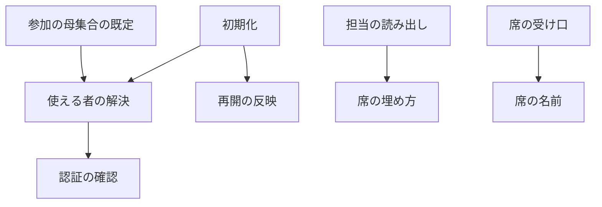
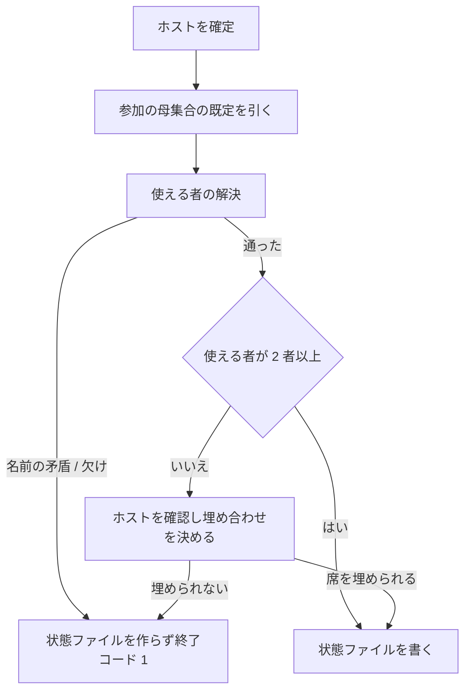
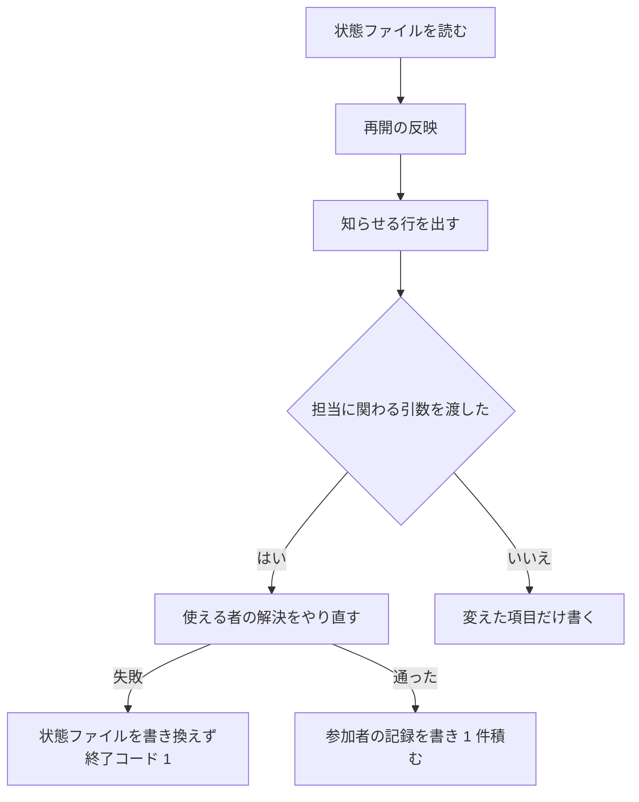

# cross-review: 参加する CLI が 1 者でも使えないと収束ループを開始できず、再開で渡した引数が黙って無視される → 使える者だけで開始し、毎ラウンド 2 席を確保し、再開で渡した引数は反映されるか反映しないと知らされる

## 目的

**参加する CLI のどれか 1 者が導入・認証されていなくても、収束ループが始まる。** 使えない者と
その理由は、初期化の出力と状態ファイルに残る。

**各ラウンドに 2 つの席が確保される。** 使える者が 2 者に満たないときは、ホスト、次に同じ
ランタイムの 2 つ目が席を埋める。1 席で回るのは、利用者が 1 者指定を渡したときだけである。

**中断した収束ループを引数を変えて再開すると、その引数は反映されるか、反映しないと知らされる。**
黙って捨てられる引数は無い。

**使える者の決定・席の埋め方・再開の反映の 3 つの規則は、収束ループを回す 2 つの Skill が
共有する共通層が 1 か所ずつ持つ。** Skill の側は結果を状態ファイルと終了コードへ写すだけである。

**手順と引数の表は
[`cross-review` の SKILL.md](../../plugins/ndf/skills/cross-review/SKILL.md)と
[`docs/`](../../plugins/ndf/skills/cross-review/docs/05-pool-and-convergence.md)が正である。**
ここに書き写さない。この文書が扱うのは、そこに書かない決定の理由と、共通層の契約である。

## 用語

本文は左の業務用語で書く。識別子は表・コードブロック・業務用語の初出の括弧書きにだけ置く。

| 業務用語 | 識別子 | 何を指すか |
| --- | --- | --- |
| ランタイム | `ALL_RUNTIMES` | `claude` / `codex` / `agy` / `kiro` の 4 つ。並びは固定 |
| ホスト | `host` | 収束ループを起動している CLI |
| 参加の母集合 | `review_pool(host)` / `refactor_pool(host)` | Skill ごとに決まる参加者の出発点。cross-review は全ランタイム − ホスト |
| 参加者 | — | 参加の母集合に足す者を加え、外す者を除いた一覧。認証の確認の対象 |
| 使える者 | `participants.available` | 参加者のうち認証の確認を通った者 |
| 認証の確認 | `probe_auth` | 確認コマンドを走らせ、止めずに結果だけを返す共通層の関数 |
| 使える者の解決 | `resolve_participants` | 参加の母集合・足す者・外す者・1 者指定・確認の結果から使える者を決める共通層の関数 |
| 参加者の記録 | `participants` | 使える者の解決の結果を持つ状態ファイルの項目 |
| 席 | — | 1 ラウンドで 1 つの CLI プロセスが占める場所 |
| 席の名前 | `SEAT_PATTERN` / `seat_runtime` | ランタイム名か、その名前に `-2`〜`-9` を付けた形 |
| 席の埋め方 | `review_seats` | 使える者と埋め合わせから 2 席を返す共通層の関数 |
| 埋め合わせ | `participants.fallback` | 席が足りないときに使う者。ホストが入る |
| 適用の輪番 | `impl_assign` | 参加者から実装担当 1 者を返す共通層の関数 |
| 1 者指定 | `--only` | 担当を 1 者に固定する引数 |
| 全員を要する指定 | `--require-all` | 認証の確認の失敗が 1 者でもあれば初期化を止める引数 |
| 再開 | — | 状態ファイルが残り `final` が `null` のときの初期化 |
| 再開の反映 | `apply_resume_args` / `ResumeField` | 渡した引数を状態へ重ね、反映しない引数を知らせる共通層の関数と、表の 1 行 |
| 再開で変えた値の記録 | `resume_changes` | 再開で変えた値を積む状態ファイルの項目 |
| 初期化 / ラウンドの開始 / 結果の受け口 / 完了報告 | `init` / `start-round` / `read-result` / `report` | `state.py` の副コマンド |

## 対象範囲

この文書が扱うのは、共通層と cross-review の側である。

| 扱う | 扱わない |
| --- | --- |
| 共通層の使える者の解決・認証の確認・席の埋め方・適用の輪番・席の名前・再開の反映 | cross-refactoring の参加の母集合・適用の輪番の使い方・再開の表（[cross-refactoring の参加者](cross-refactoring-participants.md)が持つ） |
| cross-review の新規と再開の初期化、担当の決まる順、席の名前が流れる経路、完了報告の参加者の節 | 起動した後に分かる使えなさで担当を自動的に外す仕組み |

適用の輪番は共通層に入っているためここで扱う。呼び出す側は cross-refactoring だけである。

## 背景

**認証の確認が関門だった。** 従来の確認は 1 件の失敗でその場で終了しており、4 つの CLI が
揃っていない環境では収束ループを開始できなかった。使える CLI が 2 者あっても、3 者目が
入っていなければ初期化ごと止まる。

**使える者が 2 者に満たないラウンドの扱いが無かった。** 担当を決める関数は参加の母集合を
「全ランタイム − ホスト」の定数から作り、使える者を入力に取らない。そのため一部が使えない
構成では、担当が 1 者になるか、担当そのものを決められなかった。

**再開で渡した引数が黙って無視されていた。** 中断した収束ループを 1 者指定やラウンドの上限を
変えて再開しても、状態ファイルの値がそのまま使われる。利用者には、渡した引数が効いたのか
どうかを知る手立てが無かった。

**前のラウンドの検査が、固定の 2 者で結果を数えていた。** 担当がその 2 者と違うラウンドでは、
担当でない者を結果なしと読み、修正の記録が無いまま次のラウンドへ通していた。

## 決定と理由

| 決定 | 理由 |
| --- | --- |
| 使える者を決める規則を共通層の 1 つの関数へ置き、Skill は結果を状態ファイルと終了コードへ写すだけにする | 規則を Skill ごとに書くと、参加の母集合の作り方・除外の検査・確認の扱いが 2 か所にでき、片方だけが古くなる |
| 認証の確認は止めずに結果だけを返す形にし、確認コマンド・未認証の文言・時間切れの秒数は変えない | 確認と中断が 1 つの関数にあると、使える者で回す経路から呼べない。止めるかどうかは全員を要する指定が決める |
| 参加者は「既定に足す者を加え、外す者を除く」で決め、既定は Skill ごとの関数が持つ | 使う側を並べる形は、ホストが変わるたびに一覧を書き直すことになる |
| 全員が揃わないなら始めたくない運用のために、従来の関門を指定で選べるようにする | 既定を変えるだけでは、揃っていることを要求する運用が選べなくなる |
| 席は 2 つとし、使える者 → ホスト → 同じランタイムの 2 つ目の順で埋める | 各ラウンドで 2 つの目で見ることを最優先にする。同じ言語モデルの 2 つの文脈より、違う言語モデルの 2 つの文脈のほうが観点が分かれる |
| 埋め合わせの候補は、使える者に含まれない者だけを使う | 足す者の指定でホストが使える者に入っているとき、ホストを埋め合わせにも使うと同じ席の名前が 2 つ並ぶ |
| 1 者指定のときは埋め合わせをせず、ホストの確認も行わない | 利用者が 1 席と決めた指定である |
| 担当の単位を席の名前にし、1 つ目の席の名前はランタイム名そのままにする | 同じランタイムの 2 つ目を立てるには、結果ファイルの stem と状態ファイルの鍵を分ける名前が要る。埋め合わせが要らない実行では、従来と同じ名前しか現れない |
| 接尾辞の区切りをハイフンにする | ランタイム名にハイフンを含むものが無いため、シェル側の切り出しと共通層の解釈が同じ規則になる |
| 監視では、席の形に合わない名前をそのまま返す | 担当名を任意の骨格で受ける cross-refactoring の経路がある。形で弾くとその経路が壊れる |
| 担当はラウンドの記録から先に見る | 再開で 1 者指定を変えても、過去のラウンドの担当が変わらない |
| 前のラウンドの検査にも、そのラウンドの担当を渡す | 固定の 2 者で数えると、担当が違うラウンドで担当でない者を結果なしと読み、修正の記録が無いまま次へ通す |
| 適用の輪番は「ラウンド番号を参加者の数で割った余り」の式を保つ | ラウンド 1 が 2 番目の者から始まるため、ホストが最初に適用する形にならない |
| 再開の反映を共通層に置き、どの引数を「反映する」「知らせる」にするかは Skill ごとの表が持つ | 片方の Skill の再開の経路だけを直すと、もう片方に引数を捨てる形が残る |
| 状態ファイルに載る引数は表のどちらかに必ず載せ、引数の既定を未指定にする | 黙って捨てる引数を残さない。既定値と同じ値なら渡していないとみなす形では、上限を既定値へ戻す操作を区別できない |
| 担当に関わる引数を渡した再開でだけ、認証の確認をやり直して参加者を作り直す | 途中で担当が入れ替わると、前のラウンドの記録と突き合わせられなくなる |
| 作り直しのとき、渡さなかった引数は状態ファイルの値で補う | 初期値へ戻すと「明示した引数だけを反映する」が破れる |
| 指定を外す値は予約語 `none` にする | 骨組みは値のあるときだけ引数を渡すため、空文字列では指定を外せない |
| 参加者の作り直しは、記録へ 1 件として積む | 項目ごとに積むと 1 回の再開で最大 7 件になり、完了報告で読みにくい |
| 骨組みは 1 者指定のシェル変数で担当を絞り直さず、ラウンドの開始が返す席を使う | 返る一覧は 1 者指定と埋め合わせを反映済みである。もう一度絞ると、状態ファイルとシェル変数がずれたときに起動も監視も誰にも当たらない |
| 起動した後に分かる使えなさで担当を自動的に外す仕組みは作らない | 一時的な打ち切りでも、以後のラウンドから恒久的に外れる |
| 規則の実装は共通層、手順は各 Skill の手順書、理由はこの文書が持つ | 規則が決まっても、置き場所が決まらなければ次に使う人へ届かない |

## 仕様

### 常に成り立つ条件

| 条件 | 破れたときの扱い |
| --- | --- |
| 使える者の並びは、ランタイムの固定の順である | 解決の中で並べ直すため、入力の順序に依らない |
| 使える者が 3 者のときの席は、この変更の前の輪番と同じ値になる | 4 つのホスト × ラウンド 1〜12 の全組で一致することをテストが固定する |
| 1 ラウンドの席は 2 つで、同じ席の名前が 2 つ並ばない | 埋め合わせの候補から使える者を除いて選ぶ |
| 使える者も埋め合わせも無ければ、席を返さず失敗する | 割り当ての失敗（`AssignmentError`）を上げ、初期化は状態ファイルを作らずに終了コード 1 |
| 状態ファイルに載る引数は、再開の表の「反映する」か「知らせる」のどちらかに載る | 表に無い引数は、状態ファイルに載らない 3 つ（作業ツリー・観点・追加指示のファイル）だけである |
| 再開で渡さなかった引数は、状態ファイルの値のまま残る | 参加者を作り直すときも、渡さなかった引数は記録から補う |
| この変更の前に始めた実行の状態ファイルを、書き換えずに読める | 項目が無いときの読み方を「項目が無いときの読み方」が決める |

### 構成要素と責務

| 要素 | 責務 | 置き場所 |
| --- | --- | --- |
| 参加の母集合の既定 | Skill ごとの出発点を返す | `lib/assignment.py` の `review_pool` / `refactor_pool` |
| 使える者の解決 | 参加の母集合・ホスト・足す者・外す者・1 者指定・確認・全員を要するかから、参加者の記録を返す。名前の矛盾と欠けを例外で返す | 同 `resolve_participants` |
| 認証の確認 | 確認コマンドを走らせ、止めずに担当ごとの結果を返す | `lib/auth.py` の `probe_auth` |
| 席の埋め方 | 使える者と埋め合わせから 2 席を返す。規則の表はこの関数の docstring が正 | `lib/assignment.py` の `review_seats` |
| 適用の輪番 | 参加者から実装担当 1 者を返す | 同 `impl_assign` |
| 席の名前 | 席の名前からランタイムを引く。形の検査を持つ | 同 `seat_runtime` / `SEAT_PATTERN` |
| 再開の反映 | 表に従って状態へ書き、記録へ積み、知らせる行を返す | `lib/statefile.py` の `apply_resume_args` / `ResumeField` |
| 使える者の決定（cross-review） | 共通層を呼び、埋め合わせを決め、参加者の記録を返す。失敗を終了コード 1 へ写す | `cross-review/scripts/state.py` の `_resolve_reviewers` |
| 担当の読み出し | 決まった順で席を返す。前のラウンドの検査へその担当を渡す | 同 `_round_reviewers` / `_guard_previous_round` |
| 席の受け口 | 席の名前を受け、起動する CLI を席の名前から引く | `read-result` の引数の型、`launch-reviewer.sh`、`critique.sh`、`lib/monitor.py`、`measure.py` |
| 完了報告の参加者の節 | 参加した者・外した者・確認を通らなかった者・埋め合わせ・再開で変えた値を出す | `cross-review/scripts/state.py` の `_print_participants` |

要素の関係（辺は呼び出し）:



### 使える者の決め方

参加者を決め、認証の確認を通った者を使える者として記録する。順序は次のとおりである。

| 順 | 何をするか |
| ---: | --- |
| 1 | 足す者・外す者の各名前がランタイムの一覧にあり、互いに重ならないことを確かめる。外す者が「既定 ∪ 足す者」に含まれなければ弾く |
| 2 | 参加者 = 既定 ∪ 足す者 − 外す者（ランタイムの固定の順） |
| 3 | 1 者指定があれば、参加者に含まれ外す者に無いことを確かめ、参加者をその 1 者にする |
| 4 | 参加者へ認証の確認を行う。確認を飛ばす環境変数（`NDF_SKIP_AUTH_CHECK`）が立っていれば全員を通ったものとし、飛ばした印を真にする |
| 5 | 全員を要する指定が真で通らない者がいれば、欠けた者と理由を並べて失敗する |
| 6 | 通った者を使える者、通らなかった者と理由を通らなかった者として返す |

**外した者へは確認コマンドを呼ばない。** 確認の回数は「参加者の数 + 埋め合わせが要るときの
ホストの 1 回」を超えない。

cross-review の新規の初期化は、この結果に席の埋め合わせを足して状態ファイルへ書く。



**1 者指定のときは、この分岐へ入らない。** 埋め合わせを行わず、指定した 1 者が確認を通らない
ときだけ終了コード 1 で終わる。確認を通らない担当が席に座ると、レビューが行われないまま
収束するためである。

### 席の埋め方

| 使える者の数 | 席 |
| ---: | --- |
| 3 以上 | ラウンド番号を使える者の数で割った余りの位置と、その次の位置の 2 者。並びは使える者の順 |
| 2 | その 2 者 |
| 1 | その 1 者と、埋め合わせのうち使える者に含まれない先頭の者。そのような者が無ければ、その 1 者の 2 つ目 |
| 0 | 埋め合わせの先頭と、その 2 つ目。埋め合わせが空なら失敗する |

**3 者のときの値は、この変更の前の輪番と一致する。** 4 者のときはラウンド 1〜4 で各者が
ちょうど 2 回担当になる。

### 席の名前

**担当の単位は席の名前である。** 形はランタイム名か、その名前にハイフンと 2〜9 を付けたもの
（`^(claude|codex|agy|kiro)(-[2-9])?$`）で、後者が同じランタイムの 2 つ目以降を表す。

| 受け口 | 席の名前の扱い |
| --- | --- |
| 結果の受け口の担当の引数 | 席の形を型として検査する。通らなければ終了コード 2 |
| レビューの起動（`launch-reviewer.sh`）と反証の起動（`critique.sh`） | 席の形を先頭で検査し、起動する CLI を `${SEAT%%-*}` で選ぶ。結果ファイルの stem は席の名前で組む |
| 監視（`lib/monitor.py`） | 位置引数は席の形か `both` を通す。CLI 固有のログの検査は席の名前からランタイムを引いて選ぶ。席の形に合わない名前はそのまま返す |
| 計測（`measure.py`） | 担当の記録を数えるとき、名前の一覧ではなく席の形に一致する鍵を数える |

埋め合わせがあるラウンドで席の名前が流れる経路は次のとおりである。

```text
start-round → REVIEWERS="codex claude-2"
  → launch-reviewer.sh claude-2 … : 起動する CLI は claude、stem は claude-2-review-pr<N>
  → monitor.py --agents codex,claude-2
  → state.py read-result <pr> claude-2 : rounds[-1]["claude-2"] へ書く
  → critique-round.sh <pr> <round> codex claude-2 → critique.sh claude-2 …
```

### ラウンドの担当が決まる順

**先に当たったものを採る。**

| 順 | 状態 | 返る担当 |
| ---: | --- | --- |
| 1 | そのラウンドの記録に担当がある | その値 |
| 2 | 1 者指定がある | その 1 者だけ |
| 3 | 参加者の記録がある | 使える者と埋め合わせから 2 席 |
| 4 | ホストがある | 参加の母集合から 2 席（この変更の前の輪番と同じ値） |
| 5 | どれも無い | `codex` / `agy` |

**ラウンドの記録を 1 者指定より先に見る。** 再開で 1 者指定を変えても、過去のラウンドの担当が
変わらないようにするためである。

**前のラウンドの検査は、そのラウンドの記録の担当で結果を数える。** 記録が無いときだけ、この順で
引き直す。

### 適用の輪番

実装担当 1 者を「ラウンド番号を参加者の数で割った余り」の位置から選ぶ。式はこの変更の前と
同じで、除数だけが参加者の数になる。ラウンド 1 が 2 番目の者から始まるため、ホストが最初に
適用する形にならない。呼び出す側は cross-refactoring だけで、使い方は
[cross-refactoring の参加者](cross-refactoring-participants.md)が持つ。

### 再開で渡した引数の扱い

| 扱い | 引数 | 何が起きるか |
| --- | --- | --- |
| 反映する | `--max-rounds` / `--rotate-after` / `--verify-command` / `--verify-exit-code` | 状態ファイルを書き換え、記録へ 1 件積み、変更の行を出す |
| 反映し、参加者を作り直す | `--only` | 上に加えて、認証の確認をやり直して参加者の記録を置き換える。`none` で 1 者指定を外す |
| 参加者を作り直す | `--exclude` / `--include` / `--require-all` | 使える者を解決し直して参加者の記録を置き換える。`none` で一覧を空へ戻す |
| 知らせる | `--host` | 状態ファイルは変えず、状態と違うときだけ 1 行を出す |

**値が同じ引数は、行も記録も出さない。**



**作り直しの入力は 2 つである。** 渡した引数と、渡さなかった引数の状態ファイルの値（足した者・
外した者・全員を要するかと、1 者指定）である。ホストを足して始めた実行へ外す指定だけを渡した
再開では、足した者の記録はそのまま残る。

**作り直しの失敗は、状態ファイルを書き換える前に起きる。** 使える者の解決を先に呼び、通って
から状態ファイルへ書く。

### 完了報告の「参加した者」

完了報告の PR 履歴の後に、7 行の節を出す。

```text
## 参加した者
- 母集合: codex / agy / kiro
- 使える者: codex / kiro
- --exclude で外した者: agy
- --include で足した者: なし
- 確認を通らなかった者: なし
- 席の埋め合わせ: なし
- 再開で変えた値: 2026-09-19T12:00:00 participants … → …
```

参加者の記録を持たない状態ファイルでは「使える者: 記録なし」の 1 行だけを出す。確認を飛ばした
印が真のときは、通らなかった者の行に「確認を飛ばした（`NDF_SKIP_AUTH_CHECK`）」と出す。

## データ・設定

### 状態ファイルに増える 2 項目

形式そのものは
[04-contracts.md](../../plugins/ndf/skills/cross-review/docs/04-contracts.md)が正である。

| 項目 | 型 | 意味 |
| --- | --- | --- |
| `participants` | オブジェクト（下の表） | 使える者の解決の結果。項目が無いのは、この変更の前に始めた実行である |
| `resume_changes` | オブジェクトの配列 | 再開で変えた値の記録。追記だけを行う。要素は `at` / `field` / `from` / `to` |

参加者の記録の中身は 8 項目である。共通層が 7 項目を返し、埋め合わせだけを cross-review が足す。

| 項目 | 型 | 意味 |
| --- | --- | --- |
| `pool` | 文字列の配列 | 参加の母集合の既定。ランタイムの固定の順 |
| `included` | 文字列の配列 | 足した者。空は「足していない」 |
| `excluded` | 文字列の配列 | 外した者。空は「外していない」 |
| `available` | 文字列の配列 | 使える者。1 者指定があればその 1 者だけ |
| `unavailable` | オブジェクト | 確認を通らなかった者と理由 |
| `probe_skipped` | 真偽値 | 確認を飛ばしたか。通らなかった者が空である理由を区別する |
| `require_all` | 真偽値 | 全員を要する指定の値。新規の既定は偽 |
| `fallback` | 文字列の配列 | 席の埋め合わせに使える者。使える者が 2 者以上か、1 者指定があれば空 |

**ラウンドの記録の担当と鍵には席の名前が入りうる。** 過去のラウンドの担当は再開で書き換えない。

### 初期化の引数

| 引数 | 型 | 既定 | 新規の経路 | 再開の経路 |
| --- | --- | --- | --- | --- |
| `--max-rounds N` / `--rotate-after K` | 整数 | 未指定 | 無ければ 12 / 8 | 渡せば反映 |
| `--only RUNTIME` | 4 つの名前か `none` | 未指定 | `none` は無しと同じ | 渡せば反映。`none` で外す |
| `--exclude NAMES` / `--include NAMES` | カンマ区切りの名前。繰り返し可。`none` | 未指定 | 外す / 足す | 渡せば置き換え。`none` で空 |
| `--require-all` / `--no-require-all` | 真偽値 | 未指定 | 無ければ偽 | 渡せば反映 |
| `--host RUNTIME` | 4 つの名前 | 未指定 | 無ければ推定 | 反映せず、違えば 1 行 |
| `--verify-command CMD` / `--verify-exit-code N` | 繰り返し可 | 未指定 | 無ければ空 | 渡せば置き換え |

**上限の既定を引数の側に置かない。** 新規の経路が定数を置く。引数の側に既定を置くと、再開の
たびに利用者が指定していない値で状態ファイルを上書きする。

**名前の検査は 2 段に分かれる。** 綴りは引数の型が弾き（終了コード 2）、参加の母集合との関係は
共通層が弾く（終了コード 1）。後者に当たるのは、外す者・1 者指定に参加の母集合に無い名前を
渡したとき、足す者と外す者が重なるとき、1 者指定と外す者が矛盾するとき、`none` と名前を
混ぜたときである。cross-review ではホストが参加の母集合に無いため、ホストを外す指定はここで
弾かれる。

### 出力と終了コード

標準出力の形は変わらない。増えるのは標準エラーの行と、席の名前が取りうる値である。

| 場面 | 標準エラー | 終了コード | 状態ファイル |
| --- | --- | ---: | --- |
| 新規で全員が使える | 参加の母集合と使える者の 1 行 | 0 | 作る |
| 新規で確認を通らない者がいる | 通らなかった者と理由を 1 者 1 行 | 0 | 作る |
| 新規で使える者が 2 者に満たない | 埋め合わせの相手を 1 行 | 0 | 作る |
| 新規で使える者も埋め合わせも無い | 使える者がいない理由 | 1 | 作らない |
| 確認を飛ばした | 飛ばしたことを 1 行 | 0 | 作る |
| 全員を要する指定で欠けがある | 欠けた者と理由 | 1 | 作らない |
| 名前の矛盾 | 何が矛盾したか | 1 | 作らない |
| 再開で引数を反映した | 項目ごとに 1 行 | 0 | 書き換える |
| 再開で反映しない引数が状態と違う | 引数ごとに 1 行 | 0 | 変えない |
| 再開の作り直しが失敗した | 新規と同じ | 1 | 書き換えない |

行の先頭の印は、既存の初期化の出力に揃える。

| 場面 | 行の形 |
| --- | --- |
| 反映した | `↻ <項目>: <旧> → <新>` |
| 反映しない | `ℹ --<引数> は再開では反映しません（状態: <値> / 指定: <値>）` |
| 確認を通らなかった | `⚠ <名前> を担当から外しました（<理由>）` |
| 席を埋めた | `⚠ 使える者が <数> 者のため、席を<相手>で埋めます（観点が減ります）` |

### 項目が無いときの読み方

**この変更の前に始めた実行の状態ファイルは書き換えない。**

| 項目 | 無いときの読み方 |
| --- | --- |
| `participants` | ホストがあれば、参加の母集合から席を決める（この変更の前の輪番と同じ値）。ホストも無ければ `codex` / `agy` |
| `resume_changes` | 空として読む |
| ラウンドの記録の担当 | 担当の決まる順で引き直す |

**再開で担当に関わる引数を渡したときだけ、参加者の記録を書く。** 渡さない再開では書き足さない。

## テスト観点

| 観点 | 確かめ方 |
| --- | --- |
| 使える者の解決が、通らない者を外して続け、外した者へ確認を呼ばず、名前の矛盾と欠けを例外にすること | `plugins/ndf/scripts/tests/test_lib_participants.py` |
| 認証の確認が失敗で例外を上げず、理由を返すこと | 同 `test_auth_probe.py` |
| 席の埋め方が 3 者で従来の値と一致し、2 / 1 / 0 者で規則どおりに埋めること。席の名前の形 | `plugins/ndf/skills/cross-refactoring/tests/test_assignment.py` |
| 適用の輪番が参加者の数で回ること | `plugins/ndf/scripts/tests/test_lib_assignment.py` |
| 再開の反映が、表のとおりに書き換え・記録・知らせを行い、値が同じなら何もしないこと | 同 `test_lib_resume_args.py` |
| 新規の初期化が、確認を通らない者がいても状態ファイルを作り、全員を要する指定では作らないこと | `plugins/ndf/skills/cross-review/tests/test_state_review_pool.py` |
| 完了報告が参加者の節を出し、記録が無ければ「記録なし」と出すこと | 同 |
| 再開が渡した引数だけを反映し、渡さなかった引数を状態ファイルの値で補うこと | 同 `test_state_resume_args.py` |
| 席の名前が結果の受け口・起動・監視・計測を通ること | 同 `test_seat_names.py` |
| 前のラウンドの検査が、そのラウンドの担当で結果を数えること | 同 `test_state_round_guard.py` |
| 手順書が 1 者指定のシェル変数で担当を絞り直さないこと | 同 `test_skill_layout.py` |
| 文書の分量が分割の基準を超えないこと | `python3 scripts/check-doc-line-limit.py --root .` |
| 参照のリンクが解決できること | `python3 scripts/check-markdown-links.py --root .` |

## 関連リンク

- [issue #727](https://github.com/devbasex/ai-plugins/issues/727) — 使える者から担当を割り当てる共通層
- [issue #687](https://github.com/devbasex/ai-plugins/issues/687) — 各ラウンドで 2 者を確保する規則と置き場所
- [issue #478](https://github.com/devbasex/ai-plugins/issues/478) — 認証の確認を関門から把握へ
- [issue #648](https://github.com/devbasex/ai-plugins/issues/648) — 再開で渡した引数が無視される
- [PR #793](https://github.com/devbasex/ai-plugins/pull/793) — 実装
- [`cross-review` のレビュワーの母集合と終了基準](../../plugins/ndf/skills/cross-review/docs/05-pool-and-convergence.md)
- [`cross-review` の状態ファイルと入出力の契約](../../plugins/ndf/skills/cross-review/docs/04-contracts.md)
- [`cross-review` の状態とレビューの手順](../../plugins/ndf/skills/cross-review/docs/01-state-and-review.md)
- [`cross-review` の手順](../../plugins/ndf/skills/cross-review/SKILL.md)
- [証拠ベースのレビューと効果の測定](cross-review-evidence-based.md) — 指摘の構造化・実行検証・反証と、状態ファイルのそれ以外の鍵
- [起動 1 回の結末と上限の検知](cross-review-launch-outcome.md) — 結果なしの理由の語彙と起動し直しの可否
