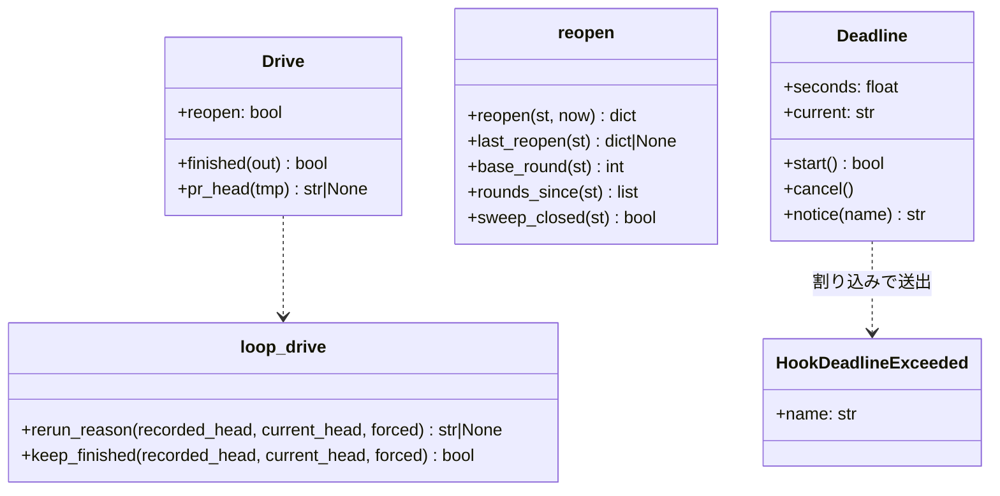
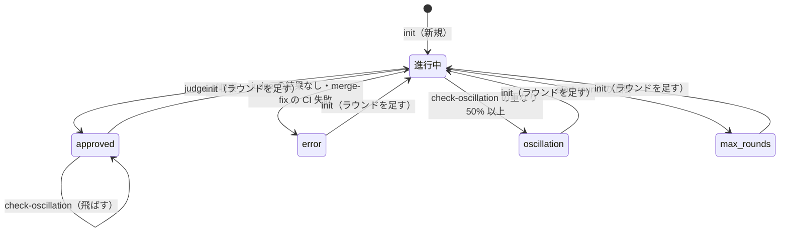

# cross-review と hook: 収束・異常終了の後のやり直しに状態ファイルの手直しが要り、振動検知が収束を上書きし、hook が上限で打ち切られていた → `init` がラウンドを足し、振動検知は確定した `final` を飛ばし、hook は 3.5 秒の締め切りの中で終わる

## 目的

- **`final` が確定したレビューに、同じ 1 行を打ち直すだけでラウンドを足せる。** 利用者もエージェントも
  レビューの状態ファイルを `mv` したり python で書き換えたりしない
- **1 回の出力の中で終わり方が 1 つに決まる。** 収束（`✅ … 収束`）の直後に `振動検知 — … 中断` が並ばない
- **ホストが自分で直した修正を、戻り値ファイルの JSON を手で書かずに修正の記録にできる**
- **NDF の PreToolUse と userPromptSubmit の hook が、各ランタイムの hook の上限の中で終わる。** 重い判定が
  締め切りを過ぎたら飛ばして通し、飛ばしたことを標準エラーへ 1 行残す

例: PR #1234 の cross-review が round 3 で収束した（`final=approved`）。利用者が別の直しを 1 コミット push し、
`/ndf:cross-review 1234` の 1 行（`python3 scripts/drive.py 1234`）をそのまま打ち直す。

| 時点 | 振る舞い |
| --- | --- |
| `drive.py` の起動 | 耐久の記録に完了があるが、完了の時点の head と今の head が違うため、新しい実行の回を始める |
| `state.py init` | `final` を外して `reopens` に 1 件積み、round 1〜3 を残したまま再開する |
| `start-round` | round 4 を始める。上限は足した時点から数え直す |
| round 4 の `judge` が収束 | 誰かが `check-oscillation` を打っても `final=approved` のまま、`⏭` を出して終了コード 2 |

**手順・状態ファイルの鍵・副命令の契約は Skill が正である。** ここに書き写さない。

| 何を | 正本 |
| --- | --- |
| ラウンドを足す手順（`init` の出力・`reopens` の扱い・数え直し・`drive.py` からの打ち直し） | [`cross-review` の `docs/01-state-and-review.md`](../../plugins/ndf/skills/cross-review/docs/01-state-and-review.md) の「ラウンドを足す」 |
| 振動検知の飛ばし方 | 同じ文書の「Step 4: 振動検知」 |
| `reopens`・`rounds[].fix.merge` の鍵、`final` の値と遷移 | [`docs/04-contracts.md`](../../plugins/ndf/skills/cross-review/docs/04-contracts.md) の state.json の節 |
| `record-fix` の引数・終了コード・書く戻り値ファイル | 同じ文書の「`record-fix`」と [`docs/02-fix-and-rotation.md`](../../plugins/ndf/skills/cross-review/docs/02-fix-and-rotation.md) |
| `drive.py --reopen` | [`cross-review` の SKILL.md](../../plugins/ndf/skills/cross-review/SKILL.md) |

この文書が扱うのは、Skill に書かない決定の理由、駆動の共有の部品の契約、hook の締め切りの仕組みである。

## 用語

定義は [用語集](../glossary.md) が正である（`.ndf/glossary.json` の `document`）。この文書で使う語は
「ラウンドを足す」「レビューの状態ファイル」「修正の記録」「hook の上限」「hook の締め切り」である。

## 対象範囲

| 扱う | 扱わない |
| --- | --- |
| `final` が確定したレビューの状態ファイルにラウンドを足す入口（`state.py init`） | worktree の guard の誤検知（#734） |
| `drive.py` が前回の結果を返すか、新しい実行の回を始めるかの判定 | `NDF_SKIP_AUTH_CHECK=1` による認証確認の回避（#461） |
| 確定した `final` を振動検知が上書きしないこと | `supervise.py run --from` の流し直しと、cross-refactoring の駆動の完了済みの扱い（#1263） |
| ホストが自分で直したときの修正の記録の入口（`state.py record-fix`）と、`merge-fix` の取り込みの段階 | 振動検知の判定の基準（重なり 50%・3 つの一致） |
| PreToolUse と userPromptSubmit の hook の締め切り（Claude Code・Codex・agy・Kiro） | hook の上限（各ランタイムの `timeout`）を上げること |

## 背景

carmo-system-console の会話の記録（2026-09-27 に集計）で、次の手直しと止まり方が見つかった。

- `final=approved` の PR に差分を足して再実行すると、エージェントが状態ファイルを `mv` で退避して `init` し直した。
  `final=error` では python で `final` を `None` に書き換えた。利用者は自作のラッパーに「final を外す」を常備していた（手直し 6 件）
- 収束の直後に振動検知が中断を出した（同じ出力の中で `✅ 収束` の直後に `❌ 振動検知`。5 件）
- ホストが自分で直したときも修正の記録が要り、エージェントが戻り値ファイルの JSON を手書きした（4 件）
- hook が上限（5 秒・10 秒）に対して 41 秒掛かり、ランタイムに打ち切られた

変更の前の `init` は、`final` が確定した状態ファイルを再開の対象にせず、同じパスへ新しい状態を書いて履歴を捨てていた。
`drive.py` は完了の記録と状態ファイルがあれば前回の結果をそのまま返し、差分を足しても新しいラウンドを始めなかった。
`check-oscillation` は `final` を見ずに判定し、収束を `oscillation` で上書きできた。

## 構成要素

| 要素 | 責務 |
| --- | --- |
| `plugins/ndf/skills/cross-review/scripts/review_lib/store.py` の `_find_resumable_state` | `final` が確定した状態ファイルも返す。JSON として読めない・`rounds` の list を持たないときは上書きせずに終了コード 1 |
| `review_lib/reopen.py` | `reopen(st, now)`（`final` を外して足した記録を積む。書き込みはしない）・`last_reopen`・`base_round`・`rounds_since`・`sweep_closed` |
| `review_lib/commands/init.py` | `final` が確定していれば `reopen` を通してから再開の反映へ進み、両方を 1 回の書き込みで保存する |
| `review_lib/commands/start_round.py` | 上限を `rounds_since` で数える。足す前のラウンドの後始末の確認は `sweep_closed` のときだけ当てない |
| `review_lib/commands/loop.py` | `check-oscillation` は `final` が確定していれば判定しない。振動検知と `should-rotate` は `rounds_since` で数える |
| `review_lib/commands/merge_fix.py` の `ingest_fix` | 修正の記録の取り込みの本体。`rounds[-1].fix.merge.stage` を書き進め、打ち直しは済んでいない段階から続ける |
| `review_lib/commands/record_fix.py` の `cmd_record_fix` | コミットとスレッドを GitHub で確かめ、戻り値ファイルを書いて `ingest_fix` を通す |
| `plugins/ndf/scripts/lib/loop_drive.py` の `rerun_reason`・`keep_finished` | 完了した実行の回の結果を返してよいかの判定（cross-review と cross-refactoring の駆動の共有の部品） |
| `cross-review/scripts/drive.py` の `Drive.finished`・`Drive.pr_head` | 耐久の記録の完了を返すかを `keep_finished` で決める。終わりの出力に PR の head を残す |
| `plugins/ndf/scripts/hook_lib/deadline.py` | `DEADLINE_SECONDS`・`MARGIN_SECONDS`・`Deadline`・`HookDeadlineExceeded` |
| `plugins/ndf/scripts/hook.py` の `_guards` | worktree の guard と token の guard を締め切りの中で打つ |



## 決定と理由

| 決定 | 理由 |
| --- | --- |
| ラウンドを足す入口は `state.py init` そのものにし、副命令（`reopen`）も引数（`--reopen`）も足さない | `drive.py` も SKILL.md の手順も最初に `init` を打つため、覚える手順が増えない。別の入口は打ち忘れると「履歴を捨てて上書き」の経路へ落ち、手直しの問題が残る |
| `drive.py` が前回の結果を返すかは、完了の時点の PR の head と今の head で決める | 差分を足したかは申告させなくても head で分かる。最終スイープが push して head を進めるため、比べる相手は最後のラウンドの `head_sha` でなく `finish` の時点の head にする |
| head を比べられないときは前回の結果を返し、`--reopen` を案内する | 比べられないたびに新しく回すと、GitHub の一時的な不調のたびに完了したレビューがもう 1 ラウンド回って費用が掛かる |
| 返すかの判定は `scripts/lib/loop_drive.py` に置く | cross-review と cross-refactoring の駆動が既に読む共有の部品で、同じ役割の判定を駆動ごとに持たない |
| 上限・巻き直し・振動検知は最後に足した時点（`base_round`）より後のラウンドで数える | 全ラウンドで数えると、上限で終わった状態から足した直後に `max_rounds` で止まる。振動検知が境の前と比べると、`oscillation` から足した最初のラウンドがまた中断する |
| 足す前のラウンドに後始末の確認を当てないのは、足した記録の `sweep` が `verified: true` かつ `remaining_open: 0` のときだけ | `oscillation` と `max_rounds` の終わりは修正を通らずに最終スイープへ進むため、確認を当てると足した直後に終了コード 5 で止まる。スイープが閉じたと検証できないときは守る対象が残るため確認を当てる |
| 足すときに `ended_at` と `sweep` を足した記録へ移し、状態からは消す | `run_metrics`・`report`・`review_status`・`drive.counts()` はこれらを「今の実行の終わり」として読む。残すと足した後の実行が前の最終スイープの結果で `approved` に見える |
| 振動検知は `final` が確定していれば判定せずに終了コード 2 で抜ける | `check-oscillation` 自身が見るため、`drive.py` の経路と副命令を手で順に打つ経路の両方に効く。新しい終了コードを足さない |
| 修正の記録の入口は `state.py record-fix` にし、`merge-fix` と同じ取り込み（`ingest_fix`）を通す | 手書きしていたのは戻り値ファイルである。同じ取り込みを通せば、記録の形も投稿も `/ndf:fix` と同じになる。決まった確認と書き込みは Skill（LLM の手順）でなくスクリプトに置く |
| `record-fix` は確かめられないとき（一覧を取れないときも）記録を作らずに終了コード 5 | `start-round` は取れないときに確認を飛ばして進む。記録を作る側が確かめずに作ると、その確認の抜け道になる |
| 取り込みが済んだかはコミットの一致でなく `rounds[-1].fix.merge.stage` で決める | 取り込みは投稿の前に記録を保存する。一致だけで済んだとすると、投稿に失敗した後の打ち直しで返信・Resolve が送られず、コード関連の CI 失敗（3）も 0 に変わる |
| hook の締め切りは 3.5 秒の定数 1 つにし、全ランタイムで使う | 対象の hook の上限の最短 5 秒から余裕 1.5 秒を引いた値。ランタイムごとに引数で渡すと、hook の定義の `timeout` と引数の 2 か所に値が並び、片方だけを変える誤りが起きる |
| 締め切りは `signal.setitimer` の割り込みで hook の 1 回の全体に掛ける | 時間を使う所は `git` の呼び出しだけでなく、ロックの待ちと構文解析の読み込みにもある。呼び出しごとに残り時間を渡すと、新しく足した呼び出しが締め切りの外に漏れる |
| 締め切りを過ぎたら止めずに通す | 止めると `git` が遅いリポジトリでは Tool の呼び出しが全部止まる。メインディレクトリへの書き込みは #734 の事後の観測が拾う |

## 仕様

### 常に成り立つ条件

| 条件 | 破れたときの扱い |
| --- | --- |
| ラウンドを足しても `rounds` の要素は消えず変わらない。次のラウンドの番号は `len(rounds) + 1` | `reopen` は `final` が `null`・`rounds` が list でなければ `ValueError`。`init` は反映が止まれば状態ファイルを足す前のまま残す |
| 足すたびに `reopens` へ 1 件積む（古い順。前の記録を置き換えない） | — |
| 状態ファイルが JSON として読めないとき、`init` は新しい状態で上書きしない | `❌ レビューの状態ファイルを読めません: <パス>（<理由>）` で終了コード 1 |
| `final` が確定しているとき、`check-oscillation` は `final` を書き換えず、終了コード 4 を返さない | `⏭ final=<値> は確定済み: 振動検知スキップ` で終了コード 2 |
| 確定した `final` から確定した別の値へ直接は移らない。`null` へ戻すのは `init` がラウンドを足すときだけ | — |
| `record-fix` が修正の記録を作るのは、コミットが PR の head から辿れ、申告したスレッドがすべて解決済みのときだけ | 書かずに理由を出して終了コード 5 |
| 1 つのラウンドへ同じコミットの修正の記録を 2 回取り込まない | `merge.stage = done` なら投稿もせずに記録した `exit_code` で抜ける。それ以外は済んでいない段階から続ける |
| 前回の結果を返すのは、完了の時点の head と今の head が同じで `--reopen` が無いとき、または比べられないときだけ | 新しい実行の回を始める |
| PreToolUse と userPromptSubmit の guard は、開始から `DEADLINE_SECONDS` までに終わる | 残りの判定を飛ばし、終了コード 0、標準エラーへ 1 行 |
| 締め切りの中で終わった判定の結果（拒む / 通す / 案内）は、締め切りの無いときと同じ | — |
| `DEADLINE_SECONDS + MARGIN_SECONDS` ≤ NDF が配る PreToolUse・userPromptSubmit の guard の hook の上限 | テストが落ちる（片方だけを変えたとき） |

### `final` の状態遷移



### 前回の結果を返すかの判定（`loop_drive`）

```python
def rerun_reason(recorded_head: str | None, current_head: str | None, forced: bool) -> str | None:
    """完了した実行の回を返さずに新しく始める理由。返してよければ None。"""

def keep_finished(recorded_head: str | None, current_head: str | None, forced: bool) -> bool:
    """完了した実行の回の結果をそのまま返してよいか。理由を標準エラーへ書く。"""
```

| 条件 | `rerun_reason` | `keep_finished` | 標準エラー |
| --- | --- | --- | --- |
| `forced`（`--reopen`） | `--reopen が渡されたため` | 偽 | `↻ --reopen が渡されたため、ラウンドを足す` |
| 2 つの head があり違う | `完了の時点の head <旧 7 桁> から <新 7 桁> へ進んでいるため` | 偽 | `↻ 完了の時点の head … へ進んでいるため、ラウンドを足す` |
| 2 つの head があり同じ | `None` | 真 | なし |
| どちらかの head が無い | `None` | 真 | `ℹ head を比べられないため前回の結果を返す（足すなら --reopen）` |

`drive.py` の `Drive.finished` は、耐久の記録の終わりの出力が `ok` で状態ファイルが残っているときだけ `keep_finished` を呼ぶ
（状態ファイルが消えていれば頭から流す）。今の head は `Drive.pr_head` が状態ファイルの今の PR（巻き直しの後は
`current_pr`）について `gh api repos/<repo>/pulls/<PR> --jq .head.sha` で取る。`--reopen` のとき、または終わりの出力が
`head` を持たないときは今の head を取りに行かない。`--reopen` は `state.py init` へ渡さない（`init` は `final` を見て足すかを決める）。
cross-refactoring の駆動はこの判定を使っていない。

### hook の締め切り

`hook.py` の `dispatch` は事象を問わず `_guards` を通し、`_guards` が `Deadline` を掛けてから guard を打つ。guard を打つのは
Tool の事象（`tool_kind` がある）と userPromptSubmit だけで、待ちの Slack 通知（`wait_notify`）は締め切りを外した後に打つ。

| 項目 | 振る舞い |
| --- | --- |
| 割り込み | `signal.setitimer(ITIMER_REAL, DEADLINE_SECONDS)` と `SIGALRM`。過ぎたら今の判定の名前（`Deadline.current`）で `HookDeadlineExceeded` を送出する |
| 例外の型 | `BaseException` から派生する（guard の中の `except Exception` に飲まれない）。`main` は guard の外で届いた場合も捕まえて終了コード 0 で抜ける |
| 子のプロセス | `subprocess.run` は待っている間の例外で子を止めるため、`git` の子が残らない |
| 過ぎたときの標準出力 | それまでに終わった判定の結果だけを `_merge` の規則で出す（token の guard の拒否が済んでいれば拒否） |
| 過ぎたときの標準エラー | `[ndf hook] 締め切り 3.5 秒を過ぎたため <判定の名前> を飛ばして通した`。名前は `worktree-guard` か `token-guard` |
| 終了コード | 0 |
| 掛けられない環境 | `setitimer` を持たない（Windows）・メインのスレッドの外では、`Deadline.start` が偽を返し、締め切りなしで今の振る舞いのまま通す |
| 外した後に届いた割り込み | 捨てる（`_armed` が偽なら送出しない） |
| 制約 | C 拡張（tree-sitter の構文解析など）の中で時間を使っている間は、割り込みが Python へ戻るまで届かない |

| hook | 上限 | 締め切り | 差 |
| --- | ---: | ---: | ---: |
| Claude Code PreToolUse（`hooks/claude.json` → `hook.py`） | 10 秒 | 3.5 秒 | 6.5 秒 |
| Codex PreToolUse（`hooks/codex.json` → `hook.py --runtime codex`） | 5 秒 | 3.5 秒 | 1.5 秒 |
| agy PreToolUse（`dev.agy/hooks.json` → `worktree-guard.sh` → `hook.py worktree-guard`） | 5 秒 | 3.5 秒 | 1.5 秒 |
| Kiro userPromptSubmit（`dev.kiro/install.sh` が生成 → `worktree-guard.sh`） | 5 秒 | 3.5 秒 | 1.5 秒 |

通常の所要は 0.03 秒（2026-10-02 に `hook.py` へ PreToolUse の入力を 3 回渡して実測。Python の起動は 0.009 秒）で、
締め切りはその 100 倍を超える。

## データ・設定

| 名前 | 置き場所 | 値・形 |
| --- | --- | --- |
| `DEADLINE_SECONDS` | `plugins/ndf/scripts/hook_lib/deadline.py` | `3.5` |
| `MARGIN_SECONDS` | 同上 | `1.5`（締め切りと hook の上限の間に残す余裕。テストは起動の時間の許しにも使う） |
| 駆動の実行の回の終わりの出力 | 耐久の記録（`lib/durable.py`、種類 `review`） | `{"result", "code", "tmp", "head"}`。`head` は `finish` の時点の PR の head の OID（取れなければ `null`）。`head` を持たない記録は比べられないものとして扱う |
| `reopens[]`・`rounds[].fix.merge` | レビューの状態ファイル | 形は [`docs/04-contracts.md`](../../plugins/ndf/skills/cross-review/docs/04-contracts.md)。`reopens` が無い状態ファイルは `base_round = 0` として読み、移行のコマンドを要さない |

## テスト観点

`.md` の文言は固定しない（#885）。

| 観点 | 確かめ方 |
| --- | --- |
| `approved` / `error` / `oscillation` / `max_rounds` の各 `final` から `init` → `start-round` で次の番号のラウンドが始まり、前の `rounds` が同じ値で残ること | `plugins/ndf/skills/cross-review/tests/test_state_reopen.py` |
| 足した記録が足す前の `ended_at`・`sweep` を持ち、2 回足すと 2 件になること | 同上 |
| 上限で終わった状態から足すと、足した時点から既定の数（または `--max-rounds`）だけ回ること。`should-rotate` が境より後のラウンドだけで数えること | 同上 |
| 足す前のラウンドの後始末の確認が、`sweep` が検証済みかつ未解決 0 件のときだけ外れること | 同上 |
| `final=null` の状態ファイルは足した記録を積まずに今の再開になること | 同上 |
| 壊れた状態ファイルで終了コード 1 になり、ファイルが変わらないこと。反映が止まると確定した状態が足す前のまま残ること | 同上 |
| `final=approved` で `check-oscillation` を打つと `final` が変わらず終了コード 2 で、`振動検知 —` の行が出ないこと | 同上 |
| `oscillation` から足した最初のラウンドが、境の前のラウンドと同じ指摘でも中断しないこと | 同上 |
| head が進んでいれば新しい実行の回を始め、同じなら前回の結果を返し、`--reopen` なら差分なしでも始め、`head` の無い記録は前回の結果を返すこと | `plugins/ndf/skills/cross-review/tests/test_review_drive_resume.py` |
| `record-fix` が契約の形の戻り値ファイルを書き、続く `start-round` が終了コード 5 で止まらないこと。`--commit` を使うこと | `plugins/ndf/skills/cross-review/tests/test_state_record_fix.py` |
| コミットが head から辿れない・スレッドが未解決・一覧を取れないときに記録を作らず終了コード 5、記録が既にあれば 1 になること | 同上 |
| `record-fix` の後の `merge-fix` が記録した終了コードで戻ること。投稿の失敗の後は投稿から、`merge` の無い記録も投稿から続け、コード関連の CI 失敗は 3 を返し直すこと。違うコミットは新しく取り込むこと | 同上 |
| `git` を遅くした擬似のリポジトリで、`hook.py`（Claude Code と Codex の起動の形）と `worktree-guard.sh` が `DEADLINE_SECONDS + MARGIN_SECONDS` より短く終わり、終了コード 0 と判定の名前を含む 1 行を出すこと | `plugins/ndf/scripts/tests/test_hook_deadline.py` |
| 締め切りの前に終わった判定の結果が、後の判定の締め切り超過でも残ること。速い hook が割り込まれないこと | 同上 |
| `hooks/claude.json`・`hooks/codex.json`・`dev.agy/hooks.json` の PreToolUse と、`dev.kiro/install.sh` の userPromptSubmit の上限が `DEADLINE_SECONDS + MARGIN_SECONDS` 以上であること | 同上 |
| 締め切りの中で終わるとき、既存の hook の判定が変わらないこと | 既存の hook のテスト（token の guard・worktree の guard）が変更なしで通る |
| 全体テストが通ること | `uv run --frozen --project . --all-extras pytest . -q -n 4` |

## 関連リンク

- [issue #1340](https://github.com/devbasex/ai-plugins/issues/1340) — 要求
- [PR #1627](https://github.com/devbasex/ai-plugins/pull/1627)（設計） / [PR #1632](https://github.com/devbasex/ai-plugins/pull/1632)（実装）
- [issue #734](https://github.com/devbasex/ai-plugins/issues/734) — worktree の guard の誤検知と、事後の観測
- [issue #1263](https://github.com/devbasex/ai-plugins/issues/1263) — 完了した状態が残ると前回の結果を返す（流し直しと cross-refactoring）
- [`cross-review` の手順](../../plugins/ndf/skills/cross-review/SKILL.md)
- [`cross-review` の状態と 1 ラウンドの流れ](../../plugins/ndf/skills/cross-review/docs/01-state-and-review.md)
- [`cross-review` の状態ファイルと入出力の契約](../../plugins/ndf/skills/cross-review/docs/04-contracts.md)
- [ラウンドへの入力](cross-review-round-inputs.md) — 振動検知の基準と `max_rounds` を変えない理由
