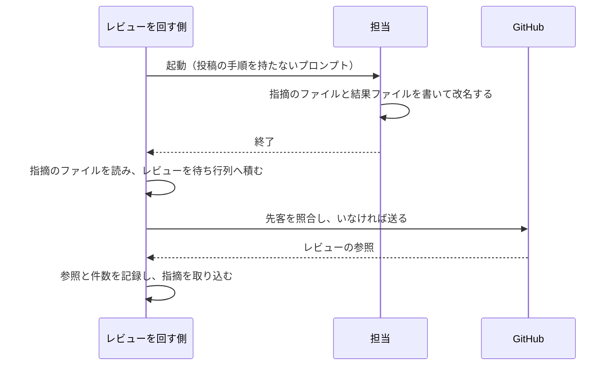
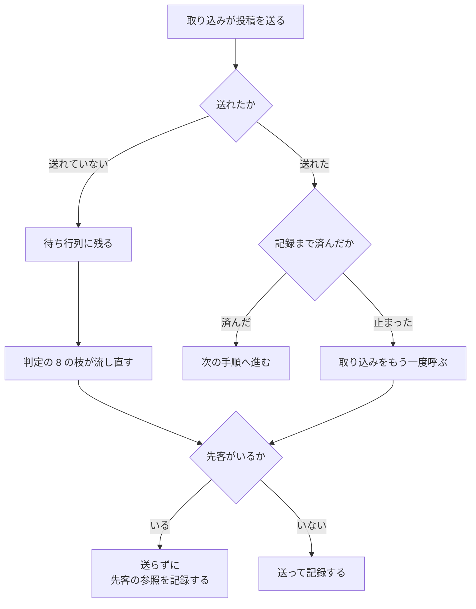

# cross-review: PR に出ている指摘が記録に残らず、同じ論点が 2 つのスレッドに分かれる → GitHub と git へ書くのはレビューを回す側だけになり、途中で止まっても同じものを二度書かない

## 目的

**GitHub と git へ書くのは、レビューを回す側だけである。** レビューの担当は指摘のファイルと
結果ファイルを書いて終わる。修正の担当はコミットまでで止まる。投稿・返信・スレッドの決着・
修正のまとめ・修正の送信は、結果ファイルを取り込む側が行う。

**書き込みと記録が同じ手順の中で続けて起きる。** 担当が途中で止まっても、PR には指摘が
出ているのに記録には無い状態ができない。取り込みが途中で止まっても、やり直せば同じものを
二度書かない。

**修正を送ったという記録は、送り先のブランチの実物と一致する。**

**投稿の本文は、取り込みのプロセスの中だけを通る。** 収束ループを駆動している側の応答に
載るのは、件数・参照・状態だけである。

**手順と表は
[`cross-review` の SKILL.md](../../plugins/ndf/skills/cross-review/SKILL.md)と
[`docs/`](../../plugins/ndf/skills/cross-review/docs/04-contracts.md)が正である。**
投稿の種別ごとの照合の鍵は
[状態ファイルと入出力の契約](../../plugins/ndf/skills/cross-review/docs/04-contracts.md)が持つ。
この文書が扱うのは、そこに書かない決定の理由と、共通層の契約である。

## 用語

本文は左の業務用語で書く。識別子は表・コードブロック・業務用語の初出の括弧書きにだけ置く。
担当・席・結末の語は
[起動 1 回の結末](cross-review-launch-outcome.md#用語)と
[使える者だけで始める収束ループ](cross-review-participants-and-seats.md#用語)と同じ意味で使う。

| 業務用語 | 識別子 | 何を指すか |
| --- | --- | --- |
| レビューを回す側 | `state.py` と、それを呼ぶ `SKILL.md` の骨組み | 担当を起動し、結果を取り込み、判定する側 |
| 担当 | `launch-reviewer.sh` が起動する CLI | 1 ラウンドで 1 席ぶんのレビューを行う |
| 修正の担当 | `/ndf:fix` を実行するサブエージェント | 指摘を直してコミットする |
| 結果ファイル | `<席>-review-pr<番号>-result.json` | 担当の判定の要約 |
| 指摘のファイル | `<席>-review-pr<番号>-round<R>-payload.json` | 担当が出した指摘の全件と総評 |
| 修正の結果ファイル | `fix-pr<番号>-result.json` / `sweep-pr<番号>-result.json` | 修正の担当が書く戻り値 |
| 投稿の待ち行列 | `plugins/ndf/scripts/lib/post_queue.py` | 送る前に積み、上限で送れなければ残す仕組み |
| 投稿を組み立てる層 | `plugins/ndf/scripts/lib/result_posts.py` | 結果ファイルから投稿を組み立て、送る共通層 |
| 指摘の取り込み | `state.py read-result` | 指摘のファイルを読んでレビューを投稿し、記録する |
| 修正の取り込み | `state.py merge-fix` | 修正を送り、返信・決着・まとめを投稿し、記録する |
| 単独の修正の口 | `result_posts.py fix` | 修正を単独で行うときと最終スイープで呼ぶ部分命令 |
| 先客 | — | 送ろうとした投稿と同じものとして、すでに PR にある投稿 |
| 総評 | レビューの本文（`body`） | インラインではなく、レビュー本体に書く文章 |

## 対象範囲

| 扱う | 扱わない |
| --- | --- |
| レビューの投稿（総評とインライン） | PR の巻き直しの締め・作り直し・再開（もとから回す側が行い、待ち行列に積まない） |
| 指摘への返信・スレッドの決着・修正のまとめ | 反証（もとから投稿せず、ファイルへ書くだけ） |
| 修正の送信と、送り先に載ったことの確認 | 収束の判定・指摘の区分と数え方（[証拠ベースのレビュー](cross-review-evidence-based.md)） |
| 起動し直した担当を初回と同じ経路へ通すこと | 結末の語彙と起動し直しの可否（[起動 1 回の結末](cross-review-launch-outcome.md)） |
| 修正を単独で行うときの書き込み | 席の決め方（[使える者だけで始める収束ループ](cross-review-participants-and-seats.md)） |
| — | 単発の `/ndf:pr-review` が担当に直接投稿させる流れ |

## 背景

**書き込みと記録を別の相手が行っていた。** 担当は GitHub へレビューを投稿し、その後に結果
ファイルを書いていた。この 2 つの間で担当が止まると、投稿は残り、記録は残らない。回す側は
記録しか読まないため「結果なし」と判定し、同じ担当を同じラウンドで起動し直した。起動し
直した担当は同じ論点をもう一度投稿した（#583）。

**実例は PR #578 の round 1 である。** 1 回目の起動がインライン 4 件を投稿し、起動し直した
2 回目が 1 件を投稿した。記録に入ったのは 2 回目の 1 件だけだった。利用者は 1 つの論点に
2 つのスレッドを見て、修正の担当は両方へ返信した。

**待ち行列は担当の投稿を通していなかった。** 上限で拒まれた投稿を残して後から流す仕組みは
回す側にあった。担当が自分で送るため、上限に当たった投稿はその場で失われた。

**送信の報告を確かめる手段が無かった。** 修正の担当はブランチ名だけを指定して送信していた。
作業ツリーが切り離された頭で作られていると、この指定は現在の頭を送らないまま終了コード 0 で
終わる。取り込む側はその報告をそのまま記録した。

**根本原因は、書き込みの担い手が記録の担い手と別であることにある（#730）。**
書き込みを回す側へ集めると、この 3 つが同じ場所で解ける。

## 決定と理由

| 決定 | 理由 |
| --- | --- |
| GitHub と git への書き込みを回す側だけが行う | 書き込みと記録が同じ手順で続けば、片方だけが残る状態を作れない |
| 担当の投稿の後に回す側が実物を照合して記録を補う形を採らない | 照合は問い合わせを増やす。問い合わせが上限で失敗すると同じ食い違いが残る |
| 担当に待ち行列へ積ませる形を採らない | 待ち行列は回す側の作業ツリーにある。置き場所を担当へ開くと、巻き直しで捨てる範囲が変わる |
| 投稿は結果ファイルを読んだプロセスの中で組み立てる | 本文を引数や標準入力で渡すと、収束ループを駆動する側の応答に本文が載る |
| 「読んで記録する」と「投稿する」を 1 つの取り込みに閉じる | 分けると「記録したが投稿していない」状態がもう 1 つ増える |
| 送信に成功した項目は記録より先に待ち行列から消える形を変えない | 取り込みをやり直せば同じ状態になる。流し方を変えると、巻き直しのコメントの契約まで変わる |
| 二度書かない照合を投稿の 4 種別すべてに掛ける | 途中で止まった取り込みをやり直しても、どの種別も増えない |
| レビューの照合の鍵に判定の語を含めない | 起動し直して判定が変わると、判定の語を含む鍵は別の投稿と読んで二重に送る |
| レビューの照合をラウンドの開始時刻より後のレビューに限る | ラウンドの番号は実行ごとに 1 から数え直す。回し直した PR では前の実行のレビューに一致する |
| 開始時刻かレビューの時刻を読めないときは、番号と席だけで照合する | 二重に送る側へ倒さない |
| 担当の申告件数と GitHub の実数の突き合わせをやめる | 投稿する側と記録する側が同じになり、確かめる対象が無い |
| 差分の外を指す指摘は、拒まれてから総評へ移す | 投稿の前に判定すると差分の範囲を別に取り寄せる必要があり、失敗の分岐が増える |
| 拒まれた要求のインラインは、1 件ずつでなくすべて総評へ移す | 応答はどのインラインが原因かを指さない（実測） |
| 位置を解決できない拒まれ方だけを退避の契機にする | 判定の値や基準のコミットの誤りまで退避すると、別の不具合が飲み込まれる |
| 修正は現在の頭を指定して送り、送った後に照合する | ブランチ名だけの指定は、切り離された頭で何も送らずに成功する |
| 修正の書き込みを共通層の 1 か所にまとめる | cross-review から呼ぶ経路と単独で使う経路で、担い手と実装が分かれない |
| 単独の口は新しい入口のスクリプトにせず、共通層の部分命令にする | 手順に書く行が 1 本で済み、実装が 1 つになる |
| 担当は一時の名前で書いてから改名する | 読めた状態が書き終えた状態になり、取り込みが書きかけを読まない |
| 自分の PR での判定の格下げは、投稿する側が送信の時点で行う | 格下げるのは送る形だけで、収束の判定が読む本来の判定は落とさない |
| 起動し直しを繰り返しの先頭へ戻す形にする | 経路が 1 本なら、根拠の検証と反証を飛ばす枝が構造として無くなる |

## 仕様

### 常に成り立つ条件

| 条件 | 破れたときの扱い |
| --- | --- |
| 担当へ渡すプロンプトは、投稿の手順（投稿の呼び出し・判定の格下げ・インラインの組み立て）を持たない | プロンプトの検査が落ちる |
| 担当が指摘のファイルを書かずに止まった実行では、PR のレビューは増えない | — |
| 同じラウンド・同じ席のレビューは、この実行の中で 1 件しか PR に出ない | 先客があれば送らず、先客の参照を記録する |
| 取り込みの標準出力に、総評とインラインの本文は出ない | — |
| 記録に入るレビューの参照は、送信の応答か先客から取る | — |
| 修正の記録は、報告されたコミットが送り先のブランチに載ってから書く | 載っていなければ記録も投稿もせずに止まる |

### 構成要素と責務

| 構成要素 | 責務 |
| --- | --- |
| 担当の起動（`launch-reviewer.sh`） | 投稿の手順を持たないプロンプトを作る。前の起動の一時の名前のファイルも消す |
| 指摘の取り込み（`read-result`） | 残りを流し、この担当のレビューを組み立てて送り、応答を記録し、指摘を取り込む |
| 修正の取り込み（`merge-fix`） | 修正を送って照合し、記録し、返信・決着・まとめを送る |
| 投稿を組み立てる層（`result_posts.py`） | 指摘のファイルと結果ファイルから投稿を組み立てる。退避・格下げ・送信・照合を行う |
| 投稿の待ち行列（`post_queue.py`） | 送る前に先客を照合する。拒まれ方が位置によるものかを見分けて返す |
| 骨組み（`SKILL.md`） | 起動し直しを繰り返しの先頭へ戻す。最終スイープの書き込みを単独の修正の口で行う |

投稿を組み立てる層が外へ見せる関数は次の 5 つである。**どれも本文を引数に取らず、ファイルの
パスを受け取る。**

| 関数 | 入力 | 出力 |
| --- | --- | --- |
| `review_posts` | 指摘のファイルと結果ファイルのパス、リポジトリ、PR、ラウンド、席、頭のコミット、自分の PR か、開始時刻 | 待ち行列へ積む項目の列 |
| `post_review` | 待ち行列と `review_posts` の入力、投稿者 | 送った結果（参照・インライン数・総評へ移した数・残した数・指摘数・失敗・送った形・本来の判定） |
| `fix_posts` | 修正の結果ファイルのパス、リポジトリ、PR、ラウンド | 返信 → 決着 → まとめの順の項目の列 |
| `post_fix` | 待ち行列と `fix_posts` の入力、投稿者 | まとめの参照・返信数・決着数・残した数・失敗 |
| `push_fix` | 作業ツリー、送り先のブランチ、報告されたコミット | 成否・送ったか・載っているか・説明 |

### 担当が書くもの

担当は 2 つのファイルを書く。**どちらも一時の名前（末尾 `.tmp`）で書き終えてから、指摘のファイル →
結果ファイルの順に正式の名前へ改名する。** 結果ファイルが正式の名前で現れたことが、2 つとも
書き終えた目印になる。

| 状態 | 取り込みの扱い |
| --- | --- |
| 結果ファイルが正式の名前である | 指摘のファイルを読んで投稿する |
| 指摘のファイルだけが正式の名前で、結果ファイルが無い | 結果なし。投稿は 0 件 |
| どちらも正式の名前に無い | 結果なし。投稿は 0 件 |

担当が書く項目と、投稿する側が埋める項目は次のとおりである。

| ファイル | 担当が書く | 投稿する側が埋める |
| --- | --- | --- |
| 結果ファイル | 本来の判定（`event`）、重要度ごとの件数（`by_severity`） | —（記録の側に書く） |
| 指摘のファイル | 総評（`summary`）、指摘の全件（`comments[]`） | 各指摘の送れた先（`posted_to` の `inline` / `body`） |

指摘の各項目が持つ値は
[状態ファイルと入出力の契約](../../plugins/ndf/skills/cross-review/docs/04-contracts.md)にある。

### 指摘の取り込み

取り込み 1 回の中を、次の順に進める。

1. 待ち行列の残りを流す。残りは前の取り込みが上限で送れなかった投稿で、その担当の記録は
   積んだ時点で書いてある
2. 指摘のファイルと結果ファイルから、この担当のレビューを 1 件組み立てて積む
3. 流す
4. 位置を解決できずに拒まれたら、インラインをすべて総評へ移して積み直し、もう 1 度流す
5. 送れたら、指摘のファイルへ送れた先を書き戻す
6. 送信の応答を記録へ書き、指摘を取り込む



**組み立てるレビューの本文の先頭行は、ラウンド・席・本来の判定を持つ。**

```text
## 🤖 cross-review | round <R> | <席> | <本来の判定>
```

**位置を持つ指摘はインラインに、持たない指摘は総評に入る。** 位置を持つとは、ファイルが
あり、行が正の整数として読めることである。行が `"L42"` や `"40-45"` の形なら総評へ回す。

### 差分の外を指す指摘の退避

GitHub はレビューの作成を**要求ごとに全件拒む**。差分の外を指すインラインが 1 件あると、
正しいインラインも総評も作られない。応答の誤りは語をつないだ 1 つの文字列で、どの
インラインが原因かを指さない。

| 送ったもの | 応答の誤り | 扱い |
| --- | --- | --- |
| 差分に無いファイルのインライン | `Path could not be resolved` | 総評へ移して送り直す |
| 差分にあるファイルの、塊の外の行のインライン | `Line could not be resolved` | 同上 |
| 判定の値に知らない語 | `Variable $event ... was provided invalid value` | 失敗として止まる |
| 基準のコミットに存在しない値 | `The commitOID is not part of the pull request` | 同上 |

**退避の契機は、HTTP 422 で応答が `could not be resolved` を含むときだけである。**
**退避するのは、この取り込みが積んだ項目が拒まれたときだけである。** 先に積まれていた項目の
拒まれ方を取り違えると、先の項目を消して同じレビューを二重に積む。

総評へ移した指摘は、総評の末尾の見出し「差分の外を指す指摘」の下に、位置と重要度を添えて
並ぶ。1 ラウンドの指摘は多くて 10 件前後で、すべて移しても総評の上限（65536 文字）に収まる。

### 自分の PR での判定の格下げ

GitHub は自分の PR への変更を求めるレビューを拒む。**投稿する側は、自分の PR のとき送る形
だけを `COMMENT` へ落とす。** 本来の判定は本文の先頭行と記録の `intent` に残る。収束の判定は
`intent` を読むため、格下げがループの続き方を変えない。

### 二度書かない照合

待ち行列は送る前に、同じものが PR に先にあるかを照合する。**先客がいれば送らず、先客を
送信の応答の代わりに返す。** 呼び出し側は、送った場合と同じ経路で参照を記録する。

| 種別 | 照合の要点 |
| --- | --- |
| レビュー | 投稿者と、先頭行の席までの前方一致。判定の語を含めない。ラウンドの開始時刻より後のレビューに限る |
| 返信 | 返信先の指摘と、本文の先頭 80 文字 |
| スレッドの決着 | スレッドがすでに決着しているか |
| PR へのコメント（修正のまとめ） | 投稿者と、本文の先頭 80 文字。先頭行がラウンドとコミットを持つ |

**照合を確かめられないときは送る側へ倒す。** 確かめられないのは GitHub へ届いていないとき
であり、送っても同じ失敗で積まれ直す。

**投稿者は、どの席でも同じ 1 つのアカウントである。** 作業環境の `gh` は 1 アカウントを
持ち、席ごとに認証を切り替える口は配布物に無い。そのため席の区別は先頭行が担う。

**すでに決着したスレッドをもう一度決着させても失敗しない（実測）。** 照合が送信を止め
損ねても、二重の決着は誤りにならない。

### 修正の取り込みと送信

修正の担当はコミットまでを行い、修正の結果ファイルを書く。取り込みは次の順に進む。

1. 現在の頭を送り先のブランチへ送る（`git push origin HEAD:<ブランチ名>`）。認証で落ちた
   ときは、共通層の退避の値で 1 度だけやり直す
2. 送り先を取り寄せ、報告されたコミットがその履歴に含まれることを確かめる
3. 修正を記録する
4. 返信 → 決着 → まとめの順に積んで流す
5. まとめの参照を記録へ書き戻す

**1 か 2 で失敗したら、記録も投稿もせずに止まる。** 同じ取り込みをやり直せば、同じ手順を
最初から通る。報告されたコミットが無いときは送らずに進む。

| 修正の結果ファイルの配列 | 送られるもの |
| --- | --- |
| 対応した指摘（`resolved_threads`） | 「対応しました（<コミット>）」の返信と、スレッドの決着 |
| 見送った指摘（`deferred`） | 見送りの理由の返信。項目が決着を求めるときだけ決着する |
| 採らない指摘（`rejected`） | 採らない理由の返信。同上 |
| — | 件数・決着数・CI の状態を載せた修正のまとめ |

**返信を決着より先に送る。** 決着したスレッドは畳まれ、後から届いた返信を読み手が開かない。

### 単独の修正と最終スイープ

修正を単独で行うときと、ループを抜けた後の最終スイープでは、単独の修正の口を 1 行で呼ぶ。
**修正の取り込みと同じ関数を通る。**

```bash
python3 "$SCRIPTS/lib/result_posts.py" fix --pr <番号> --result <修正の結果ファイル> \
  [--repo <所有者>/<リポジトリ>] [--head <ブランチ名>] [--worktree <作業ツリー>] [--round <R>]
```

| 引数を省いたとき | 決め方 |
| --- | --- |
| リポジトリと送り先のブランチ | 作業ツリーの中で `gh` に問い合わせる |
| 作業ツリー | いまいるディレクトリ |
| 修正の結果ファイル | 一時ディレクトリ（「状態ファイルの鍵」の末尾）の `fix-pr<番号>-result.json` |

**送り先のブランチを決められないときは、返信へ進まず終了コード 1 で止まる。** 送っていない
修正へ「対応しました」と返信しないためである。出力は次の形で、本文を含まない。

```text
PUSHED=1 COMMIT_ON_HEAD=1
POSTED summary_url=https://github.com/.../pull/<番号>#issuecomment-...
REPLIED=3 RESOLVED=2 QUEUED=0
```

### 途中で止まったときの立て直し

送信に成功した項目は、記録より先に待ち行列から消える。**立て直しは、待ち行列に項目が残る
ことに頼らない。**

| 止まった場所 | 待ち行列の項目 | 立て直し |
| --- | --- | --- |
| 担当が指摘のファイルか結果ファイルを書く前 | 無い | 結果なし。起動し直しても投稿は重ならない |
| 取り込みが送る前（上限で送れない） | 残る | 判定の終了コード 8 の枝が流し直し、参照を記録へ書き戻す |
| 取り込みが送った後・記録の前 | 残らない | 取り込みをもう一度呼ぶ。照合が先客を見つけ、先客の参照を記録する |



**送れた後に指摘のファイルへ送れた先を書けなければ、取り込みは止まる。** 指摘のファイルは原子的に書くため、
書きかけは残らない。やり直すと、照合が先客を見つけて同じ参照を記録する。

### 起動し直しの経路

骨組みのレビューの手順は「起動 → 監視 → 取り込み → 根拠の検証 → 反証 → 判定」の繰り返しで
ある。**判定が結果なし（終了コード 7）を返したとき、名前の出た担当だけを入れて繰り返しの
先頭へ戻る。** 起動し直しは同じラウンドで 1 度だけである。

| 判定の終了コード | 扱い |
| --- | --- |
| 8（待ち行列に残りがある） | 流してから判定し直す。**7 より先に見る** |
| 7（結果なし）で、まだ起動し直していない | 名前の出た担当で繰り返しの先頭へ戻る |
| それ以外 | 繰り返しを抜ける |

**経路が 1 本であるため、起動し直した担当の指摘も根拠の検証と反証を通る。**
起動し直せない結末（利用上限）の扱いは[起動 1 回の結末](cross-review-launch-outcome.md)が持つ。

## データ・設定

### 状態ファイルの鍵

ラウンドごとの担当の欄のうち、この仕様が決める鍵は次のとおりである。収束の判定が読む鍵
（本来の判定・送った形・重要度ごとの件数）は形を変えない。

| 鍵 | 何が入るか |
| --- | --- |
| `review_url` | 送信の応答が返した参照。先客が見つかったときは先客の参照 |
| `queued` | 上限で送れず待ち行列に残っているとき真。流した直後に参照を書き戻して偽にする |
| `posted_inline` | インラインとして送れた件数 |
| `posted_body` | 総評へ入れた件数（位置を持たない指摘と、退避した指摘） |
| `comments` | `posted_inline` と同じ値 |
| `posted_as` | 送った形。自分の PR では `COMMENT` |

修正の記録は、まとめの参照（`summary_comment_url`）を持つ。**投稿済みのレビューを探す鍵は
作らない。** 担当が投稿しないため、探す対象が無い。

レビューの照合は、ラウンドの記録が持つ開始時刻（`started_at`）を読む。

**待ち行列の置き場所は変えない。** 状態ファイルと同じ一時ディレクトリの `pending/` にあり、
巻き直しのときは作業ツリーごと捨てられる。単独の修正の口は、一時ディレクトリを環境変数
`CROSS_REVIEW_TMP_DIR` から、無ければ作業ツリーの `.cross_review/` から決める。

### 取り込みの出力と終了コード

指摘の取り込みは、標準出力へ次の 3 行を出す。本文は出さない。

```text
POSTED review_url=https://github.com/.../pull/<番号>#pullrequestreview-...
INLINE=7 BODY=1 QUEUED=0
FINDINGS=8
```

| 行 | 意味 |
| --- | --- |
| `POSTED` | 送れたときだけ出る。記録した参照 |
| `INLINE` / `BODY` / `QUEUED` | 送れたインライン数・総評へ入れた数・待ち行列に残した数 |
| `FINDINGS` | 取り込んだ指摘の件数。判定が出す新しい指摘の数とは別の値 |

修正の取り込みは、単独の修正の口と同じ形の行（送信・照合・まとめの参照・返信数・決着数・
残した数）を出す。

**取り込み・判定・報告の終了コードは変えない。** 収束の判定と報告が読む変数
（`REVIEWER_INTENTS` / `NEW_FINDINGS` / `CARRIED_OVER_THREADS` / `PENDING_POSTS`）も変えない。
送れない・指摘のファイルを書けない・修正が送り先に載らないときは、終了コード 1 で止まる。上限で送れなかったときは
止まらず、待ち行列に残して判定の 8 の枝へ渡す。

## テスト観点

| 観点 | 確かめ方 |
| --- | --- |
| 担当のプロンプトに投稿の手順が無く、2 つのファイルを一時の名前で書いて指摘のファイル → 結果ファイルの順に改名させること | `plugins/ndf/skills/cross-review/tests/test_launch_reviewer_prompt_context.py` |
| 取り込みがレビューを送って応答を記録し、標準出力に本文を出さないこと | 同 `tests/test_read_result_posts.py` |
| 指摘のファイルだけの状態と、何も書かなかった担当で、投稿が 0 件であること | 同上 |
| 位置を持つ指摘が 0 件でも、指摘があれば結果なしにならないこと | 同上 |
| 取り込みを 2 度呼んでもレビューが増えないこと | 同上 |
| 自分の PR で、送る形だけが `COMMENT` へ落ち、本来の判定が残ること | 同上と `plugins/ndf/scripts/tests/test_result_posts.py` |
| 位置を解決できない拒まれ方だけで総評へ移し、他の 422 と先の項目の拒まれ方では移さないこと | `plugins/ndf/scripts/tests/test_result_posts.py` / `test_post_queue.py` |
| 回し直した実行で、前の実行の同じラウンド・同じ席のレビューを先客と取り違えないこと | `plugins/ndf/scripts/tests/test_result_posts.py` |
| 指摘のファイルへ送れた先を書けないとき、指摘のファイルを壊さず取り込みを止めること | 同上と `plugins/ndf/scripts/tests/test_statefile_emit.py` |
| 返信・決着・まとめが 4 種別の照合を通り、2 度積んでも増えないこと | `plugins/ndf/skills/cross-review/tests/test_queue_idempotency.py` / `plugins/ndf/scripts/tests/test_result_posts.py` |
| 修正を現在の頭で送り、報告されたコミットが送り先に無ければ止まること | 同 `test_result_posts.py` と `plugins/ndf/skills/cross-review/tests/test_merge_fix_posts.py` |
| 単独の修正の口が同じ層を使い、送り先のブランチを決められないとき返信へ進まないこと | `plugins/ndf/scripts/tests/test_result_posts.py` |
| 骨組みの起動し直しが繰り返しの先頭へ戻り、8 の枝を 7 より先に見ること | `plugins/ndf/skills/cross-review/tests/test_skill_layout.py` |
| 文書が投稿の担い手と種別ごとの契約を書いていること | 文書を読んで確かめる（照合していたテストは #885 で削除） |

## 関連リンク

- [issue #730](https://github.com/devbasex/ai-plugins/issues/730) — GitHub と git への書き込みを回す側へ移す
- [issue #583](https://github.com/devbasex/ai-plugins/issues/583) — 投稿済みで記録なしの状態と、同じ論点の重なり
- [PR #801](https://github.com/devbasex/ai-plugins/pull/801) — 実装
- [起動 1 回の結末](cross-review-launch-outcome.md) — 結果なしの理由と起動し直しの可否
- [証拠ベースのレビューと効果の測定](cross-review-evidence-based.md) — 指摘の構造化・区分・収束の判定
- [使える者だけで始める収束ループ](cross-review-participants-and-seats.md) — 席の名前と決め方
- [`cross-review` の状態ファイルと入出力の契約](../../plugins/ndf/skills/cross-review/docs/04-contracts.md)
- [`cross-review` の修正と巻き直し](../../plugins/ndf/skills/cross-review/docs/02-fix-and-rotation.md)
- [`fix` の手順](../../plugins/ndf/skills/fix/SKILL.md)
