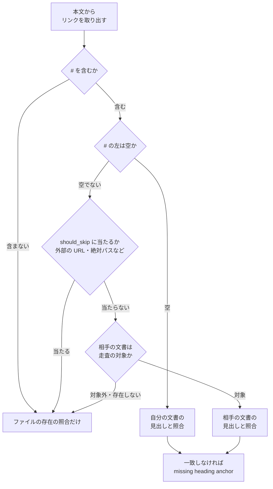

# 説明文書の検査 — リンクの照合と版数の例

説明文書の食い違いを継続的統合で落とす 2 本の検査のうち、見出しへの参照の照合・`issues/` の
走査・インラインコードの扱い（`scripts/check-markdown-links.py`）と、版と配布の正本の
「版の付け方と開発版の配布」章の検査 J（`scripts/check-doc-staleness.py`）について、確定した
振る舞いと決定の理由を残す。

**検査 J が見る記載の書き方は
[版と配布の正本](../versioning-and-distribution.md)の「版数を持つ 15 箇所」が正である。**
ここに書き写さない。この文書が扱うのは、そこに書かない決定の理由と、照合の規則の細部である。

## 概要

- **リンクの検査は、ファイルの存在に加えて見出しへの参照を照合する。** `#見出し` と
  `相手.md#見出し` の 2 形が、存在しない見出しを指していれば `missing heading anchor` で落ちる
- **`issues/`（`issues/old/` を含む）はリンクの検査の走査に入る。** 設計文書と計画は分割や
  移設のたびに参照が壊れうるため、`docs/` へ移る前の期間も検査する
- **インラインコードの中の記法はリンクとして読まない。** 記法を説明する例で誤って落ちない
- **文書が指す参照の実在は、pytest ではなくこの検査が失敗として出す。** `.md` を読む pytest は
  文言の照合と区別が付かないため置かない（[#885 の分類の規則](cross-refactoring-round-tests-and-assess.md#リポジトリに文言固定テストを置かない885)）
- **検査 J は正本（`docs/versioning-and-distribution.md`）の章を読む。** 章に並ぶ版数の基底を
  現行版と比べる規則に加え、版の形の表と「次を開発するなら」の例を**例どうしで**比べる

## 用語

| 用語 | 意味 |
| --- | --- |
| 走査の対象 | `check-markdown-links.py` がリンクを取り出す文書の集合。`DEFAULT_SCAN_TARGETS` が決める |
| 参照先 | リンクの `](` と `)` の間に書かれた値 |
| インラインコード | 1 行の中で、同じ本数のバッククォートの列に挟まれた範囲 |
| 正本 | `docs/versioning-and-distribution.md`。版数の扱いを持つ唯一の文書 |
| 章 2 | 正本の `## 版の付け方と開発版の配布` から、次の同位以上の見出しの直前まで |
| 基底 | 版数から接尾辞を除いた数字 3 つ |

## 仕様: リンクの検査

### 走査の対象

`DEFAULT_SCAN_TARGETS` は `README.md` / `AGENTS.md` / `CLAUDE.md` / `KIRO.md` / `docs` /
`plugins` / `issues` である。母集合はファイルシステムから集める（git の追跡からは集めない）。
継続的統合の `runtime-plugin-validate.yml` は `push` の `paths` に `issues/**` を持ち、走査の
対象と起動条件が揃う。

### 見出しから参照の名前を作る規則

GitHub の生成規則に合わせる（`slugify`）。このリポジトリの文書は日本語の見出しをそのまま
参照に書くためである。

| 段 | 何をするか | 例 |
| --- | --- | --- |
| 1 | 小文字にする | `Design Notes` → `design notes` |
| 2 | 文字・数字・結合文字（Unicode 一般カテゴリ L / M / N）・空白・`-`・`_` 以外を落とす | `` `$SCRIPTS` を決める `` → `scripts を決める` |
| 3 | 空白を `-` にする | `design notes` → `design-notes` |
| 4 | 同じ名前が既にあれば `-1`、`-2` を付ける | 2 つ目の `## 手順` → `手順-1` |

**入力は見出しの Markdown そのままで、囲みの記号を先に落とす段は置かない。** インライン
コードの `` ` `` も山括弧も段 2 で落ちるため、`` `<worktree-base>` の解決順 `` は GitHub と同じ
`worktree-base-の解決順` になる。山括弧を含む部分を先に取り除くと、中の文字ごと落ちる。

照合するときは、書かれた側の名前を百分率符号化から戻し、小文字にしてから比べる。日本語の
見出しはそのままの形でも符号化された形でも書かれる。

### 見出しとして読む範囲

**ATX の見出し（`^#{1,6}\s+`）だけを読む。** 下線の形（`===` / `---`）、`<a name>` / `<h2 id>`
による指定は読まない。行頭が `#` でも直後が空白でない行（`#183 の指摘は…` のような課題番号で
始まる文）は見出しにしない。`---` を下線として読むと、frontmatter の終わりが直前の行を見出しに
変えてしまう。

**フェンスの中と `>` で始まる引用の行は、リンクの取り出しと見出しの抽出の両方から除く**
（`visible_lines`）。引用の中には他の文書から引いた見出しの形があり、数えると GitHub が作らない
名前が集合へ入り、重複の連番もずれる。

### 照合の経路

**ファイルの存在の照合と、見出しの照合は別の経路にする。** 同じ関数へ両方を入れると、ファイルが
無いときと見出しが無いときで戻り値の意味が 2 つになる。

**相手の文書が無いときに積むのは `missing link target` の 1 行だけである。** 1 つの誤りに 2 行を
出すと、直す箇所が 2 つあるように読める。

**走査の対象外の文書は見出しを読まない。** 照合するために対象外の文書を読むと、検査の母集合が
実質的に広がる。見出しの名前の控えは実行 1 回のあいだだけ辞書で持ち、同じ文書を 2 度読まない。

### インラインコード

リンクを取り出す前に、1 行ずつインラインコードの範囲を空白 1 つへ置き換える（`strip_inline_code`）。

| 規則 | 内容 |
| --- | --- |
| 範囲 | N 本のバッククォートの列から、次に現れる同じ N 本の列まで |
| 閉じない列 | 同じ本数の列が行の中に無ければインラインコードにせず、後ろの本文はリンクとして読む |
| 行をまたぐもの | 読まない |
| 置き換え | 空白 1 つ。前後の文字がつながって別のリンクの形にならないようにする |

**除くのはリンクを取り出す経路だけで、見出しの経路では除かない。** 見出しの経路で除くと
`` ### `<worktree-base>` の解決順 `` の名前が `の解決順` に変わり、GitHub と食い違う。

### `issues/` の走査と記録の扱い

**`issues/old/` も含めて走査し、除外の一覧を置かない。** 走査へ入れたときに見つかった壊れた
参照の大半は、文書を `issues/old/` へ移して相対パスの深さが変わったものだった。`old/` を除くと
この壊れ方が見えないまま積もる。`check-doc-line-limit.py` が `issues/` を除くのは記録を分割
しないためで、参照が壊れたままでよい理由にはならない。

**記録の参照を直すときは `](` と `)` の間だけを変える。** 記録を書き換えない扱いが守るのは当時の
判断と記述であり、参照先の相対パスは読み手を運ぶ道筋にすぎない。直し方は
[issues/README.md](../../issues/README.md) の「old/ へ移すときの参照」にある。移すときに参照を
自動で書き換える道具は作らない。

**母集合はファイルシステムから集める形のまま変えない。** 主ディレクトリの `issues/` には未追跡の
下書きが置かれ、手元の実行ではその壊れた参照でも落ちるが、下書きはいずれ Pull Request に載る
ため早く気づく方に働く。git の追跡から集める形へ変えると `docs/` と `plugins/` の母集合の
決め方まで変わる。

## 仕様: 検査 J（版の付け方の章）

### 読む先と区間

| 項目 | 内容 |
| --- | --- |
| 読む先・報告先 | `docs/versioning-and-distribution.md`（`VERSIONING_MD`）。`AGENTS.md` の「主要プラグインです（v<版>）」を読む検査 I とは別に読む |
| 位置決め | `VERSION_SECTION_HEADING = "## 版の付け方と開発版の配布"` |
| 区間の終端 | 位置決めの見出しと同じか上位の見出し。深さは位置決めの見出しから導く（`## ` なら `^#{1,2}\s`） |
| 囲み | フェンスの中の `# ` 始まりは見出しと数えない |
| 拾う版数 | `` `9.6.0` `` のように囲まれた版数だけ |

**読む先を動かすときは、読む先・報告先・位置決めの見出しの 3 つを同時に動かす。** 報告先を
据え置くと、正本の記載が古いことを別の文書の失敗として報告する。**終端の深さは固定しない。**
固定の 3 段で `## ` の章を閉じると、章の中の `### ` 小見出しで区間が切れる。

**正本がディレクトリへ分かれた場合も、検査 J が読むのは章 2 を持つ 1 ファイルである。** 分けた
まま検査を動かし忘れても、読む先が無いか版数を読み取れないこととして落ち、素通りしない。

### 版数の例の規則

基底の規則（章に並ぶ版数の基底が現行版の基底より小さければ落ちる）の後に、`check_version_examples`
が囲みの外の行から次を拾って判定する。

| # | 規則 | 位置を決める語 |
| --- | --- | --- |
| R1 | 3 つの行がちょうど 1 つずつある | 版の形の表の 1 列目の `正式版` / `開発版` / `公開前の確認版` |
| R2 | 正式版の行は接尾辞を持たない。開発版の行は `-dev.<連番>`、公開前の確認版の行は `-rc.<連番>` で終わる | 同上 |
| R3 | 開発版と公開前の確認版の行の基底が、正式版の行の基底より大きい（R1 で正式版の行が 1 つのときだけ判定） | 同上 |
| R4 | 次の開発の例が 1 つ以上ある | 「の次を開発するなら」 |
| R5 | 各例の右側の基底が左側の基底より大きく、右側が `-dev.<連番>` で終わる | 同上 |

- 章 2 の見出しが無いときは「版数を読み取れない」だけを報告し、R1〜R5 を判定しない
- 現行版が読み取れなくても R1〜R5 は判定する（現行版を使わない規則である）
- 失敗 1 件ごとに、記載の値・行番号・比べた相手の値を出す

### 決定の理由

| 決定 | 理由 |
| --- | --- |
| 次に出す版を指す例を検査で止め、手で直す箇所の表には足さない | 版数を一括で置換すると、次の版を指す例が現行版を指す形へ崩れる。v10.10.0 は開発版の行が正式版と同じ値のまま配布された。人の読み直しに頼る限り、置換のたびに同じ機会が生じる |
| 例を固定の値（`9.9.9` / `X.Y.Z`）にしない | 基底の規則で落ちるか版数を読み取れず、検査 J の撤去を伴う。章の古い版数を見つける既存の機能まで失う |
| 例は例どうしで比べ、現行版とは比べない | `develop` の版は接尾辞付きになりうる。現行版との一致を求めると開発版を出すたびに正しい例が落ちる。正式版の行と現行版の結び付きは基底の規則が持つ |
| 位置を決める語を使う | 崩れた値は現行版そのものと等しいことがあり、値だけでは正式版を指す正しい例と区別できない。値が何を指すはずかは周囲の語でしか決まらない |
| 語が見つからない・重なるときは失敗にする | 記載を消しても検査は通らない、という既存の方針に揃える。黙って通すと表の行を言い換えるだけで規則が外れる |
| 箇条書きの「`-dev.3` の次は」「順序は semver に従い」は規則に入れない | 一括置換の後も例の中では整合したまま残る。位置の語を増やすほど章 2 の書き方が固定される |
| 位置の語は囲みの外の行だけで探す | 囲みの中は実行例か出力例で、数えると実行例を足しただけで R1 に当たる。版数の収集（基底の規則）は囲みの中も拾う |

**章 2 を書く人は、表の 1 列目の 3 語と「の次を開発するなら」を言い換えられない。** 1 列目に同じ
語を持つ表を章 2 へ足すと R1 で落ちる。区分の説明に古い版数の例（`1.0.0 → 1.0.1` など）を囲んで
置くと基底の規則で落ちるため、囲まずに書くか章の外へ置く。

## テスト観点

| 観点 | 確かめ方 |
| --- | --- |
| 同じ文書・別の文書の無い見出しで落ち、重複の `-1`・百分率符号化・山括弧を含む見出しが解決する | `scripts/tests/test_check_markdown_links.py` |
| コードブロックとインラインコードの中の参照で落ちず、同じ行のコードの外では落ちる | 同上 |
| 相手の文書が無いときは `missing link target` の 1 行だけが出る | 同上 |
| `issues/` 直下と `issues/old/` の下の壊れた参照で落ち、`issues/` の無い見出しを指す参照でも落ちる | 同上 |
| リポジトリ全体が通る | `python3 scripts/check-markdown-links.py --root .` |
| 検査 J が正本を読み、報告先が正本のパスで、章の小見出しで区間が切れない | `scripts/tests/test_doc_staleness.py` |
| 版の形の表と次の開発の例の R1〜R5、囲みの中の同じ表の行が数えられないこと | 同上 |
| 現行版が `-dev.N` / `-rc.N` の木で、例どうしが規則を満たせば通る | 同上 |
| リポジトリ全体が通る | `python3 scripts/check-doc-staleness.py --root .` / `bash scripts/validate-runtime-plugins.sh` |

## 関連リンク

- [issue #445](https://github.com/devbasex/ai-plugins/issues/445) / [PR #501](https://github.com/devbasex/ai-plugins/pull/501)（設計） / [PR #588](https://github.com/devbasex/ai-plugins/pull/588)（実装） — 見出しへの参照の照合
- [issue #543](https://github.com/devbasex/ai-plugins/issues/543) / [PR #596](https://github.com/devbasex/ai-plugins/pull/596)（設計） / [PR #600](https://github.com/devbasex/ai-plugins/pull/600)（実装） — `issues/` の走査とインラインコード
- [issue #499](https://github.com/devbasex/ai-plugins/issues/499) / [PR #594](https://github.com/devbasex/ai-plugins/pull/594)（実装） — 検査 J の読む先を正本へ移す
- [issue #566](https://github.com/devbasex/ai-plugins/issues/566) / [PR #604](https://github.com/devbasex/ai-plugins/pull/604)（設計） / [PR #609](https://github.com/devbasex/ai-plugins/pull/609)（実装） — 版の形の表と次の開発の例
- [issue #885](https://github.com/devbasex/ai-plugins/issues/885) / [PR #918](https://github.com/devbasex/ai-plugins/pull/918)（実装） — 参照の実在を見ていた pytest をこの検査へ寄せる
- [版と配布の正本](../versioning-and-distribution.md)
- [NDF 知識構造・Kiro CLI 仕様](ndf-knowledge-and-kiro.md) — `AGENTS.md` と正本の役割の分け方
