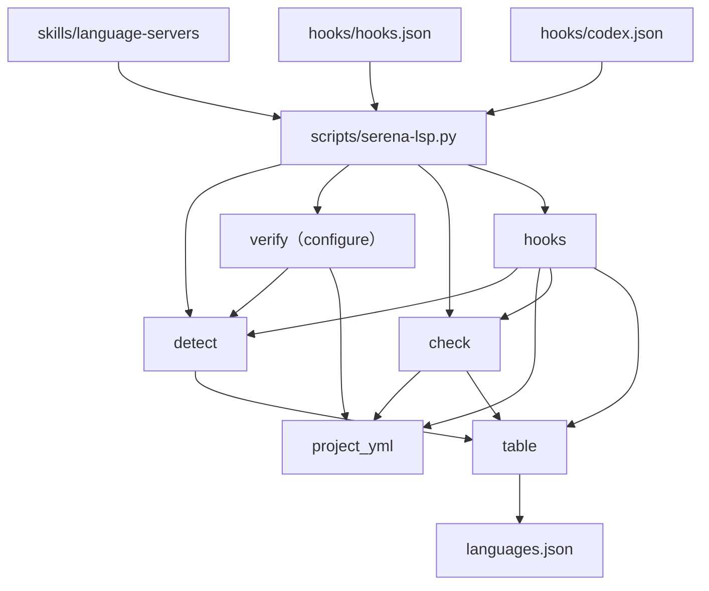
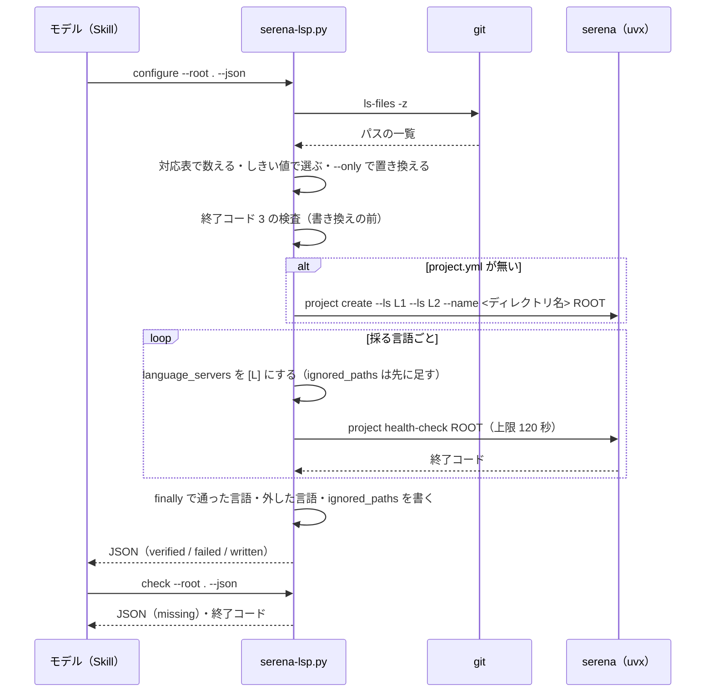

# mcp-serena: 言語サーバが bash だけで Python のシンボルを引けず、動いていないことにも気付けなかった → 導入先ごとに言語を検出して Serena を設定し、Claude Code の診断は公式 LSP プラグインに分担させる

## 目的

**Claude Code と Codex で、定義・参照・診断（型エラー・未解決の import）と、コードを丸ごと
読まない編集を使えるようにする。** 役割はランタイムごとに分け、同じ言語で機能を重複させない。

| ランタイム | 診断 | シンボルの把握・参照・編集 |
| --- | --- | --- |
| Claude Code | 公式 LSP プラグイン（plugin LSP servers） | Serena |
| Codex | Serena（`get_diagnostics_for_file`） | Serena |

**言語は導入先のリポジトリごとに検出して設定する。** このリポジトリ専用の設定にしない。
**動いていないことを検査で見えるようにする。** 言語サーバが無くても何も表示されない状態を
残さない。

例: このリポジトリで `/mcp-serena:language-servers` を実行すると、スクリプトが追跡対象の
拡張子を数えて `python`（321 ファイル・81%）と `bash`（71・18%）を採り、`.js` の 4 ファイル
（1%）はしきい値に届かないので外す。`.serena/project.yml` を書き、1 言語ずつ起動を検証し、
Claude Code 向けには `pyright-lsp` の導入と `pyright-langserver` の有無を検査して足りないものを
知らせる。以後のセッションで、モデルが採った言語のファイルを `Read` で 3 回続けて開こうと
すると hook が 1 度だけ拒み、シンボル単位の手順を示す。

**この Skill はプロジェクト（リポジトリ）ごとに実行する。利用者単位で 1 回ではない。** 言語の
設定（`.serena/project.yml`）はリポジトリごとに持つためである。

| 何が | 単位 |
| --- | --- |
| Skill の実行（検出・`project.yml` の書き込み・1 言語ずつの起動の検証） | プロジェクト。最初の 1 回と、SessionStart の通知が食い違いを知らせたとき |
| `project.yml` を追跡するか | プロジェクト。追跡すれば同じリポジトリの他の利用者は打たずに済む |
| 言語サーバの本体と Claude Code の LSP プラグインの導入 | 利用者（マシン・コンテナ）。Skill は欠けを示すだけで入れない |

**手順と判断の分岐は
[`language-servers` の SKILL.md](../../plugins/mcp/mcp-serena/skills/language-servers/SKILL.md)、
利用者向けの導入は [mcp-serena の README](../../plugins/mcp/mcp-serena/README.md)、ツールの使い方は
[serena-guide](../../plugins/mcp/mcp-serena/docs/serena-guide.md) が正である。** この文書が
扱うのは、スクリプトと hook の契約と、決定の理由である。

## 用語

本文は左の業務用語で書く。識別子は表・コードブロック・業務用語の初出の括弧書きにだけ置く。

| 業務用語 | 識別子 | 何を指すか |
| --- | --- | --- |
| 対応表 | `scripts/languages.json` | 言語ごとに拡張子・Serena の言語識別子・公式 LSP プラグイン・本体のコマンド・追加の検査を持つ。唯一の正本 |
| 検出 | `detect` | `git ls-files` の拡張子を数え、しきい値を超えた言語を選ぶこと |
| 採った言語 | `language_servers` | 検出で選ばれ、起動の検証を通った言語。`project.local.yml` にこのキーがあればそちらが上書きする |
| 起動の検証 | `serena project health-check` | 1 言語だけを設定した状態で走らせ、終了コード 0 を見ること |
| 外した言語 | `mcp_serena_excluded` | 検証に失敗した言語と、`--only` で名指しされなかった言語。`<言語> <理由>` の要素 |
| 設定済みの目印 | `mcp_serena_excluded` のキーの有無 | このキーがあることが「`configure` で設定した」目印。空の配列でも目印になる |
| 導入の検査 | `check` | 公式 LSP プラグイン・本体・追加の検査（TypeScript の版・shellcheck）が揃っているかを見ること |
| 追加の検査 | `extra_checks` | 対応表が名前で指し、`check.py` の `EXTRA_CHECKS` が関数を持つ検査 |
| 誘導 | PreToolUse の `deny` | grep やコードファイルの読み込みが続いたとき 1 度だけ拒み、シンボル単位の手順を示すこと |
| 数の記録 | `<session_id>.json` | 誘導のためにセッションごとに数える grep・読み込み・混在の回数と時刻 |

## 対象範囲

| 扱う | 扱わない |
| --- | --- |
| `plugins/mcp/mcp-serena/` の起動定義（版の固定・`--project-from-cwd`・ランタイム別の `--context`・`no-memories` / `no-onboarding`） | 起動のラッパースクリプト（決定 4） |
| 対応表と `scripts/serena-lsp.py`（`detect` / `configure` / `check` / `hook`） | プラグイン名・サーバ名の短縮（決定 5） |
| hook（SessionStart の通知、PreToolUse の誘導と自動許可）。Claude Code と Codex の 2 つの定義 | NDF・mcp-serena に `lspServers` を持たせること |
| `language-servers` の Skill（`mcp-serena` プラグインに置く） | Kiro CLI と agy の hook・文脈の調整（今と同じく MCP の定義を受け取るだけ） |
| NDF のコード改変系 Skill（`refactoring` / `problem-solving` / `tdd-cycle`）の 1 行と、エージェント定義（`corder` / `qa` / `director` / `debugger`）の Serena の行 | エージェント定義の構成の整理（#877 #869）、devbase のコンテナへの導入（devbasex/devbase#236） |
| このリポジトリの `.serena/project.yml`（`python` + `bash`、`.worktrees/**` と `.serena/**` を外す） | 誘導が拒んでも Serena へ切り替わらない問題（#971） |

## 決定と理由

番号は #818 の決定の番号である。コードのコメントの「決定 N」はこの番号を指す。

| # | 決定 | 理由 |
| ---: | --- | --- |
| 1 | Skill・スクリプト・hook は `mcp-serena` に置き、NDF に置かない | Serena を使うのは `mcp-serena` を入れた利用者だけである。NDF に置くと Serena の無い利用者にも hook が載って毎回空振りする |
| 2 | 言語を採るしきい値は「10 ファイル以上**かつ** 5% 以上」。割合の分母は対応表の拡張子を持つファイルの数 | 「または」では 1 万ファイルに 10 個だけある言語も採り、メモリ 2.5 倍・初回 42 倍・道連れの失敗を払う。割合だけでは小さなリポジトリの 2 ファイルが 5% を超える |
| 3 | Codex は `--context codex` で起動し、memory のツールが一覧に残ることを受け入れる | Serena 1.7.0 の `codex` 文脈はモードでツールを絞らない（23 ツール）。`claude-code` 文脈のプロンプトは Claude Code の遅延読み込みを前提にし、Codex に当てはまらない。残った memory のツールは呼ぶと `Tool '...' is not active` で拒まれる |
| 4 | 起動のラッパー（導入済みの Serena を優先する）を作らない | `.mcp.json` の中でのプラグインルートの展開を Codex で確かめられない。利点（初回のダウンロード・オフライン）は `uv` のキャッシュを温めれば得られる |
| 5 | プラグイン名とサーバ名は変えない | 遅延読み込みで一覧に載るのは名前だけで、数百文字しか変わらない。変えると利用者の許可の設定と定義中のツール名がすべて変わり、`serena` は公式と衝突する |
| 6 | 誘導は公式の `serena-hooks` を使わず標準ライブラリで持つ。閾値・待ち・有効期間・数を戻さない部分文字列は公式と同じにする | 公式は固定の 60 拡張子（`.json` などを含む）で判定し、設定していないリポジトリでも拒む |
| 7 | 起動の検証は `project.yml` を 1 言語ずつ書き換えて `serena project health-check` を走らせる | Serena は 1 言語の失敗で全体の初期化を止める。内部の API は版で壊れやすく、一時ディレクトリではファイルの根が変わる |
| 8 | `project.yml` は行単位で書き換え、YAML のライブラリを使わない。知らない形では書かずに止める | hook と検査を標準ライブラリだけで動かし、SessionStart を 1 秒に収める。注釈と他のキーを 1 バイトも変えない |
| 9 | SessionStart は、設定済みでは食い違いと欠けがあるときだけ、未設定では未設定だけを知らせ、何も導入しない。外した言語は `project.yml` の `mcp_serena_excluded` に残す | 揃っているときの通知は読み飛ばされる。導入はネットワークへ出て手元に書き込む。外した言語を残さないと毎回食い違いとして出る。注釈に置くと Serena の書き直しで消える（知らないキーは残る） |
| 10 | エージェント定義は Serena の行だけを直す | 構成の整理は #877 #869 が同じファイルを変える。古いツール名（`mcp__plugin_ndf_serena__*` など）は待つ間もモデルを誤らせる |
| 11 | `initial_instructions`・Claude Code の `LSP` ツール・`get_diagnostics_for_file` は一覧に残す | サーバの説明が `initial_instructions` を指す。どれも遅延読み込みで文脈はほとんど増えない。`excluded_tools` はランタイムで共有され Codex からも消える |
| 12 | `.serena/project.yml` を追跡するかは利用者が選び、既定では `.gitignore` と `.serena/.gitignore` に触らない | 追跡すれば作業ツリーにも設定が揃う。どちらの書き換えもリポジトリの方針で決まる |
| 13 | クラス図を持たない | スクリプトは関数の集まりで型を定義しない。データの形は下の「データ・設定」が持つ |
| 14 | 規則だけで決まる手順はすべてスクリプトにし、モデルには 4 つの判断を残す | 下の「スクリプトとモデルの境界」 |
| 15 | Kiro は Claude Code と同じ起動定義と hook の定義を受け取る。`--client claude-code` の hook は `CLAUDE_PLUGIN_ROOT` が無ければ何も出さない | Serena に Kiro の文脈は無い。Kiro の installer が SessionStart を `agentSpawn` へ写すため、そのままでは `installed_plugins.json` の無い Kiro に LSP の欠けを毎回出す |
| 16 | `SERENA_HOME` は `.serena`（cwd からの相対）のまま保ち、作業ツリーごとの言語サーバの取得を受け入れる | 変えると既存の利用者の設定と言語サーバの置き場所が移る。`~/.serena` は公式と全体の設定を共有し、絶対パスは `.mcp.json` の展開に頼る |

**効果の実測（2026-09-24、claude-sonnet-5・指示なし・各 3 回）では、誘導の hook は拒んだが
モデルは Serena へ切り替わらなかった。** 作り直しは #971 に分けた。

### スクリプトとモデルの境界

| 手順 | 担うもの |
| --- | --- |
| 拡張子を数える・しきい値で選ぶ・`project.yml` を書く・1 言語ずつ検証する・失敗を外す | スクリプト（`configure`） |
| 導入の検査（プラグイン・本体・TypeScript の版・shellcheck） | スクリプト（`check`） |
| 食い違いの通知・誘導・自動許可 | スクリプト（hook） |
| 導入のコマンドを打つか | モデル（利用者に確認。ネットワークへ出て手元に書き込む） |
| `.serena/project.yml` を追跡するか | モデル（利用者に確認） |
| 検証に失敗した言語の原因と次の手（キャッシュの退避・再試行・諦める） | モデル（ログの読み方が失敗ごとに違う） |
| 検出の誤りを名指しで直すか（`--only`） | モデル（生成物・同梱のライブラリの扱いはリポジトリで違う） |

## 不変条件

| 条件 | 破れたときの扱い |
| --- | --- |
| `configure` が書き換えるのは `project.yml` の `language_servers` / `ignored_paths` / `mcp_serena_excluded` の 3 キーだけで、他のキーと注釈は 1 バイトも変えない | 3 キーのどれかが読めない形（流れの形の非空の配列・アンカー・写像）なら書かずに終了コード 3 |
| `project.local.yml` が `language_servers` を持つリポジトリには書かない | 終了コード 3 で止め、`error` に理由を載せる |
| 検証が中断されても、`project.yml` には通った言語だけが残る | 例外・SIGTERM・SIGINT は `finally` で最後の値を書く。SIGKILL で 1 言語のまま残ったら SessionStart が「設定に無い言語」として知らせ、打ち直しで直る |
| `configure` が起動する `serena` は起動定義と同じ `SERENA_HOME=.serena` と cwd `--root` で動く | 既定の `~/.serena` で走らせると利用者の全体の設定を書き換え得るため、環境は常に上書きする |
| `.gitignore` は `--gitignore`、`.serena/.gitignore` は `--serena-gitignore` のときだけ書く | 渡さないときは足すべき行を `serena_gitignore_added` に載せるだけ。`project create` が作る Serena の既定の `.serena/.gitignore` は許す |
| セッションの開始でネットワークへ出る導入を走らせない。スクリプトは導入のコマンドを出力に載せるだけで打たない | — |
| hook はツールの呼び出しを止めない（誘導の `deny` を除く） | 例外・読めない入力・`project.yml` の読めない形では何も出さずに終了コード 0 |
| 設定済みの目印の無いリポジトリでは PreToolUse は数えない | Serena が `--project-from-cwd` で自動で作った `project.yml` も目印が無いので数えない |
| 言語を足すときに変えるのは対応表だけで、hook とスクリプトは言語の名前で分岐しない | 既にある種類で足りない追加の検査だけは `check.py` の `EXTRA_CHECKS` に関数を 1 つ足す。知らない名前は対応表の破損として `check` が終了コード 2 |
| hook と検査は Python 3 の標準ライブラリだけで動き、`uvx` を呼ばない | `uvx` を要するのは Serena の起動と `configure` の検証だけ |

## 構成要素

| 要素 | 責務 |
| --- | --- |
| `.mcp.json` | Claude Code と Kiro の起動定義。`--context claude-code` |
| `.codex.mcp.json` | Codex の起動定義。`--context codex` だけが違う |
| `.codex-plugin/plugin.json` | `mcpServers` を `./.codex.mcp.json`、`hooks` を `./hooks/codex.json`、`skills` に `./skills/language-servers` |
| `scripts/languages.json` | 対応表 |
| `scripts/serena-lsp.py` | 入口。サブコマンドを振り分け、`hook` の例外を握りつぶす |
| `scripts/serena_lsp/table.py` | 対応表を読み（`validate` で version 1 の形を確かめる）、拡張子 → 言語を返す |
| `scripts/serena_lsp/detect.py` | `git ls-files -z` を数え（`count`）、しきい値で選ぶ（`choose`）。`git` が使えなければ `GitUnavailable` |
| `scripts/serena_lsp/project_yml.py` | 3 キーを行単位で読み書きする（`read_list` / `write_list`）。導入先の状態を読む（`load_state`） |
| `scripts/serena_lsp/verify.py` | `configure`。検出・作成・1 言語ずつの検証・確定の値の書き込み・`.gitignore` |
| `scripts/serena_lsp/check.py` | 導入の検査（`run` / `missing_items`）と追加の検査の関数（`EXTRA_CHECKS`） |
| `scripts/serena_lsp/hooks.py` | SessionStart の通知（`session_start`）と PreToolUse の誘導・自動許可（`pre_tool_use`） |
| `hooks/hooks.json` / `hooks/codex.json` | Claude Code（と Kiro の installer）/ Codex の hook 定義 |
| `skills/language-servers/SKILL.md` | 導入と検査の Skill。呼び出しと 4 つの判断だけを持つ |
| `dev.kiro/install.sh` | 生成物（`scripts/build-runtime-plugins.sh` が作る） |
| `scripts/validate-runtime-plugins.sh`（リポジトリの根） | Codex の `mcpServers` が実在する `./.mcp.json` か `./.codex.mcp.json` を指すことを見る |



## 仕様

### 起動定義

```json
{"mcpServers": {"serena": {"type": "stdio", "command": "uvx",
  "args": ["--from", "serena-agent==1.7.0", "serena", "start-mcp-server",
           "--context", "claude-code", "--project-from-cwd",
           "--add-mode", "no-memories", "--add-mode", "no-onboarding",
           "--enable-web-dashboard", "False"],
  "env": {"SERENA_HOME": ".serena"}}}}
```

`git+` の URL を含まない。`.codex.mcp.json` は `--context codex` だけが違う。起動したときの
ツールの数（2026-09-24、MCP の `tools/list` で実測）:

| 定義 | ツール | 無いもの |
| --- | ---: | --- |
| Claude Code（`claude-code`） | 14 | `activate_project`・memory の 6 ツール（`write_memory` / `read_memory` / `list_memories` / `delete_memory` / `edit_memory` / `rename_memory`）・`onboarding`・`get_current_config`・`search_for_pattern` |
| Codex（`codex`） | 23 | `replace_content` |

作業ツリー（`.worktrees/<ブランチ名>`）で起動した Serena は作業ツリーを根にし、作業ツリーごとに
`.serena/language_servers/` を持つ（決定 16。実測で初回の `find_symbol` 3.8 秒・48M）。
`project.yml` を追跡しない作業ツリーでは Serena が目印の無い設定を自動で作るため、hook は
未設定を知らせる。

### `serena-lsp.py` のサブコマンド

| サブコマンド | 引数 | 書くもの | 終了コード |
| --- | --- | --- | --- |
| `detect` | `--root DIR` `--json` | 無し | 0 検出できた（採る言語が 0 でも 0）/ 2 `git` が使えない・リポジトリでない |
| `configure` | `--root DIR` `--json` `--dry-run` `--gitignore` `--serena-gitignore` `--only LANG,...` `--serena CMD` | `.serena/project.yml`、`--gitignore` のときだけ `.gitignore`、`--serena-gitignore` のときだけ `.serena/.gitignore` | 0 書いた（外した言語があっても 0）/ 1 検証を通った言語が 0（`--dry-run` では採る言語が 0）/ 2 `git` か Serena の起動コマンドが使えない・`project create` が `project.yml` を作らなかった / 3 `project.yml` の形が読めない・`project.local.yml` が `language_servers` を持つ / 128 + シグナル番号 SIGTERM・SIGINT で中断した（通った言語だけを書いた） |
| `check` | `--root DIR` `--json` `--runtime claude-code\|codex`（既定 `claude-code`） | 無し | 0 揃っている / 1 欠けがある（`installed_plugins.json` が無いときを含む）/ 2 読めない（`project.yml` が無い・読めない形、対応表が壊れている・知らない `extra_checks`、`installed_plugins.json` が JSON として読めない） |
| `hook session-start` | `--client claude-code\|codex` | 無し | 常に 0 |
| `hook pre-tool-use` | `--client claude-code\|codex` | 数の記録 | 常に 0 |

- `--json` が無ければ、キーごとに `key: <JSON>` の行で出す
- `--only` は検出を走らせたうえで、採る言語を名指しで置き換える。検出された言語のうち名指し
  されなかったものを `not_selected` として `mcp_serena_excluded` に書く
- `--serena` は Serena の起動の前半を差し替える（既定 `uvx --from serena-agent==1.7.0 serena`。
  テストは偽のコマンドを渡す）
- `--dry-run` は検出と差分（`diff`）の表示だけを行い、ファイルを 1 つも書かない。`dry_run: true` を載せる
- `--runtime codex` の `check` は、公式 LSP プラグイン・本体・`typescript_major_5` を飛ばし、
  `shellcheck` だけを見る（Codex は Serena が言語サーバを入れる）。`installed_plugins.json` も読まない
- `installed_plugins.json` は `${CLAUDE_CONFIG_DIR:-~/.claude}/plugins/installed_plugins.json`
  の `plugins` のキーを導入済みとして読む
- `typescript_major_5` は、PATH の `typescript-language-server` の実体から親ディレクトリを
  たどって最初に見つかった `node_modules/typescript/package.json` の版の先頭が `5` かを見る
- 環境変数 `SERENA_LSP_TABLE` は対応表の差し替え、`SERENA_LSP_VERIFY_TIMEOUT` は 1 言語の検証の
  上限（既定 120 秒）の差し替えに使う

### `configure` / `detect` / `check` の JSON

```json
{"root": "/abs/path",
 "detected": [{"language": "python", "files": 321, "share": 0.81}],
 "skipped": [{"language": "typescript", "files": 4, "share": 0.01, "reason": "below_threshold"}],
 "verified": ["python"],
 "failed": [{"language": "bash", "reason": "health_check_exit_1", "log": "/abs/.serena/logs/health-checks/..."}],
 "written": {"created": false, "language_servers": ["python"], "excluded": ["bash health_check_exit_1"],
             "ignored_paths_added": [], "gitignore": false,
             "serena_gitignore_added": ["/serena_config.yml", "/logs"]},
 "missing": [{"language": "python", "item": "plugin", "name": "pyright-lsp@claude-plugins-official",
              "install": "claude plugin install pyright-lsp@claude-plugins-official"}]}
```

| キー | 値 |
| --- | --- |
| `detected` / `skipped` | 件数の多い順（同数は名前順）。`share` は小数 3 桁。`skipped.reason` は `below_threshold` だけ |
| `failed.reason` | `health_check_exit_<n>` / `timeout`（1 言語 120 秒）/ `serena_unavailable` |
| `failed.log` | 検証の開始以降に `.serena/logs/health-checks/` に書かれた最新のログ。無ければ `null` |
| `written.serena_gitignore_added` | `--serena-gitignore` を渡したときは足した行、渡さないときは足せば足す行 |
| `missing.item` | `plugin` / `binary` / `typescript_major_5` / `shellcheck` |
| `error` | 終了コード 2・3 のときの理由 |

`detect` は `root`・`detected`・`skipped` だけ、`check` は `root`・`missing`（と `error`）だけを持つ。
`configure` は `missing` を持たない。

### `configure` の流れ



- 終了コード 3 の検査は書き換えの `try` / `finally` に入る前に済ませ、何も書かずに返す
- `ignored_paths` には `.serena/**` を常に、`.worktrees/**` は `.worktrees/` があるときだけ、無ければ
  足す。既存の要素は消さない。**`.serena/**` は検証の前に足す**（`.serena/.gitignore` の無い
  リポジトリで、Serena が `.serena/language_servers/` の `.d.ts` を解析対象に選び TypeScript の
  検証が落ちた）
- `language_servers` は検証を通った言語を検出の順に並べる。通った言語が 0 なら `language_servers: []`
  と、失敗した言語を `mcp_serena_excluded` に書く
- 検証の上限に達したら、プロセスグループごと SIGKILL で止めて `timeout` として外す
- `--serena-gitignore` は `.serena/.gitignore` に `/serena_config.yml` `/logs` `/language_servers`
  `/cache` のうち無い行だけを足す。Serena 1.7.0 の既定は `/cache` と `/project.local.yml` の 2 行で、
  `SERENA_HOME=.serena` で作られる `serena_config.yml`（認証の秘密を持ち得る）・`logs/`・
  `language_servers/` は追跡の候補に残る
- `--gitignore` は `.gitignore` に `.serena/project.yml` の行を 1 度だけ足す

### hook 定義

| ファイル | イベント | matcher | コマンド（上限） |
| --- | --- | --- | --- |
| `hooks/hooks.json` | SessionStart | `startup` | `python3 "${PLUGIN_ROOT:-${CODEX_PLUGIN_ROOT:-${CLAUDE_PLUGIN_ROOT}}}/scripts/serena-lsp.py" hook session-start --client claude-code`（10 秒） |
| `hooks/hooks.json` | PreToolUse | `Grep\|Read\|Bash\|mcp__plugin_mcp-serena_serena__.*` | 同じ入口で `hook pre-tool-use --client claude-code`（5 秒） |
| `hooks/codex.json` | SessionStart | （無し） | `sh -c 'if [ -n "$PLUGIN_ROOT" ]; then python3 "$PLUGIN_ROOT/scripts/serena-lsp.py" hook session-start --client codex; fi; exit 0'`（10 秒） |
| `hooks/codex.json` | PreToolUse | `Bash\|shell\|exec_command\|local_shell\|mcp__.*serena.*` | 同じ形で `hook pre-tool-use --client codex`（5 秒） |

プラグインルートのプレースホルダの形は NDF の hook と同じである。Kiro の installer がこの形を
symlink の絶対パスへ置き換え、`SessionStart` を `agentSpawn` へ写す。**`--client claude-code` の
hook は、環境に `CLAUDE_PLUGIN_ROOT` が無ければ何も出さずに 0 で終わる**（決定 15）。
**Codex のプラグインの hook は、利用者が `/hooks` で信頼するまで何も表示されずに走らない。**

### hook の入出力

| hook | 入力（標準入力の JSON） | 出力 |
| --- | --- | --- |
| SessionStart | `cwd` | 通知があるとき `{"hookSpecificOutput": {"hookEventName": "SessionStart", "additionalContext": "<通知>"}}`。無ければ何も出さない |
| PreToolUse（Claude Code） | `session_id` `tool_name` `tool_input` `permission_mode` `cwd` | 拒否は `permissionDecision: "deny"` と `permissionDecisionReason`、許可は `"allow"`、どちらでもなければ何も出さない |
| PreToolUse（Codex） | `session_id` `tool_name` `tool_input.command`（文字列か配列）`cwd` | 拒否だけ。許可は返さない |

根は `cwd` から上へたどり、`.serena/project.yml` か `.git` を持つ最初のディレクトリにする。

### SessionStart の振る舞い

| リポジトリの状態 | 出すもの |
| --- | --- |
| git のリポジトリでない・採る言語が 0・`project.yml` が読めない形 | 何も出さない |
| 設定済みの目印が無い（`project.yml` が無い・Serena が自動で作った）で、採る言語が 1 つ以上 | 未設定の 1 行と、Skill の名前と「プロジェクトごとに実行する」の 1 行の 2 行だけ。食い違いと欠けの行は出さない |
| 目印がある | 食い違いと欠けがあるときだけ、1 項目 1 行と、最後に Skill の名前の 1 行 |

```text
[mcp-serena] 設定に無い言語があります: typescript（97 ファイル）
[mcp-serena] Claude Code の LSP が足りません: pyright-lsp（プラグイン）
[mcp-serena] /mcp-serena:language-servers で直せます（プロジェクトごとに実行します）
```

- 食い違いは、検出した言語から採った言語と外した言語を除いた残りである。逆向き（採った言語に
  あってしきい値に届かない言語。`--only` の名指し）は知らせない
- 欠けは `check` を `--runtime` に `--client` の値を渡して求める。`plugin` / `binary` /
  `typescript_major_5` は「Claude Code の LSP が足りません」、それ以外（`shellcheck`）は
  「<言語> の診断に要るものが足りません」の行にする。`check` が読めない（2）ときは欠けの行を出さない
- 読むのは `git ls-files -z` 1 回と設定のファイル（`project.yml`・`project.local.yml`・対応表・
  `claude-code` のときだけ `installed_plugins.json`）だけで、`claude` も `serena` も起動しない

### PreToolUse の誘導と自動許可

**数える呼び出し:** 採った言語の拡張子は `project.yml`（あれば `project.local.yml`）の
`language_servers` と対応表から毎回求める。`git` は呼ばない。

| 種類 | Claude Code | Codex |
| --- | --- | --- |
| grep | `Grep`、Serena の `search_for_pattern`、またはシェルの先頭の語が `grep` / `rg` / `ag` / `ack` / `fgrep` / `egrep` | シェルと `search_for_pattern` は左と同じ |
| 読み込み | `Read` の `file_path` の拡張子が採った言語のもの、またはシェルの先頭の語が `cat` / `head` / `tail` / `sed` / `less` / `nl` で、`-` で始まらない引数のどれかの拡張子が採った言語のもの | シェルは左と同じ（`Read` は数えない） |
| 混在 | grep と読み込みのどちらでも 1 増える | 同じ |
| 数を戻す | 名前に `serena` を含み、`pattern` / `read` / `diagnostics` / `memory` / `onboarding` / `config` / `list_file` / `find_file` / `shell` / `dashboard` / `restart_language_server` のどれも含まないツール | 同じ |

- シェルの語は `shlex` で分け、先頭の環境変数の代入を飛ばす。配列の `bash|sh|zsh -c|-lc <文字列>` は中の文字列を分ける
- grep 3・読み込み 3・混在 4 のどれかに達したら 1 度だけ拒み、数を 0 に戻して拒んだ時刻を残す。
  拒んでから 120 秒は数えも拒みもしない
- 数には有効期間があり、前回の同じ種類から grep と読み込みは 1000 秒、混在は 2000 秒を過ぎたら 1 から数え直す
- 同じセッションの PreToolUse は数の記録のロック（`fcntl.flock`）で直列にし、並列の増分を失わない
- 誘導の文は 3 行に収め、読む手順（`get_symbols_overview` → `find_symbol`（`include_body`）→
  `find_referencing_symbols`）と編集（`replace_symbol_body`）をツール名で示し、数を戻したので
  続けてよいことを書く
- **自動許可:** Claude Code で `permission_mode` が `acceptEdits` か `auto` のとき、名前に `serena`
  を含むツールに `allow` を返す。目印の無いリポジトリでも同じ。他のモードと Codex では返さない

### Skill の契約

Skill は Claude Code・Codex・Kiro へ同じファイルを配る。`${CLAUDE_PLUGIN_ROOT}` を置き換えるのは
Claude Code だけなので、冒頭の bash でプラグインルート（`$ROOT`）を次の順に決める。候補は `cd -P`
で実体へ解決してから 2 つ上がり、`scripts/serena-lsp.py` がある最初の候補を採る。

| 順 | 候補 | 当たるランタイム |
| --- | --- | --- |
| 1 | `${CLAUDE_PLUGIN_ROOT}/skills/language-servers`（置き換えられず `$` で始まったままなら飛ばす） | Claude Code |
| 2 | `<この Skill のディレクトリ>`（モデルが実際のパスへ置き換えてから打つ） | Codex |
| 3 | `.kiro/skills/language-servers` | Kiro（installer の symlink） |

打つ順（`configure` → `check` → 追跡の方針 → Serena の再接続の案内）と、終了コードごとの次の手は
SKILL.md が正である。`configure` は言語の数 × 120 秒かかり得るため、Claude Code の Bash ツールの
`timeout` に 600000 を渡す。

## データ・設定

### 対応表（`scripts/languages.json`）

```json
{"version": 1,
 "threshold": {"min_files": 10, "min_share": 0.05},
 "languages": [
   {"serena": "typescript", "extensions": [".ts", ".tsx", ".js", ".jsx", ".mts", ".cts", ".mjs", ".cjs"],
    "claude_plugin": "typescript-lsp@claude-plugins-official",
    "binaries": [{"command": "typescript-language-server",
                  "install": "npm install -g typescript-language-server typescript@5"}],
    "extra_checks": ["typescript_major_5"]},
   {"serena": "bash", "extensions": [".sh", ".bash"],
    "claude_plugin": null, "binaries": [], "extra_checks": ["shellcheck"]}]}
```

| フィールド | 型 | 空の扱い |
| --- | --- | --- |
| `version` | `1` だけを受ける | 違えば対応表の破損 |
| `threshold` | `min_files`（数）と `min_share`（数） | 必須 |
| `serena` | 文字列。Serena の `Language` の値 | 必須 |
| `extensions` | 小文字の拡張子の配列。言語をまたいで重ならない | 必須 |
| `claude_plugin` | 公式 LSP プラグインの ID | `null` なら Claude Code の LSP を検査しない（Bash は公式が無い） |
| `binaries` | `command` と `install` の組の配列 | 空なら本体を検査しない |
| `extra_checks` | 追加の検査の名前の配列 | 空でよい。知らない名前は `check` が終了コード 2 |

載せている言語は 13 である: `python`（`pyright-lsp`）・`typescript`（`typescript-lsp`）・`php`
（`php-lsp`）・`bash`・`go`・`ruby`・`rust`・`java`・`kotlin`・`csharp`・`swift`・`lua`・`cpp`
（`clangd-lsp`）。拡張子と公式プラグインの名前は `claude-plugins-official` の `marketplace.json` の
`lspServers.extensionToLanguage` から写した。`go` 以下の 9 言語は起動の検証を通していない
（利用者が導入したとき SessionStart の通知で気付く）。

### `.serena/project.yml` で書き換えるキー

| キー | 書き方 |
| --- | --- |
| `language_servers` | 採った言語のブロックの配列で置き換える。空なら `language_servers: []` |
| `ignored_paths` | `.serena/**` と（`.worktrees/` があれば）`.worktrees/**` を無ければブロックの末尾へ足す。既存の要素の行は注釈と引用符ごと変えない |
| `mcp_serena_excluded` | 外した言語を `<言語> <理由>` の要素で書く（無ければ `[]`）。理由は `failed.reason` の値か `not_selected`。`configure` が毎回書く |

- `language_servers` と `mcp_serena_excluded` の書き換えは、対象のキーの行からインデントの無い次のキーまでを 1 ブロックとして置き換える。
  キーが無ければ末尾に足す。読めるのはブロックの形（`key:` の後に `- 値` の行）と空の流れの形
  （`key: []`）だけである
- **`project.local.yml` の `language_servers` は `project.yml` を上書きする**（Serena 1.7.0 の
  `ProjectConfig.load`）。`check` と hook はその値を採った言語として読む。目印と外した言語は常に
  `project.yml` から読む
- Serena 1.7.0 は項目の欠けた `project.yml` を書き直すとき、知らないキー（`mcp_serena_excluded`）
  を残す。切り戻しで mcp-serena を戻しても、残ったキーは Serena が無視する

### 数の記録

| 項目 | 値 |
| --- | --- |
| 置き場所 | `${XDG_STATE_HOME:-$HOME/.local/state}/mcp-serena/hooks/<session_id>.json`（と同名の `.lock`）。`session_id` は英数字・`-`・`_` だけを残す |
| 中身 | `{"grep": 0, "read": 0, "mixed": 0, "last_grep": null, "last_read": null, "last_mixed": null, "last_deny": null}`（`last_*` は UNIX 秒） |
| 消す時点 | 書くたびに、同じディレクトリの 1 日より古い `.json` と `.lock` を消す。SessionEnd の hook は置かない |
| 壊れているとき | 無いものとして 0 から数え直す |

## テスト観点

走らせるコマンド:

```bash
uv run --project plugins/playwright-kit/skills/playwright-kit-ops --with pytest pytest plugins/mcp/mcp-serena -q -n 4
```

`serena` と `git` の結合は、一時ディレクトリの git リポジトリと偽の `serena`
（`tests/fixtures/fake_serena.py`。受けた引数・環境・cwd を記録し、言語ごとに決めた終了コードを返す）で行う。

| 観点 | 確かめ方 |
| --- | --- |
| 2 つの起動定義が版を固定し、文脈だけが違い、`git+` を含まないこと。Codex の定義を指すこと。どの `plugin.json` と `marketplace.json` も `lspServers` を持たないこと | `plugins/mcp/mcp-serena/tests/test_serena_lsp_launch.py` / `scripts/tests/test_validate_mcp_codex_servers.py` |
| しきい値の境界（9/10 ファイル・4.9%/5.0%）と、分母に対応表の外の拡張子を数えないこと・`skipped.reason` | 同 `tests/test_serena_lsp_detect.py` |
| 対応表の形の検証と、既にある種類の検査を持つ架空の言語がコードを変えずに `detect` と `check` に載ること | 同 `tests/test_serena_lsp_table.py` / `test_serena_lsp_detect.py` / `test_serena_lsp_check.py` |
| 3 キー以外が 1 バイトも変わらないこと、読めない形で止まること | 同 `tests/test_serena_lsp_project_yml.py` |
| `configure` が無いときに作り、1 言語ずつ検証し、失敗と `not_selected` を外した言語に書き、例外・SIGTERM・全失敗でも最後の値を書くこと。`project create` と `health-check` が `SERENA_HOME=.serena`・cwd が根で動くこと | 同 `tests/test_serena_lsp_configure.py` |
| `--dry-run` が何も書かないこと、`--gitignore` / `--serena-gitignore` を渡したときだけ書くこと、終了コード 2・3 | 同 `test_serena_lsp_configure.py` |
| `check` の終了コード 0 / 1 / 2（`installed_plugins.json` が無い・壊れている・最上位が配列、`project.yml` が無い、知らない `extra_checks`）と、`--runtime codex` が Claude Code の項目を飛ばすこと、TypeScript の版・shellcheck | 同 `tests/test_serena_lsp_check.py` |
| SessionStart がリポジトリの状態ごとに決まった行だけを出すこと（未設定・食い違い・欠け・外した言語・名指し・`project.local.yml` の上書き・Codex・`CLAUDE_PLUGIN_ROOT` の無い環境） | 同 `tests/test_serena_lsp_hooks.py` |
| 採った言語の拡張子だけを数え、grep 3・読み込み 3・混在 4 で拒み、120 秒・1000 秒の境界、数を戻すツールと戻さないツール、並列で数を失わないこと、自動許可のモード、Codex のシェルの入力 | 同 `test_serena_lsp_hooks.py` |
| 1 万ファイルのリポジトリで SessionStart 1 秒以内・PreToolUse 0.2 秒以内 | 同 `tests/test_serena_lsp_hook_speed.py` |
| Kiro の installer が生成した `agentSpawn` のコマンドが `CLAUDE_PLUGIN_ROOT` の無い環境で何も出さないこと | 同 `tests/test_serena_lsp_kiro.py` |
| このリポジトリの `project.yml` が検出と食い違わないこと | 同 `tests/test_serena_lsp_this_repo.py` |
| 配布物の検査 | `claude plugin validate .`（終了コード 0）/ `bash scripts/build-runtime-plugins.sh --check` / `bash plugins/mcp/mcp-serena/dev.kiro/install.sh --dry-run` |

実機でだけ確かめられる観点（2026-09-24 に `env -i` と一時の HOME で隔離した claude / codex で確認済み）:

| 観点 | 結果 |
| --- | --- |
| Claude Code の定義で memory など 10 ツールが一覧に無いこと | 14 ツール。Codex の定義は 23 ツール |
| 壊れた言語サーバが 1 つあるとき、その言語だけが外れ、残りで `find_symbol` と `find_referencing_symbols` が通ること | bash の言語サーバを壊すと `bash health_check_exit_1` だけが外れた |
| 言語構成の違う 2 リポジトリで `configure` → `check` が通ること | ai-plugins（python + bash、10 秒）と Python 以外が主のリポジトリ（typescript + python + bash、19 秒） |
| 作業ツリーで起動した Serena が作業ツリーを根にすること | 初回の `find_symbol` 3.8 秒、言語サーバ 48M |
| Claude Code に編集の後の診断が届くこと（Python / TypeScript 5 / PHP） | `<new-diagnostics>` が届いた。intelephense の無料版も型の食い違い（P1006）を返した |
| Codex で `find_referencing_symbols` と `get_diagnostics_for_file` が返り、hook の通知と拒否が効き、Skill から `$ROOT` が解決されること | いずれも通った。hook は `/hooks` で信頼した後に効いた |

## 関連リンク

- [issue #818](https://github.com/devbasex/ai-plugins/issues/818) — Claude Code と Codex で言語サーバを使えるようにする
- [PR #957](https://github.com/devbasex/ai-plugins/pull/957)（設計） / [PR #972](https://github.com/devbasex/ai-plugins/pull/972)（実装）
- [issue #971](https://github.com/devbasex/ai-plugins/issues/971) — 誘導が拒んでも Serena へ切り替わらない
- [issue #877](https://github.com/devbasex/ai-plugins/issues/877) / [issue #869](https://github.com/devbasex/ai-plugins/issues/869) — エージェント定義の整理（決定 10）
- [`language-servers` の手順](../../plugins/mcp/mcp-serena/skills/language-servers/SKILL.md)
- [mcp-serena の README](../../plugins/mcp/mcp-serena/README.md)
- [Serena MCP ガイド](../../plugins/mcp/mcp-serena/docs/serena-guide.md)
- [NDF の知識構造と Serena の分離](ndf-knowledge-and-kiro.md)
