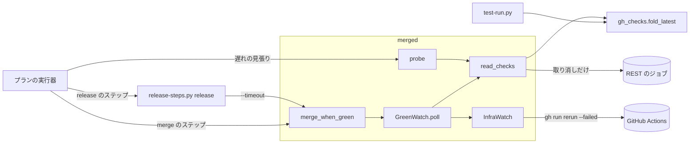
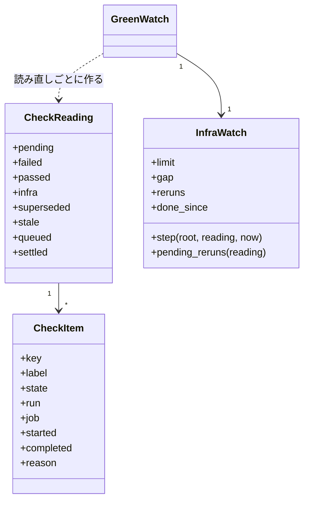
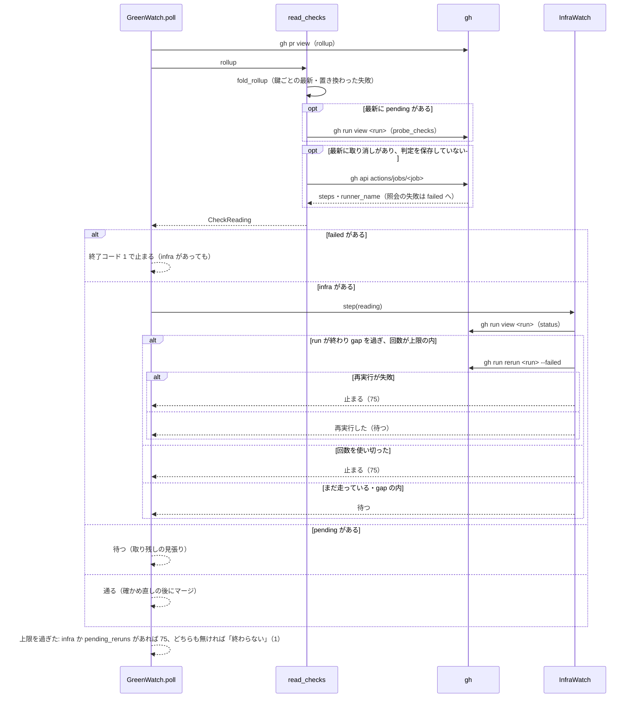
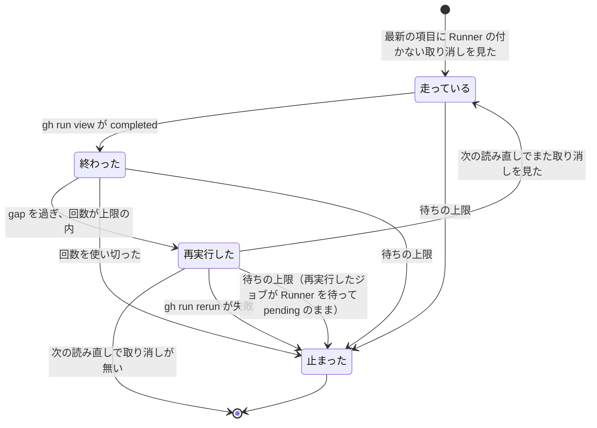
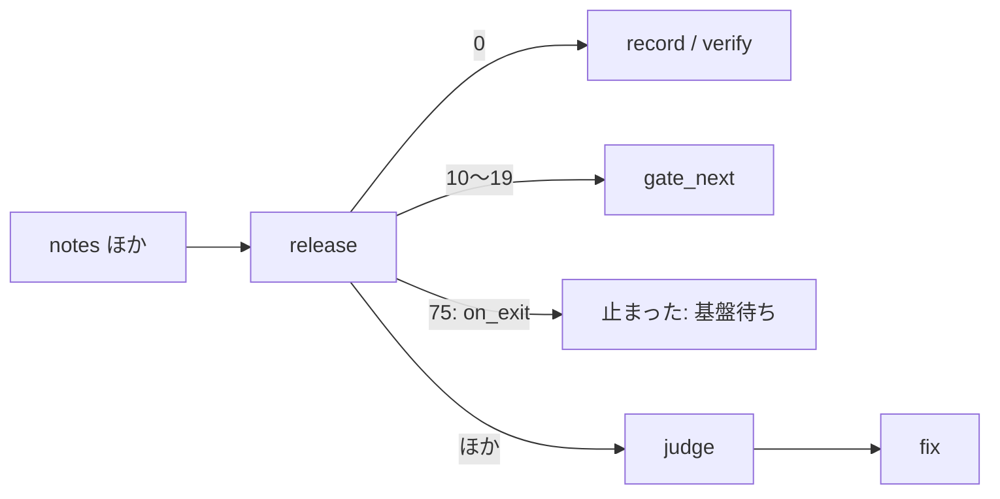

# CI の待ちの数え方: 同じチェックは最新の項目だけで数え、Runner の付かない取り消しは再実行して待ち、待ち切れなければ基盤待ち（75）で止まる

## 目的

- **同じチェックが新しい実行で通ったら、古い失敗で止まらない。** `merge-when-green` は同じチェックの最新の項目
  だけで結論を決め、古い失敗は「置き換わった失敗」として items に残す
- **GitHub Actions の基盤の都合を、PR の中身の失敗と分ける。** Runner が付かずに取り消されたジョブは、実行が
  終わるのを待って再実行し、上限まで待ち直す。待ち切れなければ終了コード 75（基盤待ち）で止まり、`release` と
  マージのプランは judge と `fix` を通らずに止まる
- **止まった結果の summary だけで、中身の失敗・基盤待ち・マージの拒否を読み分けられる。** チェックは
  `<workflowName> / <name>` で示す

例 1（置き換わった失敗）: PR 1753 の先頭のコミットに、workflow `PR body decisions` のジョブ `check` が 2 件載っていた。

| run | 引き金 | 結論 | 今の扱い |
| --- | --- | --- | --- |
| 37264758029 | push（本文の決定を揃える前） | FAILURE | 古い項目。`{"result": "superseded", "run": "37264758029"}` として items に載り、結論に数えない |
| 37264973318 | 本文の編集（`edited`） | SUCCESS | 最新の項目。このチェックの結論は成功 |

ほかのチェックが全部通っていれば、`merge-when-green 1753` はそのままマージへ進む。

例 2（基盤待ち）: リリースの PR #1765 の `Lint` / `lint` が、GitHub Actions の障害で Runner が付かず、ステップ 0 件・
Runner の名前が空のまま `cancelled` で終わった。ほかに失敗は無い。

| 経過（既定値） | `merge-when-green` の振る舞い |
| --- | --- |
| 取り消しを見た読み直し | REST でジョブを 1 回照会し、Runner が付かなかった取り消しと判定する。「CI が失敗」で止まらない |
| 実行が `completed` になってから 300 秒後 | `gh run rerun <run> --failed` を打つ（items に `infra_rerun`）。待ち直す |
| 同じ実行を 3 回打ち直しても取り消しが続く、または `--timeout` に達した | 終了コード 75・summary `#1765 の CI の基盤待ち: Runner が付かずに取り消された（Lint / lint）。再実行 3 回で解けない` |
| `release` のプラン | `release` のステップが 75 を受け、`on_exit` で judge を通らず `結果: 止まった` |

**手順と分類の読み方は Skill と既存の文書が正である。** ここに書き写さない。

| 何を | 正本 |
| --- | --- |
| `merge-when-green` と `probe` の打ち方・既存の止まり方（取り残しの再実行・ランナー待ち・`probe` の分類表） | [`merged` の SKILL.md](../../plugins/ndf/skills/merged/SKILL.md) の「マージから行うとき」 |
| `release-steps.py release` の手順と、配布のプランのステップの並び | [`release` の references/release-steps.md](../../plugins/ndf/skills/release/references/release-steps.md)・[references/form-package-plugin.md](../../plugins/ndf/skills/release/references/form-package-plugin.md) |
| プランのステップの鍵 `on_exit` の書き方と遷移の順 | [`supervise_lib/plan.py`](../../plugins/ndf/scripts/supervise_lib/plan.py) のプランの書き方の説明 |
| 共通の終了コードの表（0・1・2・3・10〜29・69）と結果 JSON の形 | [`plugins/ndf/scripts/lib/README.md`](../../plugins/ndf/scripts/lib/README.md) の終了コードの表 |
| 終了コードに `sysexits.h` の値を当てる前例（69） | [ndf-deps-missing-exit-code.md](ndf-deps-missing-exit-code.md) |

この文書が扱うのは、Skill に書かない数え方の規則・常に成り立つ条件・スクリプトの入出力の契約・終了コード 75・
決定の理由・テスト観点である。

## 用語

定義は [用語集](../glossary.md) が正である（`.ndf/glossary.json` の `document`）。この文書で使う語は
「置き換わった失敗」「基盤待ち」「Runner が付かなかった取り消し」である。用語集に無い語は次のとおり。

| 用語 | 意味 |
| --- | --- |
| 同じチェック | PR の先頭のコミットに載る `statusCheckRollup` の項目のうち、鍵が同じもの。CheckRun の鍵は `workflowName` と `name` の組、StatusContext の鍵は `context` |
| 最新の項目 | 同じチェックの項目のうち、新しさ（`lib/gh_checks.py` の `newness`）が最も大きいもの |
| 中身の失敗 | 最新の項目の失敗のうち、Runner が付かなかった取り消しに当たらないもの。ステップのある取り消しと、照会できなかった取り消しを含む |

## 対象範囲

| 扱う | 扱わない |
| --- | --- |
| `merged-steps.py merge-when-green`・`promote`（同じ待ちを使う）・`probe` のチェックの数え方 | `TIMED_OUT`・`STARTUP_FAILURE`・`ACTION_REQUIRED`・`STALE` の扱い（今のとおり失敗） |
| Runner が付かなかった取り消しの判定と、`merge-when-green` の中の再実行・待ち直し | 置き換わった失敗の自動の再実行（マージが拒まれたときに案内するだけ） |
| `release-steps.py release` の `--ci-wait` と終了コード 75 | githubstatus の参照（読まない。理由は「決定と理由」） |
| プランの run のステップの `on_exit` と、`release`・`merge`・`merge-approved` の雛形 | `test-run.py` の `checks_outcome` が名前だけで束ねること（新しさの規則だけを共有する） |
| `lib/gh_checks.py` の新しさの規則の共有 | `cross-review` の CI の見方、`sprint-close.py` のマージの待ち、`promote` のプランの行き先（`on_fail` が `handoff` で修正へ回らない） |

すべてのリポジトリとモードで働く。待ちの上限・再実行の回数と間隔は引数で受け、workflow とチェックの名前を
既定に埋め込まない。

## 背景

`merge-when-green` は、同じ名前のチェックが複数あると全部を数え、新しい実行で通った古い失敗でも「CI が失敗」で
止まっていた。本文を `pull_request` の `edited` で検査する workflow（`PR body decisions` など）が 1 度落ちた PR では、
直した後も止まり、conductor が古い実行を探して `gh run rerun` を手で打っていた。

また、`FAILURE` と同じ集合に `CANCELLED` が入っていたため、GitHub Actions の障害で Runner が付かずに取り消された
ジョブも中身の失敗と数えた。本番の配布では `release` → judge → `fix` の往復が 19 ステップ続き、直すものの無い
修正の worker に費用を使ったうえ、再開は conductor の手作業だった。

2 つは同じ関数（数え方）と同じ分岐（`GreenWatch.poll`）の問題なので、1 本の変更で扱った。

## 構成要素

| 要素 | 責務 |
| --- | --- |
| [`lib/gh_checks.py`](../../plugins/ndf/scripts/lib/gh_checks.py) | 新しさの規則 `newness` と、鍵ごとに最新の項目を選ぶ `fold_latest`（最新の並びと古い項目の並びを返す）。`fold_check_runs`（`test-run.py` が使う）は `fold_latest` を名前の鍵で呼ぶ |
| [`merged_lib/reading.py`](../../plugins/ndf/scripts/merged_lib/reading.py) | 数え方の正本。`CheckItem`・`CheckReading`・`fold_rollup`（純粋）・`read_checks`・`runner_never_came`（取り消しのジョブの照会）・`probe_checks`（pending の項目の実行とジョブの読み）・`FAIL_CONCLUSIONS` |
| [`merged_lib/checks.py`](../../plugins/ndf/scripts/merged_lib/checks.py) | `GreenWatch`（1 回の読み直し `poll` と止まり方）と `InfraWatch`（再実行と待ち直し） |
| [`merged_lib/merge.py`](../../plugins/ndf/scripts/merged_lib/merge.py) | `add_wait_args` の `--infra-reruns`・`--infra-gap`。マージが拒まれたときの置き換わった失敗の案内（`_rerun_superseded_next`） |
| [`merged-steps.py`](../../plugins/ndf/scripts/merged-steps.py) | `probe` の分類（`_classify_checks` が `read_checks` を呼ぶ）。分類 `infra` |
| [`lib/step_result.py`](../../plugins/ndf/scripts/lib/step_result.py) | `EXIT_INFRA_WAIT = 75`。`code_matches("stopped", 75)` を真にする |
| [`release-steps.py`](../../plugins/ndf/scripts/release-steps.py) | `release --ci-wait`。`wait_and_merge` が `merge-when-green` の 75 を 75 で返す |
| [`supervise_lib/engine.py`](../../plugins/ndf/scripts/supervise_lib/engine.py)・[`plan.py`](../../plugins/ndf/scripts/supervise_lib/plan.py) | run のステップの `on_exit` を読む（`_next_on_exit`）。読み込みの検査は `on_exit_error` |
| [`supervise_lib/release_templates.py`](../../plugins/ndf/scripts/supervise_lib/release_templates.py)・[`verify_steps.py`](../../plugins/ndf/scripts/supervise_lib/verify_steps.py) | `release`・`merge`・`merge-approved` のステップに `on_exit: {"75": "stop"}`（定数 `INFRA_WAIT_STOP`） |

`merge-when-green` の結果 JSON（`summary`・`items[].result`・`next`）と終了コードが公開された言語である。
`release-steps.py` とプランの実行器はその形だけを読み、`merged_lib/reading.py` の内部を知らない。

| 型 | 責務 |
| --- | --- |
| `CheckItem` | rollup の 1 件。`label` は `<workflowName> / <name>`（workflow の名前が無い CheckRun と StatusContext は名前）。`state` は `pending` / `failed` / `passed` / `cancelled`。`run` と `job` は `detailsUrl` の `/actions/runs/<run>/job/<job>` から読む（無ければ `None`）。`reason` は照会できなかった取り消しの理由 |
| `CheckReading` | 1 回の読み直しの結果。`failed` は中身の失敗、`infra` は Runner が付かなかった取り消し、`superseded` は置き換わった失敗（古い項目のうち `failed` か `cancelled`）。`stale`・`queued`・`settled` は `probe_checks` の 3 つ |
| `InfraWatch` | 1 回の `merge-when-green` の間だけ生きる。`reruns` は run ごとの再実行の回数、`done_since` は run が終わったのを見た時刻。`pending_reruns` は、再実行した run のうちその回の読み直しで pending の項目 |
| `GreenWatch` | 既存。`read_checks` の結果で分岐し、`InfraWatch` を 1 つ持つ。先頭のコミットが変わったら `InfraWatch` を作り直す（`_reset_on_new_sha`）。照会できた取り消しの判定を `seen_jobs` に保存する |

## 仕様

### 常に成り立つ条件

| # | 条件 | 破れたときの扱い |
| --- | --- | --- |
| I1 | チェックの結論は、同じチェックの最新の項目だけで決まる。古い項目の失敗は items に `superseded` として載り、結論に数えない | テストが落ちる（`test_merged_checks_fold.py`） |
| I2 | 同じチェックの鍵は、CheckRun なら `workflowName` と `name` の組、StatusContext なら `context` である。`name` だけでは束ねない | 同上 |
| I3 | 新しさは `lib/gh_checks.py` の `newness` 1 つが決め、`merge-when-green`・`promote`・`probe`・`release`（`merge-when-green` 経由）・`test-run.py` が同じものを使う。`check_states` に当たる関数を別に持たない | テストが落ちる（`test_gh_parts.py`・`test_merged_checks_fold.py`） |
| I4 | 最新の項目が取り消しで、REST のジョブのステップが 0 件かつ `runner_name` が空のときだけ、Runner が付かなかった取り消しとする。ステップが 1 件以上なら中身の失敗、照会できなければ中身の失敗で `reason: 取り消しのジョブを照会できない` を持つ | テストが落ちる |
| I5 | 最新の項目に取り消しが無ければ、ジョブの照会をしない。照会できた判定は同じ `merge-when-green` の間は job ID ごとに保存し、同じジョブを照会し直さない（再実行で新しい job ID が出たときだけ照会する） | `gh` の呼び出しを数えるテストが落ちる |
| I6 | 中身の失敗が 1 件でもある読み直しでは、再実行も待ち直しもせず終了コード 1 で止まる（基盤待ちが同時にあっても） | テストが落ちる |
| I7 | 同じ run の再実行は `--infra-reruns` 回まで。再実行はその run が `completed` になってから `--infra-gap` 秒たった後に、失敗したジョブだけを打つ（`gh run rerun <run> --failed`） | テストが落ちる |
| I8 | 基盤待ちの停止は終了コード 75 で、summary に「CI が失敗」の語を使わない。中身の失敗の停止は 1 のまま。待ちの上限に達したとき、その回の読み直しに Runner の付かない取り消しがあるか、再実行した run の項目が pending に残っていれば、基盤待ちとして 75 で止まる | テストが落ちる |
| I9 | プランの `release`・`merge`・`merge-approved` のステップは 75 で judge を通らず止まる。`release` のステップの `timeout` は、`--ci-wait` × 待つ PR の数（開発版 1・本番 2）に余裕を足した値以上である | テストが落ちる（`test_supervise_new.py`・`test_supervise.py`） |

### 新しさの規則（`newness`）

項目ごとに `(時刻が無いか, 終わった時刻と始まった時刻の新しい方, 番号, 一覧の中の順)` を作り、大きい方を新しいとする。

- 時刻がどちらも無い項目（まだ始まっていない）は最も新しい
- 時刻は ISO 8601 の UTC（`Z` 付き）を文字列で比べる
- 番号は rollup の項目では job ID、REST の check run では `id`。同じ時刻なら番号の大きい方
- 同じ新しさなら一覧で後の項目

### 1 回の読み直し

- pending の項目のうち、run が `completed` でジョブに結論があるもの（`settled`）は、その結論で数え直してから分ける
- `InfraWatch.step` は同じ run を 1 度だけ見る。`run` を持たない取り消しの項目は再実行せず、待ちの上限で 75 になる
- 回数を使い切ったと判定するのは、run が `completed` になった後である（走っている間は待つ）

### 入出力の契約

#### `merged-steps.py merge-when-green`（`promote` も同じ待ちを使う）

| 項目 | 内容 |
| --- | --- |
| 入力（待ちの引数のうち基盤待ちのもの） | `--infra-reruns <回>`（既定 3。同じ run の再実行の上限）、`--infra-gap <秒>`（既定 300。run が終わってから再実行するまでの間）。`--timeout`（既定 3600）は待ち全体の上限で、基盤待ちもこの中で待つ |
| 出力（成功） | `status: ok`・終了コード 0。items に足す: `{"kind": "check", "name": "<label>", "result": "superseded", "run": "<run>", "job": "<job>"}`（置き換わった失敗 1 件につき 1 件）、`{"kind": "check", "name": "<label>", "result": "infra_rerun", "run": "<run>", "rerun": <回目>}`（再実行 1 回につき 1 件） |
| 中身の失敗 | 終了コード 1。summary `#<PR> の CI が失敗: <label>（run <run>）, …`。items の `result: failed` は `run`・`job` を持ち、照会できなかった取り消しは `reason` を持つ。置き換わった失敗の items も添える。metrics は `failed`・`pending`・`passed`・`infra`・`waits`。`next` は `gh pr checks <PR> で失敗を読み、直して push してから打ち直す` |
| 基盤待ちの停止 | 終了コード 75。summary は `#<PR> の CI の基盤待ち: Runner が付かずに取り消された（<label>, …）。` に続けて `再実行 <N> 回で解けない` / `<timeout> 秒で解けない` / `gh run rerun <run> --failed が失敗: <stderr>` のどれか。items は `{"kind": "check", "name": "<label>", "result": "infra_wait", "run": "<run>", "job": "<job>", "reruns": <回>}`（Runner の付かない取り消しと、再実行して pending のままの項目）。metrics の `failed` は 0、`infra` は件数。`next` は `GitHub Actions の復旧の後に打ち直す: merged-steps.py merge-when-green <PR>` |
| マージの拒否 | 終了コード 1・summary `gh pr merge --admin が失敗: …`。置き換わった失敗があれば `next` を `置き換わった失敗を通し直してから打ち直す: gh run rerun <run>; …; merged-steps.py merge-when-green <PR>` にする（run は重複を除いて items の順）。無ければ `next` を持たない |
| 互換性 | 終了コード 0・1・10 の意味は変えない。summary のチェックの名前に workflow の名前が付く。summary を文字列で照合するスクリプトは無い（`release-steps.py` は写すだけ） |

#### `merged-steps.py probe`

| 項目 | 内容 |
| --- | --- |
| 分類 | 強い順に `failed`・`stale`・`stale_again`・`infra`・`settled`・`queued`・`running`・`passed`・`none`（`PROBE_CLASSES`）。`infra` の手（`metrics.action`）は `wait` |
| `infra` の summary | `Runner が付かずに取り消されたジョブがある（CI の基盤待ち）: <label>, …`。根拠の items は `result: infra_wait` |
| 置き換わった失敗 | 分類に数えず、items に `result: superseded`（`pr` 付き）で載せる。summary の名前の並びにも数えない |
| `--act` | 基盤待ちは再実行しない（再実行は `merge-when-green` が持つ）。照会の結果は保存しない（1 回で終わるため） |

#### `release-steps.py release`

| 項目 | 内容 |
| --- | --- |
| 入力（足した） | `--ci-wait <秒>`（既定 3600）。待つ PR ごとに `merge-when-green --timeout` へ渡す |
| 基盤待ちの停止 | `merge-when-green` が 75 で止まったら、終了コード 75・summary `PR #<n> をマージできない: <merge-when-green の summary>` |
| 互換性 | ほかの止まり方（0 以外で 75 でない）は今のとおり 1。先端が動いた（`head_moved`）は items で判定し、終了コードを見ない |

#### プランの run のステップの `on_exit`

書き方と遷移の順は [`supervise_lib/plan.py`](../../plugins/ndf/scripts/supervise_lib/plan.py) の説明が正である。
契約として次を保つ。

| 項目 | 内容 |
| --- | --- |
| 順序 | 終了コードを読んだら、`skip_to` の次・承認ゲートの終了コード（10〜19）の前に `on_exit` を見る。当たれば `on_fail` と judge へ行かない |
| `stop` | `結果: 止まった`・`理由: ステップ <id> が終了コード <n> で止めた: <出力の最後の JSON の summary>` |
| 検査 | 対応表でない・鍵が整数でない・行き先が `end` / `stop` / 知っているステップの id のどれでもないなら、ステップを流す前に `結果: 止まった` |
| 雛形 | `release`（`supervise.py new release`）と、`merge`・`merge-approved`（`merge_steps`）が `{"75": "stop"}` を持つ |

`release` のステップの `cmd` は `release --version <版> --ci-wait <ci_wait_timeout> --channel <チャネル>` で、`timeout` は
`max(2400（開発版）/ 3000（本番）, with_margin(待つ PR の数 × ci_wait_timeout))`。`ci_wait_timeout` はマージのプランと
同じ値（`plan_limits`。宣言のテストの戦略から出し、無ければ所要が不明のときの値 3600 秒）で、その場合の `timeout` は
開発版 3960 秒・本番 7920 秒である。

## エラー処理

| 起きたこと | 扱い |
| --- | --- |
| 取り消しのジョブの照会が失敗した・JSON が読めない | 中身の失敗として終了コード 1。items に `reason: 取り消しのジョブを照会できない`。判定は保存せず、基盤待ちへ倒さない |
| `gh run view <run>` が失敗した（`InfraWatch`） | run が終わっていないとみなして待つ。待ちの上限で 75 |
| `gh run rerun <run> --failed` が失敗した | 終了コード 75。summary の末尾が `gh run rerun <run> --failed が失敗: <stderr>` |
| 基盤待ちのまま止まった後の再開 | 復旧の後に `merge-when-green <PR>` を打ち直す。`release` のプランは `--from release` で再開する（写しは要らない） |
| 人が開始前に取り消したジョブ | ステップ 0 件・Runner の名前が空で、障害と同じ形になる。同じチェックに新しい項目があれば置き換わり、無ければ再実行され、`--infra-reruns` 回で止まる |

## 決定と理由

- **新しさは #632 の規則（終わった時刻と始まった時刻の新しい方）を `lib/gh_checks.py` に置いて共有する。**
  マージの待ちが `test-run.py` と別の規則を持つと、同じ PR の同じチェックが片方では失敗、片方では成功と読める。
  #632 の規則は、同じチェックが重なって走ったときに長く走って後に終わった失敗を残す側に倒れ、マージを誤って通さない。
  鍵は呼ぶ側が渡す（REST の check run は workflow の名前を持たないため、`test-run.py` は名前のまま）
- **Runner の付かない取り消しは、最新の取り消しのジョブだけを REST の `actions/jobs/<job>` で照会して見分ける。**
  `statusCheckRollup` はステップの数も Runner の名前も持たず、`gh run view --json jobs` は Runner の名前を持たない。
  REST は両方を 1 回で返す。人が開始前に取り消したジョブとの区別に Runner の名前が要る
- **再実行は 3 回・間隔 300 秒を既定にし、待ちは今の `--timeout` の中で行う。** #1768 の障害では Runner を待った
  ジョブが 16〜19 分で取り消された。1 回の再実行が取り消しまで 20 分前後かかるため、3 回で 1 時間前後になり、
  `--timeout` の既定 3600 秒と釣り合う。300 秒は、同じ障害の中で再実行を重ねて待ち行列を増やさないための下限である。
  基盤待ちだけ別の上限を持つと、ステップの `timeout` が 2 つの上限の和になり見積もりが読めなくなる
- **githubstatus は読まない。** github.com だけが持ち、GitHub Enterprise Server とネットワークを絞った環境では読めない。
  判断は `gh` の API だけで行い、summary の「CI の基盤待ち」と items の `infra_wait` で読む人は障害を疑える
- **基盤待ちは終了コード 75（`sysexits.h` の `EX_TEMPFAIL`、後で打ち直せば通りうる）で分ける。** プランの実行器は
  終了コードで行き先を決める。1 は中身の失敗、3 は `release` が前提の欠けに使っている。69 を `deps.py` が足した前例に倣う
- **プランに `on_exit` を足し、`release` とマージのステップは 75 で止める。** 待ち直しは `merge-when-green` の中で
  上限まで済んでいる。プランで `release` へ戻すと、実行器に往復の回数の上限が無いため長い障害の間は往復が止まらない。
  `skip_to` / `skip_code` は意味が「飛ばしてよい」なので流用しない。`promote` は `on_fail` が `handoff` で修正へ回らない
- **`release` の待ちの上限をステップの `timeout` から導く。** 待ちがステップの `timeout` より長いと、実行器が 124 で
  打ち切って `on_fail`（judge）へ回り、75 が出ない
- **置き換わった失敗は打ち直さず、マージが拒まれたときにだけ案内する。** マージは `gh pr merge --admin` で必須
  チェックの BLOCKED を迂回して通る。打ち直しは run を 1 本増やし待ちを延ばす

## テスト観点

テストは記録した `statusCheckRollup` とジョブの形を入力にし、`gh` を差し替える。障害は再現しない。

| 観点 | 主なテスト |
| --- | --- |
| PR 1753 の形（古い FAILURE と新しい SUCCESS）で 1 回の読み直しが通った扱いになり、items に run 37264758029 の `superseded` が 1 件あること | `test_merged_checks_fold.py` |
| 新しい FAILURE を古い SUCCESS で隠さないこと。長く走って後に終わった失敗を、先に終わった成功より新しいと数えること | 同上・`test_gh_parts.py` |
| `Glossary` / `check` と `PR body decisions` / `check` を別のチェックとして数えること | `test_merged_checks_fold.py` |
| マージが拒まれ置き換わった失敗があるとき、`next` に run ごとの `gh run rerun <run>` が載ること | `test_sprint_close_merge_green.py` |
| 中身の失敗の summary と items が `<workflowName> / <name>` と run の番号を持つこと | `test_merged_checks_fold.py` |
| PR #1765 の形（ステップ 0・Runner 空の取り消し）で、run が終わり gap を過ぎた読み直しで `gh run rerun <run> --failed` が 1 回打たれ、止まらずに待つこと | 同上 |
| 再実行の上限・待ちの上限・再実行の失敗で、終了コード 75、summary に「基盤待ち」があり「CI が失敗」が無いこと。上限の時点で再実行した run の項目が pending に残っていても 75 になること | 同上 |
| ステップのある取り消しと照会できない取り消しを中身の失敗で止め、再実行しないこと | 同上 |
| 基盤待ちと中身の失敗が同時にあると、再実行せず 1 で止まること | 同上 |
| 取り消しの無い PR の読み直しで `gh` の呼び出しが増えないこと。同じ取り消しのジョブを読み直しのたびに照会しないこと | 同上 |
| `probe` が置き換わった失敗を `failed` にせず、基盤待ちを `infra`・手 `wait` にすること | `test_merged_probe.py` |
| `release` の `wait_and_merge` が `--ci-wait` を `--timeout` へ渡し、75 を 75 で、ほかの失敗を 1 で返すこと | `test_release_steps.py` |
| `code_matches("stopped", 75)` が真で、`ok` と `gate` では偽であること | `test_step_result.py` |
| `on_exit` の `stop` が `on_fail` と judge を通らずに止まること。行き先がステップの id ならそこへ進むこと。誤った対応表でステップを流す前に止まること | `test_supervise.py` |
| `release` の雛形が `on_exit` の 75 → `stop` と `--ci-wait` を持ち、ステップの `timeout` が待ちの合計より長いこと | `test_supervise_new.py` |

## 関連リンク

- [`merged` の SKILL.md](../../plugins/ndf/skills/merged/SKILL.md)
- [`release` の references/release-steps.md](../../plugins/ndf/skills/release/references/release-steps.md)
- [ndf-deps-missing-exit-code.md](ndf-deps-missing-exit-code.md)（`sysexits.h` の値を終了コードに当てた前例）
- [用語集](../glossary.md)
- 由来: #1645（#1768 を取り込んだ）。実装は PR 1778
