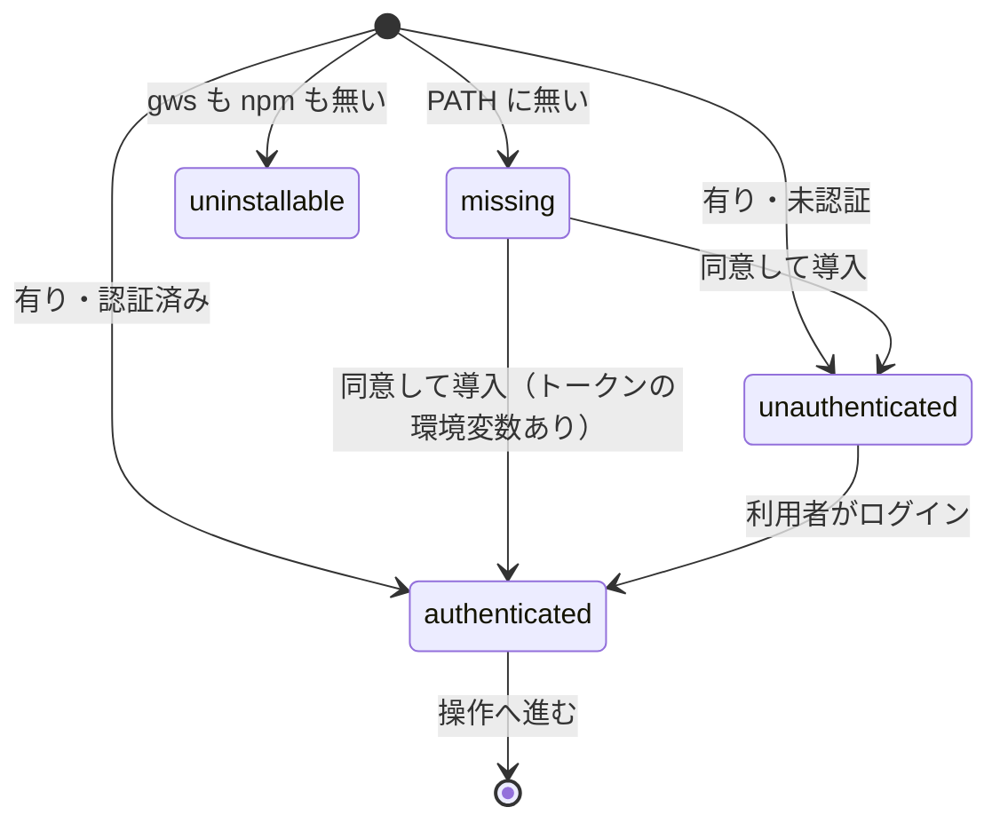

# Google Workspace の操作の gws への一本化: 確認のスクリプトが gws の有無と認証を 4 つの状態で返し、導入は同意のうえ・認証は利用者のログインだけで済み、playwright-kit は Drive への経路を持たない

## 目的

- **NDF の Google Workspace の操作は、gws の 1 つの経路と `google-workspace` の 1 つの Skill で行う。** Python の依存・
  `uv.lock`・`client_secret.json` の置き場所の案内・トークンの自前管理を NDF は持たない
- **gws の有無・導入・認証の確認は、確認のスクリプト（`gws-check.py`）が状態を返す。** LLM が持つのは導入の同意の
  判断だけである
- **playwright-kit は Google の資格情報と Drive への経路を持たない。** NDF なしで入れられるプラグインのまま、成果物は
  手元の `reports/<run-id>/` に残る

例: gws を入れていない端末で、利用者が「この Doc を取って」と頼む。

| 順 | 起きること |
| --- | --- |
| 1 | LLM が `gws-check.py` を引数なしで打つ。gws が `PATH` に無く npm はあるので、`missing`・`gate`・終了コード 10 と、承認資料のパス（取得元 `@googleworkspace/cli`・打つコマンド・入る先・戻し方）が返る |
| 2 | 依頼は「Doc を取って」で導入を含まないため、LLM は承認資料を示して明示の同意を待つ。人がいない起動（`claude -p`）なら、ここで止まる |
| 3 | 利用者が同意し、LLM が `--install` を付けて打ち直す。スクリプトが `npm install -g @googleworkspace/cli` を 1 回打ち、同じ起動の中で `gws auth status` を確かめ直して `unauthenticated`・終了コード 11 を返す |
| 4 | LLM は `gws auth login` を打たず、利用者に `! gws auth login` を頼む。終えたと伝えられたら引数なしで打ち直し、`authenticated`・終了コード 0 を得る |
| 5 | LLM が Skill の対応表のエクスポートを打つ。終了コードが 0 でなければ、gws の出力を示して止まる |

**手順と操作の対応表は Skill が正である。** ここに書き写さない。

| 何を | 正本 |
| --- | --- |
| 3 段の流れ（確かめる → 同意のうえ入れる → 認証を案内する）と、終了コードごとの次の手 | [`google-workspace` の SKILL.md](../../plugins/ndf/skills/google-workspace/SKILL.md) の「流れ」 |
| 同意の取り方（明示の依頼を同意とみなす・暗黙の依頼では待つ・人がいない起動で止まる） | 同上の「流れ」の 2. |
| Drive の操作の対応表（エクスポート・ダウンロード・アップロード・フォルダの共有範囲の確認・公開リンクの付与）と、エクスポートの MIME | 同上の「操作の対応表」 |
| Drive の素材の取り込みと PDF の取得の経路 | `document-systems` の [`references/system-gdrive.md`](../../plugins/ndf/skills/document-systems/references/system-gdrive.md) |
| playwright-kit の利用者向けの移行の案内 | [`plugins/playwright-kit/README.md`](../../plugins/playwright-kit/README.md) と根の `CHANGELOG.md` の playwright-kit 3.0.0 |

この文書が扱うのは、Skill に書かない確認のスクリプトの契約（失敗の形を含む）、常に成り立つ条件、消えた約束、
決定の理由、テスト観点である。

## 用語

定義は [用語集](../glossary.md) が正である（`.ndf/glossary.json` の `document`）。この文書で使う語は「gws」
「gws の状態」である。

## 対象範囲

| 扱う | 扱わない |
| --- | --- |
| `google-workspace` の Skill と確認のスクリプト `gws-check.py` | gws の Drive 以外の操作の手順（Sheets の編集・Gmail・Calendar など。Skill は `gws <サービス> --help` を案内するだけ） |
| `google-auth` と `google-drive` を配布から外したこと（manifests 4 つ・`plugin.json` 2 つ・Skill 間の参照の例外） | playwright-kit の Drive 連携を gws へ移すこと（#745 は not planned） |
| `document-systems` と `document-sources` の Drive の経路を gws へ向けたこと | gws の版の固定と、gws の不具合の回避策 |
| playwright-kit から Drive への保管を外したこと | 旧 Skill のトークンを gws へ移すこと（利用者は `gws auth login` で認証し直す） |

## 背景

Google Workspace の操作は `google-auth`（OAuth2 のトークンを NDF が作って置く）と `google-drive`（Python の Drive API の
`gdrive_fetch.py`）の 2 つの Skill にまたがり、Python の依存と `uv.lock` が 2 つ、`client_secret.json` の置き場所の案内が
要った。playwright-kit も `google-auth` の資格情報を Python から import していた。gws 0.22.5 で Doc を `text/plain` と
`application/pdf` でエクスポートでき（2026-09-18 実測）、`gdrive_fetch.py` の 3 操作（エクスポート・ダウンロード・
アップロード）はすべて gws で置き換えられる。

旧 Skill は予備の経路として残さない。gws は Google の公式サポート外の CLI で版も 0.x だが、経路を 2 つ持つと手順と
検査が倍になる。

## 仕様

### 集約

| 集約 | 持ち主（書き換えてよいもの） | 根 | 値オブジェクト |
| --- | --- | --- | --- |
| gws の確認の結果 | `plugins/ndf/skills/google-workspace/scripts/gws-check.py` | 確認の結果 | gws の状態・次の手・導入の承認資料のパス |
| 配る Skill の一覧 | `plugins/ndf/manifests/*-skills.txt`（4 つ）と、それに合わせる 2 つの `plugin.json` | 各ランタイムの一覧 | Skill の名前 |
| playwright-kit の成果物の扱い | playwright-kit の pytest プラグインと Skill | 実行 1 回の成果物の置き場所（`reports/<run-id>/`） | — |

**利用者の環境の gws（導入・資格情報）と Drive のファイルは、NDF の集約にしない。** 持ち主は利用者と gws で、NDF は
利用者の依頼か同意があるときに gws を通して触るだけである。gws に対して NDF は順応者で、`gws auth status` の JSON を
翻訳の層を置かずに読む。

### 常に成り立つ条件

| # | 条件 | 破れたときの扱い |
| --- | --- | --- |
| I1 | `gws-check.py` は、同意の印（`--install`）を受け取らない限り `npm install -g` を起動しない | 起動の経路を持たない。テストが落とす |
| I2 | `gws-check.py` は、どの引数でも gws の副命令を `auth status` 以外起動しない（`auth login` / `setup` / `export` / `logout` を呼ばない。`export` は資格情報を復号して出力する） | 同上 |
| I3 | gws の状態は `authenticated` / `missing` / `unauthenticated` / `uninstallable` のどれか 1 つで、状態ごとに `status` と終了コードが 1 つに決まる | 状態を決められないときは 4 つのどれにもせず、`stopped` と終了コード 2 で返す |
| I4 | 結果へ写す gws の出力は `credential_source`・`auth_method`・`client_config_exists` の 3 つだけで、資格情報のファイルを開かない | 他のキーの値が結果に現れたらテストが落とす |
| I5 | `uninstallable` と導入の失敗は 0 以外の終了コードで終わる | 0 で終わったらテストが落とす |
| I6 | 4 つの manifest に `google-workspace` が 1 行ずつあり、`google-auth` と `google-drive` が無い。2 つの `plugin.json` の列挙も同じ | 配布の検査が落とす |
| I7 | playwright-kit は `--pwk-drive-folder` を受けず、Google の API の包みを依存に持たない | 渡した実行は pytest が未知の引数として止める |
| I8 | アップロードの既定は非公開で、公開リンクは利用者が公開を明示したときだけ付ける | Skill の手順が持つ。スクリプトは Drive を操作しない |

### 確認のスクリプト `gws-check.py`

| 項目 | 内容 |
| --- | --- |
| 呼び出し | `python3 "<Skill のディレクトリ>/scripts/gws-check.py" [--install]`。ほかの引数は argparse が拒む |
| `--install` | 利用者が導入に同意した印。gws が無ければ `npm install -g @googleworkspace/cli` を 1 回打ち、同じ起動の中で確かめ直す。gws が既にあれば何もしない |
| 出力 | 標準出力へ `step_result` の形の 1 行の JSON（`tool` は `google-workspace`）。`metrics.state` に gws の状態、gws があるときは `metrics` に I4 の 3 キー、`next` に次の手 |
| 結果の部品 | `plugins/ndf/scripts/lib/step_result.py`（結果の形・終了コードの範囲・承認資料の書き出し）をプラグインの根から読む |

**状態と結果の対応**:

| gws の状態 | 条件 | `status` | 終了コード |
| --- | --- | --- | --- |
| `authenticated` | gws が `PATH` にあり、`credential_source` が `none` でない | `ok` | 0 |
| `missing` | gws が `PATH` に無く、npm がある（`--install` なし）。`presentation_path` に導入の承認資料 | `gate` | 10 |
| `unauthenticated` | gws があり、`credential_source` が `none`。`client_config_exists` が偽なら `next` が `gws auth setup` か OAuth クライアントの用意を先に案内する | `gate` | 11 |
| `uninstallable` | gws も npm も `PATH` に無い | `stopped` | 3 |

**失敗の形**（どの状態にもしない）:

| 事象 | `status` | 終了コード | 出力 |
| --- | --- | --- | --- |
| `gws auth status` が起動できない・0 以外で終わる・JSON でない・3 キーのどれかが無い | `stopped` | 2 | `summary` に理由、`items` に gws の標準エラーの末尾 |
| `--install` の `npm install -g` が起動できない・0 以外で終わる（権限の不足を含む） | `stopped` | 1 | `items` に npm の出力の末尾。`next` は `sudo` で打ち直さないと示す |
| `--install` で入れた後も gws が `PATH` に無い | `stopped` | 1 | `next` が `npm prefix -g` の `bin` を `PATH` へ足すよう案内する |

**導入の承認資料**（`missing` のとき `approval_present` が書く）は、対象を npm の `@googleworkspace/cli` のページ、
変更量を「npm の全体インストール 1 件」とし、取得元・打つコマンド・入る先（`npm prefix -g` の値。読めなければその旨）・
「Google の公式サポート外で版は 0.x」と、戻し方 `npm uninstall -g @googleworkspace/cli` を載せる。

### gws の状態の遷移

描かない遷移は起こらない。`uninstallable` から先へは、利用者が npm を入れて打ち直すまで進まない。`missing` から
`authenticated` へ進むのは `GOOGLE_WORKSPACE_CLI_TOKEN` が渡されている環境だけである。同意を断ったとき・人が
いないときは `missing` のまま止まり、gws の無い代わりの経路は持たない。

### 境界をまたぐもの

すべて利用者の端末で、エージェントと同じ権限で動く（`sudo` を使わない）。スクリプトから gws へ渡るのは
`auth status` の起動だけで、返るのは状態の JSON である。資格情報は gws と gws の設定ディレクトリの間でだけ動き、
NDF のスクリプトを通らない。

### 消えた約束

互換の経路は持たない。

| 約束 | 代わり |
| --- | --- |
| `/ndf:google-auth`・`/ndf:google-drive` と `gdrive_fetch.py` の引数、`google-auth` の Drive 以外のスコープの略記 | `/ndf:google-workspace` と Skill の対応表 |
| playwright-kit の `--pwk-drive-folder` | 無し。渡すと pytest が未知の引数として止める |
| playwright-kit の `scripts/upload_evidence.py`・`gdrive_upload_dir.py`・`build_gdoc_with_drive_links.py`・`upload_md_as_gdoc.py`・`_drive_auth.py` と `playwright_kit.uploaders` | 無し。Drive へ上げたいときは `gws drive +upload` を手で使う |
| playwright-kit の `drive` の extra | 無し。`--extra drive` を渡す環境の作り直しは失敗する |

playwright-kit の Skill の名前は変えない。`playwright-evidence` は報告書の作成だけを持ち、trace・動画・スクリーンショットは
`reports/<run-id>/` のパスで添える。動画を mp4 にする理由の「Drive のプレイヤと互換」の説明（`video.py`・`config.py`・
`templates/scenario.config.yaml`・`pyproject.toml`・`templates/pyproject.toml.runtime`）は符号化の理由であり、保管の
案内ではないので残る。

## 決定の理由

| 決定 | 理由 |
| --- | --- |
| `missing` と `unauthenticated` を別の承認ゲートの終了コード（10 と 11）にし、`uninstallable` は「前提が無い」の 3 にする | 読み手は `status` で「人が要る」と知り、終了コードで「何を頼むか」を知る。npm が無い場面は同意では解けない |
| 認証済みの判定は `credential_source` で行う | `GOOGLE_WORKSPACE_CLI_TOKEN` を渡しても `auth_method` は `none` のままだった（gws 0.22.5 実測）。`auth_method` で判定すると環境変数のトークンで動く CI を未認証と誤る。トークンの有効性は確かめない（確認のたびに利用者の Drive を読むことになる）。無効なら操作のコマンドが失敗して分かる |
| 導入は `--install` の起動だけにし、人がいない起動では止める | 利用者の環境を同意なしに書き換えない（C6）。スクリプトが対話で尋ねる形は、エージェント経由の起動に標準入力が無く働かない。`pace: fast` / `auto` でも同意は省かない |
| 確認のスクリプトは Skill の `scripts/` に置き、結果の形は `step_result` を使う | 呼ぶのはこの Skill だけで、配布の単位も Skill である。結果の形と承認資料の書き出しは `step_result` が既に持つ |
| 導入後に gws が `PATH` に無いときは案内して止まる。`npm install -g` の失敗を `sudo` で打ち直さない | 利用者のシェルの設定を書き換えない。`bin` を直接起動しても次の操作のコマンドで見つからず、手順が途中で止まる |
| OAuth クライアントが無い未認証は `unauthenticated` に含め、`next` で `gws auth setup` を先に案内する | 利用者に頼むことは同じで、5 つ目の状態は LLM の分岐を増やすだけである |
| `--pwk-drive-folder` は受けて無視せずに消す | 警告を読まない CI で、成果物が上がったと誤解されたまま残る。消せば最初の起動で止まり、利用者が気づく |
| playwright-kit から NDF の Skill を前提にしない | playwright-kit は NDF なしで入れられる。README の移行の案内で `gws drive +upload` を紹介するだけにする |

## テスト観点

確認のスクリプトは gws と npm をスタブに置き換えた単体テスト（`plugins/ndf/skills/google-workspace/tests/test_gws_check.py`）で
担保する。gws との実際の通信とブラウザでの認証は、リリース後テストで利用者の環境で確かめる。

| 観点 | 満たすこと |
| --- | --- |
| 状態ごとの結果（I3） | gws が無い・未認証・`credential_source` が `token_env_var` の各場合に、`metrics.state`・`status`・終了コードが契約の表どおりであること。判定を `auth_method` に変えると `token_env_var` の場合が落ちること |
| 状態を決められない（I3） | JSON でない出力・0 以外の終了コード・キーの欠けた JSON で `stopped` と 2 になり、`unauthenticated` に倒れないこと |
| 同意なしに入れない（I1） | `--install` なしで gws が無いとき、スタブの npm が 1 度も呼ばれず、`missing` と承認資料のパスが返ること |
| 同意したときの導入（I1） | `--install` で npm が `install -g @googleworkspace/cli` で 1 度だけ呼ばれ、入った gws で確かめ直した状態を返すこと。gws が既にあれば何もしないこと。npm が失敗すれば、また入った後も gws が見つからなければ `stopped` と 1 になること |
| login を呼ばない（I2） | すべての引数の組と状態で、スタブの gws に記録された引数が `auth status` だけであること |
| 資格情報を写さない（I4） | gws の JSON に余分のキーを混ぜても、結果にその値が現れないこと |
| npm が無い（I5） | `uninstallable`・`stopped`・終了コード 3 になること |
| 旧名が残らない | `git grep -E "google-auth\|google-drive\|gdrive_fetch\|google_auth"` が履歴の文書（`CHANGELOG.md`・`docs/development-history/`・`issues/`・`docs/ndf-version-decisions*.md`）と `plugins/ndf/scripts/tests/fixtures/wait_notice_corpus.json` の外で 0 件であること |
| playwright-kit（I7） | `pytest --help` に `--pwk-drive-folder` が無く、渡すと未知の引数で止まること（`test_pytest_plugin_bootstrap.py`）。`git grep -niE "drive" plugins/playwright-kit` の残りが mp4 の理由の説明と移行の案内だけであること |
| 配る Skill の一覧（I6） | manifests 4 つに `google-workspace` が 1 行ずつあり、2 つの `plugin.json` と食い違わないこと |
| 手動（I8 を含む） | gws の無い環境から導入・認証・Doc のエクスポートまで通ること。対応表の操作を打ち、フォルダを指定しないアップロードの直後のファイルが非公開であること |

## 関連リンク

- [`google-workspace` の SKILL.md](../../plugins/ndf/skills/google-workspace/SKILL.md)
- [`gws-check.py`](../../plugins/ndf/skills/google-workspace/scripts/gws-check.py)
- [`step_result` を含む共通の部品の表](../../plugins/ndf/scripts/lib/README.md)
- [`document-systems` の Google Drive の手順](../../plugins/ndf/skills/document-systems/references/system-gdrive.md)
- [ビジネス文書のワークフロー（`documentation` モード）](ndf-documentation-mode.md)
- 課題 [#744](https://github.com/devbasex/ai-plugins/issues/744)
