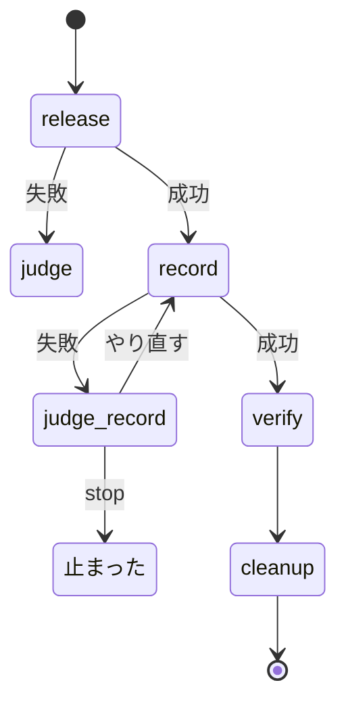

# 本番のリリースプランが書くリリース記録: 本番の配布の後に本番のリリースの PR へ記録を残し、まとめの close がそれを読んで閉じる条件 1 を判定する

## 目的

- **スクリプトで組む本番のリリースプラン（`release.form: package-plugin`）は、本番の配布の後に本番のリリースの
  Pull Request（`release/v<版>` → ベースブランチ）へリリース記録（`## 配布の記録`）をコメントで 1 件書く。**
- **書けた本番のリリースの PR は、プランの報告の `Pull Request` に載る。** まとめの `close` ステップは
  `{queue_pr:release-prod}` からその PR を `--record-pr` に受け取り、`sprint-close.py` が記録から閉じる条件 1 を判定する
- **記録の書き込みが落ちても、本番の配布はやり直さない。** やり直せるのは記録を書くステップだけである

例: 版 `10.17.30`（本番のリリースの PR は #1268。記録が無く、課題を手で閉じた版である）を今のプランで出したとき。
直前の正式版は `10.17.29`。スプリントの PR は実際には 13 本あるが、説明のため #1260 と #1262 の 2 本に絞る。

| 順 | 起きること |
| --- | --- |
| 1 | `release` ステップ（`release-steps.py release --channel prod`）が本番チャネルへのマージ・タグ `ndf--v10.17.30`・GitHub Release を作る |
| 2 | `record` ステップが `release-steps.py record --version 10.17.30 --prs 1260 1262` を打つ。タグと GitHub Release とマージ済みの `release/v10.17.30` の PR を確かめ、その PR（#1268）へ下の記録をコメントで書く |
| 3 | 結果 JSON の `metrics.release_pr_url` を、プランの `pr_from` がプランの `Pull Request` へ移す |
| 4 | `verify` → `cleanup` を経て、報告に `- Pull Request: <本番のリリースの PR の URL>` が残る |
| 5 | まとめの `close` ステップの `--record-pr` が、その PR の番号で埋まる。`sprint-close.py` が最後の記録の `段階: 本番` を読み、閉じる条件 1 を満たす |

```markdown
## 配布の記録

段階: 本番（承認ゲート 2 の承認の後、2026-09-26 19:56 に ndf--v10.17.30 を出した）
版: 10.17.29 → 10.17.30（タグ ndf--v10.17.30。直前はタグ ndf--v10.17.29）
スプリント: PR #1260 / #1262
```

**記録の形・スプリントを閉じる手順・閉じる条件は Skill が正である。** ここに書き写さない。

| 何を | 正本 |
| --- | --- |
| リリース記録の形（見出しと 3 行）・置く側・置き場所 | [`progress-tracking` の SKILL.md](../../plugins/ndf/skills/progress-tracking/SKILL.md) の「配布の記録」 |
| スプリントを閉じる手順と閉じる条件（条件 1 = `段階:` が `本番` か `配布なし`、条件 2 = リリース後テスト） | 同上の「スプリントを閉じる」「閉じる条件」。決定の理由は [ndf-cleanup-and-bundle-closing.md](ndf-cleanup-and-bundle-closing.md) |
| 本番のリリースプランのステップの並び（`release` → `record` → `verify` → `cleanup`）と `judge-record` | `release` の [`references/form-package-plugin.md`](../../plugins/ndf/skills/release/references/form-package-plugin.md) |
| 手で `/ndf:release` を通す経路の記録の書き方 | [`release` の SKILL.md](../../plugins/ndf/skills/release/SKILL.md) の「配布の記録」 |
| プランのステップの鍵 `pr_from` の書き方 | [`supervise_lib/plan.py`](../../plugins/ndf/scripts/supervise_lib/plan.py) のプランの書き方の説明 |
| `dist_record.py` の位置づけと呼び手 | [`plugins/ndf/scripts/lib/README.md`](../../plugins/ndf/scripts/lib/README.md) |

この文書が扱うのは、Skill に書かない `release-steps.py record` の契約、常に成り立つ条件、`pr_from` の振る舞い、
決定の理由、テスト観点である。

## 用語

定義は [用語集](../glossary.md) が正である（`.ndf/glossary.json` の `document`）。この文書で使う語は
「リリース記録」「リリースプラン」「スプリント課題」である。

## 対象範囲

| 扱う | 扱わない |
| --- | --- |
| `supervise.py new release --channel prod` が `package-plugin` から組む本番のリリースプランと、それを使うスプリントのまとめ（配布先のリポジトリでも、同じ宣言を置けば働く） | 開発版のリリースプラン（`段階: 検証` の記録は書かない。`close` ステップは本番のリリースの PR しか読まない） |
| `release-steps.py record`・`lib/dist_record.py`・`release_lib/record.py`・ステップの鍵 `pr_from` | リリース後テストのブロック（`## リリース後テスト`）の書き手（#1683）。本番のリリースプランはこれを書かない |
| | 雛形で組まない経路（昇格のプラン・手で届ける経路・`--record-pr 0`）の記録 |
| | `sprint-close.py` の引数・結果 JSON・閉じる条件（変えていない） |

プラグイン名・ベースブランチ・本番チャネルは `.ndf/supervise.json` の `release.plugin` と `.ndf/worktree.json` から
読む。この仕様のための設定は無い。`pace` によらず、本番のステージを通るすべてのモードで働く。

## 背景

本番のリリースプランは記録を書かず、報告に Pull Request も残さなかった。そのため `{queue_pr:release-prod}` は `0` に
置き換わり、`sprint-close.py` は `--record-pr 0` のとき閉じる条件を見ない。手で打つ `/ndf:release` は記録を書くが、
スクリプトで組んだプランには書き手が無く、conductor が `gh issue close` を手で打っていた（10.17.29・10.17.30・
10.17.55・10.17.57）。書き手を足すだけでは足りず、まとめが記録の PR を受け取れるところまでがこの仕様に含まれる。

`--with-verification` 付きの `close` ステップは、リリース後テストのブロックが無いため、課題を「本番の版のリリース後
テストの記録が無い」で `kept_open` にする。`kept_open` の理由が「配布の記録が読めない」でなくなることが、この仕様の
働いた印である（課題を閉じるまでは #1683 が扱う）。

## 仕様

### 構成要素と責務

| 要素 | 責務 |
| --- | --- |
| [`lib/dist_record.py`](../../plugins/ndf/scripts/lib/dist_record.py) | リリース記録の見出しと行の名前（`DIST`・`STAGE`・`VERSION`・`SPRINT` ほか）を 1 か所に持ち、組む（`format_record`）と読む（`parse_record`）を提供する |
| [`release_lib/record.py`](../../plugins/ndf/scripts/release_lib/record.py) | タグの作成時刻（JST）・PR の本文とコメントの読み取り・同じ記録の有無の判定（`exists`）・コメントの投稿（`post_comment`）。結果を出す（emit）のは呼び手 |
| [`release-steps.py`](../../plugins/ndf/scripts/release-steps.py) の `record` | 前提を確かめ、記録を組んで投稿し、PR の番号と URL を結果に出す |
| [`supervise_lib/release_templates.py`](../../plugins/ndf/scripts/supervise_lib/release_templates.py) | 本番のプランにだけ `record`（`pr_from: release_pr_url`）と `judge-record` を組む |
| [`supervise_lib/engine.py`](../../plugins/ndf/scripts/supervise_lib/engine.py) の `take_pr` | run のステップの `pr_from` を読み、プランの `Pull Request` を埋める |
| [`sprint-close.py`](../../plugins/ndf/scripts/sprint-close.py) | `parse_record` を `lib/dist_record.py` から同じ名前で import する。読み方は変わらない |

リリース記録の形は、配布が書き進捗記録が読む公開された言語で、形の正本は `progress-tracking` の「配布の記録」の表
1 か所である。コードの側の形は `lib/dist_record.py` 1 か所が持ち、書く側と読む側が同じ定数を使う。

### 集約

| 集約 | 持ち主（書き換えてよいもの） | 根 | 値オブジェクト |
| --- | --- | --- | --- |
| 本番のリリース | `release-steps.py release`（本番の配布）と `release-steps.py record`（記録） | 本番のリリースの PR | 版（直前の正式版・出した版）・タグ・スプリントの PR の並び |
| リリースプランの実行 | supervise の `Engine` | プラン（エンティティはステップ） | 報告の Pull Request |
| スプリントのまとめ | `sprint-close.py` | 記録の PR（エンティティは課題） | 閉じる条件の判定 |

### 常に成り立つ条件

| # | 条件 | 破れそうなときの扱い |
| --- | --- | --- |
| I1 | リリース記録は本番の配布の後にだけ書く。配布の完了は「タグ `<plugin>--v<版>` が origin にある」と「同じタグの GitHub Release がある」の両方で判定する | `record` は投稿せずに終了コード 3 で止まる |
| I2 | 書いた記録を `parse_record` で読むと、`found` が真・`stage` が `本番` で始まり・`version` が出した版（`v` なし）・`sprint_prs` が `--prs` の並びになる | 書く側と読む側が同じモジュールの定数を使う。食い違えば契約のテストが落ちる |
| I3 | 同じ版・同じスプリントの PR の本番の記録は、PR に 2 件以上増えない | `record` は投稿の前に PR の最後の記録を読み、同じなら投稿せずに `exists` を返す |
| I4 | 記録を書くステップの失敗から、本番の配布へ戻る経路は無い | `record` の失敗は `judge-record` へ回り、選べるのは `record` と `stop` だけ。共有の `judge` の `choices` に `record` は無い |
| I5 | 記録を書けた本番のリリースプランの報告は、本番のリリースの PR を `Pull Request` に持つ | `metrics.release_pr_url` が空・終了コードが 0 でないなら `Pull Request` を書き換えない（報告は `無し` のまま、まとめは `0`） |
| I6 | 開発版のリリースプランは `record` と `judge-record` を持たない | 雛形の開発版の分岐で組まない（`release` の `next` は `verify`） |

### `release-steps.py record`

```text
python3 release-steps.py record --version <版> --prs <PR番号>... [--plugin <名前>] [--root <dir>]
```

ブランチとプラグイン名は `release` と同じく `release_decl` が宣言から読む。

| 項目 | 内容 |
| --- | --- |
| 前提（この順に確かめる） | タグ `<plugin>--v<版>` が origin にある（`git ls-remote --exit-code --tags`）。同じタグの GitHub Release がある（`gh release view <タグ>` が 0）。`release/v<版>` → ベースブランチの PR が MERGED で見つかる |
| 書くもの | その PR へコメント 1 件（`gh pr comment <番号> --body-file <一時ファイル>`）。`--repo` を渡さず、作業場所のリポジトリへ書く |
| 書かないとき | PR の本文とコメントを投稿の順に並べた最後の記録が、`stage` が `本番` で始まり `version` と `sprint_prs` が同じとき |
| 結果 JSON | `lib/step_result.py` の形。`items` は `{kind: "comment", name: "#<番号>", result: "posted" / "exists"}`。`metrics` は `release_pr`・`release_pr_url`・`version`・`prev_version`・`sprint_prs` |
| 終了コード | 0 = 書いた・既にある / 1 = 投稿が失敗した（`gh pr comment` が非 0） / 2 = PR を読めない（`gh pr view` の失敗か出力が JSON でない） / 3 = 前提が無い |

記録の本文の値:

| 行 | 値 |
| --- | --- |
| `段階:` | `本番（承認ゲート 2 の承認の後、<タグの作成時刻 JST> に <タグ> を出した）`。時刻は注釈付きタグなら作成時刻、軽量タグならコミットの時刻で、読めなければ時刻を省く |
| `版:` | `<直前の正式版> → <出した版>（タグ <タグ>。直前はタグ <直前のタグ>）`。直前の正式版は `release_tag_before` が返す前のタグから `<plugin>--v` を外した版で、無ければ `なし`（注記は「直前の正式版のタグは無い」） |
| `スプリント:` | `PR #<番号> / #<番号>`。`--prs` を受けた順に並べる |

括弧の中は `parse_record` が読まない注記である。

### プランのステップの鍵 `pr_from`

run のステップが終了コード 0 で終わり、出力の最後の JSON の `metrics.<鍵>` が空でなければ、プランの
`Pull Request` をその値にする。終了コードが 0 でない・鍵が無いなら書き換えない。値は URL を渡す
（本番のリリースプランでは `release_pr_url`）。途中から再開したときに前の報告から Pull Request を戻す処理
（`Engine._restore_pr`）が、URL の形（`/pull/<番号>`）だけを読むためである。

### `record` が落ちたとき



`judge_record` から `release` へ戻る遷移は無い。conductor が後から `run <プラン> --from record` で打ち直しても、
`release` は走らない。MVV 判定つきの本番（`pace: fast` / `auto`）は先頭に `mvv` と `note` が入るだけで、`record` の
位置は同じである。

## 決定の理由

| 決定 | 理由 |
| --- | --- |
| 記録は `release` の続きでなく別のステップにし、失敗は専用の `judge-record`（`record` か `stop`）へ回す | `release` の続きに書くと、記録だけが落ちたときのやり直しが `release` 全体になり、タグの重複で止まる。共有の `judge` は `fix` を選べ、`fix` の後は `release` へ戻る。記録の失敗は GitHub の揺れか権限で、直すコードが無い |
| `record` を `verify` の前（`release` の直後）に置く | `verify` の後に置くと、導入の確かめが落ちて止まったときに、配布は済んだのに記録が無く閉じる条件 1 を満たせない |
| 前提にタグだけでなく GitHub Release も確かめる | `release` はタグを送った後に `gh release create` を打ち、そこで落ち得る。タグだけを見ると、Release の無いまま `--from record` で打ったときに `段階: 本番` を書き、閉じる条件 1 を通してしまう |
| まとめへ PR を渡すのに、run のステップの汎用の鍵 `pr_from` を使う | queue とまとめの側を変えずに済み、ほかの run のステップも同じ形で使える。`sprint.py` が `gh pr list --head release/v<版>` で引く案は PR を決める規則が 2 か所になり、`queue.py` が `release_pr` を探す案は queue に配布の知識が入る |
| 記録の組み方と読み方を `lib/dist_record.py` へ置き、`sprint-close.py` は同じ名前で import する | 書く側が見出しと行の名前を別に持つと、片方を変えたときに `parse_record` が `found` を偽にしても気づけない。`sprint-close.py` がタグと queue の done から値を組む案は、契約の正本が 2 つになるため採らない |
| `段階:` の括弧には承認の時点でなく配布の事実（タグの作成時刻とタグ）を書く | `record` は承認の時刻を持たない。プランは承認ゲート 2 の後にしか走らないため「承認ゲート 2 の承認の後」と書き、読み手が承認と配布の順を読める。括弧は注記で、形は変えていない |
| 直前の正式版は bump の前の `plugin.json` でなく前のタグから取る | マージ後の作業場所には bump の前の値が残らない。前のタグは `approval-facts` と `changed-plugins` が使う規則（`release_tag_before`）と同じである |
| 承認の前には記録を書かない | 配布が止まったときに `段階: 本番` が事実と食い違う（#837 と同じ形の食い違いを作らない） |

## テスト観点

偽の `gh` を使う単体テストで担保する。`record` と `sprint-close.py` の契約は
[`test_release_record.py`](../../plugins/ndf/scripts/tests/test_release_record.py)、プランの並びは
[`test_supervise_new.py`](../../plugins/ndf/scripts/tests/test_supervise_new.py)、`pr_from` は
[`test_supervise.py`](../../plugins/ndf/scripts/tests/test_supervise.py) にある。実際の本番の PR へのコメントと
まとめの結果は、本番のリリースプランを通すスプリントのリリース後テストで確かめる。

| 観点 | 満たすこと |
| --- | --- |
| プランの並び（I6・I4） | 本番の `new release` のプランが `release` → `record` → `verify` の順で、`record` が `pr_from: release_pr_url` と `on_fail: judge-record` を持つこと。`judge-record` の `choices` が `record` と `stop` だけで、共有の `judge` が `record` を選べないこと。開発版のプランに `record` と `judge-record` が無いこと |
| 書く側と読む側の契約（I2） | `format_record` の出力を `parse_record` に通すと、`found`・`stage`・`version`（`v` なし）・`sprint_prs` が期待どおりになること |
| 配布の後にだけ書く（I1） | タグと GitHub Release があるとき本番のリリースの PR へコメントが 1 件投稿されること。タグが無い、またはタグはあり GitHub Release が無いとき、投稿せず 3 で終わること |
| 重ねて書かない（I3） | 同じ PR に 2 度打っても投稿は 1 件で、2 度目は `exists` になること |
| 投稿の失敗（I4） | `gh pr comment` が非 0 なら 1・`stopped` で終わること |
| 報告の Pull Request（I5） | `pr_from` の run のステップが 0 で終わると報告の `Pull Request` が `metrics` の URL になり、落ちたとき・鍵が無いときは `無し` のままであること |
| まとめが閉じる（条件 1） | `record` が書いた記録を持つ PR を `--record-pr` に渡し、`--with-verification` なしの `sprint-close.py --dry-run` で `--issues` の OPEN の課題が `would_close` になること |
| 退行しない | `test_sprint_close_issues.py`・`test_sprint_close_merge_green.py`・`test_legacy_names.py` と、リリースプランの既存のテストが通ること |
| 手動 | 本番のリリースプランを通したスプリントで、本番のリリースの PR に `## 配布の記録` のコメントが付き、まとめの `close` ステップの `kept_open` の理由が「配布の記録が読めない」でないこと |

## 関連リンク

- [`progress-tracking` の SKILL.md](../../plugins/ndf/skills/progress-tracking/SKILL.md)（「スプリントを閉じる」「配布の記録」）
- [`release` の `references/form-package-plugin.md`](../../plugins/ndf/skills/release/references/form-package-plugin.md)
- [後片付けを止めずに通し、スプリント課題を最終工程で閉じる](ndf-cleanup-and-bundle-closing.md)
- [`lib/dist_record.py`](../../plugins/ndf/scripts/lib/dist_record.py) / [`release_lib/record.py`](../../plugins/ndf/scripts/release_lib/record.py) / [`release-steps.py`](../../plugins/ndf/scripts/release-steps.py)
- 課題 [#1273](https://github.com/devbasex/ai-plugins/issues/1273)・リリース後テストの書き手は [#1683](https://github.com/devbasex/ai-plugins/issues/1683)
