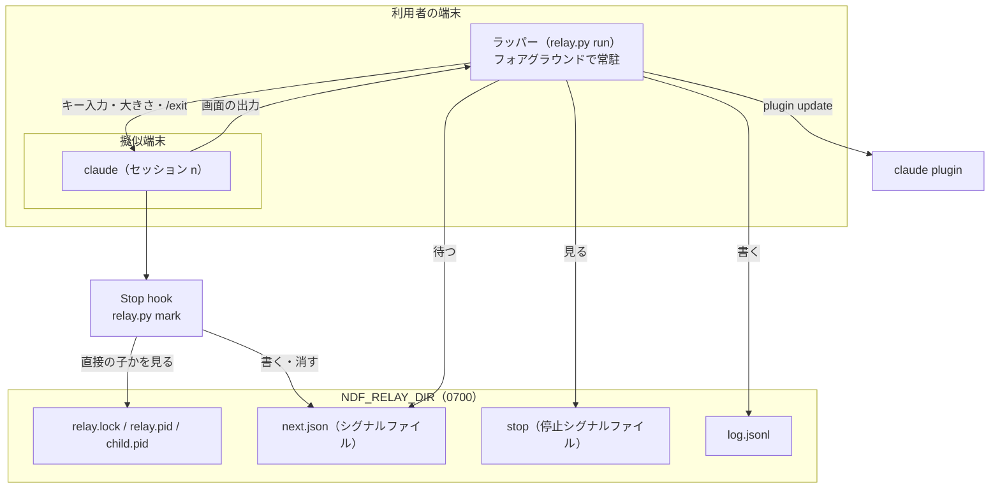
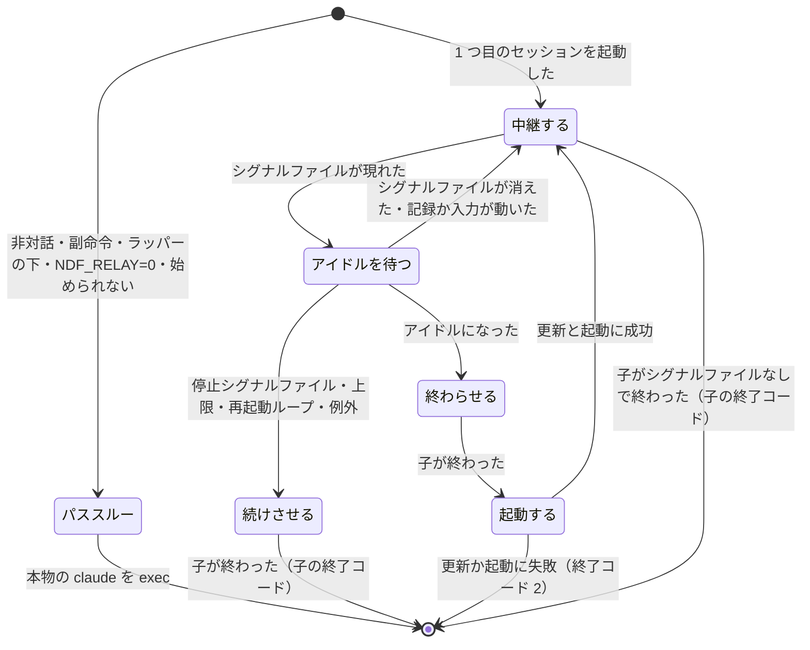

# カットポイントで claude を起動し直すラッパー

`/ndf:development-workflow` のカットポイントで人が行っていた「`/exit`・起動し直し・次の
コマンドの貼り付け」を、端末のフォアグラウンドに常駐するラッパー（`plugins/ndf/scripts/relay.py`）が行う。
人が入力するのは承認ゲートの答えだけになる。ラッパーは利用者が `/ndf:install-wrapper` で入れたときだけ挟まる。ラッパーが動けないとき・止まると決めたときは、`ndf-relay:` の
1 行を出して、人がコマンドを貼り付ける今までどおりの運用へ落ちる。Claude Code だけが対象である。
この文書は、ラッパーの入出力の契約・状態の置き場所・判定の条件と、それぞれをそう決めた理由を残す。

**利用者向けの始め方・止め方・上限・記録の読み方と、次のコマンドの形は Skill の文書が正である。**

| 何を読むか | 正本 |
| --- | --- |
| 次のコマンドを出す形（`ndf-next` のブロック）、出す時点、引継ぎ文書の「次に実行するコマンド」 | `plugins/ndf/skills/development-workflow/references/context-window.md` の「新しい会話で戻す」 |
| ラッパーの始め方・ラッパーを挟まない起動・止め方・上限・落ちたときの続け方・記録の読み方 | `plugins/ndf/skills/development-workflow/references/relay.md` |
| コンテキスト量の hook の判定（上限・コンテキスト量の読み方・工程へ入る起動の見分け方） | [ndf-token-waits-and-context-cut.md](ndf-token-waits-and-context-cut.md) の「コンテキスト量の判定」 |
| 3 層（conductor / supervisor / worker）の運転 | [ndf-agent-layers-unattended-run.md](ndf-agent-layers-unattended-run.md) |
| 導入・取り外し（`install` / `uninstall` / `status` / `startup`）・`/ndf:restart`・承認ゲートを越えない守り・起動オプションの引継ぎ | [ndf-relay-install-and-restart.md](ndf-relay-install-and-restart.md) |

## 概要

**例: 設計の承認ゲートをまたいで実装へ進む。** 利用者は VS Code の統合ターミナル（tmux の中でも外でも
よい）で作業している。

| 順 | 誰が | 何をする |
| ---: | --- | --- |
| 1 | 利用者 | 前もって `/ndf:install-wrapper` を 1 度打っておく。コピーと `claude` の関数が `~/.claude/ndf/` に置かれ、次に開いたシェルから `claude` と打つとラッパーを挟む |
| 2 | 利用者 | `claude` と打ち、起動した claude の中で `/ndf:development-workflow #895` を入力する |
| 3 | conductor（セッション 1） | 設計の承認ゲートで `AskUserQuestion` を出す。答えを待つあいだ Stop は起きず、シグナルファイルは書かれない |
| 4 | 利用者 | 「承認」と答える（キー入力はラッパーを通ってそのまま子へ届く） |
| 5 | conductor | 設計 Pull Request をマージし、最後の応答に `ndf-next` のブロック（中身 `/ndf:development-workflow #895`）を出して応答を終える |
| 6 | Stop hook | `relay.py mark` がブロックの中身をシグナルファイル `next.json` へ写す |
| 7 | ラッパー | シグナルファイル・会話の記録・利用者の入力が 5 秒動かず、質問が表示されていないのを見て、子の端末へ `/exit` と改行を 1 回で入力し、子が終わるのを確かめる |
| 8 | ラッパー | プラグインを更新して版を読み、区切りの 1 行（`── ndf-relay: 区間 2 ──`）を出して、同じ端末で `claude <最初の区間の起動の方針の引数> "<ブロックの中身>"` を子として起動する |
| 9 | conductor（セッション 2） | 新しい版の hook と Skill で、実装のフェーズから始める |

**`ndf-next` のブロックを出さない普段の利用ではシグナルファイルが書かれず、ラッパーは何もしないまま claude と同じ終了コードで
終わる。** ラッパーを使わない利用者と Codex / Kiro / agy では、人がブロックの中身を貼り付ける。

**ラッパーが使えない・止まると決めたときは、今までどおりに落ちる。**

| 場面 | 画面に出るもの | 人がすること |
| --- | --- | --- |
| 対話でない起動（`-p`・パイプ・副命令・`--help` など）か、ラッパーの下で打たれた | 何も出さず、本物の claude をそのまま exec する（パススルー） | 何もしない |
| 対話だがラッパーを始められない（擬似端末・プラグインの名前と版・作業ディレクトリ） | `ndf-relay: ラッパーを始めない（<理由>）。カットポイントでは示されたコマンドを手で入力する` を出してからパススルー | カットポイントで `/exit` し、ブロックの中身を貼り付ける |
| カットポイントで停止シグナルファイル・上限・再起動ループ・ラッパーの中の例外 | `ndf-relay: 次の区間を起動しない（<理由>）。このまま続けるか、/exit して示されたコマンドを手で入力する` | 同上（今のセッションは動いたまま） |
| カットポイントで更新・起動に失敗 | `ndf-relay: 次の区間を起動できない（<理由>）。次のコマンド:` と中身。ラッパーは終了コード 2 で終わる | 表示された中身で claude を起動する |

## 用語

| 用語 | 意味 |
| --- | --- |
| セッション | 1 つの Claude Code のプロセス（conductor の会話）が受け持つ範囲。カットポイントから次のカットポイントまで |
| カットポイント | `context-window.md` の切ってよい 4 点、承認ゲートの承認と取り込みの後、コンテキスト量の hook が工程へ入る起動を止めた後 |
| ラッパー | 端末のフォアグラウンドに常駐し、claude を擬似端末の子として起動して、シグナルファイルを見てセッションを切り替えるプロセス（`relay.py run`） |
| シグナルファイル | Stop hook がラッパーへ次のセッションの開始を知らせるファイル（`next.json`） |
| 停止シグナルファイル | ラッパーに次のセッションを起動させないために置く空のファイル（`stop`） |
| アイドル | シグナルファイル・会話の記録・利用者の入力が決まった秒数動かないこと。ラッパーはこれを待ってから `/exit` を入力する。目標が未達の判定の後は会話の記録を数えない |
| 再起動ループ | シグナルファイルを書いて終わったセッションが短い時間で続くこと。進まずに起動だけが重なる状態 |
| パススルー | ラッパーを挟まず、本物の claude を引数のまま exec すること |
| 落ちる | ラッパーがセッションを切り替えず、人が次のコマンドを入力する運用に戻ること |

## 構成要素

| 要素 | 責務 |
| --- | --- |
| `plugins/ndf/scripts/relay.py` | ラッパーの本体。副命令 `run` / `stop` / `mark`、導入の `install` / `uninstall` / `status` / `startup`、質問シグナルファイルの `question`、ラッパーの直接の子かを返す `is-child`、コンテキスト量の hook と `/ndf:restart` と conductor が使うカットポイントのアナウンス `notice`（[ndf-relay-segment-notice.md](ndf-relay-segment-notice.md)）を持つ。標準ライブラリだけで書く |
| `plugins/ndf/hooks/claude.json` の `Stop` | `NDF_RELAY_DIR` があるときだけ `python3 <root>/scripts/relay.py mark` を呼ぶ（既存の Slack 通知の後、`timeout` 5 秒、`continueOnError: true`）。無ければ `python3` を起こさない |
| `plugins/ndf/hooks/claude.json` の `SessionStart`（`matcher: startup\|resume`） | コピーか記録があるときだけ `relay.py startup` を呼ぶ。シェルの設定は書かない（[導入の仕様](ndf-relay-install-and-restart.md)） |
| `plugins/ndf/hooks/claude.json` の `PreToolUse` / `PostToolUse`（`matcher: AskUserQuestion`） | `NDF_RELAY_DIR` があるときだけ `relay.py question open` / `close` を呼ぶ（`timeout` 10 秒） |
| `plugins/ndf/skills/install-wrapper/` / `restart/` | 明示の導入・取り外しと、好きな時点の切り替え（Claude Code だけ） |
| `plugins/ndf/scripts/token-guard.sh` | コンテキスト量の判定で、ラッパーの直接の子の conductor なら 1 度の通しをせずに止め続ける（下の「文脈の上限で切る」） |
| `development-workflow/references/context-window.md` / `relay.md` / `SKILL.md` | 次のコマンドの形・ラッパーの案内・引継ぎの規約 |

**Codex / Kiro / agy にはラッパーも hook も置かない。** `hooks/codex.json` と `dev.agy/hooks.json` は
`relay.py` を呼ばず、Kiro は hook の定義を持たない。これらのランタイムでは、人が
`ndf-next` のブロックの中身を貼り付ける。

## 決定と理由

| 決定 | 理由 |
| --- | --- |
| ラッパーは端末のフォアグラウンドに常駐し、claude を擬似端末の子として起動する形だけにする。tmux を前提にしない | 前提が端末と Python 3 だけになり、tmux や VS Code の設定を確かめて入れる処理が要らない。2 つの形を持つと使われない側が古くなる。tmux の中で使うなら、ペインの中で `claude` と打てば同じに動く |
| 始められない・止まると決めたときは、終了コード 1 で止めずに今までどおりの運用へ落ちる | 止めると、利用者は前提をそろえるまで claude を起動できない。conductor はラッパーがあってもなくてもブロックを出すので、人は貼り付けて続けられる |
| セッションの終わりは、最後の応答の `ndf-next` のブロック 1 つで決める | Stop hook に `last_assistant_message` が来る。情報文字列を `text` にしないのは説明の例と取り違えないためで、外側の囲みの中も数えない。引継ぎ文書の見出しは置き場所も名前も決まっていない |
| 承認ゲートはセッションの中で `AskUserQuestion` のまま受け、ブロックは承認と取り込みの後に出す | 答えを待つあいだは Stop が起きないので、ラッパーは承認ゲートを知らなくてよい。画面の文言から承認ゲートを読むと、Claude Code の版で文言が変わったときに承認ゲートの前で切る |
| `stop_hook_active` を見ない。シグナルファイルは最新の Stop で置き換えるか消し、ラッパーはアイドルになってから動く | Stop hook が止めを拒むと応答が続き、`stop_hook_active` が真の Stop こそセッションの最後でありうる。利用者の入力も見るのは、打っている途中に `/exit` を混ぜないためである |
| 前のセッションは子の端末へ `/exit` を入力して終わらせる。30 秒で終わらなければ SIGTERM、さらに 10 秒で SIGKILL | `/exit` は人の終了と同じ終わり方（終了コード 0・SessionEnd の理由 `prompt_input_exit`）になる。Stop hook の `{"continue": false}` はプロセスを終わらせない。子が終わらないまま次を起動すると claude が 2 つ動く |
| シグナルファイルを書くのは、ラッパーが起動した子の claude だけにする | conductor が Bash から起こす `claude -p` も `NDF_RELAY_DIR` を継ぎ、Stop hook が走る。環境変数だけでは見分けられないため、親をたどって最初に当たる claude が `child.pid` と一致するかで見る |
| プラグインはカットポイントごとに毎回更新し、失敗したら次のセッションを起動しない | リリースの直後かを判定する材料が無い。版が変わっていなければ更新は数秒で何も変えない。古い版で始めると、リリースした hook と Skill で進んだと記録が誤って示す |
| 子がシグナルファイルなしで終わればラッパーも終わる。再起動ループは「3 つ続けて起動から 120 秒未満でシグナルファイル」で見る | シグナルファイルの無い終わりは人の `/exit`・Ctrl-C の 2 回・落ちたのいずれかで、同じコマンドで起動し直しても意図に反するか同じく落ちる。同じコマンドの繰り返しでは見ない。入口のコマンドはセッションが違っても同じ文字列になりうる |
| 1 日の起動回数の上限は 20、アイドルは 5 秒を初期値にし、環境変数で変える | 1 日に 2〜3 のミッションを進めても 20 には届かず、再起動ループの検出を抜けた暴走は 1 日で止まる。アイドルは切り替えの待ちにそのまま足されるため短くする（15 秒では Stop から次のセッションの起動まで約 34 秒かかった）。`/exit` を早く打ちすぎないことは、シグナルファイルの後の利用者の入力・質問・背景の処理の起動・応答の再開の判定と、利用者の入力の待ちが受け持つ |
| ラッパーと hook は Python の 1 ファイルにする | シグナルファイルの形・作業ディレクトリ・親のたどりを共有し、片方だけが変わって食い違わない。擬似端末・端末の属性・JSON・引数の配列での起動を標準ライブラリだけで書ける。bash では擬似端末の入出力をラッパーできない |
| 次のコマンドはシェルを通さず、絶対パスと引数の配列で `os.execve` に渡す | 中身は LLM の出力で、引用符や `$(...)` を含みうる |
| 記録はセッションごとに `start` と `end` の 2 行に分ける | 版は起動の時点で、長さと終わり方は終わった後に分かる。1 行にまとめると、起動の後に落ちたセッションの行が書かれないか、行を書き直すことになる |
| 次のセッションの作業ディレクトリが消えていたら、メインディレクトリか在る最も近い親で起動する | 設計 Pull Request のマージで worktree が消えるカットポイントは毎回起きうる。次のセッションは「新しい会話で戻す」で worktree を戻すので、メインディレクトリから始めて足りる |
| `claude` の関数で常にラッパーを挟み、`run` の後ろはすべて claude の引数として受ける | ラッパーの設定を引数で受けると claude の引数と名前がぶつかる。設定は環境変数（`NDF_RELAY_*`）だけで受ける |
| 2 つ目以降のセッションへ、`run` の引数のうち起動オプションに当たるものだけを引き継ぐ | 何も引き継がないと、devbase の `alias claude` が足す `--dangerously-skip-permissions` が 2 つ目のセッションで落ちる。`--resume` や `-c`・最初のプロンプトを引き継ぐと捨てた会話へ戻るので、会話ごと・セッションごとのものは値ごと落とす（[導入の仕様](ndf-relay-install-and-restart.md)の「起動オプションの引継ぎ」） |
| ラッパーが要らない起動は、深さの変数だけを足して本物の claude を exec する | 擬似端末を挟むと出力の形・終了コード・シグナルの届き方が変わる。Claude Code から継いだ環境変数を外すと、直接打ったときと振る舞いが変わる |
| `claude` の関数は版に依らないコピーを指し、SessionStart hook が在るコピーだけを起動ごとに置き直す（版は後退させない） | 版つきのキャッシュを指すと古い版に固定され、古い版のディレクトリが消えると壊れる。動いているラッパーは入れ替えない（子の端末を手放すことになる） |
| 導入は利用者が明示に打つ `/ndf:install-wrapper` だけにし、SessionStart hook はシェルの設定を書かない（#928。10.17.6 までは hook が alias の囲みを自動で足した） | 利用者のシェル設定を黙って書き換えない。既存の `claude` の定義があれば足さない（選んだ起動の仕方が黙って替わる）。bash と zsh 以外は書き方が違い、読み違えると設定を壊す |
| 文脈の上限は既存のコンテキスト量の hook が作り、ラッパーの下では 1 度の通しをやめる | 上限の値と読み方を 1 つにし、測る側と止める側を食い違わせない。人の居ない前提で LLM が「続ける」と決めると上限を超えたまま進む。Stop hook で上限を見て応答を続けさせると、文で尋ねた承認ゲートまで承認の前に切る |
| 背景の処理が動いている Stop ではシグナルファイルを書かない。判定は `background_tasks` の `status: running` だけで行う | 動いているあいだに切ると、その処理（supervisor を含む）が子の claude と一緒に終わる。背景の Bash もサブエージェントも同じ形で載る。conductor が自分で数えると数え違えて子を失う |
| 背景の処理のためにシグナルファイルを書けない Stop は、同じセッションの同じ候補で 1 度だけ止め（`decision: block`）、動いている作業の id とコマンドの先頭を conductor へ渡す。止め方は `TaskStop <id>` と書き、止めてはいけない作業（supervisor・`supervise.py queue`）なら終わりを待たせる。シグナルファイルを書かなかった Stop は `log.jsonl` に `mark_skipped` で残す | 黙って抜けると conductor も利用者も切り替わらない理由に気づかず、切り替わりが遅れて利用者の手が入る。conductor はプロセス名で探すしかなく、Claude Code が包んだコマンド行に `pkill -f` / `pgrep -f` が一致しないので止め損ねる。2 度目も止めると、待つと決めた conductor の応答を繰り返し起こす |
| 次のセッションの中身は位置引数 1 つで渡す | 複数行の中身でも、改行ごと 1 つの入力として届く |
| コンテキスト量の hook は `relay.py notice` の 1 行目（`is-child` と同じ判定）でラッパーの直接の子かを見る | bash の hook に親のたどりを写すと、2 つの実装が食い違う |
| 質問が表示されているあいだと、シグナルファイルの後に質問・利用者の入力・背景の処理の起動・応答の再開があったあいだは子の端末へ書かない。`/exit` と改行は質問の hook と同じロックの中で 1 回の write で書く | 質問の表示中に書いた `\r` は選択肢 1 を決める（実測）。10.17.6 までの 1 秒あけた `/exit` と `\r` のあいだに質問が出ると、`\r` が答えになる（[導入の仕様](ndf-relay-install-and-restart.md)の「承認ゲートを越えない守り」） |
| シグナルファイルを書いた後は切り替えを確定とし、取りやめるのは利用者の入力・質問・背景の処理の起動があったときだけにする。目標が未達の判定の後は、会話の記録の更新をアイドルの判定に数えず、Esc で応答を止めてから `/exit` を書く | カットポイントでは目標は未達が当然で、判定が止めを拒んで応答が続く。判定のたびに応答が起こされ会話の記録が動き続けるため、記録のアイドルを待つと切り替わらない。Esc は応答の途中なら止め、入力待ちなら何もしない。2 回続けると巻き戻しの画面が開くので 1 回に限る |
| 待ちの秒数と打ち切りはすべて環境変数で短くできる | 擬似端末の上の単体テストを数十秒で終える |

## 仕様

### 常に成り立つ条件

- **`mark`・`startup`・`question` は常に終了コード 0 で終わる。** 例外も含めて Stop・SessionStart・
  質問を止めない。`mark` は何も出力しない
- **ラッパーは本体の例外で子の claude を巻き込まない。** ラッパーが落ちると擬似端末が閉じ、子は SIGHUP で
  終わる。カットポイントの判定の中の例外は `stop` の行（`error`）と `ndf-relay:` の 1 行に変え、子が終わる
  まで入出力の中継だけを続ける
- **ラッパーは端末の属性を始める前の状態へ戻して終わる。** 正常な終わり・例外・SIGTERM と SIGHUP の
  受け取りのすべての経路で `tcsetattr` で戻す。端末が閉じていて戻せないときは、その失敗を無視する
- **シグナルファイルを書くのはラッパーの直接の子の claude だけで、`AskUserQuestion` の答えを待つあいだと背景の処理が
  動いているあいだは書かない。** 直接の子でない claude の Stop はシグナルファイルを読みも消しもしない
- **ラッパーは、質問シグナルファイル（`question`）がある間・シグナルファイルの後に応答の行がある間は、子の端末へ何も書かない**
- **ラッパーは同じ起動の作業ディレクトリしか読まない。** 起動ごとに新しいディレクトリを作るので、pid が
  再利用されても前の起動の `stop` や `next.json` を読まない
- **ラッパーが生きているかは `relay.lock` の排他で見る。** pid の生死では見ない
- **シグナルファイルと作業ディレクトリの形（`next.json` のキーと `NDF_RELAY_DIR` のファイル名）は版をまたいで
  変えない。** hook はセッションごとに新しい版で動き、動いているラッパーは古い版のままでありうる。変えるときは
  ファイル名を変え、古いラッパーが新しいシグナルファイルを読み違えないようにする
- **子の起動は、シグナルファイルを消す → `pty.fork()` → 子は同期のパイプで待つ → 親が `child.pid` を書く → 親が
  同期のパイプを閉じる → 子が exec → 親が結果のパイプで成功を確かめて `start` を書く、の順に固定する。**
  子がすぐ Stop に達しても hook が読む `child.pid` は新しい値で、親が消すシグナルファイルは前のセッションのものだけになる。
  `start` は exec に成功したセッションにだけ残る

### `relay.py` の副命令

| 副命令 | 引数 | 終了コード | 出力 |
| --- | --- | --- | --- |
| `run` | `[claude の引数 ...]`。ラッパーは解釈しない | パススルーでは claude の終了コードそのもの（exec で置き換わる）。ラッパーでは最後のセッションの claude の終了コード（シグナルで終わったら 128 + 番号）/ 2: 次のセッションの更新か起動に失敗した / 127: 本物の claude が見つからない・起動の入れ子・1 つ目のセッションの exec の失敗 | 区切りの 1 行と `ndf-relay:` の 1 行。シグナルファイルなしで終わるときは何も出さない |
| `stop` | 無し | 0: 動いているラッパーに停止シグナルファイルを置いた（1 つ以上）/ 1: 動いているラッパーが無い | 置いたラッパーの pid を 1 行ずつ |
| `mark` | 標準入力に Stop hook の JSON | 常に 0 | 無し |
| `install` / `uninstall` / `status` / `startup` / `question` | [導入の仕様](ndf-relay-install-and-restart.md)の副命令の表 | 同左 | 同左 |
| `is-child` | 無し（内部用。`relay.md` に載せない） | 0: ラッパーが動いていて、呼んだ claude がラッパーの直接の子 / 1: それ以外 | 無し |
| `notice` | 無し（内部用。コンテキスト量の hook・`/ndf:restart`・conductor が呼ぶ） | 常に 0 | 1 行目 `relay` / `outside`（`is-child` と同じ判定）、2 行目にアナウンスの 1 文。[アナウンスの仕様](ndf-relay-segment-notice.md)の契約の表 |

副命令が無い・知らない副命令は、使い方を標準エラーへ出して終了コード 2 で終わる。

`stop` は `NDF_RELAY_DIR` を継がないため、`${XDG_STATE_HOME:-$HOME/.local/state}/ndf/relay/` の各
サブディレクトリを走査し、`relay.lock` が取れない（ラッパーが動いている）ものすべてに `stop` を置く。

### パススルーの条件

`run` は上から順に見る。パススルーは下の「本物の claude」の絶対パスを `os.execve` に渡し、引数を
そのまま渡す。**環境は `NDF_RELAY_DEPTH` を 1 増やすことだけを変える。**

| # | 条件 | すること |
| ---: | --- | --- |
| 1 | `NDF_RELAY=0` | パススルー |
| 2 | `NDF_RELAY_DEPTH` が 2 以上 | `ndf-relay: 起動が入れ子になっている（<本物の claude の候補>）` を出して終了コード 127。`claude` という名前の別のスクリプトがラッパーを呼び返す繰り返しを止める |
| 3 | 本物の claude が見つからない | `ndf-relay: 本物の claude が見つからない` を出して終了コード 127 |
| 4 | `NDF_RELAY_DIR` がある（ラッパーの子の中で打たれた） | パススルー。入れ子のラッパーにしない |
| 5 | 引数に `-p` / `--print`（`--print=` を含む）/ `-h` / `--help` / `-v` / `--version` がある、または最初の引数が claude の副命令 | パススルー |
| 6 | 標準入力か標準出力が端末でない | パススルー |
| 7 | `pty` / `termios` / `tty` を読み込めない、`claude plugin list --json` から `ndf@<名前>` の名前と版を読めない（15 秒で打ち切る）、作業ディレクトリを作れない | `ndf-relay: ラッパーを始めない（<理由>）…` を標準エラーへ出してからパススルー |
| 8 | 上のどれでもない | ラッパーとして始める |

副命令の一覧は Claude Code 2.1.280 の `claude --help` から写した（`agents` / `attach` / `auth` /
`auto-mode` / `doctor` / `gateway` / `import` / `install` / `logs` / `mcp` / `plugin` / `plugins` /
`project` / `respawn` / `rm` / `setup-token` / `stop` / `kill` / `ultrareview` / `update` / `upgrade`）。
一覧に無い副命令は対話としてラッパーを挟むが、端末を使わずに終わればシグナルファイルは書かれず、ラッパーは同じ終了
コードで終わる。

### 本物の claude

alias と関数は子のプロセスには効かないため、ラッパーは実体を探す。**パススルーもセッションの起動も、ここで決めた
絶対パスを使い、名前 `claude` で `PATH` を引き直さない。**

1. 環境変数 `NDF_RELAY_CLAUDE` があればそれ
2. `PATH` を前から見て、実行できる `claude` のうち、実体（`realpath`）が `relay.py` 自身とコピー・旧いコピーでなく、先頭 4 KB に `relay.py` を含まないもの。読めないファイルはラッパーと見なさない（飛ばし
   損ねた繰り返しは `NDF_RELAY_DEPTH` が止める）

### ラッパーの流れ

| 手順 | すること |
| --- | --- |
| 中継する | 端末の属性を保存して標準入力を raw にし、`select` で標準入力 → マスタ、マスタ → 標準出力を流す（Ctrl-C もバイトのまま子へ届く）。SIGWINCH で端末の大きさをマスタへ `TIOCSWINSZ` で写す。`NDF_RELAY_POLL` 秒（既定 2）ごとにシグナルファイルを見る。1 つ目のセッションは今の作業ディレクトリで `<本物の claude> <run の引数>` を起動する |
| アイドルを待つ | 次がそろうまで待つ。(1) シグナルファイルの `written_at`・`transcript_path` の更新時刻・利用者の最後の入力の時刻のうち最も遅いものから `NDF_RELAY_QUIET` 秒。シグナルファイルより後に目標が未達の判定の行（`attachment.type: "goal_status"`・`met: false`・`sentinel` 無し）があれば、`transcript_path` の更新時刻は数えない。(2) シグナルファイルが消えていない。(3) 質問シグナルファイルが無く、`asked` の時刻がシグナルファイルの `written_at` より前。(4) 会話の記録に、シグナルファイルより後の利用者の入力の行（`type: "user"` で `isMeta` が無く、Tool の結果でも Esc の中断の記録でもない）と、`run_in_background` が真の Tool の呼び出しを含む `assistant` の行が無い。目標が未達の判定の行が無ければ、シグナルファイルより後の `assistant` / `user` の行も無い |
| 続けさせる | 停止シグナルファイル・1 日の起動回数・再起動ループのどれかに当たるか、判定の中で例外が起きたら、`/exit` を入力しない。`stop` の行を書き、シグナルファイルを消し、`ndf-relay:` の 1 行を出す。以後は入出力を中継するだけで、次のシグナルファイルでは何もしない。子が終わると `end`（`no-mark`）を書いて子の終了コードで終わる |
| 終わらせる | `question.lock` の中で (2)(3)(4) と記録の大きさ・更新時刻を確かめ直し（目標が未達の判定の後は大きさ・更新時刻を除く）、子の端末へ `/exit\r` を 1 回の write で書いて `NDF_RELAY_EXIT_HOLD` 秒（既定 1）後に放す。目標が未達の判定の後は、先に Esc（`\x1b`）を 1 回書いて `NDF_RELAY_ESC_WAIT` 秒（既定 1）待ち、そのあいだに利用者の入力があれば書かずに戻り、無ければ確かめ直してから `/exit\r` を書く。`NDF_RELAY_EXIT_WAIT` 秒（既定 30。質問シグナルファイルがある間は数えない）で終わらなければ SIGTERM、`NDF_RELAY_TERM_WAIT` 秒（既定 10）でも終わらなければ SIGKILL を送り、終わりを `waitpid` で確かめてから `end` を書く |
| 起動する | `claude plugin marketplace update <名前>` → `claude plugin update ndf@<名前> -y` → `claude plugin list --json` で版を読む。どれかが 0 以外・打ち切り・版が読めなければ `update-failed`。作業ディレクトリはシグナルファイルの `cwd`、消えていればパスの `/.worktrees/` の手前（メインディレクトリ）、無ければ在る最も近い親、それも無ければ HOME。区切りの 1 行を出し、`<本物の claude> <起動の方針の引数> <合図の中身>`（中身は 1 つの引数）を起動する。exec に失敗したら `start-failed` |

**更新と起動に失敗したときは、`stop` の行を書き、次のコマンドの中身を画面に出して終了コード 2 で
終わる。** 1 つ目のセッションの exec に失敗したときは、`stop`（`start-failed`）を書き `ndf-relay:` の 1 行を
出して終了コード 127 で終わる。パススルーし直さない（同じ実体の exec がまた失敗する）。

**exec の成否は close-on-exec の結果のパイプで親へ返す。** 子は exec が失敗したら `errno` をパイプへ
書いて終わる。親は何も読まずに閉じれば成功とする。失敗した起動は `start` も `end` も書かず、1 日の
起動回数に数えない。

**子の環境からは `CLAUDECODE` / `CLAUDE_CODE_SESSION_ID` / `CLAUDE_CODE_ENTRYPOINT` を外し、
`NDF_RELAY_DIR` を置き、`NDF_RELAY_DEPTH` を 1 増やす。** Claude Code の中から起こしたプロセスは
これらを継ぐためである。`claude plugin ...` の呼び出しは、同じ変数と `NDF_RELAY_DIR` を外し、
標準入力を `/dev/null` にして行う。打ち切りは `list` が 15 秒、`marketplace update` と `plugin update`
が 120 秒である。応答しない CLI で端末が止まらないためである。

**マーケットプレイスの名前と 1 つ目のセッションの版は、ラッパーを始めるときの `claude plugin list --json` の
`id` が `ndf@<名前>` の要素から読む。** 開発版のチャネルを使う利用者でも、登録した取得元から更新される。

### 上限と止め方

| 上限・手段 | 判定 |
| --- | --- |
| 1 日の起動回数 | `${XDG_STATE_HOME:-$HOME/.local/state}/ndf/relay/` の全 `log.jsonl` の `start` のうち、`at` が端末の地方時で今日のものを数え、`NDF_RELAY_MAX_STARTS`（既定 20）以上なら `max-starts`。**数えてから `start` を書くまで（失敗なら放すまで）親の `count.lock` を排他で持つ。** 取れなければ次の確認まで待つ。同時に動くラッパーが残り 1 枠を取り合っても上限を超えない |
| 再起動ループ | このラッパーの記録の直前 2 つの `end` の `seconds` がともに `NDF_RELAY_SPIN`（既定 120）未満で、今のセッションの長さ（シグナルファイルの `written_at` − セッションの起動の時刻）も未満なら `spin`。1 つ目のセッション（`run` の引数で起動したセッション）も数える |
| 停止シグナルファイル | 作業ディレクトリに `stop` があれば `stop-file`。`relay.py stop` か `touch <作業ディレクトリ>/stop` で置く |
| セッションの中の `/exit`・Ctrl-C の 2 回・子が落ちた | シグナルファイルが無いまま子が終わるので、ラッパーも次のセッションを起動せずに終わる |

### `mark` の判定

| # | 条件 | すること |
| ---: | --- | --- |
| 1 | `NDF_RELAY_DIR` が無い | 何もしない（hook の定義の側でも `python3` を起こさない） |
| 2 | `relay.lock` の排他が取れる（ラッパーが動いていない） | 何もしない |
| 3 | 標準入力を JSON として読めない | 何もしない |
| 4 | hook の親をたどって最初に当たる claude が `child.pid` と違う | 何もしない（シグナルファイルを消さない） |
| 5 | `background_tasks` に `status: running` がある、またはブロックが 2 つ以上 | シグナルファイルがあれば消す。ブロックが 1 つ以上あれば `log.jsonl` に `{"event": "mark_skipped", "at", "section", "reason": "background" \| "blocks", "tasks": [{"id", "type", "command"}], "held"}` を 1 行足す（`section` は最後の `start` のセッション）。処理が終わって応答し直した Stop で改めて書かれる |
| 5a | 5 のうちブロックがちょうど 1 つで背景の処理が動いていて、`stop_hook_active` が偽で、同じセッションの同じ候補（ブロックの中身のハッシュ）でまだ止めていない | 標準出力へ `{"decision": "block", "reason": …}` を出して Stop を止める。`reason` は動いている作業の id とコマンドの先頭 80 字（取れなければ件数）、`TaskStop <id>` で止めること、`pkill -f` / `pgrep -f` を使わないこと、止めてはいけない作業なら終わりを待ってから出し直すこと。止めた候補は `mark-held.json` に残す |
| 6 | ブロックがちょうど 1 つ | シグナルファイルを書く（前のシグナルファイルは置き換わる） |
| 7 | ブロックが 0 で、`asked` の時刻がシグナルファイルの `written_at` 以後 | シグナルファイルを消す（シグナルファイルの後に質問が出た） |
| 8 | ブロックが 0 で、7 に当たらない | 前のシグナルファイルを残す。シグナルファイルを書いた後は切り替えを確定とする |

**親のたどり** は Linux では `/proc/<pid>/stat`、それ以外では `ps -o ppid=,comm=` で行う。名前が
`claude` か、子と同じ名前か、pid が `child.pid` のプロセスに当たった時点で決める（最大 64 階層、pid 1
で打ち切る）。conductor が Bash から起こした `claude -p` は子の claude の孫に当たり、先にそちらに当たる。

**ブロックの読み取りは外側の囲みの中を除く。** 応答を行ごとに読み、囲みの開き（行頭のバッククォート
3 つ以上）と閉じ（同じ数以上のバッククォートだけの行）を数える。数えるのは、どの囲みの中でもない
位置で開く、バッククォートがちょうど 3 つで情報文字列が `ndf-next` の囲みだけである。中身は前後の
改行を除いたもので、複数行でよい。

### 文脈の上限で切る

**上限は `NDF_CONTEXT_LIMIT`（既定 200,000）の 1 つで、ラッパーは別の値を持たない。**

| 誰が | 何をする |
| --- | --- |
| コンテキスト量の hook | conductor が工程へ入る起動（工程 Skill・フェーズの Agent）で上限を超えていれば止める。これが「前のフェーズレポートを受け取った後で、次のフェーズを起動する前」の切りの良いところに当たる |
| コンテキスト量の hook（ラッパーの下） | `NDF_RELAY_DIR` があり、上限を超えていて、`relay.py notice` の 1 行目が `relay` なら、同じ起動の 1 度の通しをしない。理由の欄は「新しいフェーズを起動せず、動いている supervisor の報告を待ち、引継ぎ文書を更新し、`ndf-next` のブロックを出して終える」と、ブロックの直前に書く `notice` の 2 行目、承認や確認を挟まないことを示す。ラッパーの外では今までどおり 1 度だけ通す |
| conductor | 背景の supervisor の報告をすべて受け取ってから、引継ぎ文書（起動の指示が名指ししたもの。無ければ書かない）を更新し、ブロックを出して終える。中身は `/ndf:development-workflow #<課題>`、名指しの引継ぎ文書があれば「<文書> の続きから」 |
| Stop hook とラッパー | 背景の処理が残っていればシグナルファイルを書かず、Stop を 1 度止めて残っている作業を知らせる。すべて終わった後の Stop でシグナルファイルが書かれ、ラッパーがほかのカットポイントと同じく次のセッションを起動する |

hook が止めるのは工程へ入る起動だけで、フェーズの中の Bash や Read は止めない。

### 導入（`install`）

**導入・取り外し・状態の表示・コピーの置き直しは [ndf-relay-install-and-restart.md](ndf-relay-install-and-restart.md) が持つ。**
10.17.6 までは SessionStart hook の `install` が `${XDG_DATA_HOME:-$HOME/.local/share}/ndf/relay.py` へ写し、
`~/.bashrc`（zsh なら `.zshrc`）へ alias の管理ブロックを 1 度だけ足していた。今は利用者の `/ndf:install-wrapper`
だけがコピーを `${CLAUDE_CONFIG_DIR:-$HOME/.claude}/ndf/` に置き、シェルの設定へ読み込みの 1 行を置く。

## データ・設定

### 作業ディレクトリ `NDF_RELAY_DIR`

`${XDG_STATE_HOME:-$HOME/.local/state}/ndf/relay/<UTC の %Y%m%dT%H%M%SZ>-<ラッパーの pid>-<乱数 8 桁>/`。
`run` が親を `0700` で作ってから、その下を `0700` の `os.mkdir` で新しく作る（`install` が一度も
走っていなくても始められる。既にあれば別の乱数で作り直す）。`run` が終わるとき `relay.pid` を消し、
`log.jsonl` は残す。

| ファイル | 書く側 | 中身 |
| --- | --- | --- |
| `relay.lock` | `run` | 動いている間 `fcntl.flock` の排他を持ち続ける。`mark` / `stop` / `is-child` は `LOCK_EX \| LOCK_NB` を試し、取れなければ動いていると読む。ラッパーが落ちると OS が放す |
| `relay.pid` | `run` | ラッパーの pid（表示のため。生死の判定には使わない） |
| `child.pid` | `run` | 今のセッションの claude の pid。セッションごとに書き換える |
| `next.json` | `mark` | シグナルファイル。権限 `0600` の一時ファイルに書いてから置き換える |
| `question` / `question.lock` | `question open` / `close`・`mark`・`run` | 質問シグナルファイル（`0600`、空）と、質問の始まりと `/exit` の write を排他にするロック |
| `asked` | `question open` | 最後に質問が出た時刻（`{"at": "<ISO 8601 UTC>"}`）。シグナルファイルより後に質問が出たかを `mark` と `run` が見る |
| `stop` | `stop` か利用者 | 空。在れば停止シグナルファイル |
| `log.jsonl` | `run` | 記録 |

状態ディレクトリには、作業ディレクトリのほかに `count.lock`・`install.lock`・`rc-added`・`rc-skipped`・`rc-user`・`rc-noticed` を置く。

### シグナルファイル（`next.json`）

| キー | 値 | 出所 |
| --- | --- | --- |
| `command` | ブロックの中身 | `last_assistant_message` |
| `cwd` | 作業ディレクトリ | Stop hook の `cwd` |
| `session_id` / `transcript_path` | 会話の ID と記録の場所 | Stop hook の入力 |
| `written_at` | UTC の ISO 8601（ミリ秒まで） | `mark` の時刻 |

### 記録（`log.jsonl` の 1 行）

| キー | 値 |
| --- | --- |
| `event` | `start`（セッションを起動した）/ `end`（セッションの claude が終わった）/ `stop`（次のセッションを起動しないと決めた） |
| `at` | UTC の ISO 8601。`start` は同期のパイプを閉じた時刻 |
| `section` | セッションの番号（ラッパーの中で 1 から） |
| `pid` | セッションの claude の pid（`start`・`end`） |
| `command` | 起動に渡した中身（`start`）。1 つ目のセッションは `run` の引数をシェルの形でつないだもの（引数なしなら空） |
| `from_session` | 前のセッションの `session_id`（`start`。1 つ目は空） |
| `plugin_version` | 起動の直前に読んだ `ndf@<名前>` の版（`start`） |
| `carried` | 2 つ目以降のセッションの先頭に付けた起動オプション（`start`。1 つ目のセッションには無い） |
| `cwd` / `cwd_fallback` | 起動した作業ディレクトリと、シグナルファイルの `cwd` が消えていたときの元の値（`start`。消えていなければ `cwd_fallback` は無い） |
| `seconds` | セッションの長さ（`end`）。起動から、シグナルファイルの `written_at`（`mark` / `sigterm` / `sigkill`）か子の終わり（`no-mark`）まで |
| `ended_by` | `mark`（`/exit` で終わった）/ `no-mark`（シグナルファイルなしで終わった）/ `sigterm` / `sigkill`（`end`） |
| `reason` | `stop-file` / `max-starts` / `spin` / `count-lock`（質問の後に `count.lock` を取り直せない）/ `update-failed` / `start-failed` / `error`（`stop`）。`start-failed` は `errno` も持つ |

**`end` はセッションの claude が実際に終わったときだけ書く。** 落ちると決めたときは `stop` の行だけを書き、
そのセッションが後で終わったときに `end`（`no-mark`）を書く。ラッパーそのものが SIGTERM / SIGHUP で先に終わると、
そのセッションの `end` は書かれない（子は擬似端末が閉じて後から終わる）。

### 環境変数

| 変数 | 既定 | 意味 |
| --- | --- | --- |
| `NDF_RELAY` | — | `0` で `run` を常にパススルーにする |
| `NDF_RELAY_MAX_STARTS` | `20` | 1 日の起動回数の上限（全部のラッパーの合計） |
| `NDF_RELAY_QUIET` | `5` | アイドルの秒数 |
| `NDF_RELAY_SPIN` | `120` | 再起動ループとみなすセッションの秒数 |
| `NDF_RELAY_POLL` | `2` | シグナルファイルを見る間隔（秒） |
| `NDF_RELAY_EXIT_HOLD` / `NDF_RELAY_EXIT_WAIT` / `NDF_RELAY_TERM_WAIT` | `1` / `30` / `10` | `/exit` を書いた後に `question.lock` を持つ秒・`/exit` の後の待ち・SIGTERM の後の待ち（秒） |
| `NDF_RELAY_ESC_WAIT` | `1` | 目標が未達の判定の後に、Esc を書いてから `/exit` を書くまでの秒 |
| `NDF_RELAY_QUESTION_WAIT` | `3` | `question open` が `question.lock` を待つ秒 |
| `NDF_RELAY_LIST_TIMEOUT` / `NDF_RELAY_UPDATE_TIMEOUT` | `15` / `120` | `plugin list` と `marketplace update`・`plugin update` の打ち切り（秒） |
| `NDF_RELAY_CLAUDE` | — | 本物の claude の絶対パス（最優先） |
| `NDF_RELAY_DIR` | — | ラッパーが子に置く作業ディレクトリ。hook とコンテキスト量の hook がラッパーの下かをこれで見る |
| `NDF_RELAY_DEPTH` | `0` | 起動の深さ。パススルーと子の起動で 1 増やし、2 以上の `run` は止まる |

## 外部連携

| 相手 | 使うもの |
| --- | --- |
| Claude Code の Stop hook の入力 | `last_assistant_message`・`background_tasks`（`status`・`id`・`type`・`command`）・`cwd`・`session_id`・`transcript_path`・`stop_hook_active`（Stop を止めるかにだけ使い、シグナルファイルを書くかには使わない）。止めるときは標準出力の `{"decision": "block", "reason"}` |
| Claude Code の CLI | `claude plugin list --json`（`id` が `<プラグイン>@<マーケットプレイス>`、`version`）・`claude plugin marketplace update <名前>`・`claude plugin update ndf@<名前> -y`（端末でなければ `-y` が要る）。セッションの起動は位置引数の最初の入力（スラッシュコマンドも入力として働く） |
| 会話の記録 | `transcript_path` の更新時刻と、シグナルファイルより後の `assistant` / `user` の行 |

**前提にしている Claude Code の振る舞い**（2.1.280・Linux で実測）: Stop hook は応答が終わるたびに
発火し、`AskUserQuestion` の答えを待つあいだと claude の終了では発火しない。擬似端末のマスタへ書いた `/exit` と `\r` で約 1.6 秒で終わり、記録は
壊れない。入力待ちの子の端末は raw で、`\x03` はバイトのまま Ctrl-C として届く。背景の Bash と
サブエージェントは `background_tasks` に `running` で載り、終わると空の配列に戻る。要素は `id`・`type`
（`shell` など）・`status`・`description`・`command` を持つ（2.1.282 で実測）。

## セキュリティ

- `NDF_RELAY_DIR` とその親は `0700`、シグナルファイルは `0600` で、同じ利用者のプロセスだけが読み書きできる
- 次のコマンドはシェルも `PATH` の探索も通さず、本物の claude の絶対パスと引数の配列で `os.execve` に
  渡す。`claude` という名前の別のスクリプトへ戻らない
- `install` / `uninstall` が書くのはシェルの設定のマーカーのついた管理ブロックの中だけで、管理ブロックの外は読むだけである。
  書く前にバックアップを取る。SessionStart hook はシェルの設定を書かない

## 運用

- **始める:** `/ndf:install-wrapper` を 1 度打つ。次に開いたシェルから効く
- **止める:** 1 回だけなら `NDF_RELAY=0 claude`。切り替えだけを止めるなら `relay.py stop` か停止シグナルファイル。
  関数を外すなら `/ndf:install-wrapper uninstall`
- **セッションをまたいで設定を保つ:** 最初のセッションに付けた起動オプション（`--model` など）は 2 つ目以降のセッションにも
  付く。会話ごと・セッションごとの引数（`--resume` など）は付かない
- **前のセッションの画面:** claude はセッションごとに代替画面を使うため、端末の履歴に残るのは
  `Resume this session with: claude --resume <id>` と区切りの 1 行だけである。会話の記録は残る
- **既知の制約:** `install` が既存の `claude` の定義を探すのはシェルの設定と `~/.bash_aliases`（bash ではログインシェルの
  設定も）だけで、別の
  ファイルから読み込む定義は見落とす。先に定義された alias は関数と組み合わさり、その引数がラッパーへ渡る
- **費用:** ラッパーの待ちは `select` とファイルの確認で、LLM を使わない。`mark` は `NDF_RELAY_DIR` が無ければ
  `python3` を起こさない。`startup` はコピーも記録も無ければ `python3` を起こさない

## テスト観点

単体テストは `plugins/ndf/scripts/tests/test_relay.py`（子の claude を擬似端末の上で動く
`tests/fixtures/relay_fake_claude.py` に差し替え、`claude plugin ...` も同じ差し替えが受ける。`run` は一時の HOME と
`XDG_*` の下でだけ動かす。導入と守りの観点は[導入の仕様](ndf-relay-install-and-restart.md)の「テスト観点」）と、`test_token_guard.py` のラッパーの下の 4 件にある。

- `mark`: ブロック 1 つでシグナルファイルが 5 つのキーで書かれ、複数行を保ち、権限が `0600` であること。`stop_hook_active`
  が真でも書くこと。`NDF_RELAY_DIR` 無し・ラッパーが動いていない・ブロック 0・2 つ・4 つのバッククォートの囲みの
  中だけ・壊れた JSON・直接の子でない・情報文字列 `text` で、シグナルファイルが無く出力が空で終了コード 0 であること。
  ブロック無しの Stop で前のシグナルファイルが残り、直接の子でない claude の Stop でも消えないこと。`background_tasks` に
  `running` があるときとブロック 2 つのときは書かずに前のシグナルファイルを消すこと。`running` があるブロック 1 つの Stop は
  1 度だけ `decision: block` を出して id とコマンドの先頭 80 字（id が無ければ件数）を示し、同じ候補の 2 度目・
  `stop_hook_active` が真のときは出さず、別の候補では改めて出すこと。シグナルファイルを書かなかった Stop が `log.jsonl` に
  `mark_skipped` を残し、ブロックの無い Stop では残さないこと
- パススルー: `NDF_RELAY=0`・ラッパーの下・`-p`・`--help`・副命令・標準入力がパイプで、本物の claude のパスと元の
  引数が渡り、環境の差が `NDF_RELAY_DEPTH` だけで、何も出力しないこと。`pty` が読めない・`plugin list` の
  失敗・`ndf@` が無い・`plugin list` の打ち切りで、1 行を出してからパススルーすること。`claude` という名前の
  別のスクリプトを飛ばし、読めないファイルはラッパーと見なさず、`NDF_RELAY_CLAUDE` が最優先で、深さ 2 と本物の
  不在で終了コード 127 になること
- ラッパー: 1 つ目のセッションが `run` の引数を受け、シグナルファイルなしで終われば子の終了コード（シグナル 15 なら 143）で何も
  出さずに終わること。カットポイントで `/exit\r` → 子の終わり → `marketplace update` → `plugin update -y` →
  `plugin list --json` → 区切りの 1 行 → 次の子の起動（中身が 1 つの引数）の順になり、3 つ目のセッションまで
  続くこと。記録の `start` と `end` のキーと `plugin_version` の値が合うこと。利用者の入力・記録の更新・
  シグナルファイルの後の応答の再開・質問のあいだは `/exit` を送らず、シグナルファイルが消えれば取りやめること
- 端末: キー入力（`\x03` を含む）と大きさの変化が子へ届くこと。子の終わり・例外・SIGTERM・SIGHUP の後に
  端末の属性が戻り、例外でも子を巻き込まないこと
- 落とし先と上限: 消えた worktree からメインディレクトリで起動し `cwd_fallback` が載ること。今日の `start` が
  上限の記録で `max-starts`、残り 1 枠を 2 つのラッパーが取り合って起動が 1 つだけになること。119・119・119 で
  `spin`、119・121・119 では送ること。`/exit` にも SIGTERM にも反応しない子で `sigkill` を書くこと。更新の
  失敗・打ち切り・次の子の exec の失敗で `stop` と次のコマンドを出して終了コード 2、1 つ目の子の exec の
  失敗で終了コード 127 になること
- `stop`: 動いているラッパーすべてにだけ停止シグナルファイルを置き、`relay.pid` が無関係な生きたプロセスを指すディレクトリを
  飛ばし、動いているラッパーが無ければ終了コード 1 であること。同じ pid で 2 回作った作業ディレクトリが別で（`0700`・空）、
  前の起動の `stop` と `next.json` を持ち込まず、親が無くても作ること
- コンテキスト量の hook: ラッパーの直接の子の conductor では、上限を超えたフェーズの起動が 2 回続けて止まり、理由が
  `ndf-next` と supervisor の報告の待ちを含むこと。直接の子でない・ラッパーが動いていないときは 1 度だけ通すこと
- Codex / agy の hook の定義に `relay.py` が無いこと（`claude plugin validate .` を含む）

**本物の Claude Code での通しの確かめ**（2.1.280・`--model haiku`・擬似端末の上。プラグインの更新は
差し替えのスクリプトが受けた。記録は [PR #921](https://github.com/devbasex/ai-plugins/pull/921) の本文）:
人の入力が最初の入力と `AskUserQuestion` の答えだけで 3 つ目のセッションまで起動し、`start` 3 行と `end`
（`mark`）2 行が残ったこと。質問の表示中にシグナルファイルが無く、答えた後にシグナルファイルが現れて切り替わったこと。
`NDF_CONTEXT_LIMIT=30000` でフェーズの起動が 2 回とも止まり、ブロックが出て次のセッションが起動したこと。背景の
サブエージェントが動いているあいだはシグナルファイルが書かれなかったこと。

**実機で確かめていないこと:**

- macOS での親のたどり（`ps` の経路）
- 本物の `claude plugin update` を挟んだ切り替え（古い版のディレクトリが消える場合を含む）。通しの確かめでは
  差し替えのスクリプトが更新を受けた
- 利用者の本物の端末（VS Code の統合ターミナル）での見た目と、大きさの変化で本物の claude が描き直すか
  （単体テストは子の端末の大きさが変わるところまでを見る）

## 付則: `/goal` を付けた場合

セッションの最初の入力に `/goal ` を付けると、その入力は Claude Code の目標として設定され、応答が終わるたびに
達成の判定が走る。ラッパーは目標が未達の判定の行を見て、アイドルの数え方と `/exit` の書き方を変える。

| 項目 | 振る舞い |
| --- | --- |
| 次のセッションへ引き継ぐ | `ndf-next` のブロックの中身の先頭に `/goal ` を付ける（出す側の決まりは `context-window.md` の「新しい会話で戻す」）。位置引数 1 つで渡すため、複数行の中身も改行ごと 1 つの条件として目標になる |
| 未達の判定 | 判定は Stop hook と並んで発火し、未達なら止めを拒んで応答が続く（2.1.280 で実測）。カットポイントでは未達が当然なので、ラッパーは切り替える。続いた応答の Stop にブロックが無くてもシグナルファイルは残る（「`mark` の判定」の 8） |
| 判定の記録 | 目標の設定と判定は、会話の記録の `type: "attachment"` の行の `attachment.type: "goal_status"` に書かれる。判定の差し戻しは `isMeta: true` の `user` の行に書かれる。`/goal` の設定の行は `sentinel: true` を持ち、`/goal clear` は `met: true` と `sentinel: true` の両方を持つ（2.1.282）。ラッパーが未達と読むのは、シグナルファイルより後の `met: false` で `sentinel` の無い行だけである |
| 未達の判定の後の切り替え | 会話の記録の更新をアイドルの判定に数えず、利用者の入力のアイドルだけを待つ。Esc を 1 回書いて応答を止め、1 秒おいて `/exit\r` を書く。利用者の入力・質問・背景の処理の起動があれば切り替えない |

テスト観点: `/goal clear` の行（`met: true` と `sentinel: true` の両方）が会話の記録に残っても、アイドルだけで
次のセッションへ切り替えること。シグナルファイルの後に未達の判定の行が現れ、続いた応答の Stop にブロックが無く、会話の記録が
動き続けても、Esc 1 回と `/exit\r` を書いて次のセッションを起動すること。同じ形で、シグナルファイルの後に利用者の入力の行・
質問・`run_in_background` の Tool の呼び出しがあれば `/exit` を書かないこと。

## 関連リンク

- [#895](https://github.com/devbasex/ai-plugins/issues/895)（設計は [PR #908](https://github.com/devbasex/ai-plugins/pull/908)、実装は [PR #921](https://github.com/devbasex/ai-plugins/pull/921)）
- [#928](https://github.com/devbasex/ai-plugins/issues/928) / [#936](https://github.com/devbasex/ai-plugins/issues/936) — 明示の導入・`/ndf:restart`・承認ゲートを越えない守り・起動オプションの引継ぎ（[ndf-relay-install-and-restart.md](ndf-relay-install-and-restart.md)）
- [#827](https://github.com/devbasex/ai-plugins/issues/827) — supervisor の層のスクリプト駆動。「何が claude を起動し、状態をどこに持つか」の答え（スクリプトが起動し、正本は会話の外の記録、LLM の結果は hook がファイルへ写す）を共有する
- [ndf-token-waits-and-context-cut.md](ndf-token-waits-and-context-cut.md) — コンテキスト量の hook と再開コマンド
- [ndf-agent-layers-unattended-run.md](ndf-agent-layers-unattended-run.md) — 3 層の運転
- [ndf-context-window-metrics.md](ndf-context-window-metrics.md) — 会話の記録からコンテキスト量を測る部品
