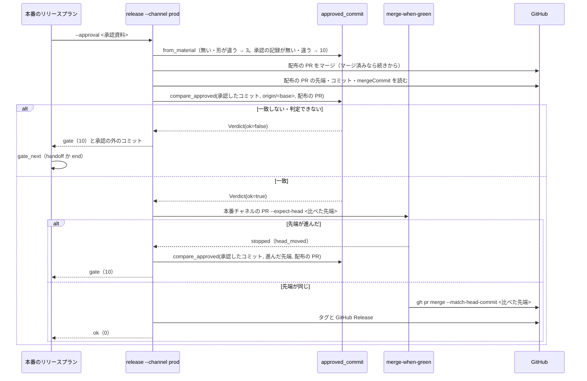

# 本番への配布の承認したコミット: 承認資料にベースブランチの先端を控え、本番チャネルへ入れる直前に承認の外のコミットがあれば承認ゲートで止まる

## 目的

- **本番への配布の承認（ゲート 2）の対象を、承認資料の「承認したコミット」（ベースブランチの先端の 40 桁）に固定する。**
  承認の後にベースブランチへ入った変更は、本番チャネル・タグ・GitHub Release のどれにも届かない
- **食い違いに気づくのは `release-steps.py` の手順の上の確認である。** 配布物の差分の数え直しのような偶然に頼らない
- **止まったときの結果 JSON だけで、承認したコミット・比べた先端・承認の外のコミットが読める。** LLM が git を
  照会し直さなくてよい

例: ndf のある版を本番へ出すとき、承認の 6 分後に別の PR がベースブランチへマージされた。

| 順 | 起きること |
| --- | --- |
| 1 | 開発版のリリースプランの `approval-facts` が、打った時点の `origin/<ベースブランチ>` の 40 桁を承認資料の「承認したコミット」の行と `metrics.approved_sha` に書く。`next` は `release ... --channel prod --approved-sha <40 桁>` |
| 2 | 利用者が承認資料を見て承認する。conductor が `approve --approval <承認資料> --approved-sha <1 の metrics.approved_sha> --by user` で「承認の記録」を書く（MVV 判定で通したときは `mvv-gate.py` が `by: mvv` で書く） |
| 3 | 別の PR がベースブランチへマージされる |
| 4 | 本番のリリースプランの `release --channel prod --approval <承認資料>` が、承認の記録と承認したコミットが等しいことを確かめ、配布の PR（`release/v<版>` → ベースブランチ）をマージする |
| 5 | 承認したコミットから `origin/<ベースブランチ>` の先端までに、配布の PR の外のコミット（3 の PR のもの）があるので、本番チャネルの PR を作らずに `gate`・終了コード 10 で止まる。`items[]` に外のコミットの SHA・件名・PR 番号が並ぶ |
| 6 | 人が外のコミットを見て、`approval-facts` で承認資料を作り直し、承認を取り直して打ち直す |

**打ち方・`status` の読み方・止まったときの次の手は Skill が正である。** ここに書き写さない。

| 何を | 正本 |
| --- | --- |
| 承認の対象が「承認したコミット」であること、承認を得たら `approve` で承認の記録を書くこと | [`release` の SKILL.md](../../plugins/ndf/skills/release/SKILL.md) の「公開前の提示と承認」 |
| `--channel prod` に承認したコミットを渡すこと、承認ゲートで止まったら MVV 判定で通さず人へ戻すこと | 同上の手順 4（公開する） |
| `approval-facts` / `approve` / `release` の打ち方、終了コード、`gate` のときの `metrics.reason`・`metrics.approved_sha`・`metrics.compared_head`・`result: unapproved` の読み方 | [`release` の references/release-steps.md](../../plugins/ndf/skills/release/references/release-steps.md) |
| リリースの承認資料の「対象を開くもの」の項目 | `development-workflow` の [references/approval-request.md](../../plugins/ndf/skills/development-workflow/references/approval-request.md) の「配布（`release`）」 |
| MVV 判定が関門 2 を通す条件（`pace: fast` / `auto`） | `development-workflow` の [references/pace.md](../../plugins/ndf/skills/development-workflow/references/pace.md) |

この文書が扱うのは、Skill に書かない常に成り立つ条件・比較の順序・ライブラリと結果 JSON の契約（止まる時点を含む）・
決定の理由・テスト観点である。

## 用語

定義は [用語集](../glossary.md) の「NDF のリリース（`ndf-release`）」が正である（`.ndf/glossary.json` の `document`）。
この文書で使う語は「承認したコミット」「比べた先端」「承認の外のコミット」「承認の記録」である。ほかに次の語を使う。

| 語 | 指すもの |
| --- | --- |
| 配布の PR | この版の `release/v<版>` → ベースブランチの Pull Request（開発版の接尾辞を外す bump・changelog・他のプラグインの bump を含む） |
| 本番チャネルの PR | ベースブランチ → 本番チャネルの Pull Request |
| 承認資料 | `issues/approval-<プラグイン>-v<版>.md`。`approval-facts` が書く |

ベースブランチ・本番チャネル・プラグイン名は宣言（`.ndf/worktree.json` の `base_branch`・`production_branch` と `.ndf/supervise.json` の `release.plugin`）と引数から読み、
`develop` / `main` を埋め込まない。

## 対象範囲

| 扱う | 扱わない |
| --- | --- |
| `release-steps.py approval-facts` が承認したコミットを書くこと | `--channel dev` の振る舞い（開発版はマージした変更がそのまま載るチャネルで、承認を要しない。引数も結果も変わらない） |
| `release-steps.py approve` が承認の記録を書くこと、`mvv-gate.py check --gate release` が `by: mvv` で書くこと | 昇格の経路（`merged-steps.py promote`）。比較の関数は promote からも呼べる形で `lib/` に置いてある（「決定の理由」） |
| `release-steps.py release --channel prod` が承認したコミットを受け取り、承認の外のコミットがあれば止まること | 承認資料のほかの欄、MVV 判定の判定の中身 |
| `merged-steps.py merge-when-green --expect-head` が比べた先端だけをマージすること | 食い違ったときに承認資料を自動で作り直して再承認を求める仕組み（止まって人へ戻すまでを扱う） |
| 本番のリリースプラン（`supervise.py new release --channel prod`。`--mvv` 付きを含む）が承認資料を渡すこと | |

## 背景

**承認は「承認した時点のベースブランチの中身」を前提にしていたが、`release` の手順はその中身をコミットで控えず、
本番チャネルへ入れる直前に比べていなかった。** ndf 10.16.0 の配布では、承認（2026-09-22T14:36Z）の 6 分後に
ミッションの外の PR #806 がベースブランチへマージされた。仕上げのフェーズが配布物の差分（119 → 124 ファイル）の
食い違いに気づいて止まり、再承認を経て配布したが、気づいたのは差分の数を数え直したからである（PR #810 の振り返り）。

**承認したコミットとマージの直前のベースブランチの先端は、正しく進めても一致しない。** 本番のリリースプランは承認の後に
配布の PR をベースブランチへマージしてから本番チャネルの PR をマージするためである。比べるのは「承認したコミットから
先端までに、配布の PR の外のコミットや中身が無いか」である。

**承認資料にコミットを書いて本番の範囲を縛る形は、手で反映する経路（`release-steps.py deploy-facts`）で既に使っていた。**
同じ形を `package-plugin` の本番の配布へ広げた。

## 仕様

### 集約

| 集約 | 持ち主（書き換えてよいもの） | 根 | エンティティ | 値オブジェクト |
| --- | --- | --- | --- | --- |
| 承認資料 | `approval-facts`（資料を書く）。承認の記録の行だけは `approve` と `mvv-gate.py check --gate release` が書く | 承認資料（`issues/approval-<プラグイン>-v<版>.md`） | — | 承認したコミット・承認の記録・前のタグ・比較の URL |
| 本番の配布 | `release --channel prod` | 本番の配布（版 1 つ） | 配布の PR・本番チャネルの PR | 承認したコミット・比べた先端・承認の外のコミット |

本番の配布は承認資料から承認したコミットを値として読むだけで、承認資料を書き換えない。

### 常に成り立つ条件

| # | 条件 | 破れたときの扱い |
| --- | --- | --- |
| I1 | 承認したコミットを受け取っていない本番の配布は、配布の PR も本番チャネルの PR もマージしない（push もしない） | `stopped`。引数が無い・`--approved-sha` の形が違う・`--channel dev` に渡した → 2、承認資料が無い・欄が無い・欄の値の形が違う → 3 |
| I2 | 承認したコミットは比べた先端の祖先である | `gate`・10。本番チャネルの PR をマージしない |
| I3 | 承認したコミットから配布の PR の先端までのコミットは、すべて配布の PR のコミットである | `gate`・10。外のコミットを `items[]` に並べる |
| I4 | 比べた先端の木は、承認したコミットに配布の PR を `git merge-tree --write-tree` で足した木と等しい | `gate`・10（`tree_differs`） |
| I5 | 本番チャネルへマージするのは比べた先端のコミットだけである | マージしない。進んだ先端で比べ直して `gate`・10 |
| I6 | 判定できない（`merge-tree` が衝突する・コミットを読めない・配布の PR のコミットを読めない）ときは通さない | `gate`・10（`undecidable`） |
| I7 | MVV 判定の承認では I2〜I6 の承認ゲートを通さない | 本番のリリースプランは `--mvv` 付きなら `handoff`、無しなら `end` へ進み、`verify` へ進まない |
| I8 | 承認資料の「承認したコミット」は `approval-facts` を打った時点の `origin/<ベースブランチ>` の 40 桁で、題の先頭 8 桁・比較の URL・`metrics.approved_sha`・`next` の `--approved-sha` と同じ値である | 1 つの変数から作る（`cmd_approval_facts`）。テストで縛る |
| I9 | 承認したコミットから比べた先端までのコミットは、すべて配布の PR のもの（そのコミット・squash の `mergeCommit`・同じ patch-id のもの）である。木が一致しても別に確かめる | `gate`・10（`outside_commits`） |
| I10 | `--approval` で受け取るときは、承認資料の「承認の記録」の SHA が同じ資料の「承認したコミット」と等しい。`approval-facts` で資料を書き直すと承認の記録は消え、承認し直すまで通らない | `gate`・10（`not_approved`）。何もマージする前に止まる |

`--approved-sha` で手で渡すときは、打った人が承認した SHA そのものを渡すため、承認の記録を見ない（I10 は `--approval` だけに当たる）。

### 処理の流れ

ドメインイベントの発生元と受け手:

| イベント | 発生元 | 受け手 |
| --- | --- | --- |
| 承認資料を書いた（承認したコミットを含む） | `approval-facts` | 承認する人・MVV 判定・本番のリリースプラン |
| ゲート 2 を承認した（承認の記録を書いた） | 人（conductor が `approve --by user`）か MVV 判定（`mvv-gate.py check --gate release`。`--advise` では書かない） | conductor・本番の配布 |
| ほかの変更がベースブランチへマージされた | 利用者か別のプラン | 本番の配布（比較で見つける） |
| 承認したコミットからベースブランチの先端までを比べた | `lib/approved_commit.py` の `compare_approved` | `release --channel prod`（一致なら本番チャネルへ、違えば承認ゲート） |
| 比べた先端を本番チャネルへマージした | `merged-steps.py merge-when-green --expect-head` | `release --channel prod`（タグと GitHub Release へ） |

### 比較の順序（`compare_approved`）

A = 承認したコミット、T = 比べた先端、H = 配布の PR の先端とする。最初に当たったもので返す。

| 順 | 見ること | 当たったときの `reason` |
| --- | --- | --- |
| 1 | A を `git cat-file -e <SHA>^{commit}` で読めるか | `unknown_commit` |
| 1 | T と H を読めるか | `undecidable` |
| 2 | `git merge-base --is-ancestor A T` | 0 でなければ `not_ancestor` |
| 3 | `git rev-list A..H` のうち、配布の PR のコミット（`gh pr view --json commits`）に無いもの | `outside_commits`（I3） |
| 4 | `git rev-list --no-merges A..T ^H` から、配布の PR の `mergeCommit` と、配布の PR のコミットと同じ `git patch-id --stable` のものを除いた残り | `outside_commits`（I9） |
| 5 | `git merge-tree --write-tree A H` の木と `T^{tree}` | 等しければ `match`、違えば `tree_differs`、`merge-tree` が失敗すれば `undecidable` |

`allowed`（入ってよい PR）を空にすると、5 は「T の木が A の木と等しいか」になる（昇格の経路から使う形）。
`allowed` が 2 つ以上のときは期待する木を作らず `undecidable` を返す。`git merge-tree --write-tree` は git 2.38 からで、
使えない git では 0 以外を返し `undecidable`（I6）に倒れる。

### `lib/approved_commit.py` の契約

git を読むだけで書かず、終了コードも出力も持たない。ブランチ名は受け取らず SHA だけを受け取る。
終了コードへの読み替えは呼び手（`release_lib/approval.py`・`mvv-gate.py`）が行う。

| 名前 | 契約 |
| --- | --- |
| `ROW` / `RECORD` | 承認資料の欄の名前 `承認したコミット` / `承認の記録` |
| `parse_sha(text)` | 40 桁の 16 進を小文字で返す。形が違えば `ValueError` |
| `material_sha(path)` | 「承認したコミット」の欄の SHA。資料・欄が無い・形が違えば `ValueError`（承認の記録は見ない） |
| `recorded_sha(path)` | 「承認の記録」の SHA。無ければ `None` |
| `from_material(path)` | 承認したコミットを返す。承認の記録が無いか SHA が違えば `Unapproved`（I10） |
| `record_approval(path, sha, by, at)` | 「承認したコミット」の行の直後へ `\| 承認の記録 \| <40 桁> を <by> が <ISO 8601> に承認 \|` を書く（あれば置き換える）。`sha` が資料の承認したコミットと違えば書かずに `Unapproved` |
| `record_all(approved, by, at)` | `{承認資料: SHA}` のそれぞれへ `record_approval` を打ち、`items`（`kind: approval`・`result: recorded` か `not_recorded`）を返す。`mvv-gate.py` が使う |
| `compare_approved(root, approved, tip, allowed)` | 上の比較の順序で `Verdict` を返す |

| 型 | 欄 |
| --- | --- |
| `Verdict` | `ok`（`match` のときだけ真）・`approved`・`tip`・`reason`・`outside: list[Outside]`・`expected_tree`・`actual_tree` |
| `Outside` | `sha`・`subject`・`pr`（`compare_approved` は空で返す。`release` が止まるときに `gh api repos/<owner>/<name>/commits/<SHA>/pulls` の先頭で埋め、読めなければ省く） |
| `AllowedPR` | `number`・`head`・`commits`・`merge_commit` |
| `Unapproved` | `ValueError` の子。`sha`（承認したコミット）と `recorded`（記録の SHA。無ければ `None`）。`release` は 10、`approve` は 1 に読み替える |

## データ・設定

### 承認資料の欄

`approval-facts` が「2. 承認の判断に使うもの」の表の先頭に `| 承認したコミット | <40 桁> |` を書く。題の先頭 8 桁と
比較の URL（`compare/<前のタグ>...<40 桁>`）は同じ値から作る。資料を書き直すとき、承認の記録の行は書かない（I10）。
承認の記録の行は `approve` か `mvv-gate.py` が「承認したコミット」の行の直後へ書く。既存の読み手（`notes --approval`・
`mvv-gate.py`）は欄の名前で読むため、行が増えても壊れない。

### `release --channel prod` の止まる時点と結果

| 場合 | 終了コード | `status` | 止まる時点 |
| --- | --- | --- | --- |
| `--approved-sha` も `--approval` も無い・`--approved-sha` の形の誤り・`--channel dev` に渡した | 2 | `stopped` | 最初（push の前）。`summary` に `--approved-sha か --approval が要る` |
| `--approval` の資料が無い・欄が無い・欄の値の形の誤り | 3 | `stopped` | 最初 |
| `--approval` の資料に承認の記録が無い・記録の SHA が違う（I10） | 10 | `gate` | 最初（何もマージしない） |
| 承認したコミットを読めない・祖先でない（I2）、承認の外のコミット（I3・I9）、木が違う（I4）、判定できない（I6） | 10 | `gate` | 配布の PR のマージの後、本番チャネルの PR の前 |
| CI 待ちの間に先端が進んだ（I5） | 10 | `gate` | 本番チャネルの PR のマージの前 |

`gate` のときの結果 JSON のうち、[references/release-steps.md](../../plugins/ndf/skills/release/references/release-steps.md)
の読み方の表に無い欄:

| 欄 | 中身 |
| --- | --- |
| `items[]`（I10） | `{"kind": "commit", "name": <承認したコミット>, "result": "not_approved", "recorded": <記録の SHA か null>}`。`next` は `approve` で承認の記録を書いて `release --approval` を打ち直すこと |
| `items[]`（木が違う） | `{"kind": "tree", "name": <比べた先端>, "result": "differs", "expected": <木>, "actual": <木>}` |
| `items[]`（祖先でない・読めない） | `{"kind": "commit", "name": <承認したコミット>, "result": "not_ancestor" か "unknown"}` |
| `items[]`（先頭） | 配布の PR の `{"kind": "pr", ..., "result": "merged"}`（I10 では無い） |
| `metrics` | `approved_sha`・`compared_head`（I10 では `null`）・`reason`・`outside`（承認の外のコミットの件数）。`main_pr` と `tag` は `null` |
| `metrics.reason` が `head_moved` | 比べ直した結果が一致したまま先端だけが進んだとき。比べ直して一致しなければ、その `reason`（`outside_commits` など） |
| `next`（I10 以外） | `approval-facts` で承認資料を作り直して承認を取り直し、`release --channel prod --approved-sha <新しい承認したコミット>` を打ち直すこと |

`ok` のときは今の `items` / `metrics` に `metrics.approved_sha` と `metrics.compared_head` が加わる。

### `merged-steps.py merge-when-green --expect-head <SHA>`

渡すと、PR を読むたびに先端をその SHA と比べる。違えば待ち直さず、**PR がマージ済みでも**マージを成功として返さずに
`stopped`（1）で止まり、`items[]` に `{"kind": "pr", "name": "#<番号>", "result": "head_moved", "head": <今の先端>, "expected": <SHA>}`
を載せる。待つ間に別の先端でマージされた PR へタグを打たないためである。一致すれば `gh pr merge --match-head-commit <SHA>`
でマージする。渡さないときは緑を確かめた先端を `--match-head-commit` に渡す。

### 本番のリリースプラン

`supervise.py new release --channel prod` の `release` のステップは、`--approval <承認資料>`（MVV 判定が読むのと同じ
`issues/approval-<プラグイン>-v<正式版>.md`）を `cmd` に持ち、`gate_next` を `--mvv` 付きなら `handoff`、無しなら `end` にする。
承認したコミットはプランの生成時ではなく、ステップの実行時に承認資料から読む。`--channel dev` のステップは変わらない。

## 決定の理由

| 決定 | 理由 |
| --- | --- |
| マージの方法によらず、木で比べる（I4） | merge / squash / rebase のどれで配布の PR を入れても、外の変更が無ければ `merge-tree` の木は一致し、外の変更が配布の PR の前に入っても後に入っても一致しない（git 2.53.0 の一時リポジトリで実測）。利用者へ届くのは木の中身である。本線のコミットを `mergeCommit` と突き合わせる形は rebase で方法ごとの分岐が要り、コミットごとに PR を照会する形は直接 push されたコミットと照会の上限に左右されるため採らない（PR 番号の照会は止まったときの表示にだけ使う） |
| 木の比較の前に、配布の PR のコミットを確かめる（I3） | 配布のブランチは `origin/<ベースブランチ>` から切られる。承認の後・プランの開始の前に外の変更が入ると、配布の PR の先端がそれを祖先に持ち、木の比較だけでは一致してしまう。GitHub は外の変更を PR のコミットに数えないため、ここで外れる |
| 木が一致してもコミットを確かめる（I9） | 外の変更とその revert が配布の PR の後に入ると木は一致する。用語集は承認の外のコミットがあれば止まると定めるため、木の結果によらずに確かめる |
| 承認したコミットの正本を承認資料の欄にし、プランは実行時に `--approval` で渡す | `pace: fast` / `auto` の本番のリリースプランはスプリントの計画の時点で組まれ、`approval-facts` はまだ走っていない。承認資料は人も MVV 判定も読む、承認したものそのものである。状態ファイルへ写すと同じ値が 2 か所にでき、食い違ったときにどちらを承認したかが決まらない。手で打つ人のために `--approved-sha` も受ける |
| 承認の記録を承認資料に書き、資料の書き直しで消す（I10） | I8 は資料を書いた時点の整合しか保証しない。承認の後に資料を書き直すと、`--approval` は新しい SHA を受け取ってしまう。`approve` には提示した資料を書いた `approval-facts` の `metrics.approved_sha` を渡す。資料を読み直した値は照合と常に一致し、提示の後の書き直しを拾えないためである。記録をスプリントの状態に置くと、スプリントの外で打つ経路で記録が無くなるため採らない。承認の前に流し直して資料を新しくするのは正しい使い方なので、書き直しは禁じない |
| `merge-when-green` に `--expect-head` を足し、読むたびに比べる（I5） | 本番チャネルの PR の先端はベースブランチそのもので、CI を待つ間にも進む。緑を確かめた先端をマージすると、進んだ分が入る。マージの後に比べ直して戻す形は、マージした時点で本番チャネルへ届いているため採らない。進んだ分は配布の PR の後に入ったものなので、比べ直すと必ず承認の外になる |
| 比べる時点は配布の PR のマージの後の 1 つ | 配布の PR はベースブランチへ入るだけで本番へは届かない。マージの前にも比べると判定の時点が 2 つになる。承認したコミットの形と有無・承認の記録だけは最初に確かめ、何もマージせずに止まる |
| 判定できないときは承認ゲートで止まる（I6） | 通すと承認の外の変更を見落としうる。失敗（1）にすると、本番のリリースプランの judge が直す（fix）か同じステップをもう一度（retry）を選び、人の承認を経ずに打ち直されうる |
| `--mvv` 付きのプランは承認ゲートで `handoff` へ進む（I7） | MVV 判定が承認したのは承認資料の中身で、承認の外のコミットは判定の材料に入っていない。人が外のコミットを見てから承認し直す。`gate_next` を置かないと、10 を受けて `next` の `verify` へ進み、配っていない版の導入を確かめに行く |
| 比べる関数を `lib/` に置く | 昇格の経路にも同じ欠けがあり、`release-steps.py` の中に置くと同じ役割の関数が 2 つになる。`allowed` を空にすれば promote の判定になる |

## 既知の制約

| 項目 | 内容 |
| --- | --- |
| 配布の PR のコミット数 | `gh pr view --json commits` は 250 件までを返す。超える配布の PR では I3 が外のコミットと誤り、止まる側に倒れる。配布の PR は bump・changelog・説明文・消費の記録の数件である |
| rebase で入れた配布の PR の `mergeCommit` | 実物で確かめていない。`mergeCommit` は承認の外のコミットの一覧から除くのにだけ使い、木の比較には使わない。違っていても、patch-id で除けないものが一覧に余分に並ぶだけで、通す・止めるの向きは止まる側である |

## テスト観点

比較は一時の git リポジトリに対する単体テスト（`plugins/ndf/scripts/tests/test_approved_commit.py`）、本番の配布は
一時の git リポジトリと `gh` の差し替え（`test_release_approved_commit.py`）で担保する。実物の GitHub での確かめは
次の本番の配布のリリース後テストで行う。

| 観点 | 満たすこと |
| --- | --- |
| 承認資料と結果に載る（I8） | `approval-facts` の `metrics.approved_sha` が打った時点の `origin/<ベースブランチ>` の 40 桁で、承認資料の欄・比較の URL・`next` の `--approved-sha` と同じであること。`from_material` で読み戻せること |
| 配布の PR だけなら通る | 承認したコミットの後が配布の PR だけのとき、merge / squash / rebase のそれぞれで `match` になり、`release` が `ok`（0）・本番チャネルの PR のマージ・`metrics.approved_sha` を返すこと |
| 承認の外のコミットで止まる（I3・I4・I9） | 外の PR が配布の PR の前に入った場合・後に入った場合・後に外の変更とその revert が入った場合（木は一致する）・外の変更を入れたマージコミット（木が違う）のどれでも止まり、`release` は `gate`（10）でタグも GitHub Release も作らず、`items[]` に外のコミットの SHA が並ぶこと |
| 承認したコミットが無ければ何もマージしない（I1） | `--channel prod` で承認したコミットが無い・形が違う・資料に欄が無いとき、`gh pr merge` も `git push` も呼ばれずに 2 / 3 で止まること。`--channel dev` に渡すと 2 であること |
| 祖先でない・読めない・判定できない（I2・I6） | 履歴に無い SHA・祖先でない SHA・`merge-tree` が衝突する場合に `gate`（10）になり、失敗（1）で返さないこと |
| 先端が進んだらマージしない（I5） | `merge-when-green --expect-head` が、緑を確かめた先端が違えば `gh pr merge` を呼ばずに `head_moved` で止まり、待つ間に別の先端でマージされた PR も成功にしないこと（`test_sprint_close_merge_green.py`）。`release` がそれを受けて `gate`（10）で止まること |
| 承認の記録（I10） | 承認の記録の後に `approval-facts` で資料を書き直すと、`release --approval` が何もマージせずに `gate`（10）・`not_approved` になること。`approve` は提示した SHA と資料が違えば記録を書かずに 1 で止まること。記録があり SHA が同じなら先へ進むこと |
| MVV 判定の記録（I10） | `mvv-gate.py check --gate release` が従うと判定したときだけ承認資料へ `by: mvv` の承認の記録を書き、判定できない場合と `--advise` では書かないこと（`test_mvv_gate.py`） |
| 本番のリリースプラン（I7） | 本番の `release` のステップが `--approval <承認資料>` を持ち、`--mvv` 付きは `gate_next: handoff`、無しは `end` であること。開発版のステップに `--approval` も `gate_next` も無いこと（`test_supervise_new.py`） |
| 退行しない | `--channel dev` の引数・`items`・`metrics` が変わらないこと。`--channel prod` で配布の PR がマージ済みのとき、打ち直しで続きから進み、一致すれば `ok` になること |
| 昇格の形 | `allowed` を空にしたとき、先端の木が承認したコミットの木と等しいかで判定すること |

## 関連リンク

- [`release` の SKILL.md](../../plugins/ndf/skills/release/SKILL.md)
- [`release` の references/release-steps.md](../../plugins/ndf/skills/release/references/release-steps.md)
- [`lib/approved_commit.py`](../../plugins/ndf/scripts/lib/approved_commit.py)
- [`release_lib/approval.py`](../../plugins/ndf/scripts/release_lib/approval.py)
- [`merged_lib/checks.py`](../../plugins/ndf/scripts/merged_lib/checks.py)（`--expect-head` の比較）
- [`supervise_lib/release_templates.py`](../../plugins/ndf/scripts/supervise_lib/release_templates.py)
- [用語集](../glossary.md)
- [版と配布](../versioning-and-distribution.md)
- [後片付けとスプリント課題を閉じる時点](ndf-cleanup-and-bundle-closing.md)（本番の配布の後の退避先の回収）
- 課題 [#815](https://github.com/devbasex/ai-plugins/issues/815)、関連する昇格の経路の課題 [#1529](https://github.com/devbasex/ai-plugins/issues/1529)
