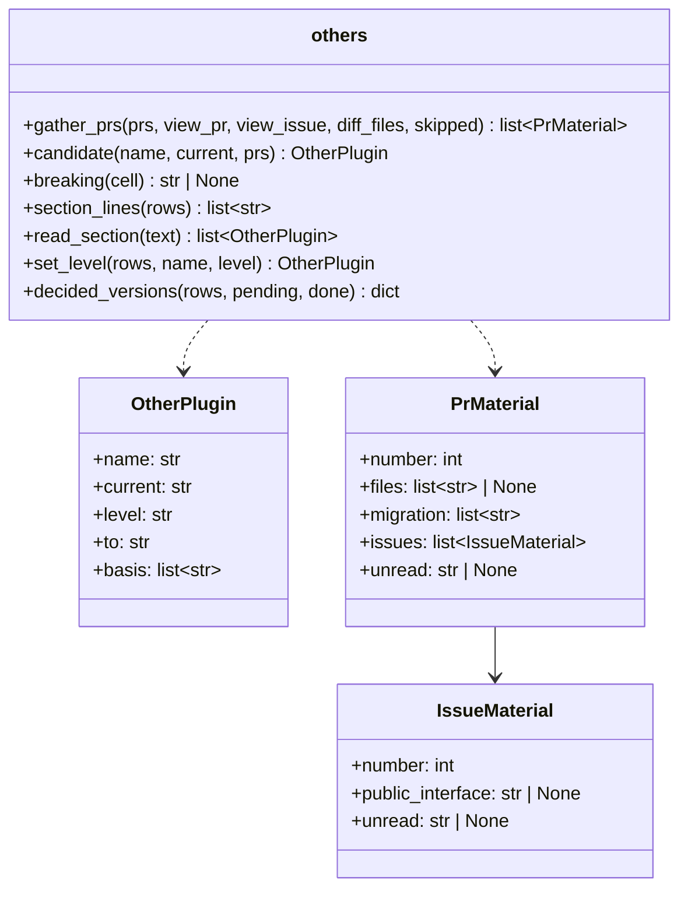
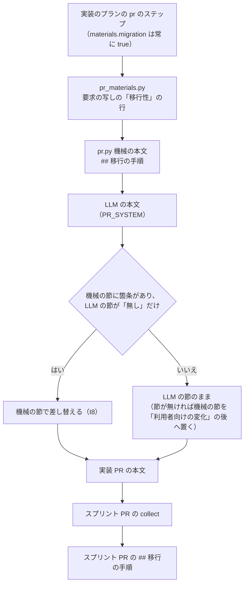

# 他のプラグインの上げ幅と移行の手順: 承認資料に上げ幅の候補と移行の手順が載り、本番は承認した上げ幅で版を上げ、移行の手順が CHANGELOG へ写る

## 目的

- **主のプラグイン（宣言の `release.plugin`）以外のプラグインの版は、PATCH に決め打たれず、互換の扱いに合った
  上げ幅で出る。** 上げ幅の候補は材料の字面から機械で出し、最終の上げ幅は承認ゲート 2（本番への配布の承認）で決まる
- **利用者の操作が要る変更の移行の手順は、人が手で足さなくても CHANGELOG の版の節へ載る。** 正は実装の PR の本文の
  `## 移行の手順` の節である
- **上げ幅の候補と根拠、移行の手順は承認資料にそろって載り、** 承認する人か MVV 判定が 1 回で判断できる

例: スプリント m744 の配布（playwright-kit から Drive への保管と `--pwk-drive-folder` を外した版）を、今の仕組みで流す。

| 順 | 起きること |
| --- | --- |
| 1 | 実装の PR の `pr` のステップが、課題 #744 の要求の写しの非機能の条件の「移行性」の行を読む。同じ要求の「影響」の「公開インタフェース」の行に互換なしの印（`互換の経路は持たない`）があるので、LLM が `## 移行の手順` を「- 無し」と書いても、移行性の行から組んだ箇条で差し替える |
| 2 | 開発版の配布のプランの `others` のステップが `changed-plugins --prs 1745 --approval <承認資料>` を打つ。スプリント PR #1745 の本文の `Closes #744` から #744 の本文を読み、#1745 のマージのコミットの差分に `plugins/playwright-kit/` があるので、playwright-kit 2.0.6 の候補は MAJOR・3.0.0、根拠は「#1745 が閉じる #744 の公開インタフェース: 互換の経路は持たない」になる |
| 3 | 承認資料に `## 版を上げる他のプラグイン` の表と `## 移行の手順` の節が載り、`## 同意を求めること` に同意の行が 1 つ足される |
| 4 | 承認ゲート 2 で承認される（上げ幅を変えるなら、承認の前に `--set playwright-kit=<上げ幅>` で表を書き直す） |
| 5 | 本番の配布のプランの `bump-others` が `changed-plugins --decided <承認資料>` で表を読み、playwright-kit を 3.0.0 へ上げる。表が読めなければ PATCH へ倒さずに止まる |
| 6 | `notes` が PR 本文の移行の手順を、CHANGELOG の主のプラグインの版の節の `### 移行の手順` の下へ `（#n）` つきで写す |

**手順は `release` と `pr` の Skill の本文が正である。** ここに書き写さない。

| 何を | 正本 |
| --- | --- |
| 本番の `bump-others` と開発版の `others` のステップの役割、上げ幅を変える操作（`--set`） | [`release` の `references/form-package-plugin.md`](../../plugins/ndf/skills/release/references/form-package-plugin.md) |
| `changed-plugins`（`--prs`・`--approval`・`--set`・`--decided`）と `notes` の呼び方、結果の要点 | [`release` の `references/release-steps.md`](../../plugins/ndf/skills/release/references/release-steps.md) |
| 変更履歴の本文を PR 本文から組むこと | [`release` の SKILL.md](../../plugins/ndf/skills/release/SKILL.md) の「3. 版と説明文書を更新する」 |
| PR 本文の `## 移行の手順` の書き方 | [`pr` の SKILL.md](../../plugins/ndf/skills/pr/SKILL.md) の「4. PR の作成・更新」 |
| 要求の「公開インタフェース」の行に互換なしの印を書くこと | [`requirements-design` の `references/spec-template.md`](../../plugins/ndf/skills/requirements-design/references/spec-template.md) の「影響」 |
| 版の付け方・チャネル・版数を持つ箇所 | [版と配布](../versioning-and-distribution.md) |

この文書が扱うのは、Skill に書かない上げ幅の候補の規則、承認資料の節と結果 JSON の形、常に成り立つ条件、決定の理由、
テスト観点である。

## 用語

定義は [用語集](../glossary.md) が正である（`.ndf/glossary.json` の `document`）。この文書で使う語は「他のプラグイン」
「上げ幅」「移行の手順」「互換なしの印」である。

## 対象範囲

| 扱う | 扱わない |
| --- | --- |
| 配布の形が `package-plugin` のときの、他のプラグインの上げ幅の候補・承認資料の表・本番の上げ方 | 主のプラグインの上げ幅の決め方（配布のプランの `--version` で決まる） |
| PR 本文の `## 移行の手順`（`pr-steps.py template` の雛形・実装のプランの `pr` のステップ・スプリント PR の `collect`） | 他のプラグイン自身の CHANGELOG の版の節（`## [playwright-kit 3.0.0]` のような節）と README の更新の節の自動作成 |
| `notes` が移行の手順を CHANGELOG・主のプラグインの README・承認資料へ写すこと | `package-plugin` 以外の配布の形 |
| | 上げ幅の規則（セマンティックバージョニング）・取得元・既定ブランチ |

## 背景

本番の配布は他のプラグインの版を PATCH に決め打って上げ、承認ゲート 2 の承認資料にも他のプラグインの版が
載っていなかった。m744 では MAJOR の要る playwright-kit 2.0.6 が、利用者が承認ゲート 2 の直前に気付いて手で
直さなければ 2.0.7 で出ていた。移行の手順も PR 本文に書く節が無く、CHANGELOG へ写す工程も無かった。

**手で CHANGELOG へ足した移行の手順は残らない。** `notes` は版の節の中身を PR 本文の箇条で差し替えるため、版の節へ
手で足した文は次の `notes` で消える（10.17.61 で実測）。移行の手順の正を PR 本文の節に置くのはこのためである。

## 仕様

### 構成要素

| 要素 | 責務 |
| --- | --- |
| [`release_lib/others.py`](../../plugins/ndf/scripts/release_lib/others.py) | 上げ幅の候補を材料の字面から決める処理、承認資料の `## 版を上げる他のプラグイン` の節の組み立て・読み取り・書き換え（`--set`）、本番で上げる版の確かめ（`decided_versions`） |
| [`release_lib/changed.py`](../../plugins/ndf/scripts/release_lib/changed.py) | PR・課題・マージのコミットの読み取りと、承認資料のファイルの読み書き |
| [`release-steps.py`](../../plugins/ndf/scripts/release-steps.py) の `changed-plugins` / `notes` | 他のプラグインの列挙と結果の出力。`notes` は移行の手順を版の節・README の更新の節・承認資料へ写す |
| [`lib/versions.py`](../../plugins/ndf/scripts/lib/versions.py) の `next_version` | 上げ幅で上げた正式版（接尾辞付きはその基底から上げる） |
| [`lib/gh_sections.py`](../../plugins/ndf/scripts/lib/gh_sections.py) の `section_items` | 節の箇条を `<本文>（#n）` で返す。「利用者向けの変化」「未検証・残る危険」「移行の手順」の 3 つが同じ処理を使う |
| [`lib/closing.py`](../../plugins/ndf/scripts/lib/closing.py) | 閉じる語（`Closes #n` など）の読み取り。`pr-steps.py` と `release-steps.py` が使う |
| [`supervise_lib/release_templates.py`](../../plugins/ndf/scripts/supervise_lib/release_templates.py) | 開発版のプランの `others` のステップと、本番の `bump-others` に渡す `--decided <承認資料>` |
| [`supervise_lib/pr_materials.py`](../../plugins/ndf/scripts/supervise_lib/pr_materials.py)・[`pr.py`](../../plugins/ndf/scripts/supervise_lib/pr.py)・[`prompts.py`](../../plugins/ndf/scripts/supervise_lib/prompts.py) の `PR_SYSTEM` | PR 本文の `## 移行の手順`（要求の移行性の行の読み取り・機械の節での差し替え・スプリント PR への集約） |

### 集約

| 集約 | 持ち主（書き換えてよいもの） | 根 | エンティティ | 値オブジェクト |
| --- | --- | --- | --- | --- |
| 承認資料 | `release-steps.py`（`approval-facts` が作り、`notes --approval` と `changed-plugins --approval` が自分の節だけを書く） | 承認資料（`issues/approval-<主>-v<版>.md`） | 他のプラグインの行（プラグイン名で識別） | 上げ幅・版・根拠・移行の手順の箇条 |
| PR 本文 | `pr` のステップ（`supervise_lib/pr.py`）と `pr-steps.py` | PR 本文 | 移行の手順の節 | 移行の手順の箇条（`（#n）` つき） |
| CHANGELOG の版の節 | `release-steps.py`（`changelog` が作り、`notes` が中身を差し替える） | 版の節（`## [<主> <版>]`） | 移行の手順の小見出し（`### 移行の手順`） | 箇条 |
| 他のプラグインの版 | `release-steps.py bump` | `plugins/<名前>/.claude-plugin/plugin.json` の `version` | — | 版 |

**承認資料の他のプラグインの行は `changed-plugins --approval` だけが書く。** 本番の `bump-others` は読むだけで書かない。
承認資料はメインディレクトリの `issues/` に置かれてコミットされず、本番の `bump-others` は `release/v<版>` の worktree
から元のリポジトリのパスで読む（MVV 判定の `--material` と同じパス）。



`OtherPlugin.level` は `MAJOR` / `MINOR` / `PATCH` / `上げ済み` のどれかである。`PrMaterial.files` は PR のマージの
コミットの第 1 親との差分のパスで、読めなければ `None`。`IssueMaterial.public_interface` は課題の本文の `## 影響` の
表で 1 列目が「公開インタフェース」の行の 2 列目である。

### 常に成り立つ条件

| # | 集約 | 条件 | 破れたときの扱い |
| --- | --- | --- | --- |
| I1 | 承認資料 | 他のプラグインの行の上げ幅は `MAJOR` / `MINOR` / `PATCH` / `上げ済み` のどれかで、`上げ済み` 以外の行の「上げた後の版」は「今の版」をその上げ幅で上げた値に等しい | 本番の `bump-others` が終了コード 1 で落ち、judge へ進む。PATCH へ倒さない |
| I2 | 他のプラグインの版 | 本番で版を上げるプラグインの集合は、承認資料の行のうち `上げ済み` でない行（途中まで上げ終えた行を除く）の集合に等しい | 同上 |
| I3 | 承認資料 | 上げ幅の候補は材料の字面だけで決まり、LLM を挟まない（規則は「上げ幅の候補の規則」） | — （同じ材料からは同じ候補が出る） |
| I4 | 承認資料 | 材料を読めない PR があれば、候補は PATCH のままで、根拠の欄に読めなかったことが書かれる | — |
| I5 | 他のプラグインの版 | 前のタグから既に版が変わっているプラグインは上げ直さない（`上げ済み` の行・`metrics.already`） | — |
| I6 | CHANGELOG の版の節 | 移行の手順を持つ PR が 0 件なら、版の節と主のプラグインの README の更新の節に `### 移行の手順` を作らない | — |
| I7 | CHANGELOG の版の節 | 移行の手順の箇条は `### 移行の手順` の下にだけ並び、どの箇条にも PR 番号が付く | — |
| I8 | PR 本文 | 要求の非機能の条件に「移行性」の行があり、同じ要求の「公開インタフェース」の行に互換なしの印がある課題の実装 PR の `## 移行の手順` は「無し」にならない | `pr` のステップが要求の行から組んだ箇条で節を差し替える |
| I9 | 承認資料 | 主のプラグインは他のプラグインの行に載らない | — （列挙の段で除く） |

### ドメインイベント

| # | イベント | 発生元 | 受け手 |
| --- | --- | --- | --- |
| E1 | 実装 PR の本文に `## 移行の手順` の節を書いた | 実装のプランの `pr` のステップ | スプリント PR の `collect`、`notes`、`changed-plugins` |
| E2 | 前のタグからの差分にある他のプラグインを列挙した | 開発版のプランの `others` のステップ | E3 |
| E3 | 他のプラグインごとに上げ幅の候補を決めた | `changed-plugins --prs` | E4 |
| E4 | 承認資料に他のプラグインの表と移行の手順を書いた | `changed-plugins --approval`・`notes --approval` | 承認ゲート 2（人か MVV 判定） |
| E5 | 承認ゲート 2 で上げ幅が決まった | 利用者の承認か MVV 判定（変えるときは `changed-plugins --approval --set`） | E6 |
| E6 | 本番の配布で他のプラグインの版を決まった上げ幅で上げた | 本番のプランの `bump-others`（`changed-plugins --decided`） | `bump` |
| E7 | CHANGELOG の主のプラグインの版の節に移行の手順を写した | 開発版と本番の `notes` | 利用者（CHANGELOG と README の更新の節） |

`others` と `bump-others` は落ちたら judge へ進む。開発版の `others` は `explain`（`notes --approval`）の次に置かれ、
助言の MVV 判定（`pace: normal`）はその後に走るため、他のプラグインの表も判定の材料に入る。

### 上げ幅の候補の規則

他のプラグイン P の範囲は、前のタグからの差分にファイルがある `plugins/<名前>/` か `plugins/mcp/<名前>/` のうち、
主のプラグインを除いたものである。P の候補は、版に含む PR のうちマージのコミットの差分が P のパスに触れた PR の
材料だけから決める。未マージの PR は材料に入れない（結果の items に `skipped` で出る）。

| 材料 | MAJOR になる条件 | 根拠の欄 |
| --- | --- | --- |
| PR 本文の閉じる語が指す課題の本文 | `## 影響` の表の「公開インタフェース」の行に互換なしの印（`互換なし` か `互換の経路は持たない`）がある | `#<PR> が閉じる #<課題> の公開インタフェース: <印>` |
| PR 本文の `## 移行の手順` | 箇条のどれかが P の名前に語として触れる（前後が英数字と `-` でない） | `#<PR> の移行の手順が <P> に触れる` |

- どちらにも当たらなければ `PATCH` で、上げた後の版は `--prs` を渡さないときと同じ値になる。根拠は
  「材料に互換の無い変更の記述が無い」
- MINOR の候補は出さない。MINOR は承認ゲート 2 で `--set <名前>=MINOR` として選ぶ
- マージのコミットの差分を読めない PR は、どのプラグインに触れたか分からないため、すべての行の根拠に
  「#<PR> を読めない（<理由>）」を書く。閉じる課題の本文を読めないときも、根拠に「#<PR> が閉じる #<課題> を読めない」を書く
- 「互換の無い削除はしない」のような否定の文は印に当たらない（印は 2 つの語に固定している）

### 本番で上げる版の確かめ（`--decided`）

`--decided` は承認資料の表を読み、差分にあってまだ上げていないプラグインの集合と照らして、I1・I2 を満たすときだけ
`items[].to` を返す。表の行のうち、差分の側では前のタグから版が変わっていて、その HEAD の版が表の「上げた後の版」と
同じ行は、途中まで進んだ版上げで上げ終えたものとして外す。版上げの途中から本番のプランを再開しても通るためである。

**他のプラグインが 0 件の版では承認資料を読まない。** 承認資料の無い本番の配布を、関係の無い理由で止めないためである。

### PR 本文の移行の手順



- 要求の写し（`issues/issue-<番号>-requirements.md`）の `## 非機能の条件` の表で 1 列目が「移行性」の行は、印の有無に
  よらず `PR_SYSTEM` への材料に渡る
- 機械の節の箇条になるのは、同じ要求の「公開インタフェース」の行に互換なしの印がある課題の行だけで、形は
  `<行の中身>（#<課題>の要求の移行性）` である。印が無ければ機械の節は「- 無し」で、LLM が「無し」と書いてもそのまま残る
- スプリント PR の `collect` は、ブランチへマージした実装の PR の `## 移行の手順` の箇条を `（#n）` つきで集める。集めた
  箇条があれば、LLM の「無し」は集めた箇条で差し替わる
- LLM の書いた具体的な手順は、「無し」でない限り残る

## データ・設定

### 承認資料の節

`changed-plugins --approval` は `## 同意を求めること` の前へ次の節を置き、走らせ直したら差し替える。

```markdown
## 版を上げる他のプラグイン

上げ幅は材料から機械で出した候補である。変えるときは `release-steps.py changed-plugins --approval <この資料> --set <名前>=<上げ幅>` で書き直してから承認する。

| プラグイン | 今の版 | 上げ幅 | 上げた後の版 | 根拠 |
| --- | --- | --- | --- | --- |
| playwright-kit | 2.0.6 | MAJOR | 3.0.0 | #1745 が閉じる #744 の公開インタフェース: 互換の経路は持たない |
| mcp-serena | 1.4.2 | 上げ済み | 1.5.0 | 前のタグから版が変わっている |
```

| 列 | 値 |
| --- | --- |
| プラグイン | 他のプラグインの名前 |
| 今の版 | 前のタグの版（前のタグに無ければ `—`） |
| 上げ幅 | `MAJOR` / `MINOR` / `PATCH` / `上げ済み` |
| 上げた後の版 | 今の版を上げ幅で上げた版（`上げ済み` の行は HEAD の版） |
| 根拠 | 候補を決めた材料。複数なら `<br>` で区切る。`--set` で変えた行は先頭に「承認ゲート 2 で <上げ幅> に決めた」が付く |

- 0 件なら節の中身は「- 無し」である
- `上げ済み` でない行が 1 つ以上あれば、`## 同意を求めること` の箇条の末尾へ
  「- [ ] 「版を上げる他のプラグイン」の表の上げ幅で、他のプラグインの版を上げる」を 1 つ足す（既にあれば足さない）
- `--set` は表に無い名前・`上げ済み` の行・知らない上げ幅を終了コード 2 で拒む

`notes --approval` は同じ位置へ `## 移行の手順` の節を置き、走らせ直したら差し替える。中身は PR ごとの箇条
（`（#n）` つき）で、0 件なら「- 無し」である。

### CHANGELOG と README の更新の節

`notes` は版の節の中身を次の形に差し替える（版数と日付は例）。主のプラグインの README の
`## v<版> へ更新するとき` の節にも同じ形で書く。移行の手順を持つ PR が 0 件なら `### 移行の手順` を作らない（I6）。

```markdown
## [ndf 10.17.62] - 2026-10-10

- <利用者向けの変化の箇条（#n）>

### 移行の手順

- <移行の手順の箇条（#n）>
```

`### ` の小見出しは、版の節の境を `## ` で決める既存の読み取りの中に留まる。

### `changed-plugins` の結果

既存のキーは残し、`items[]` に `level`（小文字）と `basis` が増える。`metrics.decided` は `--decided` で読んだ承認資料のパス
（読まなければ `null`）である。

```json
{"tool": "release-steps", "status": "ok",
 "items": [{"kind": "plugin", "name": "playwright-kit", "result": "bump",
            "from": "2.0.6", "to": "3.0.0", "level": "major",
            "basis": ["#1745 が閉じる #744 の公開インタフェース: 互換の経路は持たない"]}],
 "metrics": {"since": "ndf--v10.17.60", "plugins": 1, "already": [], "decided": null}}
```

材料を渡さないとき（`--prs` も `--decided` も無い）は今までどおり PATCH の版を返し、`level: "patch"`・
`basis: ["材料を渡していない"]` が付く。

| 終了コード | いつ |
| --- | --- |
| 0 | 列挙し終えた（`--approval` なら書き、`--decided` なら読み、`--set` なら書き直し終えた） |
| 1 | `--decided`: 節が無い・表の列が違う・上げ幅を読めない・今の版か上げた後の版が合わない（I1）・集合が合わない（I2）。`--approval`: 承認資料が無い |
| 2 | 前のタグが無い・版を読めない・引数の組み合わせが違う（`--decided` と `--prs` / `--approval`、`--approval` の無い `--set`）・`--set` の値が違う |

## 決定の理由

| 決定 | 理由 |
| --- | --- |
| 互換の判定の材料は、要求の「公開インタフェース」の行の互換なしの印と、プラグインの名前に触れる移行の手順の 2 つにする | 要求の雛形には互換の扱いを書く場所が既にある。印を 2 つの語に固定するのは、「変わる」「互換の無い」だけでは否定の文と区別できないためである。PR 本文に専用の印の節を設けると、要求と PR の 2 か所で同じ判断を書くことになる |
| 決まった上げ幅の置き場は承認資料の表にし、変える経路は `--set` の 1 つにする | 承認ゲート 2 で人と MVV 判定が読むのは承認資料であり、本番が同じ表を読めば承認した値と上げる値が食い違わない。状態ファイルに置けば 2 か所に同じ値が並び、プランの引数で渡せば MVV 判定で通るときに写す者がいない |
| 本番の `bump-others` は表を読めなければ止まり、PATCH へ倒さない | 互換の無い変更が PATCH で出た失敗は、黙った既定値から起きた |
| MINOR の候補は出さない | 機能の追加だけを示す記述は要求の雛形に固定の語が無く、字面からは決められない。PATCH は今の値と同じで、見落としの向きの退行は起きない |
| 課題は PR 本文の閉じる語から読む | 宛先が既定ブランチでない PR（スプリント PR）は、GitHub の `closingIssuesReferences` が空になる |
| 節の箇条を読む処理を `gh_sections.section_items` の 1 つにする | 「利用者向けの変化」と同じ処理が移行の手順でも要り、3 か所目を書き足さない |
| 機械の節で差し替えるのは、互換なしの印がある課題に限る | 印の無い移行性の行の多くは「利用者の操作は要らない」と書く。それを写すと操作の無い箇条が CHANGELOG に載り、プラグインの名前に触れれば互換の変更が MAJOR の候補になる |
| 移行の手順は主のプラグインの版の節の中へ `### 移行の手順` で置く | 既存の版の節の読み取りを変えない。小見出しの語を PR 本文の節とそろえる |

## 残る制約

| 項目 | 内容 |
| --- | --- |
| 印の付け漏れ | 互換なしの印も移行の手順も書かれていない互換の無い変更は、候補が PATCH のまま承認資料に載る。承認する人が根拠の欄の「材料に互換の無い変更の記述が無い」を見て判断する |
| MAJOR の過剰 | 1 つの PR が互換の無い課題と、関係の無いプラグインの小さな変更を同時に持つと、そのプラグインも MAJOR の候補になる。承認ゲート 2 で `--set` で下げる |
| 版の節へ手で足した文 | 次の `notes` で消える。正は PR 本文の節だけである |
| プラグインの置き場の決め方 | `changed-plugins` はプラグインの置き場を名前で決め打っている（[#1756](https://github.com/devbasex/ai-plugins/issues/1756)） |

## テスト観点

スクリプトの単体テストで担保する。gh の出力は偽の `gh` で渡す。

| 観点 | 満たすこと | テスト |
| --- | --- | --- |
| 開発版のプランの `others` | package-plugin の開発版のプランに `changed-plugins --prs --approval` のステップがあり、本番の `bump-others` が `--decided <承認資料>` を渡すこと。開発版は他のプラグインの版を上げないこと | `plugins/ndf/scripts/tests/test_supervise_new.py` |
| m744 の再現（I3） | playwright-kit 2.0.6・スプリント PR #1745 の本文と `Closes #744`・#744 の本文で、候補が MAJOR・3.0.0 になり、承認資料の表に 5 列がそろうこと | `plugins/ndf/scripts/tests/test_release_steps.py` |
| 材料の字面（I3） | 移行の手順がプラグインの名前に触れる PR でも MAJOR、否定の文だけの行と印の無い材料は PATCH で、PATCH の `to` は材料を渡さないときと同じであること | 同上 |
| 読めない材料（I4） | マージのコミットを読めないとき PATCH で、根拠に読めなかったことが出ること | 同上 |
| 0 件 | 他のプラグインが無ければ節の中身が「- 無し」になること | 同上 |
| 決まった上げ幅（I1・I2） | 表が MAJOR なら `--decided` が 3.0.0 を返し、`--set` で変えた上げ幅（MINOR・2.1.0）も通ること。表が無い・上げ幅を読めない・版や集合が合わないとき終了コード 1 になること | 同上と `test_supervise_new.py` |
| 上げ済み（I5） | 前のタグから版が変わったプラグインが `already` に入り、上げ直さないこと。途中まで上げた版上げから再開できること | `test_release_steps.py` |
| 引数の組み合わせ | `--approval` の無い `--set`・表に無い名前・知らない上げ幅で終了コード 2 になること | 同上 |
| PR 本文の節（I8） | 雛形と `PR_SYSTEM` と機械の本文が `## 移行の手順` を持つこと。互換なしの印がある要求で LLM が「無し」を返すと要求の行で差し替わり、印が無ければ「無し」のまま残り、LLM の書いた手順は残ること | `test_supervise.py`・`test_pr_steps.py` |
| スプリント PR | `collect` が実装の PR の移行の手順を `（#n）` つきで集めること | `test_sprint_procedures.py` |
| CHANGELOG への写し（I6・I7） | `notes` が移行の手順を `### 移行の手順` の下へ `（#n）` つきで写し、README の更新の節にも写ること。0 件なら見出しを作らないこと | `test_release_steps.py` |

**リリース後テストで確かめる観点:** 次に他のプラグインを含む版を出すとき、承認ゲート 2 の承認資料に他のプラグインの表と
移行の手順の節が載り、承認した上げ幅で本番の版が出ること。

## 関連リンク

- [`release` の `references/form-package-plugin.md`](../../plugins/ndf/skills/release/references/form-package-plugin.md)
- [`release` の `references/release-steps.md`](../../plugins/ndf/skills/release/references/release-steps.md)
- [`pr` の SKILL.md](../../plugins/ndf/skills/pr/SKILL.md)
- [`requirements-design` の要求の雛形](../../plugins/ndf/skills/requirements-design/references/spec-template.md)
- [版と配布](../versioning-and-distribution.md)
- [リリースコマンドの設定と、版ごとのトークン消費の記録](ndf-release-steps-and-token-usage-snapshot.md)
- 課題 [#1752](https://github.com/devbasex/ai-plugins/issues/1752)
- [PR #1757](https://github.com/devbasex/ai-plugins/pull/1757) — 設計
- [PR #1762](https://github.com/devbasex/ai-plugins/pull/1762) — 実装
- 課題 [#1755](https://github.com/devbasex/ai-plugins/issues/1755) — リリース済みの 10.17.61 の節から消えた移行の手順
