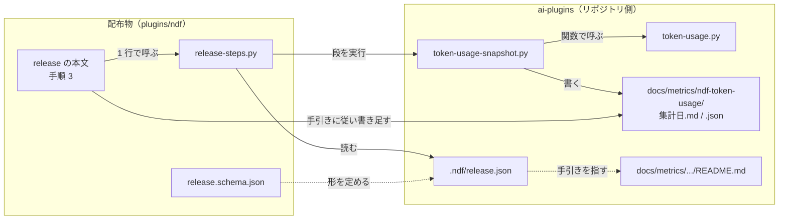
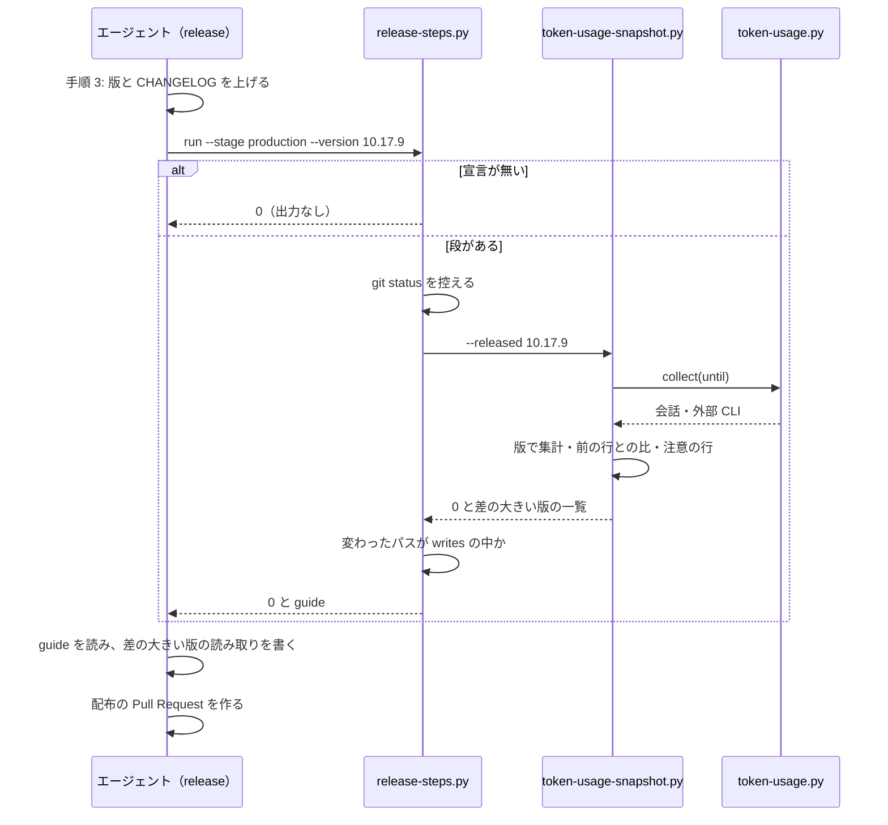

# 配布の段の宣言と、版ごとのトークン消費の記録

リポジトリに固有の配布の手順を、`release` の本文ではなくリポジトリの宣言 `.ndf/release.json` が
「段」として持つ。`release` は手順 3 で、宣言された段を 1 行のコマンド（配布物の
`plugins/ndf/scripts/release-steps.py`）で走らせるだけである。このリポジトリは段を 1 つ宣言し、
正式版を出すたびに版ごとのトークン消費と所要時間の記録（`docs/metrics/ndf-token-usage/<集計日>.md` /
`.json`）を配布の Pull Request へ載せる。この文書は、段の実行と記録の書き出しの契約と、決めたことの
理由を残す。

**呼び方・宣言の書き方・終了コードの扱いは `release` の `references/release-steps.md` が正である。**
段を呼ぶ時点は `release/SKILL.md` の「3. 版と説明文書を更新する」が持つ。記録の読み方と、エージェントが
書く読み取りの手引きは `docs/metrics/ndf-token-usage/README.md` が正である。

| 何を読むか | 正本 |
| --- | --- |
| 実行のコマンド、段階の値、宣言の項目、終了コードとどうするか | `plugins/ndf/skills/release/references/release-steps.md` |
| 宣言の定義（編集時の補完） | `plugins/ndf/skills/release/schemas/release.schema.json` |
| 段の選び方と変更の判定の手続き | `plugins/ndf/scripts/release-steps.py` と、この文書の「仕様」 |
| 記録の節と読み取りの書き方 | `docs/metrics/ndf-token-usage/README.md` |
| 記録の書き出しの手続き | `scripts/token-usage-snapshot.py` と、この文書の「仕様」 |

## 例: 10.17.9 を正式版として出すとき

`release` の手順 3 で、版と `CHANGELOG.md` を上げた後、配布の Pull Request を作る前に 1 行打つ。

```bash
python3 "$SCRIPTS/release-steps.py" run --root . --stage production --version 10.17.9
```

このリポジトリの `.ndf/release.json` は段を 1 つ宣言しており、上のコマンドは根で次を実行する。

```bash
python3 scripts/token-usage-snapshot.py --released 10.17.9
```

段は `docs/metrics/ndf-token-usage/2026-09-30.md` / `.json`（打ち切りの UTC の日付が 2026-09-30 の場合）を
書く。表の先頭の行は前の記録（`2026-09-24.json`）の最後の版の 10.17.7 で、そこから 10.17.8・
10.17.9-dev.1 までの行が続き、各行に前の行との比が付く。前の行との比が ±30% を超えた版があれば段は
それを挙げ、`release-steps.py` は `guide: docs/metrics/ndf-token-usage/README.md` を出す。エージェントは
その手引きに従って挙がった版の読み取りだけを書き足し、できたファイルを配布の Pull Request に入れる。

## 概要

| 機能 | 誰が使うか |
| --- | --- |
| リポジトリが宣言した配布の段を、配布の段階に合わせて走らせる | `release` を実行するエージェント（どのリポジトリでも） |
| 配布の段を宣言する | リポジトリの管理者 |
| 正式版を出すときに、版ごとのトークン消費と所要時間の記録を書き出す | ai-plugins の配布の担い手 |
| 前の行との差が大きい版を知らせ、読み取りを書く手引きを示す | 同上 |

**`release` の本文は「宣言があれば走らせる」の 1 段だけを持つ。** 宣言の無いリポジトリでは何も
出力せずに 0 で終わる。`scripts/token-usage.py` などこのリポジトリに固有の語は、`release` の本文と
その参照に現れない。

**判断の要らない部分はすべてスクリプトが書き、エージェントには差の大きい版の読み取りだけを残す。**

### 構成要素

| 要素 | 置き場所 | 責務 |
| --- | --- | --- |
| `release` の本文 | `plugins/ndf/skills/release/SKILL.md` | 手順 3 で宣言された配布の段を走らせる。完了の判定に「段が 0 で終わり、手引きの判断を済ませた」を持つ |
| 段の参照 | `plugins/ndf/skills/release/references/release-steps.md` | 宣言の書き方・段階の値・終了コード |
| 宣言の定義 | `plugins/ndf/skills/release/schemas/release.schema.json` | 宣言の JSON Schema |
| 段の実行 | `plugins/ndf/scripts/release-steps.py` | 宣言を読み、段階に合う段を順に実行する。書いてよい場所の外が変わったら失敗にする |
| このリポジトリの宣言 | `.ndf/release.json` | 段は 1 つ（トークン消費の記録） |
| 記録の書き出し | `scripts/token-usage-snapshot.py` | `token-usage.py` を読み込み、記録の `.md` / `.json` を書き出す。差の大きい版を挙げる |
| 集計の本体 | `scripts/token-usage.py` | 記録の読み込みと外部 CLI の寄せ方を `collect(...)` として関数で提供する |
| 記録の手引き | `docs/metrics/ndf-token-usage/README.md` | 記録の読み方と、エージェントが書く読み取りの手引き |



外へ書くのは作業ツリーのファイルだけである。記録が読むのは配布する人の手元の記録
（`~/.claude/projects` / `~/.codex/sessions` / `~/.kiro/sessions/cli`）だけで、他の開発者の分は入らない。
GitHub へ出すのは `release` の既存の手順（配布の Pull Request）で、段は push しない。

## 用語

| 用語 | 意味 |
| --- | --- |
| 段 | 宣言が持つ 1 つのコマンド。配布の段階ごとに `release` の手順 3 で走る |
| 宣言 | リポジトリ側に置く `.ndf/release.json`。無ければ何も走らない |
| 段階 | 配布の種類。`production`（本番への配布: 正式版を公開する・本番へ反映する）/ `verification`（検証への配布: 開発版を公開する・検証環境へ反映する） |
| 書いてよい場所 | 段の `writes` が挙げるパスの前置き。段がその外を変えたら失敗にする |
| 手引き | 段の `guide` が指す文書。段が 0 で終わった後、エージェントが判断する部分の書き方を持つ |
| 記録 | `docs/metrics/ndf-token-usage/<集計日>.md` と同名の `.json` の 1 組 |
| 打ち切りの時刻 | 集計に入れる記録の上限の時刻（`--until`）。集計日はこの UTC の日付 |
| 前の記録 | 今回の記録の起点になる、既にある記録（決め方は「前の記録と表の最初の行」） |
| 差の大きい版 | 「版ごとの差」の表で、前の行との比が ±30% を超えた版 |
| 読み取り | 差の大きい版ごとに 1〜3 行で書く、差が作業の中身の違いか版の変更の効果かの判断。エージェントが書く |

## 背景

`release` は他のリポジトリでも実行される。本文にこのリポジトリの手順（`scripts/token-usage.py` など）を
書くと、他のリポジトリでは存在しない手順になり、AUTHORING.md の「対象リポジトリを仮定しない」
（`check-skill-repo-assumptions.py`）にも反する。宣言にすれば、本文は「宣言があれば走らせる」の 1 段で
済み、宣言が無いリポジトリでは何も起きない。`.ndf/instructions.json`・`.ndf/document.json` と同じ
置き方である。リポジトリ側の手順書にだけ書く形は採らない。読むかどうかがエージェント次第になり、
実行したかを確かめる手段が無いためである。

手元の記録は 90 日で消える。版ごとの差をあとから比べるには、配布のたびに集計値を消えない場所へ
残す必要がある。

## 決定と理由

- **記録は本番への配布のときだけ残す。** 開発版と正式版は同じ日に出ることがあり（10.17.8-dev.1 と
  10.17.8 は 9 分差）、開発版のたびに残すとほぼ同じ内容の記録が並ぶ。開発版の会話は、次の正式版の
  記録に版の行として入る
- **記録は配布の Pull Request に含め、別の Pull Request にしない。** マージと配布の手順が増えない。
  記録は `docs/` の下で配布物ではないため、`release` の「配布そのものを目的とする変更は対象外」の
  規定にもそのまま収まる
- **判断の要らない部分はすべてスクリプトにする。** 集計・表・前の行との比・比べるときの注意は記録の
  値と `CHANGELOG.md` から一意に決まる。決まらないのは「なぜその値になったか」で、同じ版の中の作業の
  大きさの違いは会話の中身を知らないと書けない。読み取りまでスクリプトにしないのは、値の上下だけでは
  版の効果と作業の大きさの違いを読み分けられないためである
- **しきい値は ±30% とする。** 10.17.x の 7 つの比では -17% と -7% の 2 つが内に入り、残る 5 つが超える。
  内に入る差は作業の大きさのばらつきと区別できないため、読み取りを求めない
- **表の最初の行は前の記録の最後の版にする。** 記録どうしが 1 行ずつ重なり、差が途切れずにつながる。
  前の正式版から始めると、前の正式版で始めた会話が 1 件も無いとき（10.17.4 の例）最初の行が無く、
  比の起点が決まらない
- **集計の本体は読み込みで呼び、サブプロセスで 2 回走らせない。** 記録の読み込みは 1 回で約 35 秒かかる。
  版ごとと全軸の 2 つの集計は、1 回読み込んだ値から作る
- **同じ日に別の版の記録があるときは `-2` を付けて別に作り、同じ版の記録は書き直す。** 別の版の記録を
  上書きすると、コミット済みの記録を作業ツリーで消すことになる。同じ版で走らせ直したときはファイルを
  増やさない
- **段に書いてよい場所を宣言させ、外を変えたら失敗にする。** 段は任意のコマンドで、配布の Pull Request に
  何が混ざるかを本文から読めない。宣言させれば、差分に段の分として何が入りうるかが宣言から決まる

## 仕様

### 常に成り立つ条件

- 宣言が無いリポジトリで `release-steps.py run` は何も出力せず 0 で終わる
- 段はシェルを通さず、`--root` を作業ディレクトリにして実行する。`--root` と別のディレクトリから
  呼んでも同じである
- 段が書いてよい場所の外を変えたら、実行は 1 で終わる。0 以外の終了コードを 0 へ畳まない
- 記録の `.md` / `.json` に会話の本文・ファイルのパス・リポジトリ名・会話の ID が現れない
- 別の版の記録を上書きしない

### `release-steps.py` の入出力

```text
release-steps.py run   --root <dir> --stage production|verification --version <版> [--dry-run]
release-steps.py check --root <dir>
```

| 引数 | 既定 | 意味 |
| --- | --- | --- |
| `--root` | `.` | リポジトリの根。宣言を `<root>/.ndf/release.json` から読み、段の作業ディレクトリにする |
| `--stage` | 必須（`run`） | `production` / `verification` |
| `--version` | 必須（`run`） | 配る版。段の `command` の `{version}` を置き換える |
| `--dry-run` | 無し | 実行せず、走らせる段・置き換えた後の `command`・`writes`・`guide` を出す |

| 終了コード | 意味 |
| --- | --- |
| 0 | 宣言が無い（`run` は何も出力しない）、段階に合う段が無い、またはすべての段が 0 で終わり書いてよい場所の中だけが変わった |
| 1 | 段が 0 以外で終わった・時間切れ・起動できない・段の前の `git status` を取れない・書いてよい場所の外が変わった。最初に落ちた段で止める |
| 2 | `check` だけが返す。宣言が無い |
| 3 | 宣言が読めない。`宣言を読めない（.ndf/release.json）: <項目>: <理由>` を標準エラーに出す |

**宣言が無いとき、`run` は 0、`check` は 2 を返す。** `run` は `release` の手順 3 から毎回呼ばれるため、
宣言の無いリポジトリで止めない。`check` は宣言の有無で分岐する側のためのもので、
`worktree-setup.sh check` と同じく「無い」を別の値で返す。

### 段の選び方と実行

1. 宣言の `steps` を書いた順に見て、`stage` が `--stage` と同じか `any` の段だけを選ぶ
2. `command` の各要素の `{version}` を `--version` で置き換える。置き換えるのはこの 1 つだけである
3. 段の前の控えを取り、段を `timeout_seconds` を上限に実行する。段の標準出力はそのまま流す
4. 段の後の控えと比べ、`段: <name> → <終了コード>` と、変えたパスを 1 行ずつ
   （書いてよい場所の外なら `（書いてよい場所の外）` を付けて）出す
5. 段が 0 以外で終わった、または書いてよい場所の外が変わったなら 1 で止める。通ったら `guide` があれば
   `guide: <パス>` を出し、次の段へ進む

時間切れは `段: <name> → 時間切れ（<秒> 秒）`、起動できないときは `段: <name> → 起動できない: <理由>` を
出して 1 で止める。

### 段が変えたパスの判定

**段が変えたパスは、段の前後の控えの差で決める。**

- 控えは `git status --porcelain=v1 -z -uall` が挙げたパスごとの内容の要約（`git hash-object`）である。
  名前の変更とコピーは元と先の両方を挙げる。消えたパスの要約は「無し」とする
- 段の後の控えは、段の前後どちらかの `git status` に出たパスの和集合について要約を取り直す
- 段の後にだけ出たパスは、段の前の要約を HEAD の内容（`HEAD:<パス>`。HEAD に無ければ「無し」）とする
- 要約が前後で違うパスを「段が変えたパス」とする。段の前から変わっていたパスも、段が中身を変えれば
  数える。段が HEAD の内容へ戻したパスも数える。段が触らない前からの変更は数えない

書いてよい場所の判定は前置きの一致で行う。`writes` の各値の末尾の `/` を外した値と同じパスか、
その値に `/` を続けた前置きで始まるパスだけが中である（`docs/metrics` は `docs/metrics-old/a` を含まない）。
`writes` が `[]` の段は、どのパスを変えても外である。

### `token-usage-snapshot.py` の入出力

```text
token-usage-snapshot.py --released <版> [--until <ISO 8601>] [--min-version <版>] [--out <dir>]
                        [--changelog <file>] [--claude-root <dir>] [--codex-root <dir>] [--kiro-root <dir>]
```

| 引数 | 既定 | 意味 |
| --- | --- | --- |
| `--released` | 必須 | 配る版。見出しと `.json` の `meta.released` に入る。版として読めなければ引数の誤り（2） |
| `--until` | 実行した時刻（UTC・分で切り捨て） | 打ち切りの時刻。時間帯つきでなければ引数の誤り（2）。集計日はこの UTC の日付 |
| `--min-version` | 前の記録の最後の版 | 表の最初の行 |
| `--out` | `docs/metrics/ndf-token-usage` | 書き出す先 |
| `--changelog` | `CHANGELOG.md` | 「表に出ない版」の判定に読む変更履歴 |
| `--claude-root` / `--codex-root` / `--kiro-root` | `~/.claude/projects` / `~/.codex/sessions` / `~/.kiro/sessions/cli` | 読む記録 |

| 終了コード | 意味 |
| --- | --- |
| 0 | 書き出した。`書き出した: <名前>.md / <名前>.json（表は <版> から）` と `差の大きい版: <版（比）の並び、無ければ 無し>` を標準出力に出す |
| 1 | 記録を読めない・書けない |
| 2 | 前の記録が無く、`--min-version` も無い。または引数の誤り |

集計は `token-usage.py` の `collect(...)` を 1 回呼んで行い、その会話から全軸
（`version,mode,model,cc,reviewers`）と版だけの 2 つの集計を作る。`token-usage.py` はファイル名に
ハイフンがあるため `importlib` でパスから読み込み、`exec_module` の前に `sys.modules` へ登録する
（登録しないと `@dataclass` がモジュールを引けず `AttributeError` で落ちる）。

### 前の記録と表の最初の行

**前の記録は、`--out` の `.json` のうち、`meta.released` が配る版と違い、`meta.until` がこの打ち切りの
時刻より前のもので最も新しいものである。** `meta.until` が無い記録（2026-09-23）は、どの打ち切りよりも
前とみなす。同じ版で走らせ直しても（段の失敗後の再試行など）、自分が前に書いた記録を前の記録に取らない。
JSON として読めないファイルと `meta` を持たないファイルは候補から外す。

表の最初の行は `--min-version`、無ければ前の記録の `per_pr` の版を `token-usage.py` の `version_key` で
並べた末尾（表の行の並びと同じ。開発版は同じ番号の正式版より前に来る）である。

### 書き出すファイルの名前

名前は `<集計日>` から始め、`<集計日>-2`・`-3` と順に見て、最初に当てはまる名前へ書く。

- `.json` も `.md` も無い名前
- `.json` の `meta.released` が配る版と同じ名前（打ち切りの時刻が違っても書き直す）

別の版の記録が持つ名前と、`.json` が読めない名前は飛ばす。

### 記録の形

`.json` の形は `token-usage.py --by version,mode,model,cc,reviewers --format json` と同じである。`meta` に
だけ `released`（配った版）と `previous`（前の記録の `.json` のファイル名。前の記録が無く `--min-version`
で走らせたときは `null`）を足す。`meta.min_version` は表の最初の行の版、`meta.until` は打ち切りの時刻である。

`.md` の節は次の順に並ぶ。

| 節 | 中身 | 書き手 |
| --- | --- | --- |
| 見出しと前書き | 配る版・打ち切りの時刻・表の最初の行と前の記録（`.md` の名前）・生の記録を残していないこと | スクリプト |
| 作り方 | 同じ値を作り直すコマンド（`--until` と `--min-version` つき）と、`token-usage.py` の同じ集計のコマンド | スクリプト |
| 比べるときの注意 | 次の 3 種を、当てはまる版が無ければ「無し」として必ず出す | スクリプト |
| 版ごとの差（PR 1 本あたり） | PR のある版だけの行。会話・PR・換算の合計（conductor・supervisor・worker の換算の和）・前の版との差（1 つ上の行との比。先頭は `-`）・層ごとの換算・入力・所要・codex 入力 | スクリプト |
| 版と層ごとの呼び出しとキャッシュ（1 起動あたり） | 版と層（conductor → supervisor → worker の順）ごとの起動・P・k・書き込み 5 分 / 1 時間・書き直し・うち 5 分超・1 起動あたりの書き直し | スクリプト |
| 読み取り | 差の大きい版の一覧の 1 行（無ければ「読み取りは要らない」）。エージェントがこれを版ごとの 1〜3 行へ置き換える | スクリプト → **エージェント** |
| 集計の出力 | `token-usage.py --by version` の Markdown（見出しを 1 段下げる） | スクリプト |

比べるときの注意の 3 種:

| 注意 | 判定 |
| --- | --- |
| PR を作った会話が 2 件以下の版 | 表の行のうち `sessions_with_pr` が 2 以下の版 |
| `CHANGELOG.md` にあって表に出ない版 | `CHANGELOG.md` の `## [ndf <版>]` の見出しのうち、表の最初の行から配る版までに入り、表に行が無い版。変更履歴を読めなければ「確かめていない」と出す |
| 打ち切りの 30 分前以降にも行がある会話を含む版 | 会話の最後の行の時刻が打ち切りの 30 分前以降の会話を持つ版 |



## データ・設定

### 宣言（`.ndf/release.json`）

| 項目 | 必須 | 何を決めるか |
| --- | --- | --- |
| `$schema` | 任意 | 定義ファイルへの参照。読み取り側は参照しない |
| `version` | 必須 | 宣言の形の版。`1` だけを読む |
| `steps` | 必須 | 段の並び。書いた順に実行し、最初に落ちた段で止める |
| `steps[].name` | 必須 | 出力と完了報告に出す名前。空でない文字列 |
| `steps[].stage` | 必須 | `production` / `verification` / `any` |
| `steps[].command` | 必須 | 空でない文字列の配列。シェルを通さない。`{version}` を配る版で置き換える |
| `steps[].writes` | 必須 | 書いてよいパスの前置き（根からの相対）。`[]` は何も書かない段 |
| `steps[].guide` | 任意 | エージェントが判断する部分の手引き（根からの相対パス） |
| `steps[].timeout_seconds` | 任意 | 段 1 つの時間の上限。既定 600、1 以上の整数 |

次のとき宣言は読めない（終了コード 3）。JSON として壊れている、最上位がオブジェクトでない、知らない項目が
ある、`version` が無いか `1` 以外（真偽値を含む）、`steps` が配列でない、段の必須の項目が無いか型が違う、
`writes` / `guide` に絶対パスか `..` を含む値がある、`timeout_seconds` が 1 未満か整数でない。

### このリポジトリの宣言

```json
{
  "$schema": "https://raw.githubusercontent.com/devbasex/ai-plugins/main/plugins/ndf/skills/release/schemas/release.schema.json",
  "version": 1,
  "steps": [
    {
      "name": "トークン消費の記録",
      "stage": "production",
      "command": ["python3", "scripts/token-usage-snapshot.py", "--released", "{version}"],
      "writes": ["docs/metrics/ndf-token-usage/"],
      "guide": "docs/metrics/ndf-token-usage/README.md",
      "timeout_seconds": 600
    }
  ]
}
```

## セキュリティ

記録の形は `token-usage.py` の JSON と同じで、会話の本文・ファイルのパス・リポジトリ名・会話の ID を
持たない。記録はコミットされるため、手引きもエージェントの読み取りにこれらを書かないことを求める。
生の記録はコミットしない。

## 運用

**同じ打ち切りの時刻で走らせ直すと、記録が残っている間は同じ名前へ同じ `.json` ができる。** 例外は
kiro の席である。kiro の記録はターンに時刻を持たず、記録ごとの作成の時刻で打ち切るため、打ち切りを
またいで進行中だった席は作り直すと credit が変わりうる。ターンごとの境界を記録に残す方式は持たない。

**同じ版で走らせ直すと、書き足した読み取りも消える。** 走らせ直した後は読み取りを書き直す。

**進行中の判定（打ち切りの 30 分前以降）は目安である。** 実物で誤りが多ければ窓の幅を改める。

**正式版の間隔が 90 日を超えると、その間の開発版の記録は消える。** 10.17.x の間隔は 1 日前後で、
間隔を監視する仕組みは持たない。

**開発版の行が出るのは、手元の Claude Code が `develop` を取得元にしているときだけである。** 取得元が
`main` のときは開発版の会話が無く、開発版の行が出ない。

## テスト観点

| 観点 | 確かめ方 |
| --- | --- |
| `release` の本文とその参照に ai-plugins に固有の語が現れない | `python3 scripts/check-skill-repo-assumptions.py` が 0 |
| 宣言なしで `run` は出力なし・0、`check` は 2。段階が合う段だけを実行し `{version}` を置き換える。`any` は両方で走る。`--root` と別のディレクトリから呼んでも段は `--root` で走る。`guide:` と段の標準出力が出る。`--dry-run` は実行しない | `plugins/ndf/scripts/tests/test_release_steps.py`（一時リポジトリに `git init` と宣言を作り `--root` で渡す） |
| 段の失敗・時間切れで 1。`writes` の外への作成・削除で 1。`[]` はどの変更も外。前置きが兄弟の名前に一致しない。段の前から変更済みの外のパスを段がさらに書き換えたときも HEAD へ戻したときも 1、段が触らない前からの変更は数えない | 同上 |
| 壊れた JSON・未対応の `version`・必須の項目の欠落・`timeout_seconds: 0` などで 3 と項目名 | 同上 |
| このリポジトリの宣言が本番への配布で段を 1 つ持つ | 同上。実物では `release-steps.py check --root .` が 0、`run --root . --stage production --version 10.17.9 --dry-run` が段を 1 つ挙げる |
| 合成の記録から打ち切りの日付の名前で 2 ファイルができる。別の版の同名があれば `-2`。前の記録も `--min-version` も無ければ 2 | `scripts/tests/test_token_usage_snapshot.py` |
| 表が前の記録の最後の版から始まる。層ごとの表と作り直すコマンドがある。注意の 3 種がそれぞれの条件で出る | 同上 |
| ±30% を超えた版だけが一覧に出る。無ければ「無し」 | 同上 |
| 同じ `--until` で 2 回作った `.json` が一致し、同じ名前へ書く。前の記録に 1 回目の出力を取らない。`--until` を変えて同じ版で走らせ直しても同じ名前へ書く | 同上 |
| `.json` / `.md` に合成の記録の本文・パス・リポジトリ名・会話の ID が現れない | 同上 |

## 関連リンク

- [issue #893](https://github.com/devbasex/ai-plugins/issues/893) — ndf の版ごとのトークン消費と所要時間
- [PR #899](https://github.com/devbasex/ai-plugins/pull/899) — 集計スクリプト `token-usage.py` と記録の置き場所
- [PR #977](https://github.com/devbasex/ai-plugins/pull/977) — 配布ごとに記録を残す要求と設計
- [PR #989](https://github.com/devbasex/ai-plugins/pull/989) — 実装
- [ndf-instruction-files-check.md](ndf-instruction-files-check.md) — 同じ置き方の宣言 `.ndf/instructions.json`
- [versioning-and-distribution.md](../versioning-and-distribution.md) — 版と配布の正本（「正式版を出す」）
- [metrics/ndf-token-usage/README.md](../metrics/ndf-token-usage/README.md) — 記録の読み方と読み取りの手引き
- 要求と設計の元の文書は `issues/old/issue-893-release-snapshot-requirements.md` と `issues/old/issue-893-release-snapshot-design.md` にある
