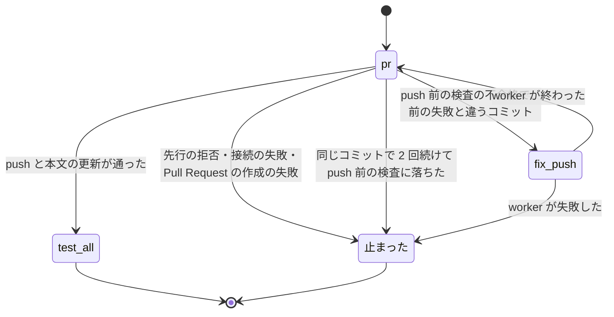

# スプリントの受け入れ条件の確かめと push の修正: `new sprint` は受け入れ条件の無い課題で計画を書く前に止まり、実装のプランは push 前の検査の不合格を修正の worker に直させて打ち直す

## 目的

- **受け入れ条件の無い課題は、計画を書く前（承認ゲート 1 より前）に見つかる。** `supervise.py new sprint` は
  `--design` に無い課題の本文を確かめ、`## 受け入れ条件` の節が無い・空・本文を取れない課題が 1 件でもあれば、
  計画を書かずに `stopped` を返す。番号は全部 1 回の結果に載り、次の手（`--design` へ入れる・本文を書く）が付く
- **push 前の検査で落ちた変更は、プランを止めずに直る。** `plan_to_merge` が組む実装のプランでは、`pr` のステップの
  push が push 前の検査で拒まれると、修正の worker（`fix-push`）が直してコミットし、`pr` を打ち直す
- **直らない失敗で起動を繰り返さない。** コミットを直しても通らない失敗（先行の拒否・接続の失敗）と、同じコミットで
  2 回続けて push 前の検査に落ちた失敗は、修正へ回さずに `止まった` で終わる

例: スプリント m815 と m744 で起きた 2 つの停止を、今の実装で流すと次のようになる。

| 順 | 起きること |
| --- | --- |
| 1 | conductor が `supervise.py new sprint --issue 815 1273 1752 1685 659 --design 815 1273 1752 ...` を打つ |
| 2 | `--design` に無い #1685 と #659 の本文を 1 回ずつ取る。#1685 に `## 受け入れ条件` が無い |
| 3 | 計画も `sprint.json` も書かずに `status: stopped`・終了コード 1 で返る。`items` は `[{"issue": 1685, "reason": "受け入れ条件の節が無い"}]`、`next` は「1. #1685 を `--design` へ入れて打ち直す: <コマンド> 2. #1685 の本文に `## 受け入れ条件` を書いてから、同じコマンドを打ち直す: <コマンド>」 |
| 4 | conductor が #1685 を `--design` へ足して打ち直す。#1685 は設計の工程で要求を書き、承認ゲート 1 で他の設計と一緒に承認される |
| 5 | 実装のプランで、description の Skill 数の食い違いは `sync` の `validate`（`sync_checks`）で落ち、既存の `fix-sync` が直す |
| 6 | `sync` に無い検査が `pr` の push で落ちたときは、`pr` が push の出力を残し、`fix-push` が直してコミットし、`pr` を打ち直して `test-all` へ進む |

**ステップのキーの書き方と工程の手順は正本が持つ。** ここに書き写さない。

| 何を | 正本 |
| --- | --- |
| プランのステップのキー（`on_fail`・`on_fail_only` ほか）の書き方 | [`supervise_lib/plan.py`](../../plugins/ndf/scripts/supervise_lib/plan.py) のプランの書き方の説明 |
| `new sprint` のステージ（設計・実装・検査）と `--design` の意味 | `development-workflow` の [`references/agent-layers.md`](../../plugins/ndf/skills/development-workflow/references/agent-layers.md) |
| 共通の終了コードの表（`stopped` = 1 ほか） | [`plugins/ndf/scripts/lib/README.md`](../../plugins/ndf/scripts/lib/README.md) の終了コードの表 |
| 節の取り出し（見出しから次の同じか上の見出しまで） | [`lib/gh_sections.py`](../../plugins/ndf/scripts/lib/gh_sections.py) の `get_section` |

この文書が扱うのは、Skill に書かない `new sprint` の止まり方の契約、`pr` と `fix-push` のステップの契約、push の
失敗の見分け方、常に成り立つ条件、決定の理由、テスト観点である。

## 用語

定義は [用語集](../glossary.md) が正である（`.ndf/glossary.json` の `document`）。この文書で使う語は
「push 前の検査」「push の修正」「プラン」「ステージ」「承認ゲート」である。

## 対象範囲

| 扱う | 扱わない |
| --- | --- |
| `supervise.py new sprint`（`pace` の normal / fast / auto）の受け入れ条件の確かめ | `new close` と単独の `new impl` / `new fix` の受け入れ条件の確かめ |
| `plan_to_merge` が組む実装のプラン（スプリントの実装・`new impl`・`new fix`）の `pr` の修正の経路 | 設計・検査・確定仕様化のプランの `pr` の失敗、`ready` のステップの push の失敗（どちらも `止まった` のまま） |
| ステップの `on_fail_only` と、`pr` のハンドラーが結果へ残す `push_check`・`head` | `## 何をするか` の有無の確かめ、受け入れ条件の自動の書き足し、実装の指示文 |
| このリポジトリの `.ndf/supervise.json` の `sync_checks` の 2 行（`validate`・`lint`） | `pre-push` フックを読んで `sync_checks` との食い違いを知らせる仕組み |

受け入れ条件の確かめと `pr` の修正の経路は雛形（`plugins/ndf/scripts/supervise_lib/`）にあり、配布先のリポジトリでも
働く。`pre-push` フックを持たないリポジトリでは `fix-push` へ回る失敗が起きない。働かないだけで害は無い。

## 背景

設計を付けない課題の実装のプランは、最初の worker が課題の本文の受け入れ条件を入力に読む。節の無い課題では
worker が `判断が要る` で止まり、conductor が利用者へ問い、本文を書き、プランを流し直していた（m815 の #1685）。
また `sync` と範囲テストを通った変更が `pr` の push で `pre-push` フックの検査に落ちると、`pr` に `on_fail` が無い
ためプラン全体が止まり、conductor が手で直して `run --from pr` で流し直していた（m744）。どちらも `new sprint` が
組む実装のプランの不足として 1 本で直した（#1767。#1751 を取り込み）。

## 仕様

### 構成要素と責務

| 要素 | 責務 |
| --- | --- |
| [`supervise_lib/sprint_inputs.py`](../../plugins/ndf/scripts/supervise_lib/sprint_inputs.py) | 確かめる課題（`--issue` から `--design` を除いたもの。順序を保ち重複を除く）の本文を 1 件 1 回取り、節の有無を判定して、止まるときの結果（`criteria_refusal`）を組む |
| [`supervise_lib/sprint.py`](../../plugins/ndf/scripts/supervise_lib/sprint.py) の `cmd_new_sprint` | `waves` を受けない（スプリントを組む）ときだけ、進め方の確かめの後・計画を書く前に `criteria_refusal` を呼ぶ。打ち直すコマンドは `sprint_command`（今の引数をすべて写し、`design` を渡せば `--design` へ足す）で組む |
| [`supervise_lib/procedures.py`](../../plugins/ndf/scripts/supervise_lib/procedures.py) の `push_fix_steps` | 渡した `pr` のステップへ `on_fail: fix-push` と `on_fail_only: push-check` を足し、`fix-push` のステップ（指示は `PUSH_FIX_PROMPT`）を返す。修正の経路の組み立てはこの関数だけが持つ |
| [`supervise_lib/templates.py`](../../plugins/ndf/scripts/supervise_lib/templates.py) の `plan_to_merge` | `pr` のステップの直後に `push_fix_steps(pr)` を並べる。`sync_checks` の有無によらない |
| [`supervise_lib/pr.py`](../../plugins/ndf/scripts/supervise_lib/pr.py) の `PrStep._push` と `is_push_check_failure` | push する前に `head` を結果へ残し、失敗なら標準出力と標準エラーを続けた `text` と、push 前の検査の不合格か（`push_check`）を残す |
| [`supervise_lib/plan.py`](../../plugins/ndf/scripts/supervise_lib/plan.py) の `fail_kind_matches`・`ON_FAIL_ONLY` | 失敗を `on_fail` へ回すかを決める。`on_fail_only` が無ければすべての失敗、あれば宣言した種類（`ON_FAIL_ONLY` の対応で結果のキーが `true`）だけ |
| [`supervise_lib/engine.py`](../../plugins/ndf/scripts/supervise_lib/engine.py) の `Engine._next_after_step` | 失敗したステップに `on_fail` があり `fail_kind_matches` が真のときだけ `on_fail` へ進む。偽なら `止まった` で終わる |

### 常に成り立つ条件

| # | 条件（保つこと） | 破れたときの扱い |
| --- | --- | --- |
| I1 | `--design` に無い課題は、本文の `## 受け入れ条件` の節に空でない行を 1 行以上持つ。持たない課題があれば、出力のディレクトリに `sprint.json` も計画のファイルも書かない | 計画を書かずに `stopped` を返し、該当する番号を全部載せる |
| I2 | 本文を取れなかった課題は確かめずに通さない | 同上。その行に `gh` の終了コードと標準エラーの末尾を載せる |
| I3 | 確かめで打つ `gh` は、確かめる課題 1 件あたり 1 回までである。`--design` の課題には打たない | — |
| I4 | 全課題が受け入れ条件を持つとき、書く計画の中身は確かめを通さずに組んだものと同じである | テストで落とす |
| I5 | `fix-push` へ回るのは、push 前の検査の不合格（終了コード 1 で、`! [` で始まる拒否の行が無い）だけである | ほかの失敗は `止まった` で終わる |
| I6 | 同じコミットで 2 回続けて push 前の検査に落ちたら、`fix-push` へ回さない | 2 回目の `pr` で `止まった` で終わり、最後の push の出力を `text` と状態ディレクトリの `NN-pr.out` に残す |
| I7 | `on_fail_only` を持たないステップの `on_fail` は、これまでどおりすべての失敗で働く | — |
| I8 | 雛形（`supervise_lib/`）のコードは、特定のリポジトリの検査のコマンド名（`validate-runtime-plugins.sh`・`check-lint.sh`）を持たない | テストで落とす |

### `supervise.py new sprint` の止まり方

入力（`--issue`・`--design` ほか）と成功のときの出力（`status: ok`・計画のファイル・`sprint.json`）は変わらない。
確かめは `pace` の確かめ（`pace_refusal`）の後に行う。`new close` は確かめない。

| 項目 | 値 |
| --- | --- |
| 終了コード | 1（`status: stopped`） |
| `summary` | `実装の入力が足りない課題がある（#12 #13: 受け入れ条件の節が無い・受け入れ条件の節が空）。計画を書かない` の形。該当する番号を全部と、理由の種類を並べる |
| `items` | 1 課題 1 行（下の表） |
| `metrics` | `{"issues": [該当する番号]}` |
| `next` | 1 つの文字列に番号付きで並べた次の手（下の表） |

`items` の 1 行:

| キー | 値 |
| --- | --- |
| `issue` | 課題の番号 |
| `reason` | `受け入れ条件の節が無い` / `受け入れ条件の節が空` / `本文を取れない` |
| `gh` | `本文を取れない` のときだけ。`{"returncode": <終了コード>, "stderr": <標準エラー（無ければ標準出力）の末尾 500 文字>}`。`gh` が 0 で終わっても JSON を読めなければ `returncode: 0` と `応答を読めない: ...` |

`next` の並び（課題の番号は該当する課題の全部。手の番号は載せた順に 1 から振る）:

- 「#B を `--design` へ入れて打ち直す: <今の引数をすべて写し、`--design` へ番号を足したコマンド>」（常に）
- 「#B の本文に `## 受け入れ条件` を書いてから、同じコマンドを打ち直す: <今のコマンド>」（節が無い・空の課題があるとき）
- 「`gh issue view <番号>` が通ることを確かめてから打ち直す: <今のコマンド>」（本文を取れない課題があるとき）

節の判定は見出し `## 受け入れ条件` だけで行い、`## 何をするか` は見ない。節は `get_section` で取り出す（`###` の
小見出しは節に含まれる）。項目の書き方（`- [ ]` か否か）は見ない。本文は `gh_rest.view_json("issue", n, "body")`
で取る（GraphQL が上限なら REST で読み直す）。

### 実装のプランの `pr` と `fix-push` のステップ

`plan_to_merge` が組むステップ（関係するキーだけ）:

```json
{"id": "pr", "type": "pr", "on_fail": "fix-push", "on_fail_only": "push-check", "next": "test-all"},
{"id": "fix-push", "type": "work", "kind": "修正", "inputs": ["pr"], "prompt": "<PUSH_FIX_PROMPT>", "next": "pr"}
```

`fix-push` の指示（`PUSH_FIX_PROMPT`）は、入力の push の出力から落ちた検査の指摘を直してコミットする（push しない）、
直した後に `pre-push` フック（`git config core.hooksPath`）と同じコマンドを手元で打って通ることを確かめる、変更に
起因しない失敗は直さない、の 3 点を持つ。

`pr` のハンドラーが状態の `cur`（ステップの結果）へ残す値:

| キー | いつ | 値 |
| --- | --- | --- |
| `head` | 常に（push の前） | push しようとしたコミット（`git rev-parse HEAD`） |
| `text` | push が失敗したとき | push の標準出力と標準エラーを続けたもの。2 回続けて落ちたときは末尾に「同じコミット（<12 桁>）で 2 回続けて push 前の検査に落ちた。修正へ回さずに止める」を足す |
| `push_check` | push が失敗したとき | push 前の検査の不合格なら `true`。ほかの失敗と、同じコミットでの 2 回目なら `false` |
| `exit` | push が失敗したとき | `git push` の終了コード |

### push の失敗の見分け方

`is_push_check_failure(returncode, output)` は「終了コードが 1」かつ「`^\s*! \[` に当たる行が無い」で真を返す。
`output` は標準出力と標準エラーを続けたものである。

| 失敗 | 終了コード | 見分けの手がかり | `push_check` |
| --- | --- | --- | --- |
| `pre-push` フックが不合格 | 1 | フックの出力（標準出力へ書いた行も `git push` の標準出力へ出る）と `error: failed to push some refs` | `true` |
| 先行の拒否・相手の拒否 | 1 | ` ! [rejected]` / ` ! [remote rejected]` の行 | `false` |
| 相手のリポジトリが無い・接続の失敗 | 128 | `fatal: ...` | `false` |

**`fatal:` の行の有無では見分けない。** 資格情報の補助がフックの前に `fatal: failed to get: ...` を標準エラーへ書いた
まま、push 前の検査の不合格で終わることがある（m744）。

同じコミットの判定は、同じステップ id の前の結果（`state.results["pr"]`）の `push_check` が `true` で、`head` が今の
コミットと同じかで行う。`fix-push` の worker がコミットしなかったときに当たる。

### 処理の流れ



ステップの数がプランの `上限` を超えたときも `止まった` で終わる（既存）。

## データ・設定

| 設定 | 値 | 持ち主 |
| --- | --- | --- |
| [`.ndf/supervise.json`](../../.ndf/supervise.json) の `sync_checks` | このリポジトリは `validate`（`bash scripts/validate-runtime-plugins.sh`）と `lint`（`bash scripts/check-lint.sh`）を持つ。`.githooks/pre-push` が打つ 2 本と同じ | 利用者（書き換えは利用者の明示の承認を取る。C7） |

受け入れ条件の確かめと `pr` の修正の経路のための設定は無い。

## 決定と理由

- **受け入れ条件の確かめは `new sprint` の計画を書く前に置く。** `--design` を受け取るのはここだけで、確かめの対象が
  決まる。後で確かめると承認ゲート 1 を過ぎてから止まり、他の設計と一緒に承認できない。worker に本文を書かせる案は、
  直し方（設計を通すか本文を書くか）の判断を worker に預けるため採らない
- **見る見出しは `## 受け入れ条件` だけにする。** `requirements-design` の雛形は `## 何をするか` を持たないため、
  それを見ると要求を書き終えた課題を誤って止める
- **push の失敗の種類は `pr` のハンドラーが終了コードと拒否の行で見分ける。** 出力の形で決まる判定に LLM（judge）を
  使うと、失敗のたびに起動 1 回を使い、同じ入力に違う答えが返りうる
- **修正へ回す失敗の絞り込みはステップの `on_fail_only` で宣言する。** 駆動が一律に絞ると、差分の検査の `pr`
  （`on_fail: abort-before-pr`）が直せない失敗のときに後始末を通らずに止まる。宣言したステップだけで働かせれば、
  既存のプランの振る舞いは変わらない
- **同じコミットで 2 回続けて落ちたら止める。** 前の結果の `head` との比較で決まり、駆動に修正の回数の状態を
  持たせずに済む。`上限` を待たずに 2 回目で止まる
- **修正の経路は `plan_to_merge` の実装のプランだけに置き、組み立てを `procedures.py` の `push_fix_steps` に寄せる。**
  push 前の検査で落ちた実績は実装のプランだけにある。見分けは `pr` のハンドラーにあるため、他のプランへ広げるときは
  `push_fix_steps` を当てる 1 行で足りる
- **push の出力は標準出力と標準エラーの両方を残す。** `pre-push` フックが標準出力へ書いた行は `git push` の標準
  出力へ出る。雛形は他のリポジトリのフックの書き方を決められない
- **雛形は検査のコマンド名を持たず、このリポジトリの検査は `sync_checks` で受ける。** push 前の検査の中身は
  プロジェクトごとに違う。2 本は範囲に絞らず全体で打つ。`pre-push` も全体を打つため、`sync` の合否と push の合否が
  一致する（延びは実測で 1 本の `sync` あたり 15〜32 秒）

## テスト観点

テストは [`tests/test_sprint_inputs.py`](../../plugins/ndf/scripts/tests/test_sprint_inputs.py) と
[`tests/test_push_fix.py`](../../plugins/ndf/scripts/tests/test_push_fix.py) にある（`gh` と worker は差し替える）。

- `--issue A B --design A` で B に `## 受け入れ条件` が無いとき、終了コードが 0 でなく `status` が `stopped` で、
  出力のディレクトリが作られず、`items` に B だけが載り、A へ `gh` を打たないこと
- 該当する課題が複数あるとき、1 回の結果の `summary` と `items` に全部の番号が載り、`next` に全部を `--design` へ
  足したコマンドと本文を書く手が載ること
- 本文を取れない課題があるとき、`stopped` で計画が書かれず、その行の `gh` に終了コードと標準エラーが載り、`next` に
  `gh issue view <番号>` を確かめる手が載ること
- 節が見出しだけ・空行だけなら止まり、`###` の小見出しだけや `- [ ]` でない項目でも 1 行あれば通り、`## 何をするか`
  だけの本文は「節が無い」になること
- 全課題が受け入れ条件を持つとき、normal・`--pace fast`・`--pace auto` のそれぞれで、書いた計画のファイルが確かめを
  通さずに組んだものと同じで、`gh` は確かめる課題に 1 回ずつだけ打つこと
- push 前の検査で 1 回落ちる `pr` の後、`fix-push` がフックの出力（標準出力へ書いた行を含む）を入力に受けて起き、
  `pr` を打ち直して `test-all` へ進むこと（流れたステップが `pr` → `fix-push` → `pr` → `test-all`）
- `fix-push` がコミットしないと、2 回目の `pr` で `止まった` になり、`push_check` が `false`、`text` と最後の
  `NN-pr.out` に最後の push の出力が残ること
- 接続の失敗（終了コード 128）は `fix-push` へ回らず、worker が起きないこと
- 見分けが、終了コード 1 のフックの不合格（前に `fatal:` の行があっても）を真、`! [rejected]`・`! [remote rejected]`・
  終了コード 128 を偽とすること
- `on_fail_only` を持たない `pr` は、どの失敗でも `on_fail` へ回ること
- `new impl` と `new fix` のプランが、`sync_checks` の有無によらず `pr` の `on_fail`・`on_fail_only` と `fix-push` を
  持つこと
- `supervise_lib/` のコードに `validate-runtime-plugins.sh` と `check-lint.sh` の語が無いこと
- このリポジトリの `.ndf/supervise.json` の `sync_checks` に 2 本のコマンドがあること

## 関連リンク

- [ndf-agent-layers-unattended-run.md](ndf-agent-layers-unattended-run.md): supervise の駆動とプランの実行
- [用語集](../glossary.md)
