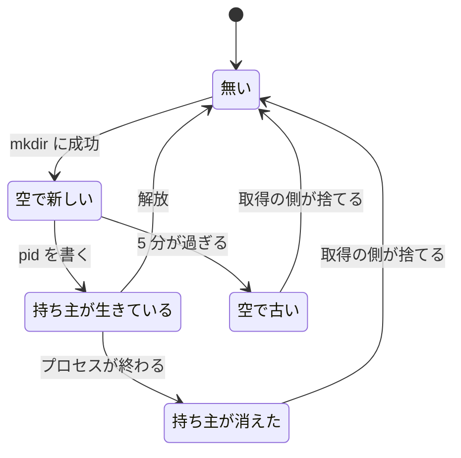

# テスト環境の排他の判定と、worktree レジストリへ書けなかったときの扱い

worktree ごとのテスト環境で、**ロックを握られているかの判定**と、**worktree レジストリへ書けなかった
ときの扱い**を決めた経緯と結論を残す。

**手順と表は
[`worktree` の SKILL.md](../../plugins/ndf/skills/worktree/SKILL.md) と
[references/test-execution.md](../../plugins/ndf/skills/worktree/references/test-execution.md)
が正である。** ここに書き写さない。この文書が扱うのは、そこに書かない決定の理由である。

## 概要

**ロックが握られているかの判定は、取得の側が「捨ててよい」と読む規則の否定である。** 判定の規則を
2 か所に持たず、陳腐化の判定（`_ndf_lock_is_stale`）1 つに揃える。持ち主を書く前に落ちたロックは、
5 分を過ぎれば停止の対象へ戻る。

**worktree レジストリの更新の失敗は、テスト環境の入口のどの呼び出しでも受け取る。** 書けなかったサブコマンドは
完了を装わず、どの記録が書けなかったかと次にする操作を標準エラーへ出す。

**例外は「最後に使った時刻」だけである。** 書けなくても警告を出して続ける。

## 用語

| 用語 | 意味 |
| --- | --- |
| worktree レジストリ | 割り当て・ポート・基準のタグ・公開の記録を持つ JSON。共通の git ディレクトリの下（`.git/ndf/worktree-registry.json`） |
| 実行中のロック | `test` が握るロック。`<共通 git ディレクトリ>/ndf/<環境名>.inuse.d` |
| 空のロック | ディレクトリはあるが `pid` を持たないロック（`held` の有無は問わない） |
| 古い | ロックのディレクトリの更新時刻が `NDF_LOCK_STALE_MINUTES`（5 分）分より前である |
| worktree レジストリの更新 | `wt_registry_update` と、それを呼ぶ `wt_slot_set_ports` / `wt_slot_release` / `wt_slot_touch` |
| 停止の対象の選別 | `worktree-testenv.sh reap`。使われていない割り当てのテスト環境を `compose stop` で止める |

## 背景

**判定の規則が 2 か所にあり、食い違っていた。** 取得の側（`ndf_lock_acquire`）は、`pid` を持たない
ロックが 5 分を過ぎていれば捨ててよいと読む。保持の判定（`ndf_lock_is_held`）はその規則を見ず、
ディレクトリがあれば握られていると読んだ。ロックのディレクトリを作った直後に落ちたプロセスがあると、
そのテスト環境は停止の対象から外れ続け、スロットとポートを握ったまま残った。

**worktree レジストリの更新の失敗は、呼び出し元へ届いていなかった。** `wt_registry_update` は排他を取れないときに
終了コード 1 を返すが、テスト環境の入口（`worktree-testenv.sh`）は戻り値を見ずに次へ進んでいた。
基準のタグ・ポートの割り当て・解放の時刻がworktree レジストリに載らないまま操作が完了として返り、worktree レジストリと実体が
食い違った。次の採番が同じスロットを割り当てるか、解放したはずの割り当てが残る。

**原文の再現（作った直後の空のロックで 0 を返す）は、直した後も 0 のままである。** 取得の途中の
ロックも同じ形をしており、区別できない。直したのは「時間が経っても対象へ戻らない」ことである。

## 決定と理由

| 決定 | 理由 |
| --- | --- |
| 保持の判定を、陳腐化の判定の否定として 1 行で書く | 規則を 2 か所に書くと、片方だけが変わって同じ食い違いが再び起きる。否定で書けば、5 分の規則・`token` の照合・`pid` の生死のすべてが 1 か所に残る |
| `pid` が無ければすぐ「握られていない」と返す形は採らない | 取得の途中にも `pid` の無い時間がある。取得と解放を 4 秒回しながら外から覗くと、観測した 324 回のうち 170 回で `pid` が無かった。この形ではテストを始めたばかりの環境を止めうる |
| `wt_lock_is_held` の側だけを直す形は採らない | 排他の実装を `lock-common.sh` の 1 か所へ寄せた構成（#293）を崩す。`worktree-common.sh` には委譲だけを置く |
| 停止の対象へ戻したロックのディレクトリを `reap` が取り除かない | 取り除きは `token` を照合するゲート（`_ndf_lock_discard`）を通す必要がある。ゲートを通らずに消すと「別の担当が取り直したロックを壊す」事象が起きる。残したディレクトリは次の `test` の取得が捨てるため、結果は変わらない |
| worktree レジストリの更新の失敗の原因（排他の待ち・`jq`・書き出し）を文言で区別しない | どの原因でも `wt_registry_update` の終了コード 1 として届く。区別するにはworktree レジストリの層の戻り値の形を変える必要がある。原因の区別が要る場面（`env` の「空きスロットがありません」）は #626 として分けた |
| 最後に使った時刻の記録だけは、失敗しても止めない | この値を読むのは `reap` だけで、書けなくても割り当て・ポート・公開の記録は食い違わない。書けないことで起きるのは `reap` が期間より早く止めることで、`up` で戻せる |
| 最後に使った時刻も 1 を返して止める形は採らない | `test` は実行したコマンドの終了コードをそのまま返す約束を持つ。実行後の記録の失敗で終了コードを変えると、worktree レジストリの失敗がテストの失敗に見える |
| `env` でポートを記録できないときは、JSON を出さずに新しく取った割り当てを解放する | JSON を出すと、読む側はworktree レジストリに無いポートで起動を組み立てる。ポートの無い割り当てを残すと、次の `env` は「既にある」として同じスロットを返し、ポートは `{}` のままになる |
| JSON を出したうえで 1 を返す形は採らない | `up` と `test` は出力を捨てて `env` を呼ぶため影響しないが、利用者が出力を直接読むと、終了コードを見ない限りworktree レジストリに無い値を使う |
| 解放も失敗したときは、解放できなかったことを続けて出す | 排他を取れないことが原因なら解放も同じ理由で失敗しうる。割り当てが残ったことを利用者へ知らせる |
| 時刻の記録の 3 か所を `touch_or_warn` の 1 関数へ寄せる | 同じ処理で、戻り値を常に 0 にする約束も同じである。3 か所に書くと片方だけが止める形へ戻る |
| `expose` の「記録を戻しました」は、巻き戻しが成功したときだけ出す | 巻き戻しに失敗しているのに戻したと出すと、利用者はworktree レジストリの公開の記録が閉じたものとして次へ進む |
| 呼び出しごとの失敗はテストで `jq` を差し替えて作る | worktree レジストリの置き場所を書き込み不可にすると、ロックのディレクトリも同じ場所にあるため取得の段階で 5 秒待って失敗し、呼び出しを 1 か所に絞れない。試験のための切り替えを入口のスクリプトへ足す形も採らない（本番のコードに試験だけの分岐が残る） |
| 陳腐化の分数（`NDF_LOCK_STALE_MINUTES`）は変えない | 判定の食い違いは規則の値ではなく、規則を 2 つ持ったことによる |

## 仕様

### 保持の判定

`ndf_lock_is_held`（`plugins/ndf/scripts/lib/lock-common.sh`）は、パスがディレクトリであることを
確かめたうえで、`_ndf_lock_is_stale` にいまの `token` を渡した結果の否定を返す。
`wt_lock_is_held`（`worktree-common.sh`）はこれへ委譲するだけである。

**常に成り立つ条件**は 1 つである。

- **ディレクトリであるロックのどの状態でも、`ndf_lock_is_held` の結果は
  `_ndf_lock_is_stale "$dir" "<いまの token>"` の結果の否定と一致する。**

| ロックの状態 | `ndf_lock_is_held` | `reap` |
| --- | --- | --- |
| 無い / ディレクトリでない / 空の引数 | 1 | 止める |
| 空で新しい（`held` の有無を問わない） | 0 | 止めない |
| 空で古い | 1 | 止める |
| 持ち主が生きている（更新時刻の新旧を問わない） | 0 | 止めない |
| 持ち主が消えた | 1 | 止める |

判定は標準出力へ何も書かず、呼び出し側のシェルの `$-` に `C` を残さない。判定の途中で `token` が
替わると陳腐化の判定は「捨てない」を返すため、保持の判定は「握られている」の側へ倒れる。

「空で新しい」から「空で古い」へ移る引き金は**時間の経過だけ**である。

`ndf_lock_acquire` の振る舞い（2 つのゲート・陳腐化したロックの奪取・待ちの上限）は変えていない。

### worktree レジストリへ書けなかったときの扱い

`worktree-testenv.sh` がworktree レジストリを更新する呼び出しは次のとおりである。**すべての呼び出しが戻り値を
受け取る。**

| サブコマンド | 呼び出し | 失敗したとき | 標準エラーの文言 |
| --- | --- | --- | --- |
| `env` | `wt_slot_acquire` | 1 を返す（以前から受けている） | 変えていない（原因の区別は #626） |
| `env` | 帯を超えた後の `wt_slot_release` | 1 を返す | スロットの解放を台帳へ記録できませんでした。down を実行してください |
| `env` | `wt_slot_set_ports` | JSON を出さずに 1 を返す。この呼び出しで新しく取った割り当てなら解放を試みる | ポートを台帳へ記録できませんでした（解放も失敗したときは上の 1 行を続けて出す） |
| `up` | 基準のタグの `wt_registry_update` | `compose up` を呼ばずに 1 を返す | 基準のタグを台帳へ記録できませんでした。起動していません |
| `up` / `test`（実行の前後） | `wt_slot_touch`（`touch_or_warn` 経由） | 警告を出して続ける。`up` は起動し、`test` は実行したコマンドの終了コードを返す | 警告: 最後に使った時刻を台帳へ記録できませんでした。reap が早く止めることがあります |
| `down` | `wt_slot_release` | 1 を返す | 破棄しましたが、スロットの解放を台帳へ記録できませんでした。down を再実行してください |
| `unexpose` | worktree レジストリの公開の記録を閉じる `_close_record` | 1 を返す | 公開を閉じる手段は実行しましたが、台帳を閉じられませんでした。unexpose を再実行してください |
| `expose` | 巻き戻しの `_close_record` | 1 を返す。「記録を戻しました」を出さない | 公開の手段が失敗し、記録も戻せませんでした。unexpose で閉じてください |

**文言はどの記録が書けなかったかと、次にする操作を 1 行で示す。** 失敗の原因は示さない。
`expose` の先着 1 本のゲートは既に戻り値を受けているため、この表に入らない。

**解放を試みるのは `env` のポートの記録だけである。** 条件は帯を超えたときの分岐と同じで、この
呼び出しで新しく取った割り当てのときに限る。

### 最後に使った時刻

`touch_or_warn`（`worktree-testenv.sh`）は `wt_slot_touch` を呼び、失敗したら警告を 1 行出す。
**戻り値は常に 0 である。** 呼び出しは `up` の 1 か所と `test` の実行の前後の 2 か所である。

`test` の実行中は実行中のロックが `reap` から守るため、実行前の記録が無くても止められない。

## データ・設定

**worktree レジストリの形は変えていない。** 置き場所と JSON の形は
[references/test-execution.md](../../plugins/ndf/skills/worktree/references/test-execution.md)
が持つ。

worktree レジストリは共通の git ディレクトリ配下に置く。worktree の中に置くと、削除した時点で割り当ての記録が
消える。解放しても行は消さず、解放の時刻を書き込む。

`NDF_LOCK_STALE_MINUTES` の既定は 5 分である。

## エラー処理

**終了コードの約束は `worktree-testenv.sh` の先頭が持つ**（0 完了 / 1 処理できなかった / 2 対象外）。
この版で変わったのは、worktree レジストリへ書けないときの `env` と `up` が 0 から 1 になったことである。
`down` / `unexpose` / `expose` の終了コードは以前も 1 で、増えたのは文言だけである。

`lock-common.sh` は `flock` を使わず、`dash` で読み込まれても構文が通る
（`workflow-common.sh` からも読まれる）。

## テスト観点

| 観点 | 確かめ方 |
| --- | --- |
| 古い空のロックで保持の判定が 1、作った直後の空のロックと生きている `pid` で 0 | `plugins/ndf/skills/worktree/tests/test_testenv.py` の排他の節 |
| どの状態でも保持の判定が陳腐化の判定の否定と一致する | 同上（状態をパラメータ化する） |
| 判定が標準出力へ書かず、`$-` に `C` を残さない | 同上 |
| `reap` が古い空のロックの環境を止め、新しい空のロック・生きている `pid` では止めない | 同 reap の節（稼働中のコンテナを返す偽のコンテナ実行系を使う） |
| worktree レジストリへ書けないとき、`env` が JSON を出さずに 1 で終わり、割り当てを解放する | 同上（`PATH` の先頭に置く偽の `jq` で、狙った代入式の呼び出しだけを失敗させる） |
| `up` が `compose up` を呼ばずに 1 で終わる。排他を取れないときも同じ結果になる | 同上 |
| `down` / `unexpose` / `expose` が再実行の案内を出し、「記録を戻しました」が巻き戻しの成功時だけ出る | 同上 |
| 時刻の記録の失敗で `up` が 0、`test` が実行したコマンドの終了コードを返す | 同上 |
| worktree レジストリの更新が成功する場合の出力・終了コード・worktree レジストリの内容が変わらない | 既存の `test_testenv.py` / `test_registry.py` / `scripts/tests/test_lock_common.py` を変更なしで通す |
| 排他の実装が `lock-common.sh` の 1 か所にある | `scripts/tests/test_lock_common.py` |

実行は `uv run --with pytest pytest plugins/ndf/skills/worktree/tests scripts/tests/test_lock_common.py -q`。
**コンテナは起動しない。**

## 運用

**`reap` が止める対象が増える。** 持ち主を書く前に落ちたロックを持つテスト環境は、5 分を過ぎると
停止の対象へ入る。停止されなかったスロットとポートが解放される。

**worktree レジストリへ書けない `env` と `up` は先へ進まない。** 排他を取れない原因（別の実行がworktree レジストリを握っている）
は待ちの上限（5 秒）で解けることがあるため、案内のとおり再実行する。

**実物のコンテナ実行系での再実行は確かめていない。** 「down を再実行」の案内は、既に破棄した
プロジェクトに対して `compose down` が 0 を返すことを前提にしており、偽の実行系でしか確かめて
いない。`unexpose` の再実行で閉じる手段がもう一度走ってよいかは、各リポジトリが設定に書いた手段に依る。

**保持の判定の呼び出し元は `reap` の 1 か所である。** 新しく使う側は、判定の意味が「陳腐化して
いない」であることを前提にする。

## 関連リンク

- [issue #312](https://github.com/devbasex/ai-plugins/issues/312) — 保持の判定が `pid` の無いロックを持ち主ありと返す
- [issue #315](https://github.com/devbasex/ai-plugins/issues/315) — worktree レジストリの更新の失敗を見ていない
- [PR #629](https://github.com/devbasex/ai-plugins/pull/629)（設計） / [PR #640](https://github.com/devbasex/ai-plugins/pull/640)（実装）
- [issue #626](https://github.com/devbasex/ai-plugins/issues/626) — `wt_slot_acquire` が「排他を取れない」と「空きが無い」を同じ終了コードで返す
- [テスト実行の分離の手順](../../plugins/ndf/skills/worktree/references/test-execution.md)
- [worktree で開発する](../../plugins/ndf/skills/worktree/SKILL.md)
- [worktree の設定とエントリポイントの判定](ndf-worktree-declaration-and-entry-points.md)
