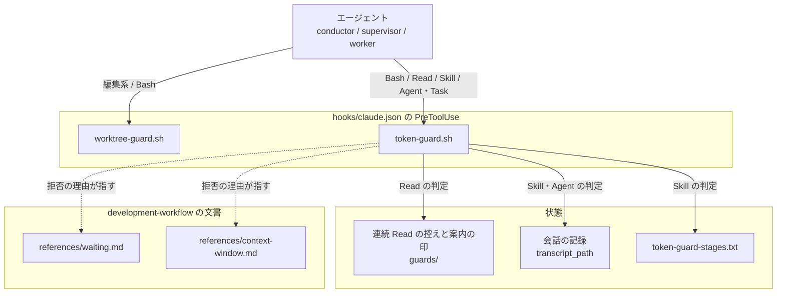

# 待つ間の問い合わせを止め、conductor の会話を工程の切れ目で切る

Claude Code の PreToolUse hook（`plugins/ndf/scripts/token-guard.sh`）が、待つ間に文脈を
読み直す呼び出し（前景の `sleep` の待ちと、変わらないファイルの読み直し）と、文脈が上限を
超えた conductor が工程へ入る起動を止める。止めたときは理由の欄に代わりの手段を示す。
この文書は、判定の条件・記録の形・入出力の契約と、それぞれをそう決めた理由を残す。

**待ち方と会話の切り方の規約は Skill の文書が正である。** 許す待ち方・待つ相手ごとの手・
新しい会話で状態を戻す手順をここへ書き写さない。

| 何を読むか | 正本 |
| --- | --- |
| 待ちの費用、許す待ち方と禁じる待ち方、待つ相手ごとの手、途中の通知を受けたときの層ごとの手と写しの待ちのコマンド、hook の止め方、4 ランタイムの扱い | `plugins/ndf/skills/development-workflow/references/waiting.md` |
| 会話を切る 4 つの切れ目、上限を超えたら hook が止めること、新しい会話で戻す手順 | `plugins/ndf/skills/development-workflow/references/context-window.md` の「context window は工程の切れ目で切る」「上限を超えたら hook が止める」「新しい会話で戻す」 |
| conductor が引き継ぎの 1 行を出す時点 | `plugins/ndf/skills/development-workflow/SKILL.md`（「工程は 1 つの context window で通し切らなくてよい」の段落） |
| supervisor と worker が待ち方に従う規則、worker の起動指示の `置き場所`（報告の写しと完了の目印） | `plugins/ndf/skills/development-workflow/references/agent-layers.md` |
| `sleep` の判定の字句の規則 | `plugins/ndf/scripts/lib/token_guard_sleep.py` の docstring |

## 概要

**例（#829）。** サブエージェントが `codex exec` を背景で起動し、`sleep 60 && tail -5 /tmp/x.log`
を 30 回繰り返すと、30 回とも文脈の全体を読み直す。hook は 1 回目の `sleep 60 && tail` を止め、
「待ちの条件を until ループにして `run_in_background: true` で起動し、完了通知を待つ」よう示す。

**例（#830）。** conductor の文脈が 41 万のまま `/ndf:implementation-plan #829` を起動する
（3 層では `実装: #829` の supervisor を起動する）と、hook が起動を 1 度止め、「新しい会話で
`/ndf:development-workflow #829` を打つ」よう示す。conductor はその 1 行を利用者へ示して止まる。

**待ちの費用は「呼び出しの回数 × その時点の文脈」で決まる。** 背景で待って通知を 1 回受ける
なら、待つ時間の長さは費用を増やさない。#827 の実測では、待つ間の繰り返しの問い合わせ
（ポーリング）が全体の費用の 16%（2026-09-20 以降）、ai-plugins の 30 日間では 19%（258M）を
占めた。conductor の会話を工程の開始ごとに切っていれば、conductor の再読込量は 58%（30 日間
では 62%）減る見込みだった。

**規定を書くだけでは守られなかったため、hook で止める。** `context-window.md` は以前から
「遅くとも 20 万で切る」と定めていたが、#827 の実測で守られていなかった。Claude Code 本体も
前景の `sleep` を本体の会話でしか止めず、サブエージェントの中の `sleep 12 && echo` は 12 秒
待って成功した（Claude Code 2.1.280、2026-09-23）。本体の仕組みには頼れない。

## 用語

| 用語 | 意味 |
| --- | --- |
| ポーリング | 待つ間に、状態を確かめるための呼び出しを繰り返すこと |
| 前景の Bash | `run_in_background` を付けずに実行する Bash。終わるまで呼び出しが返らない |
| 文脈量 | 1 回の API 呼び出しで読んだトークン数。`input_tokens + cache_read_input_tokens + cache_creation_input_tokens` |
| 工程 Skill | `context-window.md` の 4 つの切れ目の直後に始まる工程の Skill と、入口の `development-workflow` / `issue-plan-strategy`（下の「工程 Skill の一覧」） |
| 途中の通知 | 背景の処理を残したまま応答を終えたサブエージェントについて、親へ届く 1 回目の通知。注記に「background work of its own still running」「may be interim」と出る |
| 報告の写し | worker が起動指示の `置き場所` のファイルの末尾へ書く `## 作業の報告` の節。最後の応答の報告と同じ中身 |
| 完了の目印 | worker が報告の写しを書き終えた後に作る空のファイル `<置き場所>.done` |
| 引き継ぎの 1 行 | 新しい会話の最初に打てば、その工程から再開できるコマンド 1 行。`/ndf:development-workflow #<課題> [#<課題> ...]`。情報文字列 `ndf-next` の囲みのコードブロック 1 つで出す |

## 構成要素

| 要素 | 責務 |
| --- | --- |
| `plugins/ndf/scripts/token-guard.sh` | PreToolUse の入口。`tool_name` で 3 つの判定（`Bash` → sleep / `Read` → 連続 Read / `Skill`・`Agent`・`Task` → 文脈量）へ振り分け、拒否か通過を返す。排他は `scripts/lib/lock-common.sh` を読み込んで使う |
| `plugins/ndf/scripts/lib/token_guard_sleep.py` | sleep の判定。標準入力にコマンド、第 1 引数に秒数の上限を受け、拒否なら 1、通すなら 0 で終わる |
| `plugins/ndf/scripts/lib/token-guard-stages.txt` | 工程 Skill の名前の一覧（1 行 1 名、13 個） |
| `plugins/ndf/hooks/claude.json` | PreToolUse に matcher `Bash\|Read\|Skill\|Agent\|Task` で `token-guard.sh` を登録する（既存の `worktree-guard.sh` の登録と順序は変えない） |
| `development-workflow/references/waiting.md` | 待ち方の規約の唯一の置き場所 |
| `external-ai/references/cli-codex.md`・`cli-agy.md`・`qa-security-scan/03-report-template.md`・`release/references/completion-check.md` | 前景の待ちのループの直前に「Claude Code では、このループを `run_in_background: true` で実行して完了通知を待つ」の 1 行を置き、`waiting.md` を指す |

**sleep の判定は `python3` で書く。** 入れ子の `do` / `done` の対応と引用の除去を bash の
正規表現では読める形で書けないためである。`python3` が無いときは判定を通す。



## 仕様

### 常に成り立つ条件

- **hook の終了コードは常に 0 である。** 拒否は `permissionDecision: deny` で返し、通すときは
  何も出さない
- **判定が失敗したときは通す。** 入力が読めない・`jq` や `python3` が無い・`guards/` を作れない・
  控えを書けない・記録を読めない・ロックを待ちの上限（既定 1 秒）の内に取れない、のいずれでもツールの実行を止めない。
  待ちの上限は `NDF_TOKEN_GUARD_LOCK_WAIT`（秒・0 以上の整数）で変えられる。本番は既定の
  1 秒のままにし、延ばすのは負荷の高い環境で並列の試験を動かすときだけである。
  sleep の判定は状態を持たないため、`guards/` が使えなくても続ける
- **拒否の理由の欄は、代わりの手段と規約の場所と止める環境変数を必ず含む。** エージェントが
  理由の欄だけで次の手を決められるようにするためである

### sleep の判定

**前景の Bash で、コマンドの位置の `sleep` が次のどちらかに当たると拒否する。**

- `while` / `until` のループの本体（`do` と対応する `done` の間）にある。秒数が変数でも止める
- 秒数が数で、上限（既定 5 秒）を超える。ループの本体の外の `sleep` はこれだけで見る

| 見方 | 規則 |
| --- | --- |
| 見ない部分 | コメント（引用の外の `#` 以降）・引用の中・ヒアドキュメントの本文 |
| 中身を取り出して同じ規則で見る | コマンドの位置にある `bash -c` / `sh -c` / `zsh -c` / `dash -c` / `eval` の実行される引数。入れ子も 1 段ずつ見る |
| コマンドの位置 | 行頭・`;` `&&` `\|\|` `\|` `&` `(` `do` `then` `else` の直後。先頭の代入語（`X=1`）と前置き（`timeout 590` / `nohup` / `env` など）の後ろも含む |
| 背景とみなして見ない | `run_in_background: true`、`&` で終わる `sleep`（リダイレクトを挟む形、sleep を含むリスト、`( )` / `{ }` / ループで囲んだ全体が背景になる形、外側が背景の `bash -c` / `eval` を含む）。`2>&1` / `&>` の `&` は背景と読まない |

**ループの本体の `sleep` を止めるのは、そこに費用の大半があるためである。** 2026-08-23 以降の
全プロジェクトの記録（6,713 本、Bash 74,223 件）で、`sleep <数>` を含む前景の Bash は次のとおり
だった。

| 形 | 件数 | 費用（input 換算） |
| --- | ---: | ---: |
| 前景・ループの中 | 1,543 | 67.3M |
| 前景・ループなし | 743 | 9.9M |
| 背景（`run_in_background`） | 441 | 5.3M |

ループの本体の外の短い `sleep`（サーバの起動を待つ間など）と、`for` のループで 5 秒以下の
`sleep` を挟む形（API の照会の間隔）は通す。代わりの手段が無いためである。`while` と `sleep`
が同じコマンドにあるだけでは止めない。ループの後の短い間まで止めることになる。

**文字列の中の `sleep` は止めない。** `echo sleep 30` や `git commit -m "sleep 60"` を止めない
ため、引用を除いた後の語の位置で判定する。ただし引用の中でも `bash -c 'sleep 30'` は実行される
ため、除く前に中身を取り出す。判定は字句による近似で、`case` の囲みは数えない。

### 連続 Read の判定

**同じ `file_path`・`offset`・`limit` の Read が、ファイルの大きさ・更新時刻・inode が変わらない
まま、その会話で続けて上限の回数（既定 3）に達すると拒否する。** 別の引数の Read が挟まるか、
ファイルが変われば数え直す。拒否した Read も回数を進める。

- **「空ファイル」ではなく「変わっていない」で見る。** hook は実行の前に呼ばれ、読んだ中身を
  知らない。空ファイルの読み直しはこれに含まれ、書き込みが進むログの読み直しは含まれない
- **更新時刻はナノ秒の精度で持ち、inode も比べる。** 同じ秒に同じ大きさの内容で置き換えた
  （`mv`）ファイルを、変わっていないと取り違えないためである
- **`offset` と `limit` を鍵に入れる。** 大きなファイルを範囲を変えて読み進める使い方を止めない
- **3 回目にしたのは実測による。** 2026-08-23 以降の記録で、同じ引数の Read が 3 回以上続いた
  のは 6 本で、うち 5 本が `tasks/*.output` の読み直し（最長 1,168 回）、残る 1 本は画像を見直す
  3 回だった
- 間に他のツールが挟まったら数え直す形は採らない。hook は Read の呼び出しにしか登録されず、
  間のツールを見られない

### 文脈量の判定

**conductor が工程へ入る起動で、会話の文脈量が上限（既定 200,000）を超えていると、1 度拒否
して引き継ぎの 1 行を示す。** 工程へ入る起動は経路によって違うツールに現れるため、両方を見る。

| 経路 | 見る入力 | 印の鍵 |
| --- | --- | --- |
| 対話 | `Skill`。名前（`ndf:` を外したもの）が `token-guard-stages.txt` にある | `skill`・`args` |
| 3 層 | `Agent`（旧名 `Task`）。`description` の `:` の前がフェーズの語彙（`設計` / `実装` / `検査` / `取り込み` / `仕上げ`） | `description` |

- **サブエージェントの中の起動は見ない。** 入力に `agent_id` が付くか、`transcript_path` が
  `/subagents/` を含めば見ない。Claude Code 2.1.280 の実測では、`agent_id` はサブエージェントの
  中でだけ付き、サブエージェントの `transcript_path` は親の記録を指すため、区別は `agent_id` で
  つく。supervisor は 1 つのフェーズの中で複数の工程を通すため、工程の起動で止めるとフェーズが
  途中で途切れる
- **工程でない Skill と、先頭語が作業の種類（`調査` など）の Agent は見ない。** 工程の途中で
  起動されるため切れ目にならない
- **拒否の後、次に工程へ入る起動が同じ鍵なら 1 度だけ通し、印を消す。** 間に他のツールや
  工程でない Skill・Agent が挟まっても印は残る。次の起動が別の鍵なら、上限を超えていれば印を
  置き換えて再び拒否する。これで工程の切れ目ごとに 1 度ずつ止まり、「このまま続ける」と決めた
  利用者は同じ起動をもう一度行えば続けられる。毎回拒否すると同じ工程をやり直せず、会話ごとに
  1 度にすると以後の切れ目で止まらない。案内だけを足す形（`additionalContext`）は、規定が読み
  流された実測があるため採らない
- **中継の直接の子の conductor では 1 度の通しをしない。** `NDF_RELAY_DIR` があり、上限を超えていて、
  `relay.py notice` の 1 行目が `relay`（`is-child` と同じ判定）なら、上限を超えている限り同じ起動も止め続け、
  拒否文に `notice` の 2 行目（告知）を埋め込む（[ndf-relay-segment-notice.md](ndf-relay-segment-notice.md)）。人の居ない
  前提で LLM が「続ける」と決めると、上限を超えたまま進むためである。中継の外では 1 度だけ通す
  （[ndf-relay-segment-restart.md](ndf-relay-segment-restart.md) の「文脈の上限で切る」）
- **文脈量を読めない（記録が無い・`usage` が無い）ときは通す**

**上限の既定は 200,000 で、`context-window.md` の「遅くとも 20 万」と `skill-stats.py` の
`DEFAULT_WINDOW_LIMIT` と同じ値にする。** 測る側と止める側の上限を食い違わせないためである。
10 万（目安の側）にしないのは、#827 で固定費だけで約 4 万あり、1 工程の途中で止まる回数が
増えるためである。

**文脈量は `transcript_path` の末尾 200 行の、最後の assistant 行の `message.usage` から読む。**
`transcript_agents.py` の `_input_total` と `statusline.sh` と同じ足し方である。PreToolUse の時点で
その呼び出しを出した assistant 行はまだ記録に書かれていないため、1 つ以上前の呼び出しの値に
なる（差は 1 回分の出力と結果）。末尾だけを読むのは、大きな記録でも速く終えるためである。

**拒否の理由の欄の `<課題>` は、Skill の `args`（Agent なら `description`）から取り出す。**
`#<数>` と数だけの語を課題番号とし、日付・版数・小数（`2026-09-23` / `v10.16.1` / `2.0.3`）は
番号と読まない。範囲（`#829-830`）は `#829 #830` として示す。番号が無ければ `<課題番号>` の
文字のまま示し、通過工程の控えから推測しない。並行して別の課題を進めていると、最新の控えは
別の課題を指すためである。

### 工程 Skill の一覧

`token-guard-stages.txt` は工程表から機械的に抽出しない。次の 13 個を正とする。

| 切れ目 | 直後に始まる工程の Skill |
| --- | --- |
| 1 ドキュメントレビューのマージの後 | `implementation-plan` / `document-drafting` |
| 2 構造改善と実装レビューの前後 | `cross-refactoring` / `cross-review` / `pr-review` / `quality-gates` |
| 3 Pull Request を出した後 | `plan-to-spec` / `merged` |
| 4 配布の後 | `layout-review` / `release-verification` / `retrospective` |
| 入口 | `development-workflow` / `issue-plan-strategy` |

`worktree` など切れ目の内側の工程は含めない。`cross-review` は切れ目 1 の前（ドキュメント
レビュー）でも起動されるが、その時点で上限を超えていれば止めてよいので含める。

### 引き継ぎの 1 行

**形は `/ndf:development-workflow #<課題> [#<課題> ...]` とする。** 工程 Skill を直接起動する形
（`/ndf:implementation-plan #829`）は採らない。工程 Skill はモード・作業ツリー・承認の状態を戻す
手順を持たず、戻す手順を持つのは `development-workflow` の側だからである。経由すると固定費に
約 1 万トークンが足されるが、切る前の会話の文脈（#827 で平均 41 万）に比べて小さい。Codex と
Kiro では、それぞれの README が示す Skill の起動の書き方に読み替える。

**conductor は `context-window.md` の 4 つの切れ目と、文脈量の hook が拒否したときにこの 1 行を
出す。** 出す形は情報文字列 `ndf-next` の囲みのコードブロック 1 つで、今の区間を `/goal` で始めていたときだけ中身の先頭を
`/goal ` にする（形の定義は `context-window.md` の「新しい会話で戻す」だけに置く）。中継の下では
中継がこのブロックを拾って次の会話を自動で起動し、中継が無ければ人が中身を貼り付ける
（[ndf-relay-segment-restart.md](ndf-relay-segment-restart.md)）。 3 層では supervisor のフェーズの境がこの切れ目に当たるため、conductor が `## フェーズの報告`
を受け取った時点で出し、supervisor は出さない。報告が `結果: 関門` のときは、関門の承認と
取り込み（設計 Pull Request のマージなど）が済んだ後に出す。関門の前に会話を切らないためである。

**新しい会話の `development-workflow` は、課題の本文の `## 進行`・通過工程の控え・Pull Request
から、モード・作業ツリー・現在の工程を戻す。** Pull Request は番号の全文検索で引かず、作業
ツリーのブランチ名と課題の `closedByPullRequestsReferences` で引く。設計の Pull Request は閉じる
語を持たないため、ブランチ名でしか引けない。手順は `context-window.md` の「新しい会話で戻す」が
持つ。

### 待ち方

**1 回で足りる待ちは `Monitor` ではなく、`run_in_background` で起動した until ループにする。**
`Monitor` は出来事のたびに通知が届き、既定 5 分・最長 30 分で打ち切られて張り直しが要る。
終わりだけを知りたい待ちでは、通知が 1 回で済む `run_in_background` のほうが呼び出しが少ない。

**サブエージェントは背景の処理を残したまま応答を終えない。** Claude Code 2.1.280 の実測では、
`codex exec` を `run_in_background` で起動して応答を終えたサブエージェントは、完了通知（約 2 秒後）
で再開して報告を出し直した。ただし親には応答を終えた時点で 1 度「終わった」と通知が届き、途中の
文面が結果として渡った。親が 1 回目を結果と読むと、報告の無いフェーズを受け取る。

### 途中の通知を受けたとき

**「2 回目の通知を待つ」は conductor だけの手である。** conductor は応答を終えても次の通知で
起こされる。supervisor が同じ手で応答を終えると、誰にも起こされずに止まる（#901）。supervisor が
起動した worker は supervisor の背景の子に数えられず、worker が後で終わっても応答を終えた
supervisor は再開しない。

**supervisor は応答を終える前に、完了の目印の出現を待つ Bash を自分の背景の処理として起動する。**
自分で起動した背景の Bash の完了通知なら supervisor は再開する（上の実測）。worker の終わりを
自分の背景の処理の終わりへ写すことで、supervisor が自分で起こされる手段を持つ。

| 層 | 常に成り立つ条件 |
| --- | --- |
| supervisor | worker を起動する前に、`置き場所` のファイルを worker ごとに新しいパスで空に作り、完了の目印を消す。`置き場所` を「無し」にしない |
| worker | 最後の応答の前に、長い出力の有無に依らず報告の写しを `置き場所` の末尾へ書き、その後に完了の目印を作る。`Monitor` で待つときも同じ |
| worker | 背景の処理を残したまま応答を終えない（規則 5）。写しと目印はこの規則を緩めず、守れなかった worker を待つための備えである |

写しの待ちは上限 3600 秒の until ループで、終了コード 0 なら `置き場所` の最後の
`## 作業の報告` から末尾までを読んで進み、124 なら既存の「supervisor の worker の点検」と
「報告が無いまま終わったとき」の規則へ渡す。コマンドと表の正本は `waiting.md` である。
worker の 2 回目の通知は、写しを読んだ後に届いても読み直さない。

| 決定 | 理由 |
| --- | --- |
| 待つのは `置き場所` の中身ではなく、別ファイルの完了の目印の出現である | `置き場所` は長い出力と共用のため、見出しや固定の行を待つと、書きかけの写しや長い出力に同じ行が含まれたときにも反応する。別ファイルの存在は中身に左右されず、書き終えた後にだけ現れる |
| 起動の前に `置き場所` を新しいパスで空にし、目印を消す | 前の worker の報告や目印が残ったパスを渡すと、写しの待ちが即座に終わり、今の worker の報告を待たない |
| 途中の通知を受けても worker へ `SendMessage` を送らない | worker は背景の待ちが終わるまで報告を出せず、送っても同じく途中の通知が返る |
| サブエージェントの出力ファイル（`tasks/*.output`）を背景で見張らない | `waiting.md` が読むことを禁じており、パスの形も Claude Code が約束していない |
| 写しの待ちに上限 3600 秒を置き、上限の後の扱いは既存の点検と `SendMessage` の規則を使う | worker が報告を書かずに落ちると目印は現れず、上限が無いと永久に待つ。3600 秒は初期値で、worker の所要時間の実測で見直す。上限で起きても点検が 1 回挟まるだけで作業は失われない |
| 規則の数を変えず、supervisor の規則 4 と worker の規則 5 に 1 文ずつ足す | どちらも既存の「待ちで応答を終えない」「背景の処理を残したまま応答を終えない」の中の場面である。新しい規則を立てると、起動指示へ写す規則の数が変わる |

**待ち方の規約は `waiting.md` の新しいファイルに置く。** `agent-layers.md` の節にすると、
`external-ai` などの文書から参照するたびに 3 層の規約の全体を読ませる。

**配布物の文書にある前景の待ちのループは、ループを書き換えずに案内の 1 行を足す。** 拒否の
理由が「同じループを `run_in_background: true` で」と案内するため、Claude Code では 1 回の
回り道で済む。hook と案内の行を同じ版で配布するため、拒否と文書の順序が食い違わない。ループの
書き換え（Tool の共通化）は #731 が扱う。

## データ・設定

### 控えの置き場所

**`guards/` の場所は `token-guard.sh` が自前で解決する。** 次の順で先に使えたものの下に置く。
順は `workflow-common.sh` の `wf_state_dir` と同じである。`workflow-common.sh` は読み込まない。
末尾で通信の層まで読み込むため毎回の hook には重く、その層の変更が hook へ波及する。

1. `$CLAUDE_PLUGIN_DATA/guards`
2. `$XDG_STATE_HOME/ndf/guards`
3. `$HOME/.local/state/ndf/guards`
4. `${TMPDIR:-/tmp}/ndf-guards`（上が作れない・書けないときも使う）

| ファイル | 中身 |
| --- | --- |
| `read-<session_id>.json` | 連続 Read の控え（下の表） |
| `context-<session_id>.json` | 文脈量の案内の印。`{"key": "<鍵>"}`。鍵は Skill なら `skill\t<名前>\t<args>`、Agent なら `agent\t<description>` |
| `<session_id>.lock` | session ごとのロック |

連続 Read の控え:

| キー | 型 | 意味 |
| --- | --- | --- |
| `key` | 文字列 | 直前の Read の `file_path`・`offset`・`limit` を `\t` でつないだもの |
| `size` | 整数 | 直前の Read の時点のファイルの大きさ（バイト）。無いファイルは `-1` |
| `mtime` | 文字列 | 同じく更新時刻（ナノ秒の精度。GNU の `stat -c %.9Y`、BSD の `stat -f %Fm`） |
| `inode` | 整数 | 同じく inode 番号。無いファイルは `-1` |
| `count` | 整数 | `key`・`size`・`mtime`・`inode` が変わらないまま続いた Read の回数 |

- **書き込みは置き換えで行う**（一時ファイルへ書いて `mv`）。途中で落ちても壊れた JSON を残さない
- **控えと印の読み・判定・書き込みは session ごとのロックの中で行う。** 同じ session の hook が
  並列に走ると、置き換えだけでは `count` の更新や印が失われる。ロックは `lock-common.sh` の
  `ndf_lock_acquire <dir> 1` / `ndf_lock_release` で取り、1 秒で取れなければ判定せず通す。
  sleep の判定はロックを取らない
- **7 日より古い控えは、書き込みのついでに消す。** 会話が終わった合図を hook は受け取らない

### 環境変数

| 変数 | 既定 | 意味 |
| --- | --- | --- |
| `NDF_SLEEP_GUARD` | `1` | `0` で sleep の判定を止める |
| `NDF_SLEEP_MAX_SEC` | `5` | `sleep` の秒数の上限（ループの本体の外ではこれだけで見る） |
| `NDF_READ_REPEAT_GUARD` | `1` | `0` で連続 Read の判定を止める |
| `NDF_READ_REPEAT_LIMIT` | `3` | 連続 Read を拒否する回数 |
| `NDF_CONTEXT_GUARD` | `1` | `0` で文脈量の判定を止める |
| `NDF_CONTEXT_LIMIT` | `200000` | 文脈量の上限（トークン） |

## 外部連携

### hook の入力（Claude Code の PreToolUse）

| キー | 使う判定 | 無いとき |
| --- | --- | --- |
| `tool_name` | 振り分け | 通す |
| `tool_input.command` / `tool_input.run_in_background` | sleep | 通す |
| `tool_input.file_path` / `offset` / `limit` | 連続 Read | 通す |
| `tool_input.skill` / `tool_input.args` | 文脈量（対話の経路） | 通す |
| `tool_input.description` | 文脈量（3 層の経路） | 通す |
| `session_id` | 連続 Read の控え・案内の印 | 通す |
| `transcript_path` | 文脈量 | 通す |
| `agent_id` | 文脈量（付いていれば見ない） | conductor とみなす |

### hook の出力

```json
{"hookSpecificOutput":{"hookEventName":"PreToolUse","permissionDecision":"deny",
 "permissionDecisionReason":"<理由>"}}
```

| 判定 | 理由の欄が示すこと |
| --- | --- |
| sleep | 同じ条件の until ループを `run_in_background: true` で起動して完了通知を待つこと。出来事を 1 つずつ受けるなら `Monitor`。規約 `waiting.md`。`NDF_SLEEP_GUARD=0` |
| 連続 Read | 書き終わりを待つなら until ループを `run_in_background: true` で起動するか、背景の処理の完了通知を待つこと。`tasks/*.output` は読まない。規約 `waiting.md`。`NDF_READ_REPEAT_GUARD=0` |
| 文脈量 | 文脈量と上限、次のコマンドを `ndf-next` のブロック 1 つで示すこと（中身は引き継ぎの 1 行、`/goal` で始めた区間なら先頭に `/goal `）、続けるなら同じ起動をもう一度行うこと。中継の直接の子では、止め続けること・動いている supervisor の報告を待ってから引継ぎ文書を更新してブロックを出すこと。規約 `context-window.md`。`NDF_CONTEXT_GUARD=0` と `NDF_CONTEXT_LIMIT` |

### 4 ランタイム

**hook は Claude Code にだけ登録し、他の 3 ランタイムは規約で守る。** 拒否の理由が案内する
代わりの手段（`Monitor` / `run_in_background` の通知）は Claude Code にしか無く、文脈量も
Claude Code の `transcript_path` からしか読めない。#827 の実測も Claude Code の記録だけである。
ランタイムごとの扱いの表は `waiting.md` の「hook」と `plugins/ndf/README.md` にある。Codex / Kiro /
agy の CLI 側の消費を測った後に、登録するかを改めて決める。

## 運用

- **止める:** 環境変数で判定ごとに止める。hook そのものを外すなら `hooks/claude.json` の登録を
  1 つ外す。データの移行は無い
- **続ける:** 文脈量の拒否の後、利用者がこのまま続けると決めたら、同じ起動をもう一度行う。
  中継の下ではこの手は無く、会話を切る
- **性能:** 1 回の実行は、50 MB の記録でも競合しないとき 1 秒以内、ロックを待つときは 2 秒以内に
  終わる。記録は末尾 200 行だけを読み、Bash と Read の判定は記録を読まない。登録の `timeout` は
  5 秒で、`continueOnError: true` を付ける

## テスト観点

テストは `plugins/ndf/scripts/tests/test_token_guard.py` にあり、入力 JSON と記録の見本を与えて
終了コードと出力を見る。

- 前景の `sleep` の待ち（`sleep 30 && tail`・`while` / `until` の本体の `sleep`・`bash -c` / `sh -c` /
  `timeout ... bash -c` の中身・`for` の本体の上限超え・入れ子の `while`）を拒否し、理由の欄に
  `run_in_background` と `waiting.md` を含むこと
- 背景の `sleep`・`Monitor`・`sleep` を含まない Bash・本体の外の上限以下の `sleep`・`for` の本体の
  上限以下の `sleep`・文字列やコメントやヒアドキュメントの中の `sleep` を通すこと
- 同じ範囲の変わらない Read の 3 回目を拒否し、追記・`offset` の変更・同じ大きさの `mv` の置き換えで
  数え直すこと。同じ session の並列の hook で更新が失われないこと
- 文脈量が上限を超えた conductor の工程 Skill とフェーズの Agent を拒否し、引き継ぎの 1 行に課題番号を
  示すこと。番号が無ければ `<課題番号>` のまま示すこと
- サブエージェントの中の起動・工程でない Skill・作業の種類の Agent を通すこと
- 拒否の後の同じ起動を 1 度だけ通し（間に Bash と Read が挟まっても）、別の起動を再び拒否すること。
  同じ起動の 2 回目を並列に起動しても通るのは 1 本だけであること
- 中継の直接の子の conductor では同じ起動が 2 回続けて止まり、理由の欄が `ndf-next` と supervisor の
  報告の待ちを含むこと。直接の子でない・中継が動いていないときは 1 度だけ通ること。中継の外でも理由の
  欄が `ndf-next` のブロックを求めること
- 壊れた入力・`jq` の無い `PATH`・書けない控えの場所・取れないロック・読めない記録で、出力なし・
  終了コード 0 で通すこと。`guards/` の親が `wf_state_dir` の親と一致すること
- 環境変数で判定ごとに止まり、上限が変わること
- `token-guard-stages.txt` の名前が上の 13 個と一致し、どれも `plugins/ndf/manifests/` の Skill 一覧に
  あること
- `waiting.md` が 1 か所にあって `agent-layers.md` の supervisor と worker の規則から参照され、
  Claude Code 向けに前景の `sleep` のループを勧める例が無いこと。`context-window.md` に #827 の
  実測値・上限の値・戻す手順があり、`SKILL.md` に引き継ぎの 1 行の規約があること。README に
  4 ランタイムの表があること
- Codex / Kiro / agy の既存の hook の動作が変わらないこと（既存のテスト）
- supervisor → worker の 2 段で、worker が背景の待ちを残して応答を終えても、supervisor が途中の
  通知で止まらず、自分の写しの待ちの完了通知で再開して worker の報告を畳んだフェーズの報告を返すこと。
  conductor が報告なしで続けさせる回数が 0 であること（`claude -p --output-format stream-json` で
  再現する。記録は [PR #910](https://github.com/devbasex/ai-plugins/pull/910) の本文。`claude -p` は
  本体が応答を終えると背景の処理を残したまま終わるため、再現では conductor 側でプロセスを保つ）

効果の数値（ポーリングの費用の割合、conductor の最大文脈と再読込量）は、配布後に #827 の
`measure.py` / `poll.py` / `extra.py` を変更前と同じ条件で回して比べる。変更前の値は、ポーリング
が全体の 16%、conductor の最大文脈 683k、再読込の削減見込み 58% である。

## 関連リンク

- [#829](https://github.com/devbasex/ai-plugins/issues/829) / [#830](https://github.com/devbasex/ai-plugins/issues/830)（親は [#827](https://github.com/devbasex/ai-plugins/issues/827)）
- [#901](https://github.com/devbasex/ai-plugins/issues/901) — supervisor が worker の途中の通知で止まる（実装は [PR #910](https://github.com/devbasex/ai-plugins/pull/910)）
- [#895](https://github.com/devbasex/ai-plugins/issues/895) — 引き継ぎの 1 行を `ndf-next` のブロックにし、中継の下では文脈量の拒否を止め続ける（[ndf-relay-segment-restart.md](ndf-relay-segment-restart.md)）
- [#731](https://github.com/devbasex/ai-plugins/issues/731) — 待ちの Tool（`bg-wait.sh`）を共通層へ移す
- [ndf-context-window-metrics.md](ndf-context-window-metrics.md) — 会話の記録から文脈量を測る部品
- [ndf-agent-layers-unattended-run.md](ndf-agent-layers-unattended-run.md) — 3 層の運転
