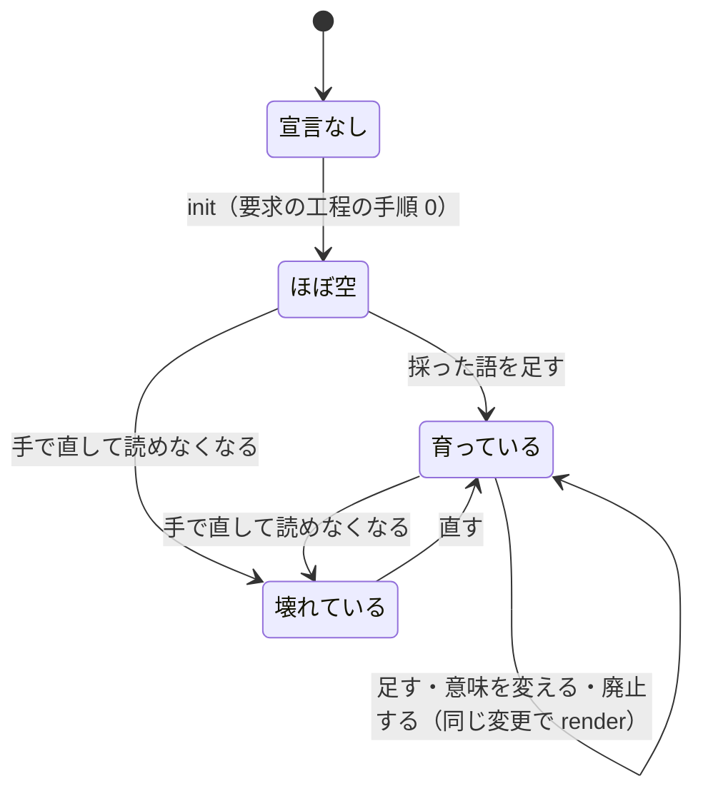

# プロジェクトのユビキタス言語を先に定めて設計する

NDF の開発ワークフローは、要求と設計の前に、そのプロジェクトのユビキタス言語（語・意味・コンテキスト）を
プロジェクトのリポジトリの用語集に定める。用語集は構造化ファイル（JSON）を正とし、人が読む Markdown の
文書をそこから作る。語を扱う処理は `plugins/ndf/scripts/glossary.py` 1 本にまとめ、LLM を使わずに、
用語集の形・文書の一致・文書に書いた語を確かめる。設計の工程を持つモード（`standard` / `legacy-refactor`）
では、宣言と用語集が揃うまで設計の工程へ入らない。要求の正は課題の本文に置き、`issues/` のファイルは
設計 Pull Request と一緒にコミットする写しにする（`plugins/ndf/scripts/spec-copy.py`）。

**手順は各 Skill の `SKILL.md` と `references/` が正である。** この文書は、決めたことの理由と、
スクリプトの入出力の契約を残す。

| 何を読むか | 正本 |
| --- | --- |
| 宣言と用語集の JSON の形・語のチェックの規則・副命令の一覧 | `plugins/ndf/skills/requirements-design/references/glossary-format.md` |
| 要求の工程の手順 0（用語集を用意する）・3a（ドメインイベント）・3b（語の突き合わせ）・7（課題の本文と写し） | `plugins/ndf/skills/requirements-design/SKILL.md` |
| ドメインモデルの節の書き方・コンテキストマップの 5 つの関係・集約の 4 つの規則・エンティティと値オブジェクトの区別 | `plugins/ndf/skills/design/references/domain-model.md` |
| 設計の工程の手順 0（入口の検査）・2（語の突き合わせ）・5（写しの確かめ） | `plugins/ndf/skills/design/SKILL.md` |
| 不変条件のテストを先に書く手順 | `plugins/ndf/skills/tdd-cycle/SKILL.md` の手順 1 |
| ai-plugins の語 | [docs/glossary.md](../glossary.md)（`docs/glossary/glossary.json` から作る） |

## 概要

| 構成要素 | 置き場所 | 責務 |
| --- | --- | --- |
| 用語集のスクリプト | `plugins/ndf/scripts/glossary.py` | 宣言と用語集の読み込み。`gate` / `init` / `candidates` / `render` / `check` / `diff` の 6 つの副命令 |
| 仕様の写しのスクリプト | `plugins/ndf/scripts/spec-copy.py` | 課題の本文から写しを作る（`write`）。本文と写しの食い違いを返す（`check`） |
| 用語集の形式の参照 | `plugins/ndf/skills/requirements-design/references/glossary-format.md` | 宣言と用語集の JSON の形、未登録の語とみなす規則、文書の形 |
| ドメインモデルの参照 | `plugins/ndf/skills/design/references/domain-model.md` | ドメインモデルの節の書き方 |
| 設計のフェーズの段 | `plugins/ndf/scripts/supervise.py` の `plan_mission_design` / `plan_fast_design` | 入口の検査（`glossary`）と、レビューの後の語のチェック（`glossary-check` ほか） |
| レビューの段 | `plugins/ndf/skills/cross-review/scripts/classifications.py` の `review_stage` / `has_domain_model`・`state.py`・`launch-reviewer.sh` | 設計 Pull Request のラウンドをモデルの段と詳細の段に分け、段ごとの観点を渡す |
| 確定仕様化の引き継ぎ | `plugins/ndf/scripts/plan-to-spec-steps.py` の `spec-finalize` | 消した設計を確定前の出所に持つ語の正本を、確定仕様へ移す |
| ai-plugins の宣言と用語集 | `.ndf/glossary.json`・`docs/glossary/glossary.json`・`docs/glossary.md` | このリポジトリのユビキタス言語 |
| ai-plugins の CI | `.github/workflows/glossary.yml` | Pull Request ごとに `glossary.py check --diff` を打つ |
| 指摘の数え方（試行） | `plugins/ndf/scripts/experimental/review-terms-count.py` | 設計 Pull Request の指摘を、語・定義と食い違いの語の並びで数える。台帳は `docs/ndf-experiments.md` |

## 用語

語の意味は用語集が正である。ai-plugins の語は [docs/glossary.md](../glossary.md) を読む
（「プロジェクトの用語集」のコンテキストに、ユビキタス言語・用語集・コンテキスト・ドメインモデルの節・
廃止した語・不変条件・未登録の語、「NDF の開発ワークフロー」のコンテキストに、用語集の宣言・語のチェック・
モデルの段・詳細の段・仕様の写しがある）。

## コンテキスト

| コンテキスト | 何の語が 1 つの意味に決まるか |
| --- | --- |
| プロジェクトの用語集（`project-glossary`） | 各プロジェクトが持つユビキタス言語。語・意味・コンテキスト・廃止した語・正本 |
| NDF の開発ワークフロー（`ndf-workflow`） | NDF が配る工程・関門・モード・段の語。`development-workflow/references/glossary.md` が持つ |

**2 つは公開された言語の関係にある。** NDF のスクリプトは、プロジェクトが書いた用語集を宣言が指す形式
（`glossary-format.md` の JSON）でだけ読む。用語集の中身の語は NDF の語彙に入らず、NDF の語彙も
用語集へ入らない。

## 背景

設計 Pull Request のレビューでは、語のずれと文書間の食い違いを LLM が見つけ直すラウンドが多かった。
ai-plugins の設計 Pull Request #742 は、返信を除いたインラインの指摘が 97 件あり、うち語・定義に当たるものが
32 件、食い違いに当たるものが 45 件だった（数え方は「効果の測り方」）。語を要求の前に定め、機械で
確かめることで、このラウンドを減らす。

## 決定と理由

| 決定 | 理由 |
| --- | --- |
| 要求の正は課題の本文にし、`issues/` のファイルは設計 Pull Request と一緒にコミットする写しにする | 課題を読む人は GitHub の上で受け入れ条件を読める必要がある。主ディレクトリの `issues/` は push するまで誰にも見えない。写しは設計と要求を同じ差分でレビューするために残す。置き場を宣言で選ぶ形は採らない（NDF の工程は課題の本文の「進行」と盤面を前提にしている） |
| 用語集の形式は JSON だけにする | `.ndf/` の宣言と同じ形式で、Python の標準ライブラリで読める。YAML は依存（PyYAML）が要り、入れていないプロジェクトでチェックが動かなくなる。宣言に `format` を置くため、形式は値を足せば増やせる |
| 未登録の語とみなすのは、見出しが `check.term_sections`（既定 `用語`）の節の表の 1 列目だけにする | 要求と設計の両方に「用語」の表があり、書き手が語として書く場所が既にある。全文から名詞を取り出すには形態素解析が要り、LLM を使わない条件と言語を問わない条件を満たせない。太字や『』は強調・引用と区別できない |
| 廃止した語は、どのコンテキストにも生きた語として無いときだけ当てる | 文書がどのコンテキストに属するかは機械的に決まらない。ある場所で廃止した語を別のコンテキストで生きた語として書くことは、1 語 1 意味をコンテキストごとに守る決まりと矛盾しない |
| 用語集の時系列は git の履歴で持つ | 意味を上書きしても前の版はコミットに残り、`diff` が 2 つの版から変化を取り出せる。用語集の中に履歴を持つと、同じ事実を 2 か所に持つ |
| 入口の検査は `gate` の 1 つにし、`design` の手順 0 と設計のフェーズの先頭の段から呼ぶ | 3 層で回すときは設計のフェーズの段が、手で回すときは `design` の手順が必ず通る。hook はそのときのモードを知らない。`documentation` は工程表に `design` を持つが、振る舞いを変えないモードに入る |
| ai-plugins の CI は、設計のブランチ（`design/` で始まる）でだけ語の規則を見る | CI は変更のモードを知らない。`light` の Pull Request が `issues/` の文書を足しても語の規則で落とさない。ほかのプロジェクトの CI へ設定を配らない（CI の形はプロジェクトごとに違い、汎用の経路は設計のフェーズの段が担う） |
| モデルの段は 1 ラウンド目だけにする | 設計 Pull Request のラウンドの上限は 3 で、モデルの段を収束まで回すと詳細の段が回らないことがある。関門を 2 つに分けてモデルを先に承認する形は、関門の数を増やさない条件に反する |
| 語を扱う処理は `glossary.py` にまとめ、既存の検査に足さない | `instructions-check.py` と `doc-lint.py` は読む宣言も規則の出所も違う。追加した行の差分の取り方だけを `doc-lint.py` と揃える |
| 語の候補は決まった 3 つの形からスクリプトが集め、領域の語かを LLM が選び、利用者が採る | 表の 1 列目・繰り返す短い太字・型の名前は、言語やリポジトリを問わず機械的に取り出せる。リポジトリ全体を LLM に読ませると、同じ入力で違う候補が出て、所要も大きい |
| 要求の工程に足した手順 0・3a・3b は `standard` のときだけ通す | 要求の工程は `light` / `operation` / `documentation` も通る。絞らないとこの 3 モードの工程と所要が変わる。`legacy-refactor` は要求の工程を通らないため、`gate` が手順 0 だけを指す |
| ドメインモデルの節は `standard` で必須、ほかのモードで該当時にする | `legacy-refactor` の設計文書は 3 節でできており、振る舞いを変えないため不変条件とドメインイベントは変わらない。`light` / `operation` に求めると、1 節で足りる設計が増える |
| 当たった規則を止める項目を宣言に持たない | 当たった規則はすべて落とす。プロジェクトが変えられるのは、どの文書を見るか（`check.paths`）と、どの表を語とみなすか（`check.term_sections`）と、正本に認める置き場（`check.source_paths`）である |
| 設計の工程で足す語は `source` を空にし、`pending_source` に設計文書を書く | 設計文書は確定前で、承認の後も確定仕様になるまで書き換わり、確定の時点で消える。正本にすると、消えた文書を指す |

## 仕様

### 集約

| 集約 | 持ち主（書き換えてよいもの） | 根 | エンティティ | 値オブジェクト |
| --- | --- | --- | --- | --- |
| 用語集 | プロジェクトの変更（Pull Request）。NDF のスクリプトでは `init`・`render`・`spec-finalize` だけが書く | 用語集のファイル（宣言の `source`） | コンテキスト（`id` で識別）・用語（コンテキストと語の組で識別） | 意味・廃止した語・正本・確定前の出所 |
| 用語集の宣言 | プロジェクトの変更。`glossary.py init` が初めの 1 回を書く | `.ndf/glossary.json` | — | 形式・置き場・検査の対象 |

人が読む文書は集約に入らない。用語集から `render` で導く写しで、独立して変わらない。

### 常に成り立つ条件

| # | 集約 | 条件 | 破れたときの扱い |
| --- | --- | --- | --- |
| I1 | 用語集 | 同じコンテキストの中で、同じ語は 1 つの意味だけを持つ（コンテキストと語の組が一意） | `check` が `duplicate` で落とす |
| I2 | 用語集 | 廃止した語は、同じコンテキストの生きた語と重ならない | `check` が `schema` で落とす |
| I3 | 用語集 | 用語の `context` は、用語集が宣言したコンテキストの `id` を指す | `check` が `schema` で落とす |
| I4 | 用語集 | 人が読む文書は、用語集のファイルから `render` で作った内容と一致する | `check` が `stale_document` で落とす |
| I5 | 用語集の宣言 | 設計の工程を持つモード（`standard` / `legacy-refactor`）では、宣言・用語集・文書が揃うまで設計の工程へ入らない | `gate` が終了コード 1 で止め、作る手順を出す |
| I6 | 用語集の宣言 | 語のチェックのスクリプトは、特定のプロジェクトの語を持たない。語はすべて用語集から読む | テストが、ai-plugins の語を 1 つも含まない用語集で全規則を通す |
| I7 | 用語集 | 宣言に `check.source_paths` があるとき、語の正本（URL を除く）はそれに当たるパスを指す | `check` が `unconfirmed_source` で落とす |

### ドメインイベント

| # | イベント | 発生元 | 受け手 |
| --- | --- | --- | --- |
| E1 | 宣言の無いまま設計に入ろうとした | `gate` | 利用者・conductor（作る手順を読む） |
| E2 | 用語集を起こした | `init` | 要求の工程（候補を集める） |
| E3 | 語を採った・足した | 利用者（用語集のファイルを直す） | `render` |
| E4 | 語の意味を変えた・語を廃止した | 利用者 | `render`・`diff` |
| E5 | 文書を作り直した | `render` | `check`（`stale_document`） |
| E6 | 未登録の語・廃止した語を書いた | 要求・設計の文書 | `check` |
| E7 | モデルの段を確定した | `cross-review` の 1 ラウンド目 | 2 ラウンド目以降のレビュー |
| E8 | 設計を確定仕様にした | `plan-to-spec-steps.py spec-finalize` | 用語集（正本を確定仕様へ移す） |
| E9 | 変更が配られた | `merged` | 振り返り・`issue-upkeep`（`diff` を報告に載せる） |

### 用語集の状態

- `gate` が通すのは「ほぼ空」（`contexts` と `terms` が空の配列）と「育っている」である。語の数は問わない
- 3 つのファイルの一部だけが無い状態は「宣言なし」に含む。`init` は宣言の置き場に従って欠けたものだけを作る
- 「壊れている」から「宣言なし」への遷移は無い。`init` は在るファイルを読めなくても上書きしない
  （上書きすると利用者が採った語が消える）

### 工程での使われ方

| 工程 | モード | すること |
| --- | --- | --- |
| 要求の手順 0 | `standard` | `gate --mode standard` が 1 なら `init` → `candidates`。候補が 1 件以上なら領域の語を選んで利用者へ示し、0 件なら依頼文から語を起こして示す。採った語だけを用語集へ書き `render` する。`gate` が 2 なら止まる |
| 要求の手順 3a | `standard` | 起きることを過去形で時間の順に並べ、引き金・失敗したとき・順序の前提を書く（表 `\| # \| イベント \| 引き金 \| 失敗したとき \| 順序の前提 \|`）。引き金や失敗の経路の無いイベント、順序を仮定するイベントを、前提か受け入れ条件か未決へ移す。番号（`E1`…）は設計のドメインイベントがそのまま使う |
| 要求の手順 3b | `standard` | 受け入れ条件を書く前に、下書きへ `check --file` を打ち、当たった語を採るか言い換えるかに分けて 0 件にする |
| 要求の手順 7 | すべて | 要求の全文を課題の本文へ書く。`standard` では `spec-copy.py write` で写しを作る |
| 設計の手順 0 | `standard` / `legacy-refactor` | `gate --mode <モード>` が 0 以外なら作る手順を示して止まる |
| 設計の手順 2 | すべて | ドメインモデルの節（コンテキスト・集約・不変条件・ドメインイベント・用語）を最初に書く。コンテキストが 2 つ以上にまたがるなら、関係を 1 つ宣言する。書いた後に `check --file <設計文書>` を打ち、新しい語・意味の変わった語・廃止する語を同じ変更で用語集へ反映して `render` する |
| 設計の手順 4 | すべて | 7 つ目の突き合わせる対「不変条件 ↔ テスト設計」: 不変条件ごとにテスト設計の行がある |
| 設計の手順 5 | `standard` | `spec-copy.py check` が 0 であることを確かめてから設計 Pull Request を出す。1 なら `write` で写しを作り直す（本文が正） |
| テスト駆動の手順 1 | すべて | 設計文書に不変条件の表があれば、不変条件 1 つにつきテストを 1 つ、受け入れ条件のテストより先に書く。テストの名前か docstring に不変条件の番号を書く |
| 振り返り | すべて | その変更の起点と終点で `diff` を打ち、「用語集の変化」の節にコンテキストごとに 1 行ずつ載せる。0 件なら節を書かない |
| `issue-upkeep` | — | 起点（直近の本番のタグ）と終点（`HEAD`）で `diff` を打ち、完了報告の表の「用語集の変化」の行に、足された語の数・廃止された語の数と語の並びを載せる |

宣言の無いプロジェクトでは、`check` と `diff` は 0 を返し、振り返りと `issue-upkeep` は何も載せない。
止めるのは `gate` だけで、`gate` を打つのは設計の工程の入口と要求の工程の手順 0（止めずに `init` へ進む）
である。宣言の無い既存のプロジェクトは、次に設計の工程へ入るときに用語集を作る手順へ案内される。

### 入出力の契約（`glossary.py`）

6 つの副命令の結果は、`lib/step_result.py` の形の 1 行の JSON（`tool: "glossary"`）で標準出力の最後の行に
出す。語と行の一覧は `items` に入る。`--root` の既定は `.` で、宣言はそこの `.ndf/glossary.json` から読む。

| 副命令 | 入力 | 出力（`items`） | 終了コード |
| --- | --- | --- | --- |
| `gate --mode M` | モード | 止めたときは作る手順の 3 行（`init` のコマンド・候補の集め方・`requirements-design` の手順 0） | 0 = 通す（`M` が `standard` / `legacy-refactor` 以外、または宣言・用語集・文書が揃い読める）。1 = 宣言・用語集・文書のどれかが無い。2 = 在るが読めない |
| `init [--source P] [--document P]` | 置き場（既定 `docs/glossary/glossary.json`・`docs/glossary.md`）。宣言があればその `source` / `document` を使い、引数は宣言が無いときだけ使う | 作ったファイル（`{name, result: "created"}`） | 0 = 3 つのうち欠けたものを作った、またはすべてある。2 = 書けない・在る宣言か用語集が読めない・置き場が境界を越える |
| `candidates [--limit N]` | 追跡しているファイル（`git ls-files`。宣言の `source` / `document`・シンボリックリンク・1,000,000 バイトを超えるファイル・UTF-8 で読めないファイルを除く） | `{term, count, kind, first}`。`kind` は `table`（`.md` の `term_sections` の節の表の 1 列目）・`bold`（`.md` の 12 字以下の太字で 3 回以上。`:` / `：` で終わる札は除く）・`type`（`.md` 以外の `class` / `interface` / `struct` / `enum` / `type X =` の名前）。用語集に既にある語は除く。多い順に並べ、`--limit`（既定 100）件まで | 0。0 件なら `summary` に「スクラッチ」 |
| `render [--check]` | 用語集 | 書いた文書。`--check` は書かずに一致を見る | 0 = 書いた・一致した。1 = `--check` で一致しない。2 = 宣言が無い・読めない |
| `check [--diff BASE \| --file P...] [--rules all\|structure]` | 起点の ref か、ファイル | `{rule, path, line, term, detail}` | 0 = 当たりなし（宣言が無いときも 0 で、`summary` に「宣言が無い」）。1 = 当たりあり。2 = 宣言・用語集・ファイルが読めない |
| `diff --base REF [--head REF]` | 2 つの版（`--head` の既定は作業ツリー） | `{change, context, term, before, after}`。`change` は `added` / `meaning_changed` / `deprecated` / `removed` | 0（宣言が無いときも 0）。片方の版に用語集が無ければ、無い側を空として比べる。`REF` そのものが無ければ 2 |

**パスはリポジトリの境界の内側に限る。** 宣言の `source` / `document` / `check.paths` と `--source` /
`--document` は、絶対パス・`..` を含むもの・シンボリックリンクを解いて `--root` の外を指すものを受けない。
どの副命令も、ファイルを読み書きする前にこれを確かめ、違反は何も書かずに終了コード 2 で止める。

### 語のチェックの規則

`check` は、用語集の形と文書の一致をいつも見る。`--rules all`（既定）で `--diff` か `--file` を渡したときは、
文書の中の語も見る。`--rules structure` は用語集の形と文書の一致だけを見る。

| 規則 | 見るもの | 当たる条件 |
| --- | --- | --- |
| `schema` | 用語集 | `contexts[]` に `id` / `name` が無い・`id` が重なる。`terms[]` がオブジェクトでない・`term` / `context` / `meaning` が無い・`deprecated` が配列でない・`source` か `pending_source` が文字列でない・`context` が宣言されていない（I3）・1 文字の廃止した語（照合できない）・廃止した語が同じコンテキストの生きた語と重なる（I2） |
| `duplicate` | 用語集 | 同じコンテキストで同じ語が 2 回ある（I1） |
| `unconfirmed_source` | 用語集 | 宣言の `check.source_paths` が空でなく、`source` が URL（`://` を含む）でも、`check.source_paths` の glob に当たるパスでもない（I7） |
| `stale_document` | 文書 | 用語集から `render` した内容と一致しない（I4）。文書が無いときも当たる |
| `deprecated` | 追加した行（`--file` ならファイル全体） | 廃止した語が現れ、その語がどのコンテキストの生きた語にも無い |
| `unregistered` | 追加した行のうち、見出しが `term_sections` の節の表の 1 列目（見出し行と区切り行を除く） | 生きた語としてどのコンテキストにも無い |

- 用語の表の 1 列目は、前後の `**` / `__` / `` ` `` を外した語で照合する。節は、同じか浅い見出しが来るまで続く
- 照合から外すもの: コードブロック・インラインコード・宣言の `document` の文書。廃止した語を説明のために
  書くときはインラインコードで囲む
- 廃止した語の出現が生きた語の出現の内側にあるとき（廃止した `カート` と生きた `カートン`）は当てない
- 英数字だけの語は単語の境界で照合する（`cart` は `cartridge` に当たらない）。語は長い順に並べた 1 つの
  正規表現で照合する
- `--diff BASE` は `git merge-base BASE HEAD` で起点を解き、その起点へ `git diff --unified=0
  --diff-filter=AM` を 1 回打つ（作業ツリーの未コミット分を含む）。`BASE` が先へ進んでも、ほかの変更が
  足した行は当たらない。追跡していないファイルは全行を見る。見るのは `check.paths` に当たるファイルだけで、
  宣言の `document` は見ない
- 当たりは標準エラーへも `ERROR: <path>:<line>: <rule>: <term>` の 1 行ずつで出す。用語集の規則の `line` は 0

### 人が読む文書

`render` だけが書く。先頭は `# 用語集` と「この文書は `<source>` から `glossary.py render` で作る。
手で直さない。」の 1 行で、続けてコンテキストごとに `## <name>（`<id>`）` の見出し、`meaning` の段落、
4 列の表（語・意味・廃止した語・正本）を書く。

- コンテキストも語も用語集のファイルの順に並べる。並べ替えると、文書の差分が用語集の差分と対応しなくなる
- 語の無いコンテキストは「語はまだ無い。」と書く。空のセルは `—`、正本はインラインコードで書く
- セルの中の `|` は `\|` に、改行は空白に置き換える
- 廃止した語は `、` で区切る。確定前の出所（`pending_source`）は文書に出さない

### 確定仕様へ移すときの正本

`plan-to-spec-steps.py spec-finalize --spec <確定仕様> --design <設計>...` は、設計のファイルを `git rm` した
後、宣言と用語集があれば、消した設計のパスを `pending_source` に持つ語の `source` を確定仕様のパスにし、
`pending_source` を消す。用語集を書き直して `glossary.py render` を打ち、用語集と文書を同じコミットに入れる
（結果の `items[]` に `{kind: "glossary", name: <語>, result: "promoted", source: <確定仕様>}`）。
`render` が失敗すると止まる。

### 設計のフェーズの段（`supervise.py`）

| 段 | 種類 | 中身 | 遷移 |
| --- | --- | --- | --- |
| `glossary` | run | `glossary.py gate --mode <モード> --root .` | 0 → `design`。0 以外は `on_fail` を置かずに止まる（作る手順は段の結果の `summary` に載る） |
| `design` | work | `/ndf:design #<課題>` | `pr` |
| `pr` | pr | 設計 Pull Request を出す | `review` |
| `review` | drive | `cross-review`（設計の既定 3 ラウンド） | `sync-review`（失敗は `gate`） |
| `sync-review` | run | `git fetch -q && git merge -q --ff-only '@{u}'`（レビューの直しに追いつく） | `glossary-check` |
| `glossary-check` | run | `glossary.py check --diff origin/<base> --root .` | 0 → `push-glossary`。1 → `fix-glossary` |
| `fix-glossary` | work | 未登録の語は用語集へ足す（`source` を空にし `pending_source` に設計文書を書く）か言い換え、廃止した語は言い換える。用語集を変えたら `render` してコミットする（push しない）。利用者が採るかを決めるべき語は直さずに「判断が要る」と報告する | `glossary-recheck` |
| `glossary-recheck` | run | `glossary-check` と同じ | 0 / 1 とも `push-glossary`（fast は 1 → `push-glossary-gate`） |
| `push-glossary` | run | 設計のブランチを push し、`pr-body-decisions.sh sync` で設計 Pull Request の本文を揃える（直しが無ければ何も送らない） | `gate`（fast は `mvv`） |
| `push-glossary-gate` | run | fast だけの段。`push-glossary` と同じ | `gate` |
| `gate` | judge | 関門 1。`review` と `glossary-recheck` を入力に持ち、当たりが残っていれば関門 1 の提示に載せる | — |

**語の直しは 1 回だけ試す。** 残った当たりは語を採るかという利用者の判断であることが多く、往復させても
減らない。`pace: fast` で当たりが残ると、`mvv` の判定へ渡さずに関門 1 の judge へ回して利用者の承認を
求める（`mvv-gate.py` は語のチェックの結果を読まない）。

### レビューの 2 段（`cross-review`）

| 項目 | 形 |
| --- | --- |
| 段を決める関数 | `classifications.review_stage(kind, round_no, has_model)`。`design` かつ 1 ラウンド目かつ `has_model` なら `model`、ほかの `design` は `detail`、`code` は `None` |
| `has_model` | `init` が決め、状態ファイルの `design_has_model` に持つ。変更した設計文書（`-design.md` / `-design-decisions.md`）のどれかに見出し `## ドメインモデル` があれば真 |
| 状態ファイル | `design_has_model`・`review_instructions_by_stage`（`{"model": 文字列, "detail": 文字列}`）・ラウンドごとの `rounds[].stage` |
| 担当へ渡す観点 | `launch-reviewer.sh` がそのラウンドの段の文字列を追加レビュー観点へ差し込む。`review_instructions_by_stage` が無い状態ファイルは `review_instructions` を使う |
| 抜ける条件 | `model` のラウンドが収束しても抜けない（`verdict: model_confirmed`、`MODEL_CONFIRMED=1` を出して終了コード 2）。修正を挟まずに詳細の段のラウンドへ進む。`detail` のラウンドは収束の判定で抜ける。ラウンドの上限 3 と関門の数は変わらない |

| 段 | 見るもの | 観点 |
| --- | --- | --- |
| モデル | ドメインモデルの節と用語集の差分だけ | コンテキストをまたぐのに関係の宣言が無くないか。集約の持ち主が 1 つに決まっているか。不変条件どうしが矛盾しないか・1 行 1 条件か。ドメインイベントに受け手があり、要求の番号を引き継いでいるか。用語の表が同じ変更の用語集に反映されているか。節の外への指摘は書かない |
| 詳細 | 残りの節 | 設計の観点に、用語集どおりか（用語集に無い語・廃止した語で書いていないか）・不変条件を破っていないか・コンテキストの境界を越えていないか（宣言した関係の外で、ほかのコンテキストの集約を書き換えていないか）を足す。ドメインモデルの節は確定したものとして扱う |

「確定」は、1 ラウンド目のモデルの段が終わった時点を指す。関門 1 は詳細の段の後の 1 回だけである。

### 入出力の契約（`spec-copy.py`）

結果は `lib/step_result.py` の形の 1 行の JSON（`tool: "spec-copy"`）。課題の本文は `gh issue view --json body`
（`--repo OWNER/REPO` を渡せる）で読む。

| 副命令 | 出力 | 終了コード |
| --- | --- | --- |
| `write <課題> <ファイル>` | 先頭の見出しと「正は課題の本文」の 1 行に続けて、本文の `## 進行` より前の全文を書く | 0 = 書いた。2 = 本文を読めない・書けない |
| `check <課題> <ファイル>` | 食い違う節の見出しと差分（`items`） | 0 = 本文の各 `##` の節（`## 進行` を除く）が写しに同じ中身である。1 = 無い節か中身の違う節がある。2 = 読めない |

写しにしか無い節（計画など）は許す。比べるのは本文にある節だけで、行末の空白と節の後ろの空行は比べない。

## データ・設定

### 宣言（`.ndf/glossary.json`）

| 項目 | 型 | 空を許すか | 意味 |
| --- | --- | --- | --- |
| `version` | 整数 | 許さない | `1`。ほかの値は終了コード 2 |
| `format` | 文字列 | 許さない | 用語集の形式。`json` だけ。ほかの値は終了コード 2 |
| `source` | 文字列 | 許さない | 用語集のファイルのパス（リポジトリの根から） |
| `document` | 文字列 | 許さない | 人が読む文書のパス |
| `check.paths` | 文字列の配列 | 許す | 追加した行を見る文書の glob。空は「どの文書も語を見ない」（用語集の形と文書の一致は見る） |
| `check.term_sections` | 文字列の配列 | 許す | 未登録の語とみなす表を持つ節の見出し。無いときは `["用語"]` |
| `check.source_paths` | 文字列の配列 | 許す | 語の正本（`terms[].source`）に認めるパスの glob。確定した文書（確定仕様・配布した手順）だけを書く。空か無いときは正本の置き場を見ない |

`init` が書く宣言は、`check.paths` に `issues/*-requirements.md`・`issues/*-design.md`・
`issues/*-design-decisions.md`、`check.term_sections` に `["用語"]` を持ち、`check.source_paths` を持たない。

### 用語集（`source`）

| 項目 | 型 | 空を許すか | 意味 |
| --- | --- | --- | --- |
| `version` | 整数 | 許さない | `1`。ほかの値や、`contexts` / `terms` が配列でないものは読めない（終了コード 2） |
| `contexts[].id` | 文字列 | 許さない | コンテキストの識別子。用語集の中で一意 |
| `contexts[].name` | 文字列 | 許さない | 文書の見出しに使う名前 |
| `contexts[].meaning` | 文字列 | 許す | 何の語が 1 つの意味に決まる範囲か |
| `terms[].term` | 文字列 | 許さない | 語 |
| `terms[].context` | 文字列 | 許さない | `contexts[].id` のどれか |
| `terms[].meaning` | 文字列 | 許さない | 意味 |
| `terms[].deprecated` | 文字列の配列 | 許す | 廃止した語（旧称）。2 文字以上。空の配列と項目が無いことは同じ |
| `terms[].source` | 文字列 | 許す | 正本（その語の意味を決めている確定した文書のパスか URL）。空は「用語集そのものが正本」 |
| `terms[].pending_source` | 文字列 | 許す | 確定前の出所（語を決めた設計文書のパス）。`spec-finalize` がその設計を消すときに、`source` を確定仕様へ移してこの項目を消す |

### このリポジトリへの適用

ai-plugins の宣言は `source` に `docs/glossary/glossary.json`、`document` に `docs/glossary.md`、
`check.paths` に `init` の既定の 3 つ、`check.term_sections` に `["用語"]`、`check.source_paths` に
`docs/specifications/*.md`・`plugins/ndf/skills/*.md` を持つ。

CI（`.github/workflows/glossary.yml`）は Pull Request ごとに `glossary.py check --diff origin/<base>` を打つ。
head のブランチが `design/` で始まるときは `--rules all`、ほかは `--rules structure` である。ブランチ名は
環境変数で渡し、シェルの本文へ埋めない。

## 運用

- 用語集を変えたら、同じ変更で `glossary.py render` を打って文書を作り直す
- 設計とレビューの修正で新しい語を使うときは、同じ変更で「用語」の表に書き、用語集へ足す（`source` を空に
  し、`pending_source` にその設計文書を書く）。確定仕様にするときに `spec-finalize` が正本を移す
- 語の意味を変えたとき・語を廃止したときも、同じ変更で用語集を直す。廃止した語は `deprecated` へ移し、
  新しい語の項目に持たせる
- `light` / `documentation` / `operation` の工程と所要は変わらない（`gate` は 0 を返し、要求の工程の
  手順 0・3a・3b は通らない）

### 効果の測り方

`experimental/review-terms-count.py` は、設計 Pull Request の返信を除いたインラインの指摘の本文を、次の語を
含めば当たりとして数え、ラウンド数を添える。1 件が両方に当たれば両方に数える。

| 区分 | 語 |
| --- | --- |
| 語・定義 | 用語・語・呼び・名前・名称・定義・意味・表記・揺れ |
| 食い違い | 食い違・矛盾・一致しない・整合・ずれ・異なる・合わない |

基準の値は #742 にあった指摘 97 件・語・定義 32 件・食い違い 45 件で、次の設計 Pull Request の値を
`docs/ndf-experiments.md` の台帳とその Pull Request のコメントに残す。

## テスト観点

- 宣言・用語集・文書のどれかが無いと、`gate --mode standard` / `legacy-refactor` が 1 と作る手順の 3 行を返し、
  設計のフェーズの先頭の `glossary` の段が `on_fail` を持たないこと。`light` / `operation` / `documentation` では 0 であること
- `init` が欠けたものだけを作り、在るファイルを上書きしないこと。どれが欠けた状態から打っても次の `gate` が 0 になること
- `candidates` が文書とコードのあるリポジトリで 3 つの形を返し、空のリポジトリで 0 件と「スクラッチ」を返すこと
- `terms` が空の用語集でも `gate` が 0 であること
- `render` がコンテキストごとの見出しと 4 列の表を書き、用語集だけを変えた差分で `check` が `stale_document` で落ちること
- 「用語」の表に未登録の語を足した差分で `unregistered` が当たり、同じ差分に用語集への追加と `render` を足すと 0 になること
- `check --file` がファイル全体を見て、未登録の語と廃止した語の両方を返すこと
- 項目の欠け・I2・I3 で `schema`、同じコンテキストの同じ語で `duplicate` が当たり、別のコンテキストの同じ語は当たらないこと
- `check.source_paths` に当たらない `source` で `unconfirmed_source` が当たり、URL は当たらないこと
- `--diff` で追加した行だけが当たり、`BASE` 側だけが先へ進んで足した行は当たらないこと。コードブロックとインラインコードは当たらないこと
- ai-plugins の語を 1 つも含まない用語集で、上の規則がすべて通ること
- 境界を越えるパスで 6 つの副命令が 2 で止まり、ファイルが増えも変わりもしないこと
- `diff` が 4 つの `change` を返し、宣言の無いリポジトリで `check` と `diff` が 0 であること
- `review_stage` が design の 1 ラウンド目で `model`、2 以降と `has_model` が偽のときに `detail`、code で `None` を返し、モデルの段の APPROVE で抜けないこと。担当のプロンプトにそのラウンドの段の観点が入ること
- `spec-copy.py write` の出力が本文の `## 進行` より前と一致し、写しにしか無い節があっても `check` が 0、本文の節の中身を変えると 1 であること
- `spec-finalize` が、消した設計を `pending_source` に持つ語の `source` を確定仕様へ移し、文書を作り直して同じコミットに入れること
- 語のチェックが ai-plugins の設計文書 1 本に対して 5 秒以内に終わること

テストは `plugins/ndf/scripts/tests/test_glossary.py`・`test_spec_copy.py`・`test_supervise.py`・
`test_step_scripts.py` と `plugins/ndf/skills/cross-review/tests/test_review_stage.py` にある。

## 関連リンク

- [用語集の形式](../../plugins/ndf/skills/requirements-design/references/glossary-format.md)
- [ドメインモデルの節の書き方](../../plugins/ndf/skills/design/references/domain-model.md)
- [ai-plugins の用語集](../glossary.md)
- [NDF の開発ワークフローの語彙](../../plugins/ndf/skills/development-workflow/references/glossary.md)
- [ndf-design-phase.md](ndf-design-phase.md)
