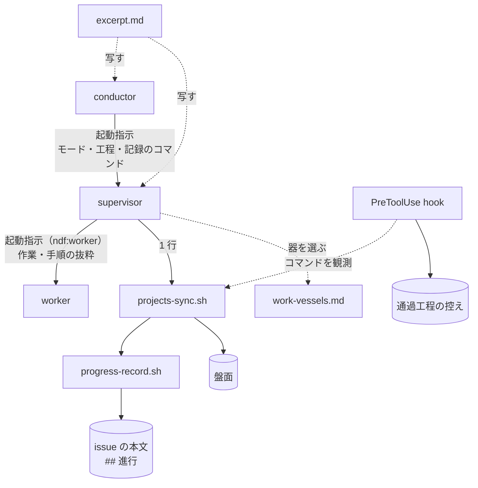

# サブエージェントに Skill 本文を読ませず、仕事を分ける器を選ぶ

3 層（conductor → supervisor → worker）のサブエージェントに、Skill の本文を丸ごと読ませない。
supervisor は進行を記録のコマンド 1 行で残し、worker は Skill と Agent のツールを外した
エージェント定義 `ndf:worker` で動き、要る手順は起動指示に写した抜粋で受け取る。あわせて、
仕事を別の文脈・別のプロセスへ渡すときの器を 1 つの表から選び、小さな作業にはサブエージェントを
起こさない。この文書は、構成・入出力の契約・規則と、それぞれをそう決めた理由を残す。

**規約は Skill の文書が正である。** 起動指示の雛形・規則の本文・比較表をここへ書き写さない。

| 何を読むか | 正本 |
| --- | --- |
| conductor → supervisor / supervisor → worker の起動指示の雛形と守る規則、委譲の線 | `plugins/ndf/skills/development-workflow/references/agent-layers.md` |
| 器の比較表、仕事ごとの選び方、小さな作業の線引き、サブエージェントの Tool を定義で絞る理由 | `plugins/ndf/skills/development-workflow/references/work-vessels.md` |
| 抜粋の形・置き場所・入れるもの / 入れないもの・上限を超えたときの扱い | `plugins/ndf/skills/EXCERPTS.md` |
| 記録のコマンドのキーと打つ時点、「ミッションを閉じる」手順 | `plugins/ndf/skills/progress-tracking/SKILL.md`（抜粋は `references/excerpt.md`） |
| worker のエージェント定義 | `plugins/ndf/agents/worker.md` |

## 概要

**例（設計のフェーズの supervisor が 1 工程を記録する）。** conductor は `development-workflow` を
読んでモードを判定し、`$SCRIPTS` を解いた絶対パスで起動指示の「記録のコマンド」を書く。

```text
記録のコマンド: bash "/home/u/.claude/plugins/cache/ai-plugins/ndf/10.17.1/scripts/projects-sync.sh" <課題番号> <キー> "<値>"
```

supervisor は設計の工程に入った時点で `bash "<絶対パス>/projects-sync.sh" 828 stage "設計"` を
1 回の Bash 実行で打つ。issue の本文の `## 進行` と盤面の両方に残り、通過工程の控えにも
「設計」が積まれる。supervisor は `progress-tracking`（本文 約 7,600 トークン）も
`development-workflow`（約 10,700 トークン）も起動しない。本文は起動するとフェーズが終わるまで
文脈に残り、以後の呼び出しのたびに読み直される。

**背景は #827 の実測である。** 2026-09-20 以降のサブエージェント 156 件で、Skill 本文は持ち越し
量の 16% を占めた。読み込みの多い Skill のうち、supervisor / worker が本文の大半を使わないのは
`progress-tracking`（40 回 × 7,649）と `development-workflow`（28 回 × 10,679）の 2 つだった。
また、同じ種類の仕事で渡す器が回ごとに割れ、小さな作業にもサブエージェントの固定費を
払っていた（#680）。

**工程の Skill の起動は減らさない。** supervisor が `requirements-design` / `design` / `pr` /
`cross-review` などを起動するのはフェーズの仕事そのものである。外すのは、工程の外から読まされる
`development-workflow`（振り分けは conductor が済ませている）と `progress-tracking`（使うのは
1 行）と、worker が読む Skill である。工程の Skill の本文を縮めるのは #845 の子が行う。

## 用語

| 用語 | 意味 |
| --- | --- |
| Skill 本文の読み込み | Skill ツールで Skill を起動すること、または `SKILL.md` を Read すること。どちらも本文全体が文脈に載る |
| 工程の Skill | `development-workflow` の工程表が起動する Skill |
| 工程の外の Skill | 工程表に載らず、どの工程からも呼ばれる Skill（`progress-tracking` / `out-of-scope` など）と、工程の振り分けを持つ `development-workflow` |
| 記録のコマンド | `projects-sync.sh <課題番号> <キー> <値>` の 1 行。issue の本文・盤面・通過工程の控えへ同時に残る |
| 抜粋 | Skill の本文から、呼ぶ側が要る部分だけを取り出した写し。形は「呼び出し・結果の読み方・判断の基準」 |
| 器 | 仕事を渡す先の実行の形。その場 / サブエージェント / CLI 実行 / 最小構成の `claude -p` / スクリプト（背景の bash を含む）の 5 つ |
| 固定費 | 器を 1 つ起こすたびに、仕事の前に読む量（システムプロンプト・ツール定義・指示）。`context-window.md` の定義と同じ |

## 構成要素

| 要素 | 責務 |
| --- | --- |
| `plugins/ndf/scripts/projects-sync.sh` | **記録のコマンドの入口。** 引数を検査した後、`stage` / `mode` / `worktree` / `plan` では盤面の宣言の有無にかかわらず先に `progress-record.sh` を呼んで issue の本文を更新し、その後で盤面を更新する。`status` は盤面だけに書く |
| `plugins/ndf/scripts/progress-record.sh` | issue の本文の `## 進行` の更新。工程名の位置に `-` を受けると、チェックリストを変えずに見出し行（モード・作業ツリー・計画ファイル）だけを更新する |
| `plugins/ndf/agents/worker.md` | worker のエージェント定義（`ndf:worker`）。frontmatter の `disallowedTools: Skill, Agent` で 2 つのツールを外す |
| `plugins/ndf/.claude-plugin/plugin.json` | `agents` 配列に `./agents/worker.md` を載せる。agy へは `plugins/ndf/dev.agy/agents`（`../agents` への symlink）で同じ定義が配られる |
| `development-workflow/references/agent-layers.md` | 起動指示の雛形と守る規則。「委譲の線」から `work-vessels.md` を指す |
| `development-workflow/references/work-vessels.md` | 器の比較表、仕事ごとの選び方、小さな作業の線引き、Tool を定義で絞る理由 |
| `development-workflow/references/context-window.md` | 「委譲する対象と、しない対象」から `work-vessels.md` を指す（写さない） |
| `development-workflow/references/stage-completeness.md` | 用語「進行の記録」に、同じ 1 回で issue の本文も更新されることを書く。控えの読み方は変えない |
| `development-workflow/SKILL.md` | conductor が `$SCRIPTS` を解いてから supervisor を起動し、記録のコマンドを絶対パスで書くこと |
| `plugins/ndf/skills/EXCERPTS.md` | 抜粋の規約。`AUTHORING.md` から 1 文で指す（`AUTHORING.md` は分割の基準の 500 行に達しているため別ファイルにした） |
| `progress-tracking/SKILL.md` / `references/excerpt.md` | 「呼び方」を記録のコマンド 1 行にし、抜粋を指す。抜粋は形の見本を兼ねる |
| 工程の Skill 20 個の末尾の記録の文 | 「この工程に入ったら記録のコマンド `bash "$SCRIPTS/projects-sync.sh" <issue番号> stage "<工程名>"` を 1 行打つ」の形。`design` は契機が 2 つあり、2 行を示す |



## 仕様

### 常に成り立つ条件

- **記録のコマンドの失敗で工程を止めない。** 呼び出し側の誤り（知らないキー・工程表に無い値・
  引数の不足）だけが終了コード 2 で、それ以外はすべて 0 で終わる。`progress-record.sh` が
  失敗しても盤面の更新へ進む
- **引数の検査は何かを書く前に行う。** 値の誤りで 2 を返すときに、issue の本文だけが書かれた
  状態を作らない
- **記録のコマンドは 1 回の Bash 実行に 1 件である。** 通過工程の控えは 1 回の実行の最初の記録しか
  読まない
- **supervisor は `development-workflow` を起動しない。** `progress-tracking` を起動するのは、
  終わりの工程で「ミッションを閉じる」手順を行うときだけである
- **worker は Skill を起動せず、`SKILL.md` を読まない。** 起動指示が Skill の起動そのものを
  手順として渡したときだけ、その 1 つを起動してよい。起動してよいかは起動指示を書く側が決める
- **抜粋の正本は本文である。** 抜粋に本文に無い規則を置かない

### 記録のコマンド

入口を `projects-sync.sh` にしたのは、通過工程の控えがこのコマンドを観測して積むためである。
入口を変えなければ hook の照合と `stage-completeness.md` の「変わらない 4 つの契約」を変えずに、
1 行で 3 か所へ残せる。`progress-record.sh` を入口にすると hook の照合とテストが変わり、包みの
スクリプトを足すと hook が覚える名前が 3 つになる。

```text
projects-sync.sh <課題番号> <キー> <値>
  キー: stage | mode | status | worktree | plan
```

| キー | 打つ時点 | issue の本文 | 盤面 | 通過工程の控え |
| --- | --- | --- | --- | --- |
| `stage` | 工程に入るたび（課題ごと） | `progress-record.sh <課題> "<値>"`（チェックを付ける） | 工程のフィールド | 工程を積む |
| `mode` | フェーズの最初の工程で 1 度 | `progress-record.sh <課題> - --mode <値>`（見出し行だけ） | モードのフィールド | モードを書く |
| `worktree` | 作業場所の用意の後に 1 度 | `progress-record.sh <課題> - --worktree <値>` | 作業ツリーのフィールド | 読まない |
| `plan` | 計画の後に 1 度 | `progress-record.sh <課題> - --plan <値>` | 計画ファイルのフィールド | 読まない |
| `status` | 「ミッションを閉じる」だけ | 書かない | Status | 読まない |

見出し行だけを更新するときは、既にある見出し行のモード・作業ツリー・計画ファイルのうち
渡さなかったものを引き継ぐ。

| 条件 | 終了コード | 出力 |
| --- | --- | --- |
| issue の本文を書き換えた | 0 | `stage` は `#<課題> 進行 = <工程>`、他のキーは `#<課題> 進行の見出し = モード: …`。盤面の宣言があれば盤面の行が続く |
| 同じ値を記録し直した（issue の本文が変わらない） | 0 | issue の本文の行は出ない。盤面の宣言があれば盤面の行だけが出る |
| 盤面の宣言が無い | 0 | issue の本文の行だけ |
| `gh` が無い | 0 | 出力なし。issue の本文も盤面も書かない |
| issue を取得できない | 0 | issue の本文の行は出ない。盤面の更新は続ける |
| 盤面が上限・盤面にアイテムを追加できない | 0 | `NOTE:` の 1 行 |
| 知らないキー・工程表に無い値・引数の不足 | 2 | `ERROR:` の行。issue の本文も盤面も書かない |

**`progress-record.sh` を直接呼ぶのは 2 つの場合だけである。** 他のリポジトリの課題へ書く
（`--repo`。盤面へは書かない）ときと、付随情報を足す（`--note`）ときである。

### supervisor の起動指示

`agent-layers.md` の「conductor → supervisor」の `prompt` は 9 項目と守る規則 10 個を持つ。
この仕様が足した項目は「記録のコマンド」である。

| 項目 | 中身 |
| --- | --- |
| 記録のコマンド | コマンドの頭 `bash "<絶対パス>/projects-sync.sh" <課題番号> <キー> "<値>"` と、キー（`stage` / `mode` / `worktree` / `plan`）ごとの打つ時点。conductor が `$SCRIPTS` を解いた絶対パスを二重引用符で囲んで書く。打つ時点は `progress-tracking` の抜粋の「呼び出し」を写す |

- **`$SCRIPTS` は conductor が解く。** 解決は `scripts-lookup.md` の長いコードブロックで、
  supervisor がそのたびに読むと本文を外した効果の一部が戻る。conductor は `development-workflow` を
  読んでいるため解決の手順を既に持っている。`$SCRIPTS` の解決を 1 コマンドにする #847 が入った後も、
  絶対パスを渡す形はそのまま使える
- **パスを二重引用符で囲むのは、空白を含むパスで語が割れないためである。** 通過工程の控えは
  引用符を外した語を読むため、囲んでも記録として観測される
- **モードと通す工程は起動指示の「モード」「フェーズ」が持つ。** そのため supervisor は
  `development-workflow` を読まずにフェーズを通せる

supervisor の守る規則のうち、この仕様に関わるのは 2 つである。規則の数は 10 のまま変えない。
conductor の起動指示と、それを写した手順が「10 個」と数で指しているためである。

| # | 規則 |
| --- | --- |
| 3 | 工程に入った時点で起動指示の「記録のコマンド」を課題ごとに 1 回打つ。1 回の Bash 実行に 1 件。`development-workflow` を起動しない。ミッションを閉じるときだけ `progress-tracking` を起動して本文の手順に従う |
| 7 | 委譲してよい作業は worker へ出し、委譲しない 5 つは自分で行う。小さな作業は worker へ出さずにその場で行う（`work-vessels.md` の線引き） |

「ミッションを閉じる」手順は `progress-tracking` の本文に残る。#856 がこれを `mission-close.py` へ
移した時点で、この例外も要らなくなる。

### worker の起動指示と定義

`agent-layers.md` の「supervisor → worker」は `subagent_type: ndf:worker` を指し、`prompt` は
作業・入力・手順・返す形・置き場所の 5 項目と守る規則 6 個を持つ。

| 項目 | 中身 |
| --- | --- |
| 手順 | 作業に要る手順の抜粋（呼び出し・結果の読み方・判断の基準）。抜粋の元の Skill の `references/excerpt.md` を写す。抜粋が無い Skill の手順が要るときは、supervisor が要る段落だけを写す |
| 置き場所 | 長い出力と報告の写しを書くファイルの絶対パス。supervisor が必ず渡し、worker は写しを書き終えた後に完了の目印 `<置き場所>.done` を作る（#901。理由は [待ち方の仕様](ndf-token-waits-and-context-cut.md) の「途中の通知を受けたとき」） |

worker の規則 6 は「Skill を起動しない。`SKILL.md` を読まない。手順は起動指示の『手順』に従い、
足りないときは `結果: 判断が要る` で返す。起動指示が Skill の起動そのものを手順として渡したとき
だけ、その 1 つを起動してよい」である。worker が自分の判断で工程の Skill を起動すると、進行の
記録・確認の段・関門の判断のように worker が持たない責務が worker の文脈で動く。「必須」の手順が
担当の判断で置き換わった前例（#676）があるため、判断を worker に任せない。

「委譲の線」の `修正` は「レビューの指摘の修正とコミット。送る（push）のは起動した側」である。

**規則 6 を文面だけにせず、定義で塞ぐ。** `plugins/ndf/agents/worker.md` の frontmatter は次の形である。

```markdown
---
name: worker
description: NDF の 3 層の worker。1 つの作業（調査・修正・検証・集計）を行い、作業の報告で返す
disallowedTools: Skill, Agent
---
```

| 書き方 | 理由（2026-09-23、Claude Code の実測） |
| --- | --- |
| Skill を外す | 外した定義の子は `ToolSearch select:Skill` が `No matching deferred tools found.` を返し、文面で `/ndf:<Skill>` を渡しても本文が載らなかった |
| Agent も外す | Skill だけを外した子が Agent で起こした `general-purpose` の孫は Skill を使えた。worker は葉であるという規則も同じ 1 行で守る |
| 拒否の一覧（`disallowedTools`）で書く | 許可の一覧（`tools`）で書くと、書いた `Grep` / `Glob` が子に現れなかった |
| 例外の経路は定義を分ける | 定義の中で Skill を 1 つだけ許す書き方はできない（`Skill(ndf:fix)` と書いても、Skill のツール全体が入るか消えるかになった） |

- **例外は今 `cross-review` の修正（`/ndf:fix` を渡す経路）だけである。** この経路は
  `general-purpose` のまま起動し、`ndf:worker` を使わない。`fix` を抜粋へ置き換える #859 の後に
  `ndf:worker` へ移す
- **`SKILL.md` の Read は定義では塞げない。** worker は抜粋を読むために `skills/` 配下の Read を
  要し、Read をパスで分ける手段は定義に無い。規則 6 の文面で縛り、起動指示の「手順」に抜粋を
  写して渡すことで読む理由を無くす
- **hook で Skill の起動を拒む形は採らない。** hook の入力から起動元の worker を見分けられるかを
  確かめておらず、定義の 1 行で足りる
- **worker は専門エージェントの一覧に入れない。** 説明の数は「専門エージェント 8 個と、3 層の
  worker の定義 1 個」と別枠で書く（`README.md` / `plugins/ndf/README.md` /
  `docs/ndf-plugin-reference.md` / `AGENTS.md` / `plugin.json` の `description`）

### 抜粋

抜粋は `plugins/ndf/skills/<Skill名>/references/excerpt.md` に置く。**1 つの Skill に 1 ファイルである。**
写す側（conductor・supervisor）が本文を開かずに抜粋だけを読め、同じ Skill の中にあるため本文を
直す人の目に入る。`SKILL.md` の中の節に置くと本文を開けば全体が文脈に載り、`agent-layers.md` に
まとめると本文から離れて食い違いに気づけない。

```markdown
<!-- ndf-excerpt: <Skill名> -->
# <Skill名> の抜粋

## 呼び出し

## 結果の読み方

## 判断の基準
```

| 規約 | 内容 |
| --- | --- |
| 目印 | 1 行目の `<!-- ndf-excerpt: <Skill名> -->`。抜粋と本文の一致の検査（#855）が抜粋を見つける起点 |
| 見出し | `## 呼び出し` / `## 結果の読み方` / `## 判断の基準` の 3 つだけ、この順 |
| 分量 | 40 行以内かつ 2,000 文字以内（目印・見出し・空行を含む） |
| 本文から指す | `SKILL.md` に「呼ぶ側へ渡す抜粋は `references/excerpt.md`」の 1 行を置く |

| 入れる | 入れない |
| --- | --- |
| worker（または supervisor）がその作業で打つコマンド | 上の層の責務（進行の記録・push・投稿・起票・関門の判断） |
| 結果の読み方（出力・終了コード・結果ファイルの形） | 対話の確認（利用者へ問う段）。worker では「行わない」側に読み替えて書く |
| その作業の中で下す判断の基準 | 値を解決するコード（`$SCRIPTS` / `$SKILL_DIR` / 起点ブランチ / 起票先）。上の層が解いた値を起動指示の「入力」で渡す |
| | 例・図・チェックリスト・理由の説明 |
| | 他の Skill の抜粋と重なる内容。その Skill の名前だけを書く |

**上限は中身の規則で守り、数で確かめる。** 種類の違う 8 つの Skill（`progress-tracking` /
`fix` / `cross-review` / `markdown-writing` / `quality-gates` / `tdd-cycle` / `pr-review` /
`out-of-scope`）で worker の作業に要る部分だけを下書きすると、28〜39 行・792〜1,595 文字に
収まった。収まったのは値の解決コード・例・上の層の責務を外したからである。行だけで縛ると
1 行を長くして収められるため、文字数も縛る。種類による差は上限を分けるほど開かなかったため、
上限は 1 つにした。

**上限を超えたときは抜粋を割らない。** 割ると #855 の検査が本文と抜粋を 1 対 1 で対応づけられない。
次の順で扱う。

1. 「入れない」に当たるものを外す
2. それでも超えるなら、超えさせた手順（長いコマンドの列・分岐の多い判断）をスクリプトへ出す。
   本文を縮める #845 の子の仕事であり、その課題の受け入れ条件へ足す
3. スクリプトへ出るまでは抜粋を置かず、supervisor が要る段落を起動指示の「手順」へ写す

**置いてある抜粋は `progress-tracking` の 1 つで、形の見本を兼ねる**（30 行）。他の Skill の抜粋は
#845 の子が `SKILL.md` を縮めるときに作る。いま作ると、スクリプト主体へ移った後に書き直すためである。

| Skill | 抜粋を作る課題 |
| --- | --- |
| `fix` | #859 |
| `cross-review`（修正の worker の分。`fix` の名前を書いて重ねない） | #870 |
| `markdown-writing` | #873 |
| `quality-gates` / `tdd-cycle` | #871 |
| `pr-review` | #860 |
| `out-of-scope` | #865 |

`worktree` と `pr` は抜粋を作らない。作業場所の用意は supervisor の工程で、検証の worker が要る
テスト環境のコマンドは supervisor が「入力」で渡す。`pr` は push の前に同意が要り、人へ問えない
worker には渡さない。

### 器の選び方

器の比較表（上の層の文脈・固定費・確実性・止まりにくさ・独立性・資源・観測性・手順の従いやすさの
8 観点 × 5 つの器）と、仕事ごとの選び方の表は `work-vessels.md` にある。器と #845 の判断の 3 段の
対応は次のとおりである。

| 器 | #845 の段 | 主に渡す仕事 |
| --- | --- | --- |
| その場 | 段 3（その会話の LLM） | 小さな読解・1 コマンドの実行 |
| サブエージェント | 段 3 | 読む量が大きく返す量が小さい読解（worker の `調査` / `集計`）、作業ツリーを書き換える修正（worker の `修正`） |
| CLI 実行 | 段 3（別の LLM） | 別の視点のレビュー・提案 |
| 最小構成の `claude -p` | 段 2（分類の判断） | 分類の判断 1 つ。#841 が入るまでは選ばず、その場で行う |
| スクリプト | 段 1 | 決まった手順（進行の記録・集計・検査の実行・待ち）、600 秒を超える待ち（背景で起動して完了通知を待つ） |

- **比較表は `agent-layers.md` とは別の文書に置く。** `agent-layers.md` に足すと分割の基準の
  500 行を超える。`context-window.md` に足すと、切れ目と委譲の線と残量を持つ文書の責務が広がる
- **可搬性の列は置かない。** 4 ランタイムでの扱いは #888 が決める
- **supervisor のスクリプト駆動（#827 の方針）は、この表の上で「工程の進行をスクリプトへ、判断を
  最小構成の `claude -p` へ」と位置づける。** 採否は #827 が決める

### 小さな作業にサブエージェントを起こさない

**起こす前に 1 件ごとに判定する。** 次のどちらかに当たる作業は worker へ出さず、その場で行う。

| # | 条件 | 例 |
| --- | --- | --- |
| 1 | 読む量の見込みが、worker の固定費を下回る | 1 つのファイルの数十行を読む、`gh issue view` を 1 回打つ、記録のコマンドを打つ |
| 2 | 返す量が読む量と変わらない（結果を上の層がそのまま読む） | 1 つのコマンドの出力を全部読む必要がある確認、短い差分の確認 |

- **線引きは比で書き、固定費の値を書かない。** 固定費はリポジトリとモデルで変わる。導入した先で
  `skill-stats --agents` が測った値を使い、測っていなければ「起こす会話の最初の 1 回の読み込みの
  量」を目安にする。行数やトークン数の閾値で書くと、書いたリポジトリの値が別の環境の値として読まれる
- **読む量が見込めないときは、その場で量だけを測ってから決める**（`wc -l` や件数の問い合わせ）
- **この判定は起こす前の見込みである。** 起こした後の測定で、フェーズの中の小さな worker を束ねるかを
  決めるのは #773 の候補 2 である。この線引きは #773 の測定の入力になるが、#773 の判定を置き換えない

## 外部連携

### 4 ランタイム

`ndf:worker` の定義は agy へも symlink で配られ、agy のエージェント数も 9 になる。3 層の worker は
Claude Code の Agent ツール（`subagent_type`）でしか起動しないため、agy がホストのときに worker の
定義が使われる経路は無い。agy をホストにした 3 層の運転は #888 の範囲である。

CLI の worker（#760）で Skill を塞ぐ手段は次のとおりで、今の 3 層は CLI の worker を使わないため
定義していない。

| ランタイム | 手段 | 結果 |
| --- | --- | --- |
| claude CLI | `--disable-slash-commands` | Skill のツール・一覧・スラッシュの展開がすべて止まる |
| claude CLI | `--disallowedTools Skill` | ツールは消えるが、`/ndf:<Skill>` の文面は本文へ展開される（塞げない） |
| claude CLI | `--permission-mode dontAsk --allowedTools 'Skill(ndf:fix)'` | `ndf:fix` だけが通る |
| codex | `-c skills.include_instructions=false` | Skill の一覧は消える。`SKILL.md` をシェルで読むことは止めない |
| kiro | エージェント定義の `tools` / `resources` | 塞げない。候補の設定は利用者単位で、エージェント単位に効かない |

`--disallowedTools` と `--allowedTools` は値を複数取るため、後ろに置いたプロンプトを値として読む
（終了コード 1）。プロンプトは標準入力で渡す。

**#680 の問い 2（4 ランタイムの可搬性）と問い 3（共有する外部の枠）は #888 と #889 が持つ。** どちらも
雛形に要らず、問い 2 は起動手段（`launch-cli.sh`）と #760 の上で、問い 3 は 1 本あたりの問い合わせの
見込みと #849 の退避の上で設計する課題である。

## 運用

- **性能:** 記録のコマンドは、盤面への問い合わせを分けて呼んでいたときと同じ回数に保つ。issue の
  本文の取得と更新は `progress-record.sh` の 2 回である
- **対話の会話:** 工程の Skill の末尾の文が 1 行になったため、対話の会話も `progress-tracking` を
  読まずに記録する。`$SCRIPTS` の決め方は `scripts-lookup.md` を読む（#847 が 1 コマンドにする）
- **切り戻し:** Pull Request を revert すれば戻る。issue の本文と盤面に残る値の形は変わらないため、
  データの移行は無い

## テスト観点

記録のコマンドのテストは `plugins/ndf/scripts/tests/test_projects_sync_record.py`、定義の検査は
`plugins/ndf/scripts/tests/test_worker_agent.py` にある。`gh` は既存のテストと同じ偽物で置き換える。

- 盤面の宣言が無いリポジトリで `stage` を打つと、issue の本文だけが更新されること
- 宣言があるリポジトリで、issue の本文と盤面の両方が更新されること
- `mode` でチェックリストが変わらず、見出し行だけが変わること
- 知らないキー・工程表に無い値で 2 を返し、issue の本文を書かないこと
- `status` が issue の本文を書かないこと
- `stage` / `mode` / `worktree` / `plan` の 4 キーそれぞれで、issue の本文が `progress-record.sh` と
  `projects-sync.sh` を別々に呼んだときと同じになること
- `gh` が無いとき、何も書かず 0 で終わること
- 通過工程の控えが記録のコマンドの実行を読めること（`plugins/ndf/skills/development-workflow/tests/` の
  既存の `test_stage_check.py` / `test_workflow_guard.py` が変更なしで通る）
- `worker.md` の frontmatter の `disallowedTools` に `Skill` と `Agent` があり、`plugin.json` の
  `agents` に載っていること。`ndf:worker` を起動すると `ToolSearch select:Skill` が
  `No matching deferred tools found.` を返し、Tool に Skill と Agent が無いこと（#828 に記録がある）
- `agent-layers.md` の 2 つの起動指示の雛形の中に、`progress-tracking` / `development-workflow` を
  起動・読み込みさせる文が無いこと。残ってよいのは conductor 側の説明、「3 層の責務」の表の
  conductor の行、supervisor の規則 3 の禁止の文と「ミッションを閉じる」の例外だけである
- `grep -rn "この工程に入ったら.*progress-tracking" plugins/ndf/skills/*/SKILL.md` が 0 件で、
  `design` の「進行を記録する」の節も記録のコマンドの形であること
- `progress-tracking/references/excerpt.md` が 1 行目の目印と 3 つの見出しを持ち、40 行かつ
  2,000 文字に収まること
- `work-vessels.md` が `agent-layers.md` と `context-window.md` から指されていること
  （`grep -n "work-vessels.md"`）

効果の数値は、配布後に #827 の計測スクリプトを変更前と同じ条件で回して比べる。計測の期間で
サブエージェントの件数が変わるため、回数ではなく 1 件あたりの値で比べ、`progress-tracking` と
`development-workflow` の両方で変更前を下回れば合格とする。他の Skill（`markdown-writing` /
`cross-review` / `fix` / `pr`）はこの変更では減らない。supervisor が起動する工程の Skill と、
その下で呼ばれる Skill だからである。

| 値（#827、2026-09-20 以降、5 リポジトリ、サブエージェント 156 件） | 変更前 |
| --- | ---: |
| Skill を読み込んだサブエージェント | 102 / 156 件 |
| サブエージェント内の Skill の読み込み | 371 回・約 230 万トークン |
| 持ち越し量に占める Skill 本文 | 16% |
| `progress-tracking` のサブエージェント 1 件あたりの読み込み | 40 / 156 = 0.256 回 |
| `development-workflow` のサブエージェント 1 件あたりの読み込み | 28 / 156 = 0.179 回 |

## 関連リンク

- [#828](https://github.com/devbasex/ai-plugins/issues/828) / [#680](https://github.com/devbasex/ai-plugins/issues/680)（親は [#827](https://github.com/devbasex/ai-plugins/issues/827)）
- [#845](https://github.com/devbasex/ai-plugins/issues/845) — 工程の Skill を呼び出しと判断に縮める（抜粋の中身を作る）
- [#855](https://github.com/devbasex/ai-plugins/issues/855) — Skill の書き方の規約と検査（抜粋と本文の一致の検査を持つ）
- [#888](https://github.com/devbasex/ai-plugins/issues/888) / [#889](https://github.com/devbasex/ai-plugins/issues/889) — 4 ランタイムの可搬性 / 共有する外部の枠
- [ndf-agent-layers-unattended-run.md](ndf-agent-layers-unattended-run.md) — 3 層の運転
- [ndf-token-waits-and-context-cut.md](ndf-token-waits-and-context-cut.md) — 待つ間の問い合わせと会話の切れ目（同じ #827 の子）
