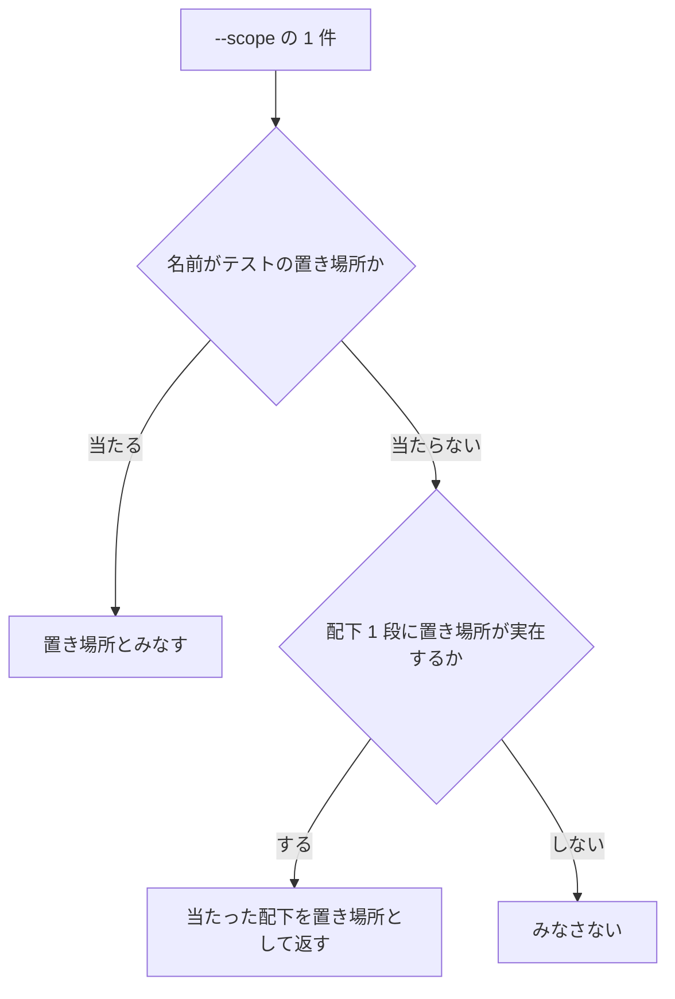
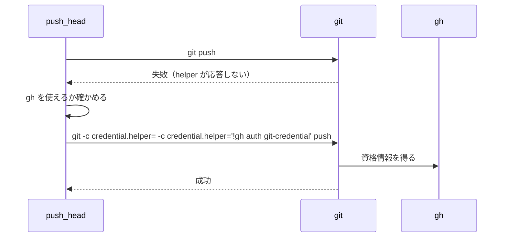

# 工程が止まる 2 か所の直しと、push の退避

`cross-refactoring` を手順書どおりに起動して止まっていた 2 か所と、credential helper が
応答しない環境で push が落ちる経路について、決めたことと理由を残す。

**手順は各 Skill の `SKILL.md` が正である。** ここに書き写さない。この文書が扱うのは、
そこに書かない決定の理由と、実測で確かめた事実である。

## 概要

**繰り返しの中で使う値は、繰り返しの中で得られる。** 提案・レビューの母集合
（`RUNTIMES` / `RUNTIMES_CSV`）は `refactor.py init` と `start-round` の両方が返す。

**骨組みが参照する変数の出所は機械で見る。** `scripts/check-skill-shell-vars.py` が、
手順書の bash が参照する変数を、その行より前のコマンドが返しているかで検査する。

**`--scope` の関門は、名前で当たらないときだけ実体を見る。** 走査は配下 1 段に限り、
返すのは**当たった置き場所そのもの**である。

**push の退避は、失敗してから 1 度だけ行う。** 既定の経路は変えない。退避の値は共通層
`plugins/ndf/scripts/lib/git-credential.sh` が 1 か所で持つ。

## 用語

| 用語 | 意味 |
| --- | --- |
| 母集合 | 提案とレビューを担当するランタイムの集合（全ランタイム − ホスト） |
| 骨組み | `SKILL.md` の「実行」節に置く bash。利用者はこれを写して起動する |
| 退避 | credential helper が応答しないときに、`gh` の認証を使って `git` を通すこと |
| 置き場所 | テストを置くディレクトリ。`--scope` の関門が範囲に含まれているかを見る |

## 仕様

### 母集合の受け渡し

`refactor.py start-round <id>` は、これまでの 8 つに加えて次の 2 つを返す。

| 名前 | 形 |
| --- | --- |
| `RUNTIMES` | 空白区切り |
| `RUNTIMES_CSV` | コンマ区切り |

**出所は状態ファイルの `runtimes` である。** `init` が返すものと同じ配列を読むため、
2 つの副コマンドが違う母集合を返すことはない。**足すだけで、既存の値と失敗の形は
変えない。**

**常に成り立つ条件**: 骨組みが繰り返しの中で参照する変数は、その繰り返しの中で実行する
コマンドが返す。繰り返しの外の 1 回だけが返す形にしない。

### 骨組みの変数の検査

`scripts/check-skill-shell-vars.py` は、`SKILL.md` の bash のコードブロックから参照する
変数を集め、次の 3 つを出所として突き合わせる。

| 出所 | 読み取り方 |
| --- | --- |
| その bash の中の代入 | `NAME=x` / `for a in ...` / `read` |
| 副コマンドが返す値 | `cmd_<名前>` が呼ぶ `emit(...)` のキーワード。ヘルパー経由も 1 段だけたどる |
| 骨組みの外から渡る値 | `--external` が宣言するもの |

**シェルの構文解析器は使わない。** 骨組みは代入・`for`・コマンド置換に限られており、
この範囲は後ろ向きの状態だけで読める。

**1 行に複数のコマンドが並ぶ。** `out=$(...); rc=$?` や
`for a in $X; do echo "$a"; done` は、同じ行の左で定義した値を右で読む。行を `;` `&&`
`||` `|` で分割し、断片ごとに参照を判定してから定義を足す。**引用符の中の区切りも割れる
が、判定は「定義が早く効く」側へ倒れるだけで、出所の無い参照を見落とす向きには働かない。**

### `--scope` の関門



**返す値は、当たった置き場所そのものである。** `plugins/ndf/skills/development-workflow`
を渡して配下の `tests/` で当たったなら、返すのは
`plugins/ndf/skills/development-workflow/tests` である。

**親のままにすると、通した直後に同じ関門の別の判定が拒む。** 後段は `--baseline-test` が
限定した探索の起点で始まるかを見る。起点が `.../tests` のとき、親のパスはその起点で
始まらない。

**双方向の包含（親が起点を含む場合も通す）は許さない。** 関門が見たいのは「足したテストが
実行されるか」であり、実行されるのは起点の配下だけである。

**走査は配下 1 段に限る。** 深く潜ると、無関係な階層のテストを根拠にして関門が素通りする。

**名前だけの判定は残す。** `--scope tests/services` のように、まだ存在しない置き場所を
渡す運用があるためである。

### push の退避



**空の値を先に置くことが退避の本体である。** `credential.helper` は複数の値を持てる設定で、
`git` は宣言された順に問い合わせる。空の値だけが一覧を空へ戻す。

```console
$ printf 'protocol=https\nhost=example.invalid\n\n' | git \
    -c credential.helper='!f(){ [ "$1" = get ] && echo username=FIRST && echo password=x; }; f' \
    -c credential.helper='!g(){ [ "$1" = get ] && echo username=SECOND && echo password=y; }; g' \
    credential fill
username=FIRST          # 後から足した側は呼ばれない
```

`-c credential.helper=` を 2 つの helper の間へ挟むと `username=SECOND` になる。

**常に成り立つ条件**: 退避は失敗してから 1 度だけ行う。既定の経路（素の `git`）は変えない。
`gh` を使えないときは退避せず、`git` の失敗をそのまま返す。

## データ・設定

**共通層は値だけを持ち、振る舞いは退避する側が持つ。**

| 置き場所 | 何を持つか |
| --- | --- |
| `plugins/ndf/scripts/lib/git-credential.sh` | `ndf_git_credential_fallback_args`（退避のオプションを 1 行 1 語で出す） |
| `refactor_lib/gitfacts.py` の `_push_with_credential_fallback` | 失敗の検知・`gh` の有無・1 度だけの再試行 |
| `pr` / `fix` の `SKILL.md` | 同じ `git` コマンドを案内する（共通層は読み込まない） |

**`pr` と `fix` が共通層を読み込まないのは、任意のリポジトリで動く手順書だからである。**
読み込みの経路を増やすと、NDF を導入していない環境で手順が成立しない。

**共通層に、呼び出し側の無い関数を置かない。** 退避の分岐がシェルと Python の 2 か所に
分かれると、片方だけが更新される。

## 運用

**この 2 つの直しは配布した版から効く。** 手元のリポジトリを直しても、利用者が起動するのは
配布済みの Skill である。`cross-refactoring` を開発中のリポジトリで回すときは、配布済みの
版が動いていることを踏まえて母集合を状態ファイルから読む。

## テスト観点

| 観点 | 何で確かめるか |
| --- | --- |
| `start-round` が母集合を返し、既存の値を変えないこと | `<crf>/tests/test_start_round_emits_runtimes.py` |
| 骨組みの変数の出所が突き合わせられること | `scripts/tests/test_skill_shell_vars.py` |
| 現行の骨組みが検査を通ること | 同上（実物を読む 2 件） |
| 実体を持つ親が関門を通り、返す値が配下の側になること | `<crf>/tests/test_scope_gate.py` |
| 名前で渡す経路とみなさない経路が変わらないこと | 同上 |
| push が退避して 1 度だけ再試行すること | `<crf>/tests/test_push_credential_fallback.py` |
| 空リセットが実際に helper を切り替えること | 同上（`git` の実挙動を見る） |
| 手順書の記載が共通層の値と一致すること | `scripts/tests/test_push_fallback_docs.py` |
| 共通層が値だけを持つこと | 同上 |

`<crf>` は `plugins/ndf/skills/cross-refactoring` を指す。

## 関連リンク

- [`cross-refactoring` の SKILL.md](../../plugins/ndf/skills/cross-refactoring/SKILL.md)
- [`pr` の SKILL.md](../../plugins/ndf/skills/pr/SKILL.md)
- [`fix` の SKILL.md](../../plugins/ndf/skills/fix/SKILL.md)
