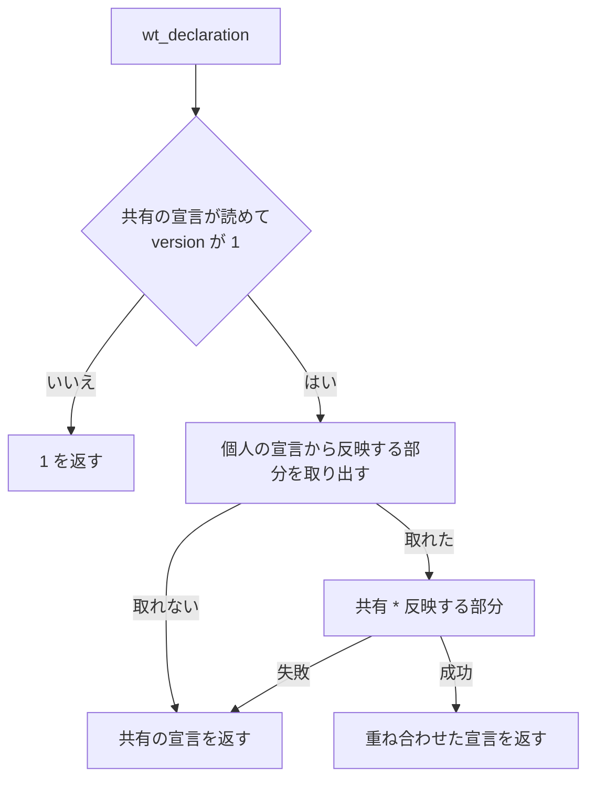
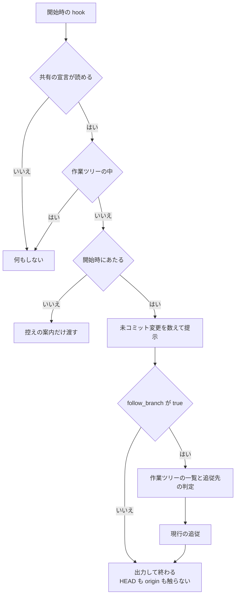

# 作業ツリー運用の宣言と、入口の判定

作業ツリー運用が読む**宣言を共有と個人の 2 つへ分け**、**開始時に主ディレクトリの HEAD を動かす
のをやめ**、**読めない宣言を用意できなかったものとして扱い**、**編集の案内が読む書き込み先の
取りこぼしを直した**経緯と結論を残す。

**手順と表は
[`worktree` の SKILL.md](../../plugins/ndf/skills/worktree/SKILL.md) と
[references/declaration.md](../../plugins/ndf/skills/worktree/references/declaration.md)
が正である。** ここに書き写さない。この文書が扱うのは、そこに書かない決定の理由である。

## 概要

**宣言は 2 つのファイルに分かれる。** 共有の宣言（`.ndf/worktree.json`）は追跡し、個人の宣言
（`.ndf/worktree.local.json`）は追跡しない。個人の宣言から反映できるのは `localenv` / `testenv` /
`follow_branch` の 3 つだけで、**リポジトリの運用を決める項目は個人の宣言で変わらない**。

**重ね合わせは共通層の 1 か所（`wt_declaration`）で行う。** 重ね合わせた宣言を読む入口
（`worktree-*.sh` と `wt_declaration_branch`）はすべてこの関数を経由するため、入口ごとに規則を
書き写さない。**起点だけを `jq` で直接読む 6 か所は、この入口に含まれず重ね合わせを通らない。**
読むのは `base_branch` だけで、個人の宣言では変わらないため結果は同じである。

**開始時の hook は既定で主ディレクトリの HEAD を動かさない。** `follow_branch: true` のときだけ
追従する。並列に動くエージェントのどれが開始しても、他の担当が読んでいる主ディレクトリが
入れ替わらない。

**`worktree-setup.sh init` は読めない宣言を終了コード 1 で報告する。** `worktree` の手順 0 は
そこで止まる。同じ宣言を `init` と `status` / `check` が別の状態として報告しない。

**編集の案内が読む書き込み先の走査は、リダイレクトを読み飛ばして命令の区切りまで続く。**
リダイレクトの前後の被演算子は、bash と同じく同じ並びに属するものとして扱う。

## 用語

| 用語 | 意味 |
| --- | --- |
| 主ディレクトリ | clone したディレクトリ（`git rev-parse --git-common-dir` の親） |
| 共有の宣言 | `.ndf/worktree.json`。追跡する |
| 個人の宣言 | `.ndf/worktree.local.json`。追跡しない |
| 重ね合わせた宣言 | `wt_declaration` が返す、共有の宣言に個人の宣言を反映した JSON |
| 上書きできる項目 | 個人の宣言から反映する最上位の項目。`localenv` / `testenv` / `follow_branch` の 3 つ |
| 読めない宣言 | JSON として壊れている・版が未対応・空・ディレクトリ・読み取り権限が無い、のいずれか |
| 追従 | 開始時の hook が主ディレクトリの HEAD を `git checkout --detach` で動かすこと |
| 開始時の hook | `worktree-session.sh`。Claude Code / Codex の `SessionStart`、Kiro の `agentSpawn`、agy の `PreInvocation`（通し番号 0） |
| 抽出関数 | `wt_extract_write_target`。命令の本文から、書き換わるファイルを 1 行 1 件で出す |
| 被演算子を走査する枝 | 抽出関数の中で `sed -i` / `cp` / `mv` / `tee` の後ろの語を読むループ |

## 背景

**宣言に共有すべき項目と個人の環境に依存する項目が混在していた。** どちらも追跡対象で、ポートの
帯やローカル環境の持ち込み物を各自の値にすると差分が毎回 Pull Request に載った。宣言をまとめて
追跡から外す案は、宛先の検査（`scripts/check-pr-base.sh`）が起点を読めなくする。

**並列のエージェント実行で、主ディレクトリの HEAD が作業の途中で動いた。** 追従は稼働中の
作業ツリーの数で行き先を決めるため、数が変わるたびに HEAD が移った。移ると、追跡されている
`issues/`・共有の宣言・`plugins/ndf/scripts/` が別のコミットの版へ入れ替わり、**他の担当の
読み取りも変わる**。追従は「1 人が 1 つの作業ツリーで作業する」前提で入った機能である（#146）。

**`init` だけが宣言の状態を判定する関数を通っていなかった。** 存在の有無だけで「既にある」を決め、
読めない宣言を終了コード 0 で報告していた。`status` と `check` は同じ宣言を「読めません」と分けて
いた（#527）。運用は宣言を読めないと何もしないため、`worktree` の手順 0 だけを通った利用者は
運用が無効のまま進んだ。

**書き込み先の走査が、リダイレクトの印を命令の区切りとして読んでいた。** 出力側のリダイレクトは
字句解析の前に印へ置き換わるため、被演算子を走査する枝は印で走査を終え、後ろの被演算子を落とした
（`sed -i 's/a/b/' x.md >log y.md` の `y.md`）。入力側のリダイレクトは印へ置き換わらず語のまま
残るため、被演算子として読まれて宛先の位置を奪った（`cp a b < in` の宛先が `in`）。

## 決定と理由

### 宣言を共有と個人に分ける

| 決定 | 理由 |
| --- | --- |
| 個人の項目だけを別ファイルへ分ける | 共有の宣言を追跡したままにできる。宛先の検査と、起点を `jq` で直接読む 6 か所は共有の宣言だけを読み続けられる |
| 宣言をまとめて追跡から外す案は採らない | 宛先の検査が宣言を読めずに通してしまい、起点・追従先・盤面の宛先が clone した人に届かない |
| 混在を許したままにする案も採らない | ポートの帯を変えた差分が毎回 Pull Request に載る |
| 置き場所を `.ndf/worktree.local.json` にする | 共有の宣言の隣なら手で開く人が見つけられ、編集時の案内の既定の許可（`.ndf/`）にも入る。共通の git ディレクトリの下は利用者が開く場所ではなく、ホームディレクトリの下は clone し直すと対応が切れる |
| 上書きできる項目を 3 つに限り、許可一覧で持つ | 個人の宣言は追跡されずレビューを通らない。運用を決める項目を個人が変えると、手元の動作と継続的統合の判定が食い違う。拒否一覧にすると、項目を足すたびに更新を忘れた項目が個人から変えられる |
| `guard.allow_paths` を個人が広げてよい形は採らない | 案内は並列の担当を含む全員へ同じ基準で出すことが目的で、個人の例外は主ディレクトリの逸脱を見えなくする |
| 個人の `testenv.expose` を反映しない | 外部への公開の設定である。レビューを通らないファイルから公開を有効にできる状態を作らない |
| `expose` を落として空になった `testenv` は節ごと反映しない | 空の節を重ねると、`testenv` を宣言していないリポジトリで `worktree-testenv.sh` の起動判定が off から on へ変わる。追跡されないファイルだけで仕組みの有無が動く |
| 重ね合わせは `jq` の `*` にする | オブジェクトを深く併合するため、役割を 1 つだけ変えるときに他を書き写さずに済む。配列を置き換えるのは、連結すると共有の要素を個人が消せなくなるためである |
| 型の合わない項目は、その項目だけを反映しない。`null` も反映しない | 1 つの誤りでポートの帯まで効かなくなる形にしない。個人の宣言から共有の節を消せる形にすると、仕組みが手元でだけ黙って止まる |
| 個人の宣言が読めなくても共有の運用を止めない | 個人の宣言は運用を補うものである。止めると編集時の案内と逸脱検知まで消える |
| 共有の宣言が無い・読めないときは個人の宣言を使わない | 宣言の有無はリポジトリが作業ツリー運用を使うかを表す。個人のファイルだけで動くと、clone した他の人と振る舞いが分かれる |
| 重ね合わせを `wt_declaration` の中で行い、呼び出し側を変えない | 入口ごとに規則を書き写さない。起点を `jq` で直接読む 6 か所も変えない（読むのは `base_branch` だけで、個人の宣言では変わらない） |
| 宣言の印（`wt_declaration_stamp`）を変えない | 控えに入るのは宣言の有無と許可パスだけで、どちらも個人の宣言では変わらない。含めると、ポートの帯を変えるたびに控えを作り直す |
| `init` が `.ndf/.gitignore` を作る | 宣言と同じディレクトリで完結し、根の `.gitignore` の既存の内容と並びに触れない。作った宣言と一緒にコミットすれば、clone した全員の手元で追跡から外れる |
| 個人の宣言の行は、ファイルがあるときだけ出す | 個人の宣言を使わない大多数の利用者の出力を変えない。既存の出力に依存する手順とテストが壊れない |
| `version` は上げない | 既存の項目の意味を変えず、項目を足すだけである |

### 追従を既定で止める

| 決定 | 理由 |
| --- | --- |
| 追従を既定で止め、`follow_branch: true` のときだけ行う | 並列の実行では、どの開始の時点でも他の担当が主ディレクトリを読んでいる。HEAD を動かすこと自体が他の担当の読み取りを変えるため、条件を狭めても動かす経路が残る限り事象は残る |
| 条件を狭める 3 案は採らない | 「ブランチ上なら動かさない」は detached の間の移動が残る。「前回と同じなら動かさない」は数が変わったときに起きる事象を防げない。「他のセッションが稼働中なら動かさない」は 4 ランタイムのセッションを数える共通の手段が無い |
| 追従そのものを消す案は採らない | #146 の依頼で入った機能であり、使う利用者の手段が無くなる。消すかどうかは利用者の判断に回す |
| 環境変数で止める案は採らない | hook の環境は CLI を起動したシェルが決め、並列の子プロセスごとに揃える手段が無い |
| 有効にしたときの判定（`wt_follow_target`）は変えない | 有効にする利用者は現行の挙動を前提にしている。既存の追従のテストを `follow_branch: true` を足すだけで通すことが退行の検査になる |
| 真偽値の `true` 以外はすべて無効にする | `"true"` / `1` / `null` を有効と読むと、書き間違いが黙って追従を有効にする |
| 既に detached HEAD の主ディレクトリへ案内を出さない | 開始のたびに出すと、意図して detached にしている利用者へ毎回同じ文言が届く。戻す操作は `merged` の起点の更新が持つ |

### 読めない宣言を用意できなかったものとして扱う

| 決定 | 理由 |
| --- | --- |
| `init` は状態を分ける関数（`wt_declaration_state`）を呼び、基準を書き写さない | 独自に判定すると、`status` / `check` と食い違う経路が再び生まれる。呼ぶだけにしておけば、読み取り層の変更（個人の宣言の重ね合わせ）に追随しなくてよい |
| 読めない宣言の終了コードを 1 にする | `worktree-setup.sh` は 0 を「処理が完了した」、1 を「処理できなかった」とし、2・3 を `check` だけに割り当てる。読めない宣言の `init` は宣言を用意できなかった点で 1 に当たる |
| `check` と同じ 3 を返す案は採らない | `init` の終了コードの約束を広げる。状態で分岐したい手順は既に `check` を使っている |
| 1 行目は宣言の行を出す関数を標準エラーへ向ける | 同じ状態を別の言葉で書かないため（#527）。`init` 専用の文言を置くと、`status` だけを見た利用者と `init` だけを見た利用者が同じ状態を別のものと読みうる |
| 案内は「直すか、消してから `init`」とし、`--force` を勧めない | `--force` は形によって結果が分かれる。宣言の位置がディレクトリのときは中に一時ファイルを残して 1 で終わり（#628）、symlink の宣言は断られる。消してから `init` はどちらの形でも通る |
| `--force` が無いとき、状態の判定を symlink の関門より前に置く | 関門の目的はリポジトリの外を**書き換えない**ことで、読むだけの枝には当たらない。後に置くと、読める宣言を指す symlink のリポジトリで、書き込みをしないのに止まる |
| 手順 0 は `init` の後に `check` を足さない | 変更後の `init` は 0 のとき宣言が読めることを保証する。足しても同じ判定を 2 回行うだけである |
| 読めない理由を区別しない | 区別するには状態の関数が 3 語より多くを返す必要があり、読み取り層の変更になる。宣言の行は候補を並べており、ディレクトリと権限の形は `ls -l` で見分けられる |

### 書き込み先の走査をリダイレクトで終えない

| 決定 | 理由 |
| --- | --- |
| 被演算子を走査する枝の先頭でリダイレクトを読み飛ばし、区切りの定義は変えない | 区切りの判定は `cd` の枝・`\|\|` の右辺の判定など多くの箇所が共有する。定義を変えずに枝だけが先に除けば、影響は 3 つの枝に閉じる |
| 区切りの判定から出力側の印を外す案は採らない | 印とその後ろの語を被演算子として読むため、`>` を書き込み先として出して同じ値を 2 回出し、`cp a b >log` の宛先が `log` になって `b` が消える（実測） |
| 入力側のリダイレクトも読み飛ばす | 同じ走査の中で、入力側の語は被演算子の位置を奪っている。原因が同じ読み方であり、分けると片方だけが残る |
| 入力側は字句解析の後の語の中の `<` で見分け、印へ置き換えない | 置き換えると字句解析が `<` の直後の `&` を記述子の複製として 1 語に繋ぐ扱いが外れ、`cd` の追跡まで退行の範囲が広がる。**この退行は既存のテスト 350 件を通過した** |
| 見分けるのは語の頭ではなく、語の中の最初の `<` である | 字句解析は `b<in` を 1 語のまま渡すが、bash は `b` と `in` に分ける。語の頭だけを見ると `cp a b<in` の宛先を `b<in` と出す |
| 引用符で囲んだ `<` を含む名前は区別しない | 字句解析が引用符を落とした後の語はリダイレクトと区別できない。この形の名前は実用上現れないものとして受け入れる（`cp a "b<c"` の宛先は `b` になる） |
| 読み飛ばしをオプションの引数を取る判定より前に置く | bash はリダイレクトを引数の並びから除いてから命令へ渡す。後に置くと、オプションが印を引数として受け取り、`cp -t >log dir a b` が `dir` を出さない（実測） |
| プロセス置換 `<(` はリダイレクトとして扱わない | `/dev/fd/N` へ展開される被演算子で、bash も引数の並びに残す。読み飛ばすと最後の被演算子が消え、手前の複製元が宛先の位置に来る |
| `cd` の枝と、命令名より前の入力側のリダイレクトは変えない | `cd` の枝は出力側を既に読み飛ばしている。入力を与えた `cd` を書く場面が無く、`cd` の枝は現在地の追跡の起点であるため、変えると `cd` を含むテスト群の全体が退行の範囲に入る |
| 出力の順序を契約に含めない | 読み飛ばしで走査の順序が変わり、リダイレクトの書き込み先が後に出る。呼び出し側（編集時の案内）は結果を集合として扱う |

## 仕様

### 宣言の層と重ね合わせ

| 名前 | 値 |
| --- | --- |
| `WT_DECLARATION_FILE` | `.ndf/worktree.json`（共有・追跡する） |
| `WT_DECLARATION_LOCAL_FILE` | `.ndf/worktree.local.json`（個人・追跡しない） |

個人の宣言の項目の扱いは次のとおりである。**書き方は
[references/declaration.md](../../plugins/ndf/skills/worktree/references/declaration.md)
が持つ。**

| 項目 | 反映 |
| --- | --- |
| `version`（必須。値は `1`） | 反映しない。読めるかの判定だけに使い、報告もしない |
| `localenv`（オブジェクト） | 共有の値へ深く併合する |
| `testenv`（オブジェクト） | `expose` を除いて深く併合する。除いて空になれば節ごと反映しない |
| `follow_branch`（真偽値） | 共有の値を置き換える |
| `$schema` | 反映しない。報告もしない |
| その他（`base_branch` / `production_branch` / `guard` / 未知の項目） | 反映せず、反映しない項目として報告する |

**常に成り立つ条件**は 4 つである。

- **`wt_declaration` は、個人の宣言の状態では失敗しない。** 0 か 1 は共有の宣言の状態だけで決まる
- **`check` の終了コードは共有の宣言の状態だけで決まる**（0 あり / 2 なし / 3 読めない / 1 判定できない）
- **重ね合わせた宣言の `testenv.expose` は、共有の宣言の値と常に一致する**
- **`wt_base_branch` / `wt_production_branch` / `wt_allow_paths` の出力は、個人の宣言の有無で変わらない**

重ね合わせは `wt_declaration`（`plugins/ndf/scripts/lib/worktree-common.sh`）の中で行う。共有の
宣言が読めて版が一致したときに、反映する部分を `jq` の `*` で重ねる。重ね合わせに失敗したら共有の
宣言をそのまま返す。

**個人の宣言の検査は 1 回の `jq` で行い、反映する部分と反映しない項目を同時に作る**
（`_wt_local_analysis`）。`_wt_local_overrides` と `wt_declaration_local_ignored` はその結果から
取り出すだけである。**最上位が配列でも `with_entries` は成功するため、型は明示的に確かめる。**
`del(.testenv.expose)` は `testenv` が文字列だと失敗するため、節の型を先に確かめる。

| 関数 | 出力 | 失敗の形 |
| --- | --- | --- |
| `_wt_local_overrides` | 反映する部分だけの 1 行の JSON | 通常のファイルでない・JSON でない・空・オブジェクトでない・`version` が 1 でないとき 1 |
| `wt_declaration_local_state` | `absent` / `present` / `unreadable` / `unused` の 1 語 | 引数が空なら 1 |
| `wt_declaration_local_ignored` | 反映しない項目名を 1 行 1 件、項目名の順 | 状態が `present` でなければ何も出さず 0 |
| `wt_follow_enabled` | なし | `.follow_branch == true` なら 0、それ以外（空の入力を含む）は 1 |

状態の判定の順序は次のとおりである。**存在は `[ -e ]` で見る。** 反映する部分の取り出しは
`[ -f ]` で見るため、ディレクトリは `unreadable`、壊れた symlink は `absent` に分かれる
（共有の宣言と同じ分け方）。

| 順 | 条件 | 状態 |
| --- | --- | --- |
| 1 | 個人の宣言のパスが存在しない | `absent` |
| 2 | 共有の宣言の状態が `present` でない | `unused` |
| 3 | 反映する部分を取り出せない | `unreadable` |
| 4 | それ以外 | `present` |

### 宣言の状態の報告

`status` と `check` は、既存の `宣言ファイル:` の行の直後に個人の宣言の行を出す。
**個人の宣言ファイルが無いときは行を足さない。**

| 状態 | 行 |
| --- | --- |
| `present` | `個人の宣言: あり（.ndf/worktree.local.json）` |
| `unreadable` | `個人の宣言: 読めません（版が未対応か、JSON として壊れています。共有の宣言だけで動きます）` |
| `unused` | `個人の宣言: 使っていません（共有の宣言ファイルが無いか、読めません）` |
| `present` で反映しない項目がある | 続けて `個人の宣言で反映しない項目: <項目名を並べる>` |

**`status` だけが登録の案内を出す。** 個人の宣言ファイルがあり、`git check-ignore` が 0 で終わらない
ときに `個人の宣言の登録: なし。` から始まる 1 行を足す。

### `init` の終了コードと手順 0

`--force` を付けない `init` は、書き込みの前に共有の宣言の状態を読む。

| 状態 | 終了コード | 出力 | 宣言 |
| --- | --- | --- | --- |
| `present`（symlink を含む） | 0 | 標準出力へ「既にあります」 | 変えない |
| `unreadable` | 1 | 標準エラーへ宣言の行と、直すか消してから `init` をもう一度実行する案内 | 変えない |
| `absent` | 0（書けたとき）/ 1（symlink・書けない・書いた後に読めない） | 現状どおり | 作る |

**`init --force` は変えていない。** 読めない宣言を上書きする経路はそのまま残る。

**共有の宣言を書いたときだけ `.ndf/.gitignore` を作る。** 既にあれば（symlink も含めて）触らない。
書き方は宣言と同じく、同じディレクトリの一時ファイルへ書いてから名前を付け替える。
**書けなくても `init` の終了コードは変えない。** 宣言そのものは作れており `init` の目的は果たした
ため、理由だけを標準エラーへ出す。

**手順 0 は `init` の終了コードが 0 でなければ先へ進まない。** 出力をそのまま利用者に示し、宣言を
直す・消す・`--force` で作り直すのは利用者が決める。**エージェントは宣言を書き換えない。**

### 開始時の追従

開始時の hook は、追従が有効なときだけ作業ツリーの一覧を取り、追従先を判定する。

**追従しないとき、hook は HEAD を動かさず origin へも通信しない。** 未コミット変更の提示は
`follow_branch` の値によらず同じで、hook はどの経路でも終了コード 0 で終わる。

**有効にしたときの判定は変えていない。** 稼働中の開発用作業ツリーが 1 つならそのコミットへ
detached HEAD で開き、0 個または複数なら起点ブランチに合わせる。未コミットの変更があるときは
追従しない。判定の表は
[`worktree` の SKILL.md の「主ディレクトリのブランチ」](../../plugins/ndf/skills/worktree/SKILL.md)
が持つ。

### 書き込み先の抽出

抽出関数（`wt_extract_write_target`）の引数・終了コード・1 行 1 件の出力の形は変えていない。
変わったのは被演算子を走査する枝の、1 語ごとの判定の順序である。

| 順 | 判定 | 当たったとき |
| --- | --- | --- |
| 1 | リダイレクトの範囲（`_redir_span`） | 読み終えた位置まで進める。`<` より前の被演算子があれば、それを今の語として順 2 へ |
| 2 | オプションの引数を受け取る途中である | 従来どおり |
| 3 | 命令の区切りである | 従来どおり走査を終える |
| 4 | オプション・被演算子の判定 | 従来どおり |

`_redir_span <添字>` は、語の中の最初の `<` で語を前置と残りに分ける。**書き込み先は出さない。**
出力側のリダイレクトの書き込み先は、これまでどおり主の走査の印の枝が出す。

| 語の形（字句解析の後） | 戻り値 | 前置 | 読み終えた位置 | 例 |
| --- | --- | --- | --- | --- |
| 出力側の印 | 0 | 空 | 印の後ろを読んで決めた位置 | `>log` `2>&1` `>& log` `&>>log` |
| `<` を含まない | 1 | 空 | 変えない | `x.md` `-i` |
| 残りが `<(` で始まる | 1 | 空 | 変えない | `<(echo)` `a<(echo)` |
| 残りが `<<<` / `<<-` / `<<` / `<&` / `<` の後ろに文字を持つ | 0 | 前置 | 添字そのもの | `<in` `2<in` `b<in` `<<<word` `<<EOF` |
| 残りが演算子だけで、次の語が出力側の印 | 0 | 前置 | 印の後ろを読んで決めた位置 | `<>rw` `b<>rw` |
| 残りが演算子だけで、次の語が印でない | 0 | 前置 | 添字 + 1 | `< in` `b< in` `<< EOF` |

**前置が数字だけなら記述子の番号として空にする**（`2<in`）。bash が記述子の番号と読むのは `<` の
前が数字だけのときである（`b2<in` は `b2` を被演算子として残す）。

3 つの枝は `_wt_take_redirect_operand` を通してこの判定を呼び、添字と今の語を書き換える。
`_redir_span` と `_wt_take_redirect_operand` は抽出関数の内側に定義し、末尾で `unset -f` する。

実測（現行の実装）:

| 命令 | bash が書き換える / 作るもの | 抽出関数 |
| --- | --- | --- |
| `sed -i 's/a/b/' x.md >log y.md` | `x.md` `y.md` `log` | `x.md` `y.md` `log` |
| `cp a b >log c`（`c` はディレクトリ） | `c/a` | `c` `log` |
| `tee a >log b` | `a` `b` `log` | `a` `b` `log` |
| `cp -t >log dir a b` | `dir/a` `dir/b` | `dir` `log` |
| `sed -i s/a/b/ x.md <in y.md` | `x.md` `y.md` | `x.md` `y.md` |
| `cp a b<in` | `b` | `b` |
| `cp a b<>rw` | `b` と、`rw` を作る | `b` `rw` |
| `cp a<(echo) d` | 何も作らない | `d` |
| `sed -i 's/ /x/' y.md` | `y.md` | `y.md` |
| `cp a b 2>&1 \|\| echo c` | `b` | `b` |

## データ・設定

**宣言の `version` は上げていない。** 足したのは共有の宣言の最上位の `follow_branch`（真偽値、
既定 `false`）と、個人の宣言ファイルである。スキーマは
`plugins/ndf/skills/worktree/schemas/worktree.schema.json` が持つ。

**個人の宣言は追跡しない。** このリポジトリ自身も `.ndf/.gitignore` を追跡し、
`git check-ignore -q .ndf/worktree.local.json` が 0、`git check-ignore -q .ndf/worktree.json` が 1 で
終わる。

**継続的統合には個人の宣言が届かない。** 処理はすべて利用者の機械のシェルで動き、常駐しない。
宛先の検査と、起点を `jq` で直接読む 5 つの Skill は共有の宣言だけを読む。

**このリポジトリの共有の宣言に `follow_branch` を書かない。** つまりこのリポジトリでは追従しない。

## セキュリティ

**追跡されない個人の宣言から、外部への公開（`testenv.expose`）を有効にできない。** 反映する部分を
取り出す段で `expose` を落とす。共有の宣言が `expose.enabled: false` なら、重ね合わせた宣言でも
`false` のままである。

**個人の宣言で編集の案内の対象を狭められない。** `guard` は反映しない項目であり、許可パスは
clone した全員で同じ値のまま残る。

## テスト観点

| 観点 | 確かめ方 |
| --- | --- |
| 既定で HEAD が動かず、reflog の `checkout:` の行が増えない（作業ツリー 0 → 1 → 2 → 1+detached） | `plugins/ndf/skills/worktree/tests/test_session.py` |
| 追従しないとき origin へ通信しない | 同上（到達できない origin で `FETCH_HEAD` が作られないことを見る） |
| `follow_branch` が `false` / `"true"` / `1` / `null` でも動かない | 同上、および `tests/test_follow_target.py` |
| 事象名を持たない入力・agy の通し番号 0 でも動かない | 同 `test_session.py` |
| `follow_branch: true` で現行の追従が変わらない | 既存の追従のテストに `follow_branch: true` を足すだけで通す |
| 未コミット変更の提示と終了コード 0 が `follow_branch` の値によらない | 同上 |
| 個人の値が反映される（ポートの帯・役割の深い併合・配列の置換・追従の有効化） | `tests/test_declaration_local.py` |
| 運用を決める項目と `testenv.expose` が反映されない | 同上 |
| 壊れた個人の宣言の 5 つの形で、共有の宣言だけで動く | 同上 |
| 型の合わない項目だけが反映されない | 同上 |
| 宛先の検査と起点の解決が個人の宣言で変わらない | `scripts/tests/test_pr_base_guard.py` / `scripts/tests/test_base_branch_consistency.py` |
| `status` / `check` の行、反映しない項目の並び、`check` の終了コード、`init` の `.ndf/.gitignore` | `tests/test_setup.py` |
| 個人の宣言が無いときの `status` / `check` の出力と終了コードが変わらない | 同上（既存のテストを変更なしで通す） |
| 読めない宣言で `init` が 1 で終わり、宣言の行が `status` / `check` と一字一句同じで、宣言を書き換えない | 同上 |
| 読める宣言を指す symlink で `init` が 0 で「既にあります」を出す | 同上 |
| リダイレクトの後ろの被演算子が出て、入力側のリダイレクトの語が出ない | `tests/test_write_target.py`（**比べ方は集合にする。** 順序を含めて比べると契約に無い順序を固定する） |
| 区切り・プロセス置換・引用符の中の `<` で出力が変わらない | 同上 |
| 手順 0 が `init` の失敗で止まることが本文に書かれている | 同 `test_setup.py`（本文の抜き出し） |

実行は `uv run --with pytest --with pytest-xdist pytest scripts/tests plugins/ndf -q -n auto`。配布物の同期は
`bash scripts/build-runtime-plugins.sh --check`、定義の検査は `claude plugin validate .` で見る。

## 運用

**追従を前提にしていた利用者は `follow_branch: true` を書く。** 既定で追従しなくなったことで
失うのは 2 つで、どちらも有効にすれば取り戻せる。

- 主ディレクトリを開いたエディタで、作業ツリーが 1 つのときにその内容が見えること
- 主ディレクトリが起点の古いコミットで detached のとき、開始時に起点の先端へ戻ること
  （`merged` の起点の更新が同じ役を持つ）

**既定を変える前の追従で detached になった主ディレクトリは、自動では戻らない。** 戻す操作は
`merged` の起点の更新が持つ。

**既に共有の宣言を持つリポジトリで `init` を再実行しても `.ndf/.gitignore` は足されない。**
`status` の登録の行で気づける。

**編集の案内が出る場面が増える。** 取りこぼしが減ったためで、案内は編集を止めない。

**残っている取りこぼしと未確認の点**は次のとおりである。

| 項目 | 内容 |
| --- | --- |
| `>\|` の書き込み先 | 印への置き換えの段で落ちる。走査の直しでは変わらない（#625） |
| 引用符で囲んだ `<` を含む名前 | 実用上現れないとして受け入れた。現れたときは宛先を取り違える |
| bash 以外のシェル | 抽出関数は bash の文法を前提にする。zsh の `<<<` や `>!` は確かめていない |
| Codex / Kiro の hook の発火の種類と粒度 | 開始のどの種類で発火するか、サブエージェントごとに発火するかを確かめていない |
| 実機の並列実行 | reflog が増えないことを実際の並列の担当で確かめるのは、配布の後 |
| 追従を消すかどうか | 既定で止めた後も機能を残す判断は、#146 を依頼した利用者の確認が要る |
| 古い `jq` | 重ね合わせの `*` と `with_entries` は jq 1.8.1 で確かめた。`*` は jq 1.5 から在る |

## 関連リンク

- [issue #313](https://github.com/devbasex/ai-plugins/issues/313) — リダイレクトより後ろの被演算子を書き込み先として出さない
- [issue #495](https://github.com/devbasex/ai-plugins/issues/495) — 宣言に共有の項目と個人の項目が混在する
- [issue #573](https://github.com/devbasex/ai-plugins/issues/573) — `init` が読めない宣言を「既にあります」と報告する
- [issue #610](https://github.com/devbasex/ai-plugins/issues/610) — 開始時の hook が主ディレクトリの HEAD を動かす
- [PR #630](https://github.com/devbasex/ai-plugins/pull/630)（設計） / [PR #639](https://github.com/devbasex/ai-plugins/pull/639)（実装） — 書き込み先の抽出
- [PR #636](https://github.com/devbasex/ai-plugins/pull/636)（設計） / [PR #637](https://github.com/devbasex/ai-plugins/pull/637)（実装） — 読めない宣言と手順 0
- [PR #634](https://github.com/devbasex/ai-plugins/pull/634)（設計） / [PR #643](https://github.com/devbasex/ai-plugins/pull/643)（実装、#610） / [PR #646](https://github.com/devbasex/ai-plugins/pull/646)（実装、#495）
- [issue #625](https://github.com/devbasex/ai-plugins/issues/625) — `>|` の取りこぼし
- [issue #628](https://github.com/devbasex/ai-plugins/issues/628) — 宣言の位置がディレクトリのときの `init --force`
- [作業ツリーで開発する](../../plugins/ndf/skills/worktree/SKILL.md)
- [宣言ファイルの書き方](../../plugins/ndf/skills/worktree/references/declaration.md)
- [モードを判定する単位と、承認の関門](ndf-workflow-unit-and-gates.md) — 起動時の宣言の確認（`check`）の分岐
- [テスト環境の排他の判定と、台帳へ書けなかったときの扱い](ndf-testenv-lock-and-registry.md)
