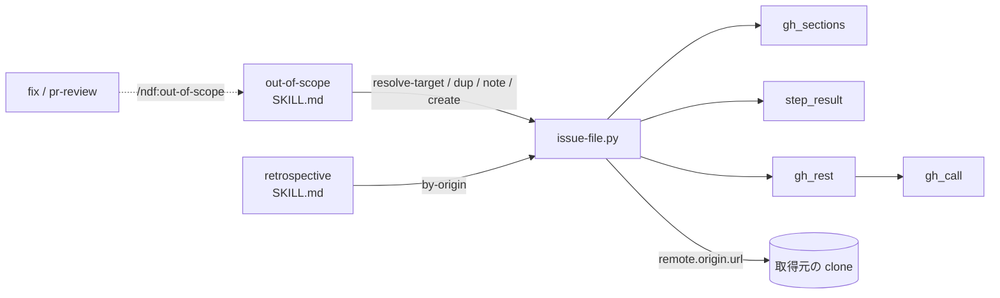

# out-of-scope: 範囲外の課題の起票を部品にする（issue-file.py）

## 概要

**範囲外の課題の起票のうち、判断の要らない手順は `plugins/ndf/scripts/issue-file.py` が行う。** 上流リポジトリと
開発対象リポジトリの解決（`resolve-target`）・重複の候補の検索（`dup`）・既存の課題への 1 行（`note`）・本文の骨格の
検査と承認資料と同意の後の起票（`create`）・由来での検索（`by-origin`）の 5 つのサブコマンドで、どれも 1 行の結果 JSON
（`tool` は `issue-file`）と終了コードで返す。LLM に残るのは、範囲内かの照合と 3 択、起票先の判断表、上流リポジトリが
決まらないときに利用者へ聞くこと、本文の 4 つの節を書くこと、起票した番号を元の場所へ戻すことである。
`out-of-scope` の手順 3〜5 と「起票した課題の辿り方」、`retrospective` の手順 1 の検索がこの部品を呼ぶ。`fix` と
`pr-review` は `/ndf:out-of-scope` を経由するため、本文を変えずにこの部品を使う。

この文書は、その形に**なぜしたか**（背景・決定と理由・常に成り立つ条件・既知の限界・テスト観点）を残す。
**手順・引数・終了コードの正は Skill とスクリプトにある。** 起票の手順は
[`out-of-scope` の SKILL.md](../../plugins/ndf/skills/out-of-scope/SKILL.md)、起票先の判断表と両方にまたがる課題の
順序は [`references/issue-target.md`](../../plugins/ndf/skills/out-of-scope/references/issue-target.md)、取りこぼしの
検索は [`retrospective` の SKILL.md](../../plugins/ndf/skills/retrospective/SKILL.md) の手順 1、サブコマンドの引数・
終了コードの表・上流リポジトリの解決で見る場所とその理由は
[`issue-file.py`](../../plugins/ndf/scripts/issue-file.py) の冒頭の説明を読む。

決定の番号は #851 の設計の番号である。コードのコメントの「設計 #851 の AC8」などは #851 の受け入れ条件を指す。

## 用語

「起票先」「由来」「本文の骨格」「提示の要約値」「上流リポジトリ」「開発対象リポジトリ」の定義は
用語集（[docs/glossary.md](../glossary.md)）が正である。

## 背景

決め直す前は、範囲外の課題を 1 件起票するたびに、LLM が `out-of-scope/SKILL.md`（10,372 B）と
`references/issue-target.md`（7,536 B）を読み、起票先の解決（bash の囲み 20 行余り）・`gh issue list` での重複の検索・
本文の 5 項目の確認・由来の書き込みを 1 手ずつ組み立てていた。`out-of-scope/tests/` は手順書の囲みの bash を
取り出して実行しており、手順書の文言とテストが結び付いて手順書を直しにくかった。`retrospective` の手順 1 も
`gh issue list --state all --search "<由来>"` を起点の issue と Pull Request・2 つのリポジトリについて手で打っていた。

課題追跡の抽象化（#480）は「やらない」と判断して閉じたため、その上には載せず、GitHub を呼ぶのは `gh_call`
だけという決まり（#1142 の L0）の上に置いた。置き換えた後の手順書は `SKILL.md` 6,637 B・`issue-target.md` 2,427 B
（ndf 10.17.67）である。

## 決定と理由

| # | 決定 | 理由 | 採らなかった案 |
| ---: | --- | --- | --- |
| 1 | 部品を `plugins/ndf/scripts/issue-file.py` の 1 本にし、GitHub の検索は `gh_rest.issue_search` を 1 つ足して呼ぶ。作成とコメントは既存の `gh_rest.issue_create` / `gh_rest.comment` を使う | `out-of-scope` と `retrospective` の両方から引くため、Skill の下ではなく `$SCRIPTS` で引ける `scripts/` の直下に置く（Skill の下に置くと他の Skill から引けず、agy に届かない） | `lib/` のモジュールと入口の 2 つに分ける（呼ぶ側は入口だけで、使う側の無い公開の関数が増える） |
| 2 | サブコマンドを `resolve-target` / `dup` / `note` / `create` / `by-origin` の 5 つにする。依頼の `orphans` は返すもの（由来で見つかった起票済みの課題）に合わせて `by-origin` とし、既存の課題への 1 行は `note` として独立させる | 読むだけのコマンドに書き込みを持たせると、検索を打ち直すだけで GitHub へ書き込む。「起票されていない指摘」の判定は指摘の文面を読む判断なので LLM に残る | 由来の追記を `dup` の選択肢にする。相手の課題へのコメントを `create` の中で続けて打つ（起票の後にコメントが失敗すると、打ち直しで課題が 2 件になる） |
| 3 | 同意は提示の要約値（`--approved <sha256>`）で受ける。`create` は `--approved` が無ければ承認資料を書いて 10 で止まり、要約値が一致したときだけ作る | 要約値は組み立てた後の本文から作るため、示した後に起票先・題・本文・ラベルを変えると一致せず、示していない課題を作らない。前例は `release-steps.py` の `--approved-sha` | 真偽の引数（`--yes`）。示した内容と作る内容が同じかを確かめられず、最初の呼び出しから付ければ承認資料を経ずに作れる |
| 4 | 由来の検索は句を引用符で囲む（`"PR #1825"`） | 2026-10-07 の実測で、囲まない `PR #1825` は 11 件、囲んだものは 5 件を返し、コメントにだけ由来を持つ #767 は両方に入った。囲まない `PR #1836` は本文に由来を持たない #860 を返した | `in:body` で絞る（コメントの由来が漏れる）。1 件ずつ読み直して文字列で絞る（読み取りが増え、引用符で足りる） |
| 5 | 上流リポジトリが決まらないときは 20（判断待ち）、GitHub か git を読めないときは 2 にする | 依頼の「決まらなければ exit 2」は、#846 の結果の契約では「読めない・呼び出しの誤り」で、gh の失敗と見分けられない。判断待ちの理由は 1 つなので 21 以降に意味を割り当てない | — |
| 6 | 由来は部品が「由来」の節へ入れる。両方にまたがる課題の相手の番号も `--counterpart` で部品が入れる | 由来の形は部品が検査するので、入れるのも部品にすれば、LLM が由来の節を書き忘れても同じ課題になる。骨格の検査は組み立てた後の本文に掛ける | LLM が書いた由来の節を検査するだけにする（形の誤りが起票のたびに 1 往復の直しになる） |
| 7 | `create` は同意の有無を判定せず、`metrics.other_repo`（起票先が開発対象リポジトリと別か、開発対象を読めないか）だけを出す。人に問えない起動で `other_repo` が真なら打ち直さず人へ戻すことは手順書が持つ | 人に問えない起動で承認資料を示して進めてよいかは起動指示の決まりが持つ。部品が判定すると、同意の決まりを部品の中で変えることになる。他のリポジトリへの起票は他のリポジトリへの公開（C5）で、解釈で緩めない | — |
| 8 | 起票先の解決のテストは `resolve-target` を直接呼ぶ。配置を作る補助（`make_clone` / `runtime_layout`）だけを引き継ぐ | 手順書の囲みの bash を取り出して実行する形では、手順書を書き換えるたびにテストの読み取りが壊れる | 手順書の呼び出しの文言を照合するテスト（`AGENTS.md` の DON'T） |
| — | `by-origin --with-upstream` で上流リポジトリが決まらないときは止めずに検索を続け、`metrics.upstream` を `null` にし、`summary` と `next` で「上流は検索していない」と知らせる | 取りこぼしの検索を上流の解決で止めると、記録先の検索まで失われる。ただし上流を外した結果を「取りこぼし 0 件」と読ませない（スプリント PR 1842 のレビュー round 2 で足した） | 上流が決まらなければ 20 で止める |

## 仕様

### 構成要素と責務

| 要素 | 責務 |
| --- | --- |
| `plugins/ndf/scripts/issue-file.py` | 5 つのサブコマンドの入口。値の形の検査・上流リポジトリの解決（`resolve_upstream`）と開発対象リポジトリの読み取り（`development_repo`）・本文の組み立て（`assemble`）と骨格の検査（`skeleton_gaps`）・提示の要約値（`digest_of`）・承認資料・結果 JSON |
| `plugins/ndf/scripts/lib/gh_rest.py`（`issue_search`・`issue_create`・`comment`） | GitHub の検索・作成・コメント。下は `gh_call` |
| `plugins/ndf/scripts/lib/gh_sections.py`（`get_section`・`replace_section`） | 本文の節の取得と置換 |
| `plugins/ndf/scripts/lib/step_result.py`（`result`・`emit`・`approval_present`・`EXIT_*`） | 結果 JSON・承認資料・終了コード |
| `scripts/check-skill-repo-assumptions.py` の `EXCLUSIONS` | `issue-file.py` が `plugins/ndf/` で NDF の実体を持つ clone を見分けることを、対象リポジトリの決め打ちとして数えない |

### 常に成り立つ条件

| 条件 | 破れたときの扱い |
| --- | --- |
| 作る課題の本文は、本文の骨格の 5 つの見出しをすべて持ち、どの節も空白でない行を持つ。囲みの中の `#` は見出しに数えない | 課題を作らず、終了コード 1 で欠けた見出し（`missing` / `empty`）を `items` に返す。GitHub を呼ぶ前に止まる |
| 作る課題の「由来」の節に、渡した由来（`PR #<番号>` / `issue #<番号>`）が 1 回だけ入る。既にあれば足さず、`PR #19` は `PR #190` と同じ由来に数えない。「由来」の見出しが無い本文には見出しを足さない（骨格の検査で落ちる） | 由来の形が違えば GitHub を呼ばずに 2 |
| 作る課題は、直前に示した承認資料と同じ起票先・題・本文（組み立てた後）・ラベル（並べ替えた後）を持つ | `--approved` が無ければ承認資料を書いて 10、要約値が合わなければ課題を作らず 1 |
| 付けるラベルは呼ぶ側が渡したものだけである。部品はラベルの既定値もリポジトリの名前も持たない | テストが落とす |
| 上流リポジトリは `NDF_SKILL_REPO` か、`plugins/ndf/` を持つ取得元の clone の GitHub の `remote.origin.url` が 1 つに絞れたときだけ決まる | 0 件・2 件以上は 20 で候補を返す。`NDF_SKILL_REPO` の形が違えば 2 |
| 開発対象リポジトリ（`gh repo view`）を読めないことは失敗にしない | `target: null`・`same: false` で 0 か 20 を返す。`create` では `other_repo` を真にする（C5 の側へ倒す） |
| GitHub の読み取りの失敗を 0 件と取り違えない。`by-origin` は一部の検索の失敗を飲んで残りを返さない | 終了コード 2 |
| 検索の前にリポジトリの一覧から大小文字を無視して重複を除く（`--repo` と上流が同じなら 1 つ） | テストが落とす |
| GitHub を呼ぶのは `gh_rest`（下は `gh_call`）だけで、`issue-file.py` は `gh` を直に起動しない | テストが落とす |
| 値の形（リポジトリ・由来・相手の課題・番号）を GitHub を呼ぶ前に検査する。引数の誤りも結果 JSON（2）で返す | 2 |

## 運用

### 既知の限界

| 項目 | 内容 |
| --- | --- |
| 検索の件数 | `dup` は 1 回の検索で 30 件、`by-origin` は 1 回の検索で 100 件まで読む。それを越える一致は返らない |
| 索引の遅れ | 由来をコメントに書いた直後（`note` の直後）に検索の索引へ載るまでの遅れは測っていない |
| リポジトリに無いラベル | `issue_create` は REST を先に試し、上限なら `gh issue create` で代わる。リポジトリに無いラベルを渡したときの振る舞いが 2 つの経路で同じかは確かめていない |
| 既存の課題へのコメントと C5 | `note` は同意を取らずに打つ（決め直す前の手順書と同じ）。起票先が開発対象リポジトリと別のときは他のリポジトリへの公開（C5）に当たりうる。扱いを決めるのは人である |
| fork した利用者 | `resolve-target` が 0 で決めた名前が実際の上流リポジトリと違うことがある。起票の前の提示に起票先を含めて人が確かめる |
| 抜粋 | worker 向けの `out-of-scope` の抜粋（[ndf-worker-agent-and-skill-excerpts.md](ndf-worker-agent-and-skill-excerpts.md)）はまだ無い |

## テスト観点

- `NDF_SKILL_REPO` があればそれを上流とし、形が違えば 2 であること。候補が 0 件なら 20 で止まり、開発対象を読めなくても 0 か 20 で止まらないこと（`plugins/ndf/scripts/tests/test_issue_file.py`）
- Claude Code・Codex・Kiro（現在地とその下のディレクトリ）の配置、`plugins/ndf/` を持たない GitHub の取得元が並ぶ配置、fork と本家、同じ名前が 2 か所から出る配置、GitHub でない URL と origin の無い clone、現在地が `plugins/ndf/` を持たない配置で、決め直す前の囲みの bash と同じ名前（か未決）を返すこと（`plugins/ndf/skills/out-of-scope/tests/test_issue_target.py`）
- `dup` が open の課題を 1 回だけ検索し、0 件は 0 で空の配列、失敗は 2 であること。形の違うリポジトリでは GitHub を呼ばないこと（`test_issue_file.py`）
- `note --origin` と `note --counterpart` が決まった 1 行を書き、両方・どちらも無しは 2、書き込みの失敗は 1 であること（`test_issue_file.py`）
- `create` が `--approved` 無しで承認資料と `digest` を返して 10 で止まり、一致する `digest` だけが課題を作り、本文を変えた後の古い `digest` では作らないこと。由来が 1 回だけ入り、既にある由来と後ろの節を変えず、`PR #19` と `PR #190` を取り違えないこと。`--counterpart` で上流リポジトリの側の行と `next` の `note` のコマンドが返ること（`test_issue_file.py`）
- 骨格の見出しの欠け・空の節・「由来」の見出しの欠けで 1 になり GitHub を呼ばず、囲みの中の見出しを数えないこと。形の違う由来と読めない本文のファイルは 2 であること（`test_issue_file.py`）
- 渡したラベルだけが `issue_create` に渡ること。開発対象を読めないとき `other_repo` が真になること（`test_issue_file.py`）
- `by-origin` が由来 × リポジトリのすべての組を `--state all` と引用符つきの句で検索し、同じ課題を 1 件にまとめて `origins` を並べ、1 つでも失敗すれば 2 であること。`--with-upstream` で上流を 1 回だけ足し、決まらなくても 0 で「上流は検索していない」と知らせること（`test_issue_file.py`）
- どの出口でも標準出力が `validate_result` を通る 1 行の結果 JSON であり、`issue-file.py` が `gh` を直に起動しないこと（`test_issue_file.py`）

## 関連リンク

- [`out-of-scope` の SKILL.md](../../plugins/ndf/skills/out-of-scope/SKILL.md)（起票の手順の正）
- [`out-of-scope` の `references/issue-target.md`](../../plugins/ndf/skills/out-of-scope/references/issue-target.md)（起票先の判断表と両方にまたがる課題の順序の正）
- [`retrospective` の SKILL.md](../../plugins/ndf/skills/retrospective/SKILL.md)（由来での検索を使う手順 1）
- [`plugins/ndf/scripts/lib/README.md`](../../plugins/ndf/scripts/lib/README.md)（`gh_rest` と `step_result` の結果 JSON の形）
- [ndf-issue-upkeep-root-cause.md](ndf-issue-upkeep-root-cause.md)（溜まった課題の判断。`out-of-scope` の 3 択は発見の瞬間だけに効く）
- #851・#865（この形を決めた課題）、#845（トークン消費の削減の親）、#846（結果の契約）、#480（閉じた抽象化）
