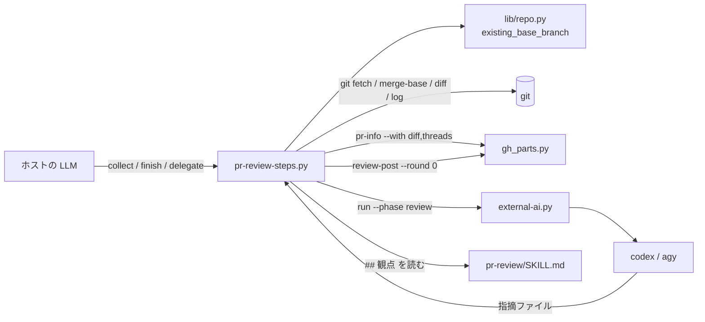

# pr-review: 収集・判定・投稿・外部 AI への委譲をスクリプトにする（pr-review-steps.py）

## 概要

**`/ndf:pr-review` の判断の要らない手順は `plugins/ndf/skills/pr-review/scripts/pr-review-steps.py` が行う。**
部分命令は `collect`（対象・差分・未解決のスレッドを集めてレビューの文脈ファイルを書く）・`finish`（指摘ファイルを
検査し、本来の判定を決め、PR なら `gh_parts.py review-post` で投稿し、`--branch` なら報告を書く）・`delegate`
（`collect` → プロンプトの組み立て → `external-ai.py run <codex|agy> --phase review` の上限つきの待ち → `finish` を 1 回で
行う）の 3 つで、どれも 1 行の結果 JSON（`tool` は `pr-review`）を返す。LLM はレビューそのもの（第 1 段の仕様適合・
第 2 段のコード品質）をして指摘ファイルを書くことと、結果の報告だけを持つ。外部 AI は指摘ファイルを書くだけで投稿しない。

この文書は、その形に**なぜしたか**（背景・決定と理由・常に成り立つ条件・既知の限界・テスト観点）を残す。
**手順・引数・観点の正は Skill にある。** 呼び方と報告は
[`pr-review` の SKILL.md の「手順」](../../plugins/ndf/skills/pr-review/SKILL.md#手順)、観点と重要度は
[同じ文書の「観点」](../../plugins/ndf/skills/pr-review/SKILL.md#観点)、部分命令の引数と出力は
[`pr-review-steps.py`](../../plugins/ndf/skills/pr-review/scripts/pr-review-steps.py) の冒頭の説明、指摘ファイルの
鍵の規則は同じスクリプトの `FINDINGS_GUIDE`（文脈ファイルの「指摘ファイルの書き方」の節として書かれる）、外部 CLI の
起動と上限は [`external-ai` の SKILL.md](../../plugins/ndf/skills/external-ai/SKILL.md) を読む。

決定の番号は #860 の設計の番号である。コードのコメントの「決定 6」「決定 9」「決定 14」などはこの番号を指す
（決定 13 は実装で覆ったため欠番にしてある。下の「決定と理由」の最後の行）。

## 用語

「指摘ファイル」「レビューの文脈ファイル」「仕様適合」「未解決のスレッド」「本来の判定」の定義は
用語集（[docs/glossary.md](../glossary.md)）が正である。語の正本の行は `development-workflow` の
[`references/glossary.md`](../../plugins/ndf/skills/development-workflow/references/glossary.md) にもある。

## 背景

決め直す前の `pr-review/SKILL.md` は 21,907 B（ndf 10.17.66）で、ベースブランチの解決・差分の収集・既存コメントの
取得・外部 AI へのプロンプトの組み立て（約 5.8 KB）・payload の組み立てと投稿・自分の PR の格下げ・投稿の失敗の
手当てを bash と文章で持っていた。LLM は毎回それを読んで打ち、外部 AI は自分で `gh api -X POST .../reviews` を呼んで
投稿し、外部 AI の待ちには上限が無かった（#345）。`cross-review` では、担当は投稿せず指摘ファイルを書き、投稿は回す側が
行う形が既に動いていた（[cross-review-writes-to-conductor.md](cross-review-writes-to-conductor.md)）。

置き換えた後の SKILL.md は 10,213 B（上限 10,240 B。ndf 10.17.67）で、観点（第 1 段・第 2 段・重要度）は残している。

## 決定と理由

| # | 決定 | 理由 | 採らなかった案 |
| ---: | --- | --- | --- |
| 1 | スクリプトを Skill の `scripts/` に `pr-review-steps.py` として置き、`resolve.sh scripts pr-review` で解く | 隣の `../SKILL.md` の観点の節を読むため。配布も Skill のディレクトリと一緒に動く。前例は `fix/scripts/fix-steps.py` | `plugins/ndf/scripts/pr-review-steps.py`（プラグインの根から Skill の本文を読む向きの依存が生まれる） |
| 2 | ベースブランチの実在の確認を `lib/repo.py` の `existing_base_branch` に足す。既存の `base_branch` は変えない | 同じ解決の写しが `merged` / `cherry-pick-pr` / `deploy` / `retrospective` にもあり、後で置き換えるときに確認が 2 つにならない。`base_branch` に入れると、宛先の名前として使う `pr-steps.py` にも `git ls-remote` の通信と「無い」の扱いの変化が及ぶ | 確認をスクリプト側に置く |
| 3 | 指摘ファイルに段の鍵 `stage`（`spec` / `quality`、省けば `quality`）を足す | 「仕様適合を満たさない指摘が 1 件以上なら `REQUEST_CHANGES`」を機械で数えるため。自由な文字列の `category` では書き方が揺れると数え漏れる。値を 2 つに決めれば読めない値を止められる | `severity` に `spec` を足す（重要度は `/ndf:fix` が直すかを決める別の軸で、混ぜると `fix` の判定の表が変わる） |
| 4 | 外部 AI のプロンプトに `review_criteria.py reviewer` の節を入れない | その節は重要度を `critical` / `major` だけに絞り、pr-review の 4 段の重要度と `minor` / `nit` だけなら `COMMENT` の判定と食い違う。ホストの LLM がレビューするときも渡さないため、委譲の有無で基準が変わらない | 節を入れて pr-review の重要度を 2 段へ寄せる（観点そのものの見直しで、範囲の外） |
| 5 | `review-post` へは `--round 0 --seat pr-review-<レビューする者>`（`host` / `codex` / `agy`）を渡す | 共通の部品の引数を変えずに済む。単発のレビューにはラウンドが無く、0 なら先頭行からラウンドの最大を数える集計の値も上がらない。二度送らない照合はラウンドと席と入口の時刻で行われ、同じ PR への cross-review の投稿と混ざらない | 先頭行の `cross-review` の語を変える引数を `review-post` に足す（得られるのは見出しの語の違いだけ） |
| 6 | プロンプトの観点はスクリプトが SKILL.md の `## 観点` の節を `gh_sections.get_section` で切り出して組む。重要度の表は `### 重要度` としてその節の下に置く | 「SKILL.md に観点が残る」と「別ファイルに同じ文が 2 つ無い」を同時に満たす | 観点を `references/` へ移す（SKILL.md から観点が消える）。スクリプトの定数に持つ（写しが 2 つになる） |
| 7 | 指摘ファイルの書き方は文脈ファイルの節（`FINDINGS_GUIDE`）だけが持ち、SKILL.md は「文脈ファイルの『指摘ファイルの書き方』に従う」とだけ書く | ホストの LLM も外部 AI も同じ形のファイルを書き、`finish` が読む。2 か所に置くと片方だけが変わる | — |
| 8 | 部分命令を `collect` / `finish` / `delegate` の 3 つにする | ホストの LLM がレビューするときは集める処理と判定・投稿の間に LLM の判断が入り、スクリプトは途中で LLM を待てない。委譲では間にスクリプトだけが入るため `delegate` が 1 回で通す | 1 つの命令に「LLM を待つ」状態を持たせ判断待ち（20 番台）で返して呼び直す（状態のファイルが要り、手順が増える） |
| 9 | 指摘ファイルは読むだけにし、送る payload は `<D>/payload.json`、本来の判定は `<D>/result.json` に別に書く | `review-post` は送れた先を payload のファイルへ書き戻す。指摘ファイルをそのまま payload にすると、投稿する側がレビューする者のファイルを書き換え、再実行で前回の書き戻しを読む | — |
| 10 | 待ちの上限は `external-ai.py run --phase review` の表の値（`limits.PHASE_TIMEOUT["review"]`、1,200 秒。`MONITOR_TIMEOUT` で延ばせる）を使い、`delegate` は `--timeout` と `--poll` をそのまま渡すだけにする | 上限を 1 か所に保つ。pr-review に独自の上限を持たせると、延ばしたつもりの値が片方にしか効かない | — |
| 11 | 宣言が無く既定ブランチも決まらないときは止まる（3） | 決め直す前は `main` を仮に置き、続く `git fetch origin main` で失敗していた。宣言のブランチが無いときに止まる扱いとそろう | — |
| 12 | `--branch` でも委譲を受ける | 引数の形 `[PR番号 \| --branch] [codex\|agy]` は `--branch codex` を許す。指摘ファイルを介すれば、モードの違いは文脈ファイルの中身と `finish` の出口だけになる | 委譲を PR モードに限る（受ける組を黙って減らす） |
| 14 | PR 番号を省いたときは、今のブランチを head とする開いた PR を対象にし、無ければ 3 で止まる | 「直前の PR」を一意に決めるため。`gh pr view`（引数なし）と同じ決め方 | 最後に作った PR を探す（他の人の PR や別の worktree の PR を拾う） |
| — | `collect` は PR と head の SHA を `<D>/target.json` に固定し、`finish` は同じ PR の収集があればその SHA を `review-post --head-sha` に渡す | 収集と投稿の間に push があると、指摘が未レビューの commit に付く（スプリント PR 1842 のレビュー round 2 で足した） | — |
| — | `--branch` の差分の起点は `git merge-base origin/<ベースブランチ> HEAD` にする | `origin/<ベースブランチ>` と 2 点で比べると、分岐の後に起点へ入った変更が「消した変更」として混ざる（同じ round 2） | — |
| — | 未解決のスレッドは位置（`path:line`）に最初のコメントの本文（改行とタブを空白へ畳んだ先頭 200 字）を添えて文脈ファイルへ渡す。そのため `gh_graphql` の問い合わせに `comments(first: 1)` を足し、`unresolved_threads` と `pr-info --with threads` の thread item に `body` の鍵を 1 つ足した（既存の鍵は変えない） | 位置だけでは「同じ位置でも趣旨が違えば出す」を判断できない。設計の決定 13（位置だけを渡し、共通の部品の形を変えない）は、この追加の設計で覆った | 位置だけを渡す |

## 仕様

### 構成要素と責務

| 要素 | 責務 |
| --- | --- |
| `pr-review/scripts/pr-review-steps.py`（`collect`・`collect_pr`・`collect_branch`・`pr_of_current_branch`・`finish_review`・`perspectives`・`delegate_prompt`・`cmd_delegate`） | 対象の決定・文脈ファイルとプロンプトを書く・子のスクリプト（`gh_parts.py` / `external-ai.py`）を argv の配列で起動する・結果 JSON |
| `pr-review/scripts/pr_review_findings.py`（`check_findings`・`decide_event`・`build_payload`・`branch_report`・`load_findings`） | 指摘ファイルの検査・本来の判定・payload と `--branch` の報告の組み立て。外部へアクセスせず、指摘ファイルを書き換えない |
| `pr-review/scripts/pr_review_context.py`（`_pr_sections`） | PR モードの文脈ファイルの節（対象・受け入れ条件の在りか・差分・未解決のスレッド） |
| `plugins/ndf/scripts/lib/repo.py`（`existing_base_branch`） | 宣言のベースブランチの実在の確認（取得済みの参照 → `git ls-remote` の参照名の完全一致）と、宣言が無いときの既定ブランチ |
| `plugins/ndf/scripts/lib/gh_graphql.py`（`UNRESOLVED_THREADS_QUERY`・`UNRESOLVED_THREADS_JQ`・`unresolved_threads`）・`gh_pr_info.py`（`_thread_items`） | 未解決のスレッドと最初のコメントの本文 |
| `gh_parts.py review-post`・`external-ai.py run` | 投稿・自分の PR の `COMMENT` への格下げ・位置の拒否の退避 / 外部 CLI の起動・上限つきの待ち・回収（どちらも既存のまま） |

### 常に成り立つ条件

| 条件 | 破れたときの扱い |
| --- | --- |
| 宣言のベースブランチが origin にもローカルにも無いとき、既定ブランチへ落とさない。宣言も origin の HEAD も `main` / `master` も無いときも同じ | `collect --branch` は 3 で止まり、文脈ファイルを書かない |
| `git ls-remote` の行は参照名が `refs/heads/<名前>` と完全一致するときだけ「ある」と読む（`refs/heads/x/refs/heads/<名前>` だけなら無い） | 無いとして上の行へ |
| `.ndf/worktree.json` を読むコードは `repo.py` だけにあり、`pr-review` のスクリプトと SKILL.md に写しが無い | テストが落とす |
| 重要度は `critical` / `major` / `minor` / `nit`、段は `spec` / `quality`（省けば `quality`）のどれかで、`body` は空でない | 投稿せず 2 で止まり、読めない指摘を `items` に返す |
| 本来の判定は指摘の集合だけから決まる。`critical`・`major`・段 `spec` のどれかが 1 件以上なら `REQUEST_CHANGES`、`minor`・`nit` だけなら `COMMENT`、0 件なら `APPROVE` | テストが落とす |
| 投稿は指摘ファイルを読めた後に `review-post` を 1 回だけ呼ぶ。外部 AI の上限越え・結果なし（`outcome` が `ok` でない）は 1、指摘ファイルが無い・読めないは 2 で、どちらも投稿しない | 非 0 で終わる |
| `review-post` が失敗したら、その終了コードをそのまま返し、指摘ファイルと payload を残す | — |
| `--branch` では投稿しない。`<D>/report.md` を書く | テストが落とす |
| PR モードで差分か未解決のスレッドを取れないときは、重複防止なしで進めない | 2 で止まる |
| `collect` は実行の始めに前回の `findings.json` を消す（前回の指摘を今回のものとして投稿しない） | テストが落とす |
| 自分の PR では `COMMENT` で送り、本来の判定は `metrics.intent`、送った判定は `metrics.posted_as` に分けて残す | テストが落とす |
| payload は `json.dumps` で書き、子のプロセスは argv の配列で起動する（シェルの文字列へ値を埋め込まない） | テストが落とす |
| プロンプトの観点は SKILL.md の `## 観点` の節から組まれる。節が無ければ組まない | 2 で止まる |

## 運用

### 既知の限界

| 項目 | 内容 |
| --- | --- |
| 本文の先頭 200 字での重複防止 | 未解決のスレッドの趣旨を先頭 200 字で見分けられるかは実測していない。解決済みのスレッドと一般のコメントは見ないため、解決済みの指摘をもう一度挙げることはある（解決済みは直したか見送ったかで、同じ指摘が再び当たるなら再び示す） |
| 外部 AI の出力の回収 | `run` は結果ファイルが無いと標準出力を出力のファイルへ写す。外部 AI が JSON を地の文に包んで出すと読めずに 2 で終わる |
| 見出しの語 | 総評の先頭行は `review-post` の書式のまま `## 🤖 cross-review \| round 0 \| pr-review-<レビューする者> \| <判定>` になる |
| 委譲先 | 受けるのは `codex` / `agy` だけである。`external-ai.py run` が受ける `kiro` / `claude` は足していない |
| 抜粋 | worker 向けの `pr-review` の抜粋（[ndf-worker-agent-and-skill-excerpts.md](ndf-worker-agent-and-skill-excerpts.md)）はまだ無い |

## テスト観点

テストはすべて `plugins/ndf/skills/pr-review/tests/test_pr_review_steps.py` にある（`unresolved_threads` の 4 列の
読み取りは `plugins/ndf/scripts/tests/test_gh_parts.py` も見る）。

- `existing_base_branch` が、宣言が取得済みの参照にある / `git ls-remote` でだけ見つかる / どこにも無い（既定ブランチへ落とさない）/ 宣言が無く origin の HEAD がある / 宣言も origin の HEAD も無く `main` か `master` がある / どれも無い、の 6 通りで決まった値を返し、`ls-remote` の末尾一致を「ある」と読まないこと
- `collect --branch` がベースブランチ・変更ファイル・統計・履歴を出し、差分の起点が merge-base で、宣言のベースブランチが無ければ 3 で止まること
- `collect` が未解決のスレッドの位置と本文を文脈ファイルへ渡し、前回の指摘ファイルを消し、スレッドを取れなければ止まること。`metrics` と節の形、差分・スレッド・本文の無い PR、止まる場合の終了コードと文が固定されていること
- `pr-review` のスクリプトが `.ndf/worktree.json` を自分で読まないこと
- `decide_event` が判定の表のとおりを返し、件数を数えること。`check_findings` が未知の重要度・段・空の本文と、配列でない `comments` を拒むこと
- `finish` が `review-post` を `--round 0` で 1 回だけ呼び本来の判定を残すこと、読めない指摘ファイルでは投稿しないこと、投稿の失敗の終了コードを返すこと、`--branch` で投稿せず報告を書くこと、題に `"` と `$()` を含めても payload が壊れないこと
- `delegate` が SKILL.md の観点と文脈ファイルからプロンプトを組み、`--phase review` で起動して投稿し、収集した head へ投稿すること。同じ PR の収集が無い `finish` は head を `review-post` に任せること。読めない出力と上限越え（応答しない偽の CLI と短い `--timeout`）では投稿しないこと
- thread item に `body` が載り、`UNRESOLVED_THREADS_JQ` が最初のコメントの本文の改行を空白へ畳むこと

## 関連リンク

- [`pr-review` の SKILL.md](../../plugins/ndf/skills/pr-review/SKILL.md)（手順・観点・報告の正）
- [`external-ai` の SKILL.md](../../plugins/ndf/skills/external-ai/SKILL.md)（外部 CLI の起動と上限つきの待ち）
- [cross-review-writes-to-conductor.md](cross-review-writes-to-conductor.md)（担当は投稿せずファイルを書き、回す側が投稿する形と `review-post`）
- [`plugins/ndf/scripts/lib/README.md`](../../plugins/ndf/scripts/lib/README.md)（`gh_parts`・`repo`・結果 JSON の形）
- #860（この形を決めた課題）、#345（外部 AI の待ちの上限）、#845（トークン消費の削減の親）
