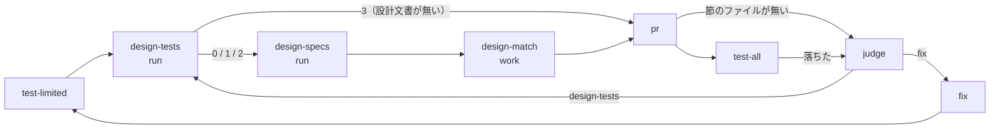

# quality-gates: 完了判定での設計との突き合わせ（design-match.py と「設計と違う点」の節）

## 概要

**`standard` の完了判定は、実装を設計文書・既存の確定仕様と変更履歴・設計の決定と照らし、食い違いを実装 PR の本文の
`## 設計と違う点` に残す。** 確認は 3 つで、(a) 設計に名前の出るテストが HEAD にあるか と (b) 変えたファイル・
シンボルを参照する既存の確定仕様と `CHANGELOG.md` の列挙は `plugins/ndf/scripts/design-match.py`（`tests` / `specs`）が
LLM を呼ばずに出し、(c) 設計の決定と実装の一致と、(b) で並んだ記述が変更後の振る舞いと合うかの判断は担い手
（単発は conductor、3 層は `design-match` の work ステップの worker）が行う。3 層（supervise.py）の `standard` の
実装プランは、範囲テスト（`test-limited`）と `pr` の間に `design-tests` → `design-specs` → `design-match` を置き、
`pr` のステップが節を本文へ 1 つだけ置く。

この文書は、その形に**なぜしたか**（背景・決定と理由・常に成り立つ条件・境界の決まり・データの形・既知の限界・
テスト観点）を残す。**手順・引数・終了コードの読み方・節の形の正は Skill とスクリプトにある。** 確認 (a)(b)(c) の
手順と節の形は [`quality-gates` の `references/design-match.md`](../../plugins/ndf/skills/quality-gates/references/design-match.md)、
完了の定義の項目は [`references/definition-of-done.md`](../../plugins/ndf/skills/quality-gates/references/definition-of-done.md)、
単発の実装 PR の節は [`pr` の SKILL.md](../../plugins/ndf/skills/pr/SKILL.md) の手順 4、サブコマンドの引数と終了コードは
[`design-match.py`](../../plugins/ndf/scripts/design-match.py) の冒頭の説明、課題の本文の錠は
[`lib/gh_parts.py`](../../plugins/ndf/scripts/lib/gh_parts.py) の冒頭の説明を読む。

決定の番号は #1241 の設計の番号である。コードのコメントの「#1241 の I7」「決定 14」などは同じ設計の不変条件と決定を指す。

## 用語

「設計との突き合わせ」「設計に名前の出るテスト」「既存の確定仕様」「設計の決定」「設計と違う点」の定義は
用語集（[docs/glossary.md](../glossary.md)）が正である。

## 背景

完了判定は受け入れ条件とテストの結果だけを見ていた。設計が作ると書いたテスト・既存の確定仕様と変更履歴・設計の
決定と実装の食い違いは、確定仕様化かリリース後テストで初めて見つかり、devbasex/devbase の m6・m7b・m7e で 7 件の
手戻りになった。代表は次の 2 つである。

| 実物 | 何が起きたか | 突き合わせのどれで拾うか |
| --- | --- | --- |
| devbasex/devbase の #216 | 設計文書が `## 構成要素` に回帰テスト `tests/ci/test_ci_workflow.py` を、`## テスト設計` にパスの無い関数の名前（`test_pull_request_is_not_filtered_by_branch` など 3 つ）を書いたが、実装の HEAD（`b57710e^`）に無かった | 確認 (a)。パスは `## 構成要素` にだけあったため、拾う節を `## 決定の記録` と `## テスト設計` に限ると拾えない（決定 2） |
| devbasex/devbase の #247（`4d82277`） | shellcheck の版を固定したが、既存の確定仕様 `base-image-shellcheck.md` は「版は固定せず」のまま残った | 確認 (b)。差分から抜いた語のうち 4 つ（パス 3 つと `SHELLCHECK_VERSION`）が一致し、その文書が最上位に並ぶ |

性能は ai-plugins の `HEAD~60..HEAD`（変更 412 ファイル・2,472 語）を `docs/specifications/` の 68 文書へ当てて測った
（2026-10-08）。語ごとに行を照らすと 120 秒を超え、`git grep -F -f` は 6.8 秒、1 つの正規表現での走査は 2.6 秒だった。

## 決定と理由

| # | 決定 | 理由 | 採らなかった案 |
| ---: | --- | --- | --- |
| 1 | 確認 (a)(b) を新しい 1 本のスクリプト `design-match.py` の 2 つのサブコマンドにし、確定仕様化とは置き場の定数だけを共有する | 確定仕様化の手順（`plan-to-spec-steps.py`）は文書と実装を照らす処理を持たず、寄せても共有できるのは置き場だけである。(a) と (b) は入力が違い、片方だけを打つ場面がある | `plan-to-spec-steps.py` へサブコマンドを足す（確定仕様化の手順に完了判定の手順が混ざる）。(a) と (b) を別々のスクリプトにする（設計文書の探し方・結果の形・終了コードの扱いを 2 か所に持つ） |
| 2 | テストの名前を拾う節を `## 決定の記録`・`## テスト設計`・`## 構成要素` の 3 つにし、`## テスト設計` からは `test` で始まる識別子も拾う | `## 構成要素` は「作るもの・変えるもの」を並べる節で、テストファイルを作ると書く場所として決定の記録と同じ重みを持つ。#216 の取りこぼしはこの 2 つを足さないと拾えない | 設計文書の全体から拾う（ドメインモデルや未確認の節が、消したテスト・既存のテスト・例として名前を書き、「無い」の誤検出になる）。2 節だけにする |
| 3 | 関数の有無を言語の構文で見ず、名前がファイルに語として現れるか（`git grep -w -F`）で見る | どの言語でも同じに働き、「判定できない言語」が生じない。誤りは「ある」と読む側に倒れ、「無い」の誤検出は増えない | 言語ごとに定義の形の表を持つ（表に無い言語で毎回「確かめられなかった」になる） |
| 4 | 確認 (a) の終了コードは「無い」（1）を「確かめられなかった」（2）より先に返す。設計文書が無いときの 3 は判定の前に決まる | 「無い」は直すか節に並べる対象がはっきりしており、2 を先に返すと読めない結果に埋もれる | 「確かめられなかった」を 1 件でも含めば 2 を返す（1 か所の git の失敗で、確かに無い名前の扱いが落ちる） |
| 5 | 確認 (b) のシンボルは差分の定義の行と `_` を含む大文字の識別子だけから抜き、4 文字未満を捨て、一致した語の種類の数の多い順に並べる | 増減の行のすべての識別子を語にすると `self`・`path` がすべての文書に一致する。1 文字の型も多くの文書に一致した。版の固定の差分（devbasex/devbase の `4d82277`）でも、食い違った文書が 4 語で最上位に来る | コードインテリジェンス（Serena）で変えたシンボルを抜く（言語サーバの用意がリポジトリごとに要り、外部の常駐の仕組みに頼る）。増減の行の識別子をすべて語にする |
| 6 | 確認 (b) の照合は語を 1 つの正規表現（長い語から並べた選択）にまとめ、`git cat-file --batch` で読んだ文書を 1 回ずつ走査する | 背景の実測で 2.6 秒に収まり、どの語が一致したかも同じ走査で取れる | `git grep -F -f` で行を取ってから語を割り当てる（倍以上遅く、並びのためにもう 1 度照らす） |
| 7 | 確定仕様の置き場 `SPEC_DIR = "docs/specifications"` を `lib/repo.py` に置き、`plan-to-spec-steps.py` と `design-match.py` がそれを読む | 同じ字面を 2 か所に書くと、片方だけを変えたときに (b) が別の場所を見る | 置き場をプロジェクトの設定で変えられるようにする（要求の範囲の外） |
| 8 | CI に確認 (a) と節の検査を置かない。節の有無だけを、単発は `pr-steps.py create` / `update` の `next` で知らせ、3 層は `PrStep` が必ず置く | CI はどの設計文書がどの PR に当たるかを決める手段を持たず、正当な違い（作らなかった理由を節に書いたもの）でも落ちる。節の中身は判断で、機械で正誤を決められない | CI のジョブで (a) を落とす（承認を要しない取り込みが止まる） |
| 9 | 3 層では `standard` のときだけ、`test-limited` と `pr` の間に突き合わせの 3 ステップを置く | `fix` は `test-limited` へ戻るため、修正のたびに突き合わせ直し、節が最後の実装に合う。`pr` より前なら worker が直した文書のコミットも同じ push に乗る | `test-all` の後に置く（本文を作った後になり、もう 1 度書き直す）。モードを問わず置いて `tests` の 3 で飛ばす（`light` でも run のステップが 1 つ増える） |
| 10 | 3 層では `design-match` の worker が節を `{state_dir}/design-diff.md` に書き、`PrStep` は置くだけにする。LLM の本文に同じ見出しがあれば置き換える | PR の本文の LLM（`PR_SYSTEM`）は Tool を持たず、決定と実装の一致を判断できない。判断した者が書けば、本文を LLM に書かせても書かせなくても節が残る | `PR_SYSTEM` に節を書かせる（材料の抜粋から「無し」と書きうる） |
| 11 | 実装で変えた受け入れ条件の前提は、課題の本文を `requirements-design` の「変更の途中で要求が変わったとき」の形で直し、`issues/` の写しは `spec-copy.py write` で作り直す | 要求の正は課題の本文で、写しは手で直さない。リリース後テストと確定仕様化は課題の本文を読み、PR の本文を読まない | 節にだけ「受け入れ条件 N を実装で変えた」と書く |
| 12 | `pr-steps.py template` は `--mode standard` のときだけ節の雛形を書く。`--mode` を省いたときの雛形は変えない | 設計文書の無い変更の PR に「該当なし」の節が毎回入ると、読む行が増えるだけで何も伝えない | すべてのモードの雛形に節を入れる |
| 13 | 課題の本文を書く経路を `gh_parts.py body-section`（worker）と `gh_parts.py body-lock`（`progress-record.sh`）の 2 つにし、どちらも課題ごとの錠を取ってから読み、書き終えてから放す。`progress-record.sh` は錠を 30 秒の待ち上限で取り、取れなければ `## 進行` を書かずに 0 で続ける | 決定 11 の worker と進捗記録が同じ本文を読んで書き戻すと、後に書いた側が先の書き込みを消し、消えたことに誰も気づかない。進行管理が理由で開発の工程を止めない | 読んでから書くまでを短く保ち、排他はしない |
| 14 | 3 層の `pr` のステップは、節のファイルが無いとき `design-tests` が 3 で終わっていれば「該当なし（設計文書が無い）」を置き、0 / 1 / 2 なら PR を作らずに止めて judge へ戻す | 欠落だけで「該当なし」を置くと、設計文書があるのに worker が節を書かなかった PR が、確認を済ませたものとして通る | 欠落を「未検証」の 1 行にして PR を作る（後ろの全体テストと doc-lint は節の中身を読まない） |

## 仕様

### 構成要素と責務

| 要素 | 責務 |
| --- | --- |
| `plugins/ndf/scripts/design-match.py` | `tests`（確認 (a)）と `specs`（確認 (b)）。LLM を呼ばず、どの文書も書き換えず、結果を 1 行の JSON（`lib/step_result.py` の形）で返す |
| `plugins/ndf/scripts/lib/repo.py`（`SPEC_DIR`） | 確定仕様の置き場の定数。`plan-to-spec-steps.py` の索引のパスと `design-match.py specs` の対象が読む |
| `plugins/ndf/scripts/supervise_lib/procedures.py`（`DESIGN_MATCH_MODES`・`design_match_steps`・`design_diff_on_pr`） | 突き合わせの 3 ステップと、`pr` のステップへ持たせる `diff_section`（節のファイル）・`on_section_missing`（節が無いときの行き先） |
| `plugins/ndf/scripts/supervise_lib/templates.py`（`plan_to_merge`） | `standard` で課題があるとき、`test-limited` の次と judge の「先へ進む」選択肢を `design-tests` へ向ける |
| `plugins/ndf/scripts/supervise_lib/prompts.py`（`DESIGN_MATCH_PROMPT`） | `design-match` の work ステップの worker への指示 |
| `plugins/ndf/scripts/supervise_lib/pr.py`（`PrStep.design_diff`・`with_design_diff`） | 節のファイルを本文へ 1 つだけ置く。ファイルが無いときの「該当なし」と停止を決める |
| `plugins/ndf/scripts/pr-steps.py`（`template` / `create` / `update` の `--mode`） | 単発の実装 PR の雛形と、節が無いときの `next` |
| `plugins/ndf/scripts/lib/gh_parts.py`（`body-section`・`body-lock`）と `progress-record.sh` | 課題の本文を課題ごとの錠の中で書き換える |



### 常に成り立つ条件

| 条件 | 破れたときの扱い |
| --- | --- |
| 設計に名前の出るテストのうち HEAD に無いものが 1 件でもあれば、`tests` は 1 で終わり、その名前を `missing` で出す。判定の相手は HEAD で、worktree にだけあるファイルは数えない | テストが落とす（0 を返せば完了判定が取りこぼす） |
| 設計文書か git が読めないとき、`tests` は 2 で終わり、0 と 1 へ畳まない | テストが落とす |
| 設計文書が見つからないとき、`tests` は 3 で終わり、名前を判定せず `items` を空にする | テストが落とす（設計の無い変更に「無い」を出さない） |
| 名前が 0 件のとき、`tests` は 0 で終わり、`metrics.names` に 0 を残す | テストが落とす（0 件と「判定しなかった」を読み分ける） |
| `specs` の列挙は、merge-base に無かった文書（同じ差分で足した文書）を含めない | テストが落とす（確定仕様化で足した文書が「既存」として並ぶ） |
| `specs` は変えたファイルのパスか増減したシンボルの名前を含む既存の確定仕様と `CHANGELOG.md` を、文書と行で出す | テストが落とす |
| `design-match.py` は読むだけで、どの文書も書き換えない。PR のステップは節を置くだけで中身を書かない | — |
| 3 層の `standard` の実装 PR の本文は `## 設計と違う点` を 1 つだけ持つ。「該当なし（設計文書が無い）」を置くのは `design-tests` が 3 で終わったときだけである | 節のファイルが無く `design-tests` が 0 / 1 / 2 なら、`pr` は push も PR の作成もせずに止まり（結果に `section_missing`）、judge へ戻る |
| 単発の `pr-steps.py create` / `update` は、`--mode standard` で `design/` 以外のブランチの本文に節が無いと、`next` で足すよう求める。止めはしない | — |
| `standard` 以外のモードの実装プランには、突き合わせのステップが入らず、`test-limited` の次は `pr` のままである | テストが落とす（設計文書の無い変更の手順と所要を変えない） |
| 課題の本文を書き換える者（`gh_parts.py body-section` と `progress-record.sh`）は課題ごとの錠を取ってから本文を読み、書き終えてから放す。差し替えは節ごとに行い、本文全体を手元の写しで上書きしない | `progress-record.sh` は 30 秒（`NDF_PROGRESS_LOCK_TIMEOUT`）で錠を取れなければ記録を飛ばして 0。`body-lock` は `--timeout` で取れなければコマンドを走らせずに 2 |

### 境界の決まり

**確認 (a) が拾う字面。** 3 つの節（深さ 2 の見出し）の、囲み（```）と引用（`>`）の外の行にある、バッククォートの中の字面だけを見る。

| 字面 | 種類 | ある と判定する条件 |
| --- | --- | --- |
| テストファイルのパス（区切りのどれかが `test` / `tests` / `spec` / `specs` / `__tests__`、またはファイル名が `test_*` / `*_test.*` / `*.test.*` / `*.spec.*` / `*Test.*` / `*Tests.*`） | `test_file` | HEAD にそのパスのファイルかディレクトリがある。`/` を含まないファイル名だけの字面は、HEAD のどこかに同じ名前のファイルがあれば ある |
| `<パス>::<名前>[::<名前>]`（パスがテストファイルの形） | `test_function` | パスのファイルが HEAD にあり、`::` で区切った名前（末尾の `[...]` の引数を除く）がすべて、そのファイルに語として現れる |
| `test_x`・`testX`・`TestX`・`TEST…` の形の識別子（`## テスト設計` だけ） | `test_function` | HEAD の `.md` 以外の追跡しているファイルのどれかに、語として現れる。`tests`・`test_` のような置き場や接頭辞の字面は拾わない |

- `<` `{` `*` `…` を含む字面のうち、テストの名前の形に見えるもの（`::` を含むか、形の字を語に置き換えると上の表の形になるもの）は形の説明として `metrics.skipped` に数え、判定しない。テストの名前の形に見えないものは数えない
- 同じ字面は、課題のすべての設計文書を通して最初の 1 か所だけを出す
- `--issue` は HEAD の `issues/` から `issue-<番号の並び>-design[-<主題>].md` のうち並びに番号を含むものを読む（決定の記録の別ファイル `-design-decisions.md` を含む）。`--design` は渡したパスのファイルをそのまま読む

**確認 (b) の語と対象。**

| 何を | 決め方 |
| --- | --- |
| 範囲 | `git merge-base <base> HEAD` から HEAD |
| 語（パス） | `git diff --name-status -M` の変更したファイルのパス。名前を変えたものは前後の両方 |
| 語（シンボル） | `.md` 以外の差分（`-U0`）の hunk の見出しと増減の行から、`def` / `class` / `function` / `func` / `fn` に続く識別子と、`_` を含む大文字の識別子。4 文字未満は捨てる |
| 一致 | パスは字面の一致、シンボルは前後が識別子の文字（`A-Za-z0-9_`）でない一致 |
| 対象の文書 | HEAD の `SPEC_DIR` の下の `.md` と、名前が `CHANGELOG.md` のすべてのファイルのうち、merge-base にもあったもの |
| 並び | 一致した語の種類の数の多い順、同じなら文書のパスの順 |

### データの形

`tests` の `items` の 1 件と `metrics`:

```json
{"kind": "test_file", "name": "tests/ci/test_ci_workflow.py", "result": "missing",
 "doc": "issues/issue-216-design.md", "line": 120, "section": "構成要素"}
```

- `kind` は `test_file` / `test_function`、`result` は `present` / `missing` / `unverified`、`name` は書かれた字面のまま
- `metrics` は `designs`・`names`・`missing`・`unverified`・`skipped`

`specs` の `items` の 1 件と `metrics`:

```json
{"kind": "spec", "name": "docs/specifications/base-image-shellcheck.md", "result": "listed",
 "terms": ["SHELLCHECK_VERSION", "..."], "lines": [12, 30], "line_count": 2, "changed_in_diff": false}
```

- `kind` は `spec` / `changelog`。`lines` は `--max-lines` までで、超えた行は `line_count` にだけ数える。`changed_in_diff` はその文書をこの差分で直したか
- `metrics` は `changed_paths`・`symbols`・`terms`・`listed`

3 層の `pr` のステップは `diff_section`（`{state_dir}/design-diff.md`）と `on_section_missing`（`judge`）を持つ。
節のファイルの中身が `## 設計と違う点` で始まらなければ、`PrStep` が見出しを補う。LLM の本文に同じ見出しが無ければ、
材料の節と同じ位置（署名の前）へ置く。見出しがあれば置き換え、その節が最後で署名まで含んでいたときは署名を戻す。

## 運用

### 既知の限界

| 項目 | 内容 |
| --- | --- |
| `specs` の誤検出の多さ | 広く使われるパス（`CHANGELOG.md` など）は多くの文書に一致する。ai-plugins の `HEAD~60..HEAD` では 68 文書のすべてが並んだ。並びと `--max-lines` で読む量を抑えるが、誤検出の多さが読む手間に見合うかは、`standard` の実装 PR での実測（読んだ文書の数・直した記述の数）でしか決められない |
| 例として書いた名前 | 3 つの節に他のリポジトリの例や採らなかった案としてテストのパスを書くと、`tests` はそれも判定し `missing` を出す。#1241 自身の設計文書では、決定 2 が #216 の例として書いた `tests/ci/test_ci_workflow.py` が `missing` になる。担い手が節に「例として書いた名前」と並べて満たす |
| ファイル名だけの字面 | `/` を含まない `test_x.py` は HEAD のどこかに同じ名前があれば ある と判定するため、別の置き場の同名のファイルで満たされうる |
| 語の一致による関数の判定 | 名前がコメントや文字列にだけ現れても ある と判定する（見逃しの側に倒れる）。言語ごとの定義の形は持たない |
| 課題の本文の書き換えの競合 | 錠は機械ごとのファイル（`~/.claude/ndf/locks/issue-body/` の下）のため、別の機械からの書き込みと、人が GitHub の画面で直す書き込みは排他できない。節ごとの差し替えで、消える範囲を書き換えた節に限る |
| スプリントブランチの設計文書 | 3 層のスプリントでは、設計 PR がベースブランチへマージされた後にスプリントブランチを切る前提で、実装の worktree の HEAD に設計文書がある。前提が崩れると `tests` が 3 を返し、突き合わせが「該当なし」で飛ぶ |
| 課題の無い `standard` のプラン | 3 層の `plan_to_merge` は課題（`--issue`）が無いと突き合わせのステップを入れない |
| 決定の表を課題のコメントに持つ変更 | 設計の決定を課題のコメントに置き、`issues/` に設計文書を持たない変更（#1447 の carmo-cdk の形）は、`tests` が 3 を返し、突き合わせの対象にならない |

## テスト観点

- `## テスト設計` に書いたパスと `<パス>::<名前>` の関数が HEAD に無いと `missing` で 1、worktree にだけ置いたファイルも `missing` になること。`## 構成要素` にだけ書いたパスも拾うこと（`plugins/ndf/scripts/tests/test_design_match.py`）
- 名前がすべてあると 0、名前が 0 件なら 0 で `metrics.names` が 0、課題のすべての設計文書（決定の記録の別ファイルを含む）を読むこと（`test_design_match.py`）
- 設計文書の無い課題で 3 と空の `items`、git の外の `--root` と読めない `--design` で 2 になること（`test_design_match.py`）
- `specs` が変えたパスとシンボルを含む既存の確定仕様と `CHANGELOG.md` を語の種類の多い順に出し、同じ差分で足した確定仕様を出さず、`--max-lines` で行を抑え、解けない `--base` で 2 になること。確定仕様 70 文書・語 2,500 で 10 秒以内に終わること（`test_design_match.py`）
- `standard` のプランで `test-limited` → `design-tests` → `design-specs` → `design-match` → `pr` の順につながり、`design-tests` の `skip_to` が `pr` であること。ほかのモードのステップの並びが変わらないこと（`plugins/ndf/scripts/tests/test_supervise_design_match.py`）
- `PrStep` が書かれた節を署名の前に 1 つだけ置き、LLM の本文の同じ見出しを置き換えて署名を残すこと。節のファイルが無いとき、`design-tests` が 3 なら「該当なし」、0 / 1 / 2 なら PR を作らずに止まること（`test_supervise_design_match.py`）
- `pr-steps.py template --mode standard` だけが節の雛形を書き、`create --mode standard` が節の無い本文に `next` で節を求めること（`plugins/ndf/scripts/tests/test_pr_steps.py`）
- 錠を持つ別のプロセスがあるあいだ `body-section replace` が本文を読まずに待ち、`body-lock` が錠の中でコマンドを走らせ、`--timeout` で取れなければ走らせないこと。`progress-record.sh` が錠を待ってから書き、取れなければ書かずに 0 で終わること（`plugins/ndf/scripts/tests/test_gh_parts.py`・`plugins/ndf/scripts/tests/test_progress_record.py`）

## 関連リンク

- [`quality-gates` の `references/design-match.md`](../../plugins/ndf/skills/quality-gates/references/design-match.md)（確認 (a)(b)(c) の手順・終了コードの読み方・節の形の正）
- [`quality-gates` の `references/definition-of-done.md`](../../plugins/ndf/skills/quality-gates/references/definition-of-done.md)（`standard` の完了の定義）
- [`pr` の SKILL.md](../../plugins/ndf/skills/pr/SKILL.md)（単発の実装 PR の節）
- [`design-match.py`](../../plugins/ndf/scripts/design-match.py)（サブコマンドの引数と終了コード）
- [`lib/gh_parts.py`](../../plugins/ndf/scripts/lib/gh_parts.py)（`body-section` と `body-lock` と錠の置き場）
- [ndf-agent-layers-unattended-run.md](ndf-agent-layers-unattended-run.md)（3 層の実装プラン）
- #1241（この形を決めた課題）、#735（同じ完了判定へ足す実データの結合確認）、#337（要求から証拠までの全体の追跡。やらないで閉じた）
