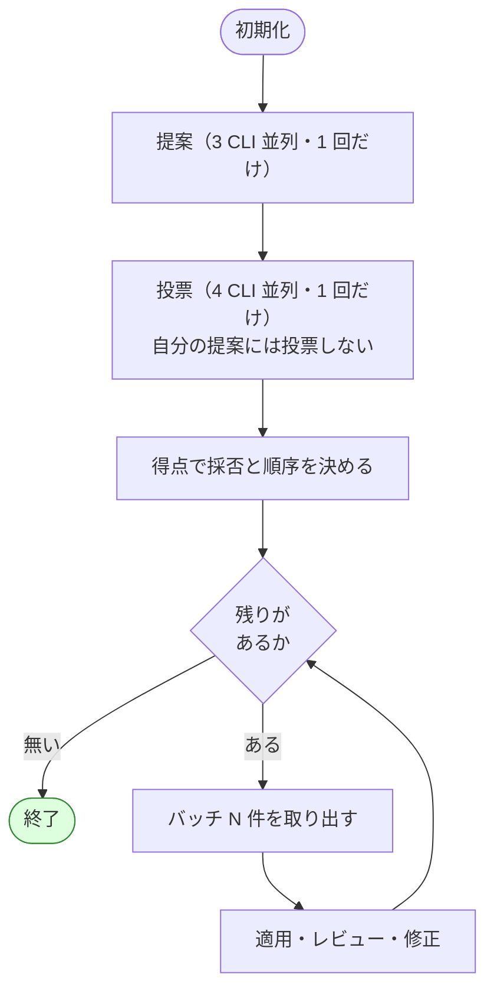

# cross-refactoring: 進行の設計見直しと不具合 3 件の修正

## 関連リンク

- [issue-113-cross-refactoring-7th-trial-report.md](issue-113-cross-refactoring-7th-trial-report.md) — 実測の出どころ（7 回目の実機試行）
- 対象 Skill: `plugins/ndf/skills/cross-refactoring/`

## モード

進行の骨格と検証の単位が変わり、複数ファイルにまたがるため、実装プランと計測を伴うモードで進める。

## 目的と非目的

達成したい状態:

- 効果の見込める改善だけを扱う。対象の選び方を、提案者の自己申告から、実測値を材料にした
  4 者の投票へ移す
- 提案ラウンド 1 回の所要を、修正フェーズが発生しない場合で 15 分以内にする（実測は 23〜34 分）
- テストの実行回数を 57 回から 31 回へ、うち全体テスト（33.9 秒）を 53 回から 5 回へ減らす
- 7 回目の実機試行で見つかった 3 件を直し、進行が中断せずに終了まで到達できるようにする

やらないこと:

- 適用フェーズの並列化。項目を複数の実装担当へ分割すると、輪番による担当の固定と、
  取り消しの単位が崩れる。所要の 37.5% を占める最大の項目だが、設計の変更が大きい
- レビュー担当を 2 者から 1 者へ減らすこと。判定一致率が 0.40〜0.67 で、判断が割れる場面がある
- テーマ（重複・可読性・例外処理など）ごとにラウンドを分けること。提案とレビューの
  起動費用が 1 ラウンドあたり約 10 分かかるため、テーマ数だけ固定費が増える

## 実測からわかったこと

### 提案の集中先が、実際の変更頻度と対応していない

```console
$ git log --since="1 year ago" --format= --name-only -- lib/devbase/volume lib/devbase/snapshot \
    | sort | uniq -c | sort -rn | head -4
      8 lib/devbase/volume/compose.py
      2 lib/devbase/volume/ports.py
      2 lib/devbase/volume/manager.py
      2 lib/devbase/snapshot/manager.py
```

| ファイル | 過去 1 年の変更回数 | 7 回目の提案件数 |
| --- | ---: | ---: |
| `volume/compose.py` | 8 | 6 |
| `snapshot/manager.py` | 2 | 7 |
| `volume/manager.py` | 2 | 6 |

変更が最も少ないファイルに、最も多くの提案が集まった。`snapshot/manager.py` は 455 行に
対して 7 件で、うち 1 件（R1-001）だけで 219 行を書き換えている。改善の効果が今後どれだけ
続くかという観点が、提案にも採否にも入っていない。

### 変更頻度は単独の基準にはならない

対象範囲の履歴は全期間で 9 コミットで、初期開発の段階にあるリポジトリでは母数が足りない。

```console
$ git log --oneline -- lib/devbase/volume lib/devbase/snapshot | wc -l
9
```

参照元の数と突き合わせると、2 つの指標は逆を向く場面がある。

| ID | 対象 | 提案者の合意 | 参照元 | 変更頻度 |
| --- | --- | ---: | ---: | ---: |
| R1-001 | `SnapshotManager.restore` | 2 | 36 | 2 |
| R2-001 | `generate_scaled_compose` | 2 | 36 | 8 |
| R1-005 | `SnapshotManager.last_snapshot_time` | 1 | 9 | 2 |
| R3-001〜003 | `compose.py` の内部関数 | 1 | 1 | 8 |
| R2-002 | `get_volume_for_index` | 2 | 0 | 2 |

変更頻度だけで足切りすると、参照元 36 の `restore`（219 行の改善）が落ちる。参照元だけで
見ると、頻繁に変更される `compose.py` の内部関数が落ちる。単独の指標ではどちらも取り逃がす。

一方、**独立した提案者の合意は、リポジトリの成熟度に左右されない**。3 者が別々のプロセスで
提案するため、2 者以上が同じ対象を挙げた事実は書き換えでは作れない。19 件のうち 4 件が
これに当たり、うち 2 件が参照元最多の項目と重なる。

### 重要度の自己申告は、採否の基準として働いていない

| ラウンド | major | minor | 実差分 |
| ---: | ---: | ---: | ---: |
| 1 | 2 | 3 | 392 行 |
| 2 | 2 | 3 | 175 行 |
| 3 | 3 | 2 | 289 行 |
| 4 | 2 | 2 | 233 行 |

ラウンドが進んでも申告される重要度は変わらない。重要度の下限（`--severity-threshold`）は
提案者の申告を読むだけなので、書き換えれば通る。

### 前のラウンドで作った構造への追加改善が発生している

| 対象 | 提案の連鎖 |
| --- | --- |
| `snapshot/manager.py#SnapshotManager._run_docker_tar` | R2-003 で値オブジェクトを導入 → R4-002 でその中へ定数を導入 |
| `volume/compose.py#_replace_volumes_for_instance` | R3-001 で関数を抽出 → R3-003 で値オブジェクトを導入 |

19 件のうち 4 件（21%）が、既に触った対象への再提案である。範囲 1,189 行に対して
変更は 1,089 行に達した。

### テストが全フェーズで実行されている

| 実行者 | 回数 | 所要 | 根拠 |
| --- | ---: | ---: | --- |
| 着手前の確認 | 1 | 34 秒 | 進行側の出力 |
| 提案担当 | 3 以上 | 約 100 秒 | 各作業ディレクトリのテストキャッシュ更新時刻 |
| 実装担当（適用） | 19 | 約 646 秒 | 改善項目ごとに 1 回という指示 |
| 進行側の検証 | 30 | 1,018 秒 | コミット数と一致し、1 コミットあたり 33.9〜37.2 秒 |
| レビュー担当 | 1 以上 | 約 34 秒 | 同上のキャッシュ更新時刻 |
| 実装担当（修正） | 3 | 約 102 秒 | 修正フェーズ 3 回 |

合計は約 57 回・1,934 秒（全体の 28.4%）である。進行側の検証 30 回はすべて成功しており、
テスト失敗率は全担当で 0.00 だった。対象範囲だけを実行した場合との差は 113 倍ある。

```console
$ time uv run --group dev python -m pytest -q
1474 passed, 1 skipped in 33.88s

$ time uv run --group dev python -m pytest -q tests/volume tests/snapshot
40 passed in 0.07s
real	0m0.304s
```

## 新しい進行の骨格

提案を最初の 1 回だけにし、4 者の投票で採否と順序を決めてから、適用のバッチへ分ける。



現在の設計との違いは 3 点である。

| 観点 | 現在 | 変更後 |
| --- | --- | --- |
| 提案の回数 | ラウンドごと | 進行あたり 1 回 |
| 採否と順序の基準 | 提案者が申告する重要度 | 4 者の投票による得点 |
| 終了の条件 | 提案が尽きる / ラウンド上限 | 採用した項目を処理し終える |

ラウンドは提案の単位ではなく、適用とレビューのまとまり（バッチ）になる。輪番による
実装担当の交代と、レビュー担当 2 者の構成は変えない。

### 採否と優先順位の決め方

提案が出揃ったところで投票フェーズを 1 回置き、得点で採否と順序を決める。

**投票の手順**

1. 重複排除した提案の一覧と、進行側が測った補助情報を各投票者へ渡す
2. 各提案へ 0〜3 点を付けさせる。**自分が出した提案には投票しない**
3. 得点を投票者数で割って正規化し、`--min-score`（既定は 8 回目の実測で決める）未満を採用しない

投票は 4 ランタイムすべてで行う。ホストと同じランタイムも CLI プロセスとして起動するため、
ホストセッションの作業文脈に提案の内容は載らない。gemini は適用に参加しないが、
提案とレビューには参加しているので投票にも加わる。

| 母集合 | 参加者 | 人数 |
| --- | --- | ---: |
| 提案 | 全ランタイム − ホスト | 3 |
| 投票 | 全ランタイム | 4 |
| 適用 | 全ランタイム − gemini | 3 |
| レビュー | 全ランタイム − ホスト | 3 のうち 2 |

**投票者へ渡す補助情報**

進行側が測り、判断の材料として添える。重みの付け方は投票者に委ねる。

| 項目 | 測り方 | 測れないとき |
| --- | --- | --- |
| 参照元の数 | 対象シンボルの参照検索 | 件数の代わりに「測定できず」と記す |
| 対象の規模 | 対象ファイルの行数 | — |
| 変更頻度 | `git log --since=<期間>` の件数 | 履歴が 20 コミット未満なら「履歴が浅く測定不能」と記す |
| テストの薄さ | 提案の `test_gap` | — |
| 提案者の一致 | 同じ対象を挙げた提案者の数 | — |

**この形を採る理由**

- 提案者の自己申告と違い、他者の提案への評価になる。自分の提案には投票しないため、
  自分の案を通すための評価にならない
- 機械的な合成式は、指標の重みをリポジトリごとに調整することになる。投票なら文脈で決まる
- 参照元の数え方は言語ごとに違う。判断を投票者に委ねれば、進行側の実装が言語に依存しない
- 初期開発のリポジトリでは変更頻度が「測定不能」として渡り、投票者は残りの材料で判断する

7 回目の対象範囲は履歴が 9 コミットなので、変更頻度は測定不能として渡ることになる。

**費用**

投票フェーズは 4 者並列で 1 回だけ実行する。提案（111〜285 秒）より軽い読み取り作業なので、
2〜3 分を見込む。進行 1 回あたり 1 度しか発生しない。

## 前提

- 前提 1: 対象範囲（`--scope`）にはテストの置き場所が含まれている。これは既に必須の引数である
- 前提 2: 対象範囲のテストだけを実行するコマンドを、利用者が書ける
- 前提 3: 補助情報は測れないことがある。変更頻度は履歴の厚みに、参照元の数は言語ごとの
  検索手段に左右される。測れない項目はその旨を添えて渡し、投票者が残りの材料で判断する

## 受け入れ条件

- [ ] 提案フェーズが進行あたり 1 回だけ実行される（実行ログのプロセス起動回数で確認）
- [ ] 投票フェーズが 4 ランタイムで 1 回だけ実行される（実行ログのプロセス起動回数で確認）
- [ ] 投票者は自分が出した提案へ投票せず、得点は投票者数で正規化される
- [ ] 得点が閾値に満たない提案は採用されない
- [ ] 投票者へ渡す補助情報に、参照元の数・対象の規模・変更頻度・テストの薄さ・提案者の一致が含まれる
- [ ] 対象範囲の履歴が 20 コミットに満たない場合、変更頻度が「測定不能」として渡る
      （7 回目の対象は 9 コミット）
- [ ] 得点と各投票者の内訳が状態ファイルと報告に残る
- [ ] 採用した項目を処理し終えた時点で終了する
- [ ] 検証用のテストコマンドを分けて指定でき、適用・レビュー・修正・進行側の検証がそちらを使う
- [ ] 提案フェーズのプロンプトにテスト実行の指示が含まれない
- [ ] 進行側の検証が、バッチごとに範囲テスト 1 回と全体テスト 1 回になる
- [ ] 検証が失敗した場合、コミット単位で原因の項目を特定し、その項目だけを取り消す
- [ ] 実装担当が既存コミットを書き換えた場合、進行側が公開の前に検出し、履歴が分かれた
      理由を出力へ残して中断する
- [ ] 修正フェーズのコミットにトレーラーが揃う（7 回目は 2 回中 1 回が欠けた）
- [ ] 見積 35 行・実差分 110 行の項目が予算内に収まる（7 回目は 5 行差で失敗した）
- [ ] 既存のテストが通る（`plugins/ndf/skills/cross-refactoring/tests/`）

## 代替案と採否

| 案 | 内容 | 採否 | 理由 |
| --- | --- | --- | --- |
| A | 採否と順序を 4 者の投票で決める | 採用 | 他者の提案への評価になる。指標の重みをリポジトリごとに調整せずに済み、言語にも依存しない |
| A2 | 採否を変更頻度で決める | 不採用 | 対象の履歴は 9 コミットで母数が足りない。参照元 36 の項目を落とす |
| A3 | 採否を参照元の数で決める | 不採用 | 頻繁に変更される内部関数を落とす。投票の材料としては渡す |
| A4 | 進行側が機械的な合成式で得点を決める | 不採用 | 段階の境界と重みをリポジトリごとに調整することになる。参照元の数え方も言語ごとに違う |
| A5 | 投票を提案した 3 者だけで行う | 不採用 | 投票者が増えるほど偏りが減る。ホストと同じランタイムも CLI プロセスなら作業文脈は分かれる |
| B | 提案者に効果を数値で申告させる | 不採用 | 重要度の申告が採否の基準として働いていない実測がある |
| C | 提案を最初の 1 回に集約する | 採用 | 提案時間が 960 秒から 240 秒になり、既に触った対象への再提案（実測 4 件）が止まる |
| D | 提案を前のラウンドのレビューと並行させる | 不採用 | C を採れば提案は 1 回なので、並行させる対象が無い |
| E | テーマごとにラウンドを分ける | 不採用 | 提案とレビューの起動費用がテーマ数だけかかる。スメルは 7 種に分散している |
| F | 総量の予算（合計 N 件 / M 行）で打ち切る | 不採用 | 効果の閾値で止まるため、件数の上限は重ねなくてよい |
| G | 進行側の検証をバッチごとにまとめ、失敗時だけ特定する | 採用 | 実測の失敗率が 0.00 で、毎コミットの実行は保険としての費用が見合わない |
| H | 実装担当のテストもバッチごと 1 回へまとめる | 不採用 | 壊した手をその場で戻せなくなる。範囲テストは 0.3 秒で、回数を残す費用が小さい |
| I | 全体テストをやめて範囲テストだけにする | 不採用 | 範囲外への影響を検出できなくなる。締めに 1 回残す |
| J | 適用を複数の実装担当へ分割する | この計画では不採用 | 効果は最大だが、輪番と取り消しの単位を作り直すことになる |

## ドメイン用語

| 用語 | 意味 |
| --- | --- |
| 進行側 | ループを駆動する側。提案・適用・レビューには参加せず、検証と公開を担う |
| 実装担当 | そのバッチで改善項目を適用する 1 者 |
| バッチ | 適用とレビューのまとまり。これまでの提案ラウンドに相当する |
| 投票 | 提案が出揃った後に 4 ランタイムが点を付ける工程。自分の提案には投票しない |
| 範囲テスト | 対象範囲だけを対象にしたテスト（`--verify-test`） |
| 全体テスト | リポジトリ全体のテスト（`--baseline-test`） |
| 効果指標 | 進行側が git とファイルから測る、改善の見込み値 |

## 不変条件

- 公開されるのは、進行側が検証を通した状態だけである
- 振る舞いが変わっていないことを、テストの実行で示せる状態を保つ
- 検証に失敗した項目は、取り消しの対象を項目単位で特定できる
- 提案・レビューの母集合にホストは入らない

## 互換性

| 対象 | 変更 | 互換性の扱い |
| --- | --- | --- |
| コマンドの引数 | 検証用テストと効果の閾値を追加 | 追加のみ。未指定なら従来の値で動く |
| 状態ファイル | 効果指標・検証用テスト・検証結果を追加 | 追加のみ。古い状態ファイルは既定値で読める |
| 進行の骨格 | 提案が 1 回になり、ラウンドがバッチになる | 破壊的。版を上げる。再開時の状態ファイルは新しい形で作り直す |
| 検証の単位 | コミットごとからバッチごとへ | 失敗時の取り消し範囲は項目単位のまま変わらない |

## 修正対象

- `plugins/ndf/skills/cross-refactoring/scripts/refactor.py`
- `plugins/ndf/skills/cross-refactoring/scripts/launch-cli.sh`
- `plugins/ndf/skills/cross-refactoring/SKILL.md`
- `plugins/ndf/skills/cross-refactoring/docs/01-state-and-propose.md`
- `plugins/ndf/skills/cross-refactoring/docs/02-apply-and-review.md`
- `plugins/ndf/skills/cross-refactoring/tests/`
- `CLAUDE.md`（`cross-refactoring` の説明を新しい骨格へ合わせる）

## タスク分解

### Task 1: 投票フェーズを追加し、得点で採否と順序を決める

- **対象ファイル:** `scripts/refactor.py`、`scripts/launch-cli.sh`、`SKILL.md`、`docs/01-state-and-propose.md`
- **変更内容:**
  - 提案の統合後に投票フェーズを置き、4 ランタイムを CLI プロセスとして並列に起動する
  - 投票プロンプトへ、重複排除した提案の一覧と補助情報（参照元の数・対象の規模・
    変更頻度・`test_gap`・提案者の一致）を渡す。対象範囲の履歴が 20 コミット未満のときは、
    変更頻度を「履歴が浅く測定不能」として渡す
  - 各投票者は自分が出した提案を除く全提案へ 0〜3 点を付ける。得点は投票者数で正規化する
  - `--min-score` に満たない提案を採用しない。得点と内訳を状態ファイルと報告へ残す
- **満たす受け入れ条件:** 2・3・4・5・6・7
- **進め方:** 投票結果の集計（自己投票の除外・正規化・閾値）を先にテストで固める。
  7 回目の提案 19 件と作った投票結果を入力に、順序と採否が期待どおりになることを確かめる。
  補助情報の組み立ては、履歴 9 コミットの対象で変更頻度が測定不能として渡ることを期待値とする

### Task 2: 提案を最初の 1 回に集約する

- **対象ファイル:** `scripts/refactor.py`、`SKILL.md`、`docs/01-state-and-propose.md`
- **変更内容:** 提案フェーズを初期化の直後に 1 回だけ実行し、採用した項目を待ち行列として
  状態ファイルへ保持する。以降のバッチは、待ち行列から `--max-items-per-round` 件ずつ
  取り出して適用・レビュー・修正を行う。取り消された項目は待ち行列へ戻さない
- **満たす受け入れ条件:** 1・4
- **進め方:** 待ち行列の生成と取り出しを先にテストで固める。既存の提案ラウンドの
  テストは、バッチの単位へ読み替える

### Task 3: 終了条件を効果の閾値へ変える

- **対象ファイル:** `scripts/refactor.py`、`SKILL.md`
- **変更内容:** 待ち行列が空になった時点で終了する。ラウンド上限は安全弁として残し、
  終了理由に「効果の閾値を超える項目が無くなった」を追加する
- **満たす受け入れ条件:** 4
- **進め方:** 待ち行列が空になる経路と、上限で止まる経路の両方をテストで確かめる

### Task 4: 検証用のテストコマンドを分ける

- **対象ファイル:** `scripts/refactor.py`、`scripts/launch-cli.sh`、`SKILL.md`、`docs/01-state-and-propose.md`、`docs/02-apply-and-review.md`
- **変更内容:** `--verify-test CMD` を追加し、状態ファイルへ保存する。未指定なら
  `--baseline-test` と同じ値を使う。適用・レビュー・修正のプロンプトと、進行側の
  項目単位の確認はこちらを使う
- **満たす受け入れ条件:** 5
- **進め方:** 状態ファイルへの保存と読み出し、プロンプトへの埋め込みについて先に
  失敗するテストを書く。未指定時に挙動が変わらないことは既存のテストで確認する

### Task 5: 提案フェーズからテスト実行の指示を外す

- **対象ファイル:** `docs/01-state-and-propose.md`
- **変更内容:** 提案プロンプトからテストコマンドの提示と実行の指示を外す。提案は
  コードを読んで改善項目を挙げる作業で、変更を伴わない。見積の根拠として現状の
  テストの有無を数える指示は残す
- **満たす受け入れ条件:** 6
- **進め方:** 生成されたプロンプトにテスト実行の指示が含まれないことを期待値として先に書く

### Task 6: 進行側の検証をバッチ単位へまとめる

- **対象ファイル:** `scripts/refactor.py`、`docs/02-apply-and-review.md`
- **変更内容:** 適用後の検証を次の順序へ変える。

  1. 申告されたコミットの構成を git から確かめる（トレーラー・項目との対応・差分行数・範囲）
  2. バッチの全コミットを積んだ状態で範囲テストを 1 回実行する
  3. 続けて全体テストを 1 回実行する
  4. どちらかが失敗したときだけ、コミットを新しい順に戻しながら原因の項目を特定する

  コミット構成の確認は git だけで行えるため、テストの実行回数とは切り離す
- **満たす受け入れ条件:** 7・8
- **進め方:** 失敗を含むバッチで、原因の項目だけが取り消され、他の項目が残ることを
  確かめるテストを先に書く。失敗が無い場合にテストが 2 回だけ実行されることも合わせて確かめる

### Task 7: 実装担当による履歴の書き換えを禁じ、公開の前に分岐を検出する

- **対象ファイル:** `docs/02-apply-and-review.md`、`scripts/refactor.py`
- **変更内容:**
  - 適用・修正の両プロンプトの「守ること」へ、既存コミットを書き換えない旨を加える
    （`git rebase` / `git commit --amend` / `git commit --fixup` を使わない）
  - 公開の前に作業ディレクトリと GitHub 側の分岐を確認し、分かれていたら
    履歴が分かれたことと分岐点を出力して中断する
- **満たす受け入れ条件:** 9
- **進め方:** 公開済みのコミットを作り直した作業ディレクトリを用意し、公開の前に
  中断することを確かめるテストを先に書く

### Task 8: 修正フェーズのコミット規約を適用フェーズと同じ形にする

- **対象ファイル:** `docs/02-apply-and-review.md`
- **変更内容:** 修正フェーズの記述を、検証の説明から行動の指示へ書き換える。
  適用フェーズと同じく、トレーラーを本文末尾へ残すことを最初に述べ、続けて理由を書く
- **満たす受け入れ条件:** 10
- **進め方:** プロンプトの生成結果を突き合わせるテストがあるため、期待値を先に更新する

### Task 9: 差分予算に固定費の下駄を加える

- **対象ファイル:** `scripts/refactor.py`、`docs/02-apply-and-review.md`
- **変更内容:** 予算の計算を `見積 × 倍率` から `見積 × 倍率 + 20 行` へ変える。
  呼び出し側の書き換え・import の追加・引数の受け渡しは、見積の大きさに比例しないため
- **満たす受け入れ条件:** 11
- **進め方:** 7 回目で落ちた 3 件を入力とするテストを書く。R2-004（110 行 / 予算 105 行）と
  R3-005（54 行 / 予算 50 行）が通り、R2-005（185 行 / 予算 120 行）は落ちたままになることを
  期待値とする

## 見込みの効果

7 回目の実測から計算した。効果指標による足切りで扱う項目が減るため、最大項目である
適用フェーズが直接縮む。

| 変更 | 削減 | 根拠 |
| --- | ---: | --- |
| テストの回数と範囲（Task 4〜6） | 29 分 | 1,934 秒 → 178 秒 |
| 提案の集約（Task 2） | 12 分 | 960 秒 → 240 秒 |
| 投票で扱う項目を絞る（Task 1） | 項目数に比例 | 19 件を 6 件に絞った場合、適用 2,552 秒 → 約 800 秒 |
| 投票フェーズの追加（Task 1） | −3 分 | 4 者並列で 1 回。提案より軽い読み取り作業 |

バッチ 1 回の所要は、修正が発生しない場合で約 10 分、発生した場合で約 17 分を見込む。

## 影響範囲

- `cross-refactoring` の全フェーズ。進行の骨格・プロンプト・検証の単位が変わる
- `cross-review` と共通層（`plugins/ndf/skills/cross-review/scripts/lib/`）は変更しない
- 進行中の状態ファイルは新しい形と互換性が無い。移行はせず、新しい進行として開始する

## リスクと対処

| リスク | 対処 |
| --- | --- |
| 投票の基準がぶれて、得点が実行のたびに変わる | 補助情報を同じ形で全員へ渡す。得点の内訳を報告へ残し、投票者ごとのばらつきを見られるようにする |
| 履歴の浅いリポジトリで変更頻度が使えない | 「履歴が浅く測定不能」として渡し、投票者は残りの材料で判断する。7 回目の対象は 9 コミットだった |
| 投票が横並びになり、順序が付かない | 得点が同じ項目は、提案者の一致が多いものを先にする |
| 閾値が高すぎて、扱う項目が無くなる | 既定値は 8 回目の実測で決める。0 件で終了した場合は、閾値と得点の分布を出力へ残す |
| 提案を 1 回にしたことで、適用後に見える改善を拾えない | 拾わないことを設計として選ぶ。必要なら次の Pull Request で再度実行する |
| 範囲テストだけでは範囲外の退行を見逃す | バッチの締めで全体テストを 1 回実行する（Task 6） |
| 検証をまとめたことで、失敗時の特定に時間がかかる | 失敗した場合はコミットを新しい順に戻す。7 コミットなら最大 7 回で、実測の失敗率は 0.00 |
| 予算の下駄で、範囲を逸脱した変更を取り逃がす | 範囲外を触った実測例は見積の 4 倍だった。下駄 20 行では届かない |

## 切り戻し手順

進行の骨格が変わるため、版を上げて公開する。旧版へ戻す場合はプラグインの版を指定して
取得し直す。実行中の進行は、状態ファイルごと作り直す。

## 完了の定義

- [ ] 受け入れ条件 12 件をすべて満たし、条件ごとに検証手段と結果が対応している
- [ ] `plugins/ndf/skills/cross-refactoring/tests/` が通る
- [ ] 8 回目の実機試行で、バッチ 1 回の所要が 15 分以内に収まることを実測で確かめる
- [ ] 8 回目の実機試行で、全体テストの実行回数がバッチ数 + 1 回になることを実行ログで確かめる
- [ ] 8 回目の実機試行で、効果の閾値によって進行が終了することを確かめる
