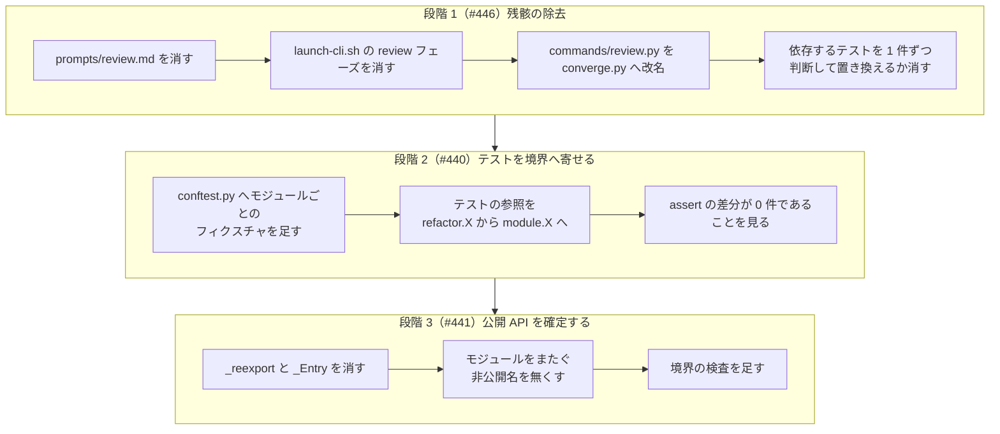

# #446 / #440 / #441: refactor_lib の構造を確定する

この文書は「どう作るか」だけを扱う。要求と受け入れ条件は次の 2 つにある。

| 課題 | 仕様 |
| --- | --- |
| #446 | [issue-446-cross-refactoring-review-remnants.md](issue-446-cross-refactoring-review-remnants.md) |
| #440 / #441 | [issue-440-441-refactor-lib-stages.md](issue-440-441-refactor-lib-stages.md) |

**3 件を 1 つの設計にまとめる。** いずれも `cross-refactoring` の同じ実装とテスト群を触り、
順序に依存がある。設計を分けると、後の段階が前の段階の結論を読み直すことになる。
**実装の Pull Request は段階ごとに 3 本へ分ける。** 段階ごとに保証するものが違う。

## 構成要素

| 要素 | 責務 | 段階 |
| --- | --- | --- |
| `commands/converge.py`（`review.py` から改名） | ラウンドの検証・取り消しの判断・修正の取り込み | 1（#446） |
| `launch-cli.sh` | 生きているフェーズだけの起動の受け口 | 1（#446） |
| `docs/03-review-viewpoints.md` | Step 7 の `cross-review` へ `--focus` で渡す観点の元 | 1（#446） |
| `tests/conftest.py` | **モジュールごとのフィクスチャ**を持つ | 2（#440） |
| `tests/test_*.py` | 対象モジュールの公開 API を通して呼ぶ | 2（#440） |
| `scripts/refactor.py` | **argparse と `main` だけ**を持つ入口 | 3（#441） |
| `tests/test_module_boundaries.py`（新設） | 依存の循環と、モジュールをまたぐ非公開名を機械で見る | 3（#441） |

## 処理の流れ

**順序を入れ替えられない。** 段階 1 を後にすると、消すテストを段階 2 で寄せ直すことになる。
段階 3 を先にすると、テストが入口経由で差し替えている 9 つの名前が届かなくなる。

## いまの構造

**#438 の分割は「テストを変えない」ことを条件に行った。** 入口が全モジュールの公開名を
自分の名前空間へ取り込むため、**外から見た名前空間は 1 つのままである**。

| 実体 | 行数 | いまの役割 |
| --- | ---: | --- |
| `scripts/refactor.py` | 244 | 入口。14 モジュールを読み、`_reexport()` で全公開名を取り込む |
| `_Entry.__setattr__` | — | 入口への差し替えを定義元のモジュールへも伝える |
| `tests/conftest.py` | 75 | `importlib` で `refactor.py` を 1 モジュールとして読む。全テストが `refactor` フィクスチャを引く |
| `scripts/refactor_lib/commands/review.py` | 436 | **持つのは `verify-round` / `should-abandon` / `abandon-items` / `merge-fix`。レビューは 1 つも無い** |
| `prompts/review.md` | 126 | レビュー CLI へ渡す指示。**読む手順が無い** |
| `launch-cli.sh` の `review` フェーズ | — | 起動の受け口。**呼び出し元が無い**（同じファイルの中の分岐だけ） |

## 決定の記録

### 1. `prompts/review.md` は消す

**結論**: 消す。

**理由**: #436 で Step 5 の判定はテストへ置き換わり、レビューは Step 7 の `cross-review` が
担う。`cross-review` は自分のプロンプトを持ち、観点は `--focus` で受け取る
（`docs/04-fix-and-report.md` の定型）。**この雛形を読む経路が無い。**

**採らなかった案**: 雛形として残す。**残すと、次に読む人が「この経路は生きている」と読む。**
観点の元は `docs/03-review-viewpoints.md` にあり、失われない。

### 2. `launch-cli.sh` の `review` フェーズは消す

**結論**: 消す。依存するテストは**1 件ずつ判断する**。

**理由**: 呼び出し元が無い。起動できないフェーズを受け口に残すと、`--phase review` が
通ってしまい、結果ファイルを待つ側が止まる。

**テストの扱い**: 「そのテストが何を確かめているか」で決める。

| そのテストが確かめていること | 扱い |
| --- | --- |
| `review` フェーズに固有の組み立て | **消す**（確かめる対象が無くなる） |
| 全フェーズに共通の組み立て（作業領域の宣言・打ち切りの単位など） | **生きているフェーズへ置き換える** |

**「テストを消す」ことの判断は、この段階で明示的に残す。** 何を担保しなくなるかを書かずに
消すと、後から「消してよかったのか」を判定できない。

### 3. `commands/review.py` は `commands/converge.py` へ改名する

**結論**: 改名する。

**理由**: 4 つのコマンドはいずれも**収束ループの判定と取り消し**であり、レビューではない。
名前が中身と違うと、読む人が「ここにレビューがある」と読む。

**名前の選び方**: `refactor_lib/rounds.py`（ラウンドの状態）と `refactor_lib/verify.py`
（検証）が既にあるため、その 2 つと重ならない語を採る。`converge` は Step 5 の収束の判定を
指し、4 つのコマンドの共通点にあたる。

**採らなかった案**: 名前を変えず、位置づけの説明だけを直す。**説明はファイルを開かないと
読めない。** 一覧に出るのは名前である。

**段階 1 で行う理由**: 段階 2 でテストがモジュールを直接読むようになると、モジュール名が
テストの中へ現れる。**後で改名すると、寄せたテストをもう一度書き換えることになる。**

### 4. `docs/03-review-viewpoints.md` は残す

**結論**: `cross-refactoring` に残す。`prompts/review.md` への言及だけを消す。

**理由**: この表は Step 7 で `cross-review` へ `--focus` として渡す観点の元である。
**渡す側が持つ。** `cross-review` へ移すと、リファクタリングに固有の観点が、あらゆる
Pull Request のレビューへ掛かる位置に置かれる。

### 5. `resolved_thread_ids` の突き合わせは残す

**結論**: 残す。名前も変えない。

**理由**: Step 7 の修正ループで、**人と `cross-review` が残したスレッド**に効く。名前は
`_resolved_fix_thread_ids` で、既に「fix」を指している。**実態と合っている。**

### 6. 段階 2 で `assert` を変えない

**結論**: 変えるのは読み込みの経路だけで、`assert` の中身は変えない。差分で 0 件を示す。

**理由**: `assert` を変えると、それは振る舞いの期待を変えている。**構造の変更と振る舞いの
変更が同じ差分に混ざると、テストが落ちたときの原因を分けられない。**

### 7. 境界の検査はテストとして置く

**結論**: `tests/test_module_boundaries.py` として置く。`scripts/check-*.py` にはしない。

**理由**: 見る対象が `cross-refactoring` の内部構造であり、リポジトリ全体の検査ではない。
テストとして置けば、既存の実行（`pytest`）でそのまま回る。**検査の起動を新しく足さない。**

**見るもの**: モジュール間の依存に循環が無いこと / モジュールをまたいで非公開名（`_` 始まり）が
渡されていないこと。

## テスト設計

| 受け入れ条件 | 何で確かめるか |
| --- | --- |
| `prompts/review.md` が無い | ファイルの不在。`launch-cli.sh` がその名前を参照しないこと |
| `review` フェーズが無い | `launch-cli.sh` に `--phase review` を渡すと弾かれること |
| 消したテストの判断が残っている | Pull Request の本文の表（テストごとに「消す/置き換える」と理由） |
| `converge.py` へ改名 | 既存のテストが通ること（入口経由の参照は段階 2 まで変わらない） |
| 本番の振る舞いが変わっていない | 既存のテストが通ること。`--baseline-test` の経路を 1 度実行する |
| テストがモジュール境界を通る（段階 2） | 各テストファイルが対象モジュールのフィクスチャを引くこと |
| `assert` が変わっていない（段階 2） | `git diff` から `assert` の行だけを抜き、変更が 0 件であること |
| 再エクスポートが無い（段階 3） | `refactor.py` に `_reexport` と `_Entry` が無いこと |
| 依存が一方向（段階 3） | `test_module_boundaries.py` |
| モジュールをまたぐ非公開名が 0 個（段階 3） | 同上 |

## 未確認のまま残ること

| 項目 | 内容 |
| --- | --- |
| 依存するテストの実数 | #446 の本文は `review` フェーズに約 5 件、スレッドの突き合わせに約 30 件としている。**着手の時点で数え直す** |
| モジュールをまたぐ非公開名の内訳 | #441 の本文は 27 個（`gitfacts` 15 / `paths` 7 / `review` 2 / `commands/apply` 2 / `commands/report` 1）としている。改名の後に数え直す |
| 段階 2 で分けるテストファイルの単位 | モジュールと 1 対 1 にするか、既存のファイルの単位を保つかは、寄せる過程で決める |
| `commands` 層どうしの横の依存 | `review` → `apply`、`setup` → `report` の 2 つ。解消の手段は段階 3 で決める |
