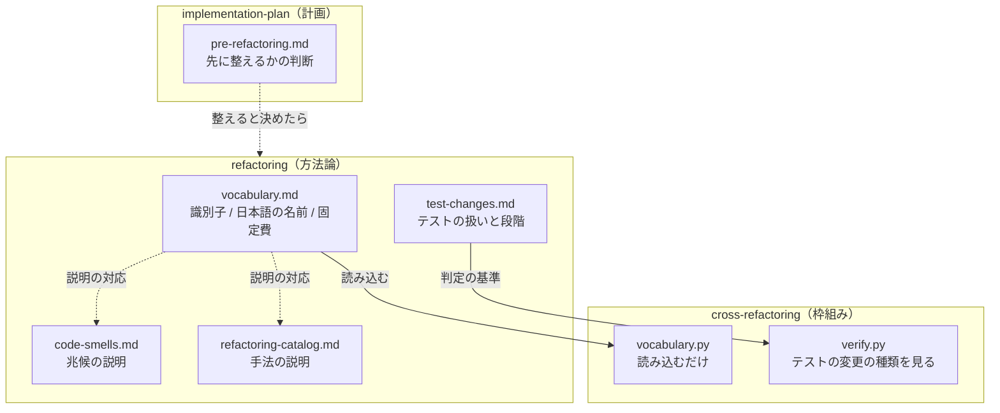

# #444 / #443 / #442: 方法論と枠組みの分離

この文書は「どう作るか」だけを扱う。要求と受け入れ条件は
[issue-443-444-442-methodology.md](issue-443-444-442-methodology.md) にある。

**3 件を 1 つの設計にまとめる。** いずれも「方法論がどこにあるか」を扱い、同じ 2 つの Skill と
工程表を触る。**実装の Pull Request は 2 本に分ける**（呼び名とテストの扱いで 1 本、工程の判断で
1 本）。

## 構成要素

| 要素 | 責務 | 課題 |
| --- | --- | --- |
| `refactoring/references/vocabulary.md`（新設） | **兆候と手法の呼び名の表**（識別子・日本語の名前・差分予算の倍率）を持つ唯一の場所 | #444 |
| `refactoring/references/test-changes.md`（新設） | テストをどこまで変えてよいかの規約と、段階の進め方 | #443 |
| `cross-refactoring/scripts/refactor_lib/vocabulary.py` | **呼び名の表を読み込む**。自分では持たない | #444 |
| `refactoring/references/code-smells.md` | 兆候の説明。**識別子の列を足す** | #444 |
| `refactoring/references/refactoring-catalog.md` | 手法の説明。**識別子の列を足す** | #444 |
| `cross-refactoring/scripts/refactor_lib/verify.py` | テストの変更の種類を見る | #443 |
| `implementation-plan/references/pre-refactoring.md`（新設） | 実装の前に構造を整えるかの判断 | #442 |
| `scripts/tests/test_vocabulary_single_source.py`（新設） | 呼び名の表が 1 か所であることを機械で確かめる | #444 |
| `scripts/check-cross-skill-refs.py` | 走査を `references` まで広げ、例外へ登録する | #444 |

## いまの構造

| 事実 | 実測（2026-09-07） |
| --- | ---: |
| `vocabulary.py` の `SMELLS` / `TECHNIQUES` | 17 個 / 18 個 |
| `code-smells.md` に現れる英識別子 | **0 個** |
| 「テストを変えてよいか」を定めた記述 | **どちらの Skill にも 0 件** |
| `refactoring` / `cross-refactoring` を載せる manifest | **4 つすべて** |

## 処理の流れ



## 決定の記録: 呼び名の表の移送（#444）

### 1. 呼び名の表は `refactoring` が持つ

**結論**: 表 3 つ（兆候 / 手法 / 手法ごとの固定費）を持つ Markdown を新設し、そこを唯一の
基準にする。`cross-refactoring` はこのファイルを読む。

**理由**: 呼び名は方法論の一部であり、`refactoring` を単独で使うときにも要る。**枠組みが
持つと、枠組みを使わない利用者から呼び名が見えない。**

**形を Markdown の表にする理由**: `refactoring` の参照は人が読む文書である。JSON を別に置くと、
人が読む表と機械が読む値の 2 つになり、片方だけが更新される。**表から読めば 1 つで済む。**

**採らなかった案**: `vocabulary.py` を今の位置に残し、一致だけを検査で固定する。**表の
置き場所が枠組みのままであり、#444 の目的を満たさない。**

### 2. `code-smells.md` と `refactoring-catalog.md` には識別子の列を足す

**結論**: 説明の表へ「識別子」の列を足す。呼び名の表そのものは `vocabulary.md` が持つ。

**理由**: 説明を読む人が、枠組みの出力（`long_method` など）と結び付けられる。**説明と呼び名を
1 つのファイルへまとめない。** 説明は言語や事例で伸びるが、呼び名は固定である。

### 3. `cross-refactoring` は、呼び名の表を `refactoring` から直に読む

**結論**: 枠組みは呼び名の表を自分で持たず、`refactoring` に置いた 1 つのファイル
（`vocabulary.md`）を読む。

**何を読むのか。** 兆候と手法の**呼び名の表**である。中身は次の 3 つで、いずれも
`cross-refactoring` が提案を集めるときに使う。

| 中身 | 例 |
| --- | --- |
| 兆候の識別子と日本語の名前（17 組） | `long_method` ｜ 長すぎるメソッド |
| 手法の識別子と日本語の名前（18 組） | `extract_method` ｜ メソッドの抽出 |
| 手法ごとの差分予算の倍率 | 抽出系の 7 手法は 3、他は 2 |

**呼び名が揃わないと重複排除が効かない。** 3 つの CLI が同じ箇所を別の名前で呼ぶと、同じ
提案が別物として残る。**単一のパスから読み、読めなければ止めるのはこのためである。**
`init` の時点で確かめ、読めなければ理由を出して終わる。

**パスは `Path(__file__)` から解決する。** 読む側（`vocabulary.py`）は
`cross-refactoring/scripts/refactor_lib/` にある。そこから `skills/` の隣へ届くのは
`../../../refactoring/`（`..` が 3 つ）である。**現在地には依存させない。**
`uv run --script` で起動したときの現在地は、スクリプトの位置と揃わない。

```python
_VOCAB = pathlib.Path(__file__).resolve().parents[3] / "refactoring" / "references" / "vocabulary.md"
```

**採らなかった案**: 共通層（`plugins/ndf/scripts/lib/`）へ置く。**方法論はプラグイン全体の
共通物ではない。** 置くと、`refactoring` を読む利用者から呼び名の表が離れる。

### 3-2. 配る先で相手が欠けないことを、検査とテストで固定する

**Skill をまたいで読むため、相手が配られない配布先があると解決できない。** 2 つで固定する。

| 手段 | 何を固定するか |
| --- | --- |
| `scripts/tests/` のテスト | 4 つの `manifests/*-skills.txt` が両方の Skill を載せていること |
| `check-cross-skill-refs.py` の例外 | この参照が意図したものであること。**増えたときに気づく** |

**いまの検査はこの参照を検出しない。** 拾う形が 2 つしかない。

| 拾う形 | 例 |
| --- | --- |
| 相対パス | `../<Skill 名>/` |
| Python のパス連結（直後が `scripts`） | `"<Skill 名>" / "scripts"` |

**`"refactoring" / "references"` はどちらにも当たらない。** 例外へ登録するだけでは、対応する
参照が無いもの（stale）として検査が落ちる。

**走査を `references` まで広げる。** **配られなければ解決できない点で `scripts` と
`references` は同じ**である。パターンを `"<Skill 名>" / "(scripts|references)"` へ広げ、
そのうえで例外へ登録する。あわせて検査の位置づけを「実行の参照」から「**配布に依存する
参照**」へ書き替える（実行するか読むかは、配る先で相手が欠けたときの結果を変えない）。

**採らなかった案**: 例外へ登録せず、配布の条件を固定するテストだけで担保する。
**参照が増えたときに気づく機構が働かない。** `check-cross-skill-refs.py` はまさにそれを
防ぐために置かれている（#285 の再発防止）。

**同じ配布の条件を持つ前例がある。** `google-drive` が `google-auth` を読む形で、4 つの
manifest がどちらも載せているため配る先で相手が欠けない。**ただし解決の方式は違う。**

| | `google-drive` → `google-auth` | この設計 |
| --- | --- | --- |
| 解決 | 環境変数 → `~/.claude/skills/` → 隣接の 3 段 | **単一のパス** |
| 相手が無いとき | 次の候補を試し、隣に無くても動く | **止める** |

**前例が候補を持つのは、資格情報の置き場所が利用者の環境で変わるためである。** 呼び名の表は
配布物の中で位置が決まるため、候補を持たせる理由が無い。

## 決定の記録: テストの扱い（#443）

### 4. テストの変更は 3 つに分けて書く

**結論**: `test-changes.md` に置く。

| 変更 | リファクタリングとして | 判定の手がかり |
| --- | --- | --- |
| 期待する振る舞いを変える | **してはいけない** | `assert` の期待値が変わる |
| 読み込みの経路を変える | **してよい** | 接頭辞・取り込み元だけが変わる |
| 内部の詳細への依存を減らす | **推奨する** | 差し替えの対象が公開 API へ寄る |

**判定の手がかりは `assert` の中身である。** #440 で実際に使った手（接頭辞を伏せた
`assert` 行の集合を前後で突き合わせる）を手順として書く。**差分から追加と削除の対を数える
形は採らない**（同じ内容の行が複数あると対応が取れない。#440 で実測）。

**この手は振る舞い不変の証明にならない。** 期待値が `assert` の行の外にあると、変えても
集合は一致する。

```python
assert price(order) == (
    270,          # ← 300 へ変えても `assert` 行は変わらない
    "JPY",
)
```

| 形 | 集合の一致で判定できるか |
| --- | --- |
| 期待値が `assert` の行にある | **できる** |
| 複数行にまたがる式 | **できない** |
| パラメータ化の値（`@pytest.mark.parametrize` の引数） | **できない** |
| フィクスチャが返す値 | **できない** |

**判定できない範囲は「未判定」として人へ回す。** 通ったものとして扱わない。`cross-refactoring`
の検証も同じで、判定できない差分は落とさず、**未判定として Pull Request のレビューへ渡す**。

### 5. 兆候の一覧へテストの問題を 3 つ足す

**結論**: テストの側の問題を表す兆候を 3 つ足す。識別子と日本語の名前は下の表で定める。

**理由**: **兆候として挙げられなければ、構造改善の対象にならない。** #438 と #440 で実際に
起きた 3 つの形である。

| 識別子 | 日本語の名前 | どう現れるか | 主な手法 |
| --- | --- | --- | --- |
| `test_coupled_to_internals` | テストが内部の詳細に依存している | 実装を変えるとテストが落ちる。差し替えの対象が非公開の名前になっている | 依存の向きを整える |
| `test_bypasses_module_boundary` | テストが 1 つの入口から全部を引く | どのモジュールが何を公開しているかがテストから読めない | 責務の移動 |
| `mock_targets_implementation_detail` | モックの対象が実装の詳細 | 差し替える名前が内部の関数で、公開 API を通っていない | 依存の向きを整える |

**主な手法は既存の一覧から採る。** 3 つのために新しい手法を足さない。テストの側の兆候でも、
直し方は本番コードと同じ（依存の向きを整える / 責務を移す）である。

**採らなかった案**: 1 つにまとめる。**直し方が違う。** 内部への依存は差し替えの対象を変え、
境界の迂回はテストの読み込み先を変え、モックの対象は設計そのものを見直す。

### 6. 段階は手順の中の注記にする（工程表の行にしない）

**結論**: `test-changes.md` に「段階を分ける」節を置く。工程表は変えない。

**理由**: v10.5.1 が「工程表の行は増やさない」と定めている。**段階は 1 つの構造改善の中の
進め方であり、開発の工程ではない。**

### 6-2. 現状固定テストは 3 つの分類の外に置く

**結論**: 現状固定テストの置き換えは、3 つの分類（振る舞いを変える / 経路を変える / 依存を
減らす）のどれにも入れない。**役目で決まる別の扱い**として書く。

**理由**: **現状固定テストは、振る舞いを固定するために一時的に置くものである。** 役目を
終えた時点で、意図を表すテストへ置き換える。このとき `assert` の期待値は変わりうるが、
それは「振る舞いを変えた」のではなく、**確かめる対象が「いまの出力」から「あるべき出力」へ
移った**ことを表す。

**置き換えを 2 つに分ける。** 現状固定テストであることは、期待出力を変えてよい理由に
ならない。

| 置き換え | 同じ入力に対する期待出力 | 扱い |
| --- | --- | --- |
| 根拠を「いまの出力」から**仕様**へ置き換える | **変わらない** | 役目を終えた置き換え。印と理由を残す |
| **期待出力そのものを変える** | **変わる** | **振る舞いの変更である。別の変更に分ける** |

**既存の規約がこれを定めている。** `refactoring/SKILL.md` は、固定テストが不具合を「正解」
として固定したときの扱いを「**不具合として別に扱う**（固定テストにコメントで印を付け、修正は
別の変更で行う）」としている。**印は、修正を同じ変更へ混ぜてよいという意味ではない。**

**印の無いテストを現状固定として扱わない。** どのテストが現状固定であるかは、
`characterization-tests.md` が定める印で分かる。

**採らなかった案**: 4 つ目の分類として足す。**分類は「変更の種類」で切っており、現状固定
テストは「テストの役目」で決まる。** 軸が違うものを同じ表へ並べると、両方に当たる変更の
扱いが決まらない。

## 決定の記録: 実装前の判断（#442）

### 7. 実装前の判断は `implementation-plan` の参照に置く

**結論**: `implementation-plan/references/pre-refactoring.md` を新設し、`SKILL.md` の
「リスクと対処」から呼ぶ。**工程表の行は増やさない。**

**理由**: 計画の中の判断として置く形は、#436 の実装計画で機能しなかった。**リスクと対処の
表が空欄のまま残り、何を書くべきかの手がかりが無かった。** 原因は置き場所ではなく、判断の
手順が無かったことである。**場所ではなく手順を足す。**

**採らなかった案**: 工程表へ行を足す。盤面へ記録する工程の値が増え、v10.5.1 の決定に反する。

### 8. 判断の基準は測れるものと測れないものに分ける

**結論**: 表で分ける。

| 測れる | 測れない（やってみないと分からない） |
| --- | --- |
| 実装が触るファイルの規模（行数） | 依存の循環 |
| タスクの集中（同じファイルを触るタスクの割合） | 責務の実際の分かれ目 |
| テストの厚み（そのファイルを覆うテストの数） | — |

**#438 では循環が 1 つ、分割して初めて分かった。** 事前に測れない基準を「測ってから決める」
形にすると、判断そのものが行われない。

### 9. 先に整えると決めたら、別の Pull Request へ分ける

**結論**: 構造を整える変更と、その上へ積む実装を、**別の Pull Request にする**。

**理由**: **振る舞いを変える変更と変えない変更が同じ差分に混ざると、レビュワーがどちらの
差分かを読み分けられない。** #438 では分割を別の課題として通し、**1 ラウンドで収束した**
（テストの差分が 0 件であることを機械で確かめられたため）。同じ変更に機能追加が混ざって
いれば、この確かめ方は使えない。

| 進め方 | 採否 | 理由 |
| --- | --- | --- |
| 別の課題として起票し、先に通す | **採用** | 振る舞いを変えない変更として、機械で確かめられる |
| 同じ Pull Request の中で先に行う | 不採用 | Pull Request は増えないが、レビューで差分を読み分けられない |

**整えないと決めたときも理由を 1 行残す。** 残っていないと、後から指摘されたときに
「判断した」のか「気づかなかった」のかを区別できない（`out-of-scope` の 3 択と同じ形）。

### 10. `legacy-refactor` とは、掛かる対象が違う

**結論**: 書き分けを表で示す。

| | `legacy-refactor`（モード） | 実装前の構造改善（判断） |
| --- | --- | --- |
| 掛かる対象 | **変更全体** | **これから触る対象の構造** |
| 決まる時点 | モード判定（変更の性質で決まる） | 計画（実装が触る先が見えてから） |
| 振る舞い | 変えない | 変えない |
| テスト | **無いか少ない**（現状固定テストを先に置く） | 有無を問わない |
| その後 | そのモードのまま進む | **別の Pull Request として先に通し、本体は元のモードで進む** |

**同じ変更が両方に当たることはない。** `legacy-refactor` は「この変更は構造改善である」と
判定した状態で、実装前の構造改善は「この変更は実装だが、その前に整える別の変更を挟む」
判断である。**#438 は `standard` だった**（テストが十分にあり、振る舞いを変えない構造変更で
あるため）。**先に整える変更は、それ自体が独立したモード判定を持つ。**

## テスト設計

| 受け入れ条件 | 何で確かめるか |
| --- | --- |
| 1 / 4（呼び名の表を `refactoring` が持ち、経路が 1 つ） | `vocabulary.py` が `vocabulary.md` を読むこと。読めなければ止まること |
| 2（一致の検査） | `scripts/tests/test_vocabulary_single_source.py`。`vocabulary.md` の表と `SMELLS` / `TECHNIQUES` が一致すること |
| 3（固定費） | `vocabulary.md` の表に手法ごとの倍率があること。`verify.py` がそれを使うこと |
| 5（振る舞いが変わらない） | `cross-refactoring` の既存のテストが通る |
| 6（検査と全体テスト） | 検査 8 本と `uv run --with pytest pytest scripts/tests plugins/ndf -q` を実行し、終了コードを証跡へ残す（`quality-gates`） |
| 7 / 8 / 10 / 12（テストの扱い） | `test-changes.md` の記述。`markdown-writing` のセルフチェック |
| 9（兆候の一覧） | 一致の検査に 3 つが含まれること |
| 11（検証が種類を見る） | `verify.py` のテスト。期待値が変わった差分を落とすこと |
| 12（現状固定テストとの関係） | `test-changes.md` の記述。印の無いテストを現状固定として扱わないこと |
| 13 / 14 / 17 / 18（実装前の判断） | `pre-refactoring.md` の記述。`implementation-plan/SKILL.md` からの呼び出し |
| 15（先に整えるときの進め方） | `pre-refactoring.md` に、別の Pull Request へ分けることと理由がある |
| 16（`legacy-refactor` との書き分け） | `pre-refactoring.md` の表。`development-workflow/references/workflow-modes.md` からの参照 |
| 配布の条件 | 4 つの manifest が両方を載せることを固定するテスト |
| 検査の走査 | `check-cross-skill-refs.py` が `"<Skill 名>" / "references"` の形を拾うこと。既存のテストへ追加する |

## 未確認のまま残ること

| 項目 | 内容 |
| --- | --- |
| 表の読み取りの形 | Markdown の表を解析する。列の並びが変わると壊れるため、**見出しの名前で列を決める**か位置で決めるかは実装時に決める |
| `verify.py` がテストの変更を判定できる範囲 | `assert` の差分は取れるが、**同じ内容の行が複数ある場合の対応**は #440 と同じ問題を持つ。判定できないときの扱い（申告か人へ回すか）を実装時に決める |
| 固定費の値 | 現在は抽出系 7 手法が倍率 3、他が 2。**移送で値は変えない** |
| `refactoring/SKILL.md` の分量 | 160 行。参照を 2 つ足すため、本文からどこまで移すかは実装時に決める |
