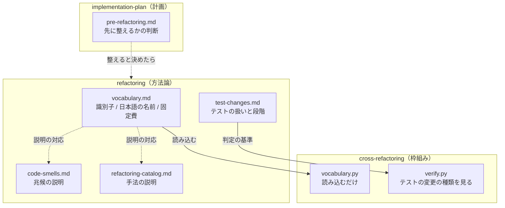

# #444 / #443 / #442: 方法論と枠組みの分離

この文書は「どう作るか」だけを扱う。要求と受け入れ条件は
[issue-443-444-442-methodology.md](issue-443-444-442-methodology.md) にある。

**3 件を 1 つの設計にまとめる。** いずれも「方法論がどこにあるか」を扱い、同じ 2 つの Skill と
工程表を触る。**実装の Pull Request は 2 本に分ける**（語彙とテストの扱いで 1 本、工程の判断で
1 本）。

## 構成要素

| 要素 | 責務 | 課題 |
| --- | --- | --- |
| `refactoring/references/vocabulary.md`（新設） | **兆候と手法の語彙**（識別子・日本語の名前・固定費）を持つ唯一の場所 | #444 |
| `refactoring/references/test-changes.md`（新設） | テストをどこまで変えてよいかの規約と、段階の進め方 | #443 |
| `cross-refactoring/scripts/refactor_lib/vocabulary.py` | **語彙を読み込む**。自分では持たない | #444 |
| `refactoring/references/code-smells.md` | 兆候の説明。**識別子の列を足す** | #444 |
| `refactoring/references/refactoring-catalog.md` | 手法の説明。**識別子の列を足す** | #444 |
| `cross-refactoring/scripts/refactor_lib/verify.py` | テストの変更の種類を見る | #443 |
| `implementation-plan/references/pre-refactoring.md`（新設） | 実装の前に構造を整えるかの判断 | #442 |
| `scripts/tests/test_vocabulary_single_source.py`（新設） | 語彙が 1 か所であることを機械で確かめる | #444 |

## 処理の流れ

## いまの構造

| 事実 | 実測（2026-09-07） |
| --- | ---: |
| `vocabulary.py` の `SMELLS` / `TECHNIQUES` | 17 個 / 18 個 |
| `code-smells.md` に現れる英識別子 | **0 個** |
| 「テストを変えてよいか」を定めた記述 | **どちらの Skill にも 0 件** |
| `refactoring` / `cross-refactoring` を載せる manifest | **4 つすべて** |

## 決定の記録

### 1. 語彙は `refactoring/references/vocabulary.md` が持つ

**結論**: 表 3 つ（兆候 / 手法 / 手法ごとの固定費）を持つ Markdown を新設し、そこを唯一の
基準にする。`cross-refactoring` はこのファイルを読む。

**理由**: 方法論の語彙であり、`refactoring` を単独で使うときにも要る。**枠組みが持つと、
枠組みを使わない利用者から語彙が見えない。**

**形を Markdown の表にする理由**: `refactoring` の参照は人が読む文書である。JSON を別に置くと、
人が読む表と機械が読む値の 2 つになり、片方だけが更新される。**表から読めば 1 つで済む。**

**採らなかった案**: `vocabulary.py` を今の位置に残し、一致だけを検査で固定する。**語彙の
置き場所が枠組みのままであり、#444 の目的を満たさない。**

### 2. `code-smells.md` と `refactoring-catalog.md` には識別子の列を足す

**結論**: 説明の表へ「識別子」の列を足す。語彙そのものは `vocabulary.md` が持つ。

**理由**: 説明を読む人が、枠組みの出力（`long_method` など）と結び付けられる。**説明と語彙を
1 つのファイルへまとめない。** 説明は言語や事例で伸びるが、語彙は固定である。

### 3. `cross-refactoring` は Skill の境界をまたいで読む

**結論**: `vocabulary.py` が `../../refactoring/references/vocabulary.md` を読む。
**`check-cross-skill-refs.py` の例外へ入れ、4 つの manifest がどちらも載せていることを
テストで固定する。**

**理由**: `google-drive` が `google-auth` を読む前例と同じ形である。**配る先で相手が欠ける
ことが起きない**ことを、テストが固定する。

**読めないときの振る舞い**: **止める。** 語彙は提案の重複排除の鍵であり、欠けたまま進むと
同じ提案が別物として残る。`init` の時点で確かめ、読めなければ理由を出して終わる。

**採らなかった案**: 共通層（`plugins/ndf/scripts/lib/`）へ置く。**方法論はプラグイン全体の
共通物ではない。** 置くと、`refactoring` を読む利用者から語彙が離れる。

### 4. テストの変更は 3 つに分けて書く

**結論**: `test-changes.md` に置く。

| 変更 | リファクタリングとして | 判定の手がかり |
| --- | --- | --- |
| 期待する振る舞いを変える | **してはいけない** | `assert` の期待値が変わる |
| 読み込みの経路を変える | **してよい** | 接頭辞・取り込み元だけが変わる |
| 内部の詳細への依存を減らす | **推奨する** | 差し替えの対象が公開 API へ寄る |

**判定は `assert` の中身で行う。** #440 で実際に使った手（接頭辞を伏せた `assert` 行の集合を
前後で突き合わせる）を手順として書く。**差分から追加と削除の対を数える形は採らない**（同じ
内容の行が複数あると対応が取れない。#440 で実測）。

### 5. 兆候の語彙へテストの問題を 3 つ足す

**結論**: `test_coupled_to_internals` / `test_bypasses_module_boundary` /
`mock_targets_implementation_detail` を足す。

**理由**: **兆候として挙げられなければ、構造改善の対象にならない。** #438 と #440 で実際に
起きた 3 つの形である。

**採らなかった案**: 1 つにまとめる。**直し方が違う。** 内部への依存は差し替えの対象を変え、
境界の迂回はテストの読み込み先を変え、モックの対象は設計そのものを見直す。

### 6. 段階は手順の中の注記にする（工程表の行にしない）

**結論**: `test-changes.md` に「段階を分ける」節を置く。工程表は変えない。

**理由**: v10.5.1 が「工程表の行は増やさない」と定めている。**段階は 1 つの構造改善の中の
進め方であり、開発の工程ではない。**

### 7. 実装前の判断は `implementation-plan` の参照に置く（#442 の案 C）

**結論**: `implementation-plan/references/pre-refactoring.md` を新設し、`SKILL.md` の
「リスクと対処」から呼ぶ。**工程表の行は増やさない。**

**理由**: #442 の本文は 3 案を挙げ、**案 B（計画の中の判断）は #436 の実装計画で失敗した
形**だと記録している。失敗の中身は「リスクと対処の表が空欄で、何を書くべきかの手がかりが無かった」ことで
あり、**判断の手順が無かったことが原因である。** 場所ではなく手順を足す。

**採らなかった案**: 工程表へ行を足す（案 A）。盤面へ記録する工程の値が増え、v10.5.1 の決定に
反する。

### 8. 判断の基準は測れるものと測れないものに分ける

**結論**: 表で分ける。

| 測れる | 測れない（やってみないと分からない） |
| --- | --- |
| 実装が触るファイルの規模（行数） | 依存の循環 |
| タスクの集中（同じファイルを触るタスクの割合） | 責務の実際の分かれ目 |
| テストの厚み（そのファイルを覆うテストの数） | — |

**#438 では循環が 1 つ、分割して初めて分かった。** 事前に測れない基準を「測ってから決める」
形にすると、判断そのものが行われない。

## テスト設計

| 受け入れ条件 | 何で確かめるか |
| --- | --- |
| 1 / 4（語彙を `refactoring` が持ち、経路が 1 つ） | `vocabulary.py` が `vocabulary.md` を読むこと。読めなければ止まること |
| 2（一致の検査） | `scripts/tests/test_vocabulary_single_source.py`。`vocabulary.md` の表と `SMELLS` / `TECHNIQUES` が一致すること |
| 3（固定費） | `vocabulary.md` の表に手法ごとの倍率があること。`verify.py` がそれを使うこと |
| 5（振る舞いが変わらない） | `cross-refactoring` の既存のテストが通る |
| 7 / 8 / 10 / 12（テストの扱い） | `test-changes.md` の記述。`markdown-writing` のセルフチェック |
| 9（兆候の語彙） | 一致の検査に 3 つが含まれること |
| 11（検証が種類を見る） | `verify.py` のテスト。期待値が変わった差分を落とすこと |
| 13〜18（実装前の判断） | `pre-refactoring.md` の記述。`implementation-plan/SKILL.md` からの呼び出し |
| 配布の条件 | 4 つの manifest が両方を載せることを固定するテスト |

## 未確認のまま残ること

| 項目 | 内容 |
| --- | --- |
| 表の読み取りの形 | Markdown の表を解析する。列の並びが変わると壊れるため、**見出しの名前で列を決める**か位置で決めるかは実装時に決める |
| `verify.py` がテストの変更を判定できる範囲 | `assert` の差分は取れるが、**同じ内容の行が複数ある場合の対応**は #440 と同じ問題を持つ。判定できないときの扱い（申告か人へ回すか）を実装時に決める |
| 固定費の値 | 現在は抽出系 7 手法が倍率 3、他が 2。**移送で値は変えない** |
| `refactoring/SKILL.md` の分量 | 160 行。参照を 2 つ足すため、本文からどこまで移すかは実装時に決める |
