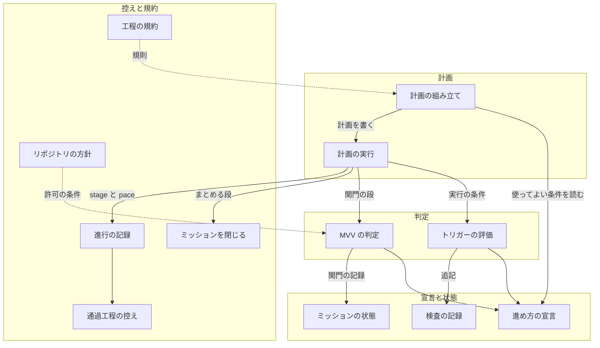
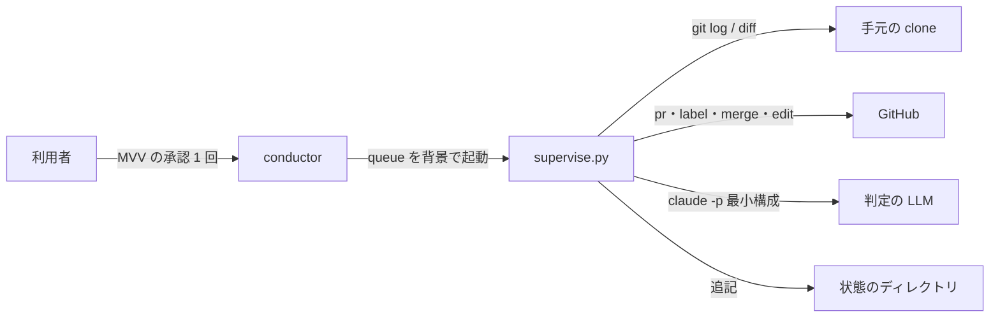
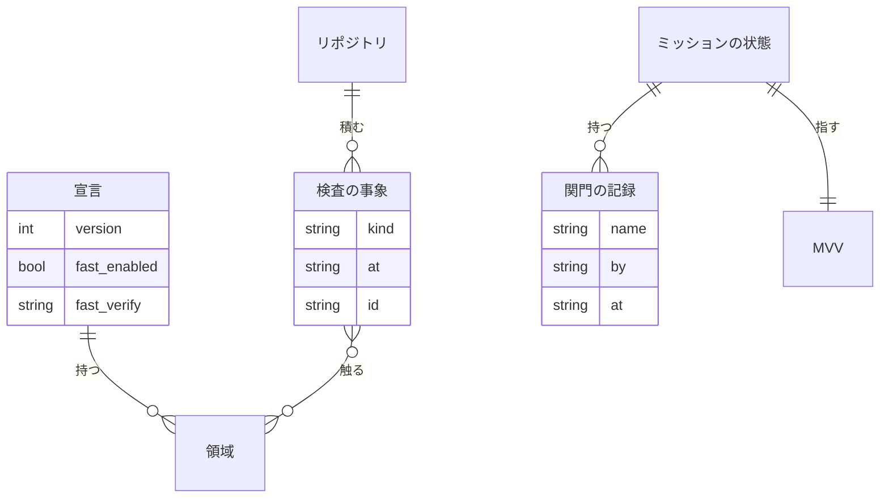

# #1078: 進め方の選択肢 `pace: fast` を足す

要求と受け入れ条件は #1078 の本文にある。この文書は「どう作るか」だけを扱う。設計は 3 本に
分けた。

| ファイル | 持つ節 |
| --- | --- |
| この文書 | 具体例・機能一覧・進め方の区分・構成要素・当てはまらない既存の規則・データ構造 |
| [issue-1078-pace-fast-flow.md](issue-1078-pace-fast-flow.md) | 入出力の契約・処理の流れ |
| [issue-1078-pace-fast-decisions.md](issue-1078-pace-fast-decisions.md) | 決定の記録・テスト設計・未確認のまま残ること |

**仕様のファイルが無いため、省いた成果物はここに書く。** クラス図とオブジェクト図は作らない。
触るのは関数と JSON だけで、型を持たないためである。画面と API の仕様記述（OpenAPI）も作らない。
呼び出される約束はコマンドだけであり、その形は `interface-api.md` のコマンドの表で書く。

## 具体例: マイルストーン 26 の 2026-09-25 の区間を `pace: fast` で回すと

この区間では、配布を除く Pull Request 41 本を develop へマージした（#1078 の集計の時点）。検査は Pull Request
ごとに通していない。確定仕様化と振り返りは課題ごとに行わず、後で棚卸しを 55 件まとめて行った。
同じ区間を `pace: fast` で回すと、次の 4 点が変わる。

| 何が | 今 | `pace: fast` |
| --- | --- | --- |
| 構造改善と実装レビュー | 通すかどうかを conductor がその場で決めていた | `check-trigger.py eval` が点数（15 点）・変更量（5,000 行）・逃げた不具合の重なり・期限（24 時間）を見て、立ったときだけ次の開発版の前に検査の計画 1 本が入る。この区間なら約 4 回 |
| 関門 1・関門 2 | 本番 8 回のたびに利用者が承認した | 利用者が承認するのはミッションの開始時に MVV を 1 回だけ。各回は `mvv-gate.py` が「従う」と判定すれば省く |
| 確定仕様化・受け入れ条件の確認・振り返り | 省いたまま残り、棚卸しで一括して閉じた | `supervise.py new close` が組む計画が、ミッションの終わりに 1 回ずつ流す |
| 工程の飛ばしの案内 | 確定仕様化と振り返りを「記録なし」と出す | 「まとめる」「トリガー」として別の行に出し、記録を求めない |

## 機能一覧

| # | 機能 | 誰が使うか |
| --- | --- | --- |
| F1 | ミッションに進め方 `fast` を指定する。使ってよい条件を満たさなければ、指定を断る | conductor |
| F2 | 工程ごとに、その場で通す・まとめる・トリガーで通す・省かないのどれに当たるかを表 1 枚で読む | conductor・利用者 |
| F3 | 検査のトリガーを評価し、立っていれば次の開発版の前に検査の計画を流す | `supervise.py queue`（conductor が起動する） |
| F4 | 前回の検査からの差分に、構造改善と実装レビューを 1 回ずつ通す | 検査の計画 |
| F5 | その場で直した不具合を「逃げた不具合」として記録する | 実装の計画 |
| F6 | 関門 1・関門 2 の材料が MVV に従うかを判定し、従えば関門を省く。従わなければ利用者の承認へ戻す | 設計の計画・本番の計画 |
| F7 | MVV を承認する（ミッションで 1 回） | 利用者（conductor が承認を求める） |
| F8 | ミッションの終わりに、最終の検査・確定仕様化・受け入れ条件の確認と閉じる作業・振り返りを 1 回ずつ流す | conductor |
| F9 | 検査の回数・指摘の件数・検査の後に逃げた不具合の件数を集計し、閾値の見直しに使う | 利用者・振り返り |

## 進め方の区分（SKILL.md に置く表の中身）

**`pace` はモードとは別の軸である。** モードは「変更が何か」で決まり、`pace` は「どう通すか」を
決める。**既定は `normal` で、今の工程表のとおりに動く。** `fast` を指定したときだけ、各工程が
次の区分のどれかに分かれる。モードが「対象外」とする工程は、`fast` でも対象外のままにする。

| 区分 | 工程表の行 | いつ通すか |
| --- | --- | --- |
| その場で通す | 作業場所の用意 / 計画 / 実装 / 完了判定 / Pull Request / 後片付け / 配布 / リリース後テスト | 課題ごと。実装の計画が、限ったテスト → Draft の Pull Request（CI と並べる）→ 全体テスト → doc-lint → マージまでを通す。配布は開発版と verify-install まで。本番は関門 2 の扱い（下の表）に従う |
| トリガーで通す | 構造改善 / 実装レビュー | トリガーが立ったときに、次の開発版の前に 1 回。範囲は前回の検査からの差分 |
| ミッションの終わりにまとめる | 確定仕様化 / 振り返り（あわせて、受け入れ条件の確認と課題を閉じる作業） | ミッションの終わりに 1 回ずつ |
| 省かない | 要求と受け入れ条件 / 設計 / ドキュメント再構成 / ドキュメントレビュー | モードの定めどおり。設計の承認が要る変更は設計 Pull Request を出す。200 行以内の不具合はその場で直す |

| 関門 | `normal` | `fast` |
| --- | --- | --- |
| 関門 1（設計 Pull Request のマージ） | 利用者が承認する | `mvv-gate.py` が「従う」と判定し、越えない線に当たらなければ省く。それ以外は利用者が承認する |
| 関門 2（本番の系へ届く操作） | 利用者が承認する | 同上 |

### 使ってよい条件

**`new mission --pace fast` が機械で確かめる。1 つでも欠ければ `stopped` で断り、conductor は
`normal` で進める。**

| 条件 | 確かめ方 |
| --- | --- |
| 開発版のチャネルがある | `.ndf/worktree.json` の `base_branch` が `production_branch`（無ければ既定ブランチ）と違う |
| 導入の確認がある | `.ndf/pace.json` の `fast.verify` にコマンドが書かれている |
| リポジトリが許している | `.ndf/pace.json` の `fast.enabled` が `true` |
| モードが対象に入る | `--mode` が `fast.modes`（既定 `light` / `standard` / `legacy-refactor`）に入る。`operation` と `documentation` は入れられない |

### MVV に関わらず関門を省かない変更

**次のどれかに当たれば、判定が「従う」でも利用者の承認を求める。** 判定は機械の検査を先に行い、
LLM の判定は後に回す。

| 種類 | 機械で見る所 | LLM で見る所 |
| --- | --- | --- |
| 秘密（トークン・鍵・認証情報） | `.ndf/pace.json` の `boundary_paths` に当たるファイルを変えた | `boundary` 欄 |
| 認証・認可 | 同上 | 同上 |
| 利用者のデータ（読み出し・書き換え・移行） | 同上 | 同上 |
| 戻せない操作（履歴の書き換え・強制 push・データの削除。本番の配布の定型の手順が打つマージとタグは含めない） | — | 同上 |
| 他のリポジトリへの公開 | — | 同上 |
| `operation` / `documentation` のモード | 計画の `モード` | — |
| MVV が承認されていない、または承認の後に変わった | ミッションの状態の `mvv.sha256` と承認の記録の `sha256` | — |

## 構成要素

| 要素 | 責務 | 新設 / 変更 |
| --- | --- | --- |
| 進め方の宣言（`.ndf/pace.json`） | `fast` を許すか、導入の確認のコマンド、領域と共通層、越えない線のパス、トリガーの閾値を持つ | 新設 |
| トリガーの評価（`plugins/ndf/scripts/check-trigger.py`） | 前回の検査からの差分を git から数えてトリガーを判定する。検査の範囲の用意・後始末と、検査と逃げた不具合の記録を持つ | 新設 |
| 検査の記録（状態のディレクトリの `checks/<所有者>__<リポジトリ>.jsonl`） | 評価・検査・逃げた不具合の事象を追記だけで残す | 新設 |
| MVV の判定（`plugins/ndf/scripts/mvv-gate.py`） | 試行の置き場から本体へ移す。MVV が承認済みかを確かめ、越えない線を機械で見てから LLM に判定させる。結果をミッションの状態へ書く | 移動・変更 |
| 計画の組み立て（`supervise.py` の `new`） | `new mission --pace fast`・`new check --since-last`・`new close`・`new release --mvv`・`new impl --escape-of` の計画を組む | 変更 |
| 計画の実行（`supervise.py` の `run` / `queue`） | 計画の「実行の条件」を作業ツリーより先に評価して、当たらなければ飛ばす。`--then` を段として順に流す。段の `gate_as_ok` で関門を成功として扱う | 変更 |
| ミッションの状態（`mission-state.py`） | `pace`・MVV のファイルとハッシュ・関門の記録（誰が通したか・判定・理由）を持つ | 変更 |
| ミッションを閉じる（`mission-close.py`） | 閉じる課題を `--issues` でも受け取る（`fast` の実装 Pull Request は閉じる語を持たない） | 変更 |
| 通過工程の控え（`stage-check.sh` と `lib/workflow-common.sh`） | `pace` を記録し、報告と Pull Request の作成時の案内で「トリガー」「まとめる」の工程を記録なしに数えない | 変更 |
| 進行の記録（`projects-sync.sh` / `progress-record.sh`） | キー `pace` を受け、課題の本文の見出し行へ `進め方: fast` を書く | 変更 |
| 工程の規約（`development-workflow` の SKILL.md と参照） | 進め方の区分の表 1 枚と、判定の出力の `pace:` の行を持つ。`fast` に当てはまらない既存の規則を直す（下の「当てはまらない既存の規則」） | 変更 |
| リポジトリの方針（`AGENTS.md`） | MVV の承認を関門 1・2 の許可として扱う条件を書く | 変更 |



**図に含めない要素はない。** 工程の規約とリポジトリの方針は実行されないため、点線で「規則を与える」
関係だけを描く。

### 文脈と配置



**動く場所は今と変わらない。** どれも conductor の端末の上で、`supervise.py` の子プロセスとして
動く。外へ出るのは GitHub への操作と `claude -p` の 2 つだけである。**トリガーの評価は通信しない**
（git の履歴だけを読む）。

### 置き場所

```text
.ndf/pace.json                                      # 新設（宣言）
plugins/ndf/scripts/
├── check-trigger.py                                # 新設
├── mvv-gate.py                                     # experimental/ から移す
├── experimental/mvv-gate.py                        # 消す
├── supervise.py                                    # 変更
├── mission-state.py                                # 変更
├── mission-close.py                                # 変更
├── projects-sync.sh / progress-record.sh           # 変更
└── tests/test_check_trigger.py / test_mvv_gate.py  # 新設（後者は試行の試験があれば移す）
plugins/ndf/skills/development-workflow/
├── SKILL.md                                        # 変更（表 1 枚・出力の行・規則）
├── references/pace.md                              # 新設（宣言の形・トリガーの詳細・記録の読み方）
├── references/stage-completeness.md                # 変更（SKILL.md から移す節を受ける）
├── references/parallel-work.md / agent-layers.md / relay.md  # 変更
└── scripts/stage-check.sh / lib/workflow-common.sh           # 変更
plugins/ndf/skills/release/SKILL.md                 # 変更（本番の承認の扱い）
AGENTS.md / docs/ndf-experiments.md                 # 変更
```

**SKILL.md は今ちょうど 500 行で、上限に達している。** 進め方の節（表 2 枚と使ってよい条件への
参照で約 30 行）を入れるために、「範囲外の課題を見つけたとき」（約 17 行）と「工程の飛ばしと
マージを機械で見る」の本文（約 20 行）を参照へ移し、SKILL.md には 2 行ずつの案内だけを残す。前者の
移し先は `out-of-scope` の SKILL.md、後者の移し先は `references/stage-completeness.md` である。

## 当てはまらない既存の規則

**`pace` の値の集合に `fast` を足すため、「工程は Pull Request ごと、またはミッションで 1 回
通す」「関門は毎回利用者が承認する」ことを前提にした規則を集めて判定した。** 当てはまらない
ものだけを載せる。直す先はすべて上の構成要素の表に含まれる。

| 規則の場所 | 今の規則 | `fast` での扱い |
| --- | --- | --- |
| SKILL.md「判定する単位」 | モードを判定する単位はミッションの develop 宛て Pull Request | `fast` では実装の Pull Request が develop へ直接入るため、単位は実装の Pull Request 1 本になる |
| SKILL.md「モードごとに起動する Skill」の下の段落 | 構造改善・実装レビュー・完了判定はミッションの develop 宛て Pull Request で 1 回通す | 完了判定は課題ごと、構造改善と実装レビューはトリガーの範囲で通す |
| SKILL.md「構造改善と実装レビューは、通す工程であって任意ではない」 | Pull Request ごと、またはミッションで通す | 「通す」はそのまま。時機だけをトリガーへ移す（省くのではない） |
| SKILL.md「自走で工程を通す」と「人手の承認を求める関門」 | 2 つの関門の前で必ず止まる | `fast` では MVV の判定が「従う」なら止まらない。関門の数（2 つ）は変えない |
| `references/parallel-work.md`「工程が動く単位」 | 構造改善・実装レビュー・完了判定はミッション単位 | `fast` の列を足す（構造改善・実装レビューはトリガーの範囲、完了判定は課題） |
| `references/agent-layers.md` のフェーズの表 | 検査のフェーズはミッションで 1 回、関門 1 は conductor が承認を取る | `fast` の組み方の行を足す（検査はトリガーごと、関門は MVV の判定が返したときだけ） |
| `references/relay.md` の `mission-state.py init` と `gate` | 関門の承認は利用者の承認だけを記録する | `--pace` と `--mvv` を渡す。関門の記録は `mvv-gate.py` も書く |
| `references/stage-completeness.md` の報告と Pull Request の作成時の案内 | 記録の無い必須の工程をすべて「記録なし」と出す | `fast` の「トリガー」「まとめる」の工程は別の行に出す |
| `release` の SKILL.md「本番への配布は承認を得るまで進めない」 | 承認は利用者だけが与える | `fast` では MVV の判定の記録も承認として扱う（条件は `AGENTS.md`） |
| `supervise.py` の `RULE_RELEASE_PROD` | 「利用者は関門 2 を承認した」と judge に渡す | `fast` では「関門 2 は利用者か MVV の判定が承認した」に変える |
| 設計 Pull Request のマージの拒否（`design-approved`） | ラベルは利用者の承認を表す | `fast` では MVV の判定が通したときに計画がラベルを付け、判定の記録をコメントに残す |
| `AGENTS.md`「ユーザーの許可なく PR を承認しない」 | 許可は都度の許可 | MVV の承認を関門 1・2 の許可として扱う条件を足す。レビューの approve（`gh pr review --approve`）は `fast` でもしない |
| `mission-close.py` | 閉じる課題は Pull Request の閉じる語から集める | 実装の Pull Request は閉じる語を持たないため、`--issues` で受け取る |

**当てはまった規則（記録しない）の例:** 実装 Pull Request のマージは関門にならない。開発版の
チャネルへのマージは承認を求めない。範囲外の課題はその場で起票する。どれも `fast` にそのまま当たる。

## データ構造

### ER 図



### 進め方の宣言（`.ndf/pace.json`）

リポジトリに置く（利用者が変える設定であり、レビューを通す）。

```json
{
  "version": 1,
  "fast": {"enabled": true, "modes": ["light", "standard", "legacy-refactor"],
           "verify": "python3 plugins/ndf/scripts/release-verification-steps.py verify-install --ref develop --runtimes claude,codex,kiro"},
  "areas": [
    {"name": "駆動", "common": true,
     "paths": ["plugins/ndf/scripts/supervise.py", "plugins/ndf/scripts/mission-state.py", "plugins/ndf/scripts/relay.py",
               "plugins/ndf/skills/*/scripts/drive.py"]},
    {"name": "共通の部品と結果の契約", "common": true, "paths": ["plugins/ndf/scripts/lib/**"]},
    {"name": "hook", "common": true, "paths": ["plugins/ndf/hooks/**", "plugins/ndf/scripts/*-guard.sh"]},
    {"name": "配布の手順", "common": true,
     "paths": ["plugins/ndf/scripts/release-steps.py", "plugins/ndf/scripts/release-verification-steps.py",
               "plugins/ndf/scripts/merged-steps.py", "scripts/build-runtime-plugins.sh"]}
  ],
  "boundary_paths": ["plugins/ndf/scripts/lib/auth.py", "plugins/ndf/scripts/lib/git-credential.sh",
                     "plugins/ndf/skills/google-auth/**", ".github/workflows/**", "**/.env*"],
  "triggers": {"score": 15, "common_weight": 2, "lines": 5000, "escapes": 2, "hours": 24}
}
```

| 項目 | 型 | 空・無いとき | 意味 |
| --- | --- | --- | --- |
| `fast.enabled` | bool | 無ければ偽 | `fast` を許すか |
| `fast.modes` | 文字列の配列 | 無ければ既定の 3 つ | `fast` を使ってよいモード。`operation` / `documentation` は書いても無視する |
| `fast.verify` | 文字列 | 無ければ `fast` を断る | 導入の確認のコマンド |
| `areas[].name` | 文字列 | 許さない | 領域の名前。逃げた不具合の重なりはこの単位で数える |
| `areas[].common` | bool | 無ければ偽 | 共通層か。触った Pull Request は `common_weight` 点になる |
| `areas[].paths` | glob の配列 | 許さない | `fnmatch` で照らす。`**` は区切りをまたぐ |
| `boundary_paths` | glob の配列 | 空なら機械の検査は無し | 越えない線に当たるファイル |
| `triggers.*` | 数 | 無ければ上の初期値 | トリガーの閾値 |

**どの領域にも当たらないファイルは、パスの先頭 3 段（例 `plugins/ndf/skills`）を領域の名前にする。**
宣言に書かない場所でも、重なりを数えられるようにするためである。

### 検査の記録（`checks/<所有者>__<リポジトリ>.jsonl`）

置き場所は通過工程の控えと同じ順で決める（`${CLAUDE_PLUGIN_DATA}` → `${XDG_STATE_HOME:-~/.local/state}/ndf`
→ `${TMPDIR:-/tmp}/ndf-`）。**事象を追記するだけで、既にある行を書き換えない。** 1 行 1 つの JSON である。

| 列 | 型 | 空を許すか | 意味 |
| --- | --- | --- | --- |
| `kind` | `eval` / `check` / `escape` | 許さない | 事象の種類 |
| `at` | ISO 8601（UTC） | 許さない | 記録した時刻 |
| `id` | 文字列 | `escape` では空 | 検査の名前（`<ミッション>-<連番>`）。`eval` は評価した計画の名前 |
| `from` / `to` | コミットの SHA | `escape` では空 | 範囲。`to` は評価した時点の `origin/<base_branch>` |
| `fired` | 文字列の配列 | `eval` だけ。空は「立っていない」 | 立ったトリガー（`score` / `lines` / `escapes` / `hours` / `final`） |
| `metrics` | オブジェクト | `eval` と `check` | `prs`・`score`・`lines`・`hours`・`escapes`（範囲の中で数えた値） |
| `pr` | 数 | `eval` では空 | `check` は検査の Pull Request、`escape` は直した Pull Request |
| `of` | 数 | `escape` だけ | 不具合を持ち込んだ Pull Request。**分からなければ 0（「不明」）であり、「無し」ではない** |
| `areas` | 文字列の配列 | `escape` だけ | 直した Pull Request が触った領域 |
| `result` | `merged` / `no_change` / `failed` | `check` だけ | 検査の終わり方 |
| `findings` | オブジェクト | `check` だけ | 構造改善の `applied`・`reverted`、実装レビューの `findings`・`unresolved`（計画の `state.json` の `counts` から写す） |

**前回の検査は、`result` が `merged` か `no_change` の `check` の最新の行である。** その `to` が次の
範囲の `from` になり、`at` が期限の起点になる。**行が無ければ、最新の正式版のタグ（`ndf--v*` の
版の順で最大）のコミットと、そのタグの日時を使う。**

### ミッションの状態（`mission-state.py` のファイル）に足す項目

| 項目 | 型 | 空・無いとき | 意味 |
| --- | --- | --- | --- |
| `pace` | `normal` / `fast` | 無ければ `normal` | ミッションの進め方 |
| `mvv.path` | 文字列 | `fast` では許さない | MVV のファイル（マイルストーンの説明から `## Mission` 〜 `## Value` の節を写したもの） |
| `mvv.sha256` | 文字列 | 同上 | 初期化した時点の MVV のハッシュ |
| `gates[].by` | `user` / `mvv` | 無ければ `user`（今の記録） | 誰が関門を通したか |
| `gates[].sha256` | 文字列 | `name` が `MVV` のときだけ | 利用者が承認した MVV のハッシュ |
| `gates[].verdict` / `reasons` / `log` | 文字列 / 配列 / 文字列 | `by` が `mvv` のときだけ | 判定・理由・`mvv-gate.jsonl` のパス |

**関門の記録は名前ごとに置き換える今の扱いを変えない**（同じ関門の最後の通過が残る）。判定の
履歴は `mvv-gate.jsonl` が事象として持つため、ここで失ってよい。

### 通過工程の控えと進行の記録

控えの JSON に `.pace`（`normal` / `fast`）を足す。**`version` は 1 のままにする**（足すだけで、
無ければ `normal` と読む）。課題の本文の見出し行は `モード: standard / 進め方: fast / 作業ツリー: ...`
の形にする（`進め方` は `fast` のときだけ書く）。

### CRUD 図

| 機能 | 宣言 | 検査の記録 | ミッションの状態 | 控え |
| --- | --- | --- | --- | --- |
| F1 進め方を指定する | R | — | C（`pace`・`mvv`） | C（`pace`） |
| F3 トリガーを評価する | R | C（`eval`）・R | — | — |
| F4 検査を通す | R | C（`check`）・R | — | C（stage） |
| F5 逃げた不具合を記録する | R | C（`escape`） | — | — |
| F6 MVV で関門を判定する | R | — | R・U（`gates`） | — |
| F7 MVV を承認する | — | — | U（`gates` の `MVV`） | — |
| F8 ミッションの終わりに流す | R | R | R | C（stage） |
| F9 集計する | — | R | R | — |
