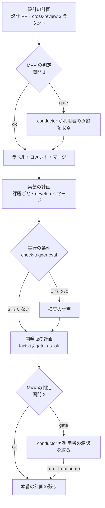
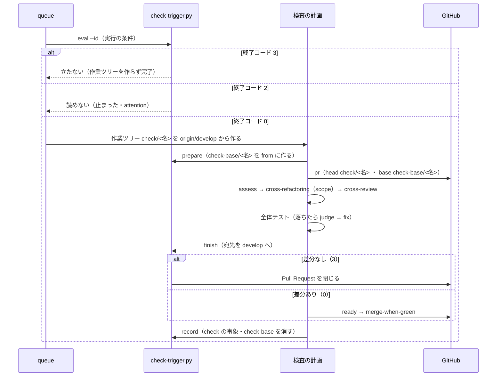
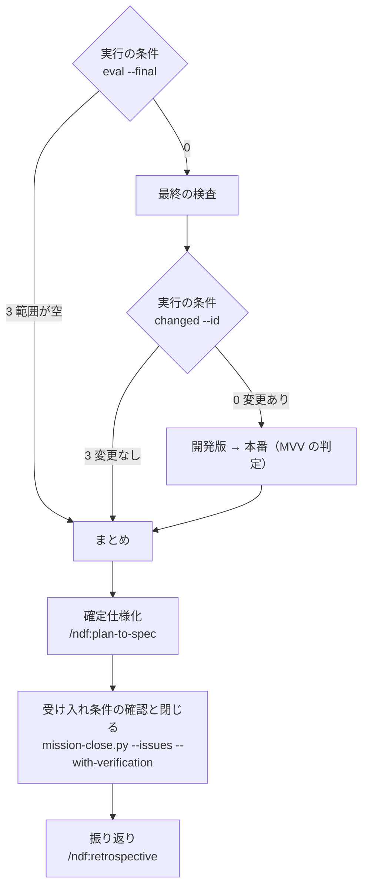

# #1078: 入出力の契約と処理の流れ

[issue-1078-pace-fast-design.md](issue-1078-pace-fast-design.md) の続きである。構成要素と
データ構造はそちらにある。

## 入出力の契約

**結果はすべて `lib/step_result.py` の形の 1 行の JSON で返す**（`tool` / `status` / `summary` /
`items` / `metrics`）。終了コードもその契約に従い、次の表はこの変更で決める値だけを書く。

### `check-trigger.py`（新設）

| 副命令 | 入力 | 成功の出力 | 失敗の形 |
| --- | --- | --- | --- |
| `eval [--final] [--id <計画名>] [--root DIR]` | 宣言・検査の記録・git の履歴 | 立った: `ok`・終了コード 0。`items` は立ったトリガーごとに `{trigger, value, threshold}`、`metrics` は `prs`・`score`・`lines`・`hours`・`escapes`・`from`・`to`。立たない: `stopped`・終了コード 3・`metrics.fired` が空 | 宣言が読めない・git が無い・範囲を決められない: `stopped`・終了コード 2 |
| `prepare --id <名>` | 同上 | `check-base/<名>` を範囲の `from` に作って origin へ送る。範囲と立ったトリガーを `<計画>-state/check.json` へ書く。`ok`・0 | 送れない: `stopped`・1 |
| `scope --id <名>` | `check.json` | 検査の範囲のディレクトリを空白区切りで標準出力へ（共通層 → 逃げた不具合の領域 → その他の順）。JSON を出さない唯一の副命令である | `check.json` が無い: 終了コード 2 |
| `finish --id <名> --pr N` | 検査の Pull Request | 宛先を `develop` へ付け替える。差分があれば `ok`・0、無ければ Pull Request を閉じて `stopped`・3（「変更なし」） | 付け替えられない: `stopped`・1 |
| `record --id <名> --pr N --plan <計画>` | `check.json`・計画の `state.json` | `check` の事象を追記し、`check-base/<名>` を消す。`ok`・0 | 追記できない: `stopped`・1 |
| `escape --pr N [--of M]` | 直した Pull Request の変更したファイル | `escape` の事象を追記する。`ok`・0 | 同上 |
| `changed --id <名>` | 検査の記録 | 最新の `<名>` の `check` が `merged` なら `ok`・0、`no_change` なら `stopped`・3 | 事象が無い: `stopped`・2 |

**トリガーの判定（`eval`）:**

| トリガー | 立つ条件 | 数え方 |
| --- | --- | --- |
| `score` | 点数 ≥ `triggers.score` | 範囲のマージコミット（`git log --first-parent --merges <from>..<to>`）のうち、件名が `Merge pull request #N from <所有者>/<ブランチ>` で、ブランチが `release/` と `check/` で始まらないものを 1 本とする。そのマージが変えたファイル（`git diff --name-only M^1 M`）が共通層に当たれば `common_weight` 点、当たらなければ 1 点 |
| `lines` | 行数 > `triggers.lines` | `git diff --shortstat <from> <to>` の追加 + 削除 |
| `escapes` | ある領域の `escape` の事象の数 ≥ `triggers.escapes` | 前回の検査の `at` より後の `escape` を領域ごとに数える。1 件の領域は `scope` の 2 番目の群へ入れるだけで、トリガーにはしない |
| `hours` | 経過 ≥ `triggers.hours` かつ `prs` ≥ 1 | 前回の検査の `at` から今までの時間 |
| `final` | `--final` を渡し、`prs` ≥ 1 | 範囲が空なら立たない（検査を飛ばす） |

**`eval` は立ったかどうかにかかわらず `eval` の事象を 1 行追記する。** 閾値を見直す材料（Value 2）で
あり、立たなかった回も数に入れる。

### `mvv-gate.py check`（移して変える）

```text
mvv-gate.py check --mission <ミッションの状態> --gate design|release [--material F...] [--pr N...]
                  [--mode M] [--log <jsonl>] [--repo OWNER/REPO]
```

| 変わる点 | 内容 |
| --- | --- |
| `--mvv` を `--mission` に替える | MVV のファイルはミッションの状態の `mvv.path` から読む。`--mvv` は消す（試行であり、互換を持たない） |
| 判定の前に機械で見る | 順に、MVV の承認の記録がある / `mvv.sha256` が今のファイルのハッシュと承認の記録の `sha256` に一致する / `--mode` が `operation` でも `documentation` でもない / `--pr` の変更したファイルが `boundary_paths` に当たらない。1 つでも外れれば LLM を呼ばずに `gate`・10 |
| 通したときの記録 | `mission-state.py gate <m> "関門 1"|"関門 2" --what <材料の要約> --by mvv --verdict follow --reasons <JSON> --log <jsonl>` を打つ。打てなければ通さず `gate`・10 |
| 変えない点 | LLM の入力と出力（`verdict` / `reasons` / `boundary`）、`mvv-gate.jsonl` への 1 行、「従う」だけが `ok`・0 で他は `gate`・10 |

### `supervise.py`（変える）

| 呼び方 | 何が増えるか |
| --- | --- |
| `new mission ... --pace fast --state <ミッションの状態>` | 使ってよい条件を確かめ、外れれば `stopped`・1。当たれば下の「`fast` のミッションの計画」の波を書く。`mission.json` に `"進め方": "fast"` と `"状態": <パス>` を書く |
| `new check --since-last --id <名> --worktree <リポジトリの根> [--mission <状態>]` | `--pr` の代わりに前回の検査からの差分を範囲にする計画を組む（`--pr` とは同時に渡せない。渡せば終了コード 2） |
| `new release ... --channel prod --mvv <ミッションの状態>` | 先頭に MVV の判定の段を置く。`--channel dev --mvv <状態>` なら `facts` の段に `gate_as_ok` を付ける |
| `new impl ... --escape-of <PR番号|0>` | 最後の段（マージ）の後に `check-trigger.py escape --pr {pr} --of <番号>` の段を足す |
| `new close --name M --worktree <根> --issue N... --version <開発版> --prod <正式版> --state <状態> [--milestone M]` | ミッションの終わりの波を書く（下の「ミッションの終わりの計画」） |
| 計画の `"実行の条件": {"cmd": "...", "skip_code": 3}` | `run` と `queue` が作業ツリーを作る前に打つ。0 なら流す。`skip_code` なら作業ツリーを作らず、報告を `結果: 完了`・`理由: 実行の条件に当たらない（<summary>）` で書いて終える。ほかは `結果: 止まった` |
| `queue <計画>... --then <計画>... [--then <計画>...]` | `--then` を繰り返すと段になる。段は前の段がすべて `完了` のときだけ流し、段の中は今と同じく `--max` 本まで同時に流す。`{queue_prs}` は前のすべての段の Pull Request で置き換える。`--then` が 1 つなら今と同じ |
| 段の `"gate_as_ok": true` | run の段の 10〜19 を関門として数えず、提示物だけを写して `next` へ進む。報告の `結果` は `関門` にしない |

**互換性:** どれも足すだけである。`--pace` を渡さない `new mission` と、`実行の条件` を持たない
計画は、今と同じに動く。

### `mission-state.py`・`mission-close.py`・控え（変える）

| 呼び方 | 何が増えるか |
| --- | --- |
| `mission-state.py init ... --pace fast --mvv <ファイル>` | `pace`・`mvv.path`・`mvv.sha256` を書く。`--pace fast` で `--mvv` が無ければ `stopped` |
| `mission-state.py gate <m> MVV --what <要約>` | `sha256` に今の MVV のハッシュを入れる。conductor が利用者の承認を得た後に打つ |
| `mission-state.py gate ... --by mvv --verdict V --reasons JSON --log P` | 判定が通した関門の記録。`--by` を省けば今と同じ `user` |
| `mission-close.py ... --issues 1,2` | 閉じる課題を直接受ける。`--prs` の閉じる語と両方あれば和を取る |
| `stage-check.sh record <課題> pace <normal\|fast>` / `projects-sync.sh <課題> pace fast` | 控えの `.pace` と本文の見出し行を書く。知らない値は終了コード 2 |
| `stage-check.sh report <課題>` | `pace` が `fast` なら、トリガーの工程を `トリガー:`、まとめる工程を `まとめる:` の行へ出し、`記録なし:` と記録を促す行に入れない |

## 処理の流れ

### `fast` のミッションの計画

`new mission --pace fast` が書く波である。**`normal` との違いは 4 点で、ミッションのブランチを
作らないこと、実装が develop へ直接入ること、検査に実行の条件が付くこと、関門の波が MVV の
判定の段へ入ることである。**



| 波 | 計画 | 流し方 |
| --- | --- | --- |
| 1 設計 | `design-<N>`（設計の段の後の `gate` の judge を、MVV の判定の run の段に替える） | `queue --max 3` |
| 2 関門 1（MVV） | 無し。**設計の計画がすべて `完了` なら通過し、`関門` を返した計画の Pull Request だけ**利用者の承認を取ってマージする | conductor |
| 3 実装 | `impl-<N>`（`base` は `develop`。ミッションのブランチから切らない） | `queue <3> --max 3 --then <4> --then <5> --then <6>` |
| 4 検査 | `check`（`new check --since-last` と同じ。実行の条件 `check-trigger.py eval --id <名>`） | 3 の 1 段目の `--then` |
| 5 開発版 | `release`（`--prs-from-queue`。`facts` は `gate_as_ok`） | 2 段目の `--then` |
| 6 本番 | `release-prod`（`--prs-from-queue`。先頭が MVV の判定） | 3 段目の `--then`。判定が `関門` を返すと queue の結果が `gate` になり、conductor が承認を取ってから `run <計画> --from bump` で続ける |

**設計の計画の終わり（関門 1 の段）:**

| 段 | 種類 | 内容 | 遷移 |
| --- | --- | --- | --- |
| `mvv` | run | `mvv-gate.py check --mission <状態> --gate design --pr {pr} --mode <モード>` | 0 → `approve`、10 → `gate_next: end`（報告は `結果: 関門`） |
| `approve` | run | `gh pr edit {pr} --add-label design-approved` と、判定の記録（判定・理由・ログの行）を `gh pr comment` で残す | → `merge` |
| `merge` | run | `MERGE_CMD` | → `end` |

### 検査の計画（`new check --since-last`）



| 段 | 種類 | 内容 | 遷移 |
| --- | --- | --- | --- |
| `prepare` | run | `check-trigger.py prepare --id <名>` | → `pr` |
| `pr` | pr | `base: check-base/<名>`、`body: template`（範囲・立ったトリガー・先に見る範囲） | → `assess` |
| `assess` / `refactor` / `review` / `test-all` / `judge` / `fix` | — | `plan_check` と同じ。`refactor` の `--scope` は `$(check-trigger.py scope --id <名>)` | `test-all` の成功 → `finish` |
| `finish` | run | `check-trigger.py finish --id <名> --pr {pr}` | 0 → `ready`、`skip_code` 3 → `skip_to: record` |
| `ready` / `merge` | run | `plan_check` と同じ | → `record` |
| `record` | run | `check-trigger.py record --id <名> --pr {pr} --plan <計画のパス>` | → `end` |

**落ちたとき:** 検査の計画が `止まった` で終わると、`record` の段まで進まず、検査の記録に `check` の
事象が残らない。**次の `eval` は同じ `from` から数え直すため、範囲を取りこぼさない。** 開発版の計画は
`--then` の「前の計画がすべて完了のときだけ」によって流れず、conductor が attention で起きる。
`check-base/<名>` の後始末は、その後の `record` が打たれたとき（打ち直しを含む）に行う。

### ミッションの終わりの計画（`new close`）



| 波 | 計画 | 流し方 |
| --- | --- | --- |
| 1 最終の検査 | `check`（実行の条件 `eval --final`） | `queue <1> --then <2> --then <3> --then <4>` |
| 2 開発版 | `release`（実行の条件 `changed --id <最終の検査の名>`） | 1 段目の `--then` |
| 3 本番 | `release-prod`（同じ実行の条件 + MVV の判定） | 2 段目の `--then`。`関門` なら conductor が承認を取って続け、その後に 4 を打つ |
| 4 まとめ | `close`（段は下の表） | 3 段目の `--then`。1〜3 が実行の条件で飛ばされても `完了` なので流れる |

| 段 | 種類 | stage | 内容 |
| --- | --- | --- | --- |
| `spec` | work（`full`） | 確定仕様化 | `/ndf:plan-to-spec`。課題の `issues/` の計画と設計を `docs/` へ移し、コミットする |
| `pr` / `merge` | pr / run | Pull Request | develop 宛てに出してマージする。**`issues/` と `docs/` だけを触るため、配布を伴わない** |
| `close` | run | 後片付け | `mission-close.py --record-pr <本番の記録の PR> --issues <課題> --with-verification` |
| `retro` | work（`full`） | 振り返り | `/ndf:retrospective`。検査の記録の集計（`check-trigger.py eval` の `metrics` と `check` の `findings`、`escape` の件数）を材料に渡す |

**課題ごとの stage の記録は、計画の `課題` にミッションの課題をすべて載せて打つ。** これで
控えの報告が `まとめる:` から `記録あり:` へ移る。
