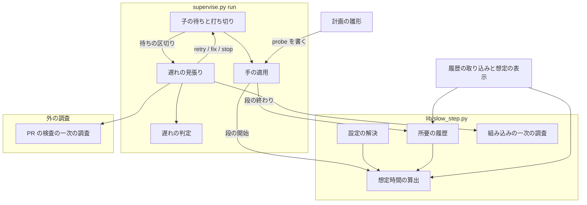
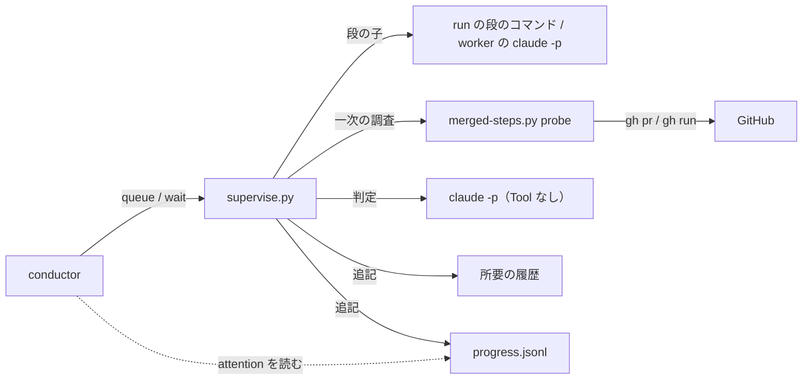
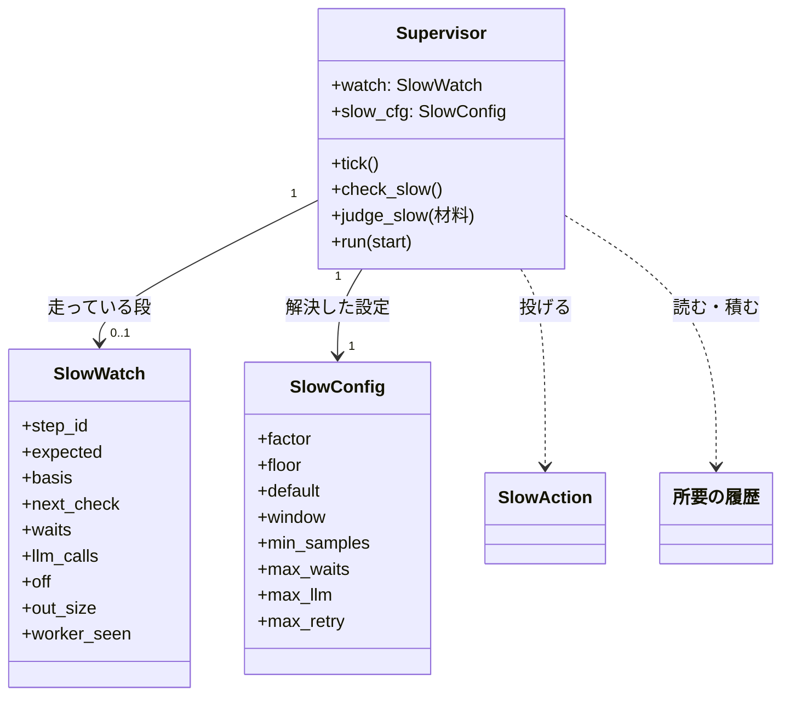
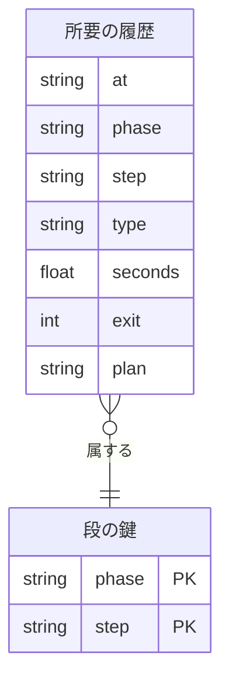

# #1102: supervise.py の段が想定より大幅に遅いとき、原因を調べて介入する

要求と受け入れ条件は #1102 の本文にある。この文書は「どう作るか」だけを扱う。設計は 2 本に
分けた。

| ファイル | 持つ節 |
| --- | --- |
| この文書 | 具体例・機能一覧・構成要素・当てはまらない既存の規則・構造・データ構造・入出力の契約 |
| [issue-1102-slow-step-flow.md](issue-1102-slow-step-flow.md) | 処理の流れ・状態遷移・決定の記録・テスト設計・未確認のまま残ること |

**仕様のファイルが無いため、省いた成果物はここに書く。** 画面と API の仕様記述（OpenAPI）は
作らない。呼び出される約束はコマンドと JSON の行だけで、その形は `interface-api.md` のコマンドの
表で書く。非機能設計表も作らない。#1102 の本文に非機能の条件が無く、所要と費用の見込みは
「具体例」と流れの文書の決定に数で書く。

## 具体例: 2026-09-25 の開発版 10.17.22-dev.1 の `release` の段

`/tmp/ndf-sv/r11/plan-release-dev.json` の `release` の段は 1148.8 秒かかった。PR #1100 の検査
`runtime-plugin-build-check` の 1 本は実行が success で終わっていたのに、チェックの表示が
`in_progress` のまま残り、`gh pr checks --watch` が上限なしで待ち続けた。

| 時点（JST） | 今 | この設計の後 |
| --- | --- | --- |
| 20:48:55 段の開始 | — | 想定時間を出す。同じ段（フェーズ `配布（開発版）`・段 `release`）の直近 10 回の中央値 72.65 秒 × 3 = 218.0 秒が下限 300 秒に届かないため、想定は 300 秒 |
| 20:53:55 経過 300 秒 | 何も起きない | 一次の調査 `merged-steps.py probe --head release/v10.17.22-dev.1 --head develop --act` を流す。`runtime-plugin-build-check` の実行は completed でジョブに結論が無いので「取り残し」と分け、`gh run rerun <実行> --job <ジョブ>` を打つ。`progress.jsonl` に `slow` の行、conductor へ `attention`（reason `遅れ`）の行が残る。LLM は使わない |
| 20:58:56 経過 600 秒 | `alive` の行が積まれるだけ | 再実行したチェックが通れば、待つ側がその結論を読んで段が終わる。終わらなければ次の確認（経過 600 秒）で分け直し、再実行でも取り残されていれば `stale_again` として判定へ回す |
| 21:08:04 段の終わり | 利用者が尋ね、conductor が手で `gh run rerun` を打って解いた | — |

**過去の区間の 351 段に同じ求め方を当てると、想定を超えるのは 3 段だけである**（r3〜r11 の
`progress.jsonl` の `step` の行のうち run・work・drive。フェーズと段の id の組は 26 種類。履歴には
成功した段だけを積む）。3 段はいずれも #1102 の
本文が外れ値として挙げたものである。

| 段 | 所要 | 想定 | 想定の根拠 |
| --- | ---: | ---: | --- |
| `実装` / `merge`（r4） | 1270.3 秒 | 900 秒 | 同じ段の履歴が 2 回で 3 回に満たず、既定値 |
| `実装` / `impl`（r11） | 1833.1 秒 | 1080.8 秒 | 直近 10 回の中央値 360.25 秒 × 3 |
| `配布（開発版）` / `release`（r11） | 1148.8 秒 | 300 秒 | 中央値 72.65 秒 × 3 が下限に届かず、下限 |

## 機能一覧

| # | 機能 | 誰が使うか |
| --- | --- | --- |
| F1 | 段ごとの想定時間を、過去の同じ段の所要から出す。履歴が足りなければ既定値を使う | `supervise.py run`（段の開始時） |
| F2 | 終えた段の所要を、次の想定の材料として履歴へ積む | `supervise.py run`（段の終わり） |
| F3 | 経過が想定を超えたら、段の種類ごとの一次の調査を流し、結果を `progress.jsonl` に残す | `supervise.py run`（待ちの間） |
| F4 | 一次の調査の分類が決まった手に当たれば、LLM を使わずに打つ（待ち直し・再実行・取り残しの再実行・止める） | `supervise.py run` |
| F5 | 決まった手で解けない遅れを LLM の判定へ回し、retry / fix / stop / wait のどれかを打ち、手と理由を残す | `supervise.py run` |
| F6 | 介入したことと、その手を conductor へ知らせる | conductor（`supervise.py wait` の出力で読む） |
| F7 | 想定時間の求め方と係数・調査の回数の上限を、宣言か引数で変える | 利用者・conductor |
| F8 | 既存の `progress.jsonl` を履歴へ取り込み、計画の段ごとの想定を表示する | conductor |
| F9 | PR の検査の待ちを調べ、取り残し・ランナー待ち・失敗・実行中を分ける | 一次の調査（`merged-steps.py probe`） |

## 構成要素

**遅れの見張りは、段を回すスクリプトの待ちの中に置く。** 待ちの区切りごとに呼ばれる
`tick` が経過を見ているため、別のプロセスを立てずに済む。

| 要素 | 置き場所 | 責務 |
| --- | --- | --- |
| 想定時間の算出 | `lib/slow_step.py` の `expected_for` | 履歴と設定から、段の想定の秒と根拠（件数・中央値・係数・下限・出所）を返す。純粋な処理で、ファイルを読まず終了コードを持たない |
| 所要の履歴 | `lib/slow_step.py` の `read_history` / `append_history` と、履歴のファイル | 終えた段の所要を 1 行ずつ積み、同じ段の直近の所要を返す |
| 設定の解決 | `lib/slow_step.py` の `resolve_config` | 引数 → 計画の `slow` → 宣言の `slow` → 既定の順に重ね、値の形を確かめる |
| 組み込みの一次の調査 | `lib/slow_step.py` の `probe_output` / `probe_worker` | run・drive の段は出力の伸び、work の段は worker の行と新しいコミットから「進んでいる」かを分ける |
| PR の検査の一次の調査 | `merged-steps.py probe` | 開いた PR の検査を読み、取り残し・ランナー待ち・失敗・実行中に分け、`--act` なら取り残しを再実行する |
| 遅れの見張り | `supervise.py` の `Supervisor.check_slow` と `SlowWatch` | `tick` の中で経過と次の確認の時点を比べ、一次の調査を起動し、分類から手を決めて打つ。`slow` の行と `attention` の行を書く |
| 遅れの判定 | `supervise.py` の `Supervisor.judge_slow` と `SLOW_SYSTEM` | 材料（段の定義・経過と想定・一次の調査・出力の末尾・履歴）を最小構成の `claude -p` に渡し、4 つの手から 1 つを選ばせる |
| 子の待ちと打ち切り | `supervise.py` の `run_ticking` | `tick` が手を投げたら、子をプロセスグループごと止めて投げ直す |
| 手の適用 | `supervise.py` の `Supervisor.run` | 投げられた手（retry / fix / stop）を段の遷移に写す |
| 計画の雛形 | `supervise.py` の `MERGE_CMD` を使う `merge` の段 5 箇所と `plan_release_package_plugin` | 待ちの段（`merge`・`release`）へ PR の検査の一次の調査を書く |
| 履歴の取り込みと想定の表示 | `supervise.py history import` / `supervise.py expected` | 既存の `progress.jsonl` を履歴へ移す。計画の段ごとの想定と根拠を出す |
| 利用者向けの説明 | `supervise.py` の docstring・`waiting.md`・`merged/SKILL.md` | 行の種類・理由・宣言・`probe` の形を書く |



**利用者向けの説明は図に含めない。** 図は実行の関係だけを描く。

### 文脈と配置



| 境界 | 何が流れるか |
| --- | --- |
| supervise.py → 段の子 | 打ち切りのシグナル（プロセスグループへ `SIGKILL`）。今は子のプロセスだけを止める |
| supervise.py → `merged-steps.py probe` | PR の番号か head のブランチ・`--act`。戻りは 1 行の JSON |
| `merged-steps.py probe` → GitHub | 読み取り（`gh pr view` / `gh pr list` / `gh run view`）と、取り残しのジョブの再実行（`gh run rerun --job`）だけ |
| supervise.py → 判定の `claude -p` | 材料の文字列だけ。Tool も作業場所も渡さない |
| supervise.py → 所要の履歴 | 段の所要の 1 行（リポジトリの外、git の共通ディレクトリの下） |
| supervise.py → `progress.jsonl` | `slow` の行と、reason `遅れ` の `attention` の行（既存の行の種類に足す） |

**conductor と `supervise.py` の間の線は変えない。** conductor は今と同じ `queue` / `wait` で
起動し、`attention` の行で起きる。

### 置き場所

```text
plugins/ndf/
├── scripts/
│   ├── supervise.py                 # 変える: 見張り・判定・手の適用・雛形・history / expected
│   ├── merged-steps.py              # 変える: probe を足す。probe_checks が attempt も読む（下の probe の節）
│   ├── lib/
│   │   └── slow_step.py             # 新設: 想定・履歴・設定・組み込みの一次の調査
│   └── tests/
│       ├── test_slow_step.py        # 新設
│       ├── test_supervise_slow.py   # 新設
│       └── test_merged_probe.py     # 新設
└── skills/
    ├── development-workflow/references/waiting.md   # 変える: 行の種類と理由
    └── merged/SKILL.md                              # 変える: probe の説明
```

## 当てはまらない既存の規則

**`progress.jsonl` の行の種類・`attention` の理由・段の終了コードの 3 つの集合へ値を足す。**
集合の名前と既存の値で配布物を検索し、見張りが通る `tick` と `run_ticking` と `claude` の待ちを
読んで、当てはまらない規則を集めた。

| 規則 | 置き場所 | 当てはまらない理由 | 変え方 |
| --- | --- | --- | --- |
| 行の種類は `step` / `alive` / `worker` / `attention` の 4 つ | `waiting.md` の表・`supervise.py` の docstring | `slow` の行が無い | 表と docstring に `slow` を足す。conductor を起こさない行として並べる |
| `attention` の理由は 4 つ（止まった・関門・同じ失敗の繰り返し・判断の段で stop が出そう） | 同上 | `遅れ` が無い | 理由に `遅れ` を足す |
| 行の数は `pcount` の鍵にある種類だけを数える | `Supervisor.__init__` | `slow` が数えられない | `pcount` に `slow` を足す。`llm` と `llm_cost` は判定の段で足す（鍵はあるが書く側が無かった） |
| 報告の `途中の報告` の欄は行の種類ごとの 5 つの数と、LLM へ回した回数・費用 | `Supervisor.report` | 遅れの調査の数が無い | `遅れの調査 N` を足し、手を打った段を `- 遅れ:` の行で並べる |
| 打ち切りは子のプロセスだけを `kill` する | `run_ticking` | `shell=True` の段では孫のプロセス（`release-steps.py` とその `gh`）が残る。手で止めた段が裏で動き続ける | 子を新しいセッションで起こし、プロセスグループへ `SIGKILL` を送る。打ち切り（124）も同じ経路を通す |
| `tick` の中で起きた例外は子を止めない | `run_ticking` | 見張りが手を投げると、子が残ったまま待ちを抜ける | `tick` の例外を受けたら子を止めてから投げ直す |
| 利用上限の待ちの間も `tick` を呼ぶ | `Supervisor.claude` | 上限の待ちの秒が経過に入り、遅れと見なす | 上限の待ちの間は見張りを止め、待った秒を経過から引く |
| 落ちた段の回数が 2 回になると `判断の段で stop が出そう` を出す | `Supervisor.run` | 見張りの retry で打ち切った段も落ちた回数に数える | retry で打ち切った段は `fail_counts` に数えない |
| 段の所要は `step` の行にだけ残る | `Supervisor.step_line` | 状態ディレクトリは計画ごとに別で、次の計画から読めない | 段の終わりに所要の履歴へも 1 行積む |
| `rerun_failed` の再実行は終了コードが 0・124・関門のどれでもないときに走る | `Supervisor.do_run` | 125 がこの条件に当たり、遅れで打ち切った段へ `pytest --lf` が走る | 除く集合に 125 を足す（`code not in (0, 124, 125)`） |
| 実行の状態は `status` と `jobs` だけを読む | `merged-steps.py` の `probe_checks` | `stale` と `stale_again` を分ける `attempt` が無い | `--json status,attempt,jobs` で読み、`stale` の要素に `attempt` を足す（既存の呼び出し側は `attempt` を読まない） |

**当てはまる規則は記録しない。** `attention_lines` と `notify_attention` は `kind` が
`attention` の行だけを読むため、理由が増えても変えずに通る。

## 構造

**変えるのは `Supervisor` と `run_ticking` で、新しく `SlowWatch`・`SlowConfig`・`SlowAction` を
置く。** 既存の型は関係を示すために名前だけを置く。



| 型 | 責務 | 多重度の判断 |
| --- | --- | --- |
| `SlowWatch` | 走っている段 1 つの見張りの状態。段の開始で作り、段の終わりで捨てる | `Supervisor` が同時に持つのは 0 か 1。段は 1 つずつ走り、judge・pr の段と見張りを切った段では持たない |
| `SlowConfig` | 解決した設定（「入出力の契約」の鍵）。`frozen` の dataclass | 計画の実行ごとに 1 つ。段ごとの `expected` と `probe` は段の定義から読み、ここへ持たない |
| `SlowAction` | 見張りが段を打ち切るときに投げる例外。`action`（retry / fix / stop）と `text` を持つ | — |

## データ構造

**永続のデータは所要の履歴 1 つで、事象の記録として積む。** 段が終わるたびに 1 行を足し、
書き換えない。想定は読むときに直近の行から導く。



**段の鍵は（フェーズ, 段の id）である。** 同じ段の id が計画の種類で違う所要を持つためである
（`release` の全件の中央値は開発版 94.8 秒・本番 244.7 秒）。鍵は行が持つ値から導き、表として
持たない。

| 列 | 型 | 空を許すか | 意味 |
| --- | --- | --- | --- |
| `at` | 文字列（ISO 8601、秒まで） | 許さない | 段が終わった時刻 |
| `phase` | 文字列 | 許さない | 計画の `フェーズ`。計画に無ければ `"?"`（「該当なし」ではなく「不明」） |
| `step` | 文字列 | 許さない | 段の id（パートに分けた段は `impl-1` のように分けたまま） |
| `type` | 文字列 | 許さない | `run` / `work` / `drive` |
| `seconds` | 数 | 許さない | 段の所要。利用上限の待ちの秒を含まない |
| `exit` | 整数 | 許さない | 段の終了コード。積むのは 0 と 10〜19（関門）だけ |
| `plan` | 文字列 | 許す | 計画のファイルのパス。空は「取り込みで計画のファイルが見つからなかった」 |

- **積むのは成功した段と関門を返した段だけである。** 落ちた段と打ち切った段の所要は、その段の
  普段の所要を表さない
- **置き場所の既定は `<git の共通ディレクトリ>/ndf/step-history.jsonl` である。** 作業ツリーを
  消しても残り、同じリポジトリの作業ツリーどうしで共有される。作業場所が git でなければ
  `<状態ディレクトリ>/step-history.jsonl` を使う（その計画の中だけで効く）
- **並行する計画が同じファイルへ書く。** 1 行を `O_APPEND` の 1 回の `write` で足す（1 行は
  約 200 バイトで、`PIPE_BUF` の 4096 バイトに収まる）
- **移行**: 既存の `progress.jsonl` は `supervise.py history import` で取り込む。取り込まなければ
  履歴が 3 回たまるまで既定値で見張る。同じ（`plan`, `at`, `phase`, `step`, `type`）の行は 2 度
  積まない。`plan` を鍵に入れるのは、並行する別の計画で同じ段が同じ秒に終わった 2 件を残すため
  である（テスト: 計画だけが違う 2 件を取り込むと 2 件とも積む）

`progress.jsonl` の `slow` の行と `attention` の行は計画ごとの記録で、形は「入出力の契約」に書く。

| 機能 | 所要の履歴 | `progress.jsonl` |
| --- | --- | --- |
| F1 想定を出す | R | — |
| F2 所要を積む | C | — |
| F3 一次の調査 | — | C（`slow`） |
| F4 決まった手 | — | C（`slow`・`attention`） |
| F5 LLM の判定 | R | C（`slow`・`attention`） |
| F8 取り込みと表示 | C・R | R |

## 入出力の契約

### 設定（`slow`）

**引数 → 計画の `slow` → 宣言（`.ndf/supervise.json` の `slow`）→ 既定の順に先に効く。** 引数は
`supervise.py run --slow <鍵>=<値>`（繰り返せる）。

| 鍵 | 型 | 既定 | 意味 |
| --- | --- | ---: | --- |
| `enabled` | 真偽 | `true` | `false` で見張りを切る |
| `window` | 整数 | 10 | 想定に使う同じ段の直近の件数 |
| `min_samples` | 整数 | 3 | これより少なければ `default` を使う |
| `factor` | 数 | 3.0 | 中央値に掛ける係数 |
| `floor` | 秒 | 300 | 想定の下限 |
| `default` | 秒 | 900 | 履歴が足りない段の想定 |
| `max_waits` | 整数 | 3 | 決まった手の「待ち直し」を続けてよい回数。超えたら判定へ回す |
| `max_llm` | 整数 | 2 | 1 つの段で判定へ回す回数の上限。超えたら見張りを止める |
| `max_retry` | 整数 | 1 | 1 つの段を見張りの retry で打ち直す回数の上限 |
| `probe_timeout` | 秒 | 120 | 一次の調査のコマンドの上限 |
| `judge_timeout` | 秒 | 300 | 判定の `claude -p` の上限 |
| `history` | パス | 上の既定 | 所要の履歴のファイル。相対ならリポジトリの根から |

- 知らない鍵・形の違う値は、段を始める前に `結果: 止まった`・`理由: slow の設定が読めない（<鍵>）`
  で止まる
- **段の定義にも 2 つの鍵を置ける。** `"expected": <秒>` は想定を固定し、履歴を読まない。
  `"probe"` は一次の調査を選ぶ（次の節）

### 段の `probe`

| 値 | 調べ方 | 既定になる段 |
| --- | --- | --- |
| `"output"` | 前の確認から stderr のファイルが伸びたか、最後の行が変わったか | run・drive |
| `"worker"` | 前の確認から worker の行が足されたか、段の開始の後に作業場所へコミットが足されたか | work |
| `{"cmd": "<コマンド>"}` | コマンドを段の作業場所で打ち、最後の行の JSON を読む。`{pr}` `{base}` `{branch}` `{state_dir}` を置き換える（`{branch}` は段の作業場所の今のブランチ、`{base}` は計画の `起点` から `origin/` を外した名前） | — |
| `false` | 調べずに判定へ回す | — |

**コマンドはシェルを通さない。** 先に雛形を `shlex.split` で argv に分け、各要素の中の置き換えの
印を値で置き換えてから `shell=False` で起動する。値は 1 つの要素の中に収まり、ブランチ名や
パスにシェルの記号があっても実行されない（テスト: `{branch}` が `a;touch x` のとき `x` が
作られず、argv の 1 要素として渡る）。

**コマンドの一次の調査が返す JSON**（`lib/step_result.py` の形）:

| 項目 | 型 | 意味 |
| --- | --- | --- |
| `status` | `ok` / `stopped` | 調べられたか |
| `summary` | 文字列 | 1 行の要約（`slow` の行と `attention` の行へ写す） |
| `metrics.class` | 文字列 | 分類。値の集合はコマンドが決める |
| `metrics.action` | `wait` / `remedied` / `retry` / `fix` / `stop` / `judge` | 決まった手。`remedied` はコマンドが既に手を打ったことを表し、見張りは待ち直す |
| `items` | 並び | 根拠（チェックの名前・実行・ジョブ） |

終了コードが 0 でない・JSON が読めない・`probe_timeout` を超えたときは、`class` を `unknown`、
`action` を `judge` として扱う。

### `merged-steps.py probe`

```bash
python3 merged-steps.py probe (--pr N | --head <ブランチ>...) [--act] [--root DIR]
```

開いた PR ごとに検査を読み、強い順に 1 つの分類へまとめる。**強い順は下の表の上から下である。**
2 つ以上に当たる PR は上の分類を採り、複数の PR は最も上の分類で全体を表す。`attempt` は
`probe_checks` が `gh run view <実行> --json status,attempt,jobs` で読む（置き場所の表）。

| 分類 | 何を見たか | `action` |
| --- | --- | --- |
| `failed` | 失敗の結論のチェックがある | `fix` |
| `stale` | 実行が completed なのにチェックが pending でジョブの結論が無く、実行の `attempt` が 1 | `--act` なら `gh run rerun <実行> --job <ジョブ>` を打って `remedied`、打てなければ `judge`。`--act` が無ければ `judge` |
| `stale_again` | 同じ形で `attempt` が 2 以上（既に再実行した） | `judge` |
| `settled` | 実行が completed でジョブに結論があり、表示だけが pending | `wait`（`merge-when-green` は次の周回で結論として扱う） |
| `queued` | ジョブがランナーを待っている | `wait` |
| `running` | 実行中のジョブがあり、上のどれにも当たらない | `wait` |
| `passed` | すべて通っている | `judge`（待つ側が抜けていない） |
| `none` | 開いた PR が無い・読めない | `judge` |

- 終了コードは 0 = 調べた / 2 = 引数が読めない。`gh` が落ちた PR は飛ばし、1 本も読めなければ `none`
- `metrics` に `class`・`action`・`prs`（調べた PR の番号）・`queued_runs`（待ち行列の件数）を持つ
- **書き込みは `--act` の再実行だけである。** マージ・push・PR の編集をしない

**`gh` の実測（2026-09-25 22:20 JST、gh 2.101.0、devbasex/ai-plugins）:**

| コマンド | 出力（抜粋） | 終了コード |
| --- | --- | ---: |
| `gh run view 35832480423 --json status,conclusion,attempt,jobs` | `{"attempt":1,"conclusion":"success","status":"completed","jobs":[{"databaseId":107088070035,"status":"completed","conclusion":"success"}]}` | 0 |
| `gh run view 36131457948 --json status,conclusion,attempt,jobs`（再実行した実行） | `{"attempt":2,...,"jobs":[{"databaseId":108064877398,...}, ...]}` | 0 |
| `gh run view 36131457948 --attempt 1 --json attempt,jobs` | `{"attempt":1,"jobs":[{"databaseId":108059436733,...}, ...]}` | 0 |
| `gh run view 1 --json status`（無い実行） | 標準エラーに理由 | 1 |

- **再実行すると実行の番号は変わらず、`attempt` が 1 増え、ジョブの番号はすべて新しくなる。**
  このため `stale_again` は PR のチェックが指すジョブの番号ではなく、実行の `attempt` で見分ける
- **`stale` と `settled` の形は実測できていない。** GitHub 側の表示の取り残しは狙って起こせない。
  判定は既存の `probe_checks`（#1100 の取り残しで作った）と同じ条件を使い、テストは `gh` の出力を
  固定した偽物で書く

### 雛形が書く `probe`

| 段 | 雛形 | `probe` |
| --- | --- | --- |
| `merge`（`MERGE_CMD` を使う 5 箇所） | `plan_impl`・`plan_check`・`plan_check_since`・`plan_fast_design`・`close_plan` | `{"cmd": "python3 <置き場>/merged-steps.py probe --pr {pr} --act"}` |
| `release` | `plan_release_package_plugin`（dev・prod） | `{"cmd": "python3 <置き場>/merged-steps.py probe --head {branch} --head {base} --act"}`。段の作業場所は `release/v<版>` の作業ツリーで、`{branch}` は `release/v<版>` → `develop` の PR の head になる。本番では続けて `develop` → `main` の PR を待つ（`release-steps.py` の `cmd_release`）。その head は起点の `develop`（`{base}`）であるため 2 つを渡す |

### `progress.jsonl` の `slow` の行

一次の調査を流すたびに 1 行を書く。判定へ回したときは、判定の結果を同じ行に持つ。

```json
{"kind": "slow", "at": "2026-09-25T20:53:55+09:00", "step": "release", "type": "run",
 "round": 1, "elapsed": 300.2, "expected": 300,
 "basis": {"source": "floor", "samples": 10, "median": 72.65, "factor": 3.0, "floor": 300},
 "probe": {"name": "cmd", "class": "stale", "action": "remedied",
           "summary": "#1100 の runtime-plugin-build-check を再実行した"},
 "act": "wait", "by": "rule", "next_check": 600.2}
```

| 項目 | 意味 |
| --- | --- |
| `round` | その段で何回目の調査か |
| `basis.source` | `history`（中央値 × 係数）/ `floor`（下限）/ `default`（履歴が足りない）/ `step`（段の `expected`） |
| `act` | 打った手。`wait` / `retry` / `fix` / `stop` / `off`（上限に当たり見張りを止めた） |
| `by` | `rule`（決まった手）/ `llm`（判定） |
| `llm` | `by` が `llm` のときだけ。`{"reason": "<1 行>", "cost": <ドル>, "seconds": <秒>}` |
| `next_check` | 待ち直すなら次に確かめる経過の秒。打ち切るなら無い |

### `attention` の行（reason `遅れ`）

**次のときだけ書く。** 決まった手の `wait` は書かない（conductor を起こさない）。

| 出来事 | `text` の形 |
| --- | --- |
| 一次の調査が手を打った（`remedied`） | `段 release が想定 300 秒を超えた（300 秒）: <summary>。待ち直す` |
| 判定へ回した | `段 impl が想定 1080.8 秒を超えた（1082 秒）: 判定 wait（<理由>）` |
| retry / fix / stop を打った | `段 release を打ち切った（retry）: <理由>` |
| 上限に当たり見張りを止めた | `段 impl の遅れの判定が上限 2 回に達した。段の timeout まで待つ` |

### 段の結果と遷移

| 手 | 段の結果 | 次の段 |
| --- | --- | --- |
| retry | `exit` 125・`slow` に手と理由 | 同じ段。`max_retry` を超える retry は stop として扱う |
| fix | `exit` 125・本文に一次の調査の要約と判定の理由 | 段の `on_fail`。無ければ `結果: 止まった` |
| stop | `exit` 125 | 計画を止める。`結果: 止まった`・`理由: 遅れ: <理由>` |

**125 は「遅れで打ち切った」を表す。** 打ち切り（124）・関門（10〜19）と区別し、`rerun_failed`
の再実行を通さない（`do_run` の除く集合に足す。「当てはまらない既存の規則」の表）。

### 追加するコマンド

| コマンド | 入力 | 出力（1 行の JSON） | 失敗の形 |
| --- | --- | --- | --- |
| `supervise.py history import <progress.jsonl>... [--history F]` | 状態ディレクトリの `progress.jsonl`。フェーズは隣の計画（`<名前>-state/` に対する `<名前>.json`）から読む | `status: ok`・`metrics.added` / `metrics.skipped` | 読めないファイルは飛ばして `items` に残す。1 本も読めなければ `status: stopped`・終了コード 1 |
| `supervise.py expected <plan.json> [--history F] [--slow K=V]...` | 計画 | `items` に段ごとの `expected` と `basis` | 計画が読めなければ終了コード 2 |
| `supervise.py run ... --slow K=V` | 設定の上書き | 変わらない | 読めない鍵は止まる（上の設定の節） |

**互換性**: 既存の計画は書き換えずに動く。`probe` の無い段は組み込みの調査を使い、`slow` の無い
計画は既定で見張る。
