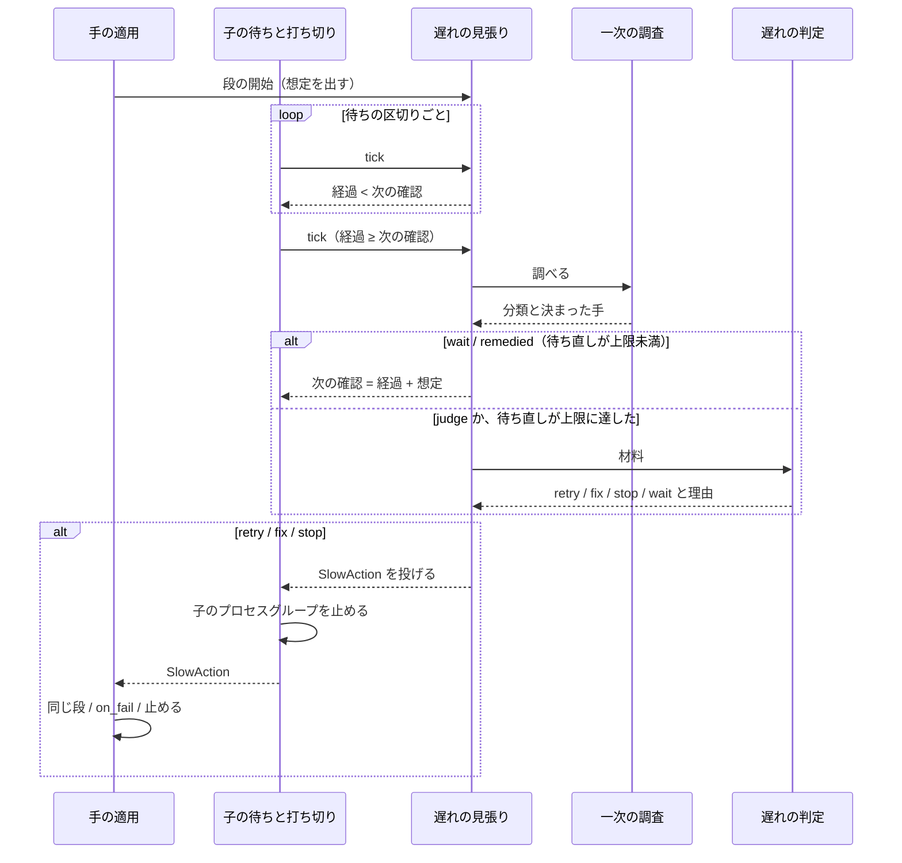
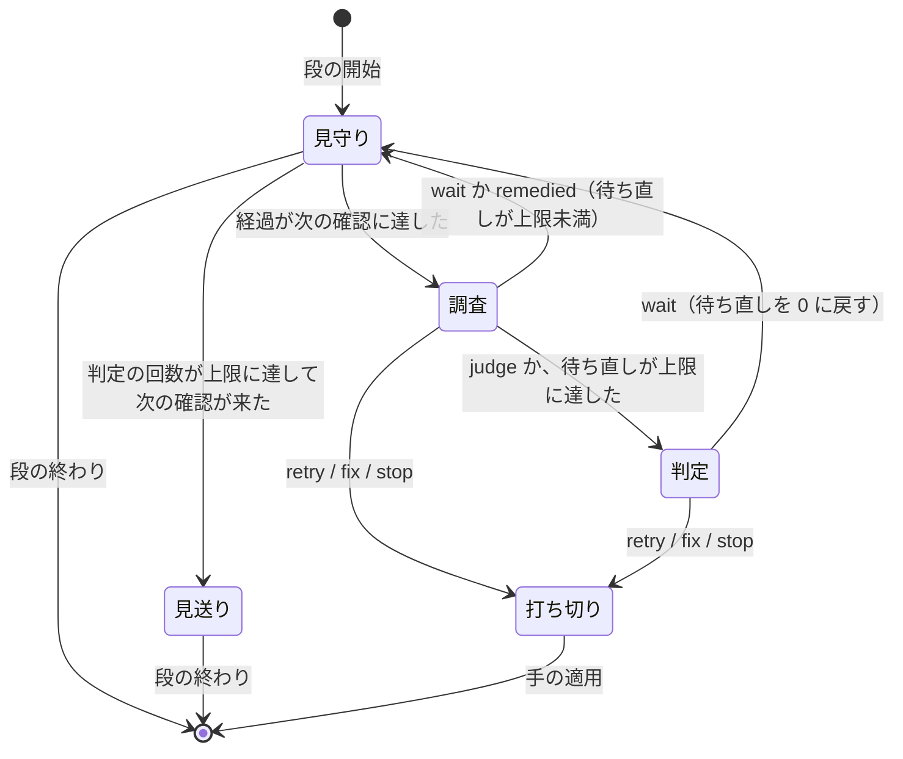

# #1102: 遅れの見張りの流れ・決定・テスト

[issue-1102-slow-step-design.md](issue-1102-slow-step-design.md) の続きである。構成要素・データ
構造・入出力の契約はそちらにある。

## 処理の流れ

**見張りは段の待ちの中で動き、段を止めるときだけ例外で待ちを抜ける。** 待ち直すときは子に
触らない。

**この図に含めない要素:** 想定時間の算出・所要の履歴・設定の解決は段の開始と終わり（下の表）で、
計画の雛形と、履歴の取り込みと想定の表示は計画を流す前に働く。組み込みの一次の調査と PR の検査の
一次の調査は、図の「一次の調査」に当たる。

**失敗の経路:**

| 起きたこと | 扱い |
| --- | --- |
| 一次の調査のコマンドが落ちる・上限を超える・JSON を返さない | 分類 `unknown`・手 `judge` として判定へ回す。`slow` の行の `probe.summary` に終了コードを残す |
| 判定の `claude -p` が落ちる・答えが読めない | 手 `wait` として待ち直す（次の確認は経過 + 想定）。reason `遅れ`・text `段 <id> の遅れの判定を読めない（<要約>）` の `attention` を書く。段の `timeout` が上限として残る |
| 判定が利用上限に当たる | `Supervisor.claude` の上限の扱いに任せる。待ちの間は見張りを止め、待った秒を経過から引く |
| 判定が 4 つ以外の値を返す | 読めない答えと同じ |
| 子のプロセスグループが止まらない | `SIGKILL` の後に 5 秒待って `communicate` を打ち切る。段は `exit` 125 のまま次へ進む |
| 所要の履歴が読めない・書けない | 読めなければ履歴を 0 件として既定値を使う。書けなければ段の結果の `slow_history` に誤りを残し、段は止めない |

**段の開始と終わりの処理:**

| 時点 | 行うこと |
| --- | --- |
| 段の開始（run・work・drive だけ） | `SlowWatch` を作る。想定を出し、`next_check` を想定に、`waits` と `llm_calls` を 0 にする |
| 段の終わり（0 か 10〜19） | 所要（利用上限の待ちを除く）を所要の履歴へ積み、`SlowWatch` を捨てる |
| 段の終わり（それ以外） | 積まずに `SlowWatch` を捨てる |
| 見張りの retry | 同じ段の新しい `SlowWatch` を作る。想定は同じ値で、`retries` だけを引き継ぐ |

### 状態遷移（`SlowWatch`）

- **見送りから見守りへは戻らない。** 見送りでは調査も判定もせず、段の `timeout` まで待つ。
  見送りに入るときに `attention` を 1 行書く
- **調査と判定の間も子は動いている。** 見張りは `tick` の中で同期して動くため、調査の上限
  （120 秒）と判定の上限（300 秒）の間は `alive` の行が遅れて書かれる
- **判定の中から見張りを呼ばない。** 判定の `claude -p` も `tick` を呼ぶため、`Supervisor` の
  `slow_busy` を立てて入れ子を止める

### 組み込みの一次の調査

| 調べ方 | 進んでいる（`wait`） | 進んでいない（`judge`） |
| --- | --- | --- |
| `output` | 前の確認から stderr のファイルの大きさが増えた | 増えていない。最後の行を `summary` に写す |
| `worker` | 前の確認から `worker` の行が 1 行以上足された、または段の開始の後のコミットが増えた | どちらも無い。最後の `worker` の行と、最後の行からの秒を `summary` に写す |

**進んでいても待ち直しは `max_waits` 回までである。** 出力を出し続けて終わらない段（同じ
待ちの行を出し続ける待ち）を、いつまでも待たないためである。

### 判定へ渡す材料

| 材料 | 中身 |
| --- | --- |
| 段 | id・type・`cmd`（run・drive）か `kind`（work）・`timeout`・`on_fail` の有無 |
| 経過と想定 | 経過の秒・想定の秒・`basis` |
| 一次の調査 | 今回と前回までの `slow` の行の `probe` |
| 出力の末尾 | run・drive は stderr のファイルの末尾 `TAIL` 文字、work は最後の 5 行の `worker` の行 |
| 履歴 | 同じ段の直近 `window` 件の秒 |
| 手の意味 | retry = 段を止めて同じ段を打ち直す / fix = 段を止めて `on_fail` へ / stop = 計画を止める / wait = 待ち直す（`wait_seconds` を付けてよい） |

答えは `{"decision": "retry|fix|stop|wait", "reason": "<1 行>", "wait_seconds": <秒>}` で、
`wait_seconds` は 60 以上・想定以下に丸める。

## 決定の記録

### 決定 1: 想定は同じ段の直近 10 回の中央値 × 3 とし、下限を 300 秒、履歴が 3 回未満なら 900 秒にする

過去の区間の run・work・drive の 351 段に当てると、想定を超えるのは #1102 が挙げた外れ値 3 段だけで、普段どおり
終えた段は 1 段も超えない。中央値は外れ値に引かれないため、外れ値の後の 10 回も想定が
変わらない。下限は、所要の短い段（`test-limited` の中央値 7.7 秒）で揺れを遅れと見なさないために置く。

直近の最大 × 2 も同じ 3 段を拾うが、外れ値 1 回で次の 10 回の想定が倍になる（`release` の
1148.8 秒の後は 2297.6 秒）ため採らない。中央値 + 300 秒は、普段どおり終えた `impl` の 676.8 秒と
886.3 秒も拾うため採らない。

### 決定 2: 見張りは `supervise.py` の待ちの区切り（`tick`）の中に置く

`tick` は既に経過と `alive` の行を見ており、子を止める手段も同じ所にある。別のプロセスで
`progress.jsonl` を見張ると、子を止めるために `supervise.py` との間に新しい約束（シグナルか
ファイル）が要る。conductor に見張らせる案は、判断の要らない手順を LLM に回すため採らない（Value 1）。

### 決定 3: 一次の調査はコマンドの契約で差し込み、決まった手の表は調べる側が持つ

`supervise.py` が読むのは `metrics.action` だけで、分類の値と GitHub の知識は
`merged-steps.py probe` が持つ。CI や配布の手段が違うプロジェクトは、自分の調べ方を段の
`probe` に書けば同じ見張りで動く（Value 6）。分類ごとの手の表を `supervise.py` に置く案は、
分類の値の集合が調べ方ごとに違うため、調べ方を足すたびに `supervise.py` を変えることになる。

### 決定 4: 所要の履歴は git の共通ディレクトリの下の JSONL に積む

状態ディレクトリの置き場所は conductor が決め、決まった形が無い（今は `/tmp/ndf-sv/r<N>/`）。
過去の `progress.jsonl` を探し回る案は、この形を既定に埋め込むことになる。git の共通
ディレクトリは作業ツリーを消しても残り、同じリポジトリの作業ツリーから同じ場所を指す。
`docs/metrics/` に置く案は、段が終わるたびにコミットが要るため採らない。

### 決定 5: worker の段も同じ枠組みで扱い、決まった手は「進んでいれば待ち直す」だけにする

過去の区間で想定を超えた 3 段のうち 1 段は `impl`（work）である。worker の遅れには、再実行の
ような機械で決まる手が無い。進みの報告と新しいコミットで「進んでいる」を分け、進んでいなければ
判定へ回す。

### 決定 6: 判定の答えが読めないときは待ち直し、止めない

止めると、判定の失敗 1 回で動いている段が失われる。待ち直しても、段の `timeout` が上限として
残る。既存の判断の段（`parse_decision`）が読めない答えを `stop` にするのは、判断の段が遷移を
決める段だからで、ここでは段はまだ動いている。

### 決定 7: 子はプロセスグループごと止める

`run` の段は `shell=True` で起動するため、子を止めても孫（`release-steps.py` とその `gh pr checks
--watch`）が残る。見張りの retry で同じ段を打ち直すと、残った孫と新しい子が同じ PR を待つ。
既存の打ち切り（124）も同じ問題を持つため、同じ経路へ寄せる。

### 決定 8: 決まった手の待ち直しでは conductor を起こさない

conductor は `attention` の行で起き、起きるたびに文脈の全体を読み直す。待ち直しは見張りが
続けて扱えるため、`slow` の行だけに残す。手を打ったとき（`remedied`・判定・打ち切り・見送り）は
起こす。

### 決定 9: 遅れで打ち切った段の終了コードを 125 にする

打ち切り（124）は段の `timeout` による。これと分けないと、`rerun_failed` の再実行と、報告を
読む側が遅れの介入を区別できない。125 は `timeout(1)` が自身の失敗に使う値だが、段の子の
終了コードとしては返らない（見張りが決める値である）。

## テスト設計

**テストは `uv run --project plugins/playwright-kit/skills/playwright-kit-ops --with pytest pytest
<ファイル> -q` で走らせる。** 子と `claude -p` と `gh` は偽のスクリプトで置き換える
（`NDF_SUPERVISE_CLAUDE` と `PATH` の先頭の偽の `gh`。既存の `test_supervise.py` と同じ作り）。
待ちの秒は段の `expected` と計画の `report_interval` を 1 秒未満にして縮める。

| 受け入れ条件 | 何で確かめるか |
| --- | --- |
| 段の経過が想定を超えると、一次の調査がスクリプトで走り、結果が `progress.jsonl` に残る | `test_supervise_slow.py`: `expected` 0.3 秒の run の段（`sleep 2`）と、JSON を返す `probe` のコマンド。`slow` の行が 1 行以上あり、`probe.class`・`act`・`basis.source` が `step` であること。`probe` の無い段では `probe.name` が `output`、work の段では `worker` であること |
| 一次の調査で決まった手が打てる形（取り残されたチェック）は、LLM を使わずに解ける | `test_merged_probe.py`: 偽の `gh` が「実行は completed・チェックは pending・ジョブの結論なし・`attempt` 1」を返すとき、`--act` で `gh run rerun <実行> --job <ジョブ>` が打たれ、`class` が `stale`・`action` が `remedied`。`attempt` 2 では `stale_again`・`judge`。`test_supervise_slow.py`: `remedied` を返す調査で、呼ばれたら落ちる偽の `claude` のまま段が完了し、`attention` の reason が `遅れ` |
| 決まった手で解けない遅れは LLM の判定へ回り、選んだ手と理由が記録に残る | `test_supervise_slow.py`: `judge` を返す調査と、`stop` / `retry` / `fix` / `wait` をそれぞれ返す偽の `claude`。`slow` の行の `by` が `llm`・`llm.reason` が答えの理由。stop は `結果: 止まった`、retry は同じ段が 2 回走り `max_retry` を超えると止まる、fix は `on_fail` の段へ進む、wait は `next_check` が延びる。答えが読めないときは `wait` と `attention` |
| 想定時間の求め方・係数は宣言か引数で変えられる | `test_slow_step.py`: `resolve_config` が引数 → 計画 → 宣言 → 既定の順に重なる。知らない鍵で誤りになる。`expected_for` が `factor`・`floor`・`default`・`window`・`min_samples` で値を変える。`test_supervise_slow.py`: `supervise.py expected` が `.ndf/supervise.json` の `slow.factor` と `--slow factor=2` の両方で出す値を変える |

受け入れ条件の外で、設計が決めた振る舞いを確かめるテスト:

| 振る舞い | 何で確かめるか |
| --- | --- |
| 過去の区間で拾うのは外れ値だけ（決定 1） | `test_slow_step.py`: `配布（開発版）` / `release` の r11 の前の直近 10 回の秒（中央値 72.65 秒）を履歴として、想定が 300 秒になり 1148.8 秒が超えること。`impl` の 886.3 秒の前の直近 10 回の秒（中央値 412.9 秒）で、想定 1238.7 秒を 886.3 秒が超えないこと |
| 所要を積むのは 0 と関門だけ | `test_supervise_slow.py`: 落ちた段と打ち切った段の後に履歴の行が増えない |
| 取り込みは同じ行を 2 度積まない | `test_slow_step.py` か `test_supervise_slow.py`: 同じ `progress.jsonl` を 2 回 `history import` して `metrics.added` が 2 回目に 0 |
| 打ち切りで孫のプロセスも止まる（決定 7） | `test_supervise_slow.py`: `sh -c 'sleep 30 & echo $! > pid; wait'` の段を stop で打ち切り、`pid` のプロセスが残らない |
| 利用上限の待ちは経過に入らない | `test_supervise_slow.py`: 上限を返す偽の `claude` と短い `NDF_SUPERVISE_LIMIT_SLEEP` で、待ちの間に `slow` の行が書かれない |
| 既存の計画がそのまま動く | 既存の `test_supervise.py` と `test_supervise_pace.py` が通る |

## 未確認のまま残ること

| 項目 | 内容 |
| --- | --- |
| 取り残しの再実行の競合 | `merge-when-green` も取り残しを `stale_after`（300 秒）の後に 1 度再実行する。見張りと同じ周回で両方が `gh run rerun` を打ったとき、後の方が失敗するかは測っていない。失敗すれば `remedied` にならず判定へ回るため、害は判定 1 回である。取り残しを手元で再現できないため、配布の後に `slow` の行で確かめる |
| r4 の `merge`（1270.3 秒）の原因 | 取り残しか、ランナー待ちか、CI の遅れかは記録に無い。既定値の 900 秒で拾うことだけを確かめた |
| worker の段の判定の回数 | worker がコミットを最後にまとめ、進みの報告を書かない段では、進んでいるのに `judge` になる。判定 1 回の費用は判断の段と同じ Tool なしの形で、段ごとに `max_llm`（2 回）で止まる。配布の後に `progress.jsonl` の `slow` の行の `by` を数えて決める |
| 履歴の既定 900 秒の妥当さ | 普段から 900 秒を超える新しい段は、履歴が 3 回たまるまで毎回判定へ回る。今の区間には該当する段が無い（`impl` の中央値 401.7 秒・`release`（本番）の最大 338.6 秒） |
| `external-ai.py run` の子を止めたときの後片付け | codex・kiro の worker をプロセスグループごと止めたとき、各ランタイムが残す一時ファイルと状態を測っていない。実装の段階で codex の worker を 1 回止めて確かめる |
