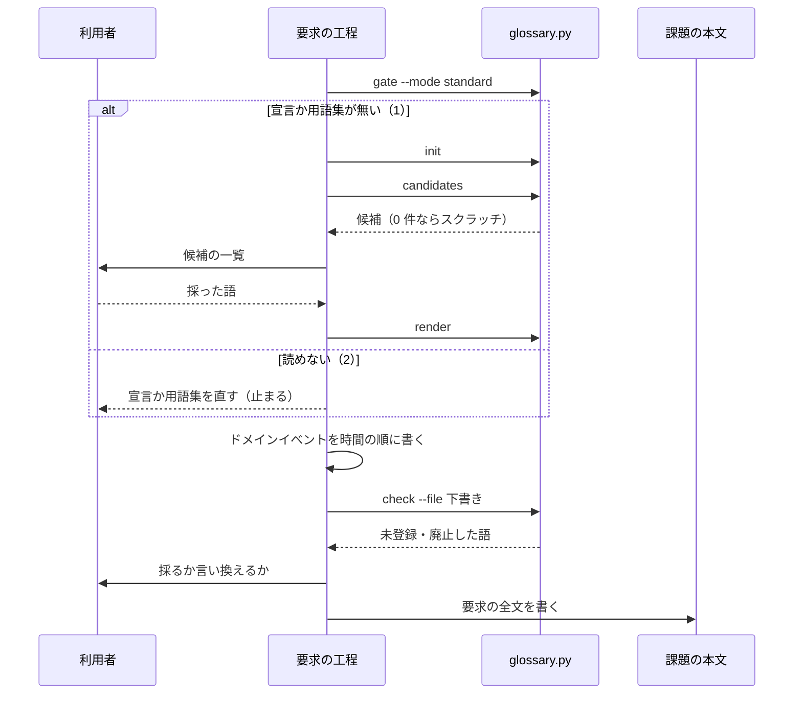
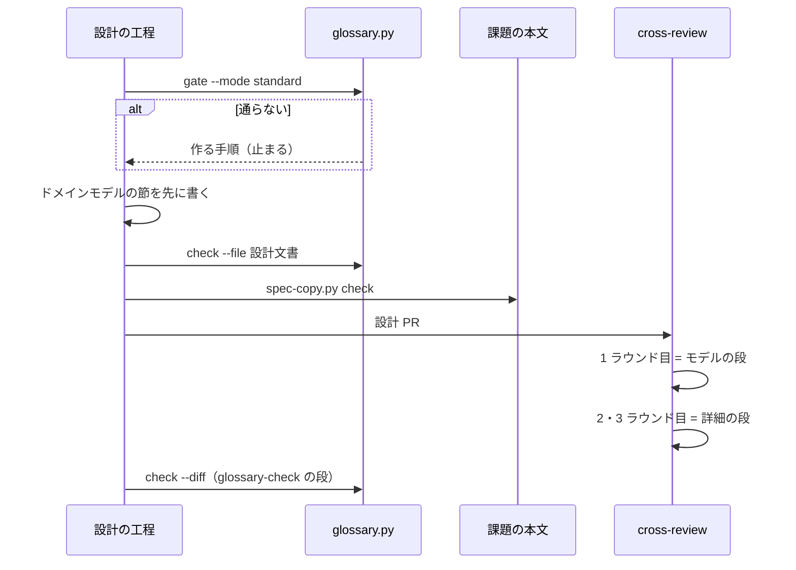
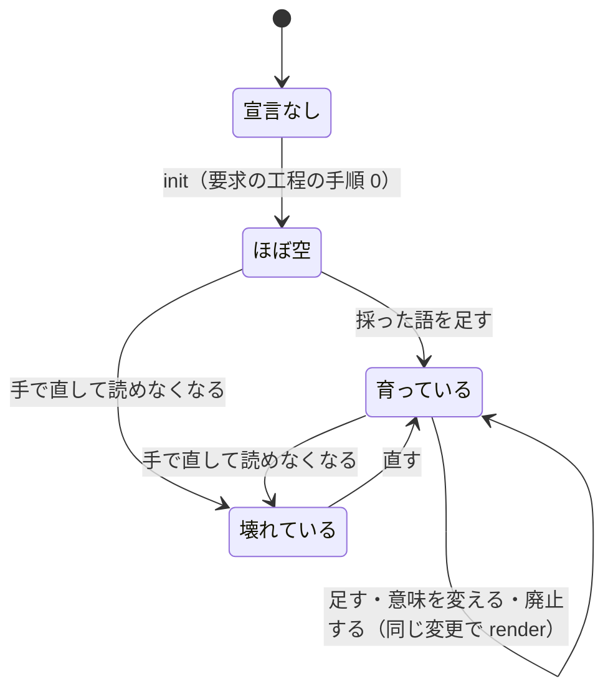

# #1111: 処理の流れ・決定の記録・テスト設計

[issue-1111-ubiquitous-language-design.md](issue-1111-ubiquitous-language-design.md) の続きである。
構成要素の番号（C1〜C16）・機能の番号（F1〜F13）・不変条件の番号（I1〜I6）・規則の番号（R1〜R13）は
そちらを指す。

## 処理の流れ

### 要求から設計 PR まで

**要求の工程**（`standard` のとき）:

**設計の工程と設計 PR**:

**失敗の経路は 3 つある。** `gate` の 2（宣言か用語集が壊れている）は作り直さずに止まる。壊れた
ファイルを `init` が上書きすると、利用者が採った語が消えるためである。`check --file` の当たりは
受け入れ条件を書く前に 0 件にする（受け入れ条件 7）。`spec-copy.py check` の 1 は、本文に合わせて
写しを `write` で作り直す（本文が正。決定 1）。

### 用語集の状態

- **`gate` が通すのは「ほぼ空」と「育っている」である。** 語の数は問わない（前提 4）
- **「宣言なし」から設計の工程へ直接進む遷移は無い**（I5）。要求の工程を通らない `legacy-refactor`
  では、`gate` が出す手順が `init` と候補の集め方（`requirements-design` の手順 0 だけ）を指す
- 「壊れている」から「宣言なし」への遷移は無い。`init` は既にあるファイルを上書きしない
- 3 つのファイルの一部だけが無い状態は「宣言なし」に含める。`init` は宣言の置き場に従って
  欠けたものだけを作り、「ほぼ空」か「育っている」へ移す

### 要求の工程に足す 3 つの手順

**3 つとも `standard` のときだけ通す。** 要求の工程は `light` / `operation` / `documentation` も
通るため、モードで絞らないとこの 3 モードの工程が増える（受け入れ条件 20。決定 11）。

| 手順 | 置く位置 | すること | 残るもの |
| --- | --- | --- | --- |
| 0. 用語集を用意する | 手順 1 の前 | `gate` が 1 なら `init` → `candidates`。候補が 1 件以上なら、候補から領域の語を選んで利用者へ示す。0 件なら依頼文から語を起こして示す。採った語だけを用語集へ書き `render` する | 宣言・用語集・文書 |
| 3a. ドメインイベントを書き出す | 手順 3（前提）の後 | 起きることを過去形で時間の順に並べ、各イベントの引き金と、失敗したときの経路を書く。引き金の無いイベント・失敗の経路の無いイベント・順序を仮定しているイベントを、前提か受け入れ条件か未決へ移す | 仕様の「ドメインイベント」の節 |
| 3b. 語を用語集と突き合わせる | 手順 4（受け入れ条件）の前 | 下書きを一時ファイルに書き、`check --file` を打つ。当たった語を、採る（用語集へ足す）か、言い換えるかに分け、0 件にする | 用語集の差分 |

**仕様の「ドメインイベント」の節は、設計のドメインモデルの節の材料になる。** 番号（`E1`…）を
そのまま設計で使う。表の形は `| # | イベント | 引き金 | 失敗したとき | 順序の前提 |` とする。

**手順 7 は置き場を課題の本文にする。** 要求の全文を本文へ書き（`gh issue edit --body-file`）、
本文にファイルのパスだけを書かない。`standard` では `spec-copy.py write` で写しを作り、設計 PR と
一緒にコミットする（決定 1）。

### 設計の工程の手順の変化

| 手順 | 今 | この設計の後 |
| --- | --- | --- |
| 0（新設） | — | `standard` / `legacy-refactor` で `glossary.py gate --mode <モード>` を打つ。0 以外なら作る手順を示して止まる |
| 1. 触る領域 | 8 つの行 | 「ドメインモデルの節を書く」の行を足し `domain-model.md` を指す。**`light` / `operation` の起動の条件に数えない**（R1） |
| 2. 設計文書を書く | 機能一覧から書く | ドメインモデルの節を最初に書く。書いた後に `glossary.py check --file <設計文書>` を打ち、新しい語・意味の変わった語・廃止する語を同じ変更で用語集へ反映して `render` する |
| 4. 突き合わせる | 6 つの対 | 7 つ目「不変条件 ↔ テスト設計」: 不変条件ごとにテスト設計の行があるか（R2） |
| 5. 設計 PR | — | `spec-copy.py check <課題> <写し>` が 0 であることを確かめてから出す（#1117） |

### ドメインモデルの節の書き方（C6 に置く中身）

| 小見出し | 書くこと | 規則 |
| --- | --- | --- |
| コンテキスト | 変更が属するコンテキスト（用語集の `id`） | **2 つ以上にまたがるなら、関係を 1 つ宣言する**（受け入れ条件 13）。関係は共有カーネル・顧客 / 供給者・順応者・腐敗防止層・公開された言語の 5 つから選ぶ |
| 集約 | 変える集約・持ち主（書き換えてよい構成要素）・根・エンティティ・値オブジェクト | 集約は小さく保つ。ほかの集約は ID で参照する。1 つの処理で書き換える集約は 1 つ。集約の間は結果整合で揃える |
| 不変条件 | 番号（`I1`…）・集約・条件・破れたときの扱い | 1 行 1 条件。テスト設計の行と対応する（7 つ目の対） |
| ドメインイベント | 番号・イベント・発生元・受け手 | 要求の「ドメインイベント」の番号を引き継ぐ |
| 用語 | 語・意味・用語集への反映（追加・意味の変更・廃止） | この表の 1 列目が語のチェックの対象になる（決定 3） |

**エンティティと値オブジェクトは、同一性で分ける。** 属性が変わっても同じものとして追うなら
エンティティ、属性がすべて同じなら入れ替えてよいものは値オブジェクトである。この区別と 5 つの
関係の意味は C6 に表で置く。

**ドメインモデルの節の要否は `standard` で必須、ほかのモードで該当時とする**（決定 12）。
`deliverables.md` の要否表に 1 行を足し、各節が実装計画のどこへつながるかの表にも 1 行を足す（R4）。

### テスト駆動の手順の変化（C8）

手順 1 に次を足す。**設計文書に不変条件の表があれば、不変条件 1 つにつきテストを 1 つ、受け入れ
条件のテストより先に書く。** テストの名前か docstring に不変条件の番号（`I1`）を書き、設計の
テスト設計の行と対応を追えるようにする。失敗を確かめる手順 2 は受け入れ条件のテストと同じである。

### レビューの 2 段（C9）

| 段 | ラウンド | 見るもの | 渡す観点 |
| --- | --- | --- | --- |
| モデル | 1 ラウンド目（`has_model` が真のとき） | ドメインモデルの節と、用語集の差分だけ | コンテキストと関係の宣言が要るのに無いか。集約の持ち主が 1 つに決まっているか。不変条件どうしが矛盾しないか。ドメインイベントに受け手があるか。用語の表が用語集と一致するか。**節の外への指摘はこのラウンドでは書かない** |
| 詳細 | 2・3 ラウンド目（`has_model` が偽なら 1 ラウンド目から） | 残りの節 | 今の 3 項目に 3 つを足す。**用語集どおりか**（用語集に無い語・廃止した語で書いていないか）、**不変条件を破っていないか**（構成要素・処理の流れが不変条件に反する手順を含まないか）、**コンテキストの境界を越えていないか**（宣言した関係の外で、ほかのコンテキストの集約を書き換えていないか）。ドメインモデルの節は確定したものとして扱い、変えるべきときは指摘にそう書く |

**「確定」はモデルの段の修正が終わった時点を指す。** 1 ラウンド目の指摘を `/ndf:fix` が直した
コミットの後で、2 ラウンド目が始まる。関門 1 は詳細の段の後の 1 回だけで、関門の数は変わらない
（受け入れ条件 16）。

### 振り返りと棚卸（C11）

`retrospective` と `issue-upkeep` は、その変更の起点と終点で `glossary.py diff --base <起点>
--head <終点>` を打ち、結果を載せる。

| Skill | 載せる場所 | 形 |
| --- | --- | --- |
| `retrospective` | 事実を集める観点の表に「用語集」の行。投稿の雛形に「用語集の変化」の節 | 足された語・廃止された語・意味の変わった語を、コンテキストごとに 1 行ずつ。0 件なら節ごと書かない |
| `issue-upkeep` | 完了報告の表に「用語集の変化」の行 | 足された語の数・廃止された語の数と、語の並び |

**2 つとも宣言の無いプロジェクトでは何も載せない。** `diff` は両方の版で用語集が無ければ空を返す。

## 非機能の実現方式

| 大項目 | 要求の条件 | 実現方式 | 確かめ方 |
| --- | --- | --- | --- |
| 性能・拡張性 | 語のチェックは LLM を使わない。ai-plugins の設計文書 1 本に対して 5 秒以内に終わる | 標準ライブラリだけの Python。用語集を 1 度読み、語を長い順に並べた 1 つの正規表現で照合する。`--diff` は `git diff` を 1 回だけ打つ | この設計の 2 本と要求の写しに対して `time python3 plugins/ndf/scripts/glossary.py check --file <3 本>` を打ち、実時間を記録する |
| 運用・保守性 | 用語集の形式・チェックの対象・厳しさはプロジェクトの宣言が持ち、NDF のスクリプトに埋め込まない | 形式は `format`、対象は `check.paths` と `check.term_sections`。厳しさは、どの文書・どの表を落とす対象にするかで持つ（当たった規則を止める値は、要求の「すべて落とす」に反するため持たない）。スクリプトが持つ既定は `init` の置き場と `term_sections` の `用語` だけで、どちらも宣言で変えられる | I6 のテスト（ai-plugins の語を含まない用語集で全規則を通す）と、`check.paths` から外した文書・`term_sections` に無い節の表が当たらないテスト |
| 移行性 | 宣言の無い既存のプロジェクトは、次に設計の工程へ入るときに用語集を作る手順へ案内される。それまでの工程は止まらない | 宣言が無いとき、`check` と `diff` は 0 を返す。止めるのは `gate` だけで、`gate` を打つのは設計の工程の入口（`design` の手順 0・設計のフェーズの `glossary` の段）と要求の工程の手順 0（止めずに `init` へ進む）だけ | 宣言の無い一時リポジトリで、`check` と `diff` が 0、`gate --mode standard` が 1 と作る手順を返すテスト |

## 決定の記録

### 決定 1: 仕様の正は課題の本文にし、`issues/` のファイルは設計 PR と一緒にコミットする写しにする

課題を読む人は GitHub の上で受け入れ条件を読める必要がある。主ディレクトリの `issues/` は
push するまで誰にも見えず、#1111 では本文がコミット前のファイルだけを指した（#1117）。写しを
残すのは、設計と要求を同じ差分でレビューするためである。本文と写しの食い違いは設計 PR を出す前に
`spec-copy.py check` が見る。正の置き場を `.ndf/` の宣言で選べる形は採らない。NDF の工程は課題の
本文の「進行」と盤面を前提にしており、課題を持たないプロジェクトは今の利用者にいない。

### 決定 2: 用語集の形式は今は JSON だけにする

`.ndf/` の宣言と同じ形式で、Python の標準ライブラリで読める。YAML は人が書きやすいが、この
環境に PyYAML は無かった（`python3 -c "import yaml"` が `ModuleNotFoundError`）。依存を足すと、
入れていないプロジェクトで語のチェックが動かなくなる。宣言に `format` を置くため、YAML は後から
値を 1 つ足せば受けられる。

### 決定 3: 未登録の語とみなすのは、見出しが「用語」の節の表の 1 列目だけにする

要求と設計の両方に「用語」の表があり、書き手が「これは語として書いた」と宣言する場所が既に
ある。全文から名詞を取り出す案は形態素解析が要り、LLM を使わない条件（非機能）と言語を問わない
条件を満たせない。文中の印（『』や太字）で語を示す案は採らない。このリポジトリは太字を文の強調に
使い、『』は引用と区別できない。節の見出しは `check.term_sections` で変えられる。受け入れ条件 6 の
「新しい語を使う」はこの表に語を書くことと読み、本文にだけ出た語は当てない。要求の「未登録の語」は
何を用語として書いたとみなすかを設計に任せている。

### 決定 4: 廃止した語は、どのコンテキストでも生きた語ではないときだけ当てる

文書がどのコンテキストに属するかは、文書から機械的に決まらない。文書ごとにコンテキストを
宣言させる案は、すべての文書に印を足すことになる。あるコンテキストで廃止した語を、別の
コンテキストで生きた語として書くことは、1 語 1 意味をコンテキストごとに守る決定と矛盾しない。

### 決定 5: 用語集の時系列は git の履歴で持つ

意味を上書きしても、前の版はコミットに残り、`diff` が 2 つの版から変化を取り出せる。用語集の
中に変更の履歴を持つ案は、同じ事実を git と用語集の 2 箇所に持つことになる。

### 決定 6: 入口の検査は `gate` の 1 つにし、`design` の手順 0 と設計のフェーズの先頭の段から呼ぶ

3 層で回すときは設計のフェーズの段が、手で回すときは `design` の手順が必ず通る。hook は採らない。
hook は Skill の起動を見ても、そのときのモードを知らない。止める対象は `standard` と
`legacy-refactor` である。`documentation` は工程表で `design` を持つが、前提 1 で振る舞いを変えない
モードに入っている。

### 決定 7: ai-plugins の CI は、設計のブランチでだけ語の規則を見る

CI は変更のモードを知らない。`light` の Pull Request が `issues/` の文書を足しても、語の規則で
落ちてはならない。そこで `design/` で始まるブランチでは `--rules all` を打ち、ほかでは
`--rules structure`（用語集の形と文書の一致だけ）を打つ。あわせて `check.paths` を設計の文書（`issues/*-requirements.md`・
`issues/*-design.md`・`issues/*-design-decisions.md`）に絞る。NDF としてほかのプロジェクトの CI へ
設定を配る案は採らない。CI の形はプロジェクトごとに違い、汎用の経路は設計のフェーズの段が担う。

### 決定 8: モデルの段は 1 ラウンド目だけにする

設計 PR のラウンドの上限は 3 で、収束を待たない。モデルの段を収束するまで回すと、詳細の段が
1 回も回らないことがある。関門を 2 つに分けてモデルを先に承認する案は、関門の数を増やさない条件に
反する。

### 決定 9: 語を扱う処理は新しい `glossary.py` にまとめ、既存の検査に足さない

`instructions-check.py` は指示書の宣言を、`doc-lint.py` は書き方の固定の規則を持つ。読む宣言も
規則の出所も違うため、足すと 1 つのスクリプトが 2 つの宣言を読むことになる。追加した行の差分の
取り方は `doc-lint.py` と同じにし、起点だけは `merge-base` で解く（入出力の契約）。その関数を `lib/` へ移すか写すかは実装の計画で決める。

### 決定 10: 効果の数え方は、語の並びを固定した試行のスクリプトにする

数えるのは返信を除いたインラインの指摘の本文で、次の語を含めば当たりとする。1 件が両方に当たれば
両方に数える。

| 区分 | 語 |
| --- | --- |
| 語・定義 | 用語・語・呼び・名前・名称・定義・意味・表記・揺れ |
| 食い違い | 食い違・矛盾・一致しない・整合・ずれ・異なる・合わない |

#742 をこの並びで数えると 97 件のうち 32 件と 45 件で、次の設計 PR と比べる基準はこの値にする。
測るだけで既定の振る舞いに関わらないため、試行の置き場に置き、台帳に 1 行を足す。

### 決定 11: 要求の工程に足す 3 つの手順は `standard` のときだけ通す

要求の工程は 4 つのモードが通る。モードで絞らないと、`light` / `operation` / `documentation` の
工程と所要が変わる（受け入れ条件 20）。`legacy-refactor` は要求の工程を通らないため、`gate` が
手順 0 だけを指す。

### 決定 12: ドメインモデルの節は `standard` で必須、ほかのモードで該当時にする

`legacy-refactor` の設計文書は 3 節でできており、無条件の成果物は 3 節に収まるものに限る
（`deliverables.md`）。振る舞いを変えないため、不変条件とドメインイベントは変わらない。
`light` / `operation` に求めると、1 節で足りる設計が増える。

### 決定 13: 語の候補は決まった 3 つの形からスクリプトが集め、領域の語かを LLM が選ぶ

表の 1 列目・繰り返す短い太字・型の名前は、言語やリポジトリを問わず機械的に取り出せる。どれが
領域の語かはプロジェクトによって判断が分かれるため、選ぶのは LLM で、採るのは利用者である。
リポジトリ全体を LLM に読ませて語を挙げさせる案は、同じ入力で違う候補が出て、所要も大きい。

## テスト設計

| 受け入れ条件・不変条件 | 何で確かめるか |
| --- | --- |
| 1 宣言か用語集が無いと止まり、作る手順を示す | `test_glossary.py`: 一時リポジトリで `gate --mode standard` が 1 と作る手順の 3 行。`test_supervise.py`: 設計のフェーズの先頭が `glossary` の段で `on_fail` を持たない |
| 2 ほぼ空の用語集を作り、候補を示し、採った語だけを書く | `test_glossary.py`: `init` の 3 ファイル・上書きしないこと。3 つのうち 1 つか 2 つが欠けた状態（宣言が既定でない `source` / `document` を指すものを含む）の各々で `init` の後の `gate` が 0。`candidates` が文書とコードのあるリポジトリで 3 つの形を返し、空のリポジトリで 0 件と「スクラッチ」。採る手順は手順 0 を手元で 1 回通して確かめる |
| 3 語が 0 件か数件でも進める | `test_glossary.py`: `terms` が空と 2 件の用語集で `gate` が 0 |
| 4 文書を作り、作り直していない変更は落ちる | `test_glossary.py`: `render` の出力の形。用語集だけを変えた差分で `check` が `stale_document` の 1 |
| 5 コンテキストごとに語・意味・廃止した語・正本を読める | `test_glossary.py`: 2 つのコンテキストの用語集の `render` が、コンテキストごとの見出しと 4 列の表を持つ |
| 6 新しい語で落ち、足すと通る。意味の変更・廃止も同じ変更で直す | `test_glossary.py`: 「用語」の表に未登録の語を足した差分で `unregistered` の 1、同じ差分に用語集への追加と `render` を足すと 0。意味の変更と廃止は `diff` のテストと、設計の手順 2 を次の設計で通して確かめる |
| 7 要求の語の未登録・廃止した語が、受け入れ条件の前に一覧になる | `test_glossary.py`: `check --file` がファイル全体を見て両方を返す。手順 3b の位置は実装レビューで見る |
| 8 5 つの項目を持ち、同じコンテキストの重複は落ちる（I1） | `test_glossary.py`: 項目の欠けで `schema`、同じコンテキストの同じ語で `duplicate` |
| 9 別のコンテキストの同じ語は落ちない | `test_glossary.py`: 2 つのコンテキストに同じ語で 0 |
| 10 雛形の先頭にドメインモデルの節があり、最初に書かせる | 実装レビュー（雛形と手順 2）。次の設計 PR で `has_model` が真になること |
| 11 ドメインイベントの段があり、一覧が要求に残り設計へ渡る | 実装レビュー（手順 3a・雛形）。次の設計で要求の番号が設計の節に引き継がれること |
| 12 不変条件ごとに実装の前に失敗するテスト | 実装レビュー（`tdd-cycle` の手順 1）。この変更の実装で I1〜I6 のテストを先に書き、失敗を記録する |
| 13 コンテキストをまたぐなら関係を 1 つ宣言。参照に 3 つの一覧 | 実装レビュー（`domain-model.md`）。この設計のドメインモデルの節が関係を宣言している |
| 14 追加した行の廃止した語・未登録の語で 0 以外、語と行を返す | `test_glossary.py`: `--diff` で追加した行だけが当たり、消した行と変えていない行は当たらない。`BASE` 側だけが先へ進んで足した行も当たらない（merge-base からの比較）。`items` の `term` と `line`。コードブロックとインラインコードは当たらない |
| 15 特定のプロジェクトの語がスクリプトに無い（I6） | `test_glossary.py`: ai-plugins の語を 1 つも含まない用語集で 1〜14 のテストの全規則を通す |
| 16 モデル → 詳細の順。関門の数は同じ | `test_review_stage.py`: `review_stage` の表（design の 1 ラウンド目で `model`、2 以降で `detail`、`has_model` が偽なら `detail`、code は `None`）。モデルの段の APPROVE で抜けないこと。計画のテスト: `gate` の judge が 1 つのまま |
| 17 詳細の観点に 3 項目がある | `test_review_stage.py`: 担当のプロンプトに、そのラウンドの段の観点が入る（`launch-reviewer.sh` を段ごとに起動して比べる）。中身は実装レビュー |
| 18 振り返りと棚卸が語の変化を報告に出す | `test_glossary.py`: `diff` の 4 つの `change`。載せる手順は実装レビュー |
| 19 ai-plugins に宣言と用語集があり、次の設計 PR で数える | `python3 plugins/ndf/scripts/glossary.py check --rules structure` が 0。次の設計 PR で `review-terms-count.py` を打ち、件数とラウンド数をその PR のコメントに残す |
| 20 `light` / `documentation` / `operation` は変わらない | `test_glossary.py`: 宣言の無いリポジトリで `gate --mode light` / `operation` / `documentation` が 0。`workflow-common.sh` の `WF_STAGE_MATRIX` に差分が無いこと。手順 0・3a・3b の絞り込みは実装レビュー |
| I2 廃止した語が同じコンテキストの生きた語と重ならない | `test_glossary.py`: 重なると `schema` |
| I3 コンテキストの参照 | `test_glossary.py`: 無い `id` を指すと `schema` |
| I4 文書と用語集の一致 | 4 と同じテスト |
| I5 設計の工程を持つモードで揃うまで入らない | 1 と 20 のテスト（`standard` / `legacy-refactor` は 1、ほかは 0） |
| パスの境界 | `test_glossary.py`: `source` / `document` / `check.paths` / `--source` に絶対パス・`..`・外を指すシンボリックリンクを置き、6 つの副命令が 2 で止まり、`--root` の外にも内にもファイルが増えず変わらないこと |
| #1117 写しの作成と食い違い | `test_spec_copy.py`: 偽の `gh` で、`write` の出力が本文の `## 進行` より前と一致すること。写しにしか無い節があっても `check` が 0、本文の節の中身を変えると 1 |

## 未確認のまま残ること

| 項目 | 内容 |
| --- | --- |
| NDF の語彙との重なり | ai-plugins の用語集の `ndf-workflow` には、この設計の 5 語だけを入れ、正本を `glossary.md` にする。`glossary.md` の約 90 語を用語集へ移すか、用語集を正にするかは #1107 が決める |
| 候補の雑音 | `candidates` の 3 つの形が ai-plugins で何件を出し、どれだけが領域の語かは、実装で ai-plugins に打って測るまで分からない。多すぎれば `--limit` の既定を決める |
| 1 文字の廃止した語 | `schema` で落とすため、`段`・`鎖` のような旧称は用語集に書けない。NDF の語彙を移すとき（#1107）に困るなら、1 文字の語だけ前後の文字を見る照合を足す |
| `pace: fast` の残った当たり | `glossary-recheck` で残った当たりは、fast でも `mvv` の判定へ渡さず、関門 1 の judge（`gate`）へ回して利用者の承認を求める。`mvv-gate.py` は語のチェックの結果を読まないためである（#1138） |
| 効果の測定の時期 | 次の設計 PR がどの課題になるかは決まっていない。測った件数は、その PR のコメントと試行の台帳に残す |
| 追加した行の関数の置き場 | `doc-lint.py` の `added_lines` を `lib/` へ移すか写すかは、実装の計画で決める（決定 9） |
