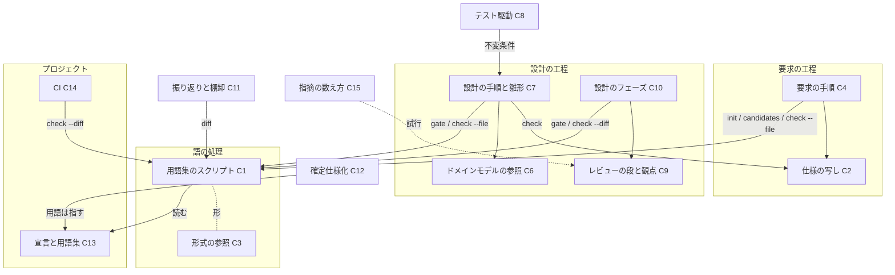
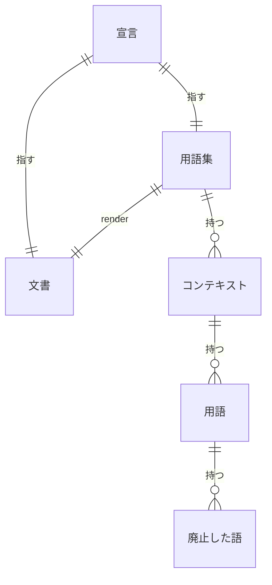

# #1111: プロジェクトのユビキタス言語を先に定めて設計する

要求と受け入れ条件は #1111 の本文にある（写しは [issue-1111-requirements.md](issue-1111-requirements.md)）。
この文書は「どう作るか」だけを扱う。#1117（`requirements-design` の仕様の置き場）も同じ設計で扱う。
設計は 2 本に分けた。

| ファイル | 持つ節 |
| --- | --- |
| この文書 | 具体例・ドメインモデル・機能一覧・構成要素・当てはまらない既存の規則・データ構造・入出力の契約 |
| [issue-1111-ubiquitous-language-design-decisions.md](issue-1111-ubiquitous-language-design-decisions.md) | 処理の流れ・非機能の実現方式・決定の記録・テスト設計・未確認のまま残ること |

**仕様の「対象範囲（含まない）」に無い省略はここに書く。** 画面と API の仕様記述（OpenAPI）は
作らない。呼び出される約束はコマンドと JSON のファイルだけで、その形は `interface-api.md` の
コマンドの表で書く。

## 具体例: 用語集の無いプロジェクトで #1111 のような要求を通す

ai-plugins には今、宣言も用語集も無い。この設計の後で、`standard` の課題を 1 つ通すと次のように動く。

| 時点 | 今 | この設計の後 |
| --- | --- | --- |
| 要求の工程に入る | 依頼を写し、受け入れ条件を書く | `glossary.py gate --mode standard` が終了コード 1 を返す。`glossary.py init` が `.ndf/glossary.json`・空の `docs/glossary/glossary.json`・`docs/glossary.md` を作る。`glossary.py candidates` が文書とコードから語の候補を出し、利用者が採った語だけを書く |
| 前提を書いた後 | — | ドメインイベントを時間の順に書き出す（「宣言が無いまま設計に入ろうとした」→「止めた」→「用語集を起こした」…）。例外の経路の抜けを前提か受け入れ条件へ足す |
| 受け入れ条件を書く前 | — | `glossary.py check --file <下書き>` が、要求の「用語」の節の語のうち用語集に無い 7 語を返す（ユビキタス言語・用語集・コンテキスト…）。採るか言い換えるかを決め、0 件にしてから条件を書く |
| 本文へ書く | 本文にファイルのパスだけを載せたことがある（#1117） | 要求の全文を課題の本文へ書く。`spec-copy.py write 1111 issues/issue-1111-requirements.md` が写しを作る |
| 設計の工程に入る | 何も確かめない | `supervise.py` の設計のフェーズの先頭の段と `design` の手順 0 が `glossary.py gate` を打つ。宣言があるので通る |
| 設計文書を書く | 機能一覧から書く | ドメインモデルの節（コンテキスト・集約と持ち主・不変条件・ドメインイベント・用語）を先に書く |
| 設計 PR のレビュー | 3 ラウンドとも同じ観点 | 1 ラウンド目はドメインモデルの節だけを見る（モデルの段）。2・3 ラウンド目は、確定したモデルを前提に詳細を見る。関門 1 は 1 回のまま |
| レビューの修正で新しい語を足す | 気づかない | 設計のフェーズの `glossary` の段と CI の `glossary.py check --diff` が、未登録の語と行を返して落ちる。同じ変更で用語集へ足し、`glossary.py render` で文書を作り直すと通る |
| 実装 | 受け入れ条件ごとにテスト | 加えて、設計の不変条件 1 つにつき、実装の前に失敗するテストを 1 つ書く |
| 振り返り | — | `glossary.py diff` が、その変更で足された語・廃止された語を返し、報告に載る |

**効果の基準は数え直した値にする。** 本文の 44 件・39 件を出した語の並びは残っていない。そこで
#742 の指摘を、この設計で決める語の並び（決定 10）で数え直した。次の設計 PR もこの並びで数える。

| 区分 | #742 の件数 |
| --- | ---: |
| 指摘（返信を除く） | 97 |
| 語・定義に当たるもの | 32 |
| 食い違いに当たるもの | 45 |

数えたのは 2026-09-25 で、`gh api repos/devbasex/ai-plugins/pulls/742/comments` の本文を使った。

## ドメインモデル

この節は、この設計が雛形に足す節を、この変更そのものに当てはめたものである。

### コンテキスト

| コンテキスト | 何の語が 1 つの意味に決まるか |
| --- | --- |
| プロジェクトの用語集（`project-glossary`） | 各プロジェクトが持つユビキタス言語。語・意味・コンテキスト・廃止した語・正本 |
| NDF の開発ワークフロー（`ndf-workflow`） | NDF が配る工程・関門・モード・段の語。`development-workflow/references/glossary.md` が持つ |

**2 つは公開された言語の関係にする。** NDF のスクリプトは、プロジェクトが書いた用語集を
宣言が指す形式（`references/glossary-format.md` の JSON）でだけ読む。用語集の中身の語は NDF の
語彙に入らず、NDF の語彙も用語集へ入らない（前提 6）。

### 集約

| 集約 | 持ち主（書き換えてよいもの） | 根 | エンティティ | 値オブジェクト |
| --- | --- | --- | --- | --- |
| 用語集 | プロジェクトの変更（Pull Request）。NDF のスクリプトは `init` と `render` だけが書く | 用語集のファイル（`source`） | コンテキスト（`id` で識別）・用語（コンテキストと語の組で識別） | 意味・廃止した語・正本 |
| 用語集の宣言 | プロジェクトの変更。`glossary.py init` が初めの 1 回を書く | `.ndf/glossary.json` | — | 形式・置き場・検査の対象・規則ごとの強さ |

**人が読む文書は集約に入れない。** 用語集から導く写しで、独立して変わらない（不変条件 I4）。

### 不変条件

| # | 集約 | 条件 | 破れたときの扱い |
| --- | --- | --- | --- |
| I1 | 用語集 | 同じコンテキストの中で、同じ語は 1 つの意味だけを持つ（コンテキストと語の組が一意） | `check` が `duplicate` で落とす |
| I2 | 用語集 | 廃止した語は、同じコンテキストの生きた語と重ならない | `check` が `schema` で落とす |
| I3 | 用語集 | 用語の `context` は、用語集が宣言したコンテキストの `id` を指す | `check` が `schema` で落とす |
| I4 | 用語集 | 人が読む文書は、用語集のファイルから `render` で作った内容と一致する | `check` が `stale_document` で落とす |
| I5 | 用語集の宣言 | 設計の工程を持つモード（`standard` / `legacy-refactor`）では、宣言と用語集が揃うまで設計の工程へ入らない | `gate` が終了コード 1 で止め、作る手順を出す |
| I6 | 用語集の宣言 | 語のチェックのスクリプトは、特定のプロジェクトの語を持たない。語はすべて用語集から読む | テストが、ai-plugins の語を 1 つも含まない用語集で全規則を通す |

### ドメインイベント

番号の `E` は要求の工程で書き出す一覧（`requirements-design` の新しい手順）と同じ形である。

| # | イベント | 発生元 | 受け手 |
| --- | --- | --- | --- |
| E1 | 宣言の無いまま設計に入ろうとした | `gate` | 利用者・conductor（作る手順を読む） |
| E2 | 用語集を起こした | `init` | 要求の工程（候補を集める） |
| E3 | 語を採った・足した | 利用者（用語集のファイルを直す） | `render` |
| E4 | 語の意味を変えた・語を廃止した | 利用者 | `render`・`diff` |
| E5 | 文書を作り直した | `render` | `check`（`stale_document`） |
| E6 | 未登録の語・廃止した語を書いた | 要求・設計の文書 | `check` |
| E7 | モデルの段を確定した | `cross-review` の 1 ラウンド目の修正 | 2 ラウンド目以降のレビュー |
| E8 | 変更が配られた | `merged` | 振り返り・`issue-upkeep`（`diff` を報告に載せる） |

### 用語

| 用語 | 意味 | 用語集への反映 |
| --- | --- | --- |
| 用語集の宣言 | `.ndf/glossary.json`。用語集の置き場・形式・検査の対象・規則ごとの強さを持つ | 追加（`ndf-workflow`） |
| 語のチェック | `glossary.py check`。用語集の形と、文書の追加した行の語を見る | 追加（`ndf-workflow`） |
| モデルの段 | 設計 PR のレビューの 1 ラウンド目。ドメインモデルの節だけを見る | 追加（`ndf-workflow`） |
| 詳細の段 | 設計 PR のレビューの 2 ラウンド目以降。確定したモデルを前提に残りを見る | 追加（`ndf-workflow`） |
| 仕様の写し | 課題の本文にある要求を、設計 PR と一緒にコミットする `issues/` のファイル | 追加（`ndf-workflow`） |

要求の「用語」の節の 7 語は、ai-plugins の用語集の初めの中身になる（構成要素 C13）。

## 機能一覧

| # | 機能 | 誰が使うか |
| --- | --- | --- |
| F1 | 宣言と用語集が無いまま設計の工程へ入るのを止め、作る手順を示す | `design` の手順 0・`supervise.py` の設計のフェーズ |
| F2 | 宣言・空の用語集・人が読む文書を作る | 要求の工程（`requirements-design`） |
| F3 | 既にあるリポジトリの文書とコードから語の候補を集める | 要求の工程 |
| F4 | 用語集から人が読む Markdown の文書を作る。作り直していない変更を見つける | 利用者・語のチェック |
| F5 | 用語集の形（1 語 1 意味・廃止した語の重なり・コンテキストの参照）を確かめる | 語のチェック |
| F6 | 文書の追加した行（またはファイル全体）の廃止した語・未登録の語を、語と行で返す | 要求・設計の工程・設計のフェーズ・CI |
| F7 | 2 つの版の間で、足された語・意味の変わった語・廃止された語・消えた語を返す | 振り返り・`issue-upkeep` |
| F8 | 要求の工程でドメインイベントを時間の順に書き出し、要求の抜けを探す | 要求の工程 |
| F9 | 設計文書の先頭にドメインモデルの節を書き、コンテキストをまたぐなら関係を 1 つ宣言する | `design` |
| F10 | 設計の不変条件 1 つにつき、実装の前に失敗するテストを 1 つ書く | `tdd-cycle` |
| F11 | 設計 PR のレビューを、モデルの段 → 詳細の段の 2 段で回す | `cross-review` |
| F12 | 要求の正を課題の本文にし、`issues/` の写しを作る・本文と食い違っていないかを確かめる | 要求の工程・`design` の手順 5 |
| F13 | 設計 PR のレビューの指摘を、語・定義と食い違いのキーワードで数える | 効果の測定（試行） |

## 構成要素

**語を扱う処理は 1 つのスクリプトに集める。** 入口の検査・文書の生成・語のチェック・差分は
同じ宣言と同じ用語集を読むため、読み方を 1 箇所に置く。

| # | 要素 | 置き場所 | 責務 | 新設か |
| --- | --- | --- | --- | --- |
| C1 | 用語集のスクリプト | `plugins/ndf/scripts/glossary.py` | 宣言と用語集の読み込み、`gate` / `init` / `candidates` / `render` / `check` / `diff` の 6 つの副命令 | 新設 |
| C2 | 仕様の写しのスクリプト | `plugins/ndf/scripts/spec-copy.py` | 課題の本文から写しを作る（`write`）。本文と写しの食い違いを返す（`check`） | 新設 |
| C3 | 用語集の形式の参照 | `plugins/ndf/skills/requirements-design/references/glossary-format.md` | 宣言と用語集の JSON の形、未登録の語とみなす規則、文書の形 | 新設 |
| C4 | 要求の工程の手順 | `plugins/ndf/skills/requirements-design/SKILL.md` | 手順 0（用語集を用意する）・手順 3a（ドメインイベント）・手順 3b（語の突き合わせ）を足す。手順 7 の置き場を課題の本文にする | 変更 |
| C5 | 仕様の雛形 | `plugins/ndf/skills/requirements-design/references/spec-template.md` | 「ドメインイベント」の節を足す。先頭の 1 行を「正は課題の本文」にする | 変更 |
| C6 | ドメインモデルの参照 | `plugins/ndf/skills/design/references/domain-model.md` | ドメインモデルの節の書き方、コンテキストマップの 5 つの関係、集約の 4 つの規則、エンティティと値オブジェクトの区別 | 新設 |
| C7 | 設計の手順と雛形 | `plugins/ndf/skills/design/SKILL.md`・`references/design-template.md`・`references/deliverables.md` | 手順 0（入口の検査）、ドメインモデルの節を雛形の先頭に置き最初に書かせる、7 つ目の突き合わせる対、手順 5 の写しの確かめ | 変更 |
| C8 | テスト駆動の手順 | `plugins/ndf/skills/tdd-cycle/SKILL.md` | 手順 1 で、設計の不変条件の一覧から 1 条件 1 テストを書かせる | 変更 |
| C9 | レビューの段と観点 | `plugins/ndf/skills/cross-review/scripts/classifications.py`・`state.py`・`launch-reviewer.sh`・`docs/04-contracts.md` | 設計 PR のラウンドをモデル / 詳細へ分け、段ごとの観点を渡す。詳細の観点に 3 項目を足す | 変更 |
| C10 | 設計のフェーズの計画 | `plugins/ndf/scripts/supervise.py` の `plan_mission_design` | 先頭に `glossary`（`gate`）の段、`review` の後に `glossary-check` と `fix-glossary` の段を足す | 変更 |
| C11 | 振り返りと棚卸の報告 | `plugins/ndf/skills/retrospective/SKILL.md`・`issue-upkeep/SKILL.md` | `glossary.py diff` の結果を報告の 1 節・1 行に載せる | 変更 |
| C12 | 確定仕様化の引き継ぎ | `plugins/ndf/skills/plan-to-spec/SKILL.md` | ドメインモデルの節の引き継ぎ先。用語は用語集を指し、写さない | 変更 |
| C13 | ai-plugins の宣言と用語集 | `.ndf/glossary.json`・`docs/glossary/glossary.json`・`docs/glossary.md` | 2 つのコンテキストと、要求の 7 語・この設計の 5 語 | 新設 |
| C14 | ai-plugins の CI | `.github/workflows/glossary.yml` | Pull Request ごとに `glossary.py check --diff` を打つ | 新設 |
| C15 | 指摘の数え方の試行 | `plugins/ndf/scripts/experimental/review-terms-count.py`・`docs/ndf-experiments.md` の 1 行 | 設計 PR の指摘を決定 10 の語の並びで数える | 新設（試行） |
| C16 | NDF の語彙 | `plugins/ndf/skills/development-workflow/references/glossary.md` | 「用語」の節の 5 語を足す | 変更 |



図に現れない C5（雛形）は C4 が、C16（語彙）は C1 の説明の置き場として読まれる。

### パッケージ・モジュール構成

```text
plugins/ndf/scripts/
├── glossary.py                      新設
├── spec-copy.py                     新設
├── supervise.py                     変更（plan_mission_design）
├── experimental/review-terms-count.py 新設（試行）
└── tests/
    ├── test_glossary.py             新設
    └── test_spec_copy.py            新設
plugins/ndf/skills/
├── requirements-design/references/glossary-format.md  新設
├── design/references/domain-model.md                  新設
└── cross-review/scripts/tests/test_review_stage.py    新設
.ndf/glossary.json                   新設（ai-plugins の宣言）
docs/glossary/glossary.json          新設（ai-plugins の用語集）
docs/glossary.md                     新設（render の出力）
.github/workflows/glossary.yml       新設
```

## 当てはまらない既存の規則

設計文書の節・触る領域の表・突き合わせる対・仕様の節・設計のフェーズの段・レビューの観点・
報告の項目へ値を足し、仕様の置き場を変える。それまでの値と置き場だけを想定した規則のうち、
当てはまらないものを変える。

| # | 規則 | 場所 | 当てはまらない理由 | 変え方 |
| --- | --- | --- | --- | --- |
| R1 | `light` / `operation` は「すべての変更」以外の領域が 1 つ当たれば `design` を通す | `design/SKILL.md` の手順 1 | ドメインモデルの行を領域の表に足すと、`light` / `operation` の起動が増える | 新しい行を「起動の条件に数えない」と明記する（受け入れ条件 20） |
| R2 | 突き合わせる対は 6 つ | `design/SKILL.md` の手順 4・`design-template.md` の同名の節 | 不変条件 ↔ テスト設計を足すと 7 つになる | 2 箇所の数を 7 に直す |
| R3 | テスト設計の表の左の列は受け入れ条件 | `design-template.md` の雛形 | 不変条件の行を置けない | 列名を「受け入れ条件・不変条件」にする |
| R4 | 各節が実装計画のどこへつながるかの表に 10 節 | `design-template.md` | ドメインモデルの節の行が無い | 「不変条件はテストのタスク、集約の持ち主は構成要素のタスクの境界」の行を足す |
| R5 | plan の「ドメイン用語」は定義をそのまま確定仕様へ残す | `plan-to-spec/SKILL.md` の引き継ぎの表 | 用語集のあるプロジェクトでは写しが 2 つ目の正になる | 宣言があれば用語集の文書を指し、定義を写さない。コンテキスト・集約・ドメインイベントの行を足す |
| R6 | 設計 PR も両席が APPROVE なら `approved` で抜ける | `cross-review/scripts/state.py` の判定 | モデルの段で抜けると詳細の段が回らない | モデルの段の APPROVE は抜けずに詳細の段へ進む（上限 3 は変えない） |
| R7 | レビュー観点は `init` で 1 度だけ組み立てる | `state.py` の `init`・`launch-reviewer.sh` | 段ごとに観点が変わる | 段ごとの観点を状態ファイルに持ち、ラウンドの段で選ぶ |
| R8 | 受け入れ条件 1 つに対してテスト 1 つ | `tdd-cycle/SKILL.md` の手順 1 | 不変条件のテストが入る先が無い | 不変条件 1 つにつき 1 つを足す |
| R9 | 仕様の置き場所は `issues/` 配下 | `requirements-design/SKILL.md` の手順 7 | 本文から中身が読めない（#1117） | 正を課題の本文にし、`issues/` は写しにする（決定 1） |
| R10 | 計画は仕様と同じファイルの別の節に置く | `implementation-plan/SKILL.md`・`requirements-design/SKILL.md` の手順 7 | 写しに計画の節が加わると本文と一致しなくなる | `spec-copy.py check` は本文の節だけを比べ、写しにしか無い節を許す |
| R11 | 独立した設計のファイルは仕様と同じ場所に置く | `design/references/deliverables.md` の「設計の書き先」 | 仕様の正は本文へ移る | 「仕様の写しと同じ場所」と書き直す |
| R12 | 振り返りの事実を集める観点・棚卸の完了報告の表 | `retrospective/SKILL.md`・`issue-upkeep/SKILL.md` | 用語集の変化の行が無い | 観点の表・雛形・完了報告の表に 1 行ずつ足す |
| R13 | 設計のフェーズは `design` → `pr` → `review` → `gate` の 4 段 | `supervise.py` の `plan_mission_design`・`plan_fast_design` とそのテスト | 入口の検査と語のチェックの段が無い | 段を足す（入出力の契約「設計のフェーズの段」）。fast は `review` の後の差し替え先を `glossary-check` にする |

## データ構造

**永続するのはプロジェクトのリポジトリに置く 3 つのファイルである。** 形の正本は C3
（`glossary-format.md`）に置き、ここではその中身を決める。



### 宣言（`.ndf/glossary.json`）

| 項目 | 型 | 空を許すか | 意味 |
| --- | --- | --- | --- |
| `version` | 整数 | 許さない | `1`。ほかの値は終了コード 2 |
| `format` | 文字列 | 許さない | 用語集の形式。今は `json` だけ。ほかの値は終了コード 2 |
| `source` | 文字列 | 許さない | 用語集のファイルのパス（リポジトリの根から） |
| `document` | 文字列 | 許さない | 人が読む文書のパス |
| `check.paths` | 文字列の配列 | 許す | 追加した行を見る文書の glob。空は「どの文書も語を見ない」（形と文書の一致は見る） |
| `check.term_sections` | 文字列の配列 | 許す | 未登録の語とみなす表を持つ節の見出し。無いときは `["用語"]` |
| `check.rules` | オブジェクト | 許す | 規則ごとの強さ。キーは `schema` / `duplicate` / `stale_document` / `deprecated` / `unregistered`、値は `error` か `off`。無いキーは `error` |

### 用語集（`source` が指すファイル）

| 項目 | 型 | 空を許すか | 意味 |
| --- | --- | --- | --- |
| `version` | 整数 | 許さない | `1` |
| `contexts[].id` | 文字列 | 許さない | コンテキストの識別子。用語集の中で一意 |
| `contexts[].name` | 文字列 | 許さない | 文書の見出しに使う名前 |
| `contexts[].meaning` | 文字列 | 許す | 何の語が 1 つの意味に決まる範囲か。空は「まだ書いていない」 |
| `terms[].term` | 文字列 | 許さない | 語 |
| `terms[].context` | 文字列 | 許さない | `contexts[].id` のどれか（I3） |
| `terms[].meaning` | 文字列 | 許さない | 意味 |
| `terms[].deprecated` | 文字列の配列 | 許す | 廃止した語（旧称）。空の配列と項目が無いことは同じ「廃止した語なし」 |
| `terms[].source` | 文字列 | 許す | 正本（その語の意味を決めている文書のパスか URL）。空は「用語集そのものが正本」 |

**語の一意性はコンテキストと語の組で決まる**（I1）。**ほぼ空の用語集**は `contexts` と `terms` が
空の配列のものを指し、`gate` は通す（受け入れ条件 3）。

**時系列は git の履歴で持つ。** 語の意味を上書きしても、前の意味はコミットに残り、`diff` が
2 つの版から「意味の変わった語」を取り出す。事象の記録を別に持たない理由は決定 5。

### 人が読む文書（`document` が指すファイル）

`render` だけが書く。形は次のとおりで、コンテキストごとに語・意味・廃止した語・正本を読める
（受け入れ条件 5）。

```markdown
# 用語集

この文書は `docs/glossary/glossary.json` から `glossary.py render` で作る。手で直さない。

## プロジェクトの用語集（`project-glossary`）

各プロジェクトが持つユビキタス言語。…

| 語 | 意味 | 廃止した語 | 正本 |
| --- | --- | --- | --- |
| 用語集 | ユビキタス言語を持つ構造化ファイル（正）と… | — | `issues/issue-1111-requirements.md` |
```

- コンテキストは用語集のファイルの順、語もファイルの順に並べる。並べ替えると、`render` の差分が
  ファイルの差分と対応しなくなる
- セルの中の `|` は `\|` に、改行は空白に置き換える

### CRUD 図

| 機能 | 宣言 | 用語集 | 文書 | 課題の本文 | 仕様の写し |
| --- | --- | --- | --- | --- | --- |
| F1 入口の検査 | R | R | — | — | — |
| F2 起こす | C | C | C | — | — |
| F3 候補を集める | R | R | — | — | — |
| F4 文書を作る | R | R | U | — | — |
| F5・F6 語のチェック | R | R | R | — | — |
| F7 差分 | R | R（2 つの版） | — | — | — |
| F12 写し | — | — | — | R | C / R |

**書く相手が 2 つ以上あるのは F2 だけである。** 3 つのファイルは同時に作らないと `gate` と
`check` が通らないため、分けない。

## 入出力の契約

### `glossary.py`

**6 つの副命令の結果は、既存の手順のスクリプトと同じ 1 行の JSON（`lib/step_result.py`、
`tool: "glossary"`）で標準出力の最後の行に出す。** 語と行の一覧は `items` に入る。`--root` の既定は
`.`、宣言はそこの `.ndf/glossary.json` から読む。

| 副命令 | 入力 | 出力（`items`） | 終了コード |
| --- | --- | --- | --- |
| `gate --mode M` | モード | 止めたときは作る手順の 3 行（`init` のコマンド・候補の集め方・`requirements-design` の手順 0 の場所） | 0 = 通す（`M` が `standard` / `legacy-refactor` 以外、または宣言と用語集が読める）。1 = 宣言か用語集が無い。2 = あるが読めない |
| `init [--source P] [--document P]` | 置き場（既定 `docs/glossary/glossary.json`・`docs/glossary.md`） | 作ったファイル | 0 = 作った、または既にある（上書きしない）。2 = 書けない |
| `candidates [--limit N]` | 追跡しているファイル（`git ls-files`） | `{term, count, kind, first}`。`kind` は `table`（`term_sections` の節の表の 1 列目）・`bold`（12 字以下の太字で 3 回以上）・`type`（`class` / `interface` / `struct` / `enum` / `type X =` の型の名前）。用語集に既にある語は除く | 0。候補が 0 件なら `summary` に「スクラッチ」と書く |
| `render [--check]` | 用語集 | 書いた文書。`--check` は書かずに一致を見る | 0 = 書いた・一致した。1 = `--check` で一致しない。2 = 読めない |
| `check [--diff BASE \| --file P...] [--rules all\|structure]` | 起点の ref か、ファイル | `{rule, path, line, term, detail}`。`rule` は宣言の `check.rules` のキー | 0 = 当たりなし（`off` の規則は数えない）。1 = 当たりあり。2 = 宣言・用語集が読めない。宣言が無ければ 0 で `summary` に「宣言が無い」 |
| `diff --base REF [--head REF]` | 2 つの版（`--head` の既定は作業ツリー） | `{change, context, term, before, after}`。`change` は `added` / `meaning_changed` / `deprecated` / `removed` | 0。どちらかの版に用語集が無ければ、無い側を空として比べる |

**`check` の規則。** `--rules structure` は上の 3 つだけ、`all` は 5 つすべてを見る。

| 規則 | 見るもの | 当たる条件 |
| --- | --- | --- |
| `schema` | 用語集 | 必須の項目が無い・I2・I3・1 文字の廃止した語（照合できない） |
| `duplicate` | 用語集 | I1 |
| `stale_document` | 文書 | I4（`render --check` と同じ） |
| `deprecated` | 追加した行（`--file` ならファイル全体） | 廃止した語が現れ、どのコンテキストでも生きた語ではない |
| `unregistered` | 追加した行のうち `term_sections` の節の表の 1 列目 | 生きた語としてどのコンテキストにも無い |

- **未登録の語とみなすのは、見出しが `term_sections`（既定 `用語`）の節の表の 1 列目だけである。**
  要求の「用語」の節と、設計のドメインモデルの節の「用語」の小見出しがこれに当たる（決定 3）
- 照合から外すもの: コードブロック・インラインコード・宣言の `document` の文書。廃止した語を
  説明のために書くときはインラインコードで囲む
- 廃止した語の出現が、生きた語の出現の内側にあるとき（`ステージ` と `ステージング`）は当てない
- 英数字だけの語は単語の境界（`\b`）で照合する
- `--diff` の追加した行の求め方は `doc-lint.py` の `added_lines` と同じにする。`merge-base` からの
  `--unified=0` で求め、追跡していないファイルは全行とする。見るのは `check.paths` に当たるファイルだけである
- 当たりは標準エラーへも `ERROR: <path>:<line>: <rule>: <term>` の 1 行ずつで出す

### `spec-copy.py`

| 副命令 | 入力 | 出力 | 終了コード |
| --- | --- | --- | --- |
| `write <課題> <ファイル>` | 課題の本文（`gh issue view --json body`） | 先頭の見出しと「正は課題の本文」の 1 行、本文の `## 進行` より前の全文を書く | 0 = 書いた。2 = 本文を読めない |
| `check <課題> <ファイル>` | 本文と写し | 食い違う節の見出しと差分（`items`） | 0 = 本文の各節（`## 進行` を除く）が写しに同じ中身である。1 = 無い節か中身の違う節がある。2 = 読めない |

**写しにしか無い節は許す**（R10）。比べるのは本文にある節だけで、行末の空白と節の後ろの空行は
比べない。

### 設計のフェーズの段（`plan_mission_design`）

| 段 | 種類 | 中身 | 遷移 |
| --- | --- | --- | --- |
| `glossary` | run | `glossary.py gate --mode {モード}` | 0 → `design`。0 以外は `on_fail` を置かず止まる（作る手順は段の結果の `summary` に載る） |
| `design` | work | 今と同じ | `pr` |
| `pr` | pr | 今と同じ | `review` |
| `review` | drive | 今と同じ（段の分け方は cross-review の中で決まる） | `glossary-check` |
| `glossary-check` | run | `glossary.py check --diff origin/{base}` | 0 → `push-glossary`。1 → `fix-glossary` |
| `fix-glossary` | work | 当たった語を用語集へ足すか言い換え、`render` してコミットする（push しない）。利用者が採るかを決めるべき語は直さずに「判断が要る」と報告する | `glossary-recheck` |
| `glossary-recheck` | run | `glossary-check` と同じ | 0 → `push-glossary`。1 → `push-glossary`（当たりは段の結果に残る） |
| `push-glossary` | run | `git push -q`（直しが無ければ何も送らない） | `gate`（fast は `mvv`） |
| `gate` | judge | 今と同じ。`glossary-recheck` の結果を `inputs` に足し、当たりが残っていれば関門 1 の提示に載せる | 今と同じ |

**直しは 1 回だけ試す。** 残った当たりは、語を採るかという利用者の判断であることが多く、
往復させても減らない。

### レビューの段（`cross-review`）

| 項目 | 形 |
| --- | --- |
| 段を決める関数 | `classifications.review_stage(kind, round_no, has_model) -> "model" \| "detail" \| None`。`design` かつ 1 ラウンド目かつ `has_model` なら `model`、ほかの `design` は `detail`、`code` は `None` |
| `has_model` | `init` が決める。変更した設計文書（`-design.md` / `-design-decisions.md`）のどれかに見出し `## ドメインモデル` があれば真 |
| 状態ファイル | `design_has_model`（真偽）・`review_instructions_by_stage`（`{"model": 文字列, "detail": 文字列}`）・ラウンドごとの `rounds[].stage` |
| 担当へ渡す観点 | `launch-reviewer.sh` がそのラウンドの段の文字列を「追加レビュー観点」へ差し込む。`review_instructions_by_stage` が無い状態ファイル（再開）は今の `review_instructions` を使う |
| 抜ける条件 | `model` のラウンドの APPROVE では抜けない。`detail` のラウンドは今と同じ |

段ごとの観点の中身は流れの文書の「レビューの 2 段」にある。
