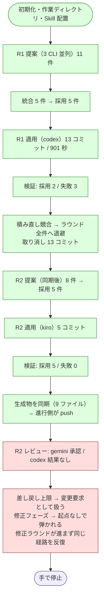

# cross-refactoring 4 回目の実機試行の結果

Pull Request #127（NDF v8.5.0）で直した 5 件を実機で確かめた記録である。
対象は Pull Request #128（Draft のまま閉じた）。

経緯は次の 3 つにある。

- [issue-113-cross-refactoring-trial-report.md](issue-113-cross-refactoring-trial-report.md) — 1 回目
- [issue-113-cross-refactoring-retrial.md](issue-113-cross-refactoring-retrial.md) — 2 回目
- [issue-113-cross-refactoring-re-retrial.md](issue-113-cross-refactoring-re-retrial.md) — 3 回目

## 結果

**3 回目に見つけた 4 件のうち、実機で踏める 3 件は直っていた。**
一方でラウンド 2 の再レビューで**進行が終わらない経路**に入り、手で止めた。
原因は 3 回目より前から存在した欠落で、レビュー結果が 2 回続けて欠けたときにだけ現れる。

## 実行条件

| 項目 | 値 |
| --- | --- |
| ホスト | Claude Code（提案・レビューには不参加） |
| 提案・レビュー | codex / gemini / kiro |
| 適用の母集合 | claude / codex / kiro |
| 使用する版 | プラグインキャッシュの v8.5.0 |
| ラウンド上限 | 3（実際は 2 ラウンド目で停止） |
| 着手前のテスト | 463 passed |

```bash
/ndf:cross-refactoring 128 \
  --scope plugins/ndf-shared/skills/cross-refactoring/scripts \
          plugins/ndf-shared/skills/cross-refactoring/tests \
          plugins/ndf-shared/skills/cross-review/scripts/lib \
          plugins/ndf-shared/skills/cross-review/tests \
  --sync-command "bash scripts/build-runtime-plugins.sh" \
  --baseline-test "uv run --with pytest python -m pytest \
      plugins/ndf-shared/skills/cross-refactoring/tests \
      plugins/ndf-shared/skills/cross-review/tests -q" \
  --max-outer-rounds 3
```

## 到達点



## v8.5.0 の修正の確認

| # | 直したこと | 観測 | 判定 |
| --- | --- | --- | --- |
| 12 | 生成物の同期コミット | `🔧 生成物を同期しました（bash scripts/build-runtime-plugins.sh / 9 ファイル）` が出て、`Chore: 生成物を同期する（cross-refactoring 進行側）` が push まで届いた | 成立 |
| 13 | 同期の後段の失敗 | 実機では後段が落ちなかったため未到達。旧版と新版を並べた再現で確認した（下記） | 別手段で確認 |
| 14 | 実装担当のコミット | 適用フェーズで codex / kiro とも手順書どおりコミットを作れた。作業ツリーに残骸は出なかった | 成立 |
| 15 | 見送り後の読み取り同期 | ラウンド 1 の全件取り消しで HEAD が `4642657` → `a66ed1e` へ動いた後、提案の直前に読み取り用 3 つとも `a66ed1e` へ同期された。ラウンド 2 の提案は消えた関数を 1 件も指していない | 成立 |

修正 13 は実機で踏めなかったため、`pre-commit` で `git commit` を必ず落とす作業ツリーを
作り、旧版と新版で `_sync_generated` を呼び分けて比べた。

| 版 | 中断後の作業ツリー |
| --- | --- |
| 8.3.0 | `' M generated.txt'` が残る |
| 8.5.0 | 空（`reset --hard` と `clean -fd` で戻る） |

修正 12 も同じ方法で、旧版が `_worktree_changes()` から `{'enerated.txt': 'M '}` を返して
`git add` が `pathspec ... did not match any files` で落ちること、新版が
`{'generated.txt': ' M'}` を返して通ることを確認した。

## 見つけた不具合

### 16. レビュー結果が欠け続けると進行が終わらない

**進行が止まらない。** レビュー結果が 2 回続けて欠けた後、修正フェーズと再レビューを
無限に往復する。実測ではラウンド 2 で 3 巡し、手で停止するまで終わらなかった。

`cmd_judge_review` には変更要求を返す出口が 2 つある。

| 出口 | `fix_base_sha` の記録 |
| --- | --- |
| 通常の変更要求 | する |
| 差し戻しの上限に達したため変更要求として扱う | **しない** |

`cmd_merge_fix` は `commits_in_range(work, entry.get("fix_base_sha"), head)` で修正の
範囲を求め、起点が空なら `None` が返る。範囲を確定できないので終了コード 2 で弾かれるが、
このとき `fix_rounds` は増えない。`cmd_should_abandon` は `fix_rounds` が上限に達したかで
見送りへ移るため、**上限に永久に到達しない**。

```
修正ラウンド 0 / 3 — まだ修正します
❌ 修正の範囲を確定できませんでした（起点 None / HEAD 0b45dc9...）。検証できない修正は採りません
===== レビュー =====
（以降くり返し）
```

この欠落は v8.5.0 で入ったものではない。v8.3.0 でも同じ位置にあり、レビュー結果が
2 回続けて欠ける条件を過去 3 回の試行が満たさなかったため現れていない。

**直し方**: 差し戻し上限の出口でも `fix_base_sha` を記録する。あわせて、
`merge-fix` が範囲を確定できずに終わったときも `fix_rounds` を進め、見送りへ到達させる。

### 17. 実装担当に直せない指摘が渡る

レビュー結果の欠落は、`findings` へ次の 1 件として記録される。

```json
{"reviewer": "cross-refactoring", "item_id": null,
 "summary": "レビュー結果の形式が 2 回続けて不正だった: codex のレビュー結果がありません",
 "resolved": false}
```

対象の改善項目が無く、コードのどこを直せば解決するのかも書かれていない。実装担当は
これを受け取っても何もできず、修正フェーズが空回りする。不具合 16 を直しても、
承認済みの項目が「レビュー担当が動かなかった」という理由だけで見送りへ進む。

**直し方**: レビュー担当が結果を残さなかったことは、実装担当への変更要求ではなく
**進行側の問題**として扱う。片方の結果が欠けたまま上限に達したら、残る 1 者の判定で
決めるか、進行を中断して利用者に判断を渡す。

## 運用上の観測

| 事象 | 内容 |
| --- | --- |
| codex がレビュー結果を残さない | ラウンド 2 で 3 回とも、手順書を読み進めた後に何も投稿せず終了した。`sentinel` は書かれるため監視は「完了」と見なし、`result.json` の不在だけが手掛かりになる |
| 差分予算による失敗 | ラウンド 1 の 2 件が予算超過で落ちた（265 行 / 240 行、183 行 / 180 行）。`long_method` の抽出は見積より膨らみやすい |
| 積み直しの競合 | ラウンド 1 は同じファイルの隣接行を触る項目が重なり、3 回目と同じくラウンド全件へ退避した |

## 集計

| 実装担当 | 担当R | 適用 | 見送り | 予算超過率 | 所要秒 |
| --- | ---: | ---: | ---: | ---: | ---: |
| codex / default | 1 | 0 | 5 | 0.40 | 1800 |
| kiro / default | 1 | 0 | 0 | — | 320 |

| レビュー担当 | レビュー回数 | 指摘 | 所要秒 |
| --- | ---: | ---: | ---: |
| codex / default | 0 | 0 | 0 |
| gemini / default | 3 | 0 | 480 |
| kiro / default | 0 | 0 | 0 |

kiro は既定モデル（auto）で動いたため、両ラウンドとも比較用の集計から分離された。
1 回の実行内の値なので、ランタイムの優劣を読む材料にはならない。
