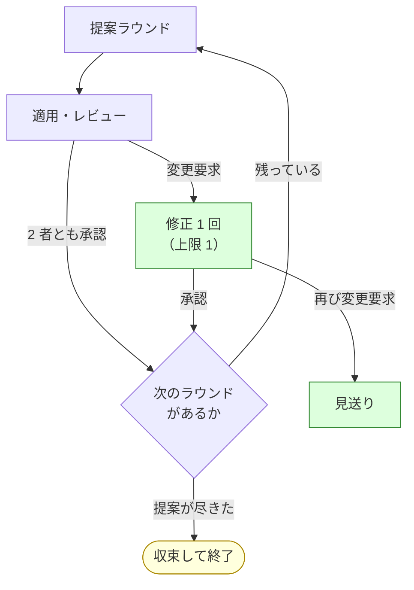
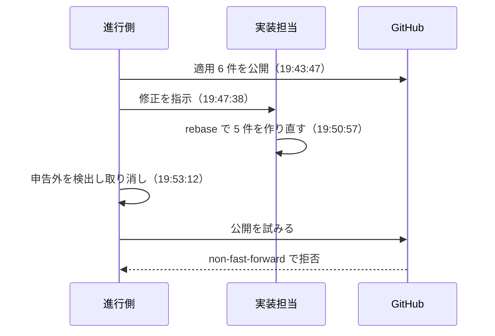

# cross-refactoring 7 回目の実機試行の結果

NDF v8.6.0（Pull Request #138）で変えたコミット粒度と改修計画の書き出しを実機で確かめた記録である。
対象は [devbase](https://github.com/devbasex/devbase) の Pull Request #121。

計画は [issue-113-cross-refactoring-7th-trial.md](issue-113-cross-refactoring-7th-trial.md) にある。
経緯は 1〜6 回目の記録にある。

## 結果

**v8.6.0 で変えた 3 点はいずれも成立し、未到達だった 3 経路のうち 2 つへ到達した。**
提案ラウンド 4 で新しい不具合を 1 件見つけ、進行はそこで中断した。

所要は 113 分（初期化から中断まで）。提案ラウンドは上限 6 のうち 4 まで進んだ。

| 区分 | 件数 |
| --- | ---: |
| 提案（重複排除後） | 26 |
| 採用 | 19 |
| Pull Request に残った改善項目 | 10 |
| 見送り | 9 |

中断の直接の原因は、実装担当が公開済みのコミットを作り直したことである。進行側は
`--force` を使わない設計のため、履歴が分かれた時点で公開できなくなる。

## 実行条件

| 項目 | 値 |
| --- | --- |
| ホスト | Claude Code（提案・レビューには不参加） |
| 提案・レビュー | codex / gemini / kiro |
| 適用の母集合 | claude / codex / kiro |
| 使用した版 | プラグインキャッシュの v8.6.0 |
| kiro のモデル | `claude-sonnet-5` |
| ラウンド上限 | 6（4 まで到達） |
| 修正の上限 | 1 |
| 生成物の同期 | 指定なし（devbase は生成物を持たない） |
| 着手前のテスト | 1474 passed / 1 skipped（33.9 秒） |

```bash
/ndf:cross-refactoring 121 \
  --scope lib/devbase/volume lib/devbase/snapshot tests/volume tests/snapshot \
  --model kiro=claude-sonnet-5 \
  --baseline-test "uv run --group dev python -m pytest -q" \
  --max-outer-rounds 6 --max-fix-rounds 1
```

分岐元は `462b6e5` とした。試行時点の `main` の先頭 `678baeb` はコンテナ設定のテストが
1 件失敗するため、その 1 つ前を使った。対象範囲の 4 パスは `678baeb` と同一である。

```console
$ git diff --stat 6702c16..origin/main -- lib/devbase/volume lib/devbase/snapshot \
      tests/volume tests/snapshot
（出力なし）
```

## 経過時間

### 全体

初期化から中断までを 113 分 24 秒（17:59:49〜19:53:13）で通した。

| ラウンド | 実装担当 | 開始 | 所要 | 提案 | 適用 | 進行側の検証 | レビュー | 修正 |
| ---: | --- | --- | ---: | ---: | ---: | ---: | ---: | ---: |
| 1 | codex | 17:59:49 | 30 分 20 秒 | 231 秒 | 544 秒 | 246 秒 | 1935 秒 | 300 秒 |
| 2 | kiro | 18:30:09 | 34 分 06 秒 | 163 秒 | 861 秒 | 312 秒 | 956 秒 | 480 秒 |
| 3 | claude | 19:04:15 | 23 分 14 秒 | 283 秒 | 626 秒 | 237 秒 | 380 秒 | — |
| 4 | codex | 19:27:29 | 25 分 44 秒 | 263 秒 | 482 秒 | 223 秒 | 680 秒 | 540 秒 |

提案は 3 者を並列で起動するため、最も遅い 1 者の所要がそのままラウンドの待ち時間になる。
レビューと修正は状態ファイルの集計値で、再レビューを含む合計である。

### フェーズごとの実測

各 CLI プロセスの所要は次のとおり。同じ担当が同じフェーズを 2 回実行した場合は、
後の実行だけがファイルに残る。

| ラウンド | 提案 codex | 提案 gemini | 提案 kiro | 適用 | レビュー 1 | レビュー 2 |
| ---: | ---: | ---: | ---: | ---: | ---: | ---: |
| 1 | 111 秒 | 120 秒 | 231 秒 | 544 秒 | gemini 218 秒 | kiro 307 秒 |
| 2 | 121 秒 | 163 秒 | 126 秒 | 861 秒 | codex 150 秒 | gemini 79 秒 |
| 3 | 127 秒 | 129 秒 | 283 秒 | 626 秒 | codex 111 秒 | kiro 236 秒 |
| 4 | 122 秒 | 263 秒 | 175 秒 | 482 秒 | gemini 81 秒 | kiro 218 秒 |

修正フェーズは 4 回のうち 3 回発生し、163 秒（ラウンド 1）・286 秒（ラウンド 2）・
297 秒（ラウンド 4）だった。

### コミットごとの間隔

実装担当がコミットを積んだ間隔である。時刻は author date を使う。ラウンド 2 以降の
取り消しと積み直しで committer date は書き換わるが、author date は作業時刻を保つ。

| ラウンド 1（codex） | 時刻 | 前からの間隔 |
| --- | --- | ---: |
| 適用開始 | 18:03:52 | — |
| R1-001 現状固定テスト | 18:04:48 | 56 秒 |
| R1-001 実装 | 18:06:08 | 80 秒 |
| R1-002 | 18:08:34 | 146 秒 |
| R1-003 | 18:09:27 | 53 秒 |
| R1-004 現状固定テスト | 18:09:45 | 18 秒 |
| R1-004 実装 | 18:10:30 | 45 秒 |
| R1-005 | 18:11:57 | 87 秒 |
| 適用終了 | 18:12:56 | 59 秒 |

| ラウンド 2（kiro） | 時刻 | 前からの間隔 |
| --- | --- | ---: |
| 適用開始 | 18:32:57 | — |
| R2-001 | 18:36:40 | 223 秒 |
| R2-002 現状固定テスト | 18:37:02 | 22 秒 |
| R2-002 実装 | 18:37:52 | 50 秒 |
| R2-003 現状固定テスト | 18:39:44 | 112 秒 |
| R2-003 実装 | 18:41:07 | 83 秒 |
| R2-004 現状固定テスト | 18:42:52 | 105 秒 |
| R2-004 実装 | 18:44:09 | 77 秒 |
| R2-005 現状固定テスト | 18:45:36 | 87 秒 |
| R2-005 実装 | 18:46:41 | 65 秒 |
| 適用終了 | 18:47:18 | 37 秒 |

| ラウンド 3（claude） | 時刻 | 前からの間隔 |
| --- | --- | ---: |
| 適用開始 | 19:09:03 | — |
| R3-001 | 19:12:02 | 179 秒 |
| R3-002 | 19:13:09 | 67 秒 |
| R3-003 現状固定テスト | 19:14:20 | 71 秒 |
| R3-003 実装 | 19:15:31 | 71 秒 |
| R3-004 | 19:17:02 | 91 秒 |
| R3-005 現状固定テスト | 19:17:34 | 32 秒 |
| R3-005 実装 | 19:18:33 | 59 秒 |
| 適用終了 | 19:19:29 | 56 秒 |

| ラウンド 4（codex） | 時刻 | 前からの間隔 |
| --- | --- | ---: |
| 適用開始 | 19:32:02 | — |
| R4-001 | 19:33:17 | 75 秒 |
| R4-002 | 19:35:01 | 104 秒 |
| R4-003 現状固定テスト | 19:36:11 | 70 秒 |
| R4-003 実装 | 19:37:09 | 58 秒 |
| R4-004 現状固定テスト | 19:38:10 | 61 秒 |
| R4-004 実装 | 19:39:16 | 66 秒 |
| 適用終了 | 19:40:04 | 48 秒 |

1 コミットあたりの間隔は 18〜223 秒で、中央値は 71 秒である。現状固定テストと実装を
分ける項目では、テスト側のほうが短い傾向がある（18〜112 秒 / 45〜83 秒）。

### 進行側の検証にかかる時間

進行側は申告されたコミットを 1 つずつ検証し、そのたびにテストを実行する。

| ラウンド | コミット数 | 検証の所要 | 1 コミットあたり |
| ---: | ---: | ---: | ---: |
| 1 | 7 | 246 秒 | 35.1 秒 |
| 3 | 7 | 237 秒 | 33.9 秒 |
| 4 | 6 | 223 秒 | 37.2 秒 |

テスト 1 回が 33.9 秒なので、**検証はコミットごとに 1 回**である。ラウンド 2 は
予算超過による取り消しを含むため、単純な比較から外した。

## 到達した経路

計画で挙げた 3 経路のうち 2 つへ到達した。



| 経路 | 結果 | 観測されたラウンド |
| --- | --- | --- |
| 修正フェーズ（`merge-fix`） | 到達 | 1 / 2 / 4 |
| 修正上限からの見送り（`abandon-items`） | 到達 | 1 |
| 提案の収束（`no_more_proposals`） | 未到達 | — |

修正フェーズは、取り込みに成功した場合（ラウンド 2）と、コミットが手順を満たさず
範囲ごと取り消した場合（ラウンド 1 と 4）の両方を観測した。

提案の収束には届かなかったが、提案の件数は減っている。範囲 1,189 行に対して
ラウンドあたりの重複排除後の件数は 9 → 5 → 8 → 4 と推移した。

## v8.6.0 で変えた 3 点

| # | 変えたこと | 結果 |
| --- | --- | --- |
| 22 | 1 改善項目 = 1 コミット | 成立。採用 19 件に対しコミット 30 件で、内訳は 1 コミットが 8 件、現状固定テストを伴う 2 コミットが 11 件 |
| 23 | 改修計画を差分へ残す | 成立。`issues/refactoring-plan-rf121.md`（20,257 バイト）が Pull Request の差分に現れ、採用した項目の理由と手順が読める |
| 24 | テストは項目の単位で 1 回 | 成立。進行側の実行回数はコミット数と一致し、1 コミットあたり 33.9〜37.2 秒だった |

確認項目 24 について、6 回目は 44 手に対して 88 回のテスト実行が発生していた。7 回目は
ラウンド 1・3・4 の合計 20 コミットに対して 20 回である。手ごとの実行を実装担当へ
求めない形にしたことで、実行回数がコミット数に一致した。

## 見つかった不具合

### 実装担当が公開済みのコミットを作り直すと、進行側が公開できなくなる

**事象**: ラウンド 4 の修正フェーズで実装担当（codex）が `git rebase -i` を使い、
公開済みのコミット 5 件を同じ内容の別コミットとして作り直した。進行側はこれを
「どの申告にも含まれていない修正コミット」として検出し、範囲を取り消したが、
その後の公開が `non-fast-forward` で拒否され、進行が中断した。



**証拠**: 作り直された 5 件は committer date が 1 秒に揃い、author date は元の作業時刻を保つ。

```console
$ git log --format="%h %ad %cd %s" --date=format:'%H:%M:%S' -6
db2f06d 19:35:01 19:50:57 Refactor: introduce_named_constant - ...
66470d3 19:36:11 19:50:57 Test: characterize depends_on scaling - ...
7da6b31 19:37:09 19:50:57 Refactor: introduce_value_object - ...
123980b 19:38:10 19:50:57 Test: characterize snapshot copy metadata - ...
332e24c 19:39:16 19:50:57 Refactor: extract_method - ...
```

修正フェーズの実行ログには、書き換えに使ったコマンドが残っている。

```console
$ grep -o -E "git (rebase -i|commit --fixup)" codex-fix-r4-err.log | sort | uniq -c
      2 git rebase -i
      1 git commit --fixup
```

**結果として残った状態**: 作業ディレクトリと GitHub 側で履歴が分かれた。

```console
$ git rev-list --left-right --count HEAD...origin/refactor/cross-refactoring-7th
13	6
```

分岐点は `0d700bc`（ラウンド 4 の 1 件目）である。GitHub 側には検証を通していない
ラウンド 4 の変更が残り、作業ディレクトリ側にはそれを取り消した状態がある。
「検証を通っていない変更を公開しない」という設計方針が、この状態では保てない。

**原因**: 実装担当への指示は「push しない」までを定めており、既存コミットの
書き換えについては触れていない。修正フェーズのプロンプトを確認した結果は次のとおり。

```console
$ grep -c -E "rebase|amend|fixup|履歴を書き換え" codex-fix-r4-prompt.md
0
```

**直し方の候補**:

1. 実装担当への指示へ「既存のコミットを書き換えない（`rebase` / `commit --amend` /
   `commit --fixup` を使わない）」を加える。適用フェーズと修正フェーズの両方に要る
2. 公開の前に作業ディレクトリと GitHub 側の分岐を検出し、分岐していたら原因を示して
   中断する。git のメッセージは「ブランチが remote より後ろにある」と伝えるため、
   実態（履歴が分かれている）と読みが合わない
3. 申告外のコミットを検出した時点で、取り消しではなく公開済みの状態への復旧を行う

### 修正フェーズのコミット規約が、適用フェーズより弱い書き方になっている

**事象**: ラウンド 1 の修正で、実装担当（codex）のコミットにトレーラー 3 つ
（`Item-Id` / `Round` / `Impl-Runtime`）が欠け、修正ラウンドの範囲が取り消された。

**原因**: 同じ内容を、適用フェーズは行動の指示として、修正フェーズは検証の説明として
書いている。

| フェーズ | 書き方 |
| --- | --- |
| 適用 | コミットメッセージの本文末尾に、git のトレーラー形式で実行主体を残します |
| 修正 | 適用と同じ基準で検証します。トレーラー 4 つが揃い、各コミットでテストが成功していることが必要です |

どちらもテンプレートは示している。修正フェーズの側を、適用フェーズと同じ「こう書く」の
形へ揃えると、指示として読みやすくなる。

### 差分予算が、見積の小さい項目で足りない

**事象**: 予算超過による失敗が 3 件あり、うち 2 件は 5 行以内の差だった。

| 項目 | 手法 | 見積 | 倍率 | 予算 | 実差分 | 超過 |
| --- | --- | ---: | ---: | ---: | ---: | ---: |
| R2-004 | `consolidate_duplication` | 35 | 3 | 105 | 110 | +5 |
| R2-005 | `extract_method` | 40 | 3 | 120 | 185 | +65 |
| R3-005 | `propagate_exception` | 25 | 2 | 50 | 54 | +4 |

v8.5.4 は抽出系の 7 手法を倍率 3 にすることで対応した。7 回目の実測では、倍率 3 を
適用した R2-004 と、倍率 2 の R3-005 が、どちらも数行の差で落ちている。

固定費（呼び出し側の書き換え・import の追加・引数の受け渡し）は見積の大きさに
比例しないため、倍率だけでは見積の小さい項目を救えない。予算へ絶対値の下駄を
加える形（`見積 × 倍率 + 20 行` など）が実態に近い。R2-005 は 1.54 倍の超過なので、
下駄を加えても失敗のまま残る。

## 参加ランタイムの記録

比較として読むときの限界は集計出力に記したとおりで、ラウンド数が少ないため差は
偶然に左右される。

| 実装担当 | 担当ラウンド | Pull Request に残った件数 | 見送り | 予算超過率 | 所要秒 |
| --- | ---: | ---: | ---: | ---: | ---: |
| claude / default | 1 | 4 | 1 | 0.20 | 567 |
| codex / default | 2 | 0 | 2 | 0.00 | 1916 |
| kiro / claude-sonnet-5 | 1 | 3 | 2 | 0.40 | 1380 |

codex の残存件数が 0 なのは、担当した 2 ラウンドがどちらも中断または未完了の状態で
終わったためである。ラウンド 1 は 3 件、ラウンド 4 は 4 件が適用まで進んでいる。

| レビュー担当 | 回数 | 指摘 | 判定一致率 | 所要秒 |
| --- | ---: | ---: | ---: | ---: |
| codex / default | 3 | 0 | 0.67 | 656 |
| gemini / default | 5 | 2 | 0.40 | 895 |
| kiro / claude-sonnet-5 | 4 | 5 | 0.50 | 2400 |

指摘の内容は具体的だった。ラウンド 1 で kiro が返した指摘は、共通化した処理が
空白を含むキーの扱いを変えることを指し、現状固定テストで捕まえられていない点まで
述べている。この指摘により、振る舞いが変わる項目 1 件が Pull Request から外れた。

## 対象リポジトリの前提の持ち込み

計画の目的 3 に挙げた「Skill が自分のリポジトリの前提を持ち込んでいないこと」は、
生成物を持たない構成で 4 ラウンド動いたことで確認できた。

| 確認したこと | 結果 |
| --- | --- |
| 生成物の同期を指定しない構成 | 進行側の同期コミットは積まれず、改修計画のコミットだけが積まれた |
| 改修計画の既定の置き場所 | `issues/` が既にあるリポジトリで、既定のパスがそのまま使えた |
| テスト 1 回が 33.9 秒の構成 | 既定の上限 900 秒に収まり、打ち切りは起きなかった |

## 未確認の経路

| 経路 | 状態 | 次にやると確認できること |
| --- | --- | --- |
| 提案の収束 | 未到達 | ラウンド上限を使い切るまで進めるか、範囲をさらに絞る |
| 投稿の失敗（`post_error`） | 未確認 | 計画に記した `gh` のラッパーで、レビュー投稿だけを失敗させる |
| 他者の Pull Request | 未確認 | 別の利用者が作成した Pull Request が要る。devbase の直近 30 件は同一の作成者である |

## 残った状態

Pull Request #121 は Draft のままで、GitHub 側にはラウンド 4 の変更が残っている。
作業ディレクトリ（`/tmp/ndf-worktrees/devbasex--devbase/rf121/work`）には、それを
取り消した状態と状態ファイルがある。再開する場合は履歴の分岐を先に解消する必要がある。

devbase の `main` の先頭 `678baeb` でコンテナ設定のテストが 1 件失敗する件は、
この試行とは別に残っている。

```console
$ uv run --group dev python -m pytest -q
FAILED tests/containers/test_tmux_conf.py::test_terminal_overrides_appends_without_dropping_defaults
1 failed, 1481 passed, 1 skipped in 38.59s
```
