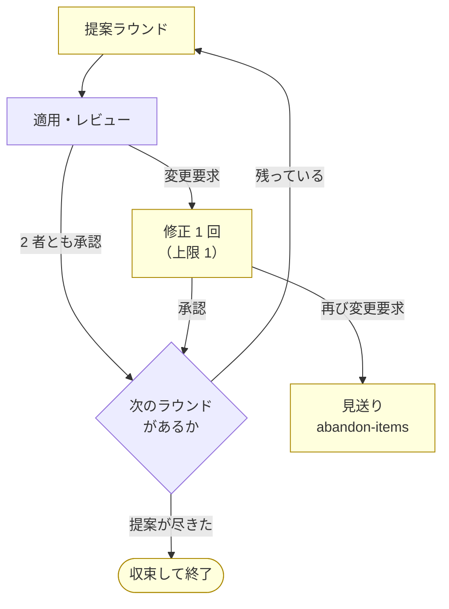

# cross-refactoring 7 回目の実機試行

NDF v8.6.0（Pull Request #138）で変えたコミット粒度と改修計画の書き出しを実機で確かめる。
あわせて、6 回の試行で一度も通っていない経路のうち到達できるものを通す。
対象は ai-plugins ではなく [devbase](https://github.com/devbasex/devbase) リポジトリとする。

経緯は次の 6 つにある。

- [issue-113-cross-refactoring-trial-report.md](issue-113-cross-refactoring-trial-report.md) — 1 回目
- [issue-113-cross-refactoring-retrial.md](issue-113-cross-refactoring-retrial.md) — 2 回目
- [issue-113-cross-refactoring-re-retrial.md](issue-113-cross-refactoring-re-retrial.md) — 3 回目
- [issue-113-cross-refactoring-4th-trial-report.md](issue-113-cross-refactoring-4th-trial-report.md) — 4 回目
- [issue-113-cross-refactoring-5th-trial-report.md](issue-113-cross-refactoring-5th-trial-report.md) — 5 回目
- [issue-113-cross-refactoring-6th-trial-report.md](issue-113-cross-refactoring-6th-trial-report.md) — 6 回目

## 目的

3 つある。

1. v8.6.0 で変えた 3 点（1 改善項目 = 1 コミット / 改修計画の書き出し / テスト回数）が実機で成立すること
2. 提案が尽きて終わる経路と、修正の上限から見送りへ進む経路へ到達すること
3. Skill が自分のリポジトリの前提を持ち込んでいないこと。6 回とも ai-plugins を対象にしており、生成物の同期を持つ構成でしか通っていない

## 対象リポジトリ

devbase は Docker ベースの開発環境マネージャで、実装は Python、テストは pytest である。
実測は計画を書いた時点の `main`（`6702c16`）で取った。

| 項目 | 値 |
| --- | --- |
| 実装 | `lib/devbase/` 配下 142 ファイル |
| テスト | `uv run --group dev python -m pytest -q` で **1376 passed / 1 skipped / 38.6 秒** |
| 生成物の同期 | 無し（`--sync-command` を渡さない構成になる） |
| CI | 構文検査・Ruff・ShellCheck。テストは CI で実行していない |
| 改修計画の置き場所 | `issues/` が既にあるため `--plan-file` は既定のまま使える |

ai-plugins との違いは 2 つで、どちらも確認したい点である。

- 生成物を持たないため、進行側の同期コミットが積まれない
- テスト 1 回が 38.6 秒あり、ai-plugins の 26.2 秒より長い（`--test-timeout` の既定 900 秒には収まる）

### 対象範囲

```bash
--scope lib/devbase/volume lib/devbase/snapshot tests/volume tests/snapshot
```

| パス | 行数 | 内容 |
| --- | ---: | --- |
| `lib/devbase/volume/` | 729 | コンテナ構成の生成（`compose.py` 541 / `manager.py` 188） |
| `lib/devbase/snapshot/` | 460 | スナップショットの取得と復元（`manager.py` 455） |
| `tests/volume/` | 646 | 構成生成のテスト 3 ファイル |
| `tests/snapshot/` | 135 | スナップショットのテスト 1 ファイル |

この範囲を選ぶ理由は 3 つある。

- **提案の母数が小さい。** 実装 1,189 行なので、提案が尽きる経路へ上限より先に到達する見込みがある
- **テストの厚みが揃っていない。** スナップショットは実装 455 行に対してテスト 135 行で、現状固定テストを先に書く項目（`test_gap`）が出やすい
- **範囲が独立している。** 他のサブパッケージから切り離して検証できる

## 確かめること

v8.6.0 で変えた 3 点は、いずれも実機を通していない。

| # | 変えたこと | 何が観測できれば通ったと言えるか |
| --- | --- | --- |
| 22 | 1 改善項目 = 1 コミット | 採用件数とコミット数が一致する。現状固定テストが要る項目だけ 2 コミットになる |
| 23 | 改修計画を差分へ残す | `issues/refactoring-plan-rf<PR>.md` が Pull Request の差分に現れ、採用した項目の理由と手順が読める |
| 24 | テストは項目の単位で 1 回 | 進行側のテスト実行回数が採用件数に比例する（6 回目は 44 手に対して 88 回だった） |

## 到達させたい経路

6 回の試行で通っていない 5 つのうち、3 つを本試行の対象にする。



黄色の 3 つが未到達である。到達のための設定は次のとおり。

| 経路 | 到達の手段 | 見込み |
| --- | --- | --- |
| 提案の収束（`no_more_proposals` / `duplicate_proposals`） | 範囲を 1,189 行へ絞り、`--max-outer-rounds 6` と上限を高くする | 上限より先に提案が尽きれば到達する |
| 修正フェーズ（`merge-fix`） | レビュー担当が変更要求を返せば通る | レビュー指摘の発生に依存する |
| 修正ラウンドの上限（`should-abandon` → `abandon-items`） | `--max-fix-rounds 1` にする | 変更要求が 2 回出れば到達する |

`--max-fix-rounds 1` を選ぶのは、見送りまでの最短経路になるためである。修正ラウンドは
`merge-fix` が取り込んだときに 1 つ進み、`should-abandon` はこの値が上限に達したときに
見送りへ移る。上限 1 なら「変更要求 → 修正 1 回 → 再び変更要求 → 見送り」で到達し、
既定の 3 なら変更要求が 4 回必要になる。

修正フェーズと見送りは、レビュー担当が変更要求を返すかどうかに左右される。6 回目は
6 回のレビューすべてが指摘なしの承認だった。テストの薄いスナップショットを範囲へ
含めるのはこのためで、到達できなかった場合は後述の追試へ回す。

## 実行条件

| 項目 | 値 |
| --- | --- |
| ホスト | Claude Code（提案・レビューには不参加） |
| 提案・レビュー | codex / gemini / kiro |
| 適用の母集合 | claude / codex / kiro |
| 使用する版 | プラグインキャッシュの v8.6.0 |
| kiro のモデル | `claude-sonnet-5`（既定の `auto` は集計から分離される） |
| ラウンド上限 | 6 |
| 修正の上限 | 1 |
| 着手前のテスト | 1376 passed / 1 skipped |

```bash
/ndf:cross-refactoring <PR番号> \
  --scope lib/devbase/volume lib/devbase/snapshot tests/volume tests/snapshot \
  --model kiro=claude-sonnet-5 \
  --baseline-test "uv run --group dev python -m pytest -q" \
  --max-outer-rounds 6 \
  --max-fix-rounds 1
```

`--sync-command` は渡さない。devbase は生成物を持たないため、渡すものが無い。

## 事前準備

| 準備 | 内容 |
| --- | --- |
| 対象の Pull Request | `refactor/cross-refactoring-7th` ブランチを `main` から切り、この試行の記録を 1 コミット置いて Draft の Pull Request を作る |
| 進行を駆動する作業ディレクトリ | `/work/devbase` を `main` へ戻す。対象ブランチを掴んでいると読み取り用の作業ディレクトリを作れない |
| プラグインキャッシュの版 | `claude plugin update ndf@ai-plugins` で v8.6.0 にする。セッション開始後に更新した場合は Skill 一覧が古い版を指すため、`PLUGIN_ROOT` に新しい版のパスを渡して起動する |
| 参加する CLI のログイン | `init` が確認して中断する。kiro はブラウザ認証のため `kiro-cli login` を利用者に実行してもらう |
| devbase への権限 | 対象リポジトリへの Pull Request 作成とレビュー投稿ができること |

## 到達しなかったときの追試

レビュー指摘の発生と投稿の失敗は、実行のたびに起きるとは限らない。本試行で通らなかった
経路は、条件を人為的に作って確かめる。実機の自然な進行とは区別して記録する。

### 変更要求と見送り

レビュー担当の結果ファイルを `REQUEST_CHANGES` の内容へ置き換え、`judge-review` から
先を同じコマンド列で進める。指摘の投稿は実際に行い、`review_url` の確認も通す。

### 投稿の失敗（`post_error`）

レビューの投稿だけを失敗させる。進行側の確認処理も同じコマンドを使うため、レビューの
投稿にあたる呼び出しだけを落とし、それ以外は本来の動作へ渡す。

```bash
# PATH の先頭に置くラッパー
#!/usr/bin/env bash
if [[ "$*" == *"--method POST"* && "$*" == *"/reviews"* ]]; then
  echo "injected failure" >&2
  exit 1
fi
exec /usr/bin/gh "$@"
```

参加 CLI は進行側の環境変数を引き継いで起動するため、進行側の `PATH` に置けば
レビュー担当の呼び出しに効く。確かめるのは、投稿に失敗したレビュー担当が `post_error`
付きの結果ファイルを残し、`judge-review` が終了コード 4 で進行を中断することである。

## 対象外

**他者の Pull Request を対象にする経路は、7 回目でも通らない。** devbase の Pull Request は
直近 30 件すべてが同一の作成者である。

```bash
$ gh pr list --state all --limit 30 --json author -q '.[].author.login' | sort -u
takemi-ohama
```

投稿の event を `APPROVE` / `REQUEST_CHANGES` のまま送る経路は、別の利用者が作成した
Pull Request が必要になる。現状固定テストでは指示の組み立てからプロンプトまでを固めて
あり、実機の確認は残る。

## 記録

結果は `issue-113-cross-refactoring-7th-trial-report.md` に残す。到達した経路と到達
しなかった経路を分け、到達しなかったものは引継ぎメモの未検証の表へ引き継ぐ。
