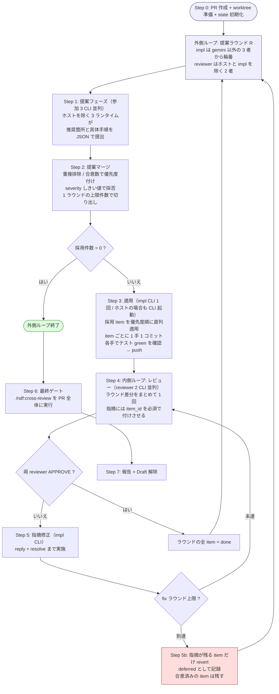

# Issue 113: cross-refactoring — 多ランタイム・リファクタリング収束ループ Skill

## 関連リンク

- GitHub Issue: https://github.com/devbasex/ai-plugins/issues/113
- 参考 Skill: `plugins/ndf-shared/skills/cross-review/SKILL.md`
- 参考 Skill: `plugins/ndf-shared/skills/refactoring/SKILL.md`
- 参考 Skill: `plugins/ndf-shared/skills/external-ai/SKILL.md`
- **Task 3 の検証記録: [issue-113-task3-cli-verification.md](issue-113-task3-cli-verification.md)**
- Kiro 実機検証の記録: `issues/ndf-development-skills/03-runtime-conformance.md`

## 概要

`/ndf:cross-review` がレビューを収束させるのと同じ発想で、**リファクタリングを収束させる**
Skill `/ndf:cross-refactoring` を追加する。

**claude / codex / gemini / kiro のうち、ホストを除いた 3 CLI** に「どこを・どう直すか」を
提案させ、**1 提案ラウンドで採用した item 群をまとめて適用し、まとめてレビューする**。
実装ランタイムとレビューランタイムは必ず別にする。レビューが収束したら**提案フェーズから
やり直す**。新しい提案が出なくなった時点で完了とする。

本 Skill を実行しているホストセッションは **オーケストレータに徹し、提案とレビューには
参加しない**。ただし**実装（適用）だけはホストも担当しうる**。その場合もホストの Agent tool
（サブエージェント）は使わず、**独立した CLI プロセスとして起動する**ため、ホストセッションの
context から切り離された状態は変わらない。参加者はいずれの役割でも独立した CLI である。

役割ごとに母集合が異なる。

| 母集合 | 定義 | 中身 |
|---|---|---|
| **提案・レビュー**（`runtimes`） | 全ランタイム − ホスト | 常に 3 者 |
| **実装**（`impl_capable`） | 全ランタイム − gemini | 常に `claude` / `codex` / `kiro` |

| ホスト | 提案・レビュー | 実装（輪番） |
|---|---|---|
| Claude Code | codex / gemini / kiro | **claude** / codex / kiro |
| Codex | claude / gemini / kiro | claude / **codex** / kiro |
| Kiro | claude / codex / gemini | claude / codex / **kiro** |

- **gemini は実装に参加しない。** NDF Skill を持たないランタイムであり、`refactoring` Skill の
  手順を踏ませる適用フェーズには向かない。提案とレビューには常に参加する
  （Skill 配布先ではないため、ホストになることもない）。
- **ホストは実装にだけ参加する。** 提案とレビューから外れる点は変わらないので、
  「実装者と評価者が同一モデルにならない」という構造は保たれる。

どのホストでも提案・レビューは 3 者、実装候補も 3 者で揃うため、後述の輪番
（実装 1 : レビュー 2）は全ランタイムで同じ形になる。

cross-review が「1 本のループ」なのに対し、cross-refactoring は **二重ループ**
（提案ラウンド → レビュー収束）である点が最大の構造差になる。

> **レビューの単位は提案ラウンド**である。item 1 件ごとにレビュー収束を回す設計も検討したが、
> CLI 起動回数が item 数に比例して膨らみ、**コストが実運用に耐えない**ため採用しなかった
> （§1 の見積もりを参照）。

## 問題・背景

`refactoring` Skill は「テストで守りながら 1 手ずつ直す」手順を定めているが、次の 2 つを
持っていない。

1. **何を直すかの発見**。どのスメルに手を付けるかは人間または単一 AI の主観で決まっており、
   見落としが体系的に検出されない。
2. **直した結果の他者検証**。実装した本人（同一モデル）が自己レビューすると、選んだ手法の
   妥当性と「振る舞いが本当に変わっていないか」が構造的に検証されない。

cross-review は 2 の一部をレビュー段階で担うが、対象は「人間が作った PR」であり、
リファクタリング固有の観点（振る舞い不変、スメルと手法の対応、現状固定テストの妥当性、
scope creep）はレビュー観点テンプレートに含まれていない。

そこで、**発見・適用・検証を別ランタイムに分担させ、指摘が尽きるまで回す**ループを作る。

## 設計方針

### 1. 二重ループ



- **外側 = 提案ラウンド**。「指摘がなくなったら完了」の判定単位であり、
  **impl / reviewer の輪番単位**でもある。
- **内側 = レビュー収束**。「指摘がなくなるまで繰り返し」の単位。
  対象は **item 1 件ではなくラウンドの差分全体**。

#### レビュー単位を item からラウンドへ変えた理由（コスト）

item 単位でレビュー収束を回すと、CLI 起動回数が **採用 item 数に比例**する。
1 ラウンドあたりの起動回数を、採用 5 件・各 item で fix 1 回として比べる。

| 単位 | 内訳 | 起動回数 |
|---|---|---|
| item 単位（不採用） | 提案 3 + 5 ×（適用 1 + レビュー 2 + 修正 1 + 再レビュー 2） | **33** |
| ラウンド単位（採用） | 提案 3 + 適用 1 + レビュー 2 + 修正 1 + 再レビュー 2 | **9** |

3 ラウンド回すと 99 対 27 になる。claude が参加者に入る構成では 1 起動あたり $0.26 の
実測値があり（§5-2）、item 単位は実運用のコストに耐えない。

**代わりに失うもの**と、その埋め合わせは次のとおり。

| 失うもの | 埋め合わせ |
|---|---|
| item ごとに実装者が入れ替わらない（1 ラウンド 1 impl） | 外側ラウンドごとに輪番するため、ラウンドを重ねれば実装者は分散する |
| 指摘がどの item に対するものか曖昧になる | レビュー結果 JSON で `item_id` を**必須**にし、語彙外・不明は差し戻す |
| 1 件の失敗がラウンド全体を巻き込む | item ごとに 1 手 1 コミットを維持し、**放棄は item 単位で revert** する（合意済みの item は PR に残す） |

### 2. ランタイム輪番（役割ごとに母集合が違う）

母集合は固定順 `["claude", "codex", "gemini", "kiro"]` を基準に `init` 時へ確定し、
`state.json` に記録する（再開時も不変）。

```
ALL         = ["claude", "codex", "gemini", "kiro"]
RUNTIMES    = ALL - [host]          # 提案・レビュー。常に 3 要素
IMPL_POOL   = ALL - ["gemini"]      # 実装。常に ["claude", "codex", "kiro"]

impl        = IMPL_POOL[outer_round % 3]        # ラウンド単位で 1 者
candidates  = RUNTIMES - [impl]                 # impl == host なら 3 者、それ以外は 2 者
reviewers   = candidates が 2 者ならそのまま
              3 者なら candidates[(outer_round // 3) % 3] を除いた 2 者
```

`impl == host` のとき、impl は `RUNTIMES` に含まれないので候補が 3 者残る。
**レビュアーは常に 2 者**とし（コストを item 単位レビューから抑えた方針と揃える）、
余る 1 者はラウンドを跨いでローテートさせて負荷を均す。

ホストの判定は `--host claude|codex|kiro` の明示指定を第一とし、未指定時のみ環境変数
（`CLAUDE_PLUGIN_ROOT` 等）から推定する。誤検出すると**提案・レビューの母集合が狂う**
（ホストが提案側に混ざる / 参加すべき者が外れる）ため、**推定結果は必ず `init` の出力に
表示して state.json に残す**。

- 実装 1 : レビュー 2 を常に維持し、**2 者 APPROVE で通過**とする（リファクタリングは必須作業
  ではないため、疑義が残るなら通さない側に倒す）。
- 指摘の修正は **impl ランタイムが行う**。レビュアーに直させるとレビューの独立性が失われる。
- **impl がホストでも、必ず CLI プロセスとして起動する。** ホストの Agent tool は使わない。
  Claude Code ホストが impl になる場合も `claude -p` を別プロセスで起動する（§5-2）。
  これにより、実装がホストセッションの context を汚さない性質と、レビュアー 2 者が
  実装者と別モデルである性質の両方が保たれる。
- **gemini は `IMPL_POOL` に入らない。** NDF Skill を持たないため、`refactoring` Skill の
  手順を踏む適用フェーズには参加させない。提案とレビューには常に参加する。
- **輪番の単位はラウンド**である。1 ラウンドの適用を 1 者に集約することで、レビュアーを
  「impl 以外」から機械的に決められる。item ごとに impl を替えると 1 ラウンド内で
  実装者が複数になり、impl と reviewer の分離が成立しなくなる。
- 割り当ては `state.json` の `rounds[].impl` / `rounds[].reviewers` に記録し、再開時も不変。

### 3. 全参加者が CLI であることの帰結（cross-review の骨組みをそのまま使える）

参加者を全て CLI プロセスにしたことで、**ループ全体を 1 本の bash で駆動できる**。
claude が参加者になる場合はヘッドレス CLI（`claude -p`）として起動し、ホスト側の
Agent tool（サブエージェント）は一切使わない。**ホスト自身が impl を担当するラウンドでも
同じで、ホストは自分と同じランタイムの CLI を別プロセスとして起動する**。
そのため cross-review が light rotation で必要としていた「bash を抜けてメインが Agent を
起動し、再度 bash に戻る」中断・再開のプロトコルが不要になる。

その結果、次がそのまま流用できる。

- cross-review と同じ「state.py サブコマンド + launcher + monitor.py」の骨組み
- `monitor.py` の多軸完了判定（pidfile / sentinel / 早期エラー / stall / hard timeout / result.json）
- 「AI 自身が `gh api` で PR へ直接投稿する」ことでホスト context を汚さない方針

ホストが行うのは bash ループの駆動と、最後の `/ndf:cross-review` 実行だけになる。
ホストが impl のラウンドでも、ホストセッション自身が編集するわけではないので変わらない。

### 4. worktree はエージェント分用意する

```
<worktree-base>/<owner>--<repo>/rf<PR>/
├── work/              # 書き込み用。PR head ブランチを checkout（唯一の非 detach）
├── <参加1>/           # 読み取り用。git worktree add --detach <sha>
├── <参加2>/           # 読み取り用。--detach
├── <参加3>/           # 読み取り用。--detach
└── work/.cross_refactoring/   # state.json / prompt / result / log（tmp 集約先）
```

`<参加N>` は state.json の `runtimes`（ホストを除いた 3 つ）から決まる。ホストが Claude Code
なら `codex/` `gemini/` `kiro/`、ホストが Codex なら `gemini/` `kiro/` `claude/` になる。

**ホストが impl を担当するラウンドでも、追加の worktree は要らない。** 適用は常に `work/` の
中だけで行うため、読み取り用 worktree を持つのは提案・レビュー参加者（= `runtimes`）だけで
足りる。impl はランタイムを問わず cwd を `work/` に固定して起動する。

- `<worktree-base>` の解決順は cross-review と同じ（`NDF_WORKTREE_BASE` env >
  `<システム tmpdir>/ndf-worktrees`）。
- **同一ブランチを 2 つの worktree に checkout できない**という git の制約があるため
  （git 2.43.0 で実測。2 つ目は `fatal: '<branch>' is already used by worktree at ...` で失敗する）、
  提案・レビュー用は必ず `--detach` にする。各フェーズ開始時に `git fetch` +
  `git checkout --detach <対象 sha>` で同期する。
- 読み取り専用でも worktree を分ける理由は 3 つ。
  1. レビュアーが**テストを実行して振る舞い不変を確認する**ため、書き込み可能な作業領域が要る
  2. テスト実行が生む生成物（`.pytest_cache` / `node_modules` / build 出力）が競合しない
  3. gemini の workspace 制約（workspace 外の `write_file` が拒否される）を、各自の worktree
     内に tmp を置くことで回避できる
- 実装は常に `work/` の中だけで行う。並列適用はしない（同一ブランチへの同時コミットは
  競合の温床であり、レビュー単位も曖昧になる）。**並列化するのは提案とレビューだけ**。
- 各 worktree の `.cross_refactoring/refs/` に、`refactoring` Skill の
  `code-smells.md` / `refactoring-catalog.md` / `data-representation.md` /
  `characterization-tests.md` を **コピーして配置**する。参加ランタイムに NDF がインストール
  されていることを前提にせず、プロンプトからは worktree 内の相対パスだけを参照させる
  （gemini の workspace 制約と、Kiro に NDF 導入がない対象リポジトリの両方に対応するため）。

### 5. 参加ランタイム別の固有対応

codex / gemini は cross-review の launcher に既存の実績があるため、そのまま流用する
（codex: `--dangerously-bypass-approvals-and-sandbox` / gemini: `GEMINI_CLI_TRUST_WORKSPACE=true`
+ `--skip-trust` + settings sanitize）。新たに扱いを決める必要があるのは **kiro と claude** の
2 つである。

#### 5-1. Kiro

Kiro は codex / gemini と前提が異なるため、launcher に固有処理が要る。**kiro-cli 2.18.0 で
実機検証済み**（2026-08-15）。表の「実行形式」以下 4 行は本検証の実測、それ以降は
`issues/ndf-development-skills/03-runtime-conformance.md`（kiro-cli 2.16.1 / 2026-08-07 実測）による。

| 事項 | 内容 | 対応 |
|---|---|---|
| 実行形式 | `kiro-cli chat --no-interactive` は **stdin からプロンプトを受け取る**（26KB で実測）。argv の `[INPUT]` も可 | `cat prompt.md \| kiro-cli chat --no-interactive --trust-all-tools` で起動する |
| ツール事前承認 | `--trust-tools` の絞り込みは実効性があるが、**シェルを許可した時点で他ツールの制限は迂回される**（実測） | **`--trust-all-tools` で全許可する**（codex / gemini と同じ整理）。絞り込みは防御力を持たず綴り違いの事故リスクだけが残るため採用しない。**専用 agent JSON の生成も行わない** |
| 承認漏れの現れ方 | ハングせず、**stderr に拒否メッセージを出して exit 0** で終わる（9 秒で終了を実測）。#7483 の無限ハングは 2.18.0 では再現しない | 早期エラーパターンに `is rejected because it matches one or more rules on the denied list` を追加する。stall timeout は別要因への保険として残す |
| 完了検知 | **終了コードは使えない**。ツール拒否でもシェルの失敗でも 0 を返す。1 は未認証・入力なしのみ | result.json の存在と stderr のパターン照合で判定する。exit 1 は即エラー扱い |
| 出力の色 | `NO_COLOR=1` / `TERM=dumb` / 非 TTY でも **ANSI エスケープが残る** | パターン照合の前に ANSI を除去する |
| 既定エージェント | `~/.local/share/kiro-cli/data.sqlite3` に保存される**マシン全体の設定** | `kiro-cli agent set-default` は**絶対に呼ばない**。`kiro-cli agent create` も `$EDITOR` を開くため非対話から呼ばない |
| `agent list` の出力先 | 2.16.1 では一覧を **stderr** に書く | 存在確認で stdout をパースしない |
| slash command | `/goal` は `unrecognized subcommand`。`/ndf:*` 形式のコマンドは存在しない | プロンプトは**自己完結した平文**にする。`/ndf:pr-review` のようなコマンド呼び出しを書かない |
| Skill 本文の読み込み | 起動時には読まず、必要時にファイル読み取りツールで取得する | 参照させたいファイルは worktree 内の**明示パス**で指示する（§4 の `refs/` コピー） |

> **実機検証済み**: 手順・ログ・出典は
> [issue-113-task3-cli-verification.md](issue-113-task3-cli-verification.md) §3。
> `allowedTools` に依存する初版の設計（worktree へ専用 agent JSON を生成する案）は**破棄**した。
> カスタム agent 自体が不要になるため、`prepare-worktrees.sh` の該当処理も削る。
>
> **縮退設計は不要になった。** シェル実行もファイル編集も `--no-interactive` で通ることを
> 実測したため、kiro は実装フェーズの輪番に含めてよい（`impl_capable` に kiro を含める）。
>
> ⚠ **`--trust-tools` による絞り込みはセキュリティ境界にならない。** `execute_bash` を
> 許可したうえで `fs_write` を拒否したケースでは、モデルが `echo ... > file` をシェル経由で
> 実行してファイルを作成した。実効的な防御は **worktree 隔離だけ**である。
> 加えてツール名を綴り間違えても WARNING が出るだけで exit 0 になり、「何も信頼しない状態で
> 正常終了した」ように見える。**防御力が無いのに事故リスクだけが残る**ため、
> 絞り込みは採用せず `--trust-all-tools` で全許可する。

#### 5-2. Claude（提案・レビュー参加時、および impl 担当時）

参加者としての claude は **ヘッドレス CLI** で起動する。**実機検証済み**
（claude 2.1.233 / root 実行）。
詳細は [issue-113-task3-cli-verification.md](issue-113-task3-cli-verification.md) §2。

この経路を通るのは次の 2 つで、いずれも同じ起動形式である。

1. ホストが Codex / Kiro のとき、claude が提案・レビューに参加する
2. **ホストが Claude Code のとき、claude（= ホストと同一ランタイム）が impl を担当する**

2 のケースでも Agent tool は使わず、**別プロセスの `claude -p` を起動する**。
ホストセッションの context は汚れず、レビュアー 2 者とも別モデルである性質も保たれる。

確定した起動形式:

```bash
cat prompt.md | claude -p \
    --permission-mode acceptEdits \
    --allowed-tools "Bash,Write" \
    --output-format json
```

| 事項 | 確認結果 |
|---|---|
| プロンプトの渡し方 | **stdin から渡せる**。長いプロンプトを argv に載せる必要がない |
| workspace trust | `-p` 指定時は trust ダイアログが skip される。gemini の `--skip-trust` に相当する対応は不要 |
| 権限モード | **`bypassPermissions` は root 実行で拒否される**（`--dangerously-skip-permissions cannot be used with root/sudo privileges`）。CI / コンテナは root が多いため既定にできない。`acceptEdits` + `--allowed-tools` の明示で root でも通ることを実測 |
| 完了検知 | `--output-format json` の `is_error` / `subtype` で確定できる。sentinel 不要 |
| 承認失敗の検知 | 同 JSON の `permission_denials` が非空なら承認失敗。早期エラーとして扱える |
| 作業ディレクトリ | 参加者用 worktree を cwd にする（`--add-dir` で範囲を広げない） |
| Skill 依存 | 対象リポジトリに NDF が入っている保証がないため、`/ndf:*` を呼ばず、§4 の `refs/` を明示パスで読ませる |
| 実行コスト | ごく単純な 3 ターンのタスクで `total_cost_usd` = 0.259。上限値の既定は保守的に置く |

### 6. メイン骨組み（cross-review と同じ形）

```bash
PLUGIN_ROOT="${PLUGIN_ROOT:-${CLAUDE_PLUGIN_ROOT}}"
SCRIPTS="$PLUGIN_ROOT/skills/cross-refactoring/scripts"

# init が host を確定し、RUNTIMES（提案・レビュー = ホストを除く 3 つ）と RUNTIMES_CSV、
# IMPL_POOL（実装 = gemini を除く 3 つ）を eval で返す。
# --model は runtime=model を繰り返し渡せる（未指定のランタイムは CLI の既定モデル）。
eval "$("$SCRIPTS/refactor.py" init "$PR" --scope "$SCOPE" ${HOST:+--host "$HOST"} \
          --max-outer-rounds "$MAX_OUTER" --max-fix-rounds "$MAX_FIX" \
          --max-items-per-round "$MAX_ITEMS" ${MODEL_ARGS:+$MODEL_ARGS})"
export CROSS_REFACTORING_TMP_DIR="$TMP_DIR"
"$SCRIPTS/prepare-worktrees.sh" "$PR"

while :; do                                          # 外側: 提案ラウンド
  # start-round が ROUND / IMPL / REVIEWERS / REVIEWERS_CSV を eval で返す
  eval "$("$SCRIPTS/refactor.py" start-round "$PR")" || break
  for a in $RUNTIMES; do
    "$SCRIPTS/launch-cli.sh" "$a" propose "$PR" "$ROUND"
  done
  "$SCRIPTS/monitor.py" "$PR" --agents "$RUNTIMES_CSV" \
      --tmp-dir "$TMP_DIR" --stem-template '{agent}-propose-rf{id}'
  "$SCRIPTS/refactor.py" merge-proposals "$PR" || break   # exit 2 = 採用 0 件 → 収束

  # 適用は 1 ラウンド 1 回。impl が採用 item を優先度順に直列適用する
  "$SCRIPTS/launch-cli.sh" "$IMPL" apply "$PR" "$ROUND"
  "$SCRIPTS/monitor.py" "$PR" --agents "$IMPL" --tmp-dir "$TMP_DIR" \
      --stem-template "{agent}-apply-r$ROUND"
  "$SCRIPTS/refactor.py" merge-apply "$PR" "$ROUND" || continue  # 全件失敗 = 次ラウンドへ

  while :; do                                        # 内側: レビュー収束（ラウンド差分に対して）
    for r in $REVIEWERS; do
      "$SCRIPTS/launch-cli.sh" "$r" review "$PR" "$ROUND"
    done
    "$SCRIPTS/monitor.py" "$PR" --agents "$REVIEWERS_CSV" --tmp-dir "$TMP_DIR" \
        --stem-template "{agent}-review-r$ROUND"
    "$SCRIPTS/refactor.py" judge-review "$PR" "$ROUND" && break   # 0 = 両者 APPROVE
    if "$SCRIPTS/refactor.py" should-abandon "$PR" "$ROUND"; then
      # 指摘が残る item だけ revert する（合意済みの item は PR に残す）
      "$SCRIPTS/refactor.py" abandon-items "$PR" "$ROUND"; break
    fi
    "$SCRIPTS/launch-cli.sh" "$IMPL" fix "$PR" "$ROUND"
    "$SCRIPTS/monitor.py" "$PR" --agents "$IMPL" --tmp-dir "$TMP_DIR" \
        --stem-template "{agent}-fix-r$ROUND"
    "$SCRIPTS/refactor.py" merge-fix "$PR" "$ROUND"
  done
done

# Step 6: 最終ゲート — /ndf:cross-review <PR> をホストが実行
# Step 7: 報告 + Draft 解除
"$SCRIPTS/refactor.py" report "$PR"
```

state.json に全状態が入るため、どこで落ちても同じコマンド列を叩き直せば再開できる。

### 7. 振る舞い不変の担保（`refactoring` Skill への委譲）

適用フェーズのプロンプトは `refactoring` Skill の手順をそのまま踏ませる。状態機械側では
次を**機械的に検証**し、満たさない適用結果は失敗として扱う。

| 検証 | 方法 |
|---|---|
| 着手前にテストが green | `baseline_test` を state に記録。red ならラウンドの適用に着手せず全 item を `blocked` にする |
| テストが無い経路は先に現状固定テスト | `test_gap=true` の item は、固定テスト追加コミットが先行しているかを `git log` で確認 |
| 1 手 1 コミット | 適用結果 JSON の `commits[]` が 1 件以上、かつ各コミットでテスト実行結果が green |
| 実行主体の明記 | 各コミットに `Item-Id` / `Round` / `Impl-Runtime` / `Impl-Model` の trailer が揃っている（§10-2） |
| 差分予算 | `estimated_diff_lines` の 2 倍を超えたら失敗（scope creep 検知） |
| 機能変更の混入なし | レビュー観点で判定（機械判定は不可能なため reviewer に委ねる） |

### 8. 終了条件

| ループ | 終了条件 |
|---|---|
| 内側（レビュー） | reviewer 全員 APPROVE / `--max-fix-rounds`（既定 3）到達で **未解決の item を revert して放棄** |
| 外側（ラウンド） | 採用 item 0 件 / `--max-outer-rounds`（既定 3）到達 / 提案の重複率が前ラウンド比 70% 以上（収束と見なす） |

**収束しない item は捨てる**のが cross-review との重要な差分である。レビュー指摘の修正は
必須だが、リファクタリングは任意作業なので、揉める提案は PR に残さない方が安全である。
放棄した item は `deferred_items` に理由付きで記録し、次ラウンドの提案プロンプトへ
「対象外」として渡す。

**放棄は item 単位で行う。** レビューはラウンドの差分に対してまとめて実施するが、
`--max-fix-rounds` 到達時に捨てるのは**未解決の指摘が紐づく item だけ**であり、
指摘が無い item や解決済みの item は PR に残す。これができるように、適用は
item ごとに 1 手 1 コミットへ分け、`items[].commits` にコミット SHA を記録しておく。
どの item にも紐づかない指摘（ラウンド全体に対する指摘）が残った場合は、
そのラウンドで適用した item を全件 revert する。

### 9. PR の扱い

- Step 0 で base ブランチから `refactor/<slug>` を切り、**Draft PR** を作成する（`/ndf:pr` を利用）。
  最初のコミットは空コミットまたは最初の現状固定テストとする。
- コミットメッセージは `Refactor: <手法> — <対象>` に統一し、1 手 1 コミットを保つ。
  **本文末尾に §10 の trailer（実行主体のランタイムとモデル）を必ず付ける。**
- 完了時に Draft を解除する。
- PR ローテーションは **v1 では対象外**とする。`--max-items-per-round`（既定 5）と
  `--max-outer-rounds` で総量を抑える方針を先に採り、実運用で PR が肥大した場合に
  cross-review の `rotate-pr.sh` 再利用を検討する。

### 10. モデル指定と計測（ランタイム／モデルの比較）

本 Skill は「複数のランタイムに同じ土俵で同じ作業をさせる」構造なので、**どのランタイムの
どのモデルが実装者・レビュアーとして優れているかを測る器**にもなる。
「codex の gpt-5.5 と claude の opus-5 では実装者としてどちらが優秀か」を比べられるよう、
**モデルを指定できること**と、**成果物に実行主体が必ず残ること**を要件に加える。

#### 10-1. 起動時のモデル選択

```
/ndf:cross-refactoring <PR> --scope <path>... --model codex=gpt-5.5 --model claude=opus-5
```

- `--model <runtime>=<model>` を**繰り返し指定**できる。省略したランタイムは CLI の既定モデル。
- 指定値は `init` 時に state.json の `models` へ記録し、**全ラウンドで固定**する
  （途中で変えると比較が成立しないため、再開時も不変）。
- 各 CLI へは次のフラグで渡す。**4 CLI すべてで実在を確認済み**（2026-08-15 実測）。
  モデル名の妥当性は CLI 側の検証に委ねる（`init` では綴りを検査しない）。

  | runtime | フラグ | 候補の確認 |
  |---|---|---|
  | claude | `--model <model>` | `claude --help`。エイリアス（`opus` / `sonnet` / `fable`）とフルネームの両方を受ける |
  | codex | `-m, --model <MODEL>` | `codex --help` |
  | gemini | `-m, --model <MODEL>` | `gemini --help` |
  | kiro | `--model <MODEL>` | `kiro-cli chat --list-models`（`-f json` 可） |

- **既定モデルのまま走らせた場合も「既定を使った」と記録する。** 何が動いたか分からない
  実行は比較に使えないため、`report` は既定使用のラウンドを明示する。
  実際に使われたモデル名を出力から取れるランタイム（claude は `--output-format json` の
  `modelUsage`）は**実測値も併記**し、指定値と食い違ったら警告する。

#### 10-1-b. ランタイムとモデルは直交する（比較設計上の要点）

kiro-cli 2.18.0 の `--list-models` は、**claude 系と gpt 系の両方**を提供する。

```console
$ kiro-cli chat --list-models
Available models (* = default):
* auto                 1.00x credits   Models chosen by task for optimal usage and consistent quality
  claude-opus-5        2.20x credits   ...
  claude-sonnet-5      1.30x credits   ...
  gpt-5.6-sol          2.40x credits   ...
  gpt-5.6-terra        1.00x credits   ...
  ...
```

つまり **「ランタイム（ハーネス）」と「モデル」は独立に選べる**。
「codex の gpt-5.5 と claude の opus-5 のどちらが実装者として優秀か」を比べるとき、
差がハーネス由来かモデル由来か切り分けられないと結論が濁る。`report --metrics` は
**ランタイム × モデルの組**で集計し、次の 2 通りの読み方ができるようにする。

| 比べたいもの | 揃えるもの | 例 |
|---|---|---|
| **モデル差** | ランタイムを固定 | `kiro:claude-opus-5` と `kiro:gpt-5.6-sol` |
| **ハーネス差** | モデルを固定 | `kiro:claude-opus-5` と `claude:opus-5` |

> ⚠ **kiro の既定モデルは `auto`（タスクに応じて自動選択）である。** 既定のまま走らせると
> ラウンドごとに違うモデルが動きうるため、**計測目的の実行では `--model kiro=<name>` を
> 明示する**。`report` は `auto` のラウンドを「モデル未確定」として集計から分離する。

#### 10-2. commit への明記（機械集計できる形式で）

適用・修正フェーズのコミットメッセージ本文の末尾に、**git trailer 形式**で実行主体を残す。

```
Refactor: extract_method — scripts/state.py#cmd_merge_fix

（変更の説明）

Item-Id: R1-003
Round: 1
Impl-Runtime: codex
Impl-Model: gpt-5.5
```

- trailer 形式にするのは、`git log --format='%(trailers:key=Impl-Model,valueonly)'` で
  **集計できる**ため。自由文で「codex が実装」と書かせると集計に使えない。
- `merge-apply` / `merge-fix` は**この 4 つの trailer が揃っているかを検証**し、
  欠けているコミットがあれば当該 item を失敗として扱う（プロンプトに書くだけでは守られない）。
- `Impl-Model` には**実際に使ったモデル名**を入れさせる。既定モデルで走った場合も、
  CLI が報告するモデル名を書かせる（不明なら `default` とし、`report` で区別する）。

#### 10-3. PR への明記

- **レビューコメント**は先頭に `Reviewer: <runtime> / <model>` を可視の形で書かせ、
  併せて `<!-- cross-refactoring reviewer=<runtime> model=<model> round=<N> -->` を埋める
  （可視部分は人間向け、HTML コメントは集計向け）。
- **PR 本文**は `report` が毎ラウンド更新し、ラウンド表を載せる。

  | R | impl | model | reviewers | models | 採用 | 適用 | 放棄 | fix | 初回 APPROVE |
  |---|---|---|---|---|---|---|---|---|---|
  | 1 | codex | gpt-5.5 | gemini / kiro | 既定 / 既定 | 5 | 4 | 1 | 1 | いいえ |

#### 10-4. 集計指標

`refactor.py report --metrics` が state.json から次を出す。**新しい計測機構は作らず、
既に state に入っている値の集計だけで済ませる**。

| 役割 | 指標 |
|---|---|
| 実装者 | 担当ラウンド数 / 適用成功 item 数 / 放棄 item 数 / **初回レビューで APPROVE を得た率** / 平均 fix ラウンド数 / 差分予算超過率 / テスト red 発生率 / 所要時間 |
| レビュアー | レビュー回数 / 指摘件数 / **指摘が修正に至った率** / もう 1 人のレビュアーとの判定一致率 / 所要時間 |

#### 10-5. 比較として読むときの限界（docs に明記する）

**この数値は厳密なベンチマークではない。** 次を報告に添えて誤読を防ぐ。

- **item の難易度が揃わない。** 輪番はラウンド単位なので、たまたま重い item 群を引いた
  ランタイムは不利になる。ラウンド数が少ないほど差は偶然に支配される。
- **提案と実装の相性がある。** 自分が提案した item を自分が実装するラウンドでは有利になりうる。
- **レビュアーの厳しさは指標に直結する。** 指摘件数が多いことは「優秀」とも
  「過剰」とも読めるため、**指摘が修正に至った率**と併せて見る。
- **ハーネスとモデルの交絡**（§10-1-b）。ランタイムを跨いだ比較は、モデルを揃えない限り
  「どちらのモデルが優秀か」の答えにならない。
- **kiro の既定 `auto` は比較に使えない。** ラウンドごとに違うモデルが動きうる。
- 公平に比べたいなら、**同じ対象・同じ scope で `--model` だけ変えて複数回走らせる**のが
  最も素直な方法である（1 回の実行内での比較は参考値にとどめる）。

## state.json スキーマ

配置は `<worktree>/work/.cross_refactoring/cross-refactoring-rf<ID>-state.json`。
`<ID>` は最初に init した PR 番号（cross-review の `STATE_PR` と同じ役割）。

```json
{
  "id": 130,
  "repo": "devbasex/ai-plugins",
  "current_pr": 130,
  "base_branch": "main",
  "head_branch": "refactor/cross-refactoring-target",
  "worktree_root": "/tmp/ndf-worktrees/devbasex--ai-plugins/rf130",
  "worktrees": {"work": "...", "codex": "...", "gemini": "...", "kiro": "..."},
  "target_scope": ["plugins/ndf-shared/skills/cross-review/scripts"],
  "host": "claude",
  "host_detection": "env",
  "runtimes": ["codex", "gemini", "kiro"],
  "impl_capable": ["claude", "codex", "kiro"],
  "models": {"claude": "opus-5", "codex": "gpt-5.5", "gemini": null, "kiro": null},
  "max_outer_rounds": 3,
  "max_fix_rounds": 3,
  "max_items_per_round": 5,
  "severity_threshold": "minor",
  "baseline_test": {"command": "pytest -q", "status": "green", "checked_at": "..."},
  "outer_round": 2,
  "phase": "review",
  "rounds": [
    {
      "round": 1,
      "impl": "codex",
      "impl_model": {"requested": "gpt-5.5", "observed": "gpt-5.5"},
      "reviewers": ["gemini", "kiro"],
      "reviewer_models": {"gemini": {"requested": null, "observed": null},
                          "kiro": {"requested": null, "observed": null}},
      "proposed": {"codex": 9, "gemini": 7, "kiro": 8},
      "merged": 14, "adopted": 5, "deferred": 9,
      "items": ["R1-001", "R1-002"],
      "apply": {"applied": ["R1-001", "R1-002"], "failed": [], "base_sha": "aaa1111", "head_sha": "ccc3333"},
      "fix_rounds": 1,
      "durations": {"propose": 182, "apply": 461, "review": 205, "fix": 133},
      "reviews": [
        {"round": 1, "gemini": "REQUEST_CHANGES", "kiro": "APPROVE",
         "findings": [{"item_id": "R1-002", "thread_id": "PRRT_x", "resolved": false}]},
        {"round": 2, "gemini": "APPROVE", "kiro": "APPROVE", "findings": []}
      ]
    }
  ],
  "items": [
    {
      "item_id": "R1-001",
      "round": 1,
      "path": "scripts/state.py",
      "symbol": "cmd_merge_fix",
      "smell": "long_method",
      "technique": "extract_method",
      "severity": "major",
      "rationale": "...",
      "plan": "1. ... 2. ...",
      "test_gap": false,
      "estimated_diff_lines": 40,
      "proposed_by": ["codex", "gemini"],
      "status": "done",
      "commits": ["abc1234", "def5678"]
    }
  ],
  "deferred_items": [],
  "final": null
}
```

`runtimes` は**提案・レビューの母集合**（全ランタイム − ホスト）、`impl_capable` は
**実装の母集合**（全ランタイム − gemini）で、**両者は別物**である。上の例はホストが
`claude` のケースで、`claude` は `runtimes` に居ないが `impl_capable` には居る。
`impl_capable` はホスト非依存で常に `["claude", "codex", "kiro"]` になる。

`models` は `init` で確定する**指定値**（未指定は `null` = CLI の既定モデル）で、全ラウンド
不変。`rounds[].impl_model` / `reviewer_models` は `requested`（指定値）と `observed`
（出力から取れた実測値。取れなければ `null`）を分けて持ち、食い違いを `report` が警告できる
ようにする。`durations` は計測用の秒数で、`monitor.py` が持つ開始・終了時刻から求める。

`items[]` は **impl / reviewers / fix_rounds / reviews を持たない**。これらはラウンド単位の
属性になったため `rounds[]` に置く。`items[].commits` は放棄時の revert 範囲を決めるために
必須で、**item ごとに 1 手 1 コミットへ分ける**前提を state 側から支える。

`status` の遷移: `pending` → `applying` → `reviewing` → (`fixing` → `reviewing`)* →
`done` / `abandoned` / `blocked`。適用に失敗した item はラウンドを止めず、
その item だけ `abandoned` にして残りの適用を続ける。

## 提案 item のスキーマ（3 ランタイム共通の提出形式）

```json
{
  "items": [
    {
      "path": "src/foo/bar.py",
      "symbol": "BarService.handle",
      "smell": "long_method",
      "technique": "extract_method",
      "severity": "major",
      "rationale": "1 メソッドに入力検証・変換・永続化が同居し、分岐が 7 本ある",
      "plan": "1. 検証部を validate_request として抽出\n2. 変換部を to_entity として抽出",
      "test_gap": false,
      "estimated_diff_lines": 40
    }
  ]
}
```

- `smell` は `code-smells.md` の語彙に、`technique` は `refactoring-catalog.md` の語彙に
  **限定する**（worktree 内の `refs/` にコピーしたものを読ませる）。語彙外はマージ時に
  `unknown` として警告し、`nit` へ降格させる。語彙を固定しないと重複排除が効かない。
- 重複排除キーは `path` + `symbol` + `smell`。同一キーの提案は `proposed_by` を統合し、
  `rationale` / `plan` は最も具体的なものを採る。
- 優先度は `合意ランタイム数` → `severity` → `estimated_diff_lines` の昇順。
  **小さく合意の多いものから直す**。
- `severity_threshold`（既定 `minor`）未満は採用せず `deferred_items` に記録する。

## レビュー観点（cross-review とは別テンプレート）

`docs/03-review-viewpoints.md` に置き、reviewer プロンプトへ埋め込む。

| 観点 | 具体的に見るもの |
|---|---|
| 振る舞い不変 | 公開インタフェースの入出力、例外種別、副作用の順序、境界条件 |
| テストの妥当性 | 現状固定テストが実際にその経路を通しているか、実装詳細に結合していないか |
| 手法の適合 | 宣言された `smell` に対して `technique` が妥当か、別の手法の方が適切でないか |
| scope creep | 提案 `plan` の範囲を超えた変更が混ざっていないか、機能変更が混入していないか |
| 改善の実質 | 行数が動いただけでなく、責務・依存・可読性が実際に改善しているか |
| コミット分割 | 改名と中身の変更が同一コミットに混ざっていないか、1 手 1 コミットか |
| 性能退行 | ループ入れ替え・呼び出し回数増・N+1 の発生 |

判定は cross-review と同じく `APPROVE` / `REQUEST_CHANGES` の 2 値（`COMMENT` は使わない）。
インラインコメント最小化と body の「良い点」禁止も cross-review の規約を継承する。

## 追加・変更するファイル

### 新規

```
plugins/ndf-shared/skills/cross-refactoring/
├── SKILL.md
├── docs/01-state-and-propose.md      # Step 0〜2
├── docs/02-apply-and-review.md       # Step 3〜5
├── docs/03-review-viewpoints.md      # レビュー観点テンプレート
├── scripts/refactor.py               # 状態管理（uv 自己完結 / stdlib のみ）
├── scripts/prepare-worktrees.sh      # worktree をエージェント分作成・同期・refs 配置
├── scripts/launch-cli.sh             # claude / codex / gemini / kiro を phase 引数で起動
├── prompts/propose.md                # 提案プロンプト雛形
├── prompts/apply.md                  # 適用プロンプト雛形
├── prompts/review.md                 # レビュープロンプト雛形
├── prompts/fix.md                    # 指摘修正プロンプト雛形
└── tests/                            # pytest
```

### 変更

- `plugins/ndf-shared/skills/cross-review/scripts/monitor.py` — 汎用化（Task 9）
- `plugins/ndf-shared/skills/cross-review/scripts/_gemini-env.sh` — 新規抽出。
  `launch-gemini.sh` の trusted directory / settings sanitize 処理を切り出し、
  cross-refactoring の `launch-cli.sh` から source する
- `plugins/ndf-shared/skills/external-ai/references/cli-kiro.md` — 新規。Kiro CLI の
  非対話実行手順（§5-1 の内容 + 実測結果）を external-ai の補助ファイル体系に載せる
- `plugins/ndf-shared/skills/external-ai/references/cli-claude.md` — 新規。`claude -p` の
  ヘッドレス実行手順（§5-2 の内容 + 実測結果）
- `plugins/ndf-shared/skills/external-ai/SKILL.md` — 補助ファイル表に `cli-kiro.md` /
  `cli-claude.md` を追加し、`description` の「codex exec or gemini exec」を 4 CLI に更新。
  「どちらの CLI を選ぶか」の比較表も 4 者へ拡張する
- `plugins/ndf-shared/manifests/{claude,codex,kiro}-skills.txt` — `cross-refactoring` を追加
- `plugins/ndf-{claude,codex,kiro}/**` — `bash scripts/build-runtime-plugins.sh` の同期生成物
- `plugins/ndf-claude/.claude-plugin/plugin.json` / `plugins/ndf-codex/.codex-plugin/plugin.json`
  — `8.0.0` → `8.1.0`
- `CLAUDE.md` / `README.md` / `docs/ndf-plugin-reference.md` /
  `docs/specifications/ndf-skill-inventory.md` / 各 runtime README — Skill 数と新 Skill の記述
- `issues/issue-113-task3-cli-verification.md` — Kiro 実機確認の結果を追記（Task 3 の残件）

### v1 の配布範囲

**3 ランタイムすべてに配布する**（`claude` / `codex` / `kiro` の各 manifest に追加）。
参加者を CLI に統一し、さらに参加者集合を「全ランタイム − ホスト」で定義したことで、
Skill がランタイム中立になったためである。最終ゲートで呼ぶ `/ndf:cross-review` も
3 ランタイムすべてに配布済みで、前提が揃っている。

ホストごとに必要な CLI は次のとおり。`init` は不足している CLI を検出したら、その時点で
理由を明示して失敗する（ループ途中での発覚を避ける）。

| ホスト | 必要な CLI |
|---|---|
| Claude Code | `codex` / `gemini` / `kiro-cli` |
| Codex | `gemini` / `kiro-cli` / `claude` |
| Kiro | `claude` / `codex` / `gemini` |

## タスク分解

### Task 1: 状態管理の骨格

- **対象:** `scripts/refactor.py`, `tests/test_refactor_init.py`
- **内容:** `init` / `start-round` / `advance` / `status` を実装する。`start-round` は
  ラウンド番号に加えて **`IMPL` / `REVIEWERS` / `REVIEWERS_CSV`** を eval で返す
  （輪番はラウンド単位のため、item ごとに割り当てを引く `next-item` は不要）。`init` は PR 番号・
  対象スコープ・各上限値を受け取り、リポジトリ情報と `baseline_test` を記録して state.json を
  生成する。**`runtimes`（全 − ホスト）と `impl_capable`（全 − gemini）を別々に確定**し、
  `impl == host` のラウンドでレビュアーが 3 候補になる場合の絞り込み（§2 の式）もここに置く。
  **`--model <runtime>=<model>` を繰り返し受け取り `models` に記録する**（§10-1）。
  未指定は `null`（CLI 既定）とし、以後のラウンドで変更しない。tmp ディレクトリ解決は cross-review の `_tmp_dir()` と同じ優先順
  （env `CROSS_REFACTORING_TMP_DIR` > `<work worktree>/.cross_refactoring/`）にする。
  cross-review の `state.py` を読み、同じ「eval で KEY=VALUE を取り込む」呼び出し規約に揃える。

### Task 2: worktree 準備

- **対象:** `scripts/prepare-worktrees.sh`, `tests/test_prepare_worktrees.py`
- **内容:** `work/`（head ブランチ）と `codex/` `gemini/` `kiro/`（`--detach`）を冪等に作成する。
  既存パスが現リポジトリの登録済み worktree でなければ `.stale-<ts>` に退避して作り直す
  （cross-review の既存ガードを踏襲）。`sync <sha>` サブコマンドで読み取り用 worktree を
  指定 SHA へ `git fetch` + `checkout --detach` する。あわせて各 worktree の
  `.cross_refactoring/refs/` へ `refactoring` Skill の参照ファイルをコピーする。
  **kiro 専用 agent JSON の生成は行わない**（Task 3 の調査で `allowedTools` に依存しない方針が
  確定したため。承認はフラグで与える）。

### Task 3: Kiro / Claude CLI の非対話実行手順の確立（他タスクの前提）

- **対象:** `plugins/ndf-shared/skills/external-ai/references/cli-kiro.md`,
  `plugins/ndf-shared/skills/external-ai/references/cli-claude.md`,
  `issues/ndf-development-skills/03-runtime-conformance.md`
- **状態:** **調査は完了**。Claude（2.1.233）・Kiro（2.18.0）とも実機で起動形式・完了検知・
  権限まわりを確定した。codex / gemini は cross-review に実績があるため対象外。
  **残作業は `cli-kiro.md` / `cli-claude.md` の書き起こしのみ**で、他タスクを止める要因は無い。
- **内容:** 検証記録は
  [issue-113-task3-cli-verification.md](issue-113-task3-cli-verification.md)（§2 が Claude、
  §3 が Kiro、§4 がチェックリストの結果）。確定した起動形式は次のとおり。

  ```bash
  # Kiro
  cat prompt.md | kiro-cli chat --no-interactive --trust-all-tools > out.txt 2> err.txt
  # Claude
  cat prompt.md | claude -p --permission-mode acceptEdits \
      --allowed-tools "Bash,Write" --output-format json > out.json
  ```

  `cli-kiro.md` に必ず書く注意点は 4 つ。

  1. **終了コードで成否を判定しない**（kiro はツール拒否でもシェル失敗でも 0 を返す）
  2. **stderr のパターン照合の前に ANSI エスケープを除去する**（`NO_COLOR` では消えない）
  3. **`--trust-tools` での絞り込みは使わない**（シェル経由で迂回でき防御力が無い一方、
     綴り違いが WARNING のみで素通りする。隔離は worktree で担保する）
  4. **`agent set-default` / `agent create` を呼ばない**（前者はマシン全体の設定を奪い、
     後者は `$EDITOR` を開いて非対話実行が止まる）

### Task 4: 提案フェーズ

- **対象:** `scripts/launch-cli.sh`, `prompts/propose.md`, `refactor.py merge-proposals`,
  `tests/test_merge_proposals.py`
- **内容:** 3 CLI に同一プロンプトで提案させ、`propose-<agent>-rf<ID>-r<round>.json` に
  提出させる。`merge-proposals` が語彙検証・重複排除・優先度付け・しきい値による採否・
  1 ラウンド上限での切り出しを行い、`items[]` を生成する。採用 0 件なら exit 2（外側収束）。
  `launch-cli.sh` は agent 名で 4 分岐する。

  | agent | 起動形式 |
  |---|---|
  | codex | `codex exec --dangerously-bypass-approvals-and-sandbox`（cross-review 既存） |
  | gemini | `_gemini-env.sh` 経由の trusted directory 対応 + `--skip-trust`（cross-review 既存） |
  | claude | `cat prompt.md \| claude -p --permission-mode acceptEdits --allowed-tools ... --output-format json`（確定済み） |
  | kiro | `cat prompt.md \| kiro-cli chat --no-interactive --trust-all-tools`（確定済み） |

  **提案フェーズにホストは現れない**（state.json の `runtimes` にいないため）。
  ただし `launch-cli.sh` は **ホストと同一ランタイムを起動しうる**（impl 担当時）ので、
  「ホストなら起動しない」といった分岐を入れてはならない。
  対象スコープ（`--scope PATH...`）を渡し、提案が無制限に広がらないようにする。
- **モデル指定:** `launch-cli.sh` は state.json の `models[<runtime>]` が非 null なら
  各 CLI のモデルフラグ（§10-1 の表）を付ける。null なら付けずに CLI の既定へ委ねる。
  分岐はランタイム名ごとにフラグ名が違うだけで、値の検証は CLI に任せる。

### Task 5: 適用フェーズ

- **対象:** `prompts/apply.md`, `refactor.py merge-apply`, `tests/test_merge_apply.py`
- **内容:** impl ランタイムを **1 ラウンド 1 回**起動し、採用 item を優先度順に直列適用させる。
  戻り値 `apply-r<round>.json` は **item ごとの結果配列**（`item_id` / `commits[]` /
  各コミットのテスト結果 / 実差分行数 / `status`）を持つ。`merge-apply` は item ごとに
  差分予算超過・テスト red・コミット 0 件を検証し、**失敗した item だけ `abandoned` にして
  残りは採用する**（1 件の失敗でラウンドを止めない）。全件失敗のときだけ exit 2 で
  次ラウンドへ進む。作業ディレクトリは `work/` に固定し、`--force` / `--no-verify` を禁止する。
- **要点:** プロンプトに **item ごとに 1 手 1 コミットへ分けること**を必須要件として書く。
  放棄時の revert 範囲が item 単位で決まらなくなるため、複数 item を 1 コミットに
  まとめた場合は失敗として扱う。
- **trailer の検証:** 各コミットに `Item-Id` / `Round` / `Impl-Runtime` / `Impl-Model` の
  trailer が揃っていることを `merge-apply` が `git log --format=%(trailers)` で検証し、
  欠けていれば当該 item を失敗として扱う（§10-2）。`Impl-Model` は CLI が報告する
  実際のモデル名を書かせ、取得できないランタイムでは `default` を許容する。

### Task 6: レビューフェーズ

- **対象:** `prompts/review.md`, `docs/03-review-viewpoints.md`, `refactor.py judge-review`,
  `tests/test_judge_review.py`
- **内容:** reviewer 2 ランタイムを並列起動し、**ラウンドの差分**
  （`git diff <round.base_sha>..<round.head_sha>`）に対して上記観点でレビューさせる。
  指摘は PR にインラインコメントとして AI 自身が `gh api` で直接投稿する（cross-review と
  同じ「AI 直接投稿」方針でホスト context を汚さない）。
  `judge-review` は 2 者 APPROVE で `done`（exit 0）、1 つでも `REQUEST_CHANGES` なら
  `fixing` に遷移（exit 2）する。
- **要点:** レビュー結果 JSON の各 finding に **`item_id` を必須**とする。放棄を item 単位で
  行うために必要であり、`rounds[].items` に無い ID や欠落は**差し戻して再レビューさせる**。
  ラウンド全体に対する指摘（item に紐づけられないもの）は `item_id: null` を明示させ、
  放棄時はラウンド全件 revert の対象として扱う。
- **実行主体の明記:** レビューコメントの先頭に `Reviewer: <runtime> / <model>` を可視で書かせ、
  `<!-- cross-refactoring reviewer=<runtime> model=<model> round=<N> -->` を併記させる
  （§10-3）。レビュー結果 JSON にも `runtime` / `model` を持たせ、
  `judge-review` が `rounds[].reviewer_models.observed` に記録する。

### Task 7: 内側ループの収束と放棄

- **対象:** `prompts/fix.md`, `refactor.py merge-fix` / `should-abandon` / `abandon-items`,
  `tests/test_abandon_items.py`
- **内容:** 指摘修正は impl ランタイムに投げ、**ラウンドの未解決指摘をまとめて**修正させ、
  reply + resolve まで実行させる。`rounds[].fix_rounds >= max_fix_rounds` で放棄に移る。
- **放棄は item 単位:** `abandon-items` は未解決 finding の `item_id` を集計し、
  **該当 item のコミット群だけを `git revert`** して push する。指摘の無い item と
  解決済みの item は PR に残す。`item_id: null` の未解決指摘が 1 件でもあれば、
  そのラウンドで適用した item を全件 revert する。いずれの場合も開いている review thread に
  理由を reply して resolve し、`deferred_items` に記録する。
  **PR に中途半端な状態を残さない**ことを保証する。

### Task 8: 外側ループの収束判定と最終ゲート

- **対象:** `refactor.py advance` / `report`, `SKILL.md`
- **内容:** 採用 0 件 / `max_outer_rounds` 到達 / 前ラウンドとの提案重複率 70% 以上のいずれかで
  外側ループを終了し、`final` に `converged` / `max_rounds` / `saturated` を記録する。
  重複率は `path`+`symbol`+`smell` キーの集合比較で求める。終了後は `/ndf:cross-review <PR>` で
  PR 全体を codex + gemini の APPROVE 収束にかけ（内側レビューはラウンド単位のため、
  ラウンドをまたいだ整合はここで見る）、Draft を解除して、ラウンド表・item 表・放棄 item・
  残 deferred 提案を報告する。
- **計測:** `report` は毎ラウンド PR 本文のラウンド表（impl / model / reviewers / models /
  採用・適用・放棄件数 / fix 回数 / 初回 APPROVE）を更新する。`report --metrics` は
  §10-4 の指標をランタイム × モデルで集計し、**既定モデルで走ったラウンドを区別**して出す。
  `requested` と `observed` が食い違うラウンドは警告として併記する。
  集計結果には §10-5 の「比較として読むときの限界」を必ず添える。

### Task 9: `monitor.py` の汎用化

- **対象:** `plugins/ndf-shared/skills/cross-review/scripts/monitor.py`,
  `plugins/ndf-shared/skills/cross-review/tests/test_monitor_generic_stem.py`
- **内容:** 多軸監視（pidfile / sentinel / 早期エラー / stall / hard timeout / result.json）は
  実運用で作り込まれた資産なので**複製しない**。次のオプションを後方互換で追加する。
  - `--tmp-dir DIR` — tmp 解決先の明示指定
  - `--agents <csv>` — 監視対象エージェントの一般化。`claude` / `kiro` を含む任意の組み合わせを
    受け付ける（現行の `both` / `codex` / `gemini` も維持）
  - `--stem-template "{agent}-propose-rf{id}"` — 既定は現行の `{agent}-review-pr{id}`
  - `--state-file PATH` — state.json のパス指定（現行の PR 番号からの導出も維持）

  あわせて早期エラーパターンを追加する。

  - **claude**: `--output-format json` の `permission_denials` が非空 / `is_error: true` /
    `--dangerously-skip-permissions cannot be used with root` を致命として扱う
  - **kiro**: `is rejected because it matches one or more rules on the denied list`
    （ツール承認漏れ）を致命として扱う。`--trust-all-tools` を渡していれば本来出ないが、
    フラグが効かない環境を検知するために残す。**プロセスは exit 0 で正常終了してしまう**ため、
    終了コード軸だけでは検知できない。照合の前に ANSI エスケープを除去すること。
    `Allow this action?` は 2.18.0 では出ない。
    stall timeout は MCP 起動待ちなど別要因への保険として有効にしておく

  **既存テストを 1 つも変更せずに通す**ことを完了条件とする。

### Task 10: SKILL.md と docs

- **対象:** `SKILL.md`, `docs/01-state-and-propose.md`, `docs/02-apply-and-review.md`
- **内容:** cross-review と同じ構成（設計方針表 / 引数表 / 全体フロー mermaid / ステップ骨組み /
  アンチパターン / 作業完了報告）で執筆する。frontmatter は
  `plugins/ndf-shared/skills/README.md` の規約に従い、`description` の 1 文目にトリガ語を置く。
  `python3 scripts/check-skill-frontmatter.py` を通す（`FRONTMATTER_TOTAL_MAX` の予算に
  収まらない場合は、予算値の見直しか既存 `description` の圧縮を同 PR で行う）。
- **引数表に `--model <runtime>=<model>`（繰り返し可）を載せる。** `argument-hint` は
  予算が厳しいので `<pr> [--scope <path>...] [--model <rt>=<name>]` 程度に短く保つ。
- **`docs/02-apply-and-review.md` に §10 を反映する。** commit trailer の形式、
  レビューコメントの署名形式、`report --metrics` の読み方と §10-5 の限界を書く。

### Task 11: テスト

- **対象:** `plugins/ndf-shared/skills/cross-refactoring/tests/`
- **内容:** cross-review の `tests/conftest.py` と同じ方式（一時ディレクトリに state.json を
  組み立てて subcommand を実行）で、`refactor.py` の全 subcommand を単体テストする。
  外部プロセス（gh / codex / gemini / kiro-cli / git push）は呼ばない。最低限の観点:
  - `merge-proposals` の重複排除・語彙外降格・しきい値・上限件数
  - **ホスト別の参加者確定**: host=claude / codex / kiro の 3 ケースで `runtimes` が
    「全 4 ランタイム − ホスト」になり、ホストが `runtimes` に含まれない
  - **`impl_capable` がホストによらず `["claude", "codex", "kiro"]` になり、gemini を含まない**
  - ランタイム輪番が impl と reviewer を必ず分離する（全ラウンドで `impl not in reviewers`）
  - **`impl == host` のラウンドで reviewers が 3 者にならず 2 者に絞られ**、
    除外される 1 者がラウンドを跨いでローテートする
  - `impl_capable` が縮退したときも reviewers は常に 2 者になる
  - `merge-apply` が **失敗 item だけを `abandoned` にして残りを採用**し、全件失敗のときだけ
    exit 2 を返す
  - `judge-review` の遷移（2 APPROVE / 1 REQUEST_CHANGES / 欠損 result）と、
    finding の `item_id` 欠落・未知 ID の差し戻し
  - `abandon-items` が**未解決指摘の紐づく item だけ** revert 対象に選び、
    `item_id: null` の未解決指摘があればラウンド全件を対象にする
  - `should-abandon` が `max_fix_rounds` 到達時のみ真を返す
  - 外側収束の 3 条件
  - **`--model <rt>=<name>` の解析**（繰り返し指定 / 未指定は `null` / 未知ランタイム名は
    エラー）と、`models` が全ラウンドで不変であること
  - **commit trailer の検証**: 4 つの trailer が揃うコミットは通り、1 つでも欠ければ
    当該 item が失敗になる
  - **`report --metrics` の集計**: ランタイム × モデルの指標が state.json から正しく出る。
    既定モデル（`null`）のラウンドが区別され、`requested` != `observed` が警告になる
  - `start-round` の再開冪等性（同一ラウンドの再実行で impl / reviewers が変わらない）

### Task 12: 配布物同期とドキュメント更新

- **対象:** 3 manifest, `plugins/ndf-{claude,codex,kiro}/**`, `CLAUDE.md`, `README.md`,
  `docs/ndf-plugin-reference.md`, `docs/specifications/ndf-skill-inventory.md`, 各 runtime README,
  `plugin.json` × 2, `plugins/ndf-kiro/VERSION`
- **内容:** manifest 追加後に `bash scripts/build-runtime-plugins.sh` で同期し、
  `--check` / `scripts/validate-runtime-plugins.sh` / `python3 scripts/check-markdown-links.py` /
  `claude plugin validate` を通す。Skill 数の記述（30 → 31、Claude Code 26 → 27 /
  Codex 24 → 25 / Kiro 25 → 26）を更新し、version を `8.1.0` に上げる。

## 受け入れ条件

- [ ] `/ndf:cross-refactoring` が Draft PR 作成から完了報告まで、中断・再開可能に一周する
- [ ] **提案・レビューの参加者がホストを除いた 3 CLI** で確定し、ホストは提案とレビューに
      参加しない（Claude Code ホスト → codex/gemini/kiro、Codex ホスト → claude/gemini/kiro、
      Kiro ホスト → claude/codex/gemini）
- [ ] **実装の母集合が `["claude", "codex", "kiro"]`**（gemini を含まない）で確定し、
      ホストと同一ランタイムが impl になるラウンドが存在する
- [ ] impl がホストと同一ランタイムのときも **CLI プロセスとして起動**され、
      ホストの Agent tool を使わない
- [ ] gemini が提案とレビューには参加し、**適用フェーズには一度も起動されない**
- [ ] `--host` 明示指定と環境変数からの推定の両方が動き、確定結果が state.json に残る
- [ ] 全ラウンドで実装ランタイムとレビューランタイムが重ならない（state.json で検証可能）
- [ ] レビューが**ラウンド単位で 1 回**回り、CLI 起動回数が採用 item 数に比例しない
- [ ] worktree がエージェント分作られ、読み取り用は `--detach`、書き込みは `work/` のみ
- [ ] Kiro / Claude が非対話で提案・レビューを完了し、結果 JSON を書き出す（Kiro の実装参加の
      可否は Task 3 の検証結果に従い、縮退した場合はその旨を SKILL.md に明記する）
- [ ] `kiro-cli agent set-default` を呼ばない（マシン全体の既定を書き換えない）
- [ ] 提案 → 適用 → レビュー → 修正 の内側ループが、指摘 0 で `done` に到達する
- [ ] 収束しない item が revert され、PR に未完成の差分が残らない。かつ
      **同ラウンドで合意済みの item は revert されずに残る**
- [ ] 適用に失敗した item がラウンドを止めず、その item だけ `abandoned` になる
- [ ] 提案が尽きる（または上限到達）で外側ループが終了し、`/ndf:cross-review` で最終収束する
- [ ] `--model <runtime>=<model>` で各 CLI のモデルを指定でき、指定値が state.json に
      記録されて全ラウンド不変である
- [ ] **全コミットに `Item-Id` / `Round` / `Impl-Runtime` / `Impl-Model` の trailer が付き**、
      `git log --format='%(trailers:key=Impl-Model,valueonly)'` で集計できる
- [ ] 全レビューコメントにレビュアーのランタイムとモデルが明記される
- [ ] PR 本文のラウンド表に impl / reviewer のランタイムとモデルが載る
- [ ] `report --metrics` がランタイム × モデルで §10-4 の指標を出し、既定モデルの
      ラウンドを区別し、比較の限界（§10-5）を添える
- [ ] ホストセッションの context に diff / レビュー本文 / エラーログが載らない
- [ ] `monitor.py` の既存テストが無変更で通る
- [ ] `claude plugin validate` / `build-runtime-plugins.sh --check` /
      `validate-runtime-plugins.sh` / `check-skill-frontmatter.py` / `check-markdown-links.py`
      が全て通る

## リスクと対応

| リスク | 対応 |
|---|---|
| ~~**Kiro が非対話でシェル実行できない**~~ | **解消済み**。kiro-cli 2.18.0 の実機検証でシェル実行もファイル編集も通ることを確認した。縮退設計（`impl_capable` からの除外）は不要 |
| **ホスト判定を誤り、提案・レビューの母集合が狂う** | `--host` 明示指定を第一とし、推定結果を `init` 出力と state.json に必ず残す。`runtimes` にホストが含まれたら `init` を失敗させる（`impl_capable` はホスト非依存なのでこの検査の対象外） |
| **ホストが impl のとき、うっかり Agent tool で実装させる** | `launch-cli.sh` は impl のランタイム名だけで分岐し、ホストか否かを見ない。受け入れ条件で「impl がホストと同一でも CLI 起動」を検証する |
| **root 実行で claude の `bypassPermissions` が使えない** | 実測で確認済み。`acceptEdits` + `--allowed-tools` の明示を launcher の既定にする（root でも通ることを実測） |
| **kiro の承認漏れが exit 0 のまま素通りする** | ハングではなく「拒否 + exit 0」で現れる（2.18.0 実測）。stderr の拒否メッセージを早期エラーに追加し、終了コード 0 を成功とみなさない |
| **`--trust-tools` の絞り込みがセキュリティ境界にならない** | `execute_bash` を許可すると `echo > file` で書き込み制限を迂回できる（実測）。防御は worktree 隔離に一本化し、**絞り込みは採用せず `--trust-all-tools` を使う**（綴り違いが WARNING のみで素通りする事故も同時に避けられる） |
| **`--trust-all-tools` で worktree 外を触られる** | 参加 CLI の cwd を worktree に固定し、書き込み可能なのは `work/` のみ、他は `--detach` にする。ホストのリポジトリ本体は参加 CLI に渡さない |
| claude 参加時の実行コスト | 単純な 3 ターンで $0.26。**レビューをラウンド単位にしたことで 1 ラウンドの起動回数を 33 → 9 に抑えた**（採用 5 件・fix 1 回の場合、§1）。それでも 1 ラウンド最低 6 回は走るため、上限値（`--max-items-per-round` / `--max-outer-rounds`）の既定は保守的に置く |
| **ラウンド単位レビューで指摘と item の対応が崩れる** | レビュー結果の finding に `item_id` を必須にし、未知 ID / 欠落は差し戻して再レビュー。紐づかない指摘は `item_id: null` を明示させ、放棄時はラウンド全件 revert の対象にする |
| **1 ラウンドの実装者が 1 者に固定され、モデルの癖が偏る** | 輪番の単位をラウンドにしているため、ラウンドを重ねれば実装者は分散する。`--max-outer-rounds` を 1 にしない |
| frontmatter 予算の逼迫 | 残余 588 文字に対し cross-review 相当で 407 文字。**`--model` 追加で `argument-hint` がさらに伸びる**ため `<pr> [--scope <path>...] [--model <rt>=<name>]` 程度に切り詰める。超える場合は Task 12 で上限見直しか既存 `description` 圧縮を行う |
| **モデル比較の数値が誤読される** | item の難易度・提案との相性・レビュアーの厳しさで簡単に揺れる。`report --metrics` の出力に §10-5 の限界を必ず添え、厳密に比べるなら「同じ scope で `--model` だけ変えて複数回走らせる」ことを案内する |
| **AI が commit trailer を書き忘れて計測できない** | プロンプトの指示だけに頼らず、`merge-apply` / `merge-fix` が trailer の有無を検証して失敗にする |
| **指定したモデルと実際に動いたモデルが違う** | 取得できるランタイムでは `observed` を記録して `requested` と突き合わせ、食い違いを `report` の警告にする。取得できないランタイムは `default` として集計から区別する |
| ~~Kiro の agent 定義が worktree で検出されない~~ | **該当しなくなった**。専用 agent JSON を生成せず、承認は `--trust-tools` フラグで与えるため、agent 定義の検出に依存しない |
| `agent set-default` でユーザのマシン全体設定を奪う | 呼ばない。受け入れ条件に含める。`agent create` も `$EDITOR` を開いて非対話実行が止まるため呼ばない |
| 提案が発散して PR が肥大する | `--scope` 必須化、`--max-items-per-round`（既定 5）、`--max-outer-rounds`（既定 3） |
| 「振る舞い不変」が検証されないまま通る | 着手前 baseline green を必須化、`test_gap` の item は固定テスト先行を機械検証、レビュー観点の筆頭に置く |
| 同じ提案が毎ラウンド出続けて終わらない | 提案重複率 70% で `saturated` 終了。放棄 item は次ラウンドの提案プロンプトに「対象外」として渡す |
| モデルが語彙を守らず重複排除が効かない | 語彙外を `unknown` として `nit` 降格し、しきい値で自動的に落ちるようにする |
| 参加ランタイムに NDF 未導入で参照ファイルが読めない | 各 worktree の `.cross_refactoring/refs/` へ参照ファイルをコピーし、相対パスだけを参照させる |
| CLI 実行時間が長く全体が長丁場になる | 提案とレビューは並列。適用は 1 ラウンド 1 回に集約したため起動回数は減るが、**1 回あたりは採用 item 数分だけ長くなる**。`--max-items-per-round`（既定 5）で 1 回の長さを抑え、state.json で常時再開可能にする |
| cross-review の `monitor.py` 変更が既存ループを壊す | 追加オプションは全て既定値で現行挙動を維持。既存テスト無変更通過を Task 9 の完了条件にする |

## やらないこと（v1 スコープ外）

- PR ローテーション（件数上限で総量を抑える方針を先に検証する）
- 複数 item の並列適用（同一ブランチへの同時コミットは競合を招く。1 ラウンドの適用は
  impl 1 者が直列に行う）
- item 単位のレビュー収束（CLI 起動回数が item 数に比例し、コストが実運用に耐えないため。
  §1 の見積もりを参照）
- ホストランタイム自身を**提案・レビュー**に参加させること（実装には CLI 駆動で参加する）
- gemini を実装に参加させること（NDF Skill を持たないため）
- リファクタリング以外の変更（機能追加・不具合修正）の取り込み
