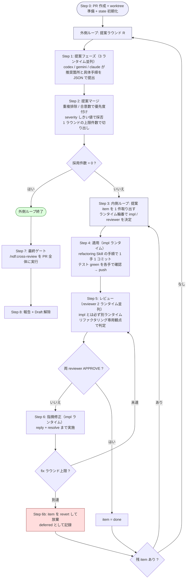

# Issue 113: cross-refactoring — 多ランタイム・リファクタリング収束ループ Skill

## 関連リンク

- GitHub Issue: https://github.com/devbasex/ai-plugins/issues/113
- 参考 Skill: `plugins/ndf-shared/skills/cross-review/SKILL.md`
- 参考 Skill: `plugins/ndf-shared/skills/refactoring/SKILL.md`
- 参考 Skill: `plugins/ndf-shared/skills/external-ai/SKILL.md`
- 参考 Skill: `plugins/ndf-shared/skills/fix/SKILL.md`

## 概要

`/ndf:cross-review` がレビューを収束させるのと同じ発想で、**リファクタリングを収束させる**
Skill `/ndf:cross-refactoring` を追加する。

codex / gemini / claude の 3 ランタイムに「どこを・どう直すか」を提案させ、提案ごとに
**実装ランタイムとレビューランタイムを必ず別にして** 適用とレビューを回す。個々の提案が
レビュー収束したら次の提案へ進み、全提案を消化したら**提案フェーズからやり直す**。
新しい提案が出なくなった時点で完了とする。

cross-review が「1 本のループ」なのに対し、cross-refactoring は **二重ループ**である点が
最大の構造差になる。

## 問題・背景

`refactoring` Skill は「テストで守りながら 1 手ずつ直す」手順を定めているが、次の 2 つを
持っていない。

1. **何を直すかの発見**。どのスメルに手を付けるかは人間または単一 AI の主観で決まっており、
   見落としが体系的に検出されない。
2. **直した結果の他者検証**。実装した本人（同一モデル）が自己レビューすると、選んだ手法の
   妥当性と「振る舞いが本当に変わっていないか」が構造的に検証されない。

cross-review は 2 の一部をレビュー段階で担うが、対象は「人間が作った PR」であり、
リファクタリング固有の観点（振る舞い不変、スメルと手法の対応、現状固定テストの妥当性、
scope creep）はレビュー観点テンプレートに含まれていない。

そこで、**発見・適用・検証を別ランタイムに分担させ、指摘が尽きるまで回す**ループを作る。

## 設計方針

### 1. 二重ループ



- **外側ループ = 提案ラウンド**。「指摘がなくなったら完了」の判定単位。
- **内側ループ = 提案 item ごとの適用とレビュー**。「指摘がなくなるまで繰り返し」の単位。

### 2. ランタイム輪番（同一ランタイムに実装とレビューをさせない）

3 ランタイムを固定順 `["codex", "gemini", "claude"]` に並べ、item ごとに次で決める。

```
impl      = RUNTIMES[(outer_round + item_index) % 3]
reviewers = RUNTIMES から impl を除いた 2 つ
```

- 実装 1 : レビュー 2 を常に維持する。レビュー多数決ではなく **2 者 APPROVE で通過**とする
  （リファクタリングは必須作業ではないため、疑義が残るなら通さない側に倒す）。
- 指摘の修正は **impl ランタイムが行う**。レビュアーに直させるとレビューの独立性が失われる。
- item ごとに輪番するので、1 ラウンド内でも実装者が入れ替わり、特定モデルの癖が PR 全体に
  偏らない。
- 割り当ては `state.json` の `items[].impl` / `items[].reviewers` に記録し、再開時も不変。

`claude` はホストランタイム（本 Skill を実行しているセッション自身）であり、CLI ではなく
**`Agent(subagent_type="general-purpose")` サブエージェント**として参加する。
codex / gemini はバックグラウンド CLI プロセスとして参加する。この非対称性は
状態機械（後述）が吸収する。

### 3. worktree はエージェント分用意する

```
<worktree-base>/<owner>--<repo>/rf<PR>/
├── work/              # 書き込み用。PR head ブランチを checkout（唯一の非 detach）
├── codex/             # 読み取り用。git worktree add --detach <sha>
├── gemini/            # 読み取り用。--detach
├── claude/            # 読み取り用。--detach
└── work/.cross_refactoring/   # state.json / prompt / result / log（tmp 集約先）
```

- `<worktree-base>` の解決順は cross-review と同じ（`NDF_WORKTREE_BASE` env >
  `<システム tmpdir>/ndf-worktrees`）。
- **同一ブランチを 2 つの worktree に checkout できない**という git の制約があるため、
  提案・レビュー用は必ず `--detach` にする。各フェーズ開始時に `git fetch` +
  `git checkout --detach <対象 sha>` で同期する。
- 読み取り専用でも worktree を分ける理由は 3 つ。
  1. レビュアーが**テストを実行して振る舞い不変を確認する**ため、書き込み可能な作業領域が要る
  2. テスト実行が生む生成物（`.pytest_cache` / `node_modules` / build 出力）が競合しない
  3. gemini の workspace 制約（workspace 外の `write_file` が拒否される）を、各自の worktree
     内に tmp を置くことで回避できる
- 実装は常に `work/` の中だけで行う。並列適用はしない（同一ブランチへの同時コミットは
  競合の温床であり、レビュー単位も曖昧になる）。**並列化するのは提案とレビューだけ**。

### 4. メイン駆動の状態機械（bash では Agent tool を呼べないため）

cross-review の light rotation が `exit 10` でメイン介入を要求しているのと同じ問題が、
本 Skill では**毎フェーズ**発生する（claude ランタイムの参加が Agent tool 経由のため）。
そこで、ループ全体を 1 つの bash で完結させる設計を最初から採らず、
**状態機械が「次にメインが何をすべきか」を返す**形にする。

```bash
eval "$("$SCRIPTS/refactor.py" next "$ID")"
# → ACTION=LAUNCH_PROPOSE  CLI_AGENTS=codex,gemini  AGENT_RUNTIME=claude  ROUND=1 ...
```

`ACTION` の一覧:

| ACTION | メインがすること |
|---|---|
| `LAUNCH_PROPOSE` | CLI ランチャを background 起動 → claude 提案 Agent を起動 → `monitor.py` で CLI 完了待ち |
| `MERGE_PROPOSALS` | `refactor.py merge-proposals` |
| `APPLY` | impl が claude なら Agent、codex/gemini なら CLI ランチャ + `monitor.py` |
| `MERGE_APPLY` | `refactor.py merge-apply` |
| `LAUNCH_REVIEW` | reviewer 2 つを同様に起動（claude が含まれるかで分岐） |
| `JUDGE_REVIEW` | `refactor.py judge-review` |
| `FIX` | impl ランタイムで指摘修正 |
| `ABANDON` | `refactor.py abandon-item`（revert + deferred 記録） |
| `NEXT_ITEM` / `NEXT_ROUND` | `refactor.py advance` |
| `FINAL_CROSS_REVIEW` | `/ndf:cross-review <PR>` を実行 |
| `DONE` | `refactor.py report` |

利点は 3 つ。

- メインの context に diff もレビュー本文も載らない（cross-review の設計方針を継承）
- どこで落ちても `next` を叩き直せば再開できる
- `claude` を輪番に含めても bash と Agent tool の境界を跨ぐ分岐が 1 箇所に閉じる

### 5. 振る舞い不変の担保（`refactoring` Skill への委譲）

適用フェーズのプロンプトは `refactoring` Skill の手順をそのまま踏ませる。状態機械側では
次を**機械的に検証**し、満たさない適用結果は失敗として扱う。

| 検証 | 方法 |
|---|---|
| 着手前にテストが green | `baseline_test` を state に記録。red なら item を `blocked` にして着手しない |
| テストが無い経路は先に現状固定テスト | `test_gap=true` の item は、固定テスト追加コミットが先行しているかを `git log` で確認 |
| 1 手 1 コミット | 適用結果 JSON の `commits[]` が 1 件以上、かつ各コミットでテスト実行結果が green |
| 差分予算 | `estimated_diff_lines` の 2 倍を超えたら失敗（scope creep 検知） |
| 機能変更の混入なし | レビュー観点で判定（機械判定は不可能なため reviewer に委ねる） |

### 6. 終了条件

| ループ | 終了条件 |
|---|---|
| 内側（item） | reviewer 全員 APPROVE / `--max-fix-rounds`（既定 3）到達で **revert して放棄** |
| 外側（ラウンド） | 採用 item 0 件 / `--max-outer-rounds`（既定 3）到達 / 提案の重複率が前ラウンド比 70% 以上（収束と見なす） |

**収束しない item は捨てる**のが cross-review との重要な差分である。レビュー指摘の修正は
必須だが、リファクタリングは任意作業なので、揉める提案は PR に残さない方が安全である。
放棄した item は `deferred_items` に理由付きで記録し、最終報告に列挙する。

### 7. PR の扱い

- Step 0 で base ブランチから `refactor/<slug>` を切り、**Draft PR** を作成する（`/ndf:pr` を利用）。
  最初のコミットは空コミットまたは最初の現状固定テストとする。
- コミットメッセージは `Refactor: <手法> — <対象>` に統一し、1 手 1 コミットを保つ。
- 完了時に Draft を解除する。
- PR ローテーションは **v1 では対象外**とする。`--max-items-per-round`（既定 5）と
  `--max-outer-rounds` で総量を抑える方針を先に採り、実運用で PR が肥大した場合に
  cross-review の `rotate-pr.sh` 再利用を検討する。

## state.json スキーマ

配置は `<worktree>/work/.cross_refactoring/cross-refactoring-rf<ID>-state.json`。
`<ID>` は最初に init した PR 番号（cross-review の `STATE_PR` と同じ役割）。

```json
{
  "id": 130,
  "repo": "devbasex/ai-plugins",
  "current_pr": 130,
  "base_branch": "main",
  "head_branch": "refactor/cross-refactoring-target",
  "worktree_root": "/tmp/ndf-worktrees/devbasex--ai-plugins/rf130",
  "worktrees": {"work": "...", "codex": "...", "gemini": "...", "claude": "..."},
  "target_scope": ["plugins/ndf-shared/skills/cross-review/scripts"],
  "runtimes": ["codex", "gemini", "claude"],
  "max_outer_rounds": 3,
  "max_fix_rounds": 3,
  "max_items_per_round": 5,
  "severity_threshold": "minor",
  "baseline_test": {"command": "pytest -q", "status": "green", "checked_at": "..."},
  "outer_round": 2,
  "phase": "review",
  "rounds": [
    {
      "round": 1,
      "proposed": {"codex": 9, "gemini": 7, "claude": 8},
      "merged": 14, "adopted": 5, "deferred": 9,
      "items": ["R1-001", "R1-002"]
    }
  ],
  "items": [
    {
      "item_id": "R1-001",
      "round": 1,
      "path": "scripts/state.py",
      "symbol": "cmd_merge_fix",
      "smell": "long_method",
      "technique": "extract_method",
      "severity": "major",
      "rationale": "...",
      "plan": "1. ... 2. ...",
      "test_gap": false,
      "estimated_diff_lines": 40,
      "proposed_by": ["codex", "gemini"],
      "impl": "codex",
      "reviewers": ["gemini", "claude"],
      "status": "done",
      "fix_rounds": 1,
      "commits": ["abc1234", "def5678"],
      "reviews": [
        {"round": 1, "gemini": "REQUEST_CHANGES", "claude": "APPROVE", "findings": 2},
        {"round": 2, "gemini": "APPROVE", "claude": "APPROVE", "findings": 0}
      ]
    }
  ],
  "deferred_items": [],
  "final": null
}
```

`status` の遷移: `pending` → `applying` → `reviewing` → (`fixing` → `reviewing`)* →
`done` / `abandoned` / `blocked`。

## 提案 item のスキーマ（3 ランタイム共通の提出形式）

```json
{
  "items": [
    {
      "path": "src/foo/bar.py",
      "symbol": "BarService.handle",
      "smell": "long_method",
      "technique": "extract_method",
      "severity": "major",
      "rationale": "1 メソッドに入力検証・変換・永続化が同居し、分岐が 7 本ある",
      "plan": "1. 検証部を validate_request として抽出\n2. 変換部を to_entity として抽出",
      "test_gap": false,
      "estimated_diff_lines": 40
    }
  ]
}
```

- `smell` は `refactoring/references/code-smells.md` の語彙に、`technique` は
  `refactoring/references/refactoring-catalog.md` の語彙に**限定する**。語彙外は
  マージ時に `unknown` として警告し、`nit` へ降格させる。語彙を固定しないと重複排除が効かない。
- 重複排除キーは `path` + `symbol` + `smell`。同一キーの提案は `proposed_by` を統合し、
  `rationale` / `plan` は最も具体的なものを採る。
- 優先度は `合意ランタイム数` → `severity` → `estimated_diff_lines` の昇順。
  **小さく合意の多いものから直す**。
- `severity_threshold`（既定 `minor`）未満は採用せず `deferred_items` に記録する。

## レビュー観点（cross-review とは別テンプレート）

`docs/03-review-viewpoints.md` に置き、reviewer プロンプトへ埋め込む。

| 観点 | 具体的に見るもの |
|---|---|
| 振る舞い不変 | 公開インタフェースの入出力、例外種別、副作用の順序、境界条件 |
| テストの妥当性 | 現状固定テストが実際にその経路を通しているか、実装詳細に結合していないか |
| 手法の適合 | 宣言された `smell` に対して `technique` が妥当か、別の手法の方が適切でないか |
| scope creep | 提案 `plan` の範囲を超えた変更が混ざっていないか、機能変更が混入していないか |
| 改善の実質 | 行数が動いただけでなく、責務・依存・可読性が実際に改善しているか |
| コミット分割 | 改名と中身の変更が同一コミットに混ざっていないか、1 手 1 コミットか |
| 性能退行 | ループ入れ替え・呼び出し回数増・N+1 の発生 |

判定は cross-review と同じく `APPROVE` / `REQUEST_CHANGES` の 2 値（`COMMENT` は使わない）。
インラインコメント最小化と body の「良い点」禁止も cross-review の規約を継承する。

## 追加・変更するファイル

### 新規

```
plugins/ndf-shared/skills/cross-refactoring/
├── SKILL.md
├── docs/01-state-and-propose.md      # Step 0〜2
├── docs/02-apply-and-review.md       # Step 3〜6
├── docs/03-review-viewpoints.md      # レビュー観点テンプレート
├── scripts/refactor.py               # 状態機械（uv 自己完結 / stdlib のみ）
├── scripts/prepare-worktrees.sh      # worktree をエージェント分作成・同期
├── scripts/launch-cli.sh             # codex / gemini を phase 引数で起動
├── prompts/propose.md                # 提案プロンプト雛形
├── prompts/apply.md                  # 適用プロンプト雛形
├── prompts/review.md                 # レビュープロンプト雛形
└── tests/                            # pytest
```

### 変更

- `plugins/ndf-shared/skills/cross-review/scripts/monitor.py` — 汎用化（下記 Task 9）
- `plugins/ndf-shared/skills/cross-review/scripts/_gemini-env.sh` — 新規抽出。
  `launch-gemini.sh` の trusted directory / settings sanitize 処理を切り出し、
  cross-refactoring から `$CLAUDE_PLUGIN_ROOT/skills/cross-review/scripts/_gemini-env.sh`
  として source する
- `plugins/ndf-shared/manifests/claude-skills.txt` — `cross-refactoring` を追加
- `plugins/ndf-claude/**` — `bash scripts/build-runtime-plugins.sh` による同期生成物
- `plugins/ndf-claude/.claude-plugin/plugin.json` — `8.0.0` → `8.1.0`
- `CLAUDE.md` / `README.md` / `docs/ndf-plugin-reference.md` /
  `docs/specifications/ndf-skill-inventory.md` / `plugins/ndf-claude/README.md` — Skill 数と
  新 Skill の記述

### v1 の配布範囲

**Claude Code のみ**に配布する（`claude-skills.txt` だけに追加）。ホストランタイムの
Agent tool を輪番に組み込む設計のため、Codex / Kiro へはそのまま移せない。
`statusline` / `google-auth` 等と同様、ランタイム別サブセットは既存の運用に沿う。
Codex / Kiro 版は「ホスト = そのランタイム、他 2 つを CLI」に一般化してから別 Issue で扱う。

## タスク分解

### Task 1: 状態機械の骨格

- **対象:** `scripts/refactor.py`, `tests/test_refactor_init.py`
- **内容:** `init` / `next` / `status` / `advance` を実装する。`init` は PR 番号・対象スコープ・
  各上限値を受け取り、リポジトリ情報と `baseline_test` を記録して state.json を生成する。
  `next` は state から次の `ACTION` を KEY=VALUE で stdout に出す。tmp ディレクトリ解決は
  cross-review の `_tmp_dir()` と同じ優先順（env > `<work worktree>/.cross_refactoring/`）にする。

### Task 2: worktree 準備

- **対象:** `scripts/prepare-worktrees.sh`, `tests/test_prepare_worktrees.py`
- **内容:** `work/`（head ブランチ）と `codex/` `gemini/` `claude/`（`--detach`）を冪等に作成する。
  既存パスが現リポジトリの登録済み worktree でなければ `.stale-<ts>` に退避して作り直す
  （cross-review の既存ガードを踏襲）。`sync <sha>` サブコマンドで読み取り用 worktree を
  指定 SHA へ `git fetch` + `checkout --detach` する。

### Task 3: 提案フェーズ

- **対象:** `scripts/launch-cli.sh`, `prompts/propose.md`, `refactor.py merge-proposals`,
  `tests/test_merge_proposals.py`
- **内容:** 3 ランタイムに同一プロンプトで提案させ、`propose-<agent>-rf<ID>-r<round>.json` に
  提出させる。`merge-proposals` が語彙検証・重複排除・優先度付け・しきい値による採否・
  1 ラウンド上限での切り出しを行い、`items[]` を生成する。
  提案プロンプトには `refactoring` Skill の `code-smells.md` / `refactoring-catalog.md` /
  `data-representation.md` を読ませ、**語彙をそこから選ばせる**。
  対象スコープ（`--scope PATH...`）を渡し、無制限に広がらないようにする。

### Task 4: 適用フェーズ

- **対象:** `prompts/apply.md`, `refactor.py merge-apply`, `tests/test_merge_apply.py`
- **内容:** impl ランタイムに item 1 件を渡し、`refactoring` Skill の手順で適用させる。
  戻り値 `apply-<item_id>.json`（`commits[]` / 各コミットのテスト結果 / 実差分行数 /
  `status`）を検証し、差分予算超過・テスト red・コミット 0 件を失敗として扱う。
  作業ディレクトリは `work/` に固定し、`--force` / `--no-verify` を禁止する。

### Task 5: レビューフェーズ

- **対象:** `prompts/review.md`, `docs/03-review-viewpoints.md`, `refactor.py judge-review`,
  `tests/test_judge_review.py`
- **内容:** reviewer 2 ランタイムを並列起動し、item の差分（`git diff <base_sha>..<head_sha>`）に
  対して上記観点でレビューさせる。指摘は PR にインラインコメントとして AI 自身が `gh api` で
  直接投稿する（cross-review と同じ「AI 直接投稿」方針でメイン context を汚さない）。
  `judge-review` は 2 者 APPROVE で `done`、1 つでも `REQUEST_CHANGES` なら `fixing` に遷移する。

### Task 6: 内側ループの収束と放棄

- **対象:** `refactor.py abandon-item`, `tests/test_abandon_item.py`
- **内容:** `fix_rounds >= max_fix_rounds` で item を放棄する。`git revert` で当該 item の
  コミット群を打ち消して push し、開いている review thread に理由を reply して resolve、
  `deferred_items` に記録する。**PR に中途半端な状態を残さない**ことを保証する。

### Task 7: 外側ループの収束判定

- **対象:** `refactor.py advance`, `tests/test_outer_convergence.py`
- **内容:** 採用 0 件 / `max_outer_rounds` 到達 / 前ラウンドとの提案重複率 70% 以上のいずれかで
  外側ループを終了する。重複率は `path`+`symbol`+`smell` キーの集合比較で求める。
  `final` に `converged` / `max_rounds` / `saturated` を記録する。

### Task 8: 最終ゲートと報告

- **対象:** `refactor.py report`, `SKILL.md`
- **内容:** 外側ループ終了後に `/ndf:cross-review <PR>` を実行し、PR 全体を codex + gemini の
  APPROVE 収束にかける（内側レビューは item 単位のため、PR 全体の整合はここで見る）。
  その後 Draft を解除し、ラウンド表・item 表・放棄 item・残 deferred 提案を報告する。

### Task 9: `monitor.py` の汎用化

- **対象:** `plugins/ndf-shared/skills/cross-review/scripts/monitor.py`,
  `plugins/ndf-shared/skills/cross-review/tests/test_monitor_generic_stem.py`
- **内容:** 多軸監視（pidfile / sentinel / 早期エラー / stall / hard timeout / result.json）は
  実運用で作り込まれた資産なので**複製しない**。次のオプションを後方互換で追加する。
  - `--tmp-dir DIR` — tmp 解決先の明示指定
  - `--agents codex,gemini,claude` — 監視対象エージェントの一般化（現行の `both` は維持）
  - `--stem-template "{agent}-{phase}-rf{id}"` — 既定は現行の `{agent}-review-pr{id}`
  - `--state-file PATH` — state.json のパス指定（現行の PR 番号からの導出も維持）

  **既存テストを 1 つも変更せずに通す**ことを完了条件とする。

### Task 10: SKILL.md と docs

- **対象:** `SKILL.md`, `docs/01-state-and-propose.md`, `docs/02-apply-and-review.md`
- **内容:** cross-review と同じ構成（設計方針表 / 引数表 / 全体フロー mermaid / ステップ骨組み /
  アンチパターン / 作業完了報告）で執筆する。frontmatter は
  `plugins/ndf-shared/skills/README.md` の規約に従い、`description` の 1 文目にトリガ語を置く。
  `python3 scripts/check-skill-frontmatter.py` を通す（`FRONTMATTER_TOTAL_MAX` の予算に
  収まらない場合は、予算値の見直しか既存 `description` の圧縮を同 PR で行う）。

### Task 11: テスト

- **対象:** `plugins/ndf-shared/skills/cross-refactoring/tests/`
- **内容:** cross-review の `tests/conftest.py` と同じ方式（一時ディレクトリに state.json を
  組み立てて subcommand を実行）で、`refactor.py` の全 subcommand を単体テストする。
  外部プロセス（gh / codex / gemini / git push）は呼ばない。最低限の観点:
  - `merge-proposals` の重複排除・語彙外降格・しきい値・上限件数
  - ランタイム輪番が impl と reviewer を必ず分離する（全 item で `impl not in reviewers`）
  - `judge-review` の遷移（2 APPROVE / 1 REQUEST_CHANGES / 欠損 result）
  - `abandon-item` が `max_fix_rounds` 到達時のみ発火する
  - 外側収束の 3 条件
  - `next` が各 phase で正しい `ACTION` を返す（再開の冪等性含む）

### Task 12: 配布物同期とドキュメント更新

- **対象:** `manifests/claude-skills.txt`, `plugins/ndf-claude/**`, `CLAUDE.md`, `README.md`,
  `docs/ndf-plugin-reference.md`, `docs/specifications/ndf-skill-inventory.md`,
  `plugins/ndf-claude/README.md`, `plugins/ndf-claude/.claude-plugin/plugin.json`
- **内容:** manifest 追加後に `bash scripts/build-runtime-plugins.sh` で同期し、
  `--check` / `scripts/validate-runtime-plugins.sh` / `python3 scripts/check-markdown-links.py` /
  `claude plugin validate` を通す。Skill 数の記述（30 → 31、Claude Code 26 → 27）を更新し、
  version を `8.1.0` に上げる。

## 受け入れ条件

- [ ] `/ndf:cross-refactoring` が Draft PR 作成から完了報告まで、中断・再開可能に一周する
- [ ] 全 item で実装ランタイムとレビューランタイムが重ならない（state.json で検証可能）
- [ ] worktree がエージェント分作られ、読み取り用は `--detach`、書き込みは `work/` のみ
- [ ] 提案 → 適用 → レビュー → 修正 の内側ループが、指摘 0 で `done` に到達する
- [ ] 収束しない item が revert され、PR に未完成の差分が残らない
- [ ] 提案が尽きる（または上限到達）で外側ループが終了し、`/ndf:cross-review` で最終収束する
- [ ] メインセッションの context に diff / レビュー本文 / エラーログが載らない
- [ ] `monitor.py` の既存テストが無変更で通る
- [ ] `claude plugin validate` / `build-runtime-plugins.sh --check` /
      `validate-runtime-plugins.sh` / `check-skill-frontmatter.py` / `check-markdown-links.py`
      が全て通る

## リスクと対応

| リスク | 対応 |
|---|---|
| 提案が発散して PR が肥大する | `--scope` 必須化、`--max-items-per-round`（既定 5）、`--max-outer-rounds`（既定 3） |
| 「振る舞い不変」が検証されないまま通る | 着手前 baseline green を必須化、`test_gap` の item は固定テスト先行を機械検証、レビュー観点の筆頭に置く |
| 同じ提案が毎ラウンド出続けて終わらない | 提案重複率 70% で `saturated` 終了。放棄 item は次ラウンドの提案プロンプトに「対象外」として渡す |
| モデルが語彙を守らず重複排除が効かない | 語彙外を `unknown` として `nit` 降格し、しきい値で自動的に落ちるようにする |
| CLI 実行時間が長く全体が長丁場になる | 提案とレビューは並列。適用は直列だが 1 item の差分が小さいため 1 回が短い。state.json で常時再開可能 |
| gemini の workspace 制約で write が失敗する | 各エージェント専用 worktree 内に tmp を置く。`_gemini-env.sh` に既存の trusted directory 対応を集約 |
| cross-review の `monitor.py` 変更が既存ループを壊す | 追加オプションは全て既定値で現行挙動を維持。既存テスト無変更通過を Task 9 の完了条件にする |

## やらないこと（v1 スコープ外）

- PR ローテーション（件数上限で総量を抑える方針を先に検証する）
- Codex / Kiro ランタイムへの配布（ホストランタイム一般化が前提。別 Issue）
- 複数 item の並列適用（同一ブランチへの同時コミットは競合とレビュー単位の曖昧化を招く）
- リファクタリング以外の変更（機能追加・不具合修正）の取り込み
