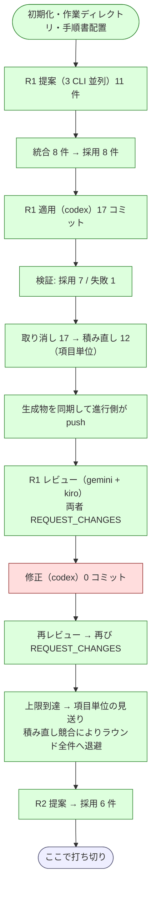

# cross-refactoring 再々検証

未到達だった 2 経路を実機で通した記録である。対象は Pull Request #125（Draft のまま閉じた）。

経緯は次の 2 つにある。

- [issue-113-cross-refactoring-trial-report.md](issue-113-cross-refactoring-trial-report.md) — 1 回目
- [issue-113-cross-refactoring-retrial.md](issue-113-cross-refactoring-retrial.md) — 2 回目

## 目的

次の 2 経路は 1 回目・2 回目とも一度も実行されていなかった。

- 指摘の修正と再レビューの繰り返し（`merge-fix` → 再 `review` → 再 `judge-review`）
- 上限到達時の項目単位の見送り（`should-abandon` → `abandon-items`）

どちらもレビューで指摘が出ることが前提で、2 回目はラウンド 1 で両レビュー担当とも
指摘 0 件だったため到達しなかった。

## 結果

**2 経路とも実機で成立した。** あわせて Pull Request #121 で入れた 3 経路も確認できた。
一方で新しく 4 件の不具合を見つけ、うち 1 件は生成物を持つリポジトリで進行を止める。

## 実行条件

| 項目 | 値 |
| --- | --- |
| ホスト | Claude Code（提案・レビューには不参加） |
| 提案・レビュー | codex / gemini / kiro |
| 適用の母集合 | claude / codex / kiro |
| 使用する版 | リポジトリ内の `plugins/ndf-claude`（v8.4.0） |
| ラウンド上限 | 3（実際は 2 ラウンド目の提案で打ち切り） |

指摘が出る確率を上げるため、修正の上限を 1 に下げ、1 ラウンドの採用上限を 8 へ上げた。
上限を下げると、指摘が 1 回の修正で解決しなかった時点で見送りへ進む。

```bash
export PLUGIN_ROOT=/work/ai-plugins/plugins/ndf-claude

/ndf:cross-refactoring 125 \
  --scope plugins/ndf-shared/skills/cross-refactoring/scripts \
          plugins/ndf-shared/skills/cross-refactoring/tests \
          plugins/ndf-shared/skills/cross-review/scripts/lib \
          plugins/ndf-shared/skills/cross-review/tests \
  --sync-command "bash scripts/build-runtime-plugins.sh" \
  --baseline-test "uv run --with pytest python -m pytest \
      plugins/ndf-shared/skills/cross-refactoring/tests \
      plugins/ndf-shared/skills/cross-review/tests -q" \
  --max-outer-rounds 3 --max-fix-rounds 1 --max-items-per-round 8
```

着手前のテストは 444 件が通った。

## 到達点



## 未到達だった 2 経路

### 指摘の修正と再レビュー

レビュー担当 2 者がともに変更要求を返し、修正フェーズを経て再レビューまで回った。

| ステップ | 観測 |
| --- | --- |
| `judge-review`（1 回目） | 「変更要求があります（未解決の指摘 2 件）」終了コード 2 |
| `should-abandon` | 「修正ラウンド 0 / 1 — まだ修正します」終了コード 2 |
| `fix` 起動 | 実装担当が起動し、240 秒で終了 |
| `merge-fix` | 修正ラウンドを 1 へ進め、取り込み済みとして完了 |
| 再レビュー | 2 者とも再び変更要求 |

指摘の内容は両者とも同じで、`cmd_merge_apply` の分割で状態辞書を一時的な引数の
受け渡しに使っている点を挙げていた。指摘には改善項目 ID が付いており、
差し戻しは発生しなかった。

### 上限到達時の項目単位の見送り

```
修正ラウンドが上限 1 に達しました。未解決の項目を見送ります
⚠ 42060bc を積み直せませんでした: error: could not apply 42060bc...
⚠ 残す項目を積み直せませんでした。このラウンドは全件取り消します
↩ 取り消し 47 コミット / 積み直し 0 コミット（ラウンド全件へ退避）
```

`drops` には項目単位（17 コミット）とラウンド全件（47 コミット）の両方が記録された。
退避後は種コミットとの差分が空になり、リモートの参照も一致した。手順書が
「この構成では退避が普通に起こる」と予告していたとおりの結果である。

## Pull Request #121 で入れた経路

| 対象 | 観測 |
| --- | --- |
| 公開の責務 | 実装担当は push せず、検証を通った後に進行側が push した |
| 生成物の同期 | `Chore: 生成物を同期する（cross-refactoring 進行側）` が push の直前に積まれた |
| 対象外への記録 | 差分予算を超えた項目が理由付きで記録され、次ラウンドで再提案されなかった |

対象外への記録は、ラウンド 2 の提案 8 件がラウンド 1 の対象と 1 件も重ならなかった
ことで確認できる。ラウンド 1 の対象は `cmd_merge_apply` / `monitor_agent` /
`cmd_merge_fix` / `cmd_judge_review` / `cmd_merge_proposals` / `_scan_patterns` の 6 つ、
ラウンド 2 は `aggregate` / `_drop_items` / `verify_apply_item` /
`_verify_and_classify_items` / `_find_item` の 5 つである。

## 見つけた不具合

### 12. 生成物の同期コミットが必ず失敗する

**進行が止まる。** 生成物を持つリポジトリでは、Pull Request #121 で一本化した
「進行側が push の直前に同期する」経路が毎回失敗する。

```
❌ コマンドが失敗しました (git add -- lugins/ndf-claude/.../refactor.py plugins/...):
   fatal: pathspec 'lugins/ndf-claude/.../refactor.py' did not match any files
```

`_git_out` は標準出力を `strip()` して返すが、`_worktree_changes` は
`git status --porcelain` を固定幅（状態 2 文字 + 空白 + パス）として `line[3:]` で
切り出す。未 stage の変更は状態コードが ` M` と先頭がスペースになるため、
`strip()` すると**出力の 1 行目だけ**パスの先頭 1 文字が欠ける。

| 出力 | 1 行目 | `line[3:]` |
| --- | --- | --- |
| 生 | `' M plugins/...'` | `plugins/...` |
| `strip()` 後 | `'M plugins/...'` | `lugins/...` |

2 回目は `--sync-command` が無く進行側が手で同期していたため、この経路が実機で
動いたのは 3 回目が初めてである。

**直し方**: 固定幅で読む出力には `strip` を適用しない。

### 13. 同期の後段で失敗すると差分が作業ツリーに残る

`_sync_generated` は同期コマンド自身の失敗では作業ツリーを元に戻すが、後段の
`git add` / `git commit` が失敗する経路では戻さない。不具合 12 の結果、同期が作った
6 ファイルの差分が残ったまま中断した。次の実行は清浄性の検査で止まるため、
手順書自身が警告している「保留中の push の再試行が永久に進まない」状態に入る。

**直し方**: 後段の失敗でも同じように差分を捨ててから中断する。

### 14. 実装担当がコミットを作れない条件が生じる

生成物の同期を pre-commit で検査するリポジトリでは、次の 3 つが同時に成立しない。

| 制約 | 出どころ |
| --- | --- |
| 生成物を同期しない | 手順書（同期は進行側の責務） |
| `--no-verify` を使わない | 手順書のアンチパターン |
| 生成物が同期されていなければコミットを拒否する | 対象リポジトリの pre-commit |

実測では、同じ実装担当がフェーズによって違う行動を取った。

| フェーズ | 行動 | 結果 |
| --- | --- | --- |
| 適用 | `git -c core.hooksPath=/dev/null commit` でフックを迂回 | 17 コミット |
| 修正 | 迂回せず、コミットを作れないと報告 | 0 コミット、指摘は未解決 |

公開は進行側が検証を通してから行うので、実装担当のコミット時点で生成物が古いのは
設計どおりである。手順書がそれを書いていないため、判断がランタイム任せになっている。
`--no-verify` だけを名指しで禁じている点も、同じことが別の手段で起こる余地を残す。

修正フェーズで実装担当が直した内容を作業ツリーに残したまま終えたため、続く
`merge-fix` も清浄性の検査で中断した（終了コード 4）。検証を受けていない変更は
そのまま捨ててよいので、`merge-fix` が自分で捨てて修正 0 件として続行できる。

**直し方**: 実装担当のコミットでは生成物の検査を通す必要がないことを手順書に明示し、
迂回の手段を 1 つに定める。

### 15. 見送りの後に読み取り用の作業ディレクトリを同期していない

次のラウンドの提案が、存在しないコードに対して行われる。

読み取り用の同期は `merge-apply` と `merge-fix` の直後にしかなく、`abandon-items` の
直後には無い。取り消しは HEAD を進めるため、同期しないと読み取り用は取り消し前の
状態に取り残される。

| 作業ディレクトリ | HEAD |
| --- | --- |
| 書き込み用 | `bfbe628`（取り消し後） |
| 読み取り用（kiro） | `3c1f293`（取り消し前） |

その結果、ラウンド 2 で kiro の提案 3 件のうち 2 件が、ラウンド 1 で実装担当が作り
全件取り消しで消えた関数を対象にしていた。現在の HEAD に存在しないことは検索で
確認している。

```
$ grep -c "def _verify_and_classify_items" work/.../refactor.py
0
```

統合は対象の実在を検査しないため、この 2 件はそのまま採用された。

**直し方**: 提案フェーズの直前で毎回同期する。HEAD が変わっていなければ何も起きない。

## 運用上の観測

進行を止めるものではないが、実行時に踏んだ事象を残す。

| 事象 | 内容 |
| --- | --- |
| モデルの混雑で参加者が欠ける | 認証確認は通るのに、モデルの空きが無いと 15 秒で終了する。監視は結果なしと報告するが進行は止まらず、母集合が 1 人欠けたまま進みうる |
| 提案フェーズの既定タイムアウト | 適用フェーズには 3600 秒を明示しているが、提案は既定の 420 秒のまま。実測は gemini 105〜120 秒 / kiro 270〜285 秒 / codex 90〜285 秒で、混雑時に超えた |

## 集計

| ラウンド | 実装担当 | レビュー担当 | 採用 | 適用 | 見送り | 修正 | 初回承認 |
| --- | --- | --- | ---: | ---: | ---: | ---: | --- |
| 1 | codex | gemini / kiro | 8 | 7 | 1 | 1 | いいえ |
| 2 | kiro | codex / gemini | 6 | 0 | 0 | 0 | — |

ラウンド 1 の適用は 28 分（1682 秒）、レビューは 2 者並列で 4 分前後だった。
モデルはすべて既定のため、ランタイム間の比較には使えない。

## 構造改善の成果をどう扱ったか

ラウンド 1 の 8 項目はすべて見送った。差分予算を超えた 1 件を除く 7 件は、
レビュー指摘が修正ラウンドの上限内に解決しなかったためである。取り消しの積み直しが
競合したため、ラウンド全件への退避となった。

再々検証の目的は「未到達の 2 経路が実機で成立するか」を確かめることであり、
その目的は達している。

## 次にすること

不具合 12〜15 を修正する。12 と 13 は進行を止めるため優先度が高い。

- 固定幅で読む出力に `strip` を適用しない（12）
- 同期の後段で失敗したときも差分を捨てる（13）
- 実装担当のコミットとフックの関係を手順書に明示する（14）
- 提案フェーズの直前で読み取り用を同期する（15）

あわせて、提案フェーズにも明示のタイムアウトを置くか既定を引き上げる。

別件として、`cross-review` が投稿の成否を突き合わせていない課題が残っている。
結果ファイルの申告だけで判定が進むため、投稿に失敗した指摘を取りこぼしうる。
