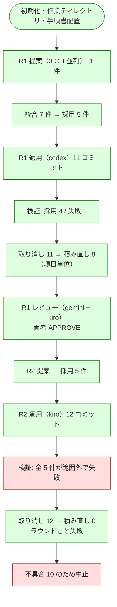

# cross-refactoring 修正後の再検証

不具合 9 件の修正（[issue-113-cross-refactoring-defect-fixes.md](issue-113-cross-refactoring-defect-fixes.md)、
NDF v8.2.0）を実機で確かめた記録である。対象は PR #120（Draft のまま閉じた）。

前回（PR #118）は適用結果の検証で失敗した項目を取り消す経路が破綻し、
レビューフェーズより先へ一度も進めなかった。今回の目的は**その先を通すこと**にある。

## 実行条件

| 項目 | 値 |
| --- | --- |
| ホスト | Claude Code（提案・レビューには不参加） |
| 提案・レビュー | codex / gemini / kiro |
| 適用の母集合 | claude / codex / kiro |
| 使用する版 | リポジトリ内の `plugins/ndf-claude`（v8.2.0）。プラグインキャッシュ（8.1.0）は使わない |
| ラウンド上限 | 3 |

```bash
PLUGIN_ROOT=/work/ai-plugins/plugins/ndf-claude

/ndf:cross-refactoring 120 \
  --scope plugins/ndf-shared/skills/cross-refactoring/scripts \
          plugins/ndf-shared/skills/cross-refactoring/tests \
          plugins/ndf-shared/skills/cross-review/scripts/lib \
  --baseline-test "uv run --with pytest python -m pytest \
      plugins/ndf-shared/skills/cross-refactoring/tests \
      plugins/ndf-shared/skills/cross-review/tests -q"
```

`--scope` に**テストの置き場所を含める**。範囲は適用結果の検証にも効くようになったため、
含めないと `test_gap` が真の項目で「テストを先に足せ」と「範囲外を触るな」が両立しない。

## 確かめること

修正した 9 件が実機で成立するか。

| # | 直したこと | 何が観測できれば通ったと言えるか |
| --- | --- | --- |
| 1 | 取り消しの巻き戻しと積み直し | 検証に失敗した項目だけが消え、合意済みの項目が残る。分離できない位置関係なら `rounds[].drops[].mode = round` が記録される |
| 2 | 中断と全件失敗の区別 | 取り消しに失敗したら終了コード 4 で進行が止まる（次の提案ラウンドへ進まない） |
| 3 | 判定の逐次記録 | `rounds[].apply_progress` に項目ごとの判定が残る |
| 4 | 再送信の印 | 取り消しが Pull Request へ反映される。`pending_push` が残らない |
| 5 | 範囲の検査 | 配布物 3 系統が実装担当の差分に現れない |
| 6 | 提案結果のラウンド別保存 | `<ランタイム>-propose-rf<ID>-r<ラウンド>-result.json` が巡ごとに残る |
| 7 | gemini の読み取り | gemini の提案が語彙内で返る（`read_file` が拒否されない） |
| 8 | 語彙の列挙 | 3 ランタイムとも `smell` / `technique` が英字の識別子で返る |
| 9 | 認証の確認 | 初期化時に 4 CLI の認証状態が出力される |

## 前回まったく実行できていない範囲

ここを通すことが今回の主目的である。

- レビュー担当 2 者の並列実行と指摘の投稿、承認判定
- 指摘の修正と再レビューの繰り返し、上限到達時の項目単位の見送り
- 実装担当の輪番
- 提案の重複率による収束判定
- 集計値（`report --metrics`）の出力

## 結果

**修正した 9 件はすべて実機で成立した。** 前回は適用結果の検証で失敗した項目を取り消す
経路が破綻して停止したが、今回はレビュー・判定・輪番・集計まで到達した。
一方で**新しい不具合を 2 件見つけ**、うち 1 件は収束ループを実質的に不能にする。

## 到達点



前回の到達点は `V1` の直前までだった。

## 修正 9 件の実機確認

| # | 直したこと | 実機での観測 |
| --- | --- | --- |
| 1 | 取り消しの巻き戻しと積み直し | `取り消し 11 コミット / 積み直し 8 コミット（項目単位）`。失敗した 1 項目だけを落とし、**同じ `refactor.py` を触る 3 項目 6 コミットを積み直した** |
| 2 | 中断と全件失敗の区別 | push 失敗で終了コード 4。次の提案ラウンドへ進まず停止した |
| 3 | 判定の逐次記録 | `rounds[].apply_progress` に全項目の判定が残った |
| 4 | 再送信の印 | 中断を跨いで `pending_push` が残り、次の実行が**処理済み判定より先に** push を再送した |
| 5 | 範囲の検査 | 範囲外コミットを検出して項目を失敗にした（R1-004 / R2 全件） |
| 6 | 提案結果のラウンド別保存 | `*-propose-rf120-r1-result.json` と `-r2-` が**両方残った** |
| 7 | gemini の手順書読み取り | `.gemini/settings.json` が配置され、差分にも出なかった |
| 8 | 語彙の列挙 | 3 ランタイムとも `smell` / `technique` を英字の識別子で返した |
| 9 | 認証の確認 | 初期化時に 4 CLI の認証状態を出力した |

不具合 1 は、**前回破綻したのと同じ条件**（採用項目の多くが同一ファイルを触る）で成立した。

## 前回まったく実行できていなかった範囲

| 対象 | 結果 |
| --- | --- |
| レビュー担当 2 者の並列実行と承認判定 | ✅ gemini / kiro を並列起動し、両者 `APPROVE` で `judge-review` が終了コード 0 |
| 実装担当の輪番 | ✅ R1 codex → R2 kiro。レビュー担当も gemini+kiro → codex+gemini へ入れ替わった |
| 提案ラウンドの収束判定 | ✅ `advance` が継続を判定 |
| 集計値の出力 | ✅ `report --metrics` が実装担当・レビュー担当の表と、`auto` モデルの分離注記まで出した |
| 指摘の修正と再レビューの繰り返し | ❌ **未到達**。R1 は指摘 0 件、R2 は適用が全件失敗したため |
| 上限到達時の項目単位の見送り | ❌ **未到達**（同上） |

## 新しく見つかった不具合

### 10. pre-push の同期検査と範囲ルールが両立しない

このリポジトリは `.githooks/pre-push` で生成物の同期を検査する。一方この Skill は
「実装担当は編集元だけを触る / 生成物の同期は**進行側が収束後に**まとめて行う」と決めた。
この 2 つは両立しない。

```console
$ git push origin refactor/cross-refactoring-retrial
Generated directory is out of date: plugins/ndf-claude/skills
exited 1
```

**実装担当の push も、取り消しを反映する進行側の push も落ちる。** 結果、検証を通って
いない R1-004 の変更が Pull Request に残った（取り消しはローカルのみ）。
**不具合 4 が防ごうとした状態そのもの**である。

さらに悪いことに、**この検査は実装担当を範囲ルール違反へ誘導する。** ラウンド 2 で
kiro は push を通すために配布物 3 系統を同期し、その結果**採用 5 件が全件範囲外で失敗**
して 1 ラウンドを丸ごと失った。

| ラウンド | 実装担当 | 配布物を同期したか | 適用成功 |
| --- | --- | --- | ---: |
| 1 | codex | しなかった（push は失敗のまま放置） | 4 / 5 |
| 2 | kiro | した（4 コミットすべてで） | 0 / 5 |

「収束後にまとめて同期する」という決定が、**ループの途中で push が起きること**を
見落としていた。

**修正の方向**: 実装担当に push させず、**検証を通った後で進行側だけが push する**。
同期はその直前に行う（`--sync-command` を新設し、状態ファイルへ保持する）。
これで「未検証の変更が公開される」経路自体が無くなり、不具合 4 は緩和ではなく根絶できる。

本再検証では、進行側が生成物を同期するコミットを積んで回避した。

### 11. 適用で失敗した項目が「対象外」に入らない

手順書は「見送った項目は理由付きで記録し、次ラウンドの提案時に**対象外として渡す**。
そうしないと同じ提案が毎ラウンド出続けて収束しない」と定めている。しかし
`merge-apply` の失敗経路だけがこの記録を行わない（`deferred_items` に入らない）。

実測では、ラウンド 1 で失敗した `monitor.py#monitor_agent`（R1-004）が
**3 ランタイム全員から再提案され、合意 3 で最優先に採用された**（R2-001）。
同じ理由で必ず失敗するため、ラウンドを 1 つ丸ごと消費する。

**修正の方向**: `merge-apply` が失敗させた項目も `deferred_items` へ理由付きで記録する。

## 運用上の注意

`--scope` には、範囲内の各ソースに対応する**テストの置き場所をすべて**含める。
今回は `cross-review/scripts/lib` を範囲に入れながら `cross-review/tests` を入れ忘れた
ため、`monitor.py` の現状固定テストが範囲外となり R1-004 が失敗した。
**検査は正しく働いている**（指定の誤り）。

## 構造改善の成果をどう扱ったか

ラウンド 1 では 4 項目が採用・検証・レビュー承認まで通った。

| ID | 対象 | 手法 |
| --- | --- | --- |
| R1-001 | `refactor.py#cmd_merge_apply` | `extract_method` |
| R1-002 | `metrics.py#aggregate` | `extract_method` |
| R1-003 | `refactor.py#cmd_merge_fix` | `extract_method` |
| R1-005 | `refactor.py#cmd_merge_apply` | `consolidate_duplication` |

ラウンド 2 の 12 コミットは全件取り消した。

**この 4 項目は取り込まなかった。** 不具合 10・11 の修正が同じ `refactor.py` を
大きく変えたため、取り込むには手でコンフリクトを解消する必要があり、そうすると
**「2 者のレビューを通った内容」という性質が失われる**（解消した結果は誰も見ていない）。
同じ提案は再々検証でまた出る見込みなので、このレポートだけを残した。

再検証そのものの目的は「収束ループが実機で成立するか」を確かめることであり、
その目的は達している。

## 次にすること

不具合 10 と 11 は修正済み（PR #121）。

- 実装担当は push しない。公開は進行側が検証を通した後に行う
- 生成物の同期は `--sync-command` として push の直前に進行側が実行する
- 適用で失敗した項目も「対象外」として記録する

これを前提に、**指摘の修正と再レビューの繰り返し**と**上限到達時の項目単位の見送り**を
通す再々検証を行う。実行時は次の 2 点に注意する。

- `--scope` に、範囲内の各ソースに対応するテストの置き場所をすべて含める
- 生成物を持つリポジトリでは `--sync-command` を必ず指定する
