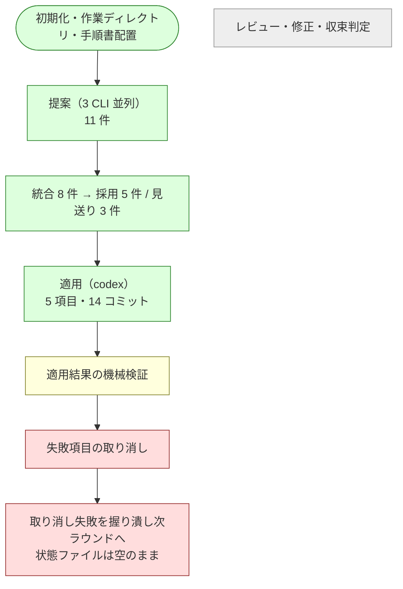

# cross-refactoring 実機検証レポート

`/ndf:cross-refactoring` を自分自身のスクリプト群へ適用し、収束ループが実機で成立するかを確かめた。
**提案フェーズは設計どおり動いたが、適用結果の検証で失敗した項目を取り消す経路が破綻し、
進行を続行できない状態になった。** 発見した不具合は 9 件で、うち 6 件は収束ループの続行を妨げる。

## 実行条件

| 項目 | 値 |
| --- | --- |
| 対象 | Pull Request #118（Draft） |
| 範囲 | `plugins/ndf-shared/skills/cross-refactoring/scripts` / `plugins/ndf-shared/skills/cross-review/scripts/lib` |
| ホスト | Claude Code（提案・レビューには不参加） |
| 提案・レビュー | codex / gemini / kiro |
| 適用の母集合 | claude / codex / kiro |
| モデル | 各 CLI の既定（kiro は `auto` のため計測集計の対象外） |
| ラウンド上限 | 3 |
| 着手前テスト | 387 件成功（23.6 秒） |

## 到達点



所要時間は提案が 135〜180 秒、適用が 1,066 秒だった。

## 設計どおり働いた部分

| 機能 | 確認できたこと |
| --- | --- |
| 母集合の決定 | ホストを提案・レビューから除外し、適用は 3 者の輪番で割り当てた |
| 並列起動と監視 | 3 つの外部プロセスを起動し、経過・停滞・異常終了を検知した |
| 提案の統合 | 対象と兆候が同じ提案を 1 件へまとめ、合意数と重要度で優先度を付けた |
| 差分予算の検証 | 見積もりの 3 倍に膨らんだ変更を範囲逸脱として捕まえた（実差分 668 行 / 予算 220 行） |
| 実行主体の記録 | 全 14 コミットに改善項目・ラウンド・実行ランタイム・モデルの 4 項目が入った |

## 不具合

進行を止めるものから順に並べる。

### 1. 取り消しが他の改善項目のコミットと競合して失敗する

検証に失敗した改善項目を取り消そうとして、同じファイルを後から変更した別項目のコミットと競合した。

```text
❌ R1-002 のコミット ea3209c を取り消せませんでした: error: could not revert ea3209c...
hint: After resolving the conflicts, mark them with "git add/rm <pathspec>"
```

手順書は「取り消しは履歴から新しい順に並べ直す」と定めているが、この並べ替えは**同じ項目に属する
コミットの中でしか働かない**。取り消し対象より新しい別項目のコミットが同じ箇所を触っていると、
必ず競合する。採用した 5 件のうち 4 件が同一ファイルの隣接領域を変更していた。

### 2. 取り消しに失敗しても中断しない

手順書は「取り消しに失敗したら、着手前の状態まで戻してから中断する」と定めている。
実機では中断せず「全件失敗」として次の提案ラウンドへ進み、検証を通っていない変更が
Pull Request に残ったまま、その上で新しい提案が始まった。

戻した先も着手前ではなく、取り消しが途中まで進んだ地点だった。

### 3. 適用結果が状態ファイルへ記録されない

検証が中断したため、適用の記録が一切残らなかった。

```console
$ jq -r '.items[] | "\(.item_id) status=\(.status) commits=\(.commits|length)"' <状態ファイル>
R1-001 status=pending commits=0
R1-002 status=pending commits=0
R1-003 status=pending commits=0
R1-004 status=pending commits=0
R1-005 status=pending commits=0

$ jq -r '.rounds[0].apply' <状態ファイル>
{"applied": [], "failed": [], "base_sha": null, "head_sha": null}
```

一方でリポジトリには 14 件の適用コミットと 3 件の取り消しコミットが存在した。
**どのコミットが検証を通ったのかを状態から復元できず、同じ手順を叩き直しても再開できない。**
再開可能性は収束ループの前提なので、ここが崩れると中断からの復帰手段が無くなる。

### 4. 検証を通っていない変更が公開されたまま残る

実装担当は改善項目ごとに変更を公開する。取り消しは手元にしか無く公開されなかったため、
Pull Request 側には検証を通っていない 14 件が残り、取り消し 3 件は反映されなかった。
再送信を促すための印も立っていなかった。

### 5. 範囲外のファイル変更を検証しない

指定した範囲は編集元のみだが、実際には配布物 3 系統も変更されていた。

```console
$ git diff --name-status e6d7222 HEAD
M	plugins/ndf-claude/skills/cross-refactoring/scripts/refactor.py
M	plugins/ndf-claude/skills/cross-review/scripts/lib/metrics.py
M	plugins/ndf-codex/skills/cross-refactoring/scripts/refactor.py
M	plugins/ndf-codex/skills/cross-review/scripts/lib/metrics.py
M	plugins/ndf-kiro/skills/cross-refactoring/scripts/refactor.py
M	plugins/ndf-kiro/skills/cross-review/scripts/lib/metrics.py
M	plugins/ndf-shared/skills/cross-refactoring/scripts/refactor.py
M	plugins/ndf-shared/skills/cross-review/scripts/lib/metrics.py
```

このリポジトリでは編集元から配布物を生成する規約があり、実装担当の判断自体は規約に沿う。
しかし範囲を必須にした目的（提案の発散と変更の肥大を防ぐ）からは外れ、
差分が 4 倍に膨らんで差分予算の超過を招いた。範囲の指定が検証に反映されていない。

### 6. 提案の記録が次のラウンドで上書きされる

結果ファイルの名前に、提案フェーズだけラウンド番号が入らない。

| フェーズ | ファイル名 |
| --- | --- |
| 提案 | `<ランタイム>-propose-rf118-result.json` |
| 適用 | `<ランタイム>-apply-r1-result.json` |
| レビュー | `<ランタイム>-review-r1-result.json` |

外部プロセスの起動時に同名の結果ファイルを削除する実装のため、
2 巡目の提案が始まった時点で 1 巡目の提案内容が失われた。
統合後の採否は状態ファイルに残るが、**各ランタイムが何をどう提案したかは復元できない**。

### 7. 手順書を配置しても gemini が読めない

生成物を差分に出さないため、配置先へ全件無視の設定を置いている。gemini はこの設定を
読み取りにも適用するため、配置した手順書を一切開けなかった。

```text
Error executing tool read_file: File path '.../.gemini/skills/refactoring/SKILL.md'
is ignored by configured ignore patterns.
```

手順書自身が「兆候と手法の語彙を読ませないと提案が語彙外になって全件降格する」と書いている
前提が、実機では成立していない。作業ディレクトリ限定で読み取り側の除外を無効にすると解消した。
設定の項目名は gemini の版で変わるため、新旧どちらの形式でも書く必要がある（0.55.1 で確認）。

### 8. 語彙の許容値をプロンプトが列挙していない

上記を解消して手順書を読ませたところ、gemini は語彙を日本語で出力した。

| ランタイム | 兆候 | 手法 |
| --- | --- | --- |
| codex | `long_method` | `extract_method` |
| kiro | `long_method` | `extract_method` |
| gemini | `長すぎるメソッド` | `メソッドの抽出` |

提案プロンプトは「手順書の語彙に限定する」と述べ、記入例に英字の識別子を 1 つ示すだけで、
**許容値を列挙していない**。手順書の見出しは日本語なので、読んだ側が日本語を語彙と解釈する。

重要度は妥当に判定されていたにもかかわらず、語彙外の降格規則により最低の重要度へ落ち、
しきい値未満として全件が見送られた。gemini の提案 4 件はいずれも内容としては妥当で、
うち 1 件は他のランタイムも同じ箇所を指摘していた。

### 9. 初期化が外部 CLI の認証状態を確認しない

初期化は必要な CLI の存在だけを確認する。未認証の CLI は起動から 15 秒で終了し、
結果ファイルを残さないまま提案・レビューの担当から脱落した。

```console
$ kiro-cli whoami
Not logged in
```

初期化は成功として扱われるため、参加者が 1 人欠けた構成のまま進行する。

## 検証できていない範囲

以下は適用フェーズで停止したため実行に至っていない。**動作は未確認であり、
問題が無いことを示すものではない。**

- レビューフェーズ（レビュー担当 2 者の並列実行、指摘の投稿、承認判定）
- 指摘の修正と再レビューの繰り返し、修正上限到達時の項目単位の見送り
- 実装担当の輪番（2 巡目の割り当てまでは確認したが実行していない）
- 提案の重複率による収束判定
- Pull Request 全体を対象とした最終確認との連携
- 集計値の出力

## 修正の方向

| 不具合 | 方向 |
| --- | --- |
| 1 | 取り消しの単位を見直す。項目ごとの取り消しを保つなら、範囲内の全項目を新しい順にまとめて戻し、残す項目を積み直す |
| 2 | 取り消しの失敗を握り潰さず、着手前へ戻して進行を止める |
| 3 | 検証の途中経過を逐次記録し、中断しても到達点が状態から読めるようにする |
| 4 | 取り消しの反映が完了するまで印を残し、次の実行で再送信する |
| 5 | 指定した範囲の外を触った変更を検証で捕まえる。生成物の同期が必要な構成では、同期を進行側の責務として分離する |
| 6 | 提案の結果ファイル名にもラウンド番号を入れる |
| 7 | 手順書の配置先で読み取り側の除外を無効にする設定を併せて置く |
| 8 | 許容値をプロンプトへ機械的に列挙する。検証側が語彙集合を持っているので、そこから生成できる |
| 9 | 初期化で各 CLI の認証状態を確認し、未認証なら失敗させる |

## Pull Request の状態

検証を通っていない変更を残さないため、対象範囲を着手前の内容へ戻した。
現在の内容は着手前と一致し、テストは 387 件成功する。
